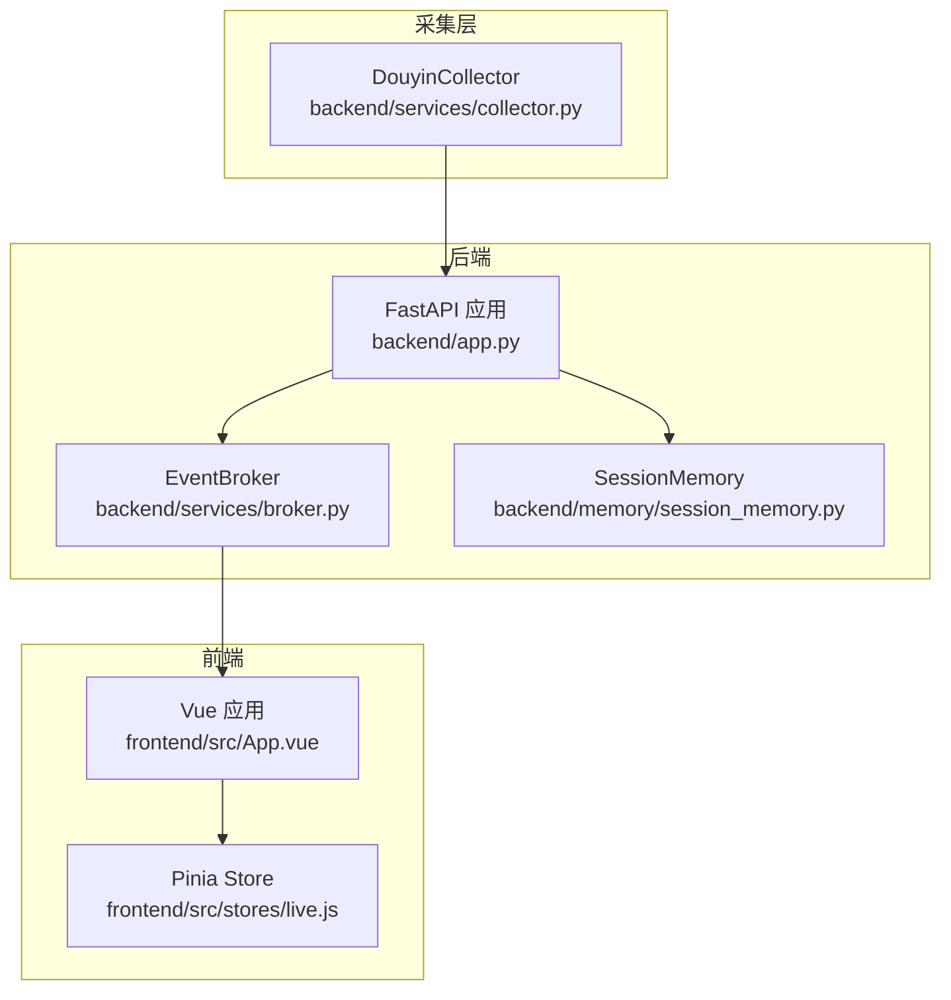
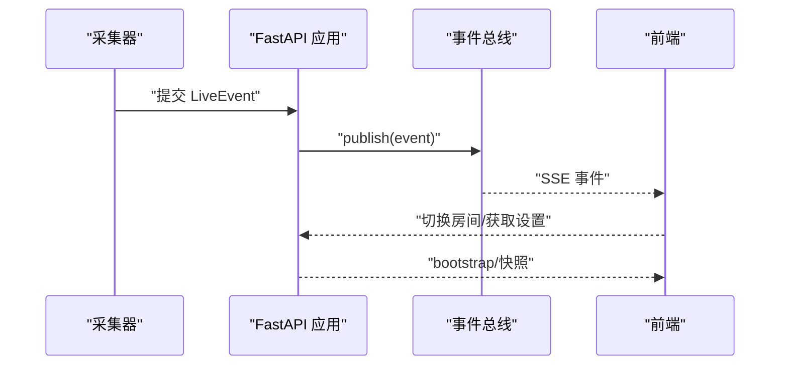
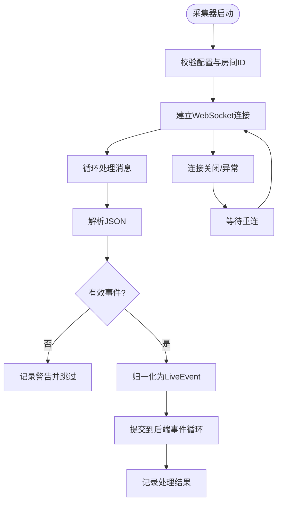
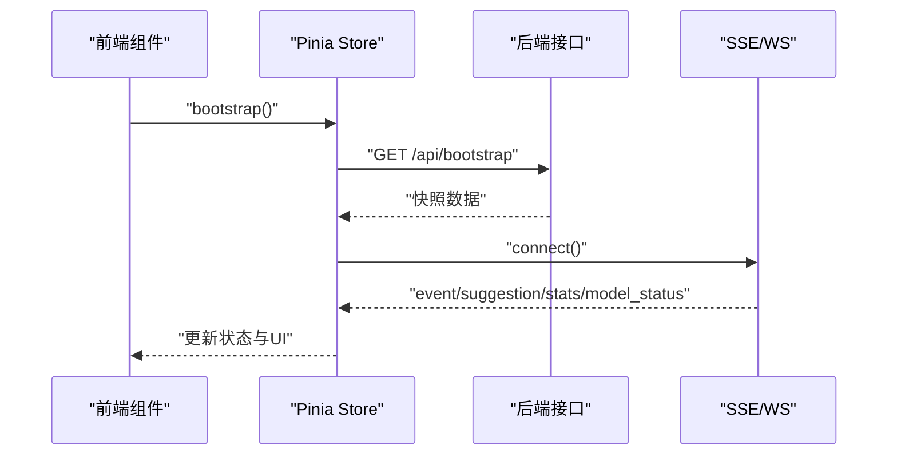
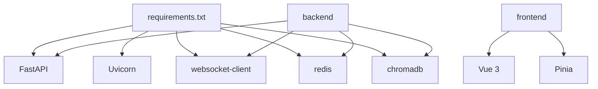

# 日志分析与监控

<cite>
**本文引用的文件**   
- [backend/app.py](file://backend/app.py)
- [backend/config.py](file://backend/config.py)
- [backend/services/collector.py](file://backend/services/collector.py)
- [backend/services/broker.py](file://backend/services/broker.py)
- [backend/memory/session_memory.py](file://backend/memory/session_memory.py)
- [frontend/src/main.js](file://frontend/src/main.js)
- [frontend/src/App.vue](file://frontend/src/App.vue)
- [frontend/src/stores/live.js](file://frontend/src/stores/live.js)
- [README.md](file://README.md)
- [requirements.txt](file://requirements.txt)
- [logs/backend.out.log](file://logs/backend.out.log)
- [logs/backend.err.log](file://logs/backend.err.log)
- [frontend/frontend.out.log](file://frontend/frontend.out.log)
- [frontend/frontend.err.log](file://frontend/frontend.err.log)
</cite>

## 目录
1. [简介](#简介)
2. [项目结构](#项目结构)
3. [核心组件](#核心组件)
4. [架构总览](#架构总览)
5. [详细组件分析](#详细组件分析)
6. [依赖分析](#依赖分析)
7. [性能考量](#性能考量)
8. [故障排查指南](#故障排查指南)
9. [结论](#结论)
10. [附录](#附录)

## 简介
本指南面向DouYin_llm项目的日志分析与监控，覆盖后端FastAPI、采集器（DouyinCollector）与前端Vue三端的日志结构与解读方法，包括请求日志、错误日志、性能日志的识别要点；同时提供日志级别设置、日志轮转配置、远程日志收集的监控方案建议，以及日志分析工具与常见日志模式的识别方法。

## 项目结构
项目采用“采集器 + FastAPI后端 + Vue前端”的三层结构。采集器负责从本地WebSocket接收抖音直播事件，后端进行事件归一化、持久化、记忆抽取与实时推送，前端通过SSE/WS订阅事件并渲染界面。

图表来源
- [backend/app.py:108-126](file://backend/app.py#L108-L126)
- [backend/services/collector.py:38-100](file://backend/services/collector.py#L38-L100)
- [backend/services/broker.py:10-40](file://backend/services/broker.py#L10-L40)
- [backend/memory/session_memory.py:17-113](file://backend/memory/session_memory.py#L17-L113)
- [frontend/src/App.vue:1-139](file://frontend/src/App.vue#L1-L139)
- [frontend/src/stores/live.js:1-846](file://frontend/src/stores/live.js#L1-L846)

章节来源
- [README.md:19-21](file://README.md#L19-L21)
- [backend/app.py:108-126](file://backend/app.py#L108-L126)
- [backend/services/collector.py:38-100](file://backend/services/collector.py#L38-L100)
- [backend/services/broker.py:10-40](file://backend/services/broker.py#L10-L40)
- [backend/memory/session_memory.py:17-113](file://backend/memory/session_memory.py#L17-L113)
- [frontend/src/App.vue:1-139](file://frontend/src/App.vue#L1-L139)
- [frontend/src/stores/live.js:1-846](file://frontend/src/stores/live.js#L1-L846)

## 核心组件
- 后端FastAPI应用：提供REST、SSE与WebSocket接口，负责事件处理、内存与持久化、模型状态与统计广播。
- 采集器DouyinCollector：连接本地WebSocket，解析消息为标准事件，提交至后端事件循环。
- 事件总线EventBroker：在后端内部广播事件，供SSE与WebSocket订阅。
- 前端Vue应用与Pinia Store：通过SSE订阅事件流，维护房间、过滤器、主题、模型状态与ViewerWorkbench状态。

章节来源
- [backend/app.py:108-126](file://backend/app.py#L108-L126)
- [backend/services/collector.py:38-100](file://backend/services/collector.py#L38-L100)
- [backend/services/broker.py:10-40](file://backend/services/broker.py#L10-L40)
- [frontend/src/App.vue:1-139](file://frontend/src/App.vue#L1-L139)
- [frontend/src/stores/live.js:1-846](file://frontend/src/stores/live.js#L1-L846)

## 架构总览
后端启动时初始化采集器、内存与向量存储，并在lifespan中启动/停止采集器。事件经采集器进入后端，写入短期会话内存、长期存储与向量库，随后通过事件总线广播给SSE与WebSocket。前端通过SSE订阅事件、建议、统计与模型状态，实时更新UI。

图表来源
- [backend/app.py:108-126](file://backend/app.py#L108-L126)
- [backend/services/collector.py:182-196](file://backend/services/collector.py#L182-L196)
- [backend/services/broker.py:28-40](file://backend/services/broker.py#L28-L40)
- [frontend/src/stores/live.js:474-523](file://frontend/src/stores/live.js#L474-L523)

## 详细组件分析

### 后端FastAPI日志结构与解读
- 日志格式与级别
  - 后端使用标准库日志，格式包含级别、名称与消息体，便于统一识别与过滤。
  - 建议在生产环境中将日志级别调整为INFO或更高，避免调试噪声影响性能。
- 请求日志
  - FastAPI中间件与路由处理会产生访问日志，结合Uvicorn服务器可获得请求耗时、状态码等信息。
  - 建议开启Uvicorn的access日志或使用反向代理（如Nginx）记录请求链路。
- 错误日志
  - 路由异常、数据库/向量库异常、WebSocket断连等均会记录到后端日志。
  - 建议对关键路径（如事件处理、模型状态查询）增加结构化错误字段以便检索。
- 性能日志
  - 可在事件处理关键点（如写入内存、持久化、向量添加）埋点，记录耗时与吞吐。
  - 结合Redis/Chroma/Embedding服务的外部依赖，分别记录其延迟与错误率。

章节来源
- [backend/app.py:25](file://backend/app.py#L25)
- [backend/app.py:120-126](file://backend/app.py#L120-L126)
- [backend/app.py:158-166](file://backend/app.py#L158-L166)
- [backend/app.py:252-271](file://backend/app.py#L252-L271)
- [backend/app.py:274-285](file://backend/app.py#L274-L285)

### 采集器日志结构与解读
- 连接状态
  - 成功连接、断开、重连、ping间隔等均有明确日志，便于判断采集器是否在线。
- 事件处理
  - 解析消息、归一化事件、提交到后端事件循环、处理结果回调等均有日志，便于定位事件丢失或处理失败。
- 错误信息
  - WebSocket错误、JSON解析失败、事件归一化异常、后端事件循环不可用等情况均有警告/异常日志。
- 常见问题定位
  - 若出现大量“忽略非JSON消息”或“归一化失败”，需检查采集器消息格式或上游配置。
  - 若频繁重连，检查采集器主机/端口、房间ID与网络稳定性。

图表来源
- [backend/services/collector.py:61-99](file://backend/services/collector.py#L61-L99)
- [backend/services/collector.py:118-140](file://backend/services/collector.py#L118-L140)
- [backend/services/collector.py:145-181](file://backend/services/collector.py#L145-L181)
- [backend/services/collector.py:207-266](file://backend/services/collector.py#L207-L266)

章节来源
- [backend/services/collector.py:20-21](file://backend/services/collector.py#L20-L21)
- [backend/services/collector.py:61-99](file://backend/services/collector.py#L61-L99)
- [backend/services/collector.py:118-140](file://backend/services/collector.py#L118-L140)
- [backend/services/collector.py:145-181](file://backend/services/collector.py#L145-L181)
- [backend/services/collector.py:182-196](file://backend/services/collector.py#L182-L196)
- [backend/services/collector.py:207-266](file://backend/services/collector.py#L207-L266)

### 前端Vue应用日志分析技巧
- 浏览器控制台日志
  - SSE数据解析失败会打印错误，便于定位后端推送格式问题。
  - 房间切换、获取设置、ViewerWorkbench请求失败等均有错误提示。
- 组件状态变化
  - 连接状态（idle/connecting/live/reconnecting/switching）与模型状态、统计数据随事件流更新。
  - 事件过滤器、主题切换、语言切换等用户交互会持久化到localStorage，便于回溯用户行为。
- 网络请求跟踪
  - bootstrap、/api/room、/api/viewer、/api/settings/llm、/api/viewer/notes等接口的请求/响应可用于验证数据一致性。
  - 使用浏览器开发者工具Network面板查看请求头、响应体与错误码。

图表来源
- [frontend/src/App.vue:47-64](file://frontend/src/App.vue#L47-L64)
- [frontend/src/stores/live.js:440-451](file://frontend/src/stores/live.js#L440-L451)
- [frontend/src/stores/live.js:474-523](file://frontend/src/stores/live.js#L474-L523)
- [frontend/src/stores/live.js:525-569](file://frontend/src/stores/live.js#L525-L569)

章节来源
- [frontend/src/App.vue:1-139](file://frontend/src/App.vue#L1-L139)
- [frontend/src/stores/live.js:1-846](file://frontend/src/stores/live.js#L1-L846)

### 日志级别设置与日志轮转
- 后端日志级别
  - 当前使用标准库日志，格式为“级别 名称: 消息”。可在启动参数中调整Uvicorn日志级别，或通过环境变量控制。
- 日志轮转
  - 建议使用系统级轮转工具（如logrotate）对后端与前端输出日志进行轮转与压缩，避免磁盘占用。
- 远程日志收集
  - 可将后端日志输出到标准输出并通过容器/系统日志收集器（如Fluent Bit/Fluentd/Journald）集中存储与检索。
  - 前端日志可通过浏览器控制台导出或集成前端APM（如Sentry）进行错误捕获与聚合。

章节来源
- [backend/app.py:25](file://backend/app.py#L25)
- [README.md:193-197](file://README.md#L193-L197)

### 日志分析工具与常见模式识别
- 工具建议
  - 后端：使用日志聚合平台（如ELK/EFK）或云日志服务，按时间、级别、模块过滤。
  - 前端：结合浏览器开发者工具与控制台导出，定位SSE解析失败与接口错误。
- 常见模式
  - 请求模式：/api/bootstrap、/api/room、/api/events/stream、/ws/live等高频接口。
  - 错误模式：采集器“忽略非JSON消息”、“归一化失败”、“连接关闭”；前端“SSE解析失败”、“房间切换失败”。
  - 性能模式：事件处理耗时、SSE推送延迟、WebSocket断连重试频率。

章节来源
- [backend/services/collector.py:145-181](file://backend/services/collector.py#L145-L181)
- [frontend/src/stores/live.js:461-472](file://frontend/src/stores/live.js#L461-L472)
- [frontend/src/stores/live.js:525-569](file://frontend/src/stores/live.js#L525-L569)

## 依赖分析
- 后端依赖
  - FastAPI、Uvicorn、websocket-client、redis、chromadb等，直接影响日志输出与性能。
- 前端依赖
  - Vue 3、Pinia、Vite等，影响运行时错误与性能表现。
- 采集器依赖
  - websocket-client与本地采集器进程，影响事件到达率与稳定性。

图表来源
- [requirements.txt:1-6](file://requirements.txt#L1-L6)
- [backend/app.py:8](file://backend/app.py#L8)
- [backend/services/collector.py:14](file://backend/services/collector.py#L14)

章节来源
- [requirements.txt:1-6](file://requirements.txt#L1-L6)
- [backend/app.py:8](file://backend/app.py#L8)
- [backend/services/collector.py:14](file://backend/services/collector.py#L14)

## 性能考量
- 事件处理路径
  - 采集器消息解析 → 归一化 → 提交到后端事件循环 → 写入短期/长期存储 → 向量库更新 → 广播SSE/WS。
- 关键优化点
  - 控制短期事件窗口大小与建议窗口大小，避免内存膨胀。
  - 合理设置Redis TTL与Chroma批量写入策略，降低I/O延迟。
  - SSE/WS订阅端应避免阻塞，必要时引入背压与去重逻辑。

章节来源
- [backend/memory/session_memory.py:66-112](file://backend/memory/session_memory.py#L66-L112)
- [backend/app.py:73-102](file://backend/app.py#L73-L102)
- [backend/services/broker.py:28-40](file://backend/services/broker.py#L28-L40)

## 故障排查指南
- 后端
  - 健康检查：访问/health确认房间与会话状态。
  - 接口异常：检查路由处理与数据库/向量库连接状态。
- 采集器
  - 连接失败：核对HOST/PORT/ROOM_ID与网络连通性。
  - 事件丢失：检查JSON解析与归一化日志，确认后端事件循环可用。
- 前端
  - SSE断连：观察连接状态与重连次数，检查后端推送格式。
  - 数据不一致：核对bootstrap与后续事件流，确认过滤器与主题持久化。

章节来源
- [backend/app.py:129-136](file://backend/app.py#L129-L136)
- [backend/app.py:138-141](file://backend/app.py#L138-L141)
- [backend/services/collector.py:118-140](file://backend/services/collector.py#L118-L140)
- [frontend/src/stores/live.js:474-523](file://frontend/src/stores/live.js#L474-L523)

## 结论
通过理解后端FastAPI、采集器与前端Vue的日志结构与关键路径，可以快速定位请求、错误与性能问题。建议在生产环境中完善日志级别、轮转与远程收集策略，并结合工具与模式识别提升可观测性与排障效率。

## 附录
- 日志文件位置参考
  - 后端标准输出/错误：logs/backend.out.log、logs/backend.err.log
  - 前端标准输出/错误：frontend/frontend.out.log、frontend/frontend.err.log

章节来源
- [README.md:193-197](file://README.md#L193-L197)
- [logs/backend.out.log:1-1](file://logs/backend.out.log#L1-L1)
- [logs/backend.err.log]
- [frontend/frontend.out.log:1-5](file://frontend/frontend.out.log#L1-L5)
- [frontend/frontend.err.log]