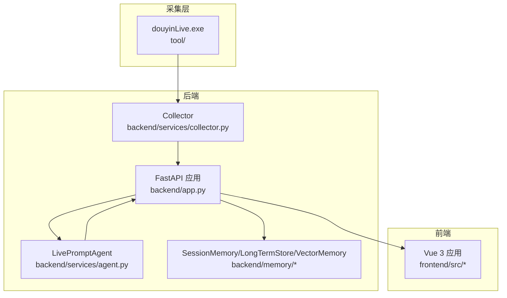
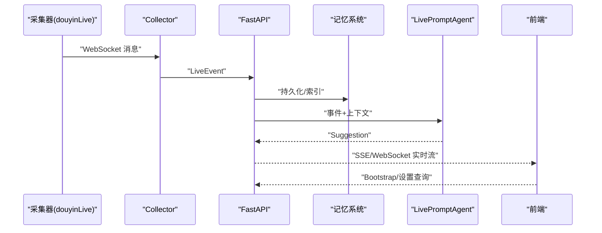
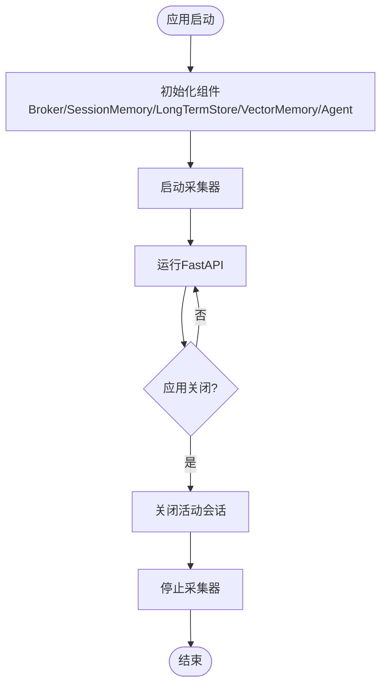
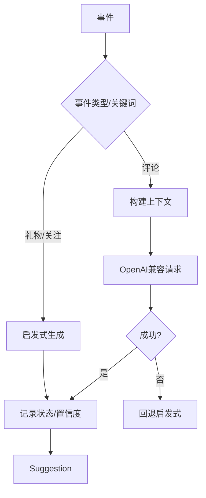
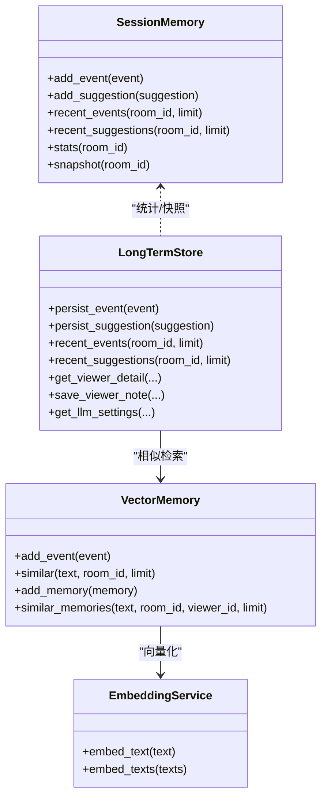
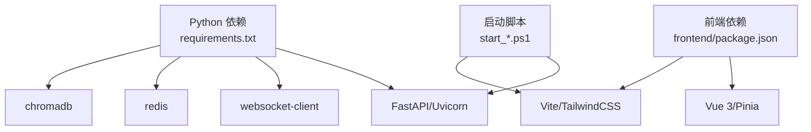

# 调试与故障排除

<cite>
**本文引用的文件**
- [README.md](file://README.md)
- [USAGE.md](file://USAGE.md)
- [requirements.txt](file://requirements.txt)
- [backend/app.py](file://backend/app.py)
- [backend/config.py](file://backend/config.py)
- [backend/services/collector.py](file://backend/services/collector.py)
- [backend/services/agent.py](file://backend/services/agent.py)
- [backend/memory/session_memory.py](file://backend/memory/session_memory.py)
- [backend/memory/vector_store.py](file://backend/memory/vector_store.py)
- [backend/memory/embedding_service.py](file://backend/memory/embedding_service.py)
- [backend/memory/long_term.py](file://backend/memory/long_term.py)
- [start_all.ps1](file://start_all.ps1)
- [start_backend_qwen.ps1](file://start_backend_qwen.ps1)
- [start_frontend.ps1](file://start_frontend.ps1)
- [deprecated/debug_client.py](file://deprecated/debug_client.py)
- [frontend/package.json](file://frontend/package.json)
- [tests/test_agent.py](file://tests/test_agent.py)
</cite>

## 目录
1. [简介](#简介)
2. [项目结构](#项目结构)
3. [核心组件](#核心组件)
4. [架构总览](#架构总览)
5. [详细组件分析](#详细组件分析)
6. [依赖分析](#依赖分析)
7. [性能考量](#性能考量)
8. [故障排除指南](#故障排除指南)
9. [结论](#结论)
10. [附录](#附录)

## 简介
本指南面向DouYin_llm项目的调试与故障排除，覆盖启动问题、连接问题、性能问题、日志分析与调试工具使用，并提供常见错误代码与解决方案参考。读者无需深入技术背景即可按步骤定位与解决问题。

## 项目结构
项目采用“采集器 + 后端FastAPI + 前端Vue”的三层架构：
- 采集器：本地WebSocket服务，负责从抖音直播间抓取实时消息。
- 后端：FastAPI提供REST/SSE/WebSocket接口，处理事件、持久化、记忆抽取与提词生成。
- 前端：Vue 3应用，通过Pinia Store与多个组件展示状态、事件流与观众工单。



图表来源
- [README.md:7-17](file://README.md#L7-L17)
- [backend/app.py:108-127](file://backend/app.py#L108-L127)
- [backend/services/collector.py:38-59](file://backend/services/collector.py#L38-L59)

章节来源
- [README.md:32-44](file://README.md#L32-L44)
- [USAGE.md:7-14](file://USAGE.md#L7-L14)

## 核心组件
- 配置中心：集中管理环境变量与默认值，支持从.env、shell与代码默认值逐级覆盖。
- 采集器：连接本地WebSocket，标准化为LiveEvent并投递到后端事件循环。
- 记忆系统：短期会话内存、长期SQLite存储、向量Chroma索引与嵌入服务。
- 提词代理：根据事件与上下文选择LLM或启发式规则生成建议。
- 接口层：健康检查、事件流、WebSocket、房间切换、观众笔记与LLM设置等。

章节来源
- [backend/config.py:40-113](file://backend/config.py#L40-L113)
- [backend/services/collector.py:38-266](file://backend/services/collector.py#L38-L266)
- [backend/memory/session_memory.py:17-113](file://backend/memory/session_memory.py#L17-L113)
- [backend/memory/vector_store.py:59-317](file://backend/memory/vector_store.py#L59-L317)
- [backend/services/agent.py:23-496](file://backend/services/agent.py#L23-L496)
- [backend/app.py:129-285](file://backend/app.py#L129-L285)

## 架构总览
系统数据流自下而上：采集器标准化事件 → 后端持久化与记忆抽取 → 提词生成 → 实时推送（SSE/WebSocket）→ 前端展示。



图表来源
- [README.md:143-149](file://README.md#L143-L149)
- [backend/app.py:73-102](file://backend/app.py#L73-L102)
- [backend/services/agent.py:105-142](file://backend/services/agent.py#L105-L142)

## 详细组件分析

### 后端应用与生命周期
- 生命周期：应用启动时初始化Broker、SessionMemory、LongTermStore、VectorMemory、Agent与EmbeddingService；关闭时清理活动会话并停止采集器。
- 接口：健康检查、房间切换、事件注入、SSE流、WebSocket、观众画像与笔记、LLM设置等。
- CORS：允许任意来源，便于本地联调。



图表来源
- [backend/app.py:108-117](file://backend/app.py#L108-L117)
- [backend/app.py:129-285](file://backend/app.py#L129-L285)

章节来源
- [backend/app.py:108-127](file://backend/app.py#L108-L127)
- [backend/app.py:129-285](file://backend/app.py#L129-L285)

### 采集器（DouyinCollector）
- 连接：根据配置拼接ws地址，建立WebSocket连接，周期性ping维持心跳。
- 事件：解析JSON消息，映射为LiveEvent，通过线程安全方式投递到后端事件循环。
- 容错：异常捕获、断线重连、优雅停止。

```mermaid
sequenceDiagram
participant Col as "Collector"
participant WS as "WebSocket"
participant Loop as "后端事件循环"
Col->>WS : "connect(url)"
WS-->>Col : "on_open"
WS-->>Col : "on_message(JSON)"
Col->>Col : "normalize_event()"
Col->>Loop : "run_coroutine_threadsafe(handler)"
WS-->>Col : "on_error/on_close"
Col->>Col : "重连/停止"
```

图表来源
- [backend/services/collector.py:118-140](file://backend/services/collector.py#L118-L140)
- [backend/services/collector.py:145-196](file://backend/services/collector.py#L145-L196)

章节来源
- [backend/services/collector.py:38-266](file://backend/services/collector.py#L38-L266)

### 提词代理（LivePromptAgent）
- 模式：heuristic/qwen/openai等，支持回退策略。
- 上下文：结合最近事件、相似历史、用户画像与观众记忆。
- 输出：标准化Suggestion，包含优先级、回复、语调、理由与置信度。



图表来源
- [backend/services/agent.py:105-142](file://backend/services/agent.py#L105-L142)
- [backend/services/agent.py:200-217](file://backend/services/agent.py#L200-L217)
- [backend/services/agent.py:302-437](file://backend/services/agent.py#L302-L437)

章节来源
- [backend/services/agent.py:23-496](file://backend/services/agent.py#L23-L496)

### 记忆系统
- SessionMemory：优先Redis，否则进程内deque，支持TTL。
- LongTermStore：SQLite持久化事件、建议、观众画像、笔记、记忆与会话。
- VectorMemory：Chroma向量索引或本地Hash回退，支持相似检索与重排序。
- EmbeddingService：本地SentenceTransformers或云端Embedding API。



图表来源
- [backend/memory/session_memory.py:17-113](file://backend/memory/session_memory.py#L17-L113)
- [backend/memory/long_term.py:44-967](file://backend/memory/long_term.py#L44-L967)
- [backend/memory/vector_store.py:59-317](file://backend/memory/vector_store.py#L59-L317)
- [backend/memory/embedding_service.py:18-102](file://backend/memory/embedding_service.py#L18-L102)

章节来源
- [backend/memory/session_memory.py:17-113](file://backend/memory/session_memory.py#L17-L113)
- [backend/memory/long_term.py:44-967](file://backend/memory/long_term.py#L44-L967)
- [backend/memory/vector_store.py:59-317](file://backend/memory/vector_store.py#L59-L317)
- [backend/memory/embedding_service.py:18-102](file://backend/memory/embedding_service.py#L18-L102)

## 依赖分析
- Python运行时：FastAPI、Uvicorn、WebSocket客户端、Redis、Chroma。
- 前端：Vue 3、Pinia、Vite、TailwindCSS。
- 启动脚本：PowerShell脚本负责环境检查与端口占用校验。



图表来源
- [requirements.txt:1-6](file://requirements.txt#L1-L6)
- [frontend/package.json:11-22](file://frontend/package.json#L11-L22)
- [start_all.ps1:1-18](file://start_all.ps1#L1-L18)
- [start_frontend.ps1:1-22](file://start_frontend.ps1#L1-L22)
- [start_backend_qwen.ps1:1-13](file://start_backend_qwen.ps1#L1-L13)

章节来源
- [requirements.txt:1-6](file://requirements.txt#L1-L6)
- [frontend/package.json:11-22](file://frontend/package.json#L11-L22)
- [start_all.ps1:1-18](file://start_all.ps1#L1-L18)
- [start_frontend.ps1:1-22](file://start_frontend.ps1#L1-L22)
- [start_backend_qwen.ps1:1-13](file://start_backend_qwen.ps1#L1-L13)

## 性能考量
- 内存与CPU
  - 事件窗口与建议窗口：SessionMemory使用固定长度队列，避免无限增长。
  - 向量检索：VectorMemory支持相似度阈值与召回上限，降低无关匹配。
  - 嵌入计算：本地模型可配置batch与设备；云端API受网络与配额影响。
- 响应延迟
  - SSE/WebSocket：Broker订阅队列异步推送，避免阻塞主线程。
  - LLM调用：超时控制与回退策略，减少对整体时延的影响。
- 存储与I/O
  - SQLite事务与索引：事件表与索引优化查询性能。
  - Chroma持久化：磁盘空间与重建脚本配合使用。

章节来源
- [backend/memory/session_memory.py:24-84](file://backend/memory/session_memory.py#L24-L84)
- [backend/memory/vector_store.py:86-134](file://backend/memory/vector_store.py#L86-L134)
- [backend/memory/long_term.py:216-229](file://backend/memory/long_term.py#L216-L229)
- [backend/services/agent.py:330-393](file://backend/services/agent.py#L330-L393)

## 故障排除指南

### 一、启动问题诊断
- 缺少环境变量或配置不正确
  - 症状：后端启动报错或未连接采集器。
  - 排查：确认.env存在且包含必要变量（如ROOM_ID、LLM_MODE、API Key等）。
  - 参考：配置优先级与默认值定义。
- 端口冲突
  - 症状：前端或后端端口被占用。
  - 排查：检查5173（前端）与8010（后端）端口占用情况，修改脚本中的端口或释放占用进程。
- 依赖缺失
  - 症状：导入失败或功能不可用。
  - 排查：安装requirements.txt与前端依赖；Redis/Chroma可选，但缺失会影响部分功能。

章节来源
- [USAGE.md:24-48](file://USAGE.md#L24-L48)
- [backend/config.py:40-113](file://backend/config.py#L40-L113)
- [requirements.txt:1-6](file://requirements.txt#L1-L6)
- [start_frontend.ps1:10-22](file://start_frontend.ps1#L10-L22)
- [start_backend_qwen.ps1:6-13](file://start_backend_qwen.ps1#L6-L13)

### 二、连接问题排查
- WebSocket连接（采集器）
  - 症状：前端无建议、后端日志显示未连接或断开。
  - 排查：确认采集器已启动、ROOM_ID一致、网络可达；查看Collector日志与重连机制。
- 数据库连接（SQLite）
  - 症状：写入失败或查询异常。
  - 排查：检查数据库路径与权限、journal模式设置；确认索引存在。
- LLM API连接
  - 症状：模型状态显示回退或错误。
  - 排查：核对API Key、Base URL、模型名与超时；查看Agent日志中的HTTP/网络错误分类。

章节来源
- [backend/services/collector.py:118-140](file://backend/services/collector.py#L118-L140)
- [backend/memory/long_term.py:44-967](file://backend/memory/long_term.py#L44-L967)
- [backend/services/agent.py:330-437](file://backend/services/agent.py#L330-L437)

### 三、性能问题定位与优化
- 内存泄漏
  - 症状：长时间运行后内存持续增长。
  - 排查：检查事件/建议队列长度与TTL设置；确认无未释放的订阅队列。
- CPU占用过高
  - 症状：LLM推理或向量检索耗时较长。
  - 排查：降低max_tokens、调整相似度阈值与召回数；必要时切换为启发式模式。
- 响应延迟
  - 症状：SSE/WebSocket推送延迟。
  - 排查：检查Broker队列积压、事件处理耗时；优化向量检索与嵌入调用。

章节来源
- [backend/memory/session_memory.py:24-84](file://backend/memory/session_memory.py#L24-L84)
- [backend/memory/vector_store.py:86-134](file://backend/memory/vector_store.py#L86-L134)
- [backend/services/agent.py:330-393](file://backend/services/agent.py#L330-L393)

### 四、日志分析技巧
- 后端日志
  - 关注：健康检查、房间切换、事件处理、LLM状态与错误分类。
  - 参考：接口层与Agent的日志输出位置。
- 前端日志
  - 关注：WebSocket连接状态、SSE流接收、组件渲染与Store状态变化。
- 采集器日志
  - 关注：原始消息结构、连接状态、错误与重连。

章节来源
- [backend/app.py:129-285](file://backend/app.py#L129-L285)
- [backend/services/agent.py:330-437](file://backend/services/agent.py#L330-L437)
- [deprecated/debug_client.py:68-98](file://deprecated/debug_client.py#L68-L98)

### 五、调试工具使用
- 浏览器开发者工具
  - Network：观察SSE/WebSocket连接与消息体。
  - Console：查看前端错误与状态提示。
- Python调试器
  - 在Agent或Collector关键路径设置断点，逐步跟踪事件流转。
- 网络抓包工具
  - 抓取LLM API请求与响应，核对URL、头部与负载。

章节来源
- [tests/test_agent.py:116-172](file://tests/test_agent.py#L116-L172)
- [deprecated/debug_client.py:100-139](file://deprecated/debug_client.py#L100-L139)

### 六、常见错误代码与解决方案
- 启动阶段
  - 缺失.env：复制示例并填写必要变量。
  - 端口占用：修改脚本端口或释放占用进程。
- 连接阶段
  - 采集器未连接：确认ROOM_ID一致、采集器运行、网络可达。
  - 数据库写入失败：检查路径、权限与journal模式。
  - LLM调用失败：核对API Key、Base URL、超时与配额。
- 运行阶段
  - 建议为空：检查直播是否开播、事件是否正常进入系统。
  - 模型状态回退：查看Agent日志中的错误分类并针对性修复。

章节来源
- [USAGE.md:198-256](file://USAGE.md#L198-L256)
- [backend/services/agent.py:330-437](file://backend/services/agent.py#L330-L437)
- [backend/services/collector.py:118-140](file://backend/services/collector.py#L118-L140)

## 结论
通过分层排查（启动、连接、性能、日志与工具）与组件级定位（配置、采集、记忆、LLM），可高效解决DouYin_llm在本地开发与演示场景中的常见问题。建议在生产化前补充可观测性与告警能力，以进一步提升稳定性与可维护性。

## 附录
- 快速检查清单
  - 确认.env配置完整且有效。
  - 后端与前端端口未被占用。
  - 采集器已启动且与后端房间一致。
  - SQLite与Chroma可用，索引存在。
  - LLM API Key与URL正确，网络可达。
  - 前端WebSocket/SSE连接正常，组件状态显示正确。