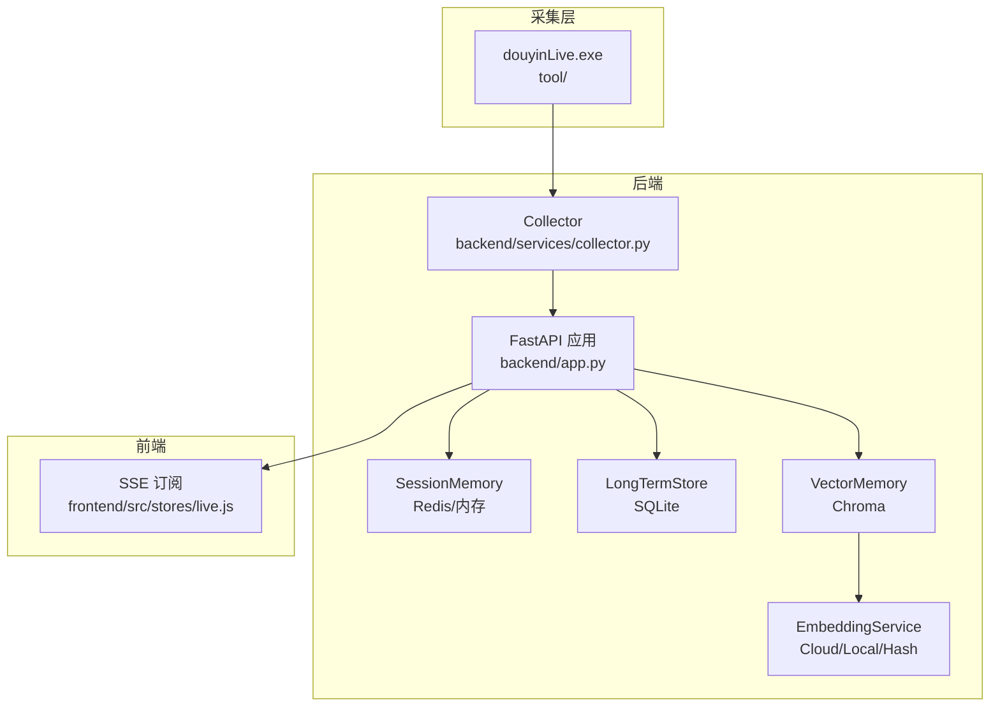
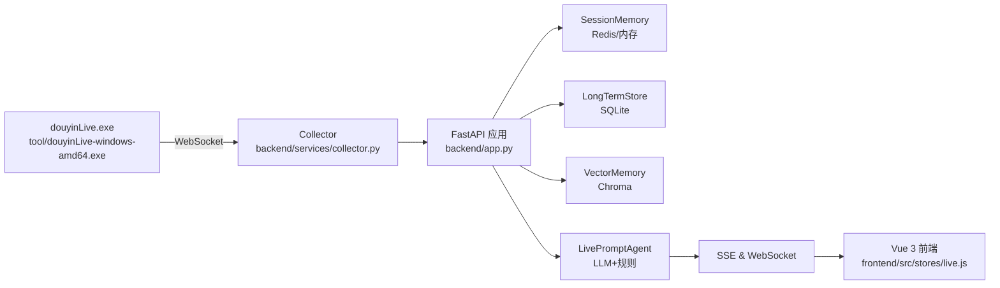
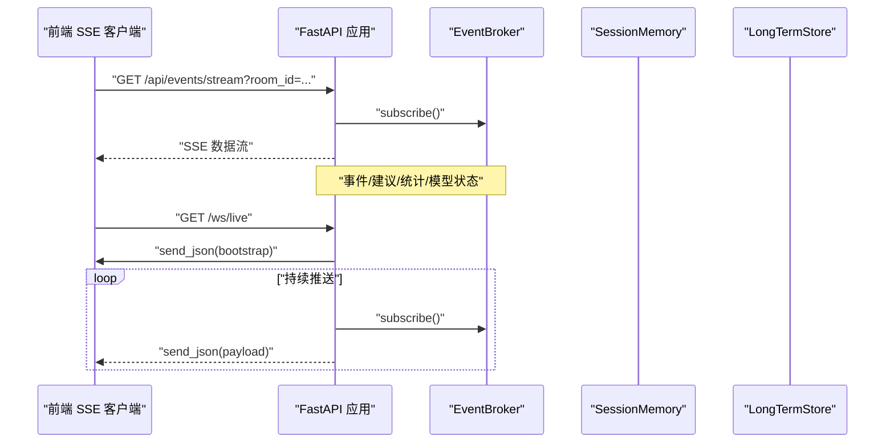
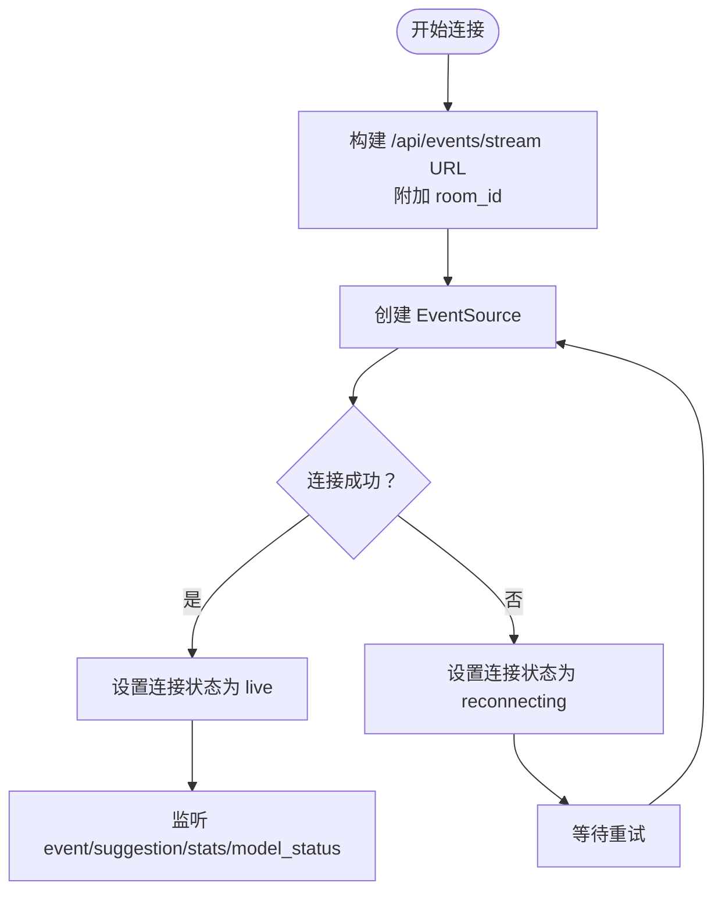
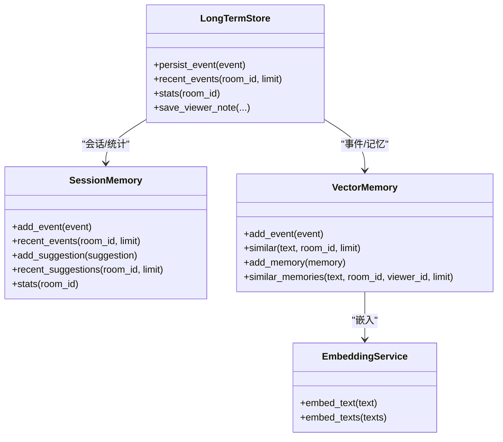
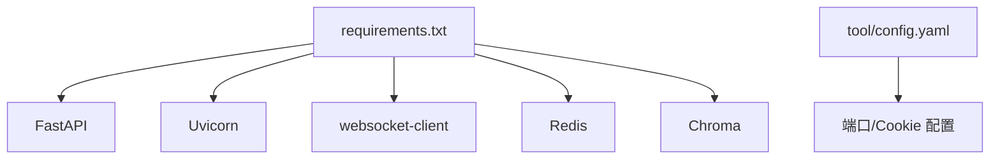

# 连接问题排查

<cite>
**本文引用的文件**
- [README.md](file://README.md)
- [backend/app.py](file://backend/app.py)
- [backend/config.py](file://backend/config.py)
- [backend/services/collector.py](file://backend/services/collector.py)
- [backend/memory/session_memory.py](file://backend/memory/session_memory.py)
- [backend/memory/long_term.py](file://backend/memory/long_term.py)
- [backend/memory/vector_store.py](file://backend/memory/vector_store.py)
- [backend/memory/embedding_service.py](file://backend/memory/embedding_service.py)
- [frontend/src/stores/live.js](file://frontend/src/stores/live.js)
- [requirements.txt](file://requirements.txt)
- [tool/config.yaml](file://tool/config.yaml)
- [start_all.ps1](file://start_all.ps1)
</cite>

## 目录
1. [简介](#简介)
2. [项目结构](#项目结构)
3. [核心组件](#核心组件)
4. [架构总览](#架构总览)
5. [详细组件分析](#详细组件分析)
6. [依赖关系分析](#依赖关系分析)
7. [性能考量](#性能考量)
8. [故障排查指南](#故障排查指南)
9. [结论](#结论)
10. [附录](#附录)

## 简介
本指南聚焦于DouYin_llm项目的连接问题排查，覆盖以下方面：
- WebSocket连接失败诊断：douyinLive采集器连接、后端WebSocket服务、前端SSE连接
- 数据库连接问题：SQLite连接、Chroma向量数据库连接、Redis连接
- LLM API连接问题：API密钥验证、网络代理配置、超时设置
- 网络连通性测试、防火墙配置、SSL证书问题
- 连接状态监控与错误日志分析

## 项目结构
项目采用“采集器-后端-FastAPI-前端”的三层架构：
- 采集层：tool/douyinLive.exe通过本地WebSocket向Collector提供直播事件
- 后端：FastAPI应用负责事件归一化、持久化、记忆抽取、提词生成与SSE/WebSocket推送
- 前端：Vue 3 + Pinia Store通过SSE订阅事件流，展示状态与建议



**图表来源**
- [README.md: 7-17:7-17](file://README.md#L7-L17)
- [backend/app.py: 108-126:108-126](file://backend/app.py#L108-L126)
- [backend/services/collector.py: 38-60:38-60](file://backend/services/collector.py#L38-L60)
- [frontend/src/stores/live.js: 474-523:474-523](file://frontend/src/stores/live.js#L474-L523)

**章节来源**
- [README.md: 3-44:3-44](file://README.md#L3-L44)

## 核心组件
- 采集器（DouyinCollector）：连接本地WebSocket，规范化消息为LiveEvent并提交到后端事件循环
- 后端FastAPI：提供REST/SSE/WebSocket接口，管理会话、长短期记忆与向量索引
- 前端Store：通过SSE订阅事件流，维护房间切换、过滤器、主题与LLM设置状态

**章节来源**
- [backend/services/collector.py: 38-60:38-60](file://backend/services/collector.py#L38-L60)
- [backend/app.py: 129-135:129-135](file://backend/app.py#L129-L135)
- [frontend/src/stores/live.js: 75-83:75-83](file://frontend/src/stores/live.js#L75-L83)

## 架构总览


**图表来源**
- [README.md: 7-17:7-17](file://README.md#L7-L17)
- [backend/app.py: 27-35:27-35](file://backend/app.py#L27-L35)

## 详细组件分析

### 采集器（DouyinCollector）
- 连接参数：主机、端口、房间号、心跳间隔、重连延迟
- 连接流程：建立WebSocket，处理on_open/on_message/on_error/on_close，异常时按重连延迟等待
- 事件处理：将原始消息规范化为LiveEvent，提交到后端事件循环

```mermaid
sequenceDiagram
participant Tool as "douyinLive.exe"
participant Col as "DouyinCollector"
participant App as "FastAPI 应用"
participant Loop as "事件循环"
Tool->>Col : "WebSocket 消息"
Col->>Col : "解析/规范化为 LiveEvent"
Col->>Loop : "提交事件"
Loop->>App : "回调 process_event()"
App-->>Tool : "连接状态/事件处理结果"
```

**图表来源**
- [backend/services/collector.py: 118-140:118-140](file://backend/services/collector.py#L118-L140)
- [backend/services/collector.py: 145-160:145-160](file://backend/services/collector.py#L145-L160)
- [backend/app.py: 73-102:73-102](file://backend/app.py#L73-L102)

**章节来源**
- [backend/services/collector.py: 38-60:38-60](file://backend/services/collector.py#L38-L60)
- [backend/services/collector.py: 118-140:118-140](file://backend/services/collector.py#L118-L140)
- [backend/services/collector.py: 145-160:145-160](file://backend/services/collector.py#L145-L160)

### 后端FastAPI（SSE/WebSocket）
- SSE：/api/events/stream，按房间过滤事件，支持重试机制
- WebSocket：/ws/live，先下发bootstrap快照，再持续推送事件、建议、统计与模型状态
- 健康检查：/health，返回运行状态与当前房间



**图表来源**
- [backend/app.py: 252-271:252-271](file://backend/app.py#L252-L271)
- [backend/app.py: 274-285:274-285](file://backend/app.py#L274-L285)
- [backend/app.py: 60-70:60-70](file://backend/app.py#L60-L70)

**章节来源**
- [backend/app.py: 129-135:129-135](file://backend/app.py#L129-L135)
- [backend/app.py: 252-271:252-271](file://backend/app.py#L252-L271)
- [backend/app.py: 274-285:274-285](file://backend/app.py#L274-L285)

### 前端SSE客户端
- 连接状态：idle/connecting/live/reconnecting/switching
- 事件监听：event/suggestion/stats/model_status
- 房间切换：POST /api/room，成功后重新订阅



**图表来源**
- [frontend/src/stores/live.js: 474-523:474-523](file://frontend/src/stores/live.js#L474-L523)
- [frontend/src/stores/live.js: 496-522:496-522](file://frontend/src/stores/live.js#L496-L522)

**章节来源**
- [frontend/src/stores/live.js: 75-83:75-83](file://frontend/src/stores/live.js#L75-L83)
- [frontend/src/stores/live.js: 474-523:474-523](file://frontend/src/stores/live.js#L474-L523)

### 数据库与向量存储
- SQLite（LongTermStore）：事件、建议、观众画像、会话、笔记、记忆等表
- Redis（SessionMemory）：短期事件与建议列表，支持TTL
- Chroma（VectorMemory）：事件与观众记忆的向量索引，支持云/本地嵌入
- 嵌入服务（EmbeddingService）：云API、本地SentenceTransformers或哈希回退



**图表来源**
- [backend/memory/long_term.py: 44-55:44-55](file://backend/memory/long_term.py#L44-L55)
- [backend/memory/session_memory.py: 17-31:17-31](file://backend/memory/session_memory.py#L17-L31)
- [backend/memory/vector_store.py: 59-84:59-84](file://backend/memory/vector_store.py#L59-L84)
- [backend/memory/embedding_service.py: 18-24:18-24](file://backend/memory/embedding_service.py#L18-L24)

**章节来源**
- [backend/memory/long_term.py: 44-55:44-55](file://backend/memory/long_term.py#L44-L55)
- [backend/memory/session_memory.py: 17-31:17-31](file://backend/memory/session_memory.py#L17-L31)
- [backend/memory/vector_store.py: 59-84:59-84](file://backend/memory/vector_store.py#L59-L84)
- [backend/memory/embedding_service.py: 18-24:18-24](file://backend/memory/embedding_service.py#L18-L24)

## 依赖关系分析
- Python依赖：FastAPI、Uvicorn、websocket-client、Redis、Chroma
- 采集器配置：tool/config.yaml定义端口与Cookie（可选）



**图表来源**
- [requirements.txt: 1-6:1-6](file://requirements.txt#L1-L6)
- [tool/config.yaml: 4-15:4-15](file://tool/config.yaml#L4-L15)

**章节来源**
- [requirements.txt: 1-6:1-6](file://requirements.txt#L1-L6)
- [tool/config.yaml: 4-15:4-15](file://tool/config.yaml#L4-L15)

## 性能考量
- SSE重试：后端为SSE设置重试参数，降低断连后的刷新压力
- 事件窗口：短期事件与建议列表限制长度，避免内存膨胀
- 向量检索：通过最小分数与最终K值控制召回质量与性能
- 嵌入回退：当云/本地嵌入不可用时自动降级为哈希嵌入

**章节来源**
- [backend/app.py: 256-269:256-269](file://backend/app.py#L256-L269)
- [backend/memory/session_memory.py: 26-64:26-64](file://backend/memory/session_memory.py#L26-L64)
- [backend/memory/vector_store.py: 92-108:92-108](file://backend/memory/vector_store.py#L92-L108)
- [backend/memory/embedding_service.py: 33-48:33-48](file://backend/memory/embedding_service.py#L33-L48)

## 故障排查指南

### 一、WebSocket连接失败（douyinLive采集器）
- 检查采集器配置
  - 确认tool/config.yaml中的端口与Cookie配置正确
  - 确认采集器监听地址与后端Collector配置一致
- 核对房间号一致性
  - 采集器与后端Collector的ROOM_ID必须一致
- 连接状态与日志
  - Collector在连接/断开/错误时记录日志，关注on_open/on_error/on_close分支
  - 断线后按重连延迟等待，确认重连逻辑是否生效
- 网络连通性
  - 使用本地回环地址127.0.0.1进行测试
  - 防火墙放行采集器端口（默认1088）

**章节来源**
- [tool/config.yaml: 4-15:4-15](file://tool/config.yaml#L4-L15)
- [backend/services/collector.py: 54-59:54-59](file://backend/services/collector.py#L54-L59)
- [backend/services/collector.py: 118-140:118-140](file://backend/services/collector.py#L118-L140)
- [backend/services/collector.py: 161-180:161-180](file://backend/services/collector.py#L161-L180)

### 二、后端WebSocket服务（/ws/live）
- 接口可用性
  - 访问后端健康检查接口确认服务运行
  - 使用浏览器或工具访问/ws/live，观察是否能接收bootstrap与后续事件
- 连接状态
  - 后端在WebSocket断开时释放订阅，前端应进入重连状态
- 日志定位
  - 关注WebSocketDisconnect异常路径与订阅释放逻辑

**章节来源**
- [backend/app.py: 129-135:129-135](file://backend/app.py#L129-L135)
- [backend/app.py: 274-285:274-285](file://backend/app.py#L274-L285)

### 三、前端SSE连接（/api/events/stream）
- 连接状态机
  - idle → connecting → live/reconnecting → switching
  - onopen设置为live，onerror设置为reconnecting
- 房间过滤
  - SSE根据room_id过滤事件，确保查询参数与后端一致
- 事件类型
  - 监听event/suggestion/stats/model_status四类事件，核对数据格式

**章节来源**
- [frontend/src/stores/live.js: 75-83:75-83](file://frontend/src/stores/live.js#L75-L83)
- [frontend/src/stores/live.js: 474-523:474-523](file://frontend/src/stores/live.js#L474-L523)
- [frontend/src/stores/live.js: 496-522:496-522](file://frontend/src/stores/live.js#L496-L522)

### 四、数据库连接问题
- SQLite（LongTermStore）
  - 确认数据库文件存在且可写
  - 检查表结构与索引是否存在，必要时重建
- Redis（SessionMemory）
  - 若配置了REDIS_URL，则使用Redis；否则退化为内存队列
  - 检查Redis服务可达性与认证
- Chroma（VectorMemory）
  - 确认Chroma目录可写
  - 若导入失败，将退化为内存回退索引

**章节来源**
- [backend/memory/long_term.py: 44-55:44-55](file://backend/memory/long_term.py#L44-L55)
- [backend/memory/session_memory.py: 17-31:17-31](file://backend/memory/session_memory.py#L17-L31)
- [backend/memory/vector_store.py: 70-84:70-84](file://backend/memory/vector_store.py#L70-L84)

### 五、LLM API连接问题
- API密钥验证
  - 在.env中配置DASHSCOPE_API_KEY或LLM_API_KEY
  - 后端优先使用DASHSCOPE_API_KEY，其次LLM_API_KEY
- 模型与端点
  - LLM_MODE影响默认BASE_URL与MODEL选择
  - 可通过resolved_llm_base_url/resolved_llm_model解析最终地址
- 超时与代理
  - LLM_TIMEOUT_SECONDS控制单次推理超时
  - 如需代理，请在运行环境中配置HTTP/HTTPS代理
- 嵌入服务
  - EMBEDDING_MODE支持cloud/local/hash
  - EMBEDDING_TIMEOUT_SECONDS控制嵌入请求超时

**章节来源**
- [backend/config.py: 60-67:60-67](file://backend/config.py#L60-L67)
- [backend/config.py: 84-104:84-104](file://backend/config.py#L84-L104)
- [backend/config.py: 68](file://backend/config.py#L68)
- [backend/memory/embedding_service.py: 75-101:75-101](file://backend/memory/embedding_service.py#L75-L101)

### 六、网络连通性、防火墙与SSL
- 本地连通性
  - 使用curl或浏览器访问后端健康检查与SSE接口
  - 确保端口未被占用，Windows防火墙放行所需端口
- SSL证书
  - 若使用自签名或企业CA，需在运行环境中信任对应证书链
- 代理配置
  - 为Python与浏览器配置HTTP/HTTPS代理，确保对外出站流量可达

**章节来源**
- [README.md: 93](file://README.md#L93)
- [start_all.ps1: 6-9:6-9](file://start_all.ps1#L6-L9)

### 七、连接状态监控与错误日志分析
- 后端日志
  - INFO/WARNING/ERROR级别日志，关注Collector连接、事件处理、向量检索异常
- 前端状态
  - connectionState字段反映SSE连接状态，结合控制台错误信息定位
- 健康检查
  - /health返回当前房间与活动会话，用于快速判断后端状态

**章节来源**
- [backend/app.py: 25-25:25-25](file://backend/app.py#L25-L25)
- [frontend/src/stores/live.js: 75-83:75-83](file://frontend/src/stores/live.js#L75-L83)
- [backend/app.py: 129-135:129-135](file://backend/app.py#L129-L135)

## 结论
通过分层排查（采集器→后端→前端）与关键组件（SSE/WebSocket、SQLite/Redis/Chroma、LLM嵌入）的定位，可高效解决DouYin_llm的连接问题。建议优先验证采集器与后端的连通性，再检查前端SSE订阅状态，最后核对数据库与LLM配置。

## 附录
- 快速启动脚本会检查.env文件，缺失时提示复制模板并填写密钥
- 采集器默认监听本地回环地址，确保防火墙放行端口

**章节来源**
- [start_all.ps1: 6-9:6-9](file://start_all.ps1#L6-L9)
- [backend/services/collector.py: 54-59:54-59](file://backend/services/collector.py#L54-L59)