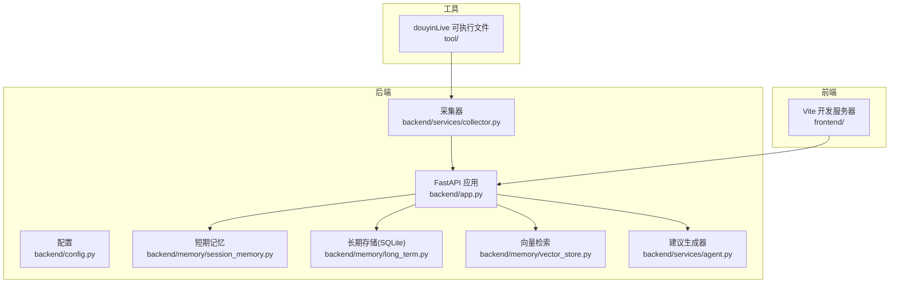
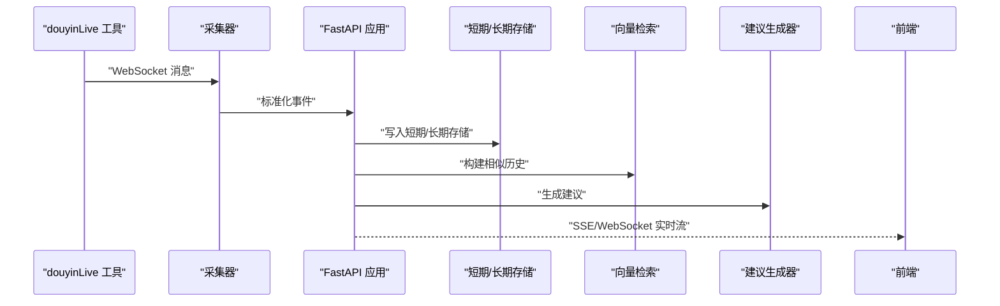
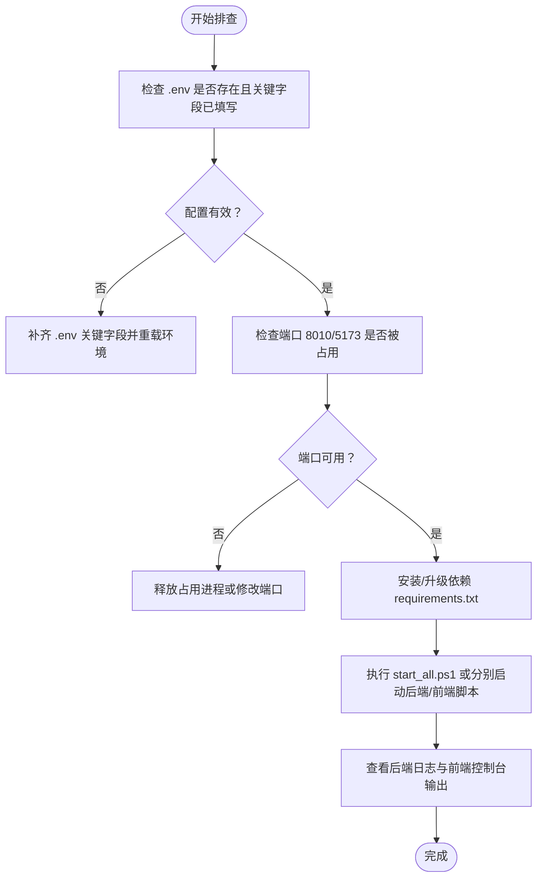
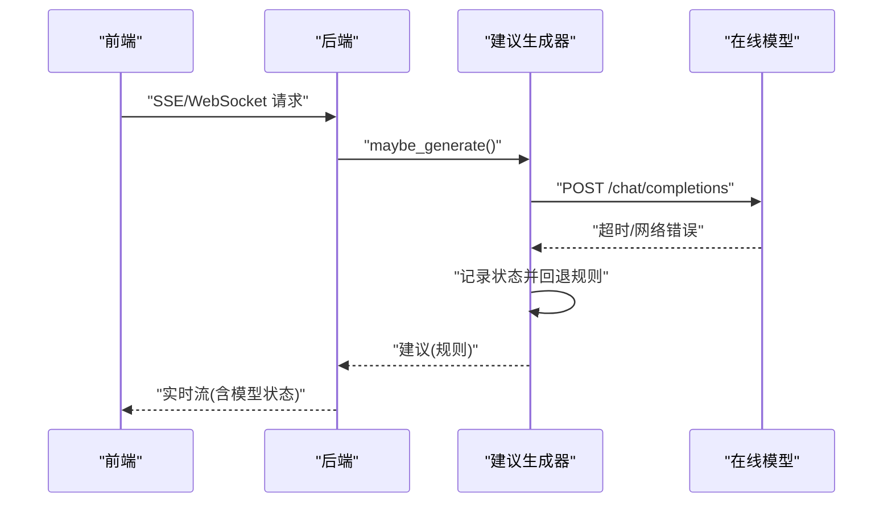
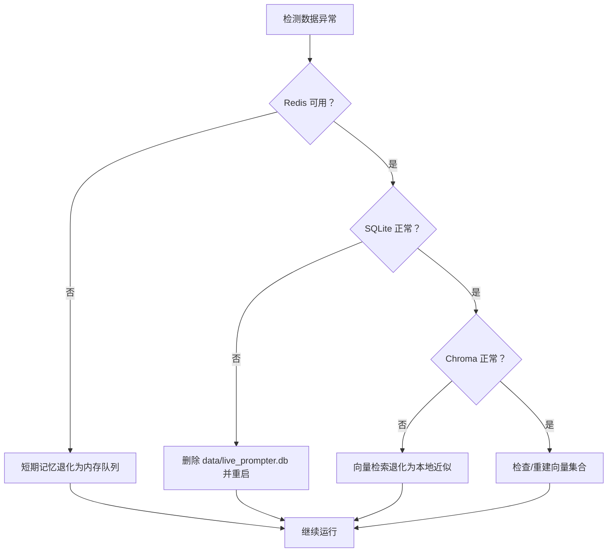
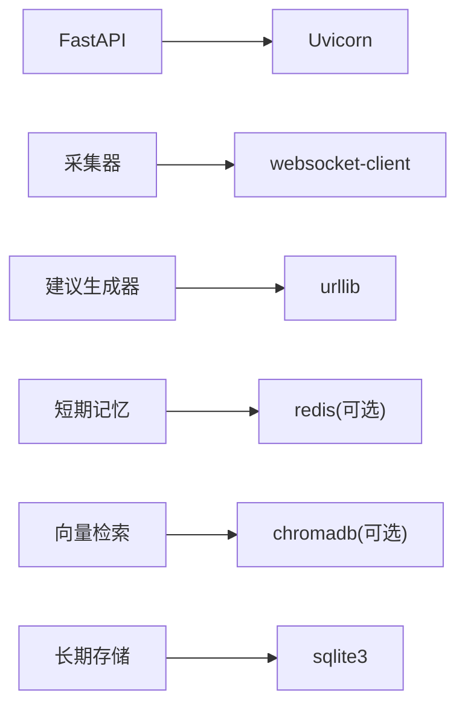

# 常见问题

<cite>
**本文引用的文件**
- [README.md](file://README.md)
- [USAGE.md](file://USAGE.md)
- [requirements.txt](file://requirements.txt)
- [backend/app.py](file://backend/app.py)
- [backend/config.py](file://backend/config.py)
- [backend/memory/vector_store.py](file://backend/memory/vector_store.py)
- [backend/memory/long_term.py](file://backend/memory/long_term.py)
- [backend/memory/session_memory.py](file://backend/memory/session_memory.py)
- [backend/services/collector.py](file://backend/services/collector.py)
- [backend/services/agent.py](file://backend/services/agent.py)
- [start_all.ps1](file://start_all.ps1)
- [start_backend_qwen.ps1](file://start_backend_qwen.ps1)
- [start_frontend.ps1](file://start_frontend.ps1)
- [tool/config.yaml](file://tool/config.yaml)
</cite>

## 目录
1. [简介](#简介)
2. [项目结构](#项目结构)
3. [核心组件](#核心组件)
4. [架构总览](#架构总览)
5. [详细组件分析](#详细组件分析)
6. [依赖分析](#依赖分析)
7. [性能考虑](#性能考虑)
8. [故障排查指南](#故障排查指南)
9. [结论](#结论)
10. [附录](#附录)

## 简介
本常见问题解答聚焦于启动失败、连接超时、数据不一致、系统兼容性以及问题报告标准等高频问题，结合后端应用入口、配置、采集器、短期/长期存储、向量检索与建议生成器等模块的实际实现，提供可操作的诊断步骤与修复建议。

## 项目结构
- 后端入口与服务：FastAPI 应用、事件采集器、短期/长期存储、向量检索、建议生成器
- 前端：Vue 3 + Vite 开发服务器
- 工具：本地抖音直播消息源（douyinLive）及其配置
- 数据：SQLite 数据库与可选的 Redis、Chroma

**图表来源**
- [backend/app.py:1-220](file://backend/app.py#L1-L220)
- [backend/config.py:1-94](file://backend/config.py#L1-L94)
- [backend/services/collector.py:1-284](file://backend/services/collector.py#L1-L284)
- [backend/memory/session_memory.py:1-113](file://backend/memory/session_memory.py#L1-L113)
- [backend/memory/long_term.py:1-750](file://backend/memory/long_term.py#L1-L750)
- [backend/memory/vector_store.py:1-108](file://backend/memory/vector_store.py#L1-L108)
- [backend/services/agent.py:1-393](file://backend/services/agent.py#L1-L393)

**章节来源**
- [README.md:21-34](file://README.md#L21-L34)
- [README.md:50-141](file://README.md#L50-L141)

## 核心组件
- 配置模块负责从 .env 与环境变量加载运行参数，并确保数据目录存在
- 采集器负责连接本地 WebSocket，标准化消息并投递到事件循环
- 短期记忆优先使用 Redis，未安装或未配置时退化为进程内队列
- 长期存储基于 SQLite，包含事件、建议、用户画像、会话等表
- 向量检索优先使用 Chroma，未安装时使用轻量哈希嵌入与本地近似检索
- 建议生成器优先调用在线 OpenAI 兼容接口，失败时回退本地启发式规则

**章节来源**
- [backend/config.py:11-94](file://backend/config.py#L11-L94)
- [backend/services/collector.py:38-284](file://backend/services/collector.py#L38-L284)
- [backend/memory/session_memory.py:17-113](file://backend/memory/session_memory.py#L17-L113)
- [backend/memory/long_term.py:36-750](file://backend/memory/long_term.py#L36-L750)
- [backend/memory/vector_store.py:52-108](file://backend/memory/vector_store.py#L52-L108)
- [backend/services/agent.py:23-393](file://backend/services/agent.py#L23-L393)

## 架构总览

**图表来源**
- [backend/app.py:61-78](file://backend/app.py#L61-L78)
- [backend/services/collector.py:145-159](file://backend/services/collector.py#L145-L159)
- [backend/services/agent.py:73-94](file://backend/services/agent.py#L73-L94)

## 详细组件分析

### 启动失败排查（端口冲突、依赖缺失、配置错误）
- 端口冲突
  - 后端默认监听 127.0.0.1:8010，前端默认 127.0.0.1:5173
  - 若端口被占用，启动脚本会报错或无法绑定
  - 建议：修改 .env 中 APP_HOST/APP_PORT 或释放对应端口
- 依赖缺失
  - requirements.txt 包含 fastapi、uvicorn、websocket-client、redis、chromadb
  - 缺少任一依赖会导致导入异常或功能降级
- 配置错误
  - .env 未正确复制或关键字段为空（如 ROOM_ID、LLM_API_KEY/DASHSCOPE_API_KEY）
  - 配置加载顺序：.env 优先于当前 shell 环境变量
- 启动脚本
  - start_all.ps1 会检查 .env 并分别启动后端与前端
  - start_backend_qwen.ps1 以 Qwen 在线模式启动后端
  - start_frontend.ps1 自动安装前端依赖并启动开发服务器

**图表来源**
- [start_all.ps1:6-17](file://start_all.ps1#L6-L17)
- [start_backend_qwen.ps1:6-12](file://start_backend_qwen.ps1#L6-L12)
- [start_frontend.ps1:10-21](file://start_frontend.ps1#L10-L21)
- [requirements.txt:1-6](file://requirements.txt#L1-L6)
- [backend/config.py:11-36](file://backend/config.py#L11-L36)

**章节来源**
- [README.md:101-128](file://README.md#L101-L128)
- [USAGE.md:24-47](file://USAGE.md#L24-L47)
- [USAGE.md:73-87](file://USAGE.md#L73-L87)
- [USAGE.md:90-114](file://USAGE.md#L90-L114)
- [start_all.ps1:6-17](file://start_all.ps1#L6-L17)
- [start_backend_qwen.ps1:6-12](file://start_backend_qwen.ps1#L6-L12)
- [start_frontend.ps1:10-21](file://start_frontend.ps1#L10-L21)
- [requirements.txt:1-6](file://requirements.txt#L1-L6)
- [backend/config.py:11-36](file://backend/config.py#L11-L36)

### 连接超时问题排查（防火墙、网络、代理）
- 模型调用超时
  - 建议生成器在调用在线模型时设置超时时间，超时会标记为错误并可能回退规则
  - 检查 LLM_TIMEOUT_SECONDS、LLM_BASE_URL、LLM_API_KEY/DASHSCOPE_API_KEY
- 网络连通性
  - 确认可访问 LLM_BASE_URL（默认为 DashScope 或 OpenAI 兼容接口）
  - 如需代理，请在系统/Shell 层面正确配置
- 采集器连接
  - 采集器连接本地 ws://127.0.0.1:1088/ws/{room_id}
  - 确认工具已启动且端口未被占用
- 前端连接
  - 前端默认 http://127.0.0.1:5173，若端口被占用需调整或释放

**图表来源**
- [backend/services/agent.py:183-329](file://backend/services/agent.py#L183-L329)
- [backend/app.py:187-220](file://backend/app.py#L187-L220)

**章节来源**
- [backend/services/agent.py:183-329](file://backend/services/agent.py#L183-L329)
- [backend/config.py:70-91](file://backend/config.py#L70-L91)
- [backend/services/collector.py:54-59](file://backend/services/collector.py#L54-L59)
- [USAGE.md:116-122](file://USAGE.md#L116-L122)

### 数据不一致问题与恢复
- Redis 数据丢失/不可用
  - 短期记忆退化为进程内队列，不会影响长期存储与建议生成
  - 建议：安装并运行 Redis，或保持 REDIS_URL 为空以使用内存模式
- SQLite 数据库损坏
  - 长期存储基于 SQLite，包含事件、建议、用户画像、会话等表
  - 若出现损坏，可尝试删除 data/live_prompter.db 并重启后端，系统会重建表结构
  - 注意：删除数据库将清空历史数据
- 向量存储同步失败
  - Chroma 不可用时，向量检索退化为轻量哈希嵌入与本地近似检索
  - 若安装 Chroma 后仍异常，可删除 data/chroma 目录后重启，系统会重新创建集合
- 会话状态不一致
  - 长期存储在事件写入时维护活跃会话，关闭时会更新状态
  - 若出现异常状态，可重启后端以清理残留会话

**图表来源**
- [backend/memory/session_memory.py:17-31](file://backend/memory/session_memory.py#L17-L31)
- [backend/memory/long_term.py:50-154](file://backend/memory/long_term.py#L50-L154)
- [backend/memory/vector_store.py:52-83](file://backend/memory/vector_store.py#L52-L83)

**章节来源**
- [backend/memory/session_memory.py:17-31](file://backend/memory/session_memory.py#L17-L31)
- [backend/memory/long_term.py:50-154](file://backend/memory/long_term.py#L50-L154)
- [backend/memory/vector_store.py:52-83](file://backend/memory/vector_store.py#L52-L83)

### 系统兼容性问题
- 环境要求
  - Windows 环境
  - Python 3.10+（仓库文档标注 3.11+），Node.js 16+（前端兼容 16）
- 前端依赖安装
  - start_frontend.ps1 会检测 Node.js 路径并自动安装依赖
- 工具配置
  - tool/config.yaml 用于配置本地抖音消息源端口与 Cookie（可选）

**章节来源**
- [README.md:50-56](file://README.md#L50-L56)
- [USAGE.md:15-22](file://USAGE.md#L15-L22)
- [start_frontend.ps1:7-18](file://start_frontend.ps1#L7-L18)
- [tool/config.yaml:1-16](file://tool/config.yaml#L1-L16)

## 依赖分析
- 后端应用依赖 FastAPI、Uvicorn、WebSocket 客户端、Redis、ChromaDB
- 采集器依赖 WebSocket 客户端
- 建议生成器依赖 urllib 发起 HTTP 请求
- 存储层依赖 SQLite（无需额外服务）

**图表来源**
- [requirements.txt:1-6](file://requirements.txt#L1-L6)
- [backend/services/collector.py:14](file://backend/services/collector.py#L14)
- [backend/services/agent.py:13](file://backend/services/agent.py#L13)
- [backend/memory/session_memory.py:12](file://backend/memory/session_memory.py#L12)
- [backend/memory/vector_store.py:14](file://backend/memory/vector_store.py#L14)

**章节来源**
- [requirements.txt:1-6](file://requirements.txt#L1-L6)

## 性能考虑
- 短期记忆窗口大小与 TTL 控制近期事件与建议的保留数量与过期时间
- 向量检索在未安装 Chroma 时使用轻量哈希嵌入，避免高延迟
- SQLite 索引覆盖事件、会话、用户画像等高频查询
- 建议生成器在模型失败时快速回退规则，保障前端实时性

[本节为通用指导，不直接分析具体文件]

## 故障排查指南

### 启动失败
- 症状：后端/前端启动报错或无法绑定端口
- 步骤：
  - 检查 .env 是否存在且关键字段已填写（ROOM_ID、LLM_MODE、API Key）
  - 检查端口 8010/5173 是否被占用，必要时修改 APP_HOST/APP_PORT 或释放占用进程
  - 安装 requirements.txt 中的依赖
  - 使用 start_all.ps1 或分别执行 start_backend_qwen.ps1/start_frontend.ps1
- 参考：
  - [start_all.ps1:6-17](file://start_all.ps1#L6-L17)
  - [start_backend_qwen.ps1:6-12](file://start_backend_qwen.ps1#L6-L12)
  - [start_frontend.ps1:10-21](file://start_frontend.ps1#L10-L21)
  - [requirements.txt:1-6](file://requirements.txt#L1-L6)

**章节来源**
- [start_all.ps1:6-17](file://start_all.ps1#L6-L17)
- [start_backend_qwen.ps1:6-12](file://start_backend_qwen.ps1#L6-L12)
- [start_frontend.ps1:10-21](file://start_frontend.ps1#L10-L21)
- [requirements.txt:1-6](file://requirements.txt#L1-L6)

### 页面无建议
- 症状：页面打开但无建议
- 步骤：
  - 确认工具已启动，采集器连接本地 WebSocket
  - 检查 .env 中 ROOM_ID 是否正确
  - 确认直播间确实有消息
  - 重启后端到最新版本
- 参考：
  - [USAGE.md:198-208](file://USAGE.md#L198-L208)
  - [backend/services/collector.py:54-59](file://backend/services/collector.py#L54-L59)

**章节来源**
- [USAGE.md:198-208](file://USAGE.md#L198-L208)
- [backend/services/collector.py:54-59](file://backend/services/collector.py#L54-L59)

### 顶部显示 fallback
- 症状：模型调用失败，系统回退规则
- 步骤：
  - 检查 API Key 是否正确
  - 确认网络可访问模型服务
  - 检查 LLM_TIMEOUT_SECONDS 是否过短
- 参考：
  - [USAGE.md:209-218](file://USAGE.md#L209-L218)
  - [backend/services/agent.py:23-37](file://backend/services/agent.py#L23-L37)

**章节来源**
- [USAGE.md:209-218](file://USAGE.md#L209-L218)
- [backend/services/agent.py:23-37](file://backend/services/agent.py#L23-L37)

### 顶部显示 heuristic
- 症状：当前未走在线模型
- 步骤：
  - 检查 .env 中 LLM_MODE 是否为 heuristic
  - 确认 .env 已正确加载
- 参考：
  - [USAGE.md:219-225](file://USAGE.md#L219-L225)
  - [backend/config.py:56-61](file://backend/config.py#L56-L61)

**章节来源**
- [USAGE.md:219-225](file://USAGE.md#L219-L225)
- [backend/config.py:56-61](file://backend/config.py#L56-L61)

### 前端打不开
- 症状：无法访问 http://127.0.0.1:5173
- 步骤：
  - 检查 start_frontend.ps1 是否正常启动
  - 检查 5173 端口是否被占用
  - 确认 Node.js 路径与依赖安装
- 参考：
  - [USAGE.md:226-232](file://USAGE.md#L226-L232)
  - [start_frontend.ps1:10-21](file://start_frontend.ps1#L10-L21)

**章节来源**
- [USAGE.md:226-232](file://USAGE.md#L226-L232)
- [start_frontend.ps1:10-21](file://start_frontend.ps1#L10-L21)

### 后端启动但无数据写入
- 症状：后端启动但未写入事件/建议
- 步骤：
  - 确认工具已运行
  - 查看后端日志是否已连接 ws://127.0.0.1:1088/ws/{room_id}
  - 确认当前房间确有消息
- 参考：
  - [USAGE.md:233-240](file://USAGE.md#L233-L240)
  - [backend/services/collector.py:128-129](file://backend/services/collector.py#L128-L129)

**章节来源**
- [USAGE.md:233-240](file://USAGE.md#L233-L240)
- [backend/services/collector.py:128-129](file://backend/services/collector.py#L128-L129)

### Redis/Chroma/SQLite 异常
- Redis
  - 短期记忆退化为内存队列，不影响长期存储
- SQLite
  - 删除 data/live_prompter.db 并重启后端，系统会重建表结构
- Chroma
  - 删除 data/chroma 目录后重启，系统会重新创建集合
- 参考：
  - [backend/memory/session_memory.py:17-31](file://backend/memory/session_memory.py#L17-L31)
  - [backend/memory/long_term.py:50-154](file://backend/memory/long_term.py#L50-L154)
  - [backend/memory/vector_store.py:52-83](file://backend/memory/vector_store.py#L52-L83)

**章节来源**
- [backend/memory/session_memory.py:17-31](file://backend/memory/session_memory.py#L17-L31)
- [backend/memory/long_term.py:50-154](file://backend/memory/long_term.py#L50-L154)
- [backend/memory/vector_store.py:52-83](file://backend/memory/vector_store.py#L52-L83)

## 结论
- 启动失败多由 .env 配置、端口占用与依赖缺失引起，按端到端脚本与端口检查即可快速定位
- 连接超时主要集中在模型调用与网络访问层面，需检查超时参数、网络连通与代理设置
- 数据不一致可通过短期/长期存储与向量检索的降级策略维持系统可用性
- 系统兼容性方面，严格遵循环境要求与脚本指引可显著降低跨平台差异带来的问题

## 附录

### 问题报告标准格式
- 基本信息
  - 系统版本：Windows/Linux/macOS
  - Python 版本：x.y.z
  - Node.js 版本：x.y.z
- 复现步骤
  - 详细列出从启动到出现问题的操作步骤
- 日志与截图
  - 后端启动日志（含端口、依赖加载、健康检查）
  - 前端控制台错误
  - 采集器连接状态
- 配置与环境
  - .env 关键字段（如 ROOM_ID、LLM_MODE、LLM_BASE_URL、LLM_API_KEY/DASHSCOPE_API_KEY）
  - Redis/Chroma/SQLite 是否启用与状态
- 期望结果与实际结果
  - 明确描述预期行为与实际表现
- 附加信息
  - 网络环境（是否使用代理）、防火墙状态、杀毒软件拦截记录（如有）

### 必要信息收集清单
- 后端
  - 启动命令与参数
  - /health 响应与房间号
  - /api/bootstrap 返回的快照
  - SSE/WebSocket 流是否正常
- 采集器
  - 本地 WebSocket 地址与端口
  - 工具配置文件（tool/config.yaml）
- 存储
  - data 目录是否存在与权限
  - data/live_prompter.db 是否存在
  - data/chroma 是否存在（如启用）
- 建议生成器
  - LLM_MODE、LLM_BASE_URL、LLM_MODEL、LLM_TIMEOUT_SECONDS
  - 模型状态（/api/events/stream 或 WebSocket 中的 model_status）