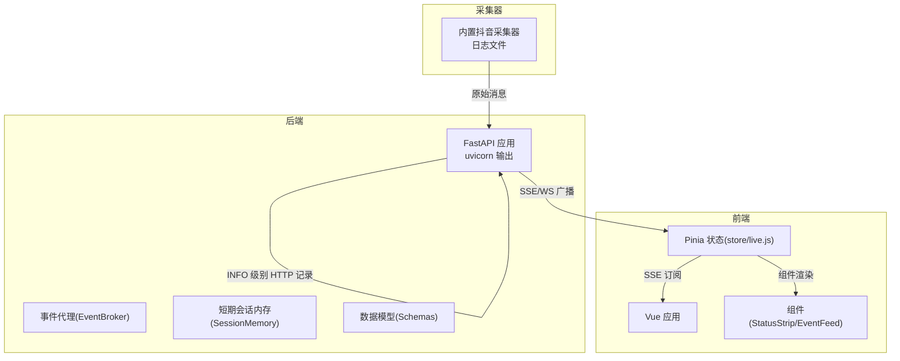
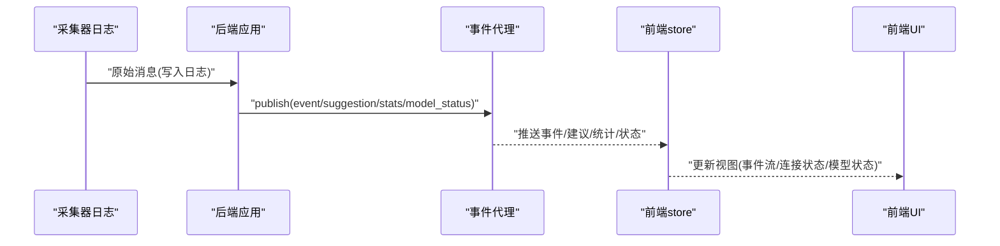
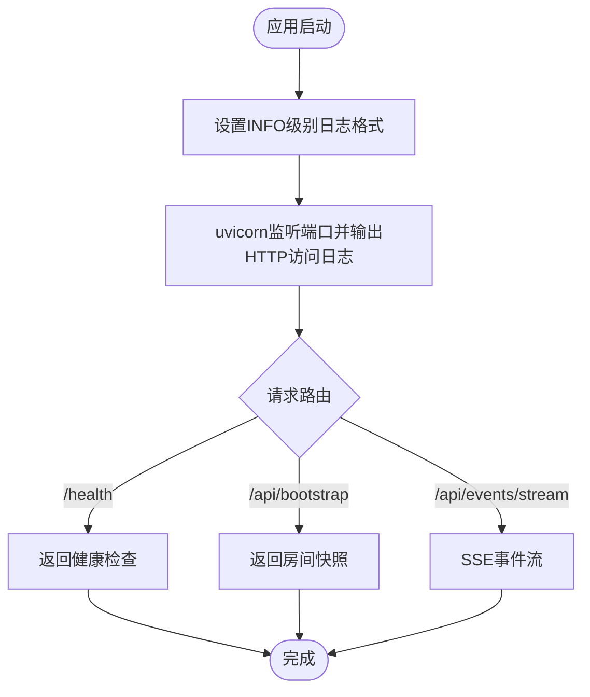
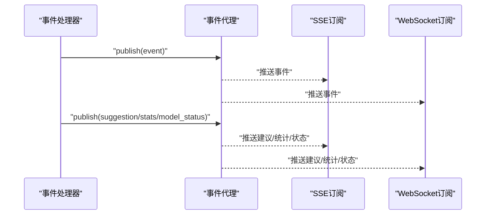
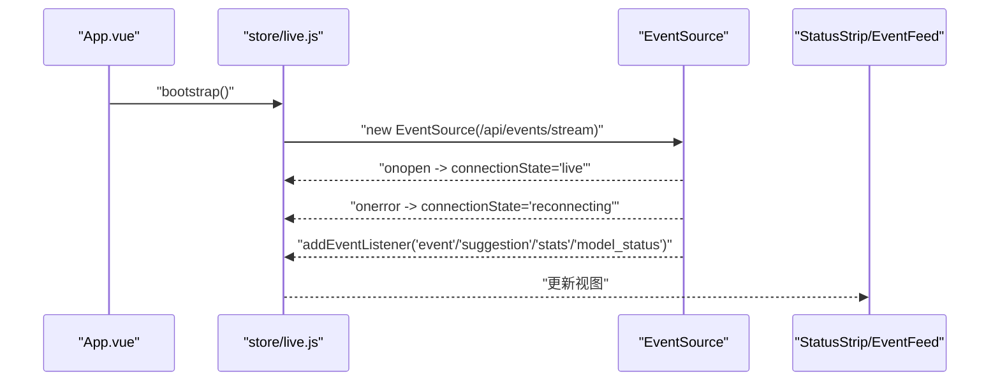
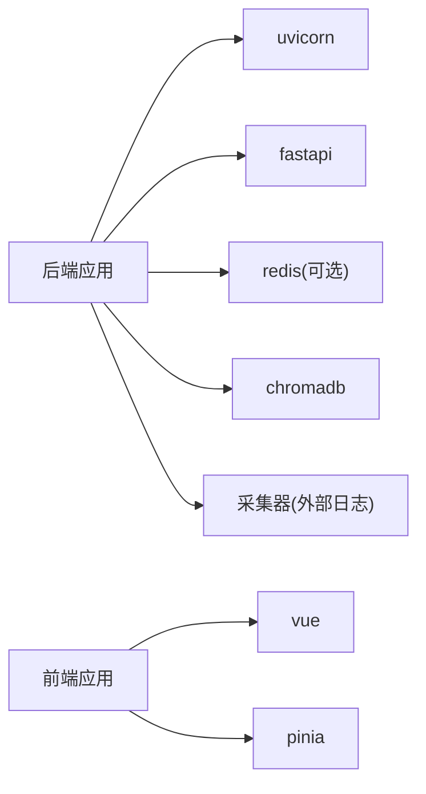

# 日志分析

<cite>
**本文引用的文件**
- [backend/app.py](file://backend/app.py)
- [backend/config.py](file://backend/config.py)
- [backend/memory/session_memory.py](file://backend/memory/session_memory.py)
- [backend/services/broker.py](file://backend/services/broker.py)
- [backend/schemas/live.py](file://backend/schemas/live.py)
- [frontend/src/main.js](file://frontend/src/main.js)
- [frontend/src/stores/live.js](file://frontend/src/stores/live.js)
- [frontend/src/App.vue](file://frontend/src/App.vue)
- [frontend/src/components/StatusStrip.vue](file://frontend/src/components/StatusStrip.vue)
- [frontend/src/components/EventFeed.vue](file://frontend/src/components/EventFeed.vue)
- [logs/backend_8010.out.log](file://logs/backend_8010.out.log)
- [logs/douyinlive_20260407_200112.log](file://logs/douyinlive_20260407_200112.log)
- [start_all.ps1](file://start_all.ps1)
- [start_backend_qwen.ps1](file://start_backend_qwen.ps1)
- [start_frontend.ps1](file://start_frontend.ps1)
- [requirements.txt](file://requirements.txt)
</cite>

## 目录
1. [简介](#简介)
2. [项目结构](#项目结构)
3. [核心组件](#核心组件)
4. [架构总览](#架构总览)
5. [详细组件分析](#详细组件分析)
6. [依赖分析](#依赖分析)
7. [性能考虑](#性能考虑)
8. [故障排查指南](#故障排查指南)
9. [结论](#结论)
10. [附录](#附录)

## 简介
本文件面向开发者与运维人员，系统性讲解如何有效查看与分析该系统的日志。文档覆盖后端FastAPI应用的日志配置与输出格式（以INFO级别为主）、前端Vue应用的控制台日志查看技巧（含SSE连接状态、事件流接收、组件生命周期），以及日志文件位置与命名规则，并提供具体日志示例与解读方法，帮助快速定位异常与性能瓶颈。

## 项目结构
该项目采用前后端分离架构：后端为FastAPI应用，前端为Vue应用。日志分为两类：
- 后端应用日志：由uvicorn在标准输出打印，按INFO级别记录HTTP请求与内部事件。
- 采集器日志：内置抖音直播采集器将原始消息写入独立日志文件，便于离线分析。

图表来源
- [backend/app.py:23](file://backend/app.py#L23)
- [backend/services/broker.py:10](file://backend/services/broker.py#L10)
- [backend/memory/session_memory.py:17](file://backend/memory/session_memory.py#L17)
- [backend/schemas/live.py:29](file://backend/schemas/live.py#L29)
- [frontend/src/stores/live.js:173](file://frontend/src/stores/live.js#L173)
- [frontend/src/App.vue:29](file://frontend/src/App.vue#L29)
- [logs/douyinlive_20260407_200112.log:1](file://logs/douyinlive_20260407_200112.log#L1)

章节来源
- [backend/app.py:23](file://backend/app.py#L23)
- [backend/config.py:63](file://backend/config.py#L63)
- [frontend/src/stores/live.js:173](file://frontend/src/stores/live.js#L173)
- [logs/douyinlive_20260407_200112.log:1](file://logs/douyinlive_20260407_200112.log#L1)

## 核心组件
- 后端日志配置与输出
  - 使用标准库logging在应用入口处设置INFO级别日志格式，uvicorn默认将HTTP访问日志输出到标准输出。
  - 示例日志片段展示了HTTP请求的客户端地址、方法、路径、协议与响应码。
- 事件代理与订阅
  - EventBroker负责将事件广播至所有订阅队列，前端通过SSE或WebSocket订阅消费。
- 短期会话内存
  - SessionMemory支持Redis或内存两种模式，用于缓存最近事件与建议，支撑统计与快照。
- 前端SSE连接与状态
  - Pinia store封装SSE连接生命周期，维护连接状态、事件过滤、统计数据与模型状态。
- 采集器日志
  - 抖音采集器将原始消息写入带时间戳的日志文件，便于离线分析与回放。

章节来源
- [backend/app.py:23](file://backend/app.py#L23)
- [backend/services/broker.py:10](file://backend/services/broker.py#L10)
- [backend/memory/session_memory.py:17](file://backend/memory/session_memory.py#L17)
- [frontend/src/stores/live.js:173](file://frontend/src/stores/live.js#L173)
- [logs/douyinlive_20260407_200112.log:1](file://logs/douyinlive_20260407_200112.log#L1)

## 架构总览
后端应用启动后，内置采集器开始工作，将原始消息写入日志文件；后端对每个事件进行处理并发布到事件代理，前端通过SSE/WS订阅实时接收事件、建议、统计与模型状态。

图表来源
- [backend/app.py:61](file://backend/app.py#L61)
- [backend/services/broker.py:28](file://backend/services/broker.py#L28)
- [frontend/src/stores/live.js:173](file://frontend/src/stores/live.js#L173)

## 详细组件分析

### 后端FastAPI日志配置与输出格式
- 配置方式
  - 在应用入口设置INFO级别日志格式，uvicorn作为ASGI服务器将HTTP访问日志输出到标准输出。
- 输出格式要点
  - 日志级别：INFO
  - 内容包含：客户端地址、请求行、响应状态码
- 关键接口与日志关联
  - /health、/api/bootstrap、/api/events/stream 等接口的请求会被记录为INFO级别日志，便于追踪连接建立、数据拉取与事件流开启。

图表来源
- [backend/app.py:23](file://backend/app.py#L23)
- [backend/app.py:104](file://backend/app.py#L104)
- [backend/app.py:109](file://backend/app.py#L109)
- [backend/app.py:187](file://backend/app.py#L187)

章节来源
- [backend/app.py:23](file://backend/app.py#L23)
- [backend/app.py:104](file://backend/app.py#L104)
- [backend/app.py:109](file://backend/app.py#L109)
- [backend/app.py:187](file://backend/app.py#L187)
- [logs/backend_8010.out.log:1](file://logs/backend_8010.out.log#L1)

### 事件代理与订阅机制
- 事件代理
  - 维护订阅队列集合，向所有订阅者广播消息；当队列满时清理“僵尸”队列。
- 订阅方式
  - SSE：/api/events/stream 返回Server-Sent Events，前端EventSource监听事件类型。
  - WebSocket：/ws/live 接受连接并推送bootstrap与后续事件。
- 关键流程
  - 处理事件后，后端将事件、建议、统计与模型状态分别封装为事件包并发布。
  - 订阅端从队列取出消息并转发给前端。

图表来源
- [backend/app.py:61](file://backend/app.py#L61)
- [backend/app.py:187](file://backend/app.py#L187)
- [backend/app.py:209](file://backend/app.py#L209)
- [backend/services/broker.py:28](file://backend/services/broker.py#L28)

章节来源
- [backend/app.py:61](file://backend/app.py#L61)
- [backend/app.py:187](file://backend/app.py#L187)
- [backend/app.py:209](file://backend/app.py#L209)
- [backend/services/broker.py:10](file://backend/services/broker.py#L10)

### 前端Vue应用的控制台日志查看技巧
- 启动与入口
  - Vue应用在入口文件中创建应用实例并挂载，随后在App组件mounted阶段执行引导与连接。
- SSE连接状态
  - store中定义connectionState，连接打开时置为“live”，错误时置为“reconnecting”，便于在状态条组件中展示。
- 事件流接收
  - store监听“event”“suggestion”“stats”“model_status”四类事件，分别更新事件列表、建议列表、统计数据与模型状态。
- 组件生命周期
  - App组件在挂载后调用bootstrap与connect，确保首屏数据与实时流同步。

图表来源
- [frontend/src/App.vue:29](file://frontend/src/App.vue#L29)
- [frontend/src/stores/live.js:158](file://frontend/src/stores/live.js#L158)
- [frontend/src/stores/live.js:173](file://frontend/src/stores/live.js#L173)
- [frontend/src/stores/live.js:181](file://frontend/src/stores/live.js#L181)
- [frontend/src/components/StatusStrip.vue:113](file://frontend/src/components/StatusStrip.vue#L113)

章节来源
- [frontend/src/main.js:12](file://frontend/src/main.js#L12)
- [frontend/src/App.vue:29](file://frontend/src/App.vue#L29)
- [frontend/src/stores/live.js:158](file://frontend/src/stores/live.js#L158)
- [frontend/src/stores/live.js:173](file://frontend/src/stores/live.js#L173)
- [frontend/src/stores/live.js:181](file://frontend/src/stores/live.js#L181)
- [frontend/src/components/StatusStrip.vue:113](file://frontend/src/components/StatusStrip.vue#L113)

### 采集器日志文件位置与命名规则
- 位置
  - 日志位于仓库根目录的logs文件夹。
- 命名规则
  - 后端uvicorn日志：backend_{端口}.out.log 与 backend_{端口}.err.log
  - 前端开发服务器日志：frontend_{端口}.out.log 与 frontend_{端口}.err.log
  - 采集器日志：douyinlive_YYYYMMDD_HHMMSS.log（按采集开始时间命名）
- 示例
  - 后端日志示例展示了INFO级别的HTTP访问记录。
  - 采集器日志示例展示了原始消息的接收与解析过程，包含消息类型、直播间名称等字段。

章节来源
- [logs/backend_8010.out.log:1](file://logs/backend_8010.out.log#L1)
- [logs/douyinlive_20260407_200112.log:1](file://logs/douyinlive_20260407_200112.log#L1)

### 数据模型与关键字段解读
- LiveEvent
  - 关键字段：event_id、room_id、event_type、method、ts、user、content、metadata、raw
  - 用于标准化直播事件，便于前端渲染与后端处理。
- Suggestion
  - 关键字段：suggestion_id、room_id、event_id、priority、reply_text、tone、reason、confidence、source_events、references、created_at
  - 用于承载AI生成的提词建议及其来源与置信度。
- SessionStats
  - 关键字段：room_id、total_events、comments、gifts、likes、members、follows
  - 轻量统计，用于前端展示互动指标。
- ModelStatus
  - 关键字段：mode、model、backend、last_result、last_error、updated_at
  - 用于展示当前模型运行状态与错误信息。

章节来源
- [backend/schemas/live.py:29](file://backend/schemas/live.py#L29)
- [backend/schemas/live.py:47](file://backend/schemas/live.py#L47)
- [backend/schemas/live.py:64](file://backend/schemas/live.py#L64)
- [backend/schemas/live.py:76](file://backend/schemas/live.py#L76)

## 依赖分析
- 后端依赖
  - uvicorn：ASGI服务器，负责HTTP请求与SSE/WS服务。
  - fastapi：Web框架，提供路由与中间件。
  - redis：可选依赖，用于SessionMemory的Redis模式。
  - chromadb：向量存储，用于事件向量化与检索。
- 前端依赖
  - vue：响应式框架。
  - pinia：状态管理。
  - websocket-client：后端采集器依赖（非前端）。

图表来源
- [requirements.txt:1](file://requirements.txt#L1)
- [requirements.txt:2](file://requirements.txt#L2)
- [requirements.txt:3](file://requirements.txt#L3)
- [requirements.txt:4](file://requirements.txt#L4)
- [requirements.txt:5](file://requirements.txt#L5)

章节来源
- [requirements.txt:1](file://requirements.txt#L1)
- [requirements.txt:2](file://requirements.txt#L2)
- [requirements.txt:3](file://requirements.txt#L3)
- [requirements.txt:4](file://requirements.txt#L4)
- [requirements.txt:5](file://requirements.txt#L5)

## 性能考虑
- SSE/WS连接稳定性
  - 前端store在onerror时将连接状态置为“reconnecting”，应结合后端日志观察重连频率与持续时间。
- 事件吞吐与队列积压
  - EventBroker在队列满时会清理“僵尸”队列，若频繁清理可能意味着订阅端消费能力不足或上游事件过载。
- 缓存与持久化
  - SessionMemory在Redis模式下具备TTL控制，有助于热数据生命周期管理；内存模式适合开发测试但不具备持久化能力。
- 日志轮转与IO
  - 采集器日志按时间戳命名，建议配合系统日志轮转策略避免单文件过大影响IO。

## 故障排查指南
- 后端HTTP请求异常
  - 查看后端日志中的INFO行，确认请求路径与响应码是否符合预期；若出现大量4xx/5xx，需结合业务逻辑与异常处理定位。
- SSE连接断开或重连频繁
  - 观察前端store的onerror回调触发次数与连接状态变化；同时检查后端SSE路由是否稳定。
- 事件未到达前端
  - 确认EventBroker是否正常发布；检查订阅端是否正确接收并更新store状态。
- 采集器无日志
  - 检查采集器启动脚本与.env配置；确认日志文件是否存在且有写权限。
- 模型状态异常
  - 查看model_status字段中的last_error与last_result，结合后端日志定位推理链路问题。

章节来源
- [logs/backend_8010.out.log:1](file://logs/backend_8010.out.log#L1)
- [frontend/src/stores/live.js:186](file://frontend/src/stores/live.js#L186)
- [backend/services/broker.py:31](file://backend/services/broker.py#L31)
- [backend/schemas/live.py:76](file://backend/schemas/live.py#L76)

## 结论
通过统一的日志格式与清晰的组件边界，本项目实现了后端HTTP访问日志、事件代理广播、前端SSE/WS订阅与采集器原始消息日志的协同。建议在生产环境中启用日志轮转与集中化收集，并结合连接状态与事件统计指标进行持续监控，以便快速定位异常与性能瓶颈。

## 附录
- 启动脚本与端口
  - 后端：默认端口8010，使用uvicorn启动。
  - 前端：默认端口5173，使用Vite开发服务器。
- 日志文件命名约定
  - 后端：backend_{端口}.out.log / err.log
  - 前端：frontend_{端口}.out.log / err.log
  - 采集器：douyinlive_YYYYMMDD_HHMMSS.log

章节来源
- [start_backend_qwen.ps1:12](file://start_backend_qwen.ps1#L12)
- [start_frontend.ps1:21](file://start_frontend.ps1#L21)
- [logs/backend_8010.out.log:1](file://logs/backend_8010.out.log#L1)
- [logs/douyinlive_20260407_200112.log:1](file://logs/douyinlive_20260407_200112.log#L1)