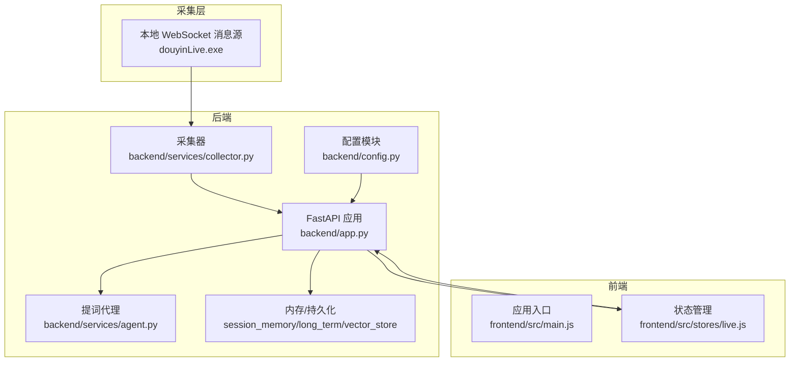
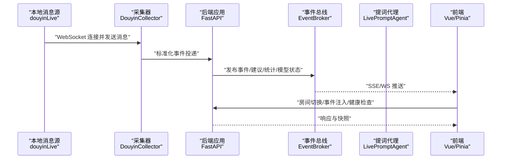
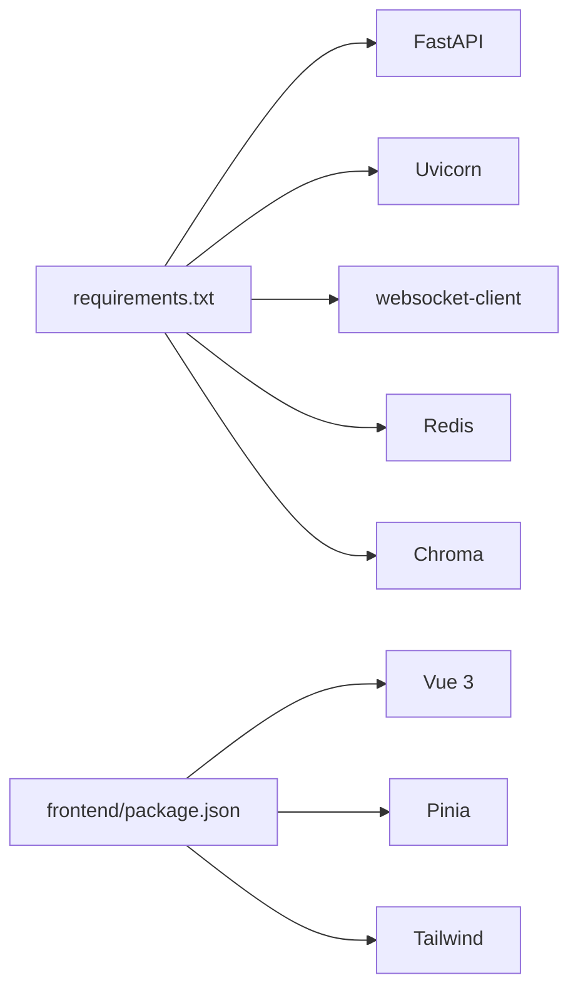

# 调试工具

<cite>
**本文引用的文件**
- [README.md](file://README.md)
- [USAGE.md](file://USAGE.md)
- [requirements.txt](file://requirements.txt)
- [backend/app.py](file://backend/app.py)
- [backend/config.py](file://backend/config.py)
- [backend/services/collector.py](file://backend/services/collector.py)
- [backend/services/agent.py](file://backend/services/agent.py)
- [frontend/src/main.js](file://frontend/src/main.js)
- [frontend/src/stores/live.js](file://frontend/src/stores/live.js)
- [deprecated/debug_client.py](file://deprecated/debug_client.py)
- [start_all.ps1](file://start_all.ps1)
- [start_backend_qwen.ps1](file://start_backend_qwen.ps1)
- [start_frontend.ps1](file://start_frontend.ps1)
</cite>

## 目录
1. [简介](#简介)
2. [项目结构](#项目结构)
3. [核心组件](#核心组件)
4. [架构总览](#架构总览)
5. [详细组件分析](#详细组件分析)
6. [依赖关系分析](#依赖关系分析)
7. [性能考虑](#性能考虑)
8. [故障排查指南](#故障排查指南)
9. [结论](#结论)
10. [附录](#附录)

## 简介
本文件面向调试与排障场景，围绕本项目的后端（FastAPI）、前端（Vue 3 + Pinia）、以及采集链路（本地 WebSocket）提供系统化的调试工具使用指南。重点覆盖以下方面：
- Python 调试器（PDB）在后端服务中的断点设置与变量检查
- 浏览器开发者工具（Network/Console/Elements）在前端与后端接口调试中的应用
- 网络抓包工具（浏览器内置与第三方）在 WebSocket 与 HTTP 请求分析中的实践
- 性能分析工具（cProfile）在后端接口与业务逻辑中的使用步骤

## 项目结构
该项目由三部分组成：
- 后端：FastAPI 应用，提供健康检查、SSE/WS 实时流、事件注入、房间切换等接口
- 前端：Vue 3 + Pinia，负责事件流订阅、SSE/WS 订阅、状态展示与主题切换
- 采集链路：本地 WebSocket 消息源（douyinLive），后端内置采集器连接该源并标准化事件

图表来源
- [backend/app.py:1-220](file://backend/app.py#L1-L220)
- [backend/config.py:1-94](file://backend/config.py#L1-L94)
- [backend/services/collector.py:1-284](file://backend/services/collector.py#L1-L284)
- [backend/services/agent.py:1-393](file://backend/services/agent.py#L1-L393)
- [frontend/src/main.js:1-17](file://frontend/src/main.js#L1-L17)
- [frontend/src/stores/live.js:1-310](file://frontend/src/stores/live.js#L1-L310)

章节来源
- [README.md:21-50](file://README.md#L21-L50)
- [backend/app.py:94-220](file://backend/app.py#L94-L220)
- [frontend/src/main.js:1-17](file://frontend/src/main.js#L1-L17)
- [frontend/src/stores/live.js:158-205](file://frontend/src/stores/live.js#L158-L205)

## 核心组件
- FastAPI 应用与路由：健康检查、SSE 实时流、WebSocket 实时流、事件注入、房间切换等
- 配置模块：从 .env 与环境变量读取配置，解析 LLM 地址与模型名
- 采集器：连接本地 WebSocket，标准化消息为统一事件，投递到事件处理循环
- 提词代理：优先调用在线模型，失败时回退本地规则；维护模型状态
- 前端状态与订阅：通过 SSE/WS 订阅事件流，渲染状态、事件与建议

章节来源
- [backend/app.py:104-220](file://backend/app.py#L104-L220)
- [backend/config.py:40-94](file://backend/config.py#L40-L94)
- [backend/services/collector.py:38-284](file://backend/services/collector.py#L38-L284)
- [backend/services/agent.py:23-393](file://backend/services/agent.py#L23-L393)
- [frontend/src/stores/live.js:158-205](file://frontend/src/stores/live.js#L158-L205)

## 架构总览
下图展示了从采集源到前端展示的端到端链路，以及调试时可切入的关键节点。

图表来源
- [backend/services/collector.py:117-181](file://backend/services/collector.py#L117-L181)
- [backend/app.py:61-78](file://backend/app.py#L61-L78)
- [backend/app.py:187-220](file://backend/app.py#L187-L220)
- [frontend/src/stores/live.js:173-205](file://frontend/src/stores/live.js#L173-L205)

## 详细组件分析

### 后端应用与路由（调试要点）
- 健康检查：用于确认后端存活与当前房间状态
- SSE 实时流：事件类型包括 event、suggestion、stats、model_status
- WebSocket 实时流：连接后先下发 bootstrap 快照
- 房间切换：POST /api/room，支持动态切换房间并重连采集
- 事件注入：POST /api/events，便于联调或替换采集端

调试建议：
- 使用浏览器 Network 面板观察 SSE/WS 连接状态与帧内容
- 使用 cProfile 对慢接口进行性能剖析（见“性能考虑”）

章节来源
- [backend/app.py:104-220](file://backend/app.py#L104-L220)
- [frontend/src/stores/live.js:173-205](file://frontend/src/stores/live.js#L173-L205)

### 采集器（调试要点）
- 连接本地 WebSocket，解析消息为 LiveEvent
- 标准化事件后通过线程安全方式投递到事件循环
- 断线重连与心跳维持
- 日志记录连接状态、错误与异常

调试建议：
- 使用浏览器 Network 面板观察 WS 连接与消息
- 使用 deprecated/debug_client.py 查看原始消息结构与字段
- 若采集异常，检查 .env 中 ROOM_ID、COLLECTOR_HOST/PORT、PING_INTERVAL 等配置

章节来源
- [backend/services/collector.py:38-284](file://backend/services/collector.py#L38-L284)
- [deprecated/debug_client.py:100-139](file://deprecated/debug_client.py#L100-L139)

### 提词代理（调试要点）
- 优先调用在线模型，失败时回退本地规则
- 维护模型状态（mode/model/backend/last_result/last_error/updated_at）
- 上下文构建：最近事件、相似历史、用户画像

调试建议：
- 关注前端顶部“Model”状态，判断是否 fallback 或 heuristic
- 如需定位模型错误，可在 agent 模块中设置断点，检查状态更新与错误分支

章节来源
- [backend/services/agent.py:23-393](file://backend/services/agent.py#L23-L393)
- [frontend/src/stores/live.js:79-86](file://frontend/src/stores/live.js#L79-L86)

### 前端状态与订阅（调试要点）
- 通过 EventSource 订阅 /api/events/stream
- 通过 WebSocket 订阅 /ws/live
- 状态持久化：主题、事件类型过滤、房间号
- 渲染：事件流、建议、统计、模型状态

调试建议：
- 使用浏览器 Console 面板检查订阅事件与错误
- 使用 Elements 面板检查 DOM 结构与主题切换效果

章节来源
- [frontend/src/stores/live.js:158-205](file://frontend/src/stores/live.js#L158-L205)
- [frontend/src/main.js:1-17](file://frontend/src/main.js#L1-L17)

## 依赖关系分析
- 后端依赖：FastAPI、Uvicorn、websocket-client、Redis、Chroma
- 前端依赖：Vue 3、Pinia、Tailwind
- 采集链路依赖：本地 douyinLive 可执行文件

图表来源
- [requirements.txt:1-6](file://requirements.txt#L1-L6)

章节来源
- [requirements.txt:1-6](file://requirements.txt#L1-L6)

## 性能考虑
- 后端接口与业务逻辑的性能剖析
  - 使用 cProfile 对关键接口（如 SSE/WS、事件处理、建议生成）进行采样
  - 分析热点函数与耗时路径，结合日志定位瓶颈
- 前端性能
  - 使用浏览器 Performance 面板分析渲染与事件订阅开销
  - 关注事件队列长度与渲染频率对性能的影响

[本节为通用指导，无需特定文件引用]

## 故障排查指南
- 页面打开但无建议
  - 检查本地消息源是否启动、.env 中 ROOM_ID 是否正确、直播间是否开播
  - 重启后端至最新版本
- 顶部显示 fallback
  - 检查 DASHSCOPE_API_KEY、网络可达性、是否触发超时或限流
- 顶部显示 heuristic
  - 检查 .env 中 LLM_MODE 设置或 .env 加载是否正确
- 前端无法打开
  - 检查 start_frontend.ps1 是否正常、5173 端口是否被占用
- 后端启动但未写入数据
  - 确认本地消息源运行、后端日志中是否连接到 ws://127.0.0.1:1088/ws/{room_id}、当前房间是否有消息

章节来源
- [USAGE.md:198-240](file://USAGE.md#L198-L240)

## 结论
通过结合 PDB 断点调试、浏览器开发者工具与网络抓包、以及 cProfile 性能分析，可以系统性地定位与优化本项目的采集、处理与展示链路。建议在开发与排障过程中按“采集—后端—前端”的顺序逐层验证，配合日志与状态面板快速收敛问题。

[本节为总结性内容，无需特定文件引用]

## 附录

### Python 调试器（PDB）使用技巧（后端）
- 在后端关键位置插入断点
  - 事件处理入口：process_event（位于 backend/app.py）
  - 采集器消息回调：_on_message（位于 backend/services/collector.py）
  - 建议生成入口：maybe_generate/_generate_with_openai_compatible（位于 backend/services/agent.py）
- 变量检查
  - 检查事件结构、最近事件窗口、向量检索结果、模型状态字典
- 调用栈分析
  - 定位异常发生的具体调用链，结合日志定位上游问题
- 实操步骤
  - 在目标函数内添加断点
  - 使用 uvicorn 启动后端（已启用 reload），触发对应接口或事件
  - 在断点处检查变量、单步执行、查看调用栈

章节来源
- [backend/app.py:61-78](file://backend/app.py#L61-L78)
- [backend/services/collector.py:145-159](file://backend/services/collector.py#L145-L159)
- [backend/services/agent.py:73-114](file://backend/services/agent.py#L73-L114)

### 浏览器开发者工具使用方法
- Network 面板
  - 观察 SSE/WS 连接状态、帧内容与重连行为
  - 检查 /api/events/stream 与 /ws/live 的握手与消息类型
- Console 面板
  - 检查订阅事件监听器注册与错误
  - 手动触发房间切换、事件注入等接口
- Elements 面板
  - 检查主题切换对根元素属性的影响
  - 定位事件列表与建议卡片的 DOM 结构

章节来源
- [frontend/src/stores/live.js:173-205](file://frontend/src/stores/live.js#L173-L205)
- [frontend/src/main.js:12-16](file://frontend/src/main.js#L12-L16)

### 网络抓包工具使用指南
- 浏览器内置工具
  - Network 面板：捕获 WebSocket 文本帧与二进制帧，查看请求头与响应体
  - Console 面板：在控制台中打印事件对象，辅助验证字段
- 第三方工具（如 Wireshark）
  - 捕获本地环回接口流量，过滤 ws/wss 协议
  - 结合后端日志时间戳，交叉验证消息顺序与完整性

章节来源
- [backend/app.py:187-220](file://backend/app.py#L187-L220)
- [frontend/src/stores/live.js:173-205](file://frontend/src/stores/live.js#L173-L205)

### 性能分析工具（cProfile）使用步骤
- 后端接口性能剖析
  - 使用 cProfile 对 /api/events/stream、/ws/live、/api/room、/api/events 等接口进行采样
  - 分析事件处理、建议生成、向量检索与持久化等环节的耗时
- 前端性能剖析
  - 使用浏览器 Performance 面板记录渲染与事件订阅开销
  - 关注事件列表长度与渲染频率对性能的影响

章节来源
- [backend/app.py:187-220](file://backend/app.py#L187-L220)
- [backend/services/agent.py:183-329](file://backend/services/agent.py#L183-L329)

### 本地消息源调试客户端
- 使用 deprecated/debug_client.py 直接连接本地 WebSocket，打印原始消息与写入日志
- 适用于确认采集层是否正常连上、消息字段结构与房间号

章节来源
- [deprecated/debug_client.py:100-139](file://deprecated/debug_client.py#L100-L139)

### 启动脚本与环境准备
- 启动后端（Qwen 在线模式 + 内置采集器）
  - 使用 start_backend_qwen.ps1
- 启动前端
  - 使用 start_frontend.ps1
- 一键启动
  - 使用 start_all.ps1，同时打开后端与前端窗口

章节来源
- [start_backend_qwen.ps1:11-12](file://start_backend_qwen.ps1#L11-L12)
- [start_frontend.ps1:20-21](file://start_frontend.ps1#L20-L21)
- [start_all.ps1:11-15](file://start_all.ps1#L11-L15)