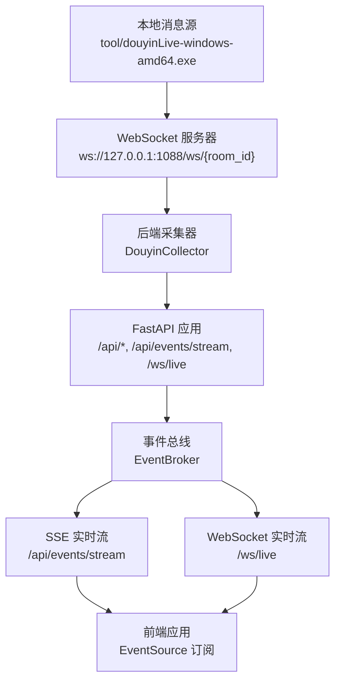
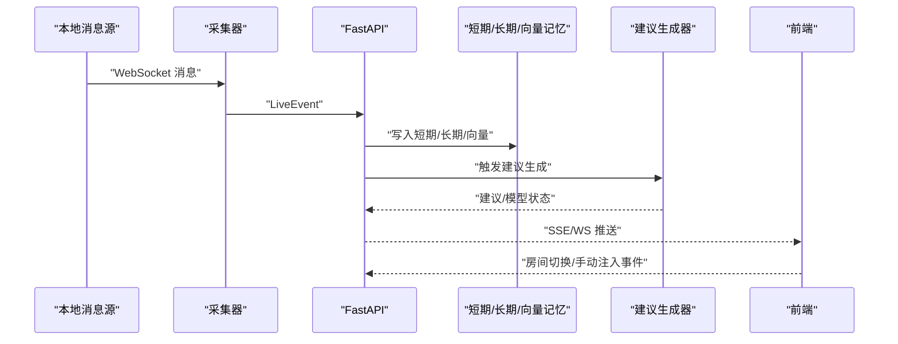
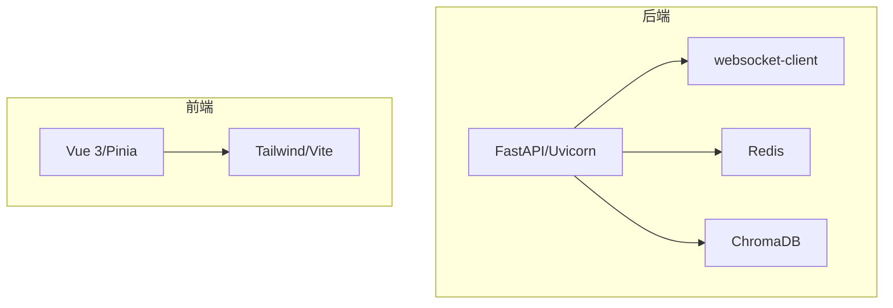

# 调试技巧

<cite>
**本文引用的文件**
- [README.md](file://README.md)
- [backend/app.py](file://backend/app.py)
- [backend/config.py](file://backend/config.py)
- [backend/services/collector.py](file://backend/services/collector.py)
- [backend/services/agent.py](file://backend/services/agent.py)
- [backend/memory/session_memory.py](file://backend/memory/session_memory.py)
- [backend/memory/long_term.py](file://backend/memory/long_term.py)
- [backend/memory/vector_store.py](file://backend/memory/vector_store.py)
- [frontend/src/stores/live.js](file://frontend/src/stores/live.js)
- [frontend/src/main.js](file://frontend/src/main.js)
- [frontend/package.json](file://frontend/package.json)
- [requirements.txt](file://requirements.txt)
- [start_all.ps1](file://start_all.ps1)
- [start_backend_qwen.ps1](file://start_backend_qwen.ps1)
- [start_frontend.ps1](file://start_frontend.ps1)
</cite>

## 目录
1. [简介](#简介)
2. [项目结构](#项目结构)
3. [核心组件](#核心组件)
4. [架构总览](#架构总览)
5. [详细组件分析](#详细组件分析)
6. [依赖分析](#依赖分析)
7. [性能考虑](#性能考虑)
8. [故障排查指南](#故障排查指南)
9. [结论](#结论)
10. [附录](#附录)

## 简介
本文件面向运维与开发人员，提供系统性的调试方法与工具使用指南，覆盖后端服务日志、前端控制台日志、WebSocket/SSE 连接日志的查看与解读；涵盖网络连接问题、API 调用失败、内存泄漏检测、性能瓶颈定位等常见问题的排查流程；并给出 Python 调试器、浏览器开发者工具、网络抓包工具、性能分析工具的实际操作步骤，帮助快速定位与修复启动失败、连接超时、数据不一致等问题。

## 项目结构
该项目由三部分组成：
- 工具层：本地抖音直播消息源（Windows 可执行文件），负责将直播事件通过 WebSocket 暴露给后端。
- 后端：FastAPI 提供 REST、SSE、WebSocket 接口，负责事件采集、短期/长期记忆、向量检索、建议生成与推送。
- 前端：Vue 3 + Pinia + Tailwind，负责事件流订阅、SSE/WS 订阅、状态展示与交互。

图表来源
- [README.md](file://README.md)
- [backend/services/collector.py](file://backend/services/collector.py)
- [backend/app.py](file://backend/app.py)
- [frontend/src/stores/live.js](file://frontend/src/stores/live.js)

章节来源
- [README.md](file://README.md)
- [backend/app.py](file://backend/app.py)
- [frontend/src/stores/live.js](file://frontend/src/stores/live.js)

## 核心组件
- 配置与环境：后端通过 Settings 读取 .env 与环境变量，确保日志、房间号、模型参数、存储路径等正确。
- 采集器：DouyinCollector 连接本地 WebSocket，解析消息为 LiveEvent，提交到后端事件循环。
- 事件处理：后端在 lifespan 中启动采集器，处理事件、写入短期/长期存储、触发建议生成与状态推送。
- 建议生成器：LivePromptAgent 优先调用在线模型，失败时回退启发式规则，并记录模型状态。
- 记忆层：短期 SessionMemory（可选 Redis）、长期 LongTermStore（SQLite）、向量 VectorMemory（可选 Chroma）。
- 前端：Pinia 状态管理，EventSource 订阅 SSE，WebSocket 订阅实时流，展示事件、建议、统计与模型状态。

章节来源
- [backend/config.py](file://backend/config.py)
- [backend/services/collector.py](file://backend/services/collector.py)
- [backend/app.py](file://backend/app.py)
- [backend/services/agent.py](file://backend/services/agent.py)
- [backend/memory/session_memory.py](file://backend/memory/session_memory.py)
- [backend/memory/long_term.py](file://backend/memory/long_term.py)
- [backend/memory/vector_store.py](file://backend/memory/vector_store.py)
- [frontend/src/stores/live.js](file://frontend/src/stores/live.js)

## 架构总览

图表来源
- [backend/services/collector.py](file://backend/services/collector.py)
- [backend/app.py](file://backend/app.py)
- [backend/services/agent.py](file://backend/services/agent.py)
- [frontend/src/stores/live.js](file://frontend/src/stores/live.js)

## 详细组件分析

### 日志配置与日志分析
- 后端日志
  - 默认日志级别为 INFO，格式包含级别、模块名与消息。
  - 关键模块日志点：
    - 采集器：连接、断开、重连、错误、心跳、事件提交结果、消息解析失败等。
    - 建议生成器：模型调用成功/失败、回退、状态变更、异常堆栈等。
    - 应用：健康检查、房间切换、事件注入、SSE/WS 推送等。
- 前端日志
  - 控制台输出连接状态变化、错误提示、事件过滤与主题切换等。
- WebSocket/SSE 日志
  - SSE：EventSource onopen/onerror 与事件类型分发（event/suggestion/stats/model_status）。
  - WS：连接接受、发送 bootstrap 快照、持续推送事件。

章节来源
- [backend/app.py](file://backend/app.py)
- [backend/services/collector.py](file://backend/services/collector.py)
- [backend/services/agent.py](file://backend/services/agent.py)
- [frontend/src/stores/live.js](file://frontend/src/stores/live.js)

### 错误排查流程

#### 启动失败
- 检查 .env 是否存在且包含必要键（如 ROOM_ID、LLM_API_KEY/DASHSCOPE_API_KEY）。
- 后端启动脚本：确认 uvicorn 命令与端口未被占用。
- 前端启动脚本：确认 Node.js 路径与依赖安装完成。
- 若缺少可选依赖（Redis/Chroma），短期/向量功能会降级，不影响基本流程。

章节来源
- [README.md](file://README.md)
- [start_all.ps1](file://start_all.ps1)
- [start_backend_qwen.ps1](file://start_backend_qwen.ps1)
- [start_frontend.ps1](file://start_frontend.ps1)
- [requirements.txt](file://requirements.txt)

#### 连接超时/断开
- 本地消息源未启动或端口不匹配：核对 ws 地址与端口。
- 采集器重连机制：观察日志中的重连延迟与断开原因。
- WebSocket 心跳：若长时间无消息，检查 ping 机制与网络稳定性。

章节来源
- [backend/services/collector.py](file://backend/services/collector.py)
- [backend/config.py](file://backend/config.py)

#### API 调用失败
- 健康检查：访问 /health 确认房间号与会话状态。
- 房间切换：POST /api/room 返回快照，若失败查看响应错误。
- 手动注入事件：POST /api/events 用于联调，返回建议与会话信息。

章节来源
- [backend/app.py](file://backend/app.py)

#### 数据不一致
- 长期存储：SQLite 表结构与索引初始化、列回填、聚合重建。
- 短期存储：Redis 模式下 TTL 生效，非 Redis 模式使用进程内队列。
- 向量检索：Chroma 不可用时退化为哈希嵌入与关键词相似度。

章节来源
- [backend/memory/long_term.py](file://backend/memory/long_term.py)
- [backend/memory/session_memory.py](file://backend/memory/session_memory.py)
- [backend/memory/vector_store.py](file://backend/memory/vector_store.py)

#### 性能瓶颈定位
- 建议生成耗时：关注模型调用超时、回退策略与日志中的状态更新。
- SSE/WS 推送：前端 EventSource 与 WebSocket 的连接状态与事件分发频率。
- 存储写入：SQLite 写入与索引查询、Redis 列表截断与过期设置。

章节来源
- [backend/services/agent.py](file://backend/services/agent.py)
- [frontend/src/stores/live.js](file://frontend/src/stores/live.js)
- [backend/memory/session_memory.py](file://backend/memory/session_memory.py)
- [backend/memory/long_term.py](file://backend/memory/long_term.py)

### 调试工具使用指南

#### Python 调试器（pdb）
- 在关键路径插入断点，逐步执行，观察事件对象、建议生成上下文与存储写入。
- 建议在以下位置设置断点：
  - 采集器消息解析与提交处。
  - 建议生成器构建上下文与模型调用处。
  - 存储层写入与查询处。

章节来源
- [backend/services/collector.py](file://backend/services/collector.py)
- [backend/services/agent.py](file://backend/services/agent.py)
- [backend/memory/long_term.py](file://backend/memory/long_term.py)

#### 浏览器开发者工具
- Console：查看连接状态、错误信息与事件过滤。
- Network：监控 SSE/WS 请求、响应与错误码。
- Performance：录制前端渲染与事件处理耗时。
- Application/Storage：查看本地存储中的事件类型与主题偏好。

章节来源
- [frontend/src/stores/live.js](file://frontend/src/stores/live.js)
- [frontend/src/main.js](file://frontend/src/main.js)
- [frontend/package.json](file://frontend/package.json)

#### 网络抓包工具（Wireshark/Telerik Fiddler）
- 抓取本地 WebSocket 与 HTTP 流量，核对消息格式、头部与状态码。
- 分析 SSE 事件帧与 WS 文本帧，确认事件类型与数据完整性。

章节来源
- [backend/app.py](file://backend/app.py)
- [frontend/src/stores/live.js](file://frontend/src/stores/live.js)

#### 性能分析工具（cProfile/py-spy）
- cProfile：对后端关键函数进行采样，识别热点。
- py-spy：对运行中的 Python 进程进行抽样分析，定位阻塞点。

章节来源
- [backend/app.py](file://backend/app.py)

### 常见问题诊断与解决

- 启动失败
  - 缺少 .env：按说明复制示例并填写必要键。
  - 端口冲突：修改端口或释放占用。
  - 依赖缺失：安装 requirements.txt 中的依赖。

- 连接超时
  - 本地消息源未运行：先启动 tool/douyinLive-windows-amd64.exe。
  - 网络不稳定：检查防火墙与代理，减少延迟。

- 数据不一致
  - SQLite 列回填与索引重建：首次运行或升级后自动执行。
  - Redis 配置：确保连接字符串正确，否则短期存储退化为内存。

- 建议生成异常
  - 模型调用失败：检查 API Key、Base URL、超时设置与网络。
  - 回退策略：当启用在线模式失败时自动回退启发式规则。

章节来源
- [README.md](file://README.md)
- [backend/config.py](file://backend/config.py)
- [backend/services/agent.py](file://backend/services/agent.py)
- [backend/memory/long_term.py](file://backend/memory/long_term.py)
- [backend/memory/session_memory.py](file://backend/memory/session_memory.py)

## 依赖分析
- 后端依赖：FastAPI、Uvicorn、websocket-client、Redis、ChromaDB。
- 前端依赖：Vue 3、Pinia、Tailwind、Vite。
- 可选依赖：Redis、ChromaDB，缺失时短期与向量功能降级。

图表来源
- [requirements.txt](file://requirements.txt)
- [frontend/package.json](file://frontend/package.json)

章节来源
- [requirements.txt](file://requirements.txt)
- [frontend/package.json](file://frontend/package.json)

## 性能考虑
- 建议生成：合理设置 LLM 超时与温度，避免频繁回退。
- 存储写入：Redis 列表截断与过期、SQLite 索引查询优化。
- SSE/WS：前端连接状态与事件分发频率，避免过度刷新。
- 采集器：心跳间隔与重连延迟，平衡实时性与资源消耗。

章节来源
- [backend/config.py](file://backend/config.py)
- [backend/services/agent.py](file://backend/services/agent.py)
- [backend/memory/session_memory.py](file://backend/memory/session_memory.py)
- [backend/memory/long_term.py](file://backend/memory/long_term.py)
- [frontend/src/stores/live.js](file://frontend/src/stores/live.js)

## 故障排查指南

### 后端日志分析要点
- 采集器连接/断开/重连：确认 ws 地址、端口与房间号。
- 事件提交：检查事件处理回调结果与异常日志。
- 建议生成：关注模型状态 last_result 与 last_error 字段。

章节来源
- [backend/services/collector.py](file://backend/services/collector.py)
- [backend/services/agent.py](file://backend/services/agent.py)

### 前端日志分析要点
- EventSource：onopen 成功、onerror 重连、事件类型分发。
- WebSocket：连接接受、bootstrap 快照、持续推送。
- 状态：模型状态、统计数据、事件过滤与主题切换。

章节来源
- [frontend/src/stores/live.js](file://frontend/src/stores/live.js)

### 网络与 API 排查
- 健康检查：/health 返回房间号与活动会话。
- 房间切换：/api/room 返回最新快照，失败时检查请求体与响应错误。
- 手动注入：/api/events 用于联调，返回建议与会话信息。

章节来源
- [backend/app.py](file://backend/app.py)

### 存储一致性排查
- SQLite：表结构、索引、列回填与聚合重建。
- Redis：列表截断、过期与 TTL。
- 向量：Chroma 可用性与哈希嵌入退化。

章节来源
- [backend/memory/long_term.py](file://backend/memory/long_term.py)
- [backend/memory/session_memory.py](file://backend/memory/session_memory.py)
- [backend/memory/vector_store.py](file://backend/memory/vector_store.py)

## 结论
通过系统化的日志分析、前后端连接监控、存储一致性检查与性能采样，可快速定位并解决启动失败、连接超时、API 调用失败、数据不一致与性能瓶颈等问题。建议在日常运维中结合本指南的工具与流程，建立标准化的排障手册与回归测试。

## 附录

### 快速检查清单
- 确认 .env 存在并填写必要键。
- 启动本地消息源、后端与前端。
- 访问 /health 与前端界面，观察连接状态。
- 查看后端日志与前端控制台错误。
- 使用抓包工具核对 SSE/WS 消息。
- 对关键路径进行性能采样与断点调试。

章节来源
- [README.md](file://README.md)
- [backend/app.py](file://backend/app.py)
- [frontend/src/stores/live.js](file://frontend/src/stores/live.js)