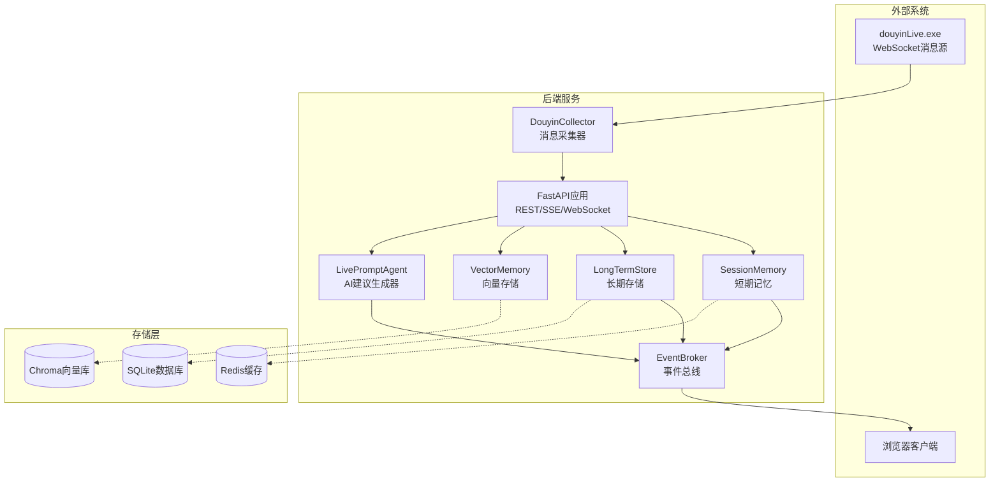
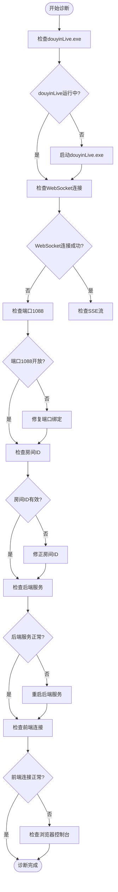
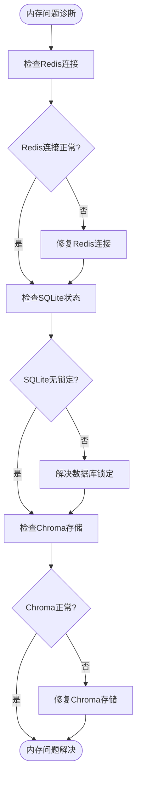
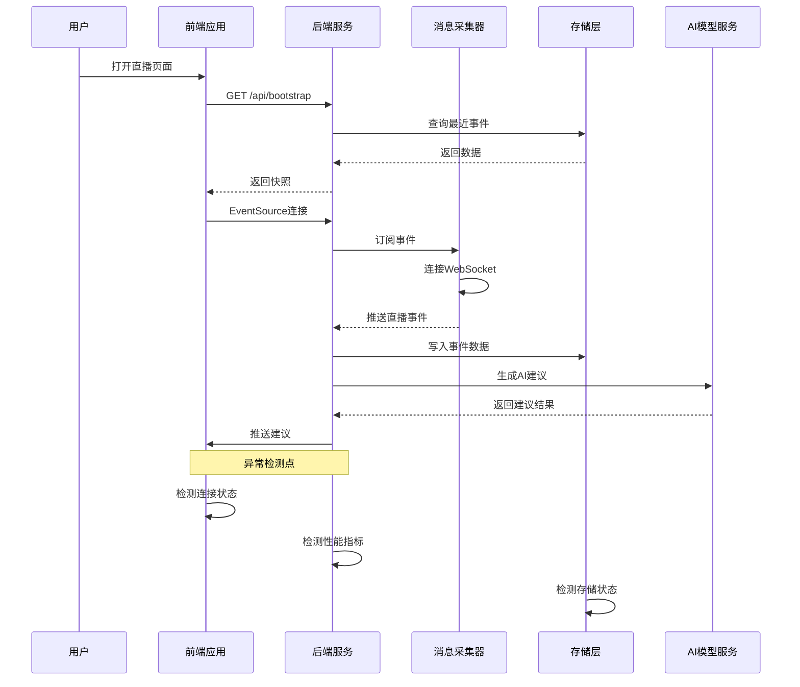

# 错误排查

<cite>
**本文档引用的文件**
- [backend/app.py](file://backend/app.py)
- [backend/config.py](file://backend/config.py)
- [backend/services/broker.py](file://backend/services/broker.py)
- [backend/services/collector.py](file://backend/services/collector.py)
- [backend/services/agent.py](file://backend/services/agent.py)
- [backend/memory/session_memory.py](file://backend/memory/session_memory.py)
- [backend/memory/long_term.py](file://backend/memory/long_term.py)
- [backend/memory/vector_store.py](file://backend/memory/vector_store.py)
- [backend/schemas/live.py](file://backend/schemas/live.py)
- [frontend/src/stores/live.js](file://frontend/src/stores/live.js)
- [requirements.txt](file://requirements.txt)
- [README.md](file://README.md)
- [USAGE.md](file://USAGE.md)
</cite>

## 目录
1. [简介](#简介)
2. [系统架构概览](#系统架构概览)
3. [网络连接问题排查](#网络连接问题排查)
4. [内存相关问题排查](#内存相关问题排查)
5. [性能问题定位](#性能问题定位)
6. [常见错误代码与异常](#常见错误代码与异常)
7. [故障诊断流程图](#故障诊断流程图)
8. [预防性维护建议](#预防性维护建议)

## 简介

Live Prompter 是一个面向抖音直播场景的实时提词系统，采用前后端分离架构。该系统通过本地 WebSocket 消息源获取直播事件，经过标准化处理后，通过短期记忆、长期存储、向量检索和 AI 建议生成等组件，最终将实时提词内容推送到前端展示。

本文档提供了系统化的故障诊断方法和解决方案，涵盖网络连接问题、内存相关问题、性能问题的定位技巧，以及常见错误代码和异常信息的解释。

## 系统架构概览



**图表来源**
- [backend/app.py:1-220](file://backend/app.py#L1-L220)
- [backend/services/collector.py:1-284](file://backend/services/collector.py#L1-L284)
- [backend/services/broker.py:1-40](file://backend/services/broker.py#L1-L40)

## 网络连接问题排查

### WebSocket连接失败诊断

WebSocket连接失败是最常见的网络问题，主要涉及以下组件：

#### 1. 消息源连接问题

**诊断步骤：**
1. 验证 `douyinLive.exe` 是否正常运行
2. 检查WebSocket服务器端口是否开放
3. 确认房间ID配置正确

**关键检查点：**
- 端口监听状态：`127.0.0.1:1088`
- 房间ID格式：纯数字字符串
- 网络连通性测试

**相关代码位置：**
- [WebSocket连接URL构建:54-59](file://backend/services/collector.py#L54-L59)
- [连接建立逻辑:117-139](file://backend/services/collector.py#L117-L139)

#### 2. 后端WebSocket服务问题

**诊断步骤：**
1. 检查FastAPI应用是否正常启动
2. 验证WebSocket路由配置
3. 确认事件总线订阅机制

**关键检查点：**
- `/ws/live` 路由可用性
- 事件队列订阅状态
- 连接断开处理

**相关代码位置：**
- [WebSocket路由定义:209-220](file://backend/app.py#L209-L220)
- [事件总线订阅:212-217](file://backend/app.py#L212-L217)

#### 3. 前端WebSocket连接问题

**诊断步骤：**
1. 检查浏览器控制台错误
2. 验证WebSocket协议升级
3. 确认跨域设置

**相关代码位置：**
- [前端WebSocket连接:300-305](file://frontend/src/stores/live.js#L300-L305)

### SSE事件流中断诊断

SSE（Server-Sent Events）流中断问题通常出现在以下场景：

#### 1. 事件流生成器问题

**诊断步骤：**
1. 检查事件队列状态
2. 验证消息序列化
3. 确认房间过滤逻辑

**关键检查点：**
- `retry` 参数设置
- 房间ID匹配逻辑
- JSON序列化编码

**相关代码位置：**
- [SSE事件流生成:187-206](file://backend/app.py#L187-L206)
- [事件队列订阅:192-204](file://backend/app.py#L192-L204)

#### 2. 前端SSE连接问题

**诊断步骤：**
1. 检查EventSource对象状态
2. 验证事件监听器注册
3. 确认重连机制

**相关代码位置：**
- [前端SSE连接:173-205](file://frontend/src/stores/live.js#L173-L205)

### API调用超时问题

#### 1. LLM API超时

**诊断步骤：**
1. 检查网络延迟
2. 验证API密钥有效性
3. 确认超时配置

**关键检查点：**
- `LLM_TIMEOUT_SECONDS` 配置
- 网络连通性
- API服务可用性

**相关代码位置：**
- [LLM超时配置](file://backend/config.py#L61)
- [HTTP请求超时](file://backend/services/agent.py#L223)

#### 2. 数据库查询超时

**诊断步骤：**
1. 检查SQL查询性能
2. 验证索引使用情况
3. 确认连接池状态

**相关代码位置：**
- [SQLite连接管理:41-44](file://backend/memory/long_term.py#L41-L44)

### 网络连接问题诊断流程图



**图表来源**
- [backend/services/collector.py:117-139](file://backend/services/collector.py#L117-L139)
- [backend/app.py:187-220](file://backend/app.py#L187-L220)
- [frontend/src/stores/live.js:173-205](file://frontend/src/stores/live.js#L173-L205)

## 内存相关问题排查

### Redis连接异常诊断

Redis连接异常会影响短期记忆的持久化，系统会自动降级为进程内内存模式。

#### 1. Redis连接失败

**诊断步骤：**
1. 检查Redis服务状态
2. 验证连接URL格式
3. 确认网络连通性

**关键检查点：**
- `REDIS_URL` 环境变量
- Redis服务器可达性
- 认证凭据正确性

**相关代码位置：**
- [Redis连接初始化:29-30](file://backend/memory/session_memory.py#L29-L30)
- [Redis配置](file://backend/config.py#L54)

#### 2. Redis内存不足

**诊断步骤：**
1. 检查Redis内存使用率
2. 验证键空间大小
3. 确认TTL设置

**相关代码位置：**
- [Redis键操作:45-62](file://backend/memory/session_memory.py#L45-L62)

### SQLite数据库锁定诊断

SQLite数据库锁定是常见的并发访问问题。

#### 1. 数据库锁等待

**诊断步骤：**
1. 检查数据库文件权限
2. 验证并发连接数
3. 确认事务状态

**关键检查点：**
- 数据库文件锁定状态
- 事务超时设置
- 并发写入冲突

**相关代码位置：**
- [SQLite连接管理:41-44](file://backend/memory/long_term.py#L41-L44)
- [数据库表结构:54-149](file://backend/memory/long_term.py#L54-L149)

#### 2. 数据库文件损坏

**诊断步骤：**
1. 检查数据库完整性
2. 验证表结构一致性
3. 确认索引状态

**相关代码位置：**
- [数据库迁移逻辑:155-182](file://backend/memory/long_term.py#L155-L182)

### Chroma向量存储问题诊断

Chroma向量存储提供高级检索能力，但需要额外的依赖。

#### 1. Chroma客户端初始化失败

**诊断步骤：**
1. 检查Chroma依赖安装
2. 验证存储路径权限
3. 确认磁盘空间充足

**关键检查点：**
- `chromadb` 库导入
- 存储目录可写性
- 磁盘空间监控

**相关代码位置：**
- [Chroma客户端初始化:60-63](file://backend/memory/vector_store.py#L60-L63)
- [Chroma存储路径](file://backend/config.py#L53)

#### 2. 向量检索性能问题

**诊断步骤：**
1. 检查向量维度设置
2. 验证索引构建状态
3. 确认查询性能

**相关代码位置：**
- [向量检索实现:85-108](file://backend/memory/vector_store.py#L85-L108)

### 内存相关问题诊断流程图



**图表来源**
- [backend/memory/session_memory.py:17-31](file://backend/memory/session_memory.py#L17-L31)
- [backend/memory/long_term.py:36-44](file://backend/memory/long_term.py#L36-L44)
- [backend/memory/vector_store.py:52-63](file://backend/memory/vector_store.py#L52-L63)

## 性能问题定位

### 响应时间过长诊断

#### 1. API响应延迟

**诊断步骤：**
1. 分析各API端点耗时
2. 检查数据库查询性能
3. 确认缓存命中率

**关键指标：**
- `/health` 健康检查响应
- `/api/bootstrap` 初始化响应
- `/api/events/stream` SSE流响应

**相关代码位置：**
- [健康检查端点:104-106](file://backend/app.py#L104-L106)
- [SSE流端点:187-206](file://backend/app.py#L187-L206)

#### 2. AI建议生成延迟

**诊断步骤：**
1. 检查LLM API响应时间
2. 验证本地规则计算
3. 确认向量检索性能

**相关代码位置：**
- [AI建议生成:73-94](file://backend/services/agent.py#L73-L94)
- [向量检索:85-108](file://backend/memory/vector_store.py#L85-L108)

### 内存泄漏检测

#### 1. 事件总线内存泄漏

**诊断步骤：**
1. 监控订阅队列数量
2. 检查过期队列清理
3. 确认资源释放

**相关代码位置：**
- [事件总线清理:31-40](file://backend/services/broker.py#L31-L40)

#### 2. 前端内存泄漏

**诊断步骤：**
1. 检查EventSource对象
2. 验证WebSocket连接
3. 确认定时器清理

**相关代码位置：**
- [前端连接管理:137-142](file://frontend/src/stores/live.js#L137-L142)

### CPU占用过高诊断

#### 1. 后端CPU占用

**诊断步骤：**
1. 检查事件处理循环
2. 验证AI生成计算
3. 确认数据库操作

**相关代码位置：**
- [事件处理流程:61-78](file://backend/app.py#L61-L78)
- [AI生成计算:183-330](file://backend/services/agent.py#L183-L330)

#### 2. 前端CPU占用

**诊断步骤：**
1. 检查Vue组件渲染
2. 验证事件监听器
3. 确认定时器使用

**相关代码位置：**
- [前端状态管理:70-310](file://frontend/src/stores/live.js#L70-L310)

## 常见错误代码与异常

### 网络连接错误

| 错误类型 | 错误代码 | 描述 | 解决方案 |
|---------|---------|------|---------|
| WebSocket连接失败 | 1006 | 连接意外关闭 | 检查douyinLive.exe状态，验证端口1088 |
| SSE连接中断 | 1002 | 连接协议错误 | 检查后端SSE路由，验证事件队列 |
| API超时 | 408 | 请求超时 | 调整LLM_TIMEOUT_SECONDS，检查网络延迟 |
| 网络不可达 | ECONNREFUSED | 连接被拒绝 | 检查服务端口绑定，验证防火墙设置 |

### 数据库错误

| 错误类型 | 错误代码 | 描述 | 解决方案 |
|---------|---------|------|---------|
| SQLite锁定 | database is locked | 数据库被锁定 | 检查并发访问，优化事务处理 |
| 表不存在 | no such table | 数据库表缺失 | 运行数据库初始化脚本 |
| 索引失效 | index corruption | 索引损坏 | 重建相关索引 |
| 连接池耗尽 | too many connections | 连接数过多 | 调整连接池配置 |

### 内存相关错误

| 错误类型 | 错误代码 | 描述 | 解决方案 |
|---------|---------|------|---------|
| Redis连接失败 | ConnectionError | Redis连接异常 | 检查Redis服务状态，验证认证信息 |
| Chroma初始化失败 | ModuleNotFoundError | Chroma库未安装 | 安装chromadb依赖，检查Python环境 |
| 内存不足 | MemoryError | 系统内存不足 | 增加系统内存，优化数据结构 |

### AI模型错误

| 错误类型 | 错误代码 | 描述 | 解决方案 |
|---------|---------|------|---------|
| API密钥无效 | 401 | 未授权访问 | 检查DASHSCOPE_API_KEY配置 |
| 模型调用失败 | 500 | 服务器内部错误 | 检查模型服务可用性，验证请求格式 |
| 超时错误 | 408 | 请求超时 | 增加LLM_TIMEOUT_SECONDS，检查网络状况 |
| JSON解析错误 | 400 | 请求格式错误 | 验证输入数据格式，检查编码设置 |

### 前端错误

| 错误类型 | 错误代码 | 描述 | 解决方案 |
|---------|---------|------|---------|
| EventSource连接失败 | NetworkError | SSE连接异常 | 检查CORS配置，验证服务器响应 |
| WebSocket连接失败 | WebSocketError | WebSocket连接异常 | 检查浏览器兼容性，验证协议支持 |
| 内存泄漏 | MemoryLeak | 内存使用持续增长 | 检查事件监听器清理，验证资源释放 |

## 故障诊断流程图

### 端到端故障诊断流程



**图表来源**
- [backend/app.py:104-220](file://backend/app.py#L104-L220)
- [backend/services/collector.py:117-139](file://backend/services/collector.py#L117-L139)
- [frontend/src/stores/live.js:158-205](file://frontend/src/stores/live.js#L158-L205)

### 性能监控流程

```mermaid
flowchart LR
subgraph "监控指标"
Latency[响应延迟(ms)]
Throughput[吞吐量(QPS)]
Memory[内存使用(MB)]
CPU[CPU占用(%)]
end
subgraph "诊断工具"
Logs[日志分析]
Metrics[性能指标]
Tracing[调用追踪]
Profiling[性能分析]
end
subgraph "优化措施"
Config[配置调整]
Scaling[水平扩展]
Caching[缓存优化]
Indexing[索引优化]
end
Latency --> Logs
Throughput --> Metrics
Memory --> Tracing
CPU --> Profiling
Logs --> Config
Metrics --> Scaling
Tracing --> Caching
Profiling --> Indexing
```

## 预防性维护建议

### 日常维护清单

1. **监控告警设置**
   - 设置系统资源使用阈值
   - 配置服务可用性监控
   - 建立异常通知机制

2. **定期备份策略**
   - SQLite数据库备份
   - Redis数据持久化
   - Chroma向量数据备份

3. **性能优化计划**
   - 定期分析慢查询
   - 优化索引策略
   - 调整缓存配置

4. **安全加固措施**
   - API密钥轮换
   - 网络访问控制
   - 数据加密传输

### 最佳实践建议

1. **配置管理**
   - 使用环境变量管理敏感配置
   - 建立配置变更审批流程
   - 定期审查配置有效性

2. **代码质量**
   - 添加适当的错误处理
   - 实现资源清理机制
   - 编写单元测试覆盖

3. **运维自动化**
   - 编写部署脚本
   - 建立监控仪表板
   - 实施自动恢复机制

通过遵循本文档提供的诊断方法和最佳实践，可以有效地识别和解决Live Prompter系统中的各种问题，确保系统的稳定运行和良好的用户体验。