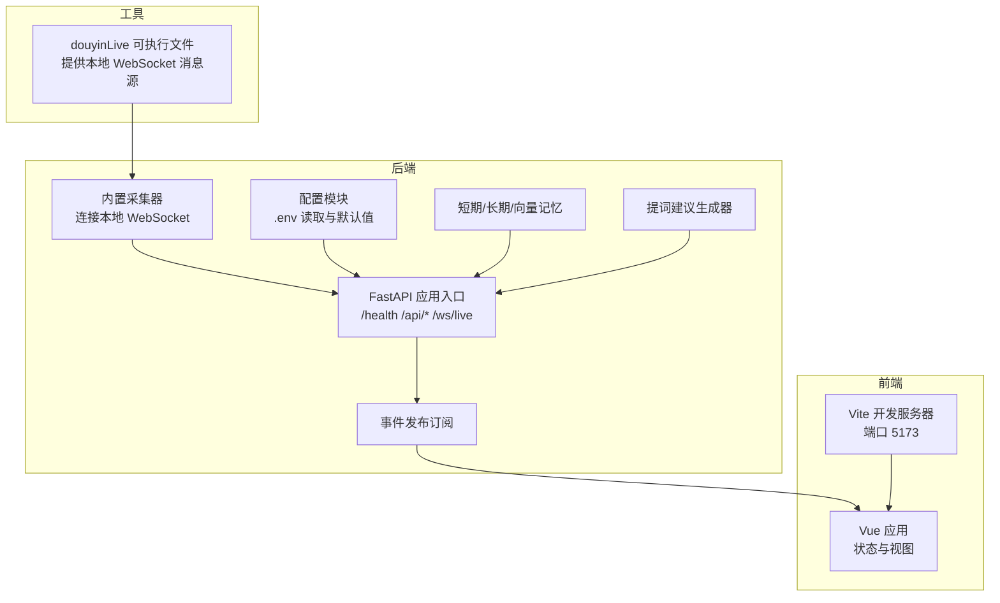
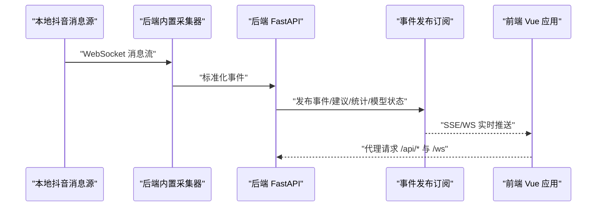
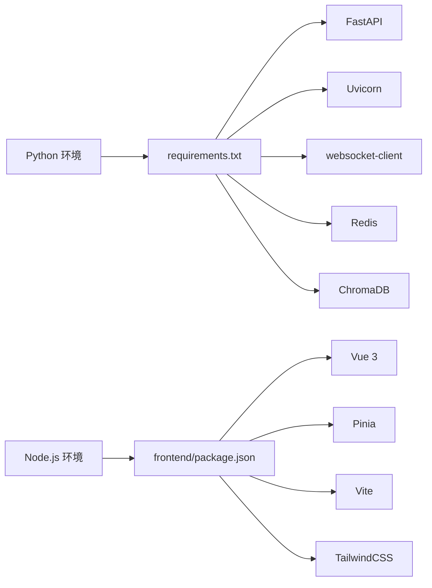

# 快速开始

<cite>
**本文引用的文件**
- [README.md](file://README.md)
- [USAGE.md](file://USAGE.md)
- [requirements.txt](file://requirements.txt)
- [frontend/package.json](file://frontend/package.json)
- [start_all.bat](file://start_all.bat)
- [start_all.ps1](file://start_all.ps1)
- [start_backend_qwen.ps1](file://start_backend_qwen.ps1)
- [start_frontend.ps1](file://start_frontend.ps1)
- [backend/app.py](file://backend/app.py)
- [backend/config.py](file://backend/config.py)
- [frontend/vite.config.js](file://frontend/vite.config.js)
- [frontend/src/App.vue](file://frontend/src/App.vue)
- [frontend/src/main.js](file://frontend/src/main.js)
</cite>

## 目录
1. [简介](#简介)
2. [项目结构](#项目结构)
3. [核心组件](#核心组件)
4. [架构总览](#架构总览)
5. [详细组件分析](#详细组件分析)
6. [依赖分析](#依赖分析)
7. [性能考虑](#性能考虑)
8. [故障排除指南](#故障排除指南)
9. [结论](#结论)
10. [附录](#附录)

## 简介
本指南面向首次接触本项目的用户，目标是在最短时间内完成环境准备、依赖安装与系统启动，并在浏览器中看到实时提词效果。项目由三部分组成：本地抖音消息源工具、后端（FastAPI）与前端（Vue 3），并通过内置采集器将直播事件标准化后进行短期/长期记忆与向量检索，最终生成提词建议并实时推送至前端。

## 项目结构
- 后端：FastAPI 应用入口、配置解析、事件采集、短期/长期记忆、向量检索、提词建议生成与实时推送。
- 前端：Vue 3 + Pinia + Tailwind，通过代理将 /api 与 /ws 请求转发至后端。
- 工具：本地抖音消息源可执行文件，提供 WebSocket 消息源。
- 脚本：PowerShell 与批处理脚本，一键启动后端与前端。

图表来源
- [backend/app.py:94-220](file://backend/app.py#L94-L220)
- [backend/config.py:39-94](file://backend/config.py#L39-L94)
- [frontend/vite.config.js:8-22](file://frontend/vite.config.js#L8-L22)

章节来源
- [README.md:21-34](file://README.md#L21-L34)
- [USAGE.md:15-23](file://USAGE.md#L15-L23)

## 核心组件
- 后端应用入口与生命周期：负责启动内置采集器、注册路由、健康检查、SSE/WS 实时流等。
- 配置模块：从 .env 与环境变量读取配置，提供默认值，确保本地开箱即用。
- 前端开发服务器：通过代理将 /api 与 /ws 请求转发至后端，便于本地联调。
- 工具与脚本：本地抖音消息源与启动脚本，简化用户操作。

章节来源
- [backend/app.py:84-101](file://backend/app.py#L84-L101)
- [backend/config.py:11-36](file://backend/config.py#L11-L36)
- [frontend/vite.config.js:10-22](file://frontend/vite.config.js#L10-L22)
- [start_all.ps1:1-18](file://start_all.ps1#L1-L18)

## 架构总览
系统运行链路：本地抖音消息源通过 WebSocket 暴露消息；后端内置采集器连接该源，标准化为统一事件；随后写入短期/长期存储与向量库，生成提词建议并通过 SSE/WS 推送至前端；前端通过代理访问后端接口，实时展示状态、事件与建议。

图表来源
- [backend/app.py:61-78](file://backend/app.py#L61-L78)
- [backend/app.py:187-220](file://backend/app.py#L187-L220)
- [frontend/vite.config.js:12-20](file://frontend/vite.config.js#L12-L20)

章节来源
- [README.md:35-48](file://README.md#L35-L48)

## 详细组件分析

### 环境准备与依赖安装
- Windows 环境要求：项目明确要求 Windows 平台。
- Python 与 Node.js：后端依赖 Python 3.10+，前端依赖 Node.js 18+。
- 可选组件：Redis 与 Chroma 相关依赖，未安装也可运行基础流程。

依赖安装步骤
- Python 依赖：使用 pip 安装 requirements.txt 中列出的包。
- 前端依赖：进入 frontend 目录，使用 npm 安装依赖。

预期输出
- Python 安装成功后，后端可正常启动。
- 前端安装完成后，Vite 开发服务器可启动并在本地端口提供页面。

章节来源
- [README.md:50-65](file://README.md#L50-L65)
- [USAGE.md:15-23](file://USAGE.md#L15-L23)
- [requirements.txt:1-6](file://requirements.txt#L1-L6)
- [frontend/package.json:1-23](file://frontend/package.json#L1-L23)

### 启动方式一：手动逐个启动
- 启动抖音消息源：运行本地可执行文件，确保其在本地提供 WebSocket 消息源。
- 配置环境变量：复制示例配置文件并填写必要字段（如房间号与模型密钥）。
- 安装后端依赖：在项目根目录执行依赖安装命令。
- 启动后端：使用 uvicorn 启动 FastAPI 应用。
- 启动前端：进入 frontend 目录，安装依赖并启动开发服务器。
- 访问页面：在浏览器打开前端地址，查看实时状态与提词。

预期输出
- 后端控制台显示健康检查与事件处理日志。
- 前端页面显示顶部状态条、主提词卡片与右侧事件流。

章节来源
- [README.md:66-114](file://README.md#L66-L114)
- [USAGE.md:24-123](file://USAGE.md#L24-L123)

### 启动方式二：使用 PowerShell 脚本启动
- 使用仓库自带脚本一键启动：执行启动脚本，将分别在新 PowerShell 窗口中启动后端与前端。
- 后端脚本：校验 .env 文件是否存在，若缺失则提示先复制并填写密钥。
- 前端脚本：检测 Node.js 安装路径，若缺失则提示安装；否则自动安装依赖并启动开发服务器。

预期输出
- 控制台打印“正在启动后端/前端”提示。
- 新窗口分别显示后端与前端启动日志。

章节来源
- [USAGE.md:91-115](file://USAGE.md#L91-L115)
- [start_all.ps1:1-18](file://start_all.ps1#L1-L18)
- [start_backend_qwen.ps1:1-13](file://start_backend_qwen.ps1#L1-L13)
- [start_frontend.ps1:1-22](file://start_frontend.ps1#L1-L22)

### 启动方式三：使用批处理文件启动
- 批处理脚本：调用 PowerShell 脚本，实现与上述相同的一键启动效果。
- 注意事项：确保执行策略允许运行脚本，避免因策略限制导致启动失败。

预期输出
- 批处理窗口执行后，自动打开两个 PowerShell 窗口分别启动后端与前端。

章节来源
- [start_all.bat:1-9](file://start_all.bat#L1-L9)
- [start_all.ps1:1-18](file://start_all.ps1#L1-L18)

### 启动步骤的作用与注意事项
- 抖音消息源：提供本地 WebSocket 消息源，供后端采集器连接。
- .env 配置：决定房间号、模型模式与密钥等关键参数，缺失会导致启动失败或功能受限。
- 后端启动：内置采集器随应用生命周期启动，连接本地消息源并处理事件。
- 前端启动：Vite 代理将 /api 与 /ws 请求转发至后端，便于本地联调。
- 端口占用：若 5173 或 8010 端口被占用，需释放或调整端口。

章节来源
- [README.md:82-140](file://README.md#L82-L140)
- [USAGE.md:179-232](file://USAGE.md#L179-L232)
- [frontend/vite.config.js:12-20](file://frontend/vite.config.js#L12-L20)

## 依赖分析
- 后端依赖：websocket-client、fastapi、uvicorn、redis、chromadb。
- 前端依赖：vue、pinia、vite、tailwindcss 等。
- 可选依赖：Redis 与 Chroma，未安装时系统仍可运行基础流程。

图表来源
- [requirements.txt:1-6](file://requirements.txt#L1-L6)
- [frontend/package.json:11-21](file://frontend/package.json#L11-L21)

章节来源
- [requirements.txt:1-6](file://requirements.txt#L1-L6)
- [frontend/package.json:1-23](file://frontend/package.json#L1-L23)

## 性能考虑
- 本地消息源与后端在同一主机运行，延迟低，适合本地联调。
- 前端代理仅在开发阶段生效，生产部署时应按实际域名与端口调整。
- 可选的 Redis 与 Chroma 能提升短期记忆与向量检索性能，但非必需。

## 故障排除指南
- 页面打开但无建议：检查消息源是否已启动、房间号是否正确、直播间是否开播、后端是否已重启到最新版本。
- 顶部显示回退：说明在线模型调用失败，优先检查密钥、网络与超时设置。
- 顶部显示规则：确认 .env 中模型模式设置或 .env 加载是否正确。
- 前端无法打开：检查脚本是否正常启动、5173 端口是否被占用。
- 后端启动但无数据写入：确认消息源运行、后端日志已连接本地 WebSocket、当前房间确有消息。

章节来源
- [USAGE.md:198-240](file://USAGE.md#L198-L240)

## 结论
按照本指南完成环境准备与依赖安装后，可通过手动逐个启动或使用脚本快速启动系统。在浏览器中打开前端页面即可看到实时状态与提词效果。遇到问题时，可依据故障排除指南逐一排查。

## 附录
- 后端默认地址：http://127.0.0.1:8010
- 前端默认地址：http://127.0.0.1:5173
- 健康检查接口：GET /health
- 初始化快照接口：GET /api/bootstrap
- SSE 实时流：GET /api/events/stream
- WebSocket 实时流：GET /ws/live

章节来源
- [README.md:130-140](file://README.md#L130-L140)
- [backend/app.py:104-106](file://backend/app.py#L104-L106)
- [backend/app.py:109-112](file://backend/app.py#L109-L112)
- [backend/app.py:187-206](file://backend/app.py#L187-L206)
- [backend/app.py:209-220](file://backend/app.py#L209-L220)