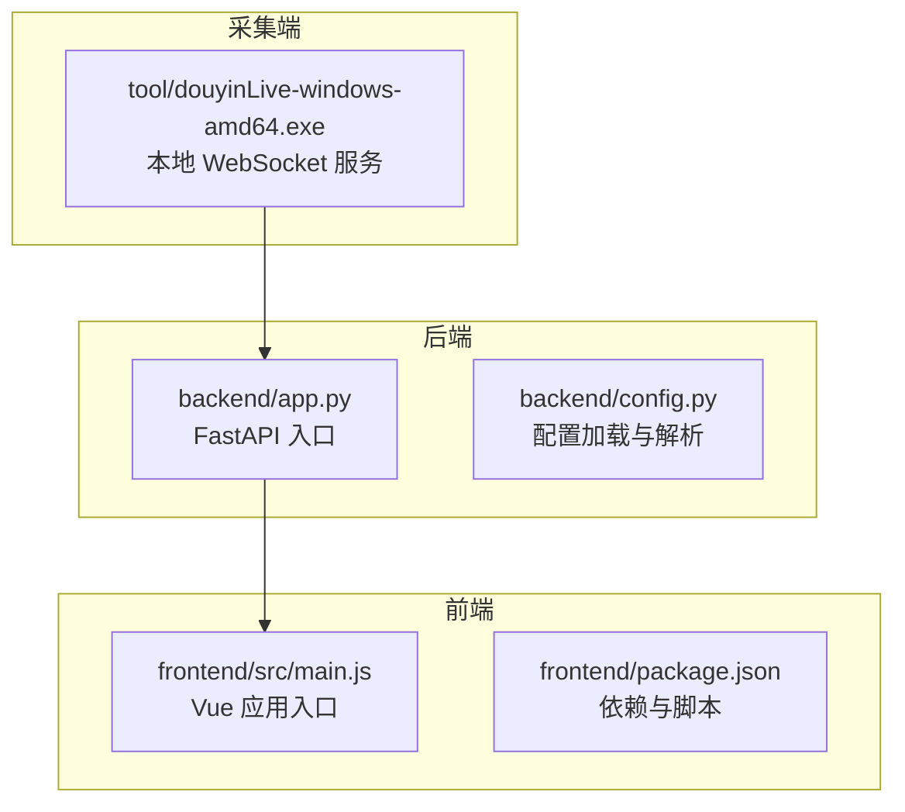
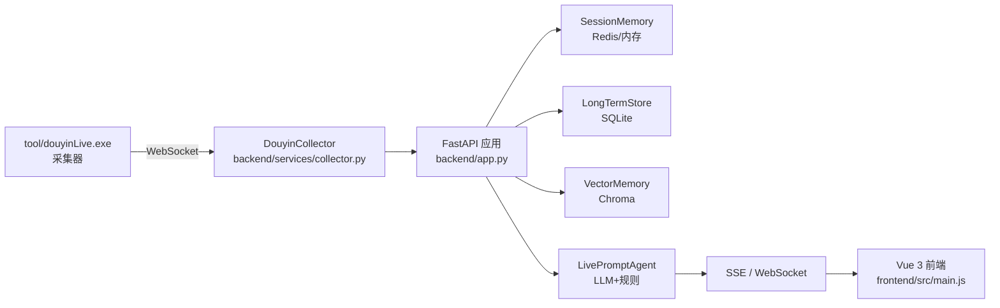
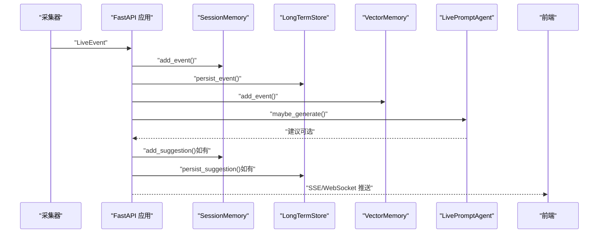
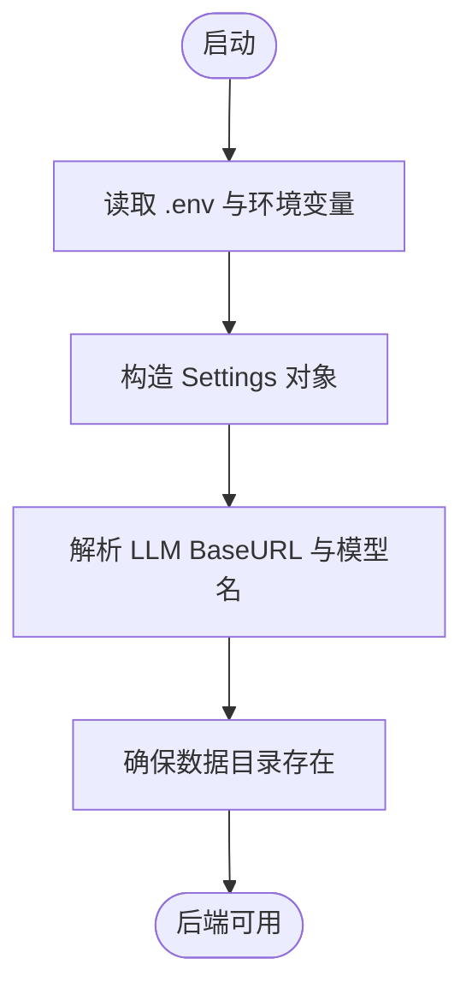
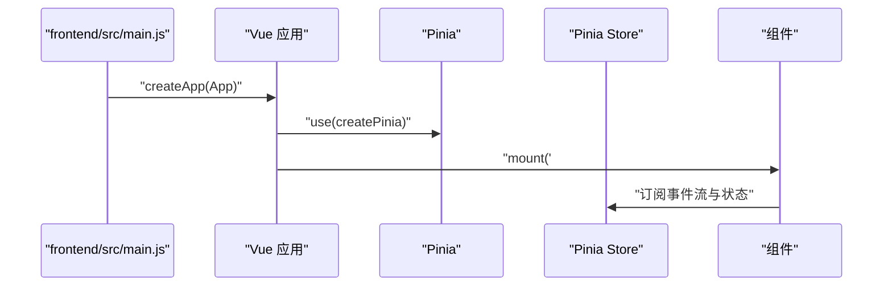
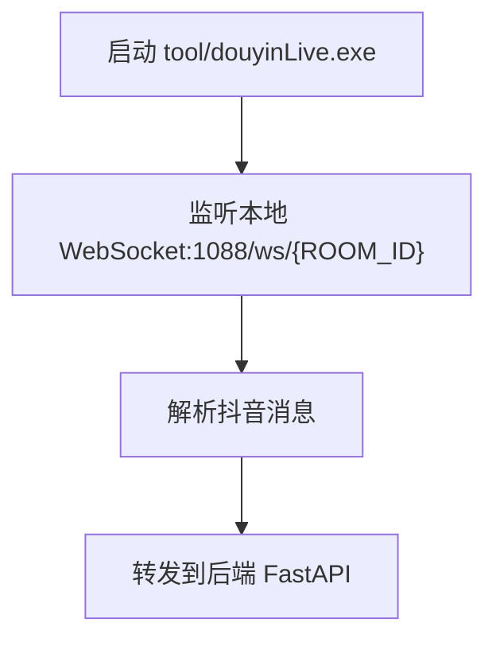
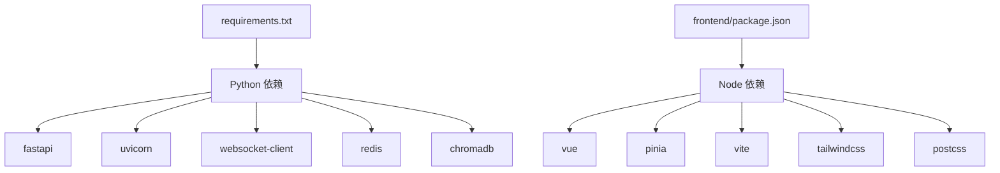

# 快速开始

<cite>
**本文引用的文件**
- [README.md](file://README.md)
- [USAGE.md](file://USAGE.md)
- [requirements.txt](file://requirements.txt)
- [backend/config.py](file://backend/config.py)
- [backend/app.py](file://backend/app.py)
- [frontend/package.json](file://frontend/package.json)
- [frontend/src/main.js](file://frontend/src/main.js)
- [start_all.ps1](file://start_all.ps1)
- [start_backend_qwen.ps1](file://start_backend_qwen.ps1)
- [start_frontend.ps1](file://start_frontend.ps1)
- [tool/README.md](file://tool/README.md)
- [tool/config.yaml](file://tool/config.yaml)
</cite>

## 目录
1. [简介](#简介)
2. [项目结构](#项目结构)
3. [核心组件](#核心组件)
4. [架构总览](#架构总览)
5. [详细组件分析](#详细组件分析)
6. [依赖分析](#依赖分析)
7. [性能考虑](#性能考虑)
8. [故障排除指南](#故障排除指南)
9. [结论](#结论)
10. [附录](#附录)

## 简介
本指南面向首次使用者，目标是在约30分钟内完成环境准备、采集器启动、后端与前端运行，从而看到完整的直播事件流与提词建议在前端界面中实时呈现。系统由三部分组成：
- 采集端：Windows 可执行文件，负责从抖音直播间抓取实时消息并通过本地 WebSocket 转发。
- 后端：FastAPI 服务，负责事件标准化、持久化、记忆抽取、LLM/规则提词与实时推送。
- 前端：Vue 3 应用，通过 Pinia 管理状态并通过 SSE/WebSocket 接收事件流与建议。

## 项目结构
- backend：后端应用入口、配置、服务与内存模块
- frontend：Vue 3 前端工程，包含组件与状态管理
- tool：抖音采集器（Windows 可执行文件与配置）
- start_*.ps1：一键启动脚本（PowerShell）
- requirements.txt：后端依赖
- README.md / USAGE.md：项目说明与使用说明

图表来源
- [backend/app.py:108-126](file://backend/app.py#L108-L126)
- [backend/config.py:12-37](file://backend/config.py#L12-L37)
- [frontend/src/main.js:12-16](file://frontend/src/main.js#L12-L16)

章节来源
- [README.md:32-44](file://README.md#L32-L44)
- [USAGE.md:15-22](file://USAGE.md#L15-L22)

## 核心组件
- 环境要求
  - Windows 10/11（采集端依赖 Windows 可执行文件）
  - Python 3.10+（推荐 3.11）
  - Node.js 18+
  - Qwen / OpenAI 兼容 API Key（若启用 LLM）
  - 可选：Redis 6+（共享 SessionMemory）、Chroma 0.5+（向量索引）
- 启动顺序与脚本
  - start_all.ps1：同时启动后端与前端（后端内置采集器）
  - start_backend_qwen.ps1：启动后端（Qwen 在线模式 + 内置采集器）
  - start_frontend.ps1：启动前端开发服务器
- 关键配置
  - .env：环境变量（至少填写 ROOM_ID、DASHSCOPE_API_KEY 或 LLM_API_KEY）
  - tool/config.yaml：采集器配置（端口、Cookie 等）

章节来源
- [README.md:46-52](file://README.md#L46-L52)
- [USAGE.md:15-22](file://USAGE.md#L15-L22)
- [start_all.ps1:11-17](file://start_all.ps1#L11-L17)
- [start_backend_qwen.ps1:11-12](file://start_backend_qwen.ps1#L11-L12)
- [start_frontend.ps1:20-21](file://start_frontend.ps1#L20-L21)

## 架构总览
系统采用“采集端 → 后端 → 前端”的链路，后端通过 SSE 与 WebSocket 实时推送事件与建议，前端通过 Pinia 管理状态并在组件中展示。

图表来源
- [README.md:7-17](file://README.md#L7-L17)
- [backend/app.py:108-126](file://backend/app.py#L108-L126)
- [frontend/src/main.js:12-16](file://frontend/src/main.js#L12-L16)

## 详细组件分析

### 后端应用（FastAPI）
- 职责
  - 生命周期管理：启动采集器、关闭时清理会话
  - 接口：健康检查、房间切换、事件注入、SSE/WebSocket 推送、Viewer 工单、LLM 设置等
  - 内存与模型：SessionMemory、LongTermStore、VectorMemory、EmbeddingService、LivePromptAgent
- 关键流程
  - 事件处理：写入 SessionMemory、LongTermStore、VectorMemory，触发 Agent 生成建议，发布到 SSE/WebSocket
  - 房间切换：关闭旧会话、切换 ROOM_ID、返回快照
- 启动命令
  - python -m uvicorn backend.app:app --host 127.0.0.1 --port 8010 --reload

图表来源
- [backend/app.py:73-102](file://backend/app.py#L73-L102)
- [backend/app.py:108-116](file://backend/app.py#L108-L116)

章节来源
- [backend/app.py:108-126](file://backend/app.py#L108-L126)
- [backend/app.py:129-135](file://backend/app.py#L129-L135)
- [backend/app.py:144-155](file://backend/app.py#L144-L155)
- [backend/app.py:252-271](file://backend/app.py#L252-L271)
- [backend/app.py:274-285](file://backend/app.py#L274-L285)

### 配置模块（Settings）
- 职责
  - 从 .env 与环境变量加载配置，提供默认值
  - 解析 LLM BaseURL 与模型名，生成嵌入签名
  - 确保数据目录存在
- 关键变量（节选）
  - APP_HOST / APP_PORT：后端监听地址
  - ROOM_ID：当前监听的抖音直播间 ID
  - COLLECTOR_*：采集器地址与心跳/重连参数
  - LLM_*：模型模式、BaseURL、模型名、API Key、温度、超时、最大 Token
  - DATA_DIR / DATABASE_PATH / CHROMA_DIR：数据与向量索引路径
  - REDIS_URL / SESSION_TTL_SECONDS：会话内存配置
  - EMBEDDING_*：嵌入模式、模型、BaseURL、API Key、设备与批大小
  - SEMANTIC_*：语义检索阈值与召回数量

图表来源
- [backend/config.py:12-37](file://backend/config.py#L12-L37)
- [backend/config.py:84-104](file://backend/config.py#L84-L104)
- [backend/config.py:77-82](file://backend/config.py#L77-L82)

章节来源
- [backend/config.py:44-76](file://backend/config.py#L44-L76)
- [backend/config.py:84-104](file://backend/config.py#L84-L104)

### 前端应用（Vue 3 + Pinia）
- 职责
  - 应用入口：创建 Vue 实例、注册 Pinia、挂载根节点
  - 状态管理：房间号、事件流、筛选器、主题/语言、ViewerWorkbench、LLM 设置
- 启动命令
  - npm run dev -- --host 127.0.0.1 --strictPort --port 5173

图表来源
- [frontend/src/main.js:12-16](file://frontend/src/main.js#L12-L16)

章节来源
- [frontend/package.json:6-9](file://frontend/package.json#L6-L9)
- [frontend/src/main.js:12-16](file://frontend/src/main.js#L12-L16)

### 采集器（douyinLive.exe）
- 职责
  - 连接抖音直播 WebSocket，解析弹幕、礼物、点赞、进场、关注等消息
  - 通过本地 WebSocket 服务转发给后端
- 启动命令
  - tool\douyinLive-windows-amd64.exe
- 配置
  - tool/config.yaml：端口、未知消息输出开关、可选 Cookie

图表来源
- [tool/README.md:55-61](file://tool/README.md#L55-L61)
- [tool/config.yaml:4-5](file://tool/config.yaml#L4-L5)

章节来源
- [tool/README.md:43-61](file://tool/README.md#L43-L61)
- [tool/config.yaml:10-15](file://tool/config.yaml#L10-L15)

## 依赖分析
- 后端依赖（requirements.txt）
  - fastapi、uvicorn、websocket-client、redis、chromadb
- 前端依赖（package.json）
  - vue、pinia、vite、tailwindcss、postcss 等

图表来源
- [requirements.txt:1-6](file://requirements.txt#L1-L6)
- [frontend/package.json:11-21](file://frontend/package.json#L11-L21)

章节来源
- [requirements.txt:1-6](file://requirements.txt#L1-L6)
- [frontend/package.json:11-21](file://frontend/package.json#L11-L21)

## 性能考虑
- 采集端与后端在同一主机运行，延迟低、吞吐高
- 后端默认使用本地内存 SessionMemory，Redis 可选用于跨进程共享
- 向量索引（Chroma）与嵌入（Cloud/Local）可按资源与需求启用
- SSE/WebSocket 推送采用事件流与实时广播，前端按房间过滤

## 故障排除指南
- 页面打开但无建议
  - 检查采集器是否已启动、.env 的 ROOM_ID 是否正确、直播间是否开播、后端是否已重启
- 顶部显示 fallback
  - Qwen 调用失败，系统回退到规则；检查 DASHSCOPE_API_KEY、网络可达性、超时或限流
- 顶部显示 heuristic
  - 当前处于规则模式；检查 .env 的 LLM_MODE 或 .env 加载是否生效
- 前端无法打开
  - 检查 start_frontend.ps1 是否正常、5173 端口是否被占用
- 后端启动但无数据写入
  - 确认采集器已运行、后端日志显示已连接 ws://127.0.0.1:1088/ws/{room_id}、房间确有消息

章节来源
- [USAGE.md:198-240](file://USAGE.md#L198-L240)

## 结论
按照本指南，您可以在30分钟内完成环境准备、采集器与后端启动、前端运行，并在浏览器中看到实时事件流与提词建议。若需扩展（多房间、跨平台采集、观测面等），可在现有基础上逐步迭代。

## 附录

### 环境要求与安装步骤
- 环境要求
  - Windows 10/11
  - Python 3.10+（推荐 3.11）
  - Node.js 18+
  - Qwen / OpenAI 兼容 API Key（若启用 LLM）
  - 可选：Redis 6+、Chroma 0.5+

章节来源
- [README.md:46-52](file://README.md#L46-L52)
- [USAGE.md:15-22](file://USAGE.md#L15-L22)

### 完整安装与启动流程
- 步骤 1：准备配置
  - 复制 .env.example 为 .env，并填写 ROOM_ID、LLM_MODE、DASHSCOPE_API_KEY（或 LLM_API_KEY）、LLM_BASE_URL、LLM_MODEL、LLM_TIMEOUT_SECONDS
- 步骤 2：启动采集器
  - 启动 tool\douyinLive-windows-amd64.exe
  - 默认监听 ws://127.0.0.1:1088/ws/{ROOM_ID}
- 步骤 3：安装后端依赖
  - pip install -r requirements.txt
- 步骤 4：运行后端
  - python -m uvicorn backend.app:app --host 127.0.0.1 --port 8010 --reload
- 步骤 5：安装前端依赖并运行
  - cd frontend && npm install
  - npm run dev -- --host 127.0.0.1 --strictPort --port 5173
- 步骤 6：使用封装脚本（可选）
  - .\start_all.ps1
  - 或拆分：
    - .\start_backend_qwen.ps1
    - .\start_frontend.ps1

预期输出
- 前端访问 http://127.0.0.1:5173/
- 后端健康检查 http://127.0.0.1:8010/health

章节来源
- [README.md:54-93](file://README.md#L54-L93)
- [USAGE.md:24-122](file://USAGE.md#L24-L122)

### 启动脚本用途与使用场景
- start_all.ps1
  - 同时启动后端与前端，后端内置采集器
- start_backend_qwen.ps1
  - 启动后端（Qwen 在线模式 + 内置采集器），适用于需要在线模型的场景
- start_frontend.ps1
  - 启动前端开发服务器，适用于前端开发与调试

章节来源
- [start_all.ps1:11-17](file://start_all.ps1#L11-L17)
- [start_backend_qwen.ps1:11-12](file://start_backend_qwen.ps1#L11-L12)
- [start_frontend.ps1:20-21](file://start_frontend.ps1#L20-L21)

### 配置说明（关键变量）
- 直播采集
  - ROOM_ID：当前监听的抖音直播间 ID
  - COLLECTOR_ENABLED / COLLECTOR_HOST / COLLECTOR_PORT：采集器开关与地址
  - COLLECTOR_PING_INTERVAL_SECONDS / COLLECTOR_RECONNECT_DELAY_SECONDS：心跳与重连
- 后端进程
  - APP_HOST / APP_PORT：监听地址
  - SESSION_TTL_SECONDS / REDIS_URL：会话内存配置
- 模型与提示词
  - LLM_MODE：heuristic/qwen/openai
  - LLM_BASE_URL / LLM_MODEL / LLM_API_KEY：模型服务地址、模型名与鉴权
  - LLM_TEMPERATURE / LLM_TIMEOUT_SECONDS / LLM_MAX_TOKENS：生成参数
- 向量与嵌入
  - DATA_DIR / DATABASE_PATH / CHROMA_DIR：数据与向量索引路径
  - EMBEDDING_MODE / EMBEDDING_MODEL / EMBEDDING_BASE_URL / EMBEDDING_API_KEY：嵌入模式与鉴权
  - LOCAL_EMBEDDING_DEVICE / LOCAL_EMBEDDING_BATCH_SIZE：本地嵌入设备与批大小
  - SEMANTIC_*：相似度与召回控制

章节来源
- [README.md:95-142](file://README.md#L95-L142)
- [backend/config.py:44-76](file://backend/config.py#L44-L76)