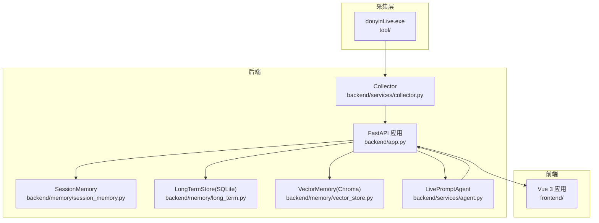
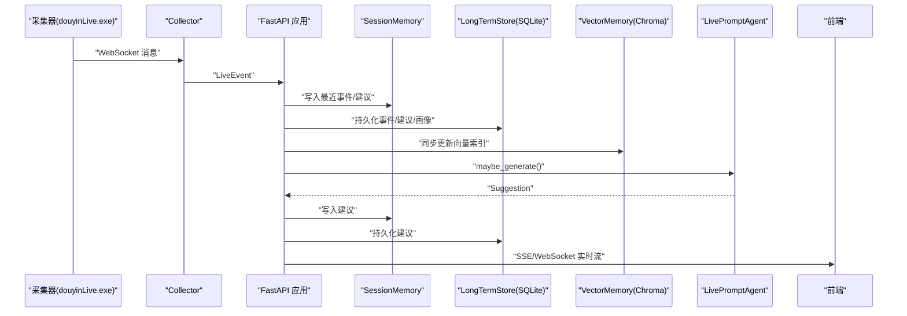
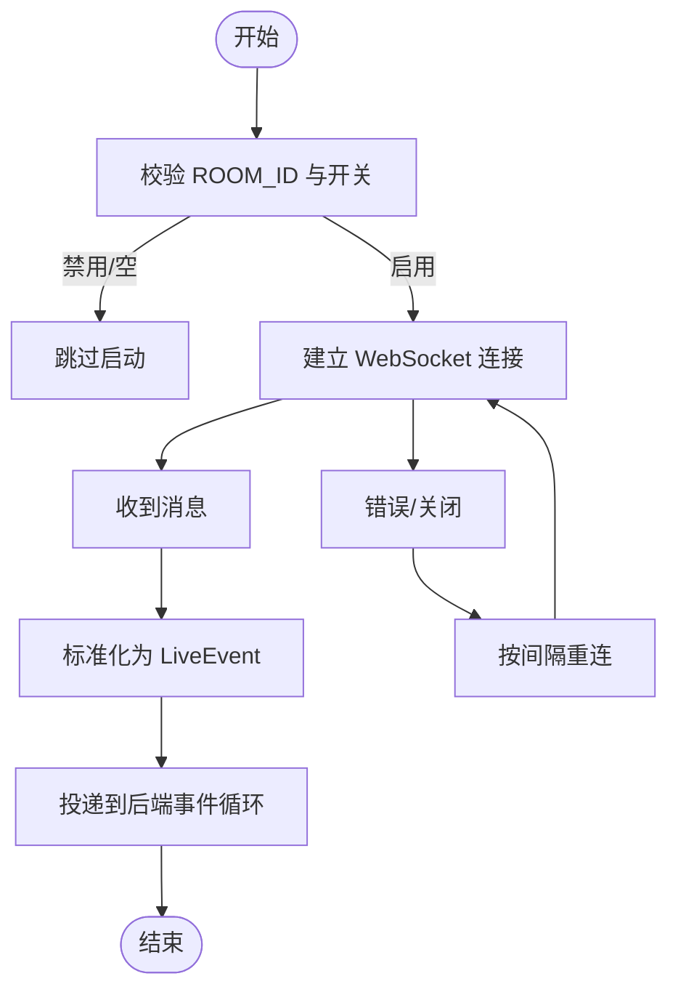
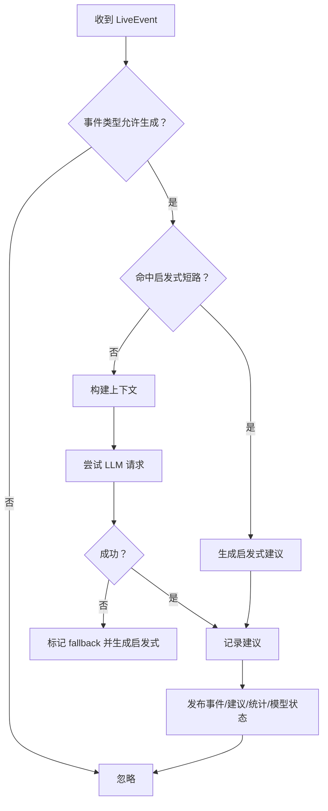
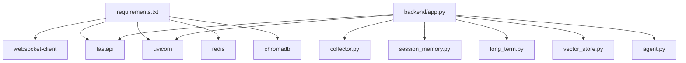

# 故障排除

<cite>
**本文引用的文件**
- [README.md](file://README.md)
- [USAGE.md](file://USAGE.md)
- [requirements.txt](file://requirements.txt)
- [backend/app.py](file://backend/app.py)
- [backend/config.py](file://backend/config.py)
- [backend/services/collector.py](file://backend/services/collector.py)
- [backend/services/agent.py](file://backend/services/agent.py)
- [backend/memory/session_memory.py](file://backend/memory/session_memory.py)
- [backend/memory/long_term.py](file://backend/memory/long_term.py)
- [backend/memory/vector_store.py](file://backend/memory/vector_store.py)
- [tests/test_agent.py](file://tests/test_agent.py)
- [tests/test_embedding_service.py](file://tests/test_embedding_service.py)
- [tests/test_vector_store.py](file://tests/test_vector_store.py)
- [start_all.ps1](file://start_all.ps1)
- [start_backend_qwen.ps1](file://start_backend_qwen.ps1)
</cite>

## 目录
1. [简介](#简介)
2. [项目结构](#项目结构)
3. [核心组件](#核心组件)
4. [架构总览](#架构总览)
5. [详细组件分析](#详细组件分析)
6. [依赖关系分析](#依赖关系分析)
7. [性能考量](#性能考量)
8. [故障排除指南](#故障排除指南)
9. [结论](#结论)
10. [附录](#附录)

## 简介
本故障排除文档聚焦于 DouYin_llm 项目的常见问题诊断与解决，覆盖启动、连接、性能、日志与调试、错误码与异常处理、系统恢复、性能调优、组件故障传播与隔离、已知限制与临时方案、社区支持与问题报告流程，以及预防性维护与健康检查建议。读者无需深入技术背景即可按步骤定位与解决问题。

## 项目结构
项目采用三层结构：采集层（tool/douyinLive.exe）、后端（FastAPI）、前端（Vue 3）。后端通过 Collector 接收 WebSocket 事件，经事件归一化、持久化、记忆抽取、LLM/规则生成建议，并通过 SSE/WebSocket 推送至前端。

**图表来源**
- [README.md:7-17](file://README.md#L7-L17)
- [backend/app.py:108-127](file://backend/app.py#L108-L127)
- [backend/services/collector.py:38-100](file://backend/services/collector.py#L38-L100)
- [backend/memory/session_memory.py:17-113](file://backend/memory/session_memory.py#L17-L113)
- [backend/memory/long_term.py:44-187](file://backend/memory/long_term.py#L44-L187)
- [backend/memory/vector_store.py:59-85](file://backend/memory/vector_store.py#L59-L85)

**章节来源**
- [README.md:32-44](file://README.md#L32-L44)
- [backend/app.py:108-127](file://backend/app.py#L108-L127)

## 核心组件
- 配置中心：集中读取 .env 与环境变量，提供运行时参数解析与默认值。
- 采集器：连接本地 WebSocket，标准化为 LiveEvent 并投递到后端事件循环。
- 会话内存：短期事件与建议缓存，支持 Redis 或进程内队列。
- 长期存储：SQLite 表结构与索引，维护事件、建议、观众画像、会话、笔记、记忆等。
- 向量记忆：Chroma 或本地哈希嵌入，支持相似检索与重排。
- 提词代理：LLM/OpenAI 兼容请求与启发式规则双通道，回退与状态上报。
- 后端应用：REST/SSE/WebSocket 接口，事件流与状态推送。

**章节来源**
- [backend/config.py:40-113](file://backend/config.py#L40-L113)
- [backend/services/collector.py:38-100](file://backend/services/collector.py#L38-L100)
- [backend/memory/session_memory.py:17-113](file://backend/memory/session_memory.py#L17-L113)
- [backend/memory/long_term.py:44-187](file://backend/memory/long_term.py#L44-L187)
- [backend/memory/vector_store.py:59-85](file://backend/memory/vector_store.py#L59-L85)
- [backend/services/agent.py:23-60](file://backend/services/agent.py#L23-L60)
- [backend/app.py:108-127](file://backend/app.py#L108-L127)

## 架构总览

**图表来源**
- [backend/app.py:73-102](file://backend/app.py#L73-L102)
- [backend/services/collector.py:145-160](file://backend/services/collector.py#L145-L160)
- [backend/services/agent.py:105-142](file://backend/services/agent.py#L105-L142)
- [backend/memory/vector_store.py:149-171](file://backend/memory/vector_store.py#L149-L171)
- [backend/memory/long_term.py:454-488](file://backend/memory/long_term.py#L454-L488)

## 详细组件分析

### 启动与健康检查
- 后端健康检查：/health 返回运行状态、当前房间与活动会话。
- 健康检查端点：http://127.0.0.1:8010/health。
- 启动脚本：start_all.ps1 与 start_backend_qwen.ps1 自动检查 .env 并启动后端。

**章节来源**
- [README.md:93](file://README.md#L93)
- [backend/app.py:129-135](file://backend/app.py#L129-L135)
- [start_all.ps1:6-17](file://start_all.ps1#L6-L17)
- [start_backend_qwen.ps1:6-12](file://start_backend_qwen.ps1#L6-L12)

### 采集器（Collector）
- 连接地址：ws://HOST:PORT/ws/{ROOM_ID}，默认 127.0.0.1:1088。
- 事件标准化：根据 method 映射为 comment/gift/like/member/follow。
- 重连机制：断线后按配置延迟重连，日志记录错误与关闭原因。
- 事件投递：通过 asyncio.run_coroutine_threadsafe 回到后端事件循环。

**图表来源**
- [backend/services/collector.py:61-99](file://backend/services/collector.py#L61-L99)
- [backend/services/collector.py:118-140](file://backend/services/collector.py#L118-L140)
- [backend/services/collector.py:145-189](file://backend/services/collector.py#L145-L189)

**章节来源**
- [backend/services/collector.py:38-100](file://backend/services/collector.py#L38-L100)
- [backend/services/collector.py:207-266](file://backend/services/collector.py#L207-L266)

### 会话内存（SessionMemory）
- 优先使用 Redis 存储最近事件与建议，支持 TTL。
- 未安装 Redis 时退化为进程内 deque，保证基本可用。
- 提供 snapshot/stats/recent_events/recent_suggestions。

**章节来源**
- [backend/memory/session_memory.py:17-113](file://backend/memory/session_memory.py#L17-L113)

### 长期存储（LongTermStore）
- SQLite 初始化表结构与索引，动态补齐列。
- 事件持久化：维护会话、观众画像、礼物聚合、笔记、记忆。
- 查询接口：最近事件/建议、统计、观众详情、会话历史、记忆与笔记。

**章节来源**
- [backend/memory/long_term.py:63-187](file://backend/memory/long_term.py#L63-L187)
- [backend/memory/long_term.py:454-557](file://backend/memory/long_term.py#L454-L557)

### 向量记忆（VectorMemory）
- 支持 Chroma 或本地哈希嵌入函数。
- 事件与记忆 upsert，相似检索与重排（含置信度、召回次数、时间戳）。
- 配置化阈值与查询上限，避免噪声与性能问题。

**章节来源**
- [backend/memory/vector_store.py:59-85](file://backend/memory/vector_store.py#L59-L85)
- [backend/memory/vector_store.py:172-231](file://backend/memory/vector_store.py#L172-L231)
- [backend/memory/vector_store.py:257-317](file://backend/memory/vector_store.py#L257-L317)

### 提词代理（LivePromptAgent）
- 双通道：LLM/OpenAI 兼容请求；失败或命中关键词时回退启发式规则。
- 上下文构建：最近事件、相似历史、用户画像、观众记忆。
- 状态上报：模式、模型、后端、结果、错误、更新时间。

**图表来源**
- [backend/services/agent.py:105-142](file://backend/services/agent.py#L105-L142)
- [backend/services/agent.py:200-217](file://backend/services/agent.py#L200-L217)
- [backend/services/agent.py:302-437](file://backend/services/agent.py#L302-L437)

**章节来源**
- [backend/services/agent.py:23-60](file://backend/services/agent.py#L23-L60)
- [backend/services/agent.py:83-143](file://backend/services/agent.py#L83-L143)

### 后端应用（FastAPI）
- 生命周期：启动时启动 Collector，关闭时清理会话并停止 Collector。
- 接口：/health、/api/bootstrap、/api/room、/api/events、/api/viewer、/api/settings/llm、/api/events/stream、/ws/live。
- CORS 允许任意来源，便于前端开发。

**章节来源**
- [backend/app.py:108-117](file://backend/app.py#L108-L117)
- [backend/app.py:129-167](file://backend/app.py#L129-L167)
- [backend/app.py:252-285](file://backend/app.py#L252-L285)

## 依赖关系分析
- Python 依赖：websocket-client、fastapi、uvicorn、redis、chromadb。
- 组件耦合：Collector 与后端事件循环解耦；Agent 与存储/向量模块解耦；SessionMemory 可插拔 Redis。
- 外部依赖：Chroma（可选）、Redis（可选）、在线模型服务（可选）。

**图表来源**
- [requirements.txt:1-6](file://requirements.txt#L1-L6)
- [backend/app.py:13-22](file://backend/app.py#L13-L22)

**章节来源**
- [requirements.txt:1-6](file://requirements.txt#L1-L6)
- [backend/app.py:13-22](file://backend/app.py#L13-L22)

## 性能考量
- 会话窗口与建议窗口：短期事件与建议均有限长度，避免无限增长。
- 向量检索阈值与查询上限：通过配置项控制召回质量与性能。
- LLM 超时与批处理：合理设置超时与 max_tokens，避免阻塞。
- Redis TTL：热数据生命周期控制，降低内存压力。
- SQLite 索引：按房间/类型/ts 等维度建立索引，提升查询效率。

**章节来源**
- [backend/memory/session_memory.py:24-64](file://backend/memory/session_memory.py#L24-L64)
- [backend/memory/vector_store.py:92-108](file://backend/memory/vector_store.py#L92-L108)
- [backend/config.py:71-76](file://backend/config.py#L71-L76)
- [backend/memory/long_term.py:216-229](file://backend/memory/long_term.py#L216-L229)

## 故障排除指南

### 启动问题
- 缺失 .env：启动脚本会提示复制 .env.example 并填写必要变量。
- 端口冲突：前端默认 5173，后端默认 8010；若被占用需调整或释放端口。
- 依赖缺失：确保安装 requirements.txt 中的依赖。
- 环境变量未生效：确认 .env 位于项目根目录且键名正确。

**章节来源**
- [start_all.ps1:6-9](file://start_all.ps1#L6-L9)
- [start_backend_qwen.ps1:6-9](file://start_backend_qwen.ps1#L6-L9)
- [requirements.txt:1-6](file://requirements.txt#L1-L6)
- [README.md:62-67](file://README.md#L62-L67)

### 连接问题
- 采集器未启动：确认 tool/douyinLive-windows-amd64.exe 已运行，且监听地址与端口符合预期。
- ROOM_ID 不匹配：后端与采集器的房间号必须一致。
- 网络不可达：若使用在线模型，检查网络与代理；若使用本地嵌入，确保 Chroma 可用。
- WebSocket 断开：查看 Collector 日志中的重连与错误信息。

**章节来源**
- [README.md:56-61](file://README.md#L56-L61)
- [backend/services/collector.py:54-59](file://backend/services/collector.py#L54-L59)
- [backend/services/collector.py:137-140](file://backend/services/collector.py#L137-L140)

### 性能问题
- 建议生成慢：检查 LLM 超时与模型参数；必要时切换为启发式模式或降低 max_tokens。
- 向量检索慢：调整相似度阈值与查询上限；确保 Chroma 正常运行。
- 内存占用高：检查 Redis/TTL 配置；清理不必要的会话与建议。
- SQLite 写入慢：确认索引存在；避免频繁重建表结构。

**章节来源**
- [backend/services/agent.py:302-437](file://backend/services/agent.py#L302-L437)
- [backend/memory/vector_store.py:92-108](file://backend/memory/vector_store.py#L92-L108)
- [backend/memory/session_memory.py:24-31](file://backend/memory/session_memory.py#L24-L31)
- [backend/memory/long_term.py:216-229](file://backend/memory/long_term.py#L216-L229)

### 日志分析与调试工具
- 后端日志：INFO/WARNING/ERROR 级别输出，包含 Collector 连接、事件处理、LLM 错误等。
- 原始消息调试：使用 deprecated/debug_client.py 打印完整 JSON 并写入 logs/。
- 健康检查：/health 返回当前房间与活动会话，用于快速判断后端状态。

**章节来源**
- [backend/app.py:24-25](file://backend/app.py#L24-L25)
- [USAGE.md:180-197](file://USAGE.md#L180-L197)
- [README.md:129-135](file://README.md#L129-L135)

### 错误代码与异常处理
- LLM HTTP 错误：记录状态码与原因，标记为 http_{code}。
- 网络错误：记录原因，标记为 network_error。
- 超时：按配置超时秒数记录，标记为 timeout。
- JSON 解析失败：记录无效包络或内容缺失，标记为 invalid_json_envelope/missing_content/invalid_json_payload。
- OS/网络异常：记录底层错误，标记为 os_error/unexpected_exception。
- 模型状态：last_result 与 last_error 字段用于前端展示与诊断。

**章节来源**
- [backend/services/agent.py:334-393](file://backend/services/agent.py#L334-L393)
- [backend/services/agent.py:407-427](file://backend/services/agent.py#L407-L427)

### 系统恢复流程
- 重启后端：停止 uvicorn 进程后重新启动，触发 Collector 重启与会话关闭。
- 清理向量索引：删除 data/chroma 目录后重新构建；可配合 rebuild_embeddings 脚本（如存在）。
- 重置 SQLite：备份后删除 data/live_prompter.db，系统会重建表结构与索引。
- 重置 Redis：清空相关 key 或重启 Redis 服务。

**章节来源**
- [backend/app.py:108-117](file://backend/app.py#L108-L117)
- [README.md:195-197](file://README.md#L195-L197)
- [backend/memory/long_term.py:63-187](file://backend/memory/long_term.py#L63-L187)

### 组件故障传播与隔离
- Collector → 后端：若 Collector 崩溃或断开，后端不再接收新事件；检查 Collector 日志与重连。
- Agent → LLM：LLM 失败时自动回退启发式，状态标记为 fallback；前端显示相应来源标签。
- VectorMemory → Chroma：Chroma 不可用时退化为本地哈希嵌入，功能受限但不中断。
- SessionMemory → Redis：Redis 不可用时退化为进程内队列，短期功能不受影响。

**章节来源**
- [backend/services/collector.py:137-140](file://backend/services/collector.py#L137-L140)
- [backend/services/agent.py:200-217](file://backend/services/agent.py#L200-L217)
- [backend/memory/vector_store.py:80-84](file://backend/memory/vector_store.py#L80-L84)
- [backend/memory/session_memory.py:11-31](file://backend/memory/session_memory.py#L11-L31)

### 已知限制与临时方案
- 采集端为 Windows 可执行文件：暂无 Linux/macOS 版本，需自行获取对应平台版本。
- 单房间串行接入：Collector 仅维护一个 ROOM_ID，无法并行拉多间直播流。
- 无鉴权/多租户：后端与前端完全公开，不适合直接暴露到公网。
- 观众记忆编辑：ViewerWorkbench 仅支持增删笔记，编辑入口需扩展 API 与 UI。
- 运维观测薄弱：缺少事件追踪、指标或告警，建议后续集成 Prometheus/Grafana 或 APM。

**章节来源**
- [README.md:205-213](file://README.md#L205-L213)

### 社区支持与问题报告
- 项目致谢与外部依赖：感谢 jwwsjlm/douyinLive 提供采集能力。
- 建议在完成基础能力后继续扩展多房间调度、跨平台采集、观测面与模型管理策略。
- 问题报告：结合健康检查、日志与最小复现步骤进行反馈。

**章节来源**
- [README.md:219-223](file://README.md#L219-L223)

### 预防性维护与健康检查
- 定期检查 /health，关注房间与活动会话状态。
- 监控 Redis/Chroma 可用性与磁盘空间。
- 审核 .env 配置，确保 ROOM_ID、API Key、超时与模型参数合理。
- 周期性清理 data/chroma 与 data/live_prompter.db，避免数据膨胀。
- 单元测试覆盖：运行测试集验证 Agent、嵌入、向量检索与 LLM 设置。

**章节来源**
- [backend/app.py:129-135](file://backend/app.py#L129-L135)
- [USAGE.md:180-197](file://USAGE.md#L180-L197)
- [tests/test_agent.py:116-172](file://tests/test_agent.py#L116-L172)
- [tests/test_embedding_service.py:24-80](file://tests/test_embedding_service.py#L24-L80)
- [tests/test_vector_store.py:21-100](file://tests/test_vector_store.py#L21-L100)

## 结论
通过本故障排除文档，您可以系统化地诊断与解决 DouYin_llm 项目在启动、连接、性能、日志与调试、错误处理、系统恢复、组件隔离、已知限制与临时方案、社区支持与预防性维护等方面的问题。建议在生产环境中逐步引入可观测性与告警，以进一步提升稳定性与可维护性。

## 附录
- 快速参考
  - 后端健康检查：http://127.0.0.1:8010/health
  - 前端默认地址：http://127.0.0.1:5173/
  - 数据目录：data/live_prompter.db、data/chroma/
  - 日志位置：logs/

**章节来源**
- [README.md:93](file://README.md#L93)
- [USAGE.md:116-122](file://USAGE.md#L116-L122)
- [README.md:195-197](file://README.md#L195-L197)