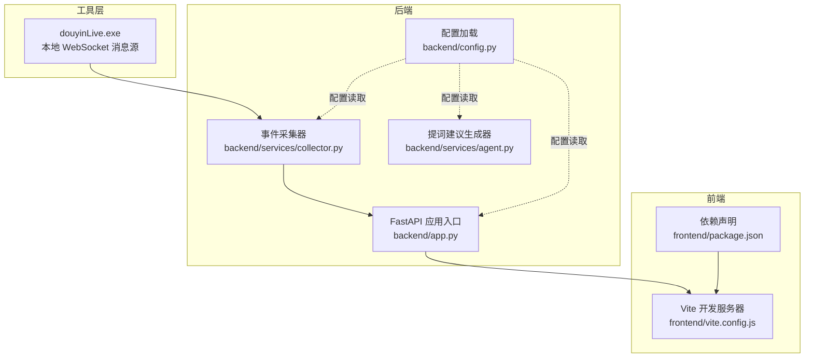
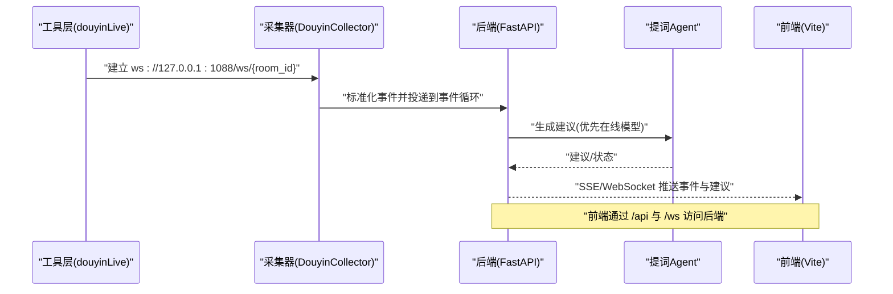
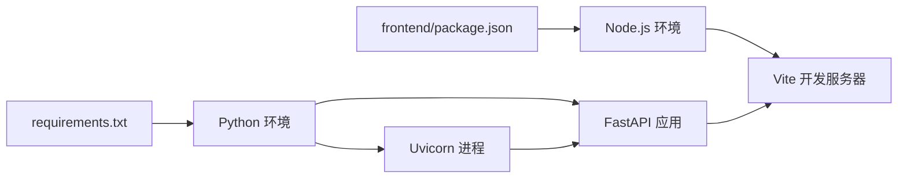

# 启动问题

<cite>
**本文引用的文件**
- [README.md](file://README.md)
- [USAGE.md](file://USAGE.md)
- [requirements.txt](file://requirements.txt)
- [backend/app.py](file://backend/app.py)
- [backend/config.py](file://backend/config.py)
- [backend/services/collector.py](file://backend/services/collector.py)
- [backend/services/agent.py](file://backend/services/agent.py)
- [frontend/package.json](file://frontend/package.json)
- [frontend/vite.config.js](file://frontend/vite.config.js)
- [start_all.bat](file://start_all.bat)
- [start_all.ps1](file://start_all.ps1)
- [start_backend_qwen.ps1](file://start_backend_qwen.ps1)
- [start_frontend.ps1](file://start_frontend.ps1)
</cite>

## 目录
1. [简介](#简介)
2. [项目结构](#项目结构)
3. [核心组件](#核心组件)
4. [架构总览](#架构总览)
5. [详细组件分析](#详细组件分析)
6. [依赖关系分析](#依赖关系分析)
7. [性能考虑](#性能考虑)
8. [故障排查指南](#故障排查指南)
9. [结论](#结论)
10. [附录](#附录)

## 简介
本指南聚焦于“启动问题”的系统性排查，覆盖以下方面：
- Python 环境配置问题：版本不兼容、依赖缺失、虚拟环境问题
- Node.js 环境问题：npm 安装失败、端口占用、权限问题
- 服务启动失败：后端 uvicorn 未正常启动、前端开发服务器未就绪
- 明确的错误识别与解决步骤：端口冲突处理、防火墙配置、PATH 环境变量设置等

## 项目结构
该项目由三部分组成：
- 工具层：本地 WebSocket 消息源（douyinLive）
- 后端：FastAPI + Uvicorn，负责事件采集、短期/长期记忆、向量检索、提词建议生成与前端推送
- 前端：Vue 3 + Vite，通过代理访问后端 REST/WebSocket

图表来源
- [backend/app.py:1-220](file://backend/app.py#L1-L220)
- [backend/config.py:1-94](file://backend/config.py#L1-L94)
- [backend/services/collector.py:1-284](file://backend/services/collector.py#L1-L284)
- [backend/services/agent.py:1-393](file://backend/services/agent.py#L1-L393)
- [frontend/vite.config.js:1-23](file://frontend/vite.config.js#L1-L23)
- [frontend/package.json:1-23](file://frontend/package.json#L1-L23)

章节来源
- [README.md:21-34](file://README.md#L21-L34)
- [USAGE.md:15-23](file://USAGE.md#L15-L23)

## 核心组件
- 后端应用入口与生命周期管理：负责启动/停止采集器、注册路由、CORS、健康检查、SSE/WebSocket 推送等
- 配置模块：优先读取 .env，其次读取当前 Shell 环境变量；提供默认值确保本地可跑
- 事件采集器：连接本地 WebSocket，标准化消息，投递到后端事件循环
- 提词建议生成器：优先调用 OpenAI 兼容接口，失败回退本地规则
- 前端开发服务器：通过 Vite 代理将 /api 与 /ws 请求转发至后端 8010 端口

章节来源
- [backend/app.py:84-101](file://backend/app.py#L84-L101)
- [backend/config.py:11-36](file://backend/config.py#L11-L36)
- [backend/services/collector.py:61-78](file://backend/services/collector.py#L61-L78)
- [backend/services/agent.py:96-114](file://backend/services/agent.py#L96-L114)
- [frontend/vite.config.js:10-22](file://frontend/vite.config.js#L10-L22)

## 架构总览
系统启动顺序与交互如下：

图表来源
- [backend/services/collector.py:117-139](file://backend/services/collector.py#L117-L139)
- [backend/app.py:61-78](file://backend/app.py#L61-L78)
- [backend/services/agent.py:96-114](file://backend/services/agent.py#L96-L114)
- [frontend/vite.config.js:10-22](file://frontend/vite.config.js#L10-L22)

## 详细组件分析

### 后端应用与生命周期
- 生命周期钩子在应用启动时启动采集器，在关闭时清理资源
- 提供健康检查、Bootstrap 快照、房间切换、事件注入、SSE、WebSocket 等接口
- CORS 允许跨域，便于前端代理访问

章节来源
- [backend/app.py:84-92](file://backend/app.py#L84-L92)
- [backend/app.py:104-127](file://backend/app.py#L104-L127)
- [backend/app.py:187-220](file://backend/app.py#L187-L220)

### 配置加载与默认值
- 优先从项目根目录 .env 加载键值，不存在则读取当前 Shell 环境变量
- 关键配置项包括：房间号、采集开关与地址、后端监听地址与端口、模型模式与密钥、数据目录与数据库路径、Chroma 目录、会话过期时间等
- 提供默认值，确保本地开箱即跑

章节来源
- [backend/config.py:11-36](file://backend/config.py#L11-L36)
- [backend/config.py:43-61](file://backend/config.py#L43-L61)
- [backend/config.py:63-69](file://backend/config.py#L63-L69)

### 事件采集器
- 连接本地 WebSocket，周期性发送 ping，断线重连
- 将原始消息标准化为统一 LiveEvent，投递到后端事件循环
- 支持房间切换与优雅停止

章节来源
- [backend/services/collector.py:54-59](file://backend/services/collector.py#L54-L59)
- [backend/services/collector.py:117-139](file://backend/services/collector.py#L117-L139)
- [backend/services/collector.py:225-284](file://backend/services/collector.py#L225-L284)

### 提词建议生成器
- 优先调用 OpenAI 兼容接口，失败回退本地规则
- 生成建议包含优先级、回复文案、语气、理由、置信度等字段
- 维护模型状态（模式、模型名、后端地址、最后结果、错误、更新时间）

章节来源
- [backend/services/agent.py:96-114](file://backend/services/agent.py#L96-L114)
- [backend/services/agent.py:183-330](file://backend/services/agent.py#L183-L330)

### 前端开发服务器
- 代理将 /api 与 /ws 转发至后端 8010 端口
- 依赖声明位于 package.json，开发时自动安装

章节来源
- [frontend/vite.config.js:10-22](file://frontend/vite.config.js#L10-L22)
- [frontend/package.json:1-23](file://frontend/package.json#L1-23)

## 依赖关系分析
- 后端依赖通过 requirements.txt 管理，包含 FastAPI、Uvicorn、WebSocket 客户端、Redis、Chroma 等
- 前端依赖通过 package.json 管理，开发依赖包括 Vite、Vue 插件、TailwindCSS 等
- 启动脚本通过 PowerShell 调用 Python 与 Node，分别启动后端与前端

图表来源
- [requirements.txt:1-6](file://requirements.txt#L1-L6)
- [frontend/package.json:1-23](file://frontend/package.json#L1-L23)

章节来源
- [requirements.txt:1-6](file://requirements.txt#L1-L6)
- [frontend/package.json:1-23](file://frontend/package.json#L1-L23)

## 性能考虑
- 采集器采用独立线程与 ping 循环，避免阻塞事件循环
- SSE/WebSocket 推送采用队列订阅，按房间过滤，减少无效传输
- 建议在生产环境使用更高性能的 ASGI 服务器与反向代理

## 故障排查指南

### 一、Python 环境与依赖问题

1) 检查 Python 版本
- 目标：确认 Python 3.10+ 已正确安装
- 方法：在终端执行命令查看版本
- 常见问题：
  - 版本过低导致依赖无法安装或运行时报错
  - 多个 Python 版本共存导致 pip/python 指向不一致
- 解决步骤：
  - 使用官方安装包安装 Python 3.10+ 并加入 PATH
  - 使用虚拟环境隔离项目依赖
  - 在项目根目录执行安装命令，确保使用当前 Python 的 pip

章节来源
- [README.md:50-56](file://README.md#L50-L56)
- [USAGE.md:15-23](file://USAGE.md#L15-L23)

2) 安装后端依赖
- 目标：requirements.txt 中的依赖完整安装
- 方法：在项目根目录执行安装命令
- 常见问题：
  - 网络受限导致安装缓慢或失败
  - 权限不足导致安装失败
  - 依赖版本冲突
- 解决步骤：
  - 使用国内镜像源加速安装
  - 以管理员身份运行终端
  - 清理缓存后重试
  - 如遇冲突，先卸载冲突包再安装

章节来源
- [README.md:95-99](file://README.md#L95-L99)
- [USAGE.md:73-87](file://USAGE.md#L73-L87)
- [requirements.txt:1-6](file://requirements.txt#L1-L6)

3) 检查 uvicorn 服务是否正常启动
- 目标：确认后端服务在 127.0.0.1:8010 正常监听
- 方法：在项目根目录执行启动命令，或使用脚本
- 常见问题：
  - 端口 8010 被占用
  - .env 配置缺失或错误
  - 依赖未安装或版本不匹配
- 解决步骤：
  - 更换端口或释放占用端口
  - 复制并填写 .env 示例文件
  - 重新安装依赖
  - 查看启动脚本中的错误输出

章节来源
- [README.md:101-105](file://README.md#L101-L105)
- [USAGE.md:89-114](file://USAGE.md#L89-L114)
- [start_backend_qwen.ps1:11-12](file://start_backend_qwen.ps1#L11-L12)

4) 检查 .env 配置
- 目标：确保 ROOM_ID、LLM_MODE、API Key 等关键配置存在且有效
- 方法：核对 .env 文件内容
- 常见问题：
  - 缺少必要键值
  - 键值为空或格式错误
  - 未正确加载 .env
- 解决步骤：
  - 复制示例文件并填写
  - 确认 .env 位于项目根目录
  - 重启后端使配置生效

章节来源
- [README.md:82-94](file://README.md#L82-L94)
- [USAGE.md:24-48](file://USAGE.md#L24-L48)
- [backend/config.py:11-36](file://backend/config.py#L11-L36)

5) 虚拟环境问题
- 目标：确保在正确的虚拟环境中执行
- 方法：激活虚拟环境后再安装依赖与启动服务
- 常见问题：
  - 未激活虚拟环境导致依赖安装到系统 Python
  - 虚拟环境路径错误
- 解决步骤：
  - 创建并激活虚拟环境
  - 在虚拟环境中安装依赖
  - 使用虚拟环境中的 python 与 pip

章节来源
- [USAGE.md:73-87](file://USAGE.md#L73-L87)

### 二、Node.js 与前端问题

1) npm 安装失败
- 目标：前端依赖完整安装
- 方法：在 frontend 目录执行安装命令
- 常见问题：
  - 网络受限
  - 权限不足
  - npm 缓存损坏
- 解决步骤：
  - 使用国内镜像源
  - 以管理员身份运行终端
  - 清理 npm 缓存后重试

章节来源
- [USAGE.md:81-87](file://USAGE.md#L81-L87)
- [frontend/package.json:1-23](file://frontend/package.json#L1-23)

2) 端口占用
- 目标：前端开发服务器端口 5173 可用
- 方法：检查端口占用并释放
- 常见问题：
  - 端口被其他进程占用
  - 防火墙阻止访问
- 解决步骤：
  - 更换端口或释放占用进程
  - 配置防火墙放行端口
  - 以管理员权限运行

章节来源
- [USAGE.md:226-232](file://USAGE.md#L226-L232)
- [frontend/vite.config.js:10-22](file://frontend/vite.config.js#L10-L22)

3) 权限问题
- 目标：确保对项目目录与系统路径具有足够权限
- 方法：以管理员身份运行终端
- 常见问题：
  - 安装依赖时权限不足
  - 写入日志或数据目录失败
- 解决步骤：
  - 使用管理员权限运行
  - 修改目录权限或更换目录

章节来源
- [USAGE.md:226-232](file://USAGE.md#L226-L232)

4) 启动前端开发服务器
- 目标：Vite 开发服务器在 127.0.0.1:5173 正常运行
- 方法：在 frontend 目录执行 dev 命令
- 常见问题：
  - 未安装依赖
  - 端口被占用
  - 代理配置错误
- 解决步骤：
  - 先安装依赖
  - 释放端口或修改端口
  - 核对代理配置指向后端 8010

章节来源
- [USAGE.md:109-114](file://USAGE.md#L109-L114)
- [frontend/vite.config.js:10-22](file://frontend/vite.config.js#L10-L22)

### 三、服务启动失败排查

1) 后端启动失败
- 症状：控制台无响应或报错退出
- 排查要点：
  - 检查 .env 是否存在且配置正确
  - 检查依赖是否完整安装
  - 检查端口 8010 是否被占用
  - 查看启动脚本输出
- 解决步骤：
  - 补充 .env 缺项
  - 重新安装依赖
  - 更换端口或释放占用
  - 使用脚本启动并观察错误

章节来源
- [start_all.ps1:6-9](file://start_all.ps1#L6-L9)
- [start_backend_qwen.ps1:6-9](file://start_backend_qwen.ps1#L6-L9)

2) 前端启动失败
- 症状：浏览器无法访问或报错
- 排查要点：
  - 检查前端依赖是否安装
  - 检查端口 5173 是否被占用
  - 检查代理是否正确转发到 8010
- 解决步骤：
  - 安装依赖
  - 释放端口或修改端口
  - 核对代理配置

章节来源
- [start_frontend.ps1:15-18](file://start_frontend.ps1#L15-L18)
- [frontend/vite.config.js:10-22](file://frontend/vite.config.js#L10-L22)

3) 采集器未连接
- 症状：前端无事件流，后端日志无连接记录
- 排查要点：
  - 确认本地消息源已启动
  - 检查 ROOM_ID 与采集地址
  - 检查网络连通性
- 解决步骤：
  - 启动本地消息源
  - 核对 .env 中 ROOM_ID 与采集地址
  - 检查防火墙与代理

章节来源
- [backend/services/collector.py:117-139](file://backend/services/collector.py#L117-L139)
- [USAGE.md:49-72](file://USAGE.md#L49-L72)

4) 模型调用失败
- 症状：顶部状态显示 fallback 或 error
- 排查要点：
  - 检查 API Key 是否正确
  - 检查网络连通性与超时设置
  - 检查模型地址与模型名
- 解决步骤：
  - 填写正确的 API Key
  - 调整超时或更换网络
  - 核对模型地址与模型名

章节来源
- [backend/services/agent.py:222-285](file://backend/services/agent.py#L222-L285)
- [USAGE.md:209-218](file://USAGE.md#L209-L218)

### 四、通用排查清单

- 环境变量与 PATH
  - 确保 Python 与 Node 的可执行文件在 PATH 中
  - 在终端中验证命令可用
- 端口与防火墙
  - 8010（后端）、5173（前端）端口可用
  - 防火墙允许本地回环访问
- 依赖完整性
  - 后端：requirements.txt 完整安装
  - 前端：frontend/node_modules 存在
- 配置文件
  - .env 存在于项目根目录
  - 关键键值（如 ROOM_ID、LLM_MODE、API Key）正确

章节来源
- [README.md:50-56](file://README.md#L50-L56)
- [USAGE.md:15-23](file://USAGE.md#L15-L23)
- [requirements.txt:1-6](file://requirements.txt#L1-L6)
- [frontend/package.json:1-23](file://frontend/package.json#L1-23)

## 结论
通过以上分层次的排查步骤，可快速定位并解决启动阶段的绝大多数问题。建议优先检查环境版本、依赖完整性与端口占用，再逐步深入到配置文件与网络连通性。

## 附录

### A. 启动脚本与默认端口
- 后端默认监听：127.0.0.1:8010
- 前端默认监听：127.0.0.1:5173
- 启动脚本：
  - 全部启动：start_all.ps1
  - 后端启动：start_backend_qwen.ps1
  - 前端启动：start_frontend.ps1

章节来源
- [README.md:136-140](file://README.md#L136-L140)
- [USAGE.md:116-114](file://USAGE.md#L116-L114)
- [start_all.ps1:11-17](file://start_all.ps1#L11-L17)
- [start_backend_qwen.ps1:11-12](file://start_backend_qwen.ps1#L11-L12)
- [start_frontend.ps1:20-21](file://start_frontend.ps1#L20-L21)