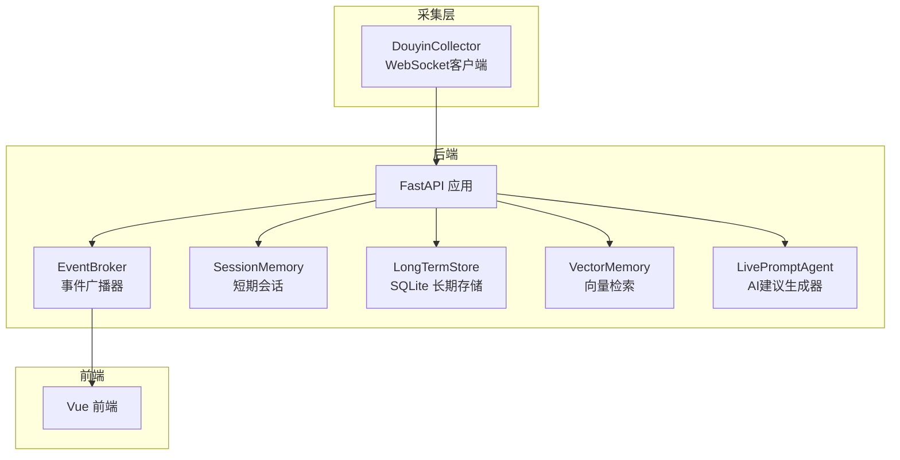
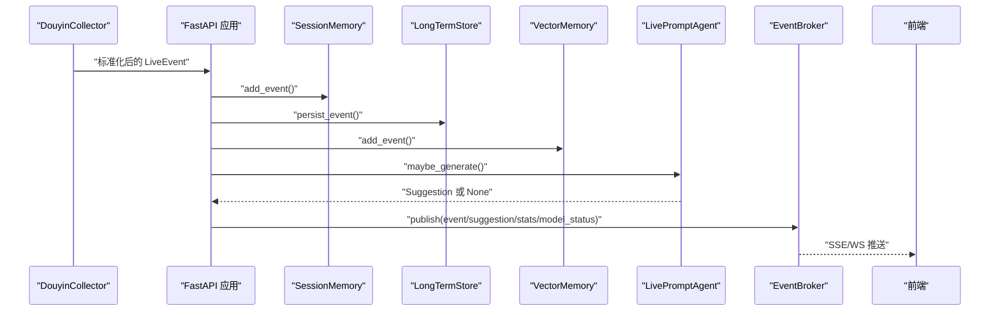
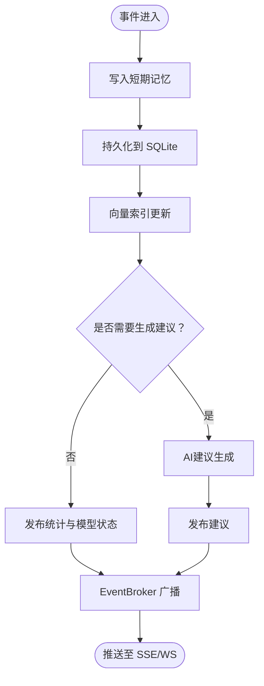
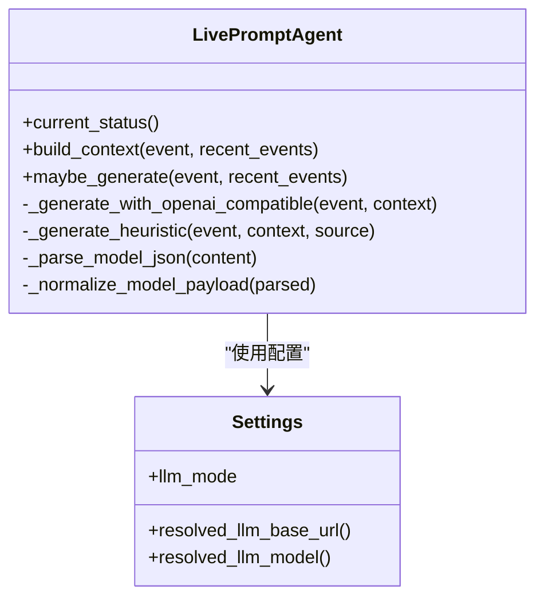
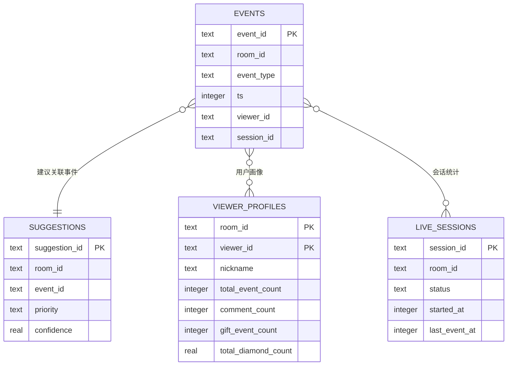
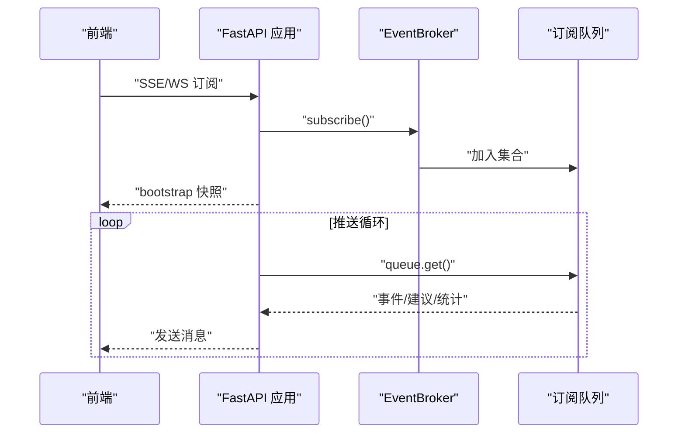
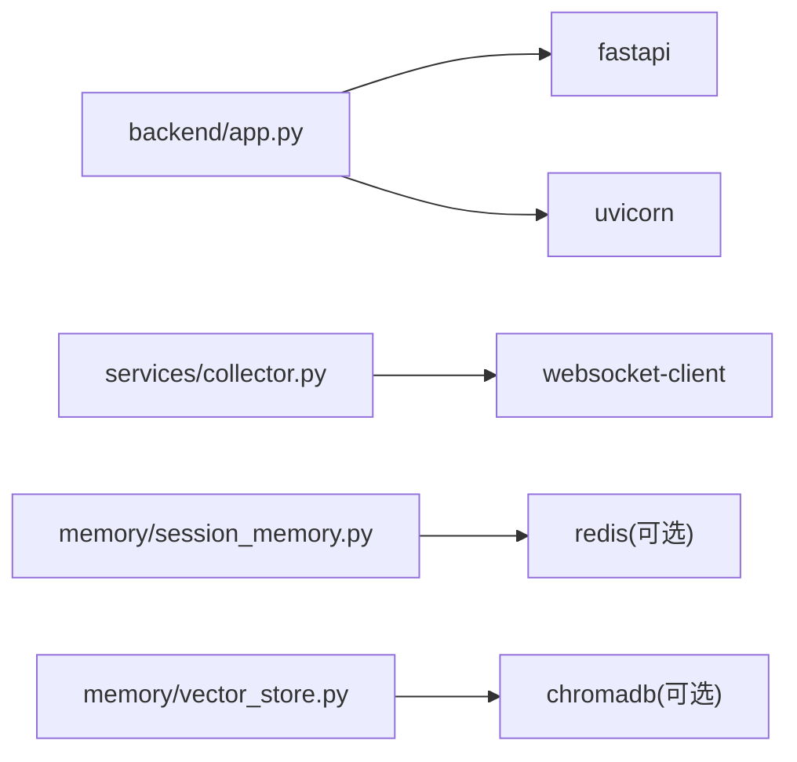

# CPU性能问题

<cite>
**本文引用的文件**
- [backend/app.py](file://backend/app.py)
- [backend/config.py](file://backend/config.py)
- [backend/services/broker.py](file://backend/services/broker.py)
- [backend/services/agent.py](file://backend/services/agent.py)
- [backend/services/collector.py](file://backend/services/collector.py)
- [backend/memory/session_memory.py](file://backend/memory/session_memory.py)
- [backend/memory/long_term.py](file://backend/memory/long_term.py)
- [backend/memory/vector_store.py](file://backend/memory/vector_store.py)
- [backend/schemas/live.py](file://backend/schemas/live.py)
- [requirements.txt](file://requirements.txt)
- [README.md](file://README.md)
- [USAGE.md](file://USAGE.md)
- [tool/config.yaml](file://tool/config.yaml)
</cite>

## 目录
1. [简介](#简介)
2. [项目结构](#项目结构)
3. [核心组件](#核心组件)
4. [架构总览](#架构总览)
5. [详细组件分析](#详细组件分析)
6. [依赖分析](#依赖分析)
7. [性能考量](#性能考量)
8. [故障排查指南](#故障排查指南)
9. [结论](#结论)
10. [附录](#附录)

## 简介
本指南聚焦于该直播提词系统的CPU性能问题诊断与优化，覆盖事件处理瓶颈分析（事件队列积压检测、处理延迟监控、并发处理优化）、AI模型推理耗时分析（模型加载与推理时间、批处理优化）、数据库查询性能优化（SQL分析、索引使用、查询计划优化）、以及WebSocket/SSE连接的CPU开销分析（连接数监控、消息处理效率、网络I/O优化）。同时提供具体性能分析工具使用方法与指标解读建议，帮助在高并发直播场景下稳定运行并降低CPU占用。

## 项目结构
该项目采用FastAPI后端，配合本地抖音消息采集器、短期/长期存储与向量检索、以及前端Vue应用，形成完整的实时提词链路。后端核心入口负责接收事件、写入多层存储、调用AI模型生成建议，并通过SSE/WS向前端推送。

图表来源
- [backend/app.py:1-220](file://backend/app.py#L1-L220)
- [backend/services/collector.py:1-284](file://backend/services/collector.py#L1-L284)
- [backend/services/broker.py:1-40](file://backend/services/broker.py#L1-L40)
- [backend/memory/session_memory.py:1-113](file://backend/memory/session_memory.py#L1-L113)
- [backend/memory/long_term.py:1-750](file://backend/memory/long_term.py#L1-L750)
- [backend/memory/vector_store.py:1-108](file://backend/memory/vector_store.py#L1-L108)
- [backend/services/agent.py:1-393](file://backend/services/agent.py#L1-L393)

章节来源
- [README.md:21-349](file://README.md#L21-L349)
- [backend/app.py:1-220](file://backend/app.py#L1-L220)

## 核心组件
- FastAPI应用与生命周期管理：负责健康检查、房间切换、事件注入、SSE/WS推送、以及应用生命周期的启动与停止。
- 事件采集器：连接本地抖音消息源WebSocket，将原始消息标准化为统一事件对象，并提交到后端事件循环。
- 事件广播器：维护订阅队列集合，向所有订阅者广播事件、建议、统计与模型状态。
- 短期记忆：优先使用Redis，若不可用则退化为进程内内存，保存最近事件与建议，支持TTL。
- 长期存储：SQLite持久化事件、建议、用户画像、礼物统计、直播会话等，包含多处索引。
- 向量检索：优先使用Chroma，若不可用则退化为轻量哈希嵌入与文本相似度，用于相似历史检索。
- AI建议生成器：优先调用OpenAI兼容接口，失败时回退到本地启发式规则，记录模型状态。
- 数据模型：统一的事件、建议、会话统计、模型状态等数据结构。

章节来源
- [backend/app.py:1-220](file://backend/app.py#L1-L220)
- [backend/services/collector.py:1-284](file://backend/services/collector.py#L1-L284)
- [backend/services/broker.py:1-40](file://backend/services/broker.py#L1-L40)
- [backend/memory/session_memory.py:1-113](file://backend/memory/session_memory.py#L1-L113)
- [backend/memory/long_term.py:1-750](file://backend/memory/long_term.py#L1-L750)
- [backend/memory/vector_store.py:1-108](file://backend/memory/vector_store.py#L1-L108)
- [backend/services/agent.py:1-393](file://backend/services/agent.py#L1-L393)
- [backend/schemas/live.py:1-95](file://backend/schemas/live.py#L1-L95)

## 架构总览
系统从本地抖音消息源接收实时事件，经采集器标准化后进入FastAPI事件循环，写入短期/长期存储与向量库，随后由AI建议生成器生成建议，再通过事件广播器推送到SSE/WS前端。整体为异步事件驱动，涉及多线程WebSocket客户端与异步事件循环的协作。

图表来源
- [backend/services/collector.py:200-214](file://backend/services/collector.py#L200-L214)
- [backend/app.py:61-78](file://backend/app.py#L61-L78)
- [backend/services/broker.py:28-39](file://backend/services/broker.py#L28-L39)
- [backend/app.py:187-220](file://backend/app.py#L187-L220)

## 详细组件分析

### 事件处理瓶颈分析
- 事件队列积压检测
  - 广播器内部使用异步队列，当队列满时会标记过期队列并移除，避免阻塞。可通过监控订阅队列数量与广播器内部集合大小评估积压风险。
  - 关键点：广播器发布时对每个订阅队列尝试非阻塞放入，若满则收集过期队列并在后续清理。
- 处理延迟监控
  - FastAPI路由与事件处理函数均为异步，建议在关键路径埋点（如事件进入、写入短期/长期存储、向量索引、AI生成、广播）记录时间戳，计算各阶段耗时。
  - SSE/WS推送为同步发送，应避免在推送前进行重计算。
- 并发处理优化
  - 采集器使用独立线程运行WebSocket客户端，消息到达后通过线程安全的方式提交到事件循环，减少主线程阻塞。
  - 建议：将耗时操作（如网络请求、磁盘IO）拆分为任务队列或后台任务，避免阻塞事件循环。

图表来源
- [backend/app.py:61-78](file://backend/app.py#L61-L78)
- [backend/services/broker.py:28-39](file://backend/services/broker.py#L28-L39)

章节来源
- [backend/services/broker.py:10-40](file://backend/services/broker.py#L10-L40)
- [backend/services/collector.py:117-214](file://backend/services/collector.py#L117-L214)
- [backend/app.py:61-78](file://backend/app.py#L61-L78)

### AI模型推理耗时分析
- 模型加载时间
  - 当前实现为在线HTTP请求，未见本地模型加载逻辑，主要开销在网络往返与远端推理。
- 推理执行时间
  - 建议在AI生成器中记录请求发起与响应接收的时间戳，统计平均/分位耗时与错误率。
  - 回退策略：当在线模型失败时回退到本地启发式规则，确保系统稳定性。
- 批处理优化
  - 当前未实现批量请求，建议在事件聚合窗口内合并多个建议请求（若上游允许），减少网络往返次数。
  - 本地规则部分为纯CPU计算，可考虑缓存热点用户画像与相似历史结果，降低重复计算。

图表来源
- [backend/services/agent.py:23-393](file://backend/services/agent.py#L23-L393)
- [backend/config.py:39-94](file://backend/config.py#L39-L94)

章节来源
- [backend/services/agent.py:96-330](file://backend/services/agent.py#L96-L330)
- [backend/config.py:70-91](file://backend/config.py#L70-L91)

### 数据库查询性能优化
- SQL查询分析
  - 长期存储包含大量表与索引，建议使用EXPLAIN QUERY PLAN分析高频查询（如按房间/时间排序、按用户画像聚合、按会话统计）。
  - 关键索引：房间+时间、房间+用户+时间、房间+事件类型+时间、会话ID、用户昵称等。
- 索引使用情况
  - 已创建多处索引，建议定期检查查询计划，确认索引命中情况，避免全表扫描。
- 查询计划优化
  - 对频繁的聚合查询（如统计事件类型分布、用户画像聚合）可考虑物化视图或缓存中间结果。
  - 写入路径（事件持久化、会话更新、画像更新）应尽量减少重复写入与重建。

图表来源
- [backend/memory/long_term.py:50-195](file://backend/memory/long_term.py#L50-L195)

章节来源
- [backend/memory/long_term.py:183-195](file://backend/memory/long_term.py#L183-L195)
- [backend/memory/long_term.py:420-454](file://backend/memory/long_term.py#L420-L454)

### WebSocket与SSE连接的CPU开销分析
- 连接数监控
  - 广播器维护订阅队列集合，建议监控集合大小与队列长度，识别异常增长。
  - SSE/WS路由中对房间过滤与消息过滤，避免无效推送。
- 消息处理效率
  - SSE/WS推送为同步发送，建议避免在推送前进行重计算；将计算前置到事件处理阶段。
- 网络I/O优化
  - SSE/WS连接建立后持续推送，建议启用压缩与合理的心跳策略，减少不必要的空闲连接。

图表来源
- [backend/app.py:187-220](file://backend/app.py#L187-L220)
- [backend/services/broker.py:16-21](file://backend/services/broker.py#L16-L21)

章节来源
- [backend/app.py:187-220](file://backend/app.py#L187-L220)
- [backend/services/broker.py:10-40](file://backend/services/broker.py#L10-L40)

## 依赖分析
- 后端依赖
  - FastAPI、Uvicorn：提供异步Web框架与ASGI服务器。
  - websocket-client：WebSocket客户端，用于连接本地抖音消息源。
  - redis：可选，用于短期记忆的分布式缓存。
  - chromadb：可选，用于向量检索的持久化存储。
- 工具依赖
  - tool/config.yaml：本地抖音消息源的配置文件，包含端口与Cookie设置。

图表来源
- [requirements.txt:1-6](file://requirements.txt#L1-L6)
- [backend/app.py:1-220](file://backend/app.py#L1-L220)
- [backend/services/collector.py:1-284](file://backend/services/collector.py#L1-L284)
- [backend/memory/session_memory.py:1-113](file://backend/memory/session_memory.py#L1-L113)
- [backend/memory/vector_store.py:1-108](file://backend/memory/vector_store.py#L1-L108)

章节来源
- [requirements.txt:1-6](file://requirements.txt#L1-L6)
- [tool/config.yaml:1-16](file://tool/config.yaml#L1-L16)

## 性能考量
- 事件处理瓶颈
  - 采集器线程与事件循环分离，避免阻塞；建议将耗时操作异步化或后台化。
  - 广播器对满队列的处理策略需结合订阅端消费速率调整队列容量与清理频率。
- AI模型推理
  - 在线模型调用存在网络抖动与超时风险，建议增加重试与熔断机制；必要时引入批处理与缓存。
- 数据库
  - 高频查询应确保索引命中；对写入密集场景，建议批量写入与事务合并。
- WebSocket/SSE
  - 控制订阅端数量与消息粒度，避免冗余推送；合理的心跳与断线重连策略降低CPU消耗。

[本节为通用指导，无需特定文件来源]

## 故障排查指南
- 事件积压与延迟
  - 检查广播器订阅队列数量与过期队列清理频率；确认订阅端消费速率。
  - 在关键路径埋点，定位耗时环节（写入短期/长期存储、向量索引、AI生成）。
- AI模型异常
  - 查看模型状态与错误码，确认网络连通性与API密钥；必要时切换到启发式规则模式。
- 数据库慢查询
  - 使用EXPLAIN QUERY PLAN分析慢查询，检查索引使用情况；对聚合查询考虑缓存。
- WebSocket/SSE异常
  - 检查订阅端连接数与消息过滤逻辑；确认心跳与断线重连策略。

章节来源
- [backend/services/broker.py:28-39](file://backend/services/broker.py#L28-L39)
- [backend/services/agent.py:222-285](file://backend/services/agent.py#L222-L285)
- [backend/memory/long_term.py:183-195](file://backend/memory/long_term.py#L183-L195)
- [backend/app.py:187-220](file://backend/app.py#L187-L220)

## 结论
本项目在高并发直播场景下，CPU性能主要受事件处理、AI模型调用、数据库写入与推送链路影响。通过事件队列积压检测、处理延迟监控、并发优化、模型批处理与缓存、数据库索引与查询计划优化、以及WebSocket/SSE连接与消息处理效率提升，可显著降低CPU占用并提高系统稳定性。建议在生产环境中结合埋点与监控，持续迭代优化。

[本节为总结，无需特定文件来源]

## 附录

### 性能分析工具使用方法与指标解读
- cProfile
  - 用途：分析Python函数调用耗时，定位CPU热点。
  - 方法：在FastAPI应用入口或关键处理函数上使用cProfile.run或cProfile.Profile进行采样。
  - 指标：总耗时、调用次数、每次调用平均耗时，重点关注top N函数。
- py-spy
  - 用途：对运行中的Python进程进行采样，无需停机即可查看CPU热点。
  - 方法：在后端进程PID上运行py-spy top/stack，观察函数栈与调用占比。
  - 指标：函数栈占比、线程/协程分布，识别阻塞点与异步瓶颈。
- FastAPI埋点
  - 建议在以下关键路径埋点：事件进入、写入短期/长期存储、向量索引、AI生成、广播推送。
  - 指标：各阶段耗时、吞吐量、错误率、队列长度、订阅端数量。

章节来源
- [backend/app.py:61-78](file://backend/app.py#L61-L78)
- [backend/services/collector.py:200-214](file://backend/services/collector.py#L200-L214)
- [backend/services/broker.py:28-39](file://backend/services/broker.py#L28-L39)
- [backend/services/agent.py:222-285](file://backend/services/agent.py#L222-L285)