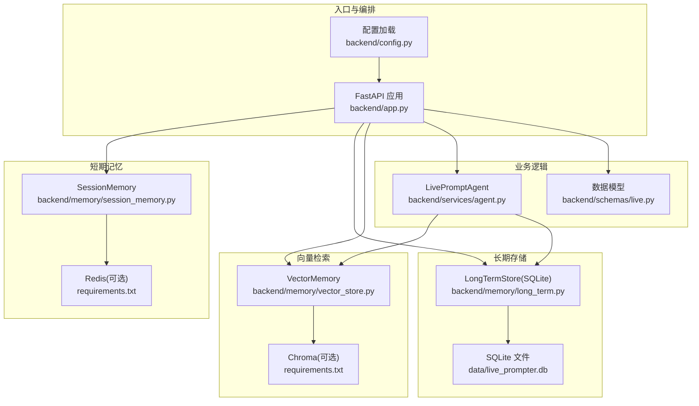
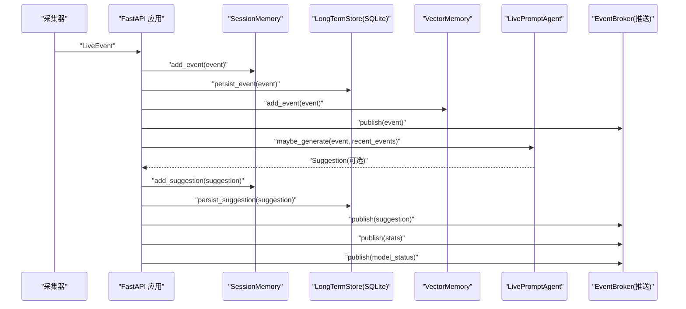
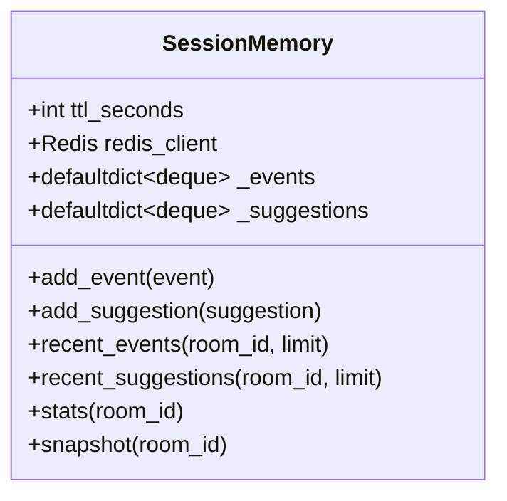
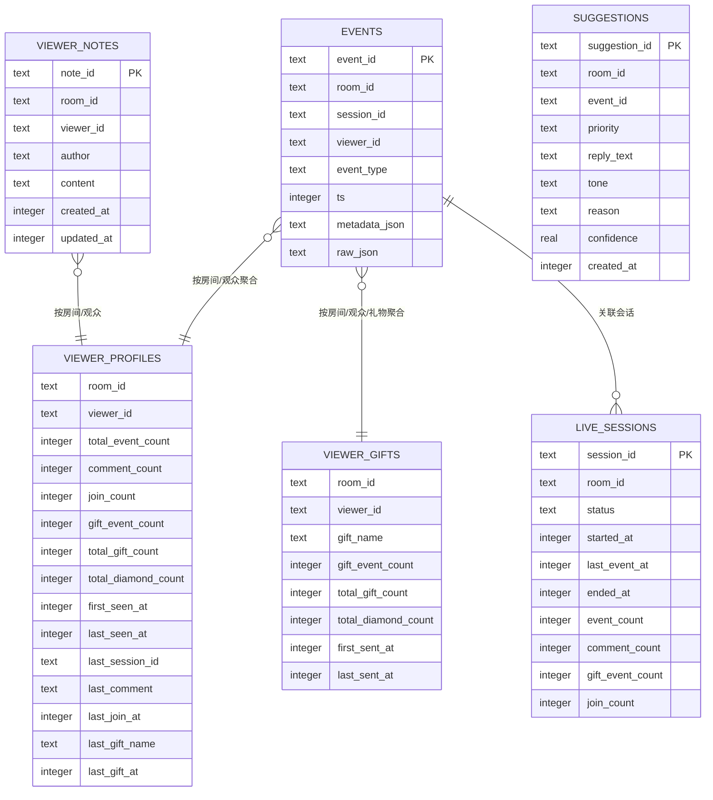
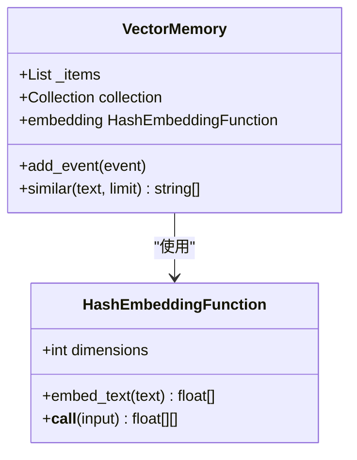
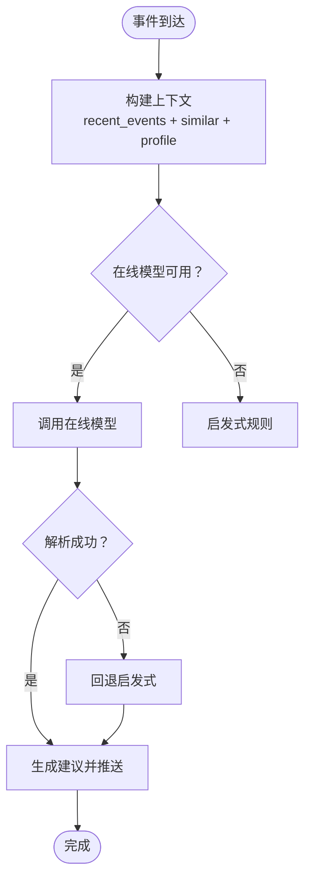
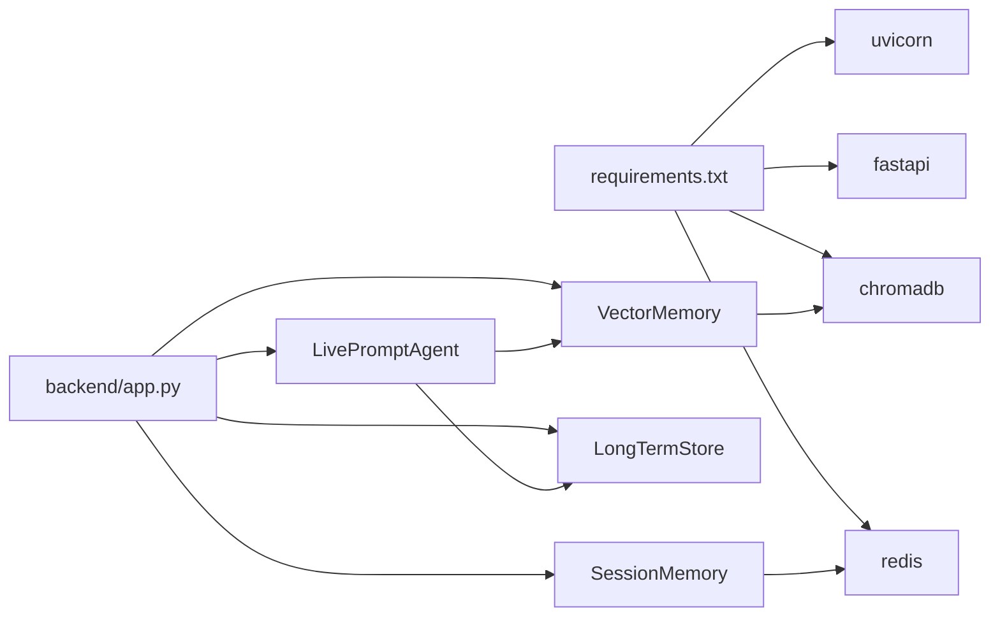

# 内存性能问题

<cite>
**本文引用的文件**
- [README.md](file://README.md)
- [backend/config.py](file://backend/config.py)
- [backend/app.py](file://backend/app.py)
- [backend/memory/session_memory.py](file://backend/memory/session_memory.py)
- [backend/memory/long_term.py](file://backend/memory/long_term.py)
- [backend/memory/vector_store.py](file://backend/memory/vector_store.py)
- [backend/schemas/live.py](file://backend/schemas/live.py)
- [backend/services/agent.py](file://backend/services/agent.py)
- [data/DATABASE.md](file://data/DATABASE.md)
</cite>

## 目录
1. [简介](#简介)
2. [项目结构](#项目结构)
3. [核心组件](#核心组件)
4. [架构总览](#架构总览)
5. [详细组件分析](#详细组件分析)
6. [依赖分析](#依赖分析)
7. [性能考量](#性能考量)
8. [故障排查指南](#故障排查指南)
9. [结论](#结论)
10. [附录](#附录)

## 简介
本指南聚焦于 Python 进程内存使用异常的诊断与优化，结合本项目的短期会话内存、SQLite 长期存储、向量检索与 Redis 缓存等关键组件，提供可操作的排查方法与优化策略。内容涵盖：
- 内存泄漏检测、对象引用分析、垃圾回收监控
- Redis 缓存内存使用（键空间大小、淘汰策略、TTL）
- SQLite 数据库文件大小增长诊断（表空间、索引、碎片整理）
- 短期会话内存 deque 占用控制（最大长度、事件清理策略）
- 向量存储内存优化（嵌入向量大小、Chroma 配置、相似度阈值）

## 项目结构
后端采用分层设计：入口应用负责事件编排，短期记忆与长期存储分别处理热数据与历史数据，向量检索提供相似度召回，Agent 生成建议并驱动前端推送。

图表来源
- [backend/app.py:1-220](file://backend/app.py#L1-L220)
- [backend/config.py:1-94](file://backend/config.py#L1-L94)
- [backend/memory/session_memory.py:1-113](file://backend/memory/session_memory.py#L1-L113)
- [backend/memory/long_term.py:1-750](file://backend/memory/long_term.py#L1-L750)
- [backend/memory/vector_store.py:1-108](file://backend/memory/vector_store.py#L1-L108)
- [backend/services/agent.py:1-393](file://backend/services/agent.py#L1-L393)
- [backend/schemas/live.py:1-95](file://backend/schemas/live.py#L1-L95)

章节来源
- [README.md:1-349](file://README.md#L1-L349)
- [backend/app.py:1-220](file://backend/app.py#L1-L220)
- [backend/config.py:1-94](file://backend/config.py#L1-L94)

## 核心组件
- 短期会话内存（SessionMemory）：支持 Redis 与进程内 deque 双栈，控制热数据窗口与 TTL。
- 长期存储（LongTermStore）：SQLite 表结构与索引，提供事件、画像、会话、建议等查询。
- 向量存储（VectorMemory）：Chroma 持久化或本地轻量相似度，支持嵌入维度与文档上限。
- 配置（Settings）：集中管理 Redis、Chroma、SQLite 路径与 TTL 等参数。
- Agent：建议生成器，串联短期/长期/向量与前端推送。

章节来源
- [backend/memory/session_memory.py:17-113](file://backend/memory/session_memory.py#L17-L113)
- [backend/memory/long_term.py:36-750](file://backend/memory/long_term.py#L36-L750)
- [backend/memory/vector_store.py:52-108](file://backend/memory/vector_store.py#L52-L108)
- [backend/config.py:39-94](file://backend/config.py#L39-L94)
- [backend/services/agent.py:23-393](file://backend/services/agent.py#L23-L393)

## 架构总览
事件从采集器进入后端，依次写入短期会话、长期存储、向量索引，同时触发建议生成与前端推送。

图表来源
- [backend/app.py:61-78](file://backend/app.py#L61-L78)
- [backend/memory/session_memory.py:42-84](file://backend/memory/session_memory.py#L42-L84)
- [backend/memory/long_term.py:420-454](file://backend/memory/long_term.py#L420-L454)
- [backend/memory/vector_store.py:64-83](file://backend/memory/vector_store.py#L64-L83)
- [backend/services/agent.py:73-94](file://backend/services/agent.py#L73-L94)

## 详细组件分析

### 短期会话内存（SessionMemory）与 deque 占用控制
- 退化策略：若未安装 Redis 或未配置 redis_url，则使用进程内 defaultdict + deque，分别限定事件与建议的最大长度。
- 热点数据生命周期：Redis 模式下通过 expire 控制键 TTL；进程内模式下依赖 deque 的 maxlen 自动丢弃旧元素。
- 读写路径：lpush/ltrim/range/expire（Redis）与 appendleft/切片（进程内）。
- 统计与快照：基于短期窗口统计事件类型分布，构造 SessionSnapshot。

图表来源
- [backend/memory/session_memory.py:17-113](file://backend/memory/session_memory.py#L17-L113)

章节来源
- [backend/memory/session_memory.py:17-113](file://backend/memory/session_memory.py#L17-L113)
- [backend/config.py:54-55](file://backend/config.py#L54-L55)

### SQLite 长期存储（LongTermStore）与数据库文件增长
- 表结构：events、viewer_profiles、viewer_gifts、live_sessions、viewer_notes、suggestions。
- 索引：为高频查询建立索引（如 room_id+ts、viewer_id、session_id 等），提升查询效率并减少扫描成本。
- 写入路径：事件写入时维护活跃会话、更新画像与礼物聚合，必要时重建聚合。
- 查询路径：最近事件、统计、会话、画像、建议等均通过 SQL 查询完成。
- 文件增长诊断：可通过 PRAGMA 查询页大小、页面计数、空闲页数量，评估碎片与膨胀；定期执行 VACUUM 或 WAL 模式优化。

图表来源
- [backend/memory/long_term.py:54-148](file://backend/memory/long_term.py#L54-L148)
- [data/DATABASE.md:16-150](file://data/DATABASE.md#L16-L150)

章节来源
- [backend/memory/long_term.py:36-750](file://backend/memory/long_term.py#L36-L750)
- [data/DATABASE.md:1-151](file://data/DATABASE.md#L1-L151)

### 向量存储（VectorMemory）与相似度阈值
- Chroma 持久化：当可用时，使用 PersistentClient 创建/获取集合，写入文档、元数据与嵌入向量。
- 本地轻量方案：无 Chroma 时，使用 HashEmbeddingFunction 生成固定维度向量，维护固定长度的内存列表，基于词重叠进行相似度检索。
- 嵌入维度与内存：HashEmbeddingFunction 的维度越大，单条向量内存越高；同时影响相似度计算复杂度。
- 相似度阈值：当前实现为纯词重叠，无显式阈值；Chroma 模式下可调整 query 的 n_results 与距离阈值（需在调用方或客户端侧实现）。

图表来源
- [backend/memory/vector_store.py:19-108](file://backend/memory/vector_store.py#L19-L108)

章节来源
- [backend/memory/vector_store.py:52-108](file://backend/memory/vector_store.py#L52-L108)

### 建议生成与内存影响
- 上下文构建：近期事件窗口、相似历史片段、用户画像，均来自短期/长期/向量存储。
- 生成策略：优先在线模型，失败回退启发式规则；回退路径仍会构造上下文，增加临时对象与序列化开销。
- 前端推送：SSE/WebSocket 推送事件、建议、统计与模型状态，注意队列积压导致的内存增长。

图表来源
- [backend/services/agent.py:56-113](file://backend/services/agent.py#L56-L113)
- [backend/app.py:61-78](file://backend/app.py#L61-L78)

章节来源
- [backend/services/agent.py:23-393](file://backend/services/agent.py#L23-L393)
- [backend/app.py:61-78](file://backend/app.py#L61-L78)

## 依赖分析
- 外部依赖：FastAPI、Uvicorn、Redis、ChromaDB、websocket-client。
- 组件耦合：SessionMemory 与 Redis 强耦合；VectorMemory 与 Chroma 强耦合；Agent 依赖 VectorMemory 与 LongTermStore。
- 风险点：Redis/Chroma 未安装时的退化路径仍会产生内存对象；SQLite 未优化索引/碎片会导致查询与写入变慢，间接引发内存抖动。

图表来源
- [requirements.txt:1-6](file://requirements.txt#L1-L6)
- [backend/app.py:13-29](file://backend/app.py#L13-L29)

章节来源
- [requirements.txt:1-6](file://requirements.txt#L1-L6)
- [backend/app.py:13-29](file://backend/app.py#L13-L29)

## 性能考量
- 短期会话内存
  - Redis 模式：合理设置 SESSION_TTL_SECONDS，避免过长导致键空间膨胀；使用 ltrim 控制窗口长度，避免 lpush 无限增长。
  - 进程内模式：确保 deque 的 maxlen 与业务窗口匹配，避免频繁扩容与对象重建。
- SQLite
  - 确保索引覆盖高频查询字段；定期执行 VACUUM 或启用 WAL 模式；监控数据库文件大小与页使用率。
- 向量存储
  - 嵌入维度越大，内存与计算成本越高；在无 Chroma 时，控制内存列表长度，避免 O(n) 搜索扩大。
  - Chroma 模式下，合理设置 n_results 与距离阈值，减少返回结果集。
- 建议生成
  - 控制上下文窗口大小（recent_events），避免过长上下文导致序列化与解析开销上升。
  - 关注回退路径中的临时对象与字符串拼接，避免重复构造。

[本节为通用指导，无需具体文件引用]

## 故障排查指南

### Python 进程内存异常排查
- 内存泄漏检测
  - 使用 tracemalloc 或 memory_profiler 定位新增对象与引用链，重点检查事件序列化、向量嵌入、上下文拼接等热点路径。
  - 关注循环引用：事件对象与上下文字典相互持有引用时，需确保及时释放或弱引用。
- 对象引用分析
  - 使用 objgraph 查看“增长最多”的类型与创建者；结合代码路径定位未释放的容器（如 deque、列表、字典）。
- 垃圾回收监控
  - 开启 gc.set_debug(gc.DEBUG_STATS) 并观察周期性回收日志，确认是否存在大量不可回收对象或延迟回收。

[本节为通用指导，无需具体文件引用]

### Redis 缓存内存使用
- 键空间大小监控
  - 使用 INFO memory 与 MEMORY STATS 获取内存使用详情；使用 SCAN 分批遍历键，统计房间键数量与平均长度。
- 内存淘汰策略检查
  - 使用 CONFIG GET maxmemory-policy 检查策略；建议使用 allkeys-lru 或 volatile-ttl 等策略，避免全量淘汰。
- TTL 配置优化
  - 结合 SESSION_TTL_SECONDS 与业务峰值流量，适当提高 TTL 以降低过期频率；避免过短导致频繁重建窗口。
- 清理策略
  - 对于长时间无活动的房间，可定期执行 DEL room:{room_id}:events 与 room:{room_id}:suggestions，释放内存。

章节来源
- [backend/config.py:54-55](file://backend/config.py#L54-L55)
- [backend/memory/session_memory.py:18-31](file://backend/memory/session_memory.py#L18-L31)
- [backend/memory/session_memory.py:42-64](file://backend/memory/session_memory.py#L42-L64)

### SQLite 数据库文件大小增长诊断
- 表空间分析
  - 使用 PRAGMA page_size、page_count、freelist_count 评估页使用与空闲页；使用 PRAGMA wal_checkpoint(LIMIT) 检查 WAL 状态。
- 索引使用情况
  - EXPLAIN QUERY PLAN 分析慢查询是否命中索引；为高频过滤字段补充合适索引。
- 数据库碎片整理
  - 在低峰期执行 VACUUM 或 REINDEX；如需在线维护，考虑 WAL 模式配合 VACUUM。
- 建议查询
  - 参考 data/DATABASE.md 中常用查询，确保查询路径与索引一致，避免全表扫描。

章节来源
- [data/DATABASE.md:101-150](file://data/DATABASE.md#L101-L150)
- [backend/memory/long_term.py:183-195](file://backend/memory/long_term.py#L183-L195)

### 短期会话内存 deque 占用控制
- 最大长度限制
  - Redis 模式：ltrim 控制窗口长度；进程内模式：deque 的 maxlen 控制容量。
- 事件清理策略
  - Redis：利用 expire 自动过期；进程内：依赖 maxlen 自动丢弃旧元素。
- 统计与快照
  - stats 与 snapshot 基于短期窗口统计，避免对长期存储的过度依赖。

章节来源
- [backend/memory/session_memory.py:18-31](file://backend/memory/session_memory.py#L18-L31)
- [backend/memory/session_memory.py:42-84](file://backend/memory/session_memory.py#L42-L84)
- [backend/memory/session_memory.py:86-113](file://backend/memory/session_memory.py#L86-L113)

### 向量存储内存优化
- 嵌入向量大小控制
  - HashEmbeddingFunction 的 dimensions 越大，单条向量内存越高；在无 Chroma 时，建议适度降低维度。
- Chroma 数据库内存配置
  - PersistentClient 默认行为；如需优化，可在启动参数中调整缓存与索引策略（需在调用方或客户端侧实现）。
- 相似度阈值调整
  - 当前实现为词重叠，无显式阈值；Chroma 模式下可在查询侧设置 n_results 与距离阈值，减少返回结果集。

章节来源
- [backend/memory/vector_store.py:26-49](file://backend/memory/vector_store.py#L26-L49)
- [backend/memory/vector_store.py:64-108](file://backend/memory/vector_store.py#L64-L108)

## 结论
本项目的内存性能主要受短期会话窗口、SQLite 索引与碎片、向量嵌入维度与检索结果集大小影响。通过合理设置 Redis TTL、控制 deque 窗口、优化 SQLite 索引与碎片、以及在向量检索侧控制维度与结果集，可显著降低内存占用并提升稳定性。建议在生产环境中持续监控内存曲线与 GC 日志，结合本指南的策略进行迭代优化。

[本节为总结，无需具体文件引用]

## 附录
- 配置项参考
  - Redis 地址与 TTL：REDIS_URL、SESSION_TTL_SECONDS
  - SQLite 路径：DATABASE_PATH
  - Chroma 路径：CHROMA_DIR
- 常用接口
  - /health、/api/bootstrap、/api/events/stream、/ws/live

章节来源
- [backend/config.py:54-55](file://backend/config.py#L54-L55)
- [backend/config.py:52-53](file://backend/config.py#L52-L53)
- [backend/config.py:53-53](file://backend/config.py#L53-L53)
- [README.md:208-274](file://README.md#L208-L274)