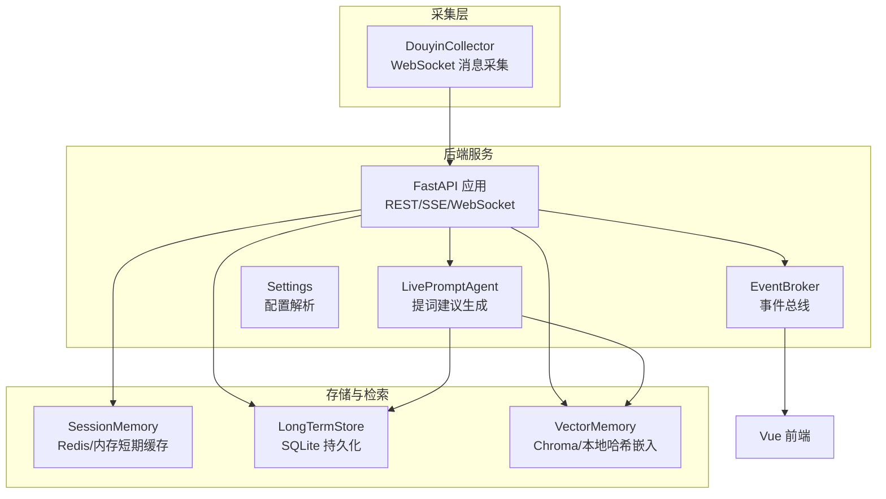
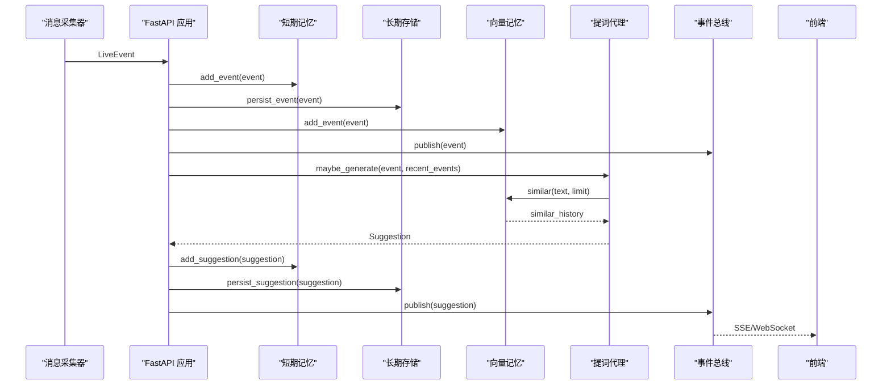
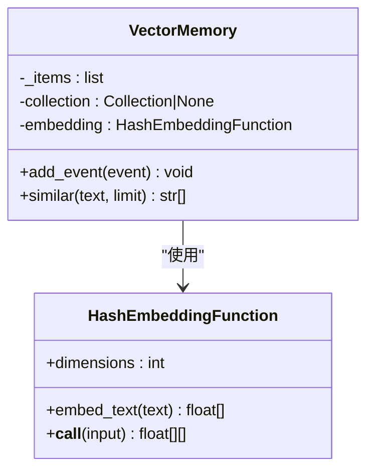
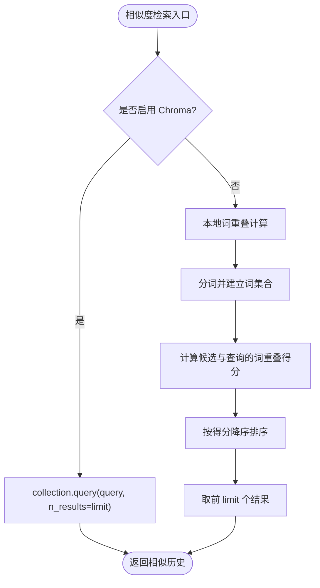
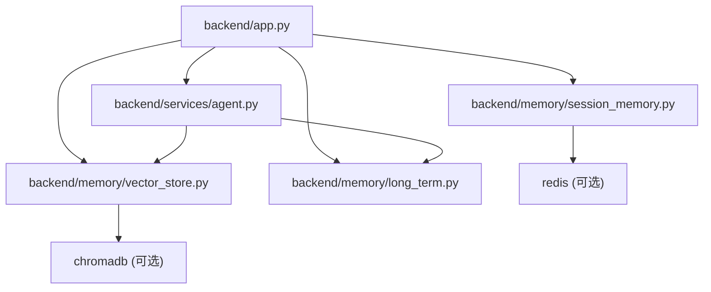

# 向量检索性能问题诊断和优化指南

<cite>
**本文档引用的文件**
- [backend/memory/vector_store.py](file://backend/memory/vector_store.py)
- [backend/memory/long_term.py](file://backend/memory/long_term.py)
- [backend/memory/session_memory.py](file://backend/memory/session_memory.py)
- [backend/services/agent.py](file://backend/services/agent.py)
- [backend/config.py](file://backend/config.py)
- [backend/app.py](file://backend/app.py)
- [backend/schemas/live.py](file://backend/schemas/live.py)
- [data/DATABASE.md](file://data/DATABASE.md)
- [requirements.txt](file://requirements.txt)
- [README.md](file://README.md)
</cite>

## 目录
1. [简介](#简介)
2. [项目结构](#项目结构)
3. [核心组件](#核心组件)
4. [架构总览](#架构总览)
5. [详细组件分析](#详细组件分析)
6. [依赖关系分析](#依赖关系分析)
7. [性能考虑](#性能考虑)
8. [故障排除指南](#故障排除指南)
9. [结论](#结论)
10. [附录](#附录)

## 简介
本指南聚焦于向量检索在直播场景中的性能问题诊断与优化，结合代码库现状，系统阐述以下方面：
- 向量嵌入模型选择对性能的影响（模型复杂度、向量维度、嵌入速度对比）
- 相似度检索性能优化（阈值调整、搜索算法选择、批量查询优化）
- Chroma 数据库性能优化（向量索引配置、存储后端选择、查询缓存策略）
- 向量数据管理优化（数据预处理、批量导入、增量更新策略）
- 性能监控与基准测试（查询响应时间、相似度计算耗时、内存使用监控）
- 优化效果评估指标与方法

## 项目结构
该项目采用“采集-处理-存储-检索-生成-展示”的分层架构，其中与向量检索直接相关的核心模块包括：
- 向量记忆层：负责事件向量化与相似检索
- 长期存储层：负责事件与用户画像的持久化
- 短期记忆层：负责热数据的快速访问与统计
- 提词代理：负责建议生成与向量检索的集成
- 配置中心：负责运行参数与外部服务地址解析

图表来源
- [backend/app.py:61-78](file://backend/app.py#L61-L78)
- [backend/services/agent.py:23-37](file://backend/services/agent.py#L23-L37)
- [backend/memory/vector_store.py:52-83](file://backend/memory/vector_store.py#L52-L83)
- [backend/memory/long_term.py:36-155](file://backend/memory/long_term.py#L36-L155)
- [backend/memory/session_memory.py:17-31](file://backend/memory/session_memory.py#L17-L31)

章节来源
- [README.md:35-48](file://README.md#L35-L48)
- [backend/app.py:25-29](file://backend/app.py#L25-L29)

## 核心组件
- 向量记忆层（VectorMemory）：封装向量嵌入与相似检索，支持 Chroma 向量库与本地哈希嵌入两种模式
- 长期存储层（LongTermStore）：基于 SQLite 的事件与用户画像持久化，含索引与聚合
- 短期记忆层（SessionMemory）：基于 Redis 或进程内队列的热数据缓存，支持 TTL 控制
- 提词代理（LivePromptAgent）：建议生成器，集成向量检索与本地启发式规则
- 配置中心（Settings）：解析运行参数，包括 LLM 模式、Chroma 目录、Redis 地址等

章节来源
- [backend/memory/vector_store.py:52-107](file://backend/memory/vector_store.py#L52-L107)
- [backend/memory/long_term.py:36-155](file://backend/memory/long_term.py#L36-L155)
- [backend/memory/session_memory.py:17-112](file://backend/memory/session_memory.py#L17-L112)
- [backend/services/agent.py:23-393](file://backend/services/agent.py#L23-L393)
- [backend/config.py:39-94](file://backend/config.py#L39-L94)

## 架构总览
向量检索在系统中的位置与调用链如下：
- 事件进入后端，同时写入短期记忆、长期存储与向量记忆
- 建议生成阶段，Agent 从向量记忆检索相似历史，结合近期事件与用户画像构建上下文
- 建议生成完成后，通过事件总线推送至前端

图表来源
- [backend/app.py:61-78](file://backend/app.py#L61-L78)
- [backend/services/agent.py:65-94](file://backend/services/agent.py#L65-L94)
- [backend/memory/vector_store.py:85-107](file://backend/memory/vector_store.py#L85-L107)

## 详细组件分析

### 向量记忆层（VectorMemory）与嵌入函数
- 嵌入函数（HashEmbeddingFunction）：在未安装 Chroma 时提供本地替代方案，将文本分词后通过哈希映射到固定维度向量，并进行归一化
- 向量存储（VectorMemory）：支持两种模式
  - Chroma 模式：使用 PersistentClient 创建/获取集合，支持 upsert 与 query
  - 本地模式：维护最近 N 条文档，基于词重叠进行相似检索

图表来源
- [backend/memory/vector_store.py:19-49](file://backend/memory/vector_store.py#L19-L49)
- [backend/memory/vector_store.py:52-107](file://backend/memory/vector_store.py#L52-L107)

章节来源
- [backend/memory/vector_store.py:19-107](file://backend/memory/vector_store.py#L19-L107)

### 相似度检索流程与优化点
- Chroma 模式：调用 collection.query，返回 top-k 文档
- 本地模式：基于词集合交集计算重叠得分，排序取前 k
- 优化方向
  - 维度与嵌入速度：HashEmbeddingFunction 的维度影响嵌入速度与内存占用
  - 查询结果数量：limit 参数直接影响检索性能
  - 本地检索的复杂度：O(N×M)（N 为候选数，M 为平均词数），可通过索引或更高效相似度策略优化

图表来源
- [backend/memory/vector_store.py:85-107](file://backend/memory/vector_store.py#L85-L107)

章节来源
- [backend/memory/vector_store.py:85-107](file://backend/memory/vector_store.py#L85-L107)

### 长期存储层（LongTermStore）与索引
- 表结构与索引：events、viewer_profiles、viewer_gifts、live_sessions、viewer_notes 等，包含多处复合索引
- 优化要点
  - 查询路径：按 room_id、viewer_id、event_type、ts 等维度建立索引，提升常见查询效率
  - 聚合与重建：viewer 聚合数据可重建，注意在大规模数据下的重建成本

章节来源
- [backend/memory/long_term.py:50-195](file://backend/memory/long_term.py#L50-L195)
- [data/DATABASE.md:16-150](file://data/DATABASE.md#L16-L150)

### 短期记忆层（SessionMemory）与缓存
- 缓存策略：Redis 模式下使用列表结构与 TTL 控制热数据生命周期；非 Redis 模式使用进程内双端队列
- 优化要点
  - Redis 列表长度与 TTL：通过 lpush/ltrim 控制容量，exprie 设置过期时间
  - 本地队列容量：deque 的 maxlen 限制内存占用

章节来源
- [backend/memory/session_memory.py:17-112](file://backend/memory/session_memory.py#L17-L112)

### 提词代理（LivePromptAgent）与上下文构建
- 上下文包含：最近事件窗口、相似历史、用户画像
- 生成策略：优先 OpenAI 兼容接口，失败时回退本地启发式规则
- 与向量检索的耦合点：build_context 中调用 vector_memory.similar

章节来源
- [backend/services/agent.py:56-113](file://backend/services/agent.py#L56-L113)
- [backend/services/agent.py:183-393](file://backend/services/agent.py#L183-L393)

## 依赖关系分析
- 外部依赖
  - chromadb：向量检索与索引
  - redis：短期记忆缓存
  - fastapi/uvicorn：后端服务框架
- 内部模块依赖
  - app.py 依赖 vector_store、long_term、session_memory、agent
  - agent 依赖 vector_store、long_term
  - vector_store 依赖 chromadb（可选）

图表来源
- [backend/app.py:13-29](file://backend/app.py#L13-L29)
- [backend/memory/vector_store.py:13-16](file://backend/memory/vector_store.py#L13-L16)
- [backend/memory/session_memory.py:11-14](file://backend/memory/session_memory.py#L11-L14)
- [requirements.txt:1-6](file://requirements.txt#L1-L6)

章节来源
- [backend/app.py:13-29](file://backend/app.py#L13-L29)
- [requirements.txt:1-6](file://requirements.txt#L1-L6)

## 性能考虑

### 向量嵌入模型选择与性能影响
- 哈希嵌入（本地替代）
  - 特点：固定维度、快速、低内存占用
  - 适用：无外部模型依赖、对精度要求不高
  - 影响因素：维度大小（如 64 维）影响嵌入速度与相似度区分度
- Chroma 向量库
  - 特点：支持多种索引与距离度量，具备批量 upsert/query 能力
  - 适用：生产环境、高并发、高精度需求
  - 影响因素：索引类型、向量维度、磁盘与内存配置

章节来源
- [backend/memory/vector_store.py:19-49](file://backend/memory/vector_store.py#L19-L49)
- [backend/memory/vector_store.py:60-83](file://backend/memory/vector_store.py#L60-L83)

### 相似度检索性能优化
- 搜索算法选择
  - Chroma：使用 collection.query，支持 top-k 返回，适合大规模向量检索
  - 本地：基于词重叠，适合小规模、低延迟场景
- 相似度阈值调整
  - 当前实现未设置阈值，建议在返回结果后增加阈值过滤，减少无效建议
- 批量查询优化
  - 向量库：批量 upsert/query 可显著降低网络与序列化开销
  - 本地：可考虑分批处理与缓存常用词集合

章节来源
- [backend/memory/vector_store.py:85-107](file://backend/memory/vector_store.py#L85-L107)

### Chroma 数据库性能优化
- 向量索引配置
  - 索引类型：HNSW、IVF 等，需根据数据规模与查询延迟权衡
  - 维度与距离度量：L2/Cosine/Inner Product 等
- 存储后端选择
  - 持久化客户端：PersistentClient，确保断电不丢失
  - 内存与磁盘：合理配置内存缓存与磁盘 IO
- 查询缓存策略
  - 对高频查询结果进行缓存，减少重复计算
  - 结合 TTL 与失效策略，避免陈旧数据

章节来源
- [backend/memory/vector_store.py:60-83](file://backend/memory/vector_store.py#L60-L83)

### 向量数据管理优化
- 数据预处理
  - 文本清洗：去除噪声、统一编码
  - 分词与特征提取：提升检索质量
- 批量导入
  - 使用 upsert 批量写入，减少往返次数
- 增量更新策略
  - 增量 upsert：仅更新变更项
  - 渐进式索引重建：避免全量重建带来的停机

章节来源
- [backend/memory/vector_store.py:73-83](file://backend/memory/vector_store.py#L73-L83)

### 性能监控与基准测试
- 查询响应时间分析
  - 记录向量检索与建议生成的耗时，定位瓶颈
- 相似度计算耗时
  - 分离嵌入与查询阶段的耗时，评估不同维度与算法的影响
- 内存使用监控
  - 监控短期记忆、向量库与数据库的内存占用
- 基准测试方法
  - 固定数据集与查询负载，测量不同配置下的吞吐与延迟
- 优化效果评估指标
  - P95/P99 延迟、吞吐量、准确率（如召回率）、资源利用率

章节来源
- [backend/services/agent.py:183-393](file://backend/services/agent.py#L183-L393)

## 故障排除指南
- Chroma 未安装或不可用
  - 现象：向量检索退化为本地模式
  - 处理：安装 chromadb 或调整配置启用 Redis/Chroma
- Redis 不可用
  - 现象：短期记忆退化为进程内队列
  - 处理：部署 Redis 或清空 REDIS_URL 以使用本地模式
- 建议生成失败
  - 现象：模型状态标记错误，回退到启发式规则
  - 处理：检查 LLM 模式、API 密钥与超时设置
- 查询性能下降
  - 现象：相似检索耗时增加
  - 处理：调整维度、limit、阈值，或启用 Chroma 并优化索引

章节来源
- [backend/memory/vector_store.py:13-16](file://backend/memory/vector_store.py#L13-L16)
- [backend/memory/session_memory.py:11-14](file://backend/memory/session_memory.py#L11-L14)
- [backend/services/agent.py:99-113](file://backend/services/agent.py#L99-L113)

## 结论
本项目在向量检索方面提供了灵活的降级与增强机制：当外部依赖不可用时，仍能通过本地哈希嵌入维持基本检索能力；在具备 Chroma 与 Redis 的条件下，可进一步优化索引与缓存策略，提升检索性能与稳定性。建议在生产环境中：
- 明确嵌入模型与维度，平衡精度与性能
- 启用 Chroma 并配置合适的索引与距离度量
- 使用 Redis 缓存热数据，控制 TTL
- 建立性能监控与基准测试体系，持续评估与优化

## 附录
- 关键配置项
  - LLM 模式与模型：决定建议生成的来源与回退策略
  - Chroma 目录：向量库持久化路径
  - Redis 地址：短期记忆缓存后端
- 数据库说明
  - events、viewer_profiles、viewer_gifts、live_sessions、viewer_notes 等表的结构与索引

章节来源
- [backend/config.py:56-90](file://backend/config.py#L56-L90)
- [data/DATABASE.md:16-150](file://data/DATABASE.md#L16-L150)