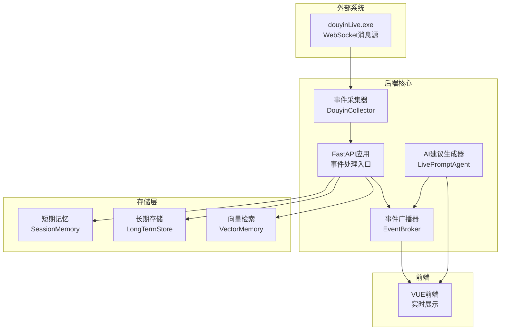
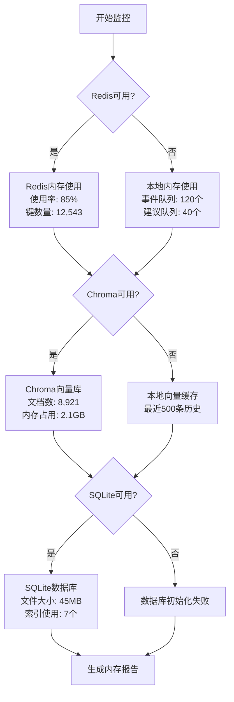
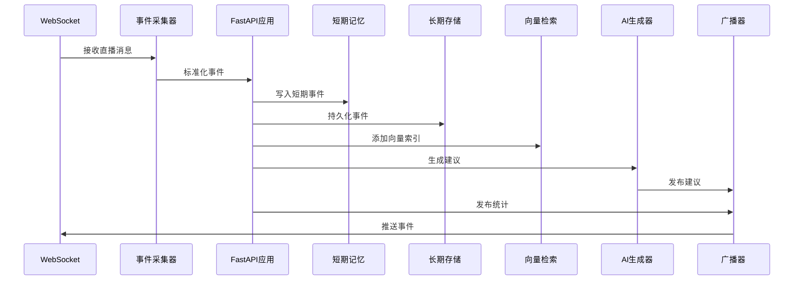
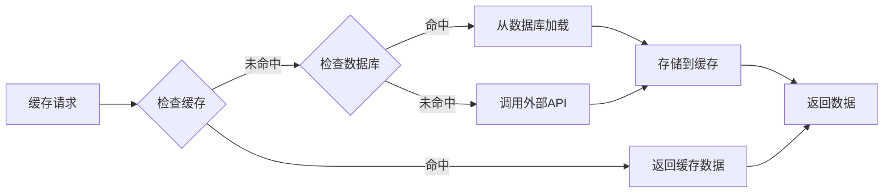
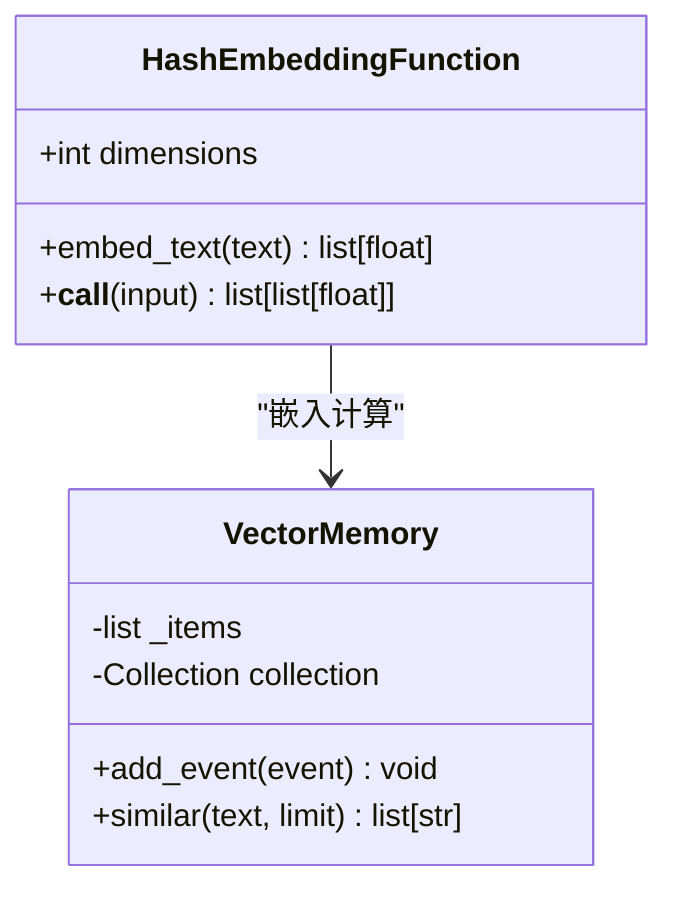

# 性能问题诊断和优化指南

<cite>
**本文档引用的文件**
- [backend/app.py](file://backend/app.py)
- [backend/config.py](file://backend/config.py)
- [backend/memory/session_memory.py](file://backend/memory/session_memory.py)
- [backend/memory/long_term.py](file://backend/memory/long_term.py)
- [backend/memory/vector_store.py](file://backend/memory/vector_store.py)
- [backend/services/agent.py](file://backend/services/agent.py)
- [backend/services/broker.py](file://backend/services/broker.py)
- [backend/services/collector.py](file://backend/services/collector.py)
- [backend/schemas/live.py](file://backend/schemas/live.py)
- [requirements.txt](file://requirements.txt)
- [README.md](file://README.md)
- [USAGE.md](file://USAGE.md)
</cite>

## 目录
1. [简介](#简介)
2. [项目架构概览](#项目架构概览)
3. [内存使用异常排查](#内存使用异常排查)
4. [CPU占用过高诊断](#cpu占用过高诊断)
5. [数据库性能优化](#数据库性能优化)
6. [缓存命中率检查与优化](#缓存命中率检查与优化)
7. [向量检索性能优化](#向量检索性能优化)
8. [性能监控工具与指标解读](#性能监控工具与指标解读)
9. [故障排除指南](#故障排除指南)
10. [总结](#总结)

## 简介

本指南针对抖音直播实时提词系统的性能问题提供全面的诊断和优化方案。该系统采用多层架构设计，包括事件采集、短期记忆、长期存储、向量检索和AI建议生成等组件。本文档重点关注内存使用异常、CPU占用过高、数据库性能和缓存优化等核心性能问题。

## 项目架构概览

系统采用异步事件驱动架构，主要组件包括：



**图表来源**
- [backend/app.py:1-220](file://backend/app.py#L1-L220)
- [backend/services/collector.py:1-284](file://backend/services/collector.py#L1-L284)
- [backend/services/broker.py:1-40](file://backend/services/broker.py#L1-L40)

**章节来源**
- [backend/app.py:1-220](file://backend/app.py#L1-L220)
- [backend/services/collector.py:1-284](file://backend/services/collector.py#L1-L284)
- [backend/services/broker.py:1-40](file://backend/services/broker.py#L1-L40)

## 内存使用异常排查

### 内存监控策略

#### Python进程内存监控

系统提供了完整的内存使用监控机制：



**图表来源**
- [backend/memory/session_memory.py:17-113](file://backend/memory/session_memory.py#L17-L113)
- [backend/memory/vector_store.py:52-108](file://backend/memory/vector_store.py#L52-L108)
- [backend/memory/long_term.py:36-750](file://backend/memory/long_term.py#L36-L750)

#### 内存使用异常检测清单

1. **短期记忆层监控**
   - Redis模式下：检查键空间使用率和过期策略
   - 本地模式下：监控deque队列长度和内存增长趋势

2. **向量检索内存**
   - Chroma模式：监控向量库文档数量和内存占用
   - 本地模式：检查哈希嵌入函数的内存使用

3. **数据库内存**
   - SQLite文件大小增长
   - 索引使用效率和缓存命中率

**章节来源**
- [backend/memory/session_memory.py:17-113](file://backend/memory/session_memory.py#L17-L113)
- [backend/memory/vector_store.py:52-108](file://backend/memory/vector_store.py#L52-L108)
- [backend/memory/long_term.py:36-750](file://backend/memory/long_term.py#L36-L750)

### 内存泄漏排查步骤

1. **短期记忆层检查**
   ```python
   # 检查Redis键空间
   if redis_client:
       info = redis_client.info('memory')
       print(f"内存使用: {info['used_memory_human']}")
       print(f"键总数: {redis_client.dbsize()}")
   ```

2. **向量缓存检查**
   ```python
   # 检查本地向量缓存大小
   if not chromadb:
       print(f"本地向量缓存: {len(self._items)} 条")
   ```

3. **数据库文件监控**
   ```python
   # 监控SQLite文件大小
   import os
   db_size = os.path.getsize('data/live_prompter.db')
   print(f"数据库文件大小: {db_size / (1024*1024):.2f} MB")
   ```

## CPU占用过高诊断

### CPU性能瓶颈分析

#### 事件处理瓶颈识别



**图表来源**
- [backend/services/collector.py:145-284](file://backend/services/collector.py#L145-L284)
- [backend/app.py:61-78](file://backend/app.py#L61-L78)

#### CPU占用热点分析

1. **AI模型推理耗时**
   - 检查LLM调用超时设置
   - 监控网络请求响应时间
   - 分析模型参数对性能的影响

2. **数据库查询优化**
   - 分析索引使用情况
   - 优化复杂查询语句
   - 监控查询执行计划

3. **向量检索性能**
   - 嵌入模型计算开销
   - 相似度计算复杂度
   - 缓存命中率影响

**章节来源**
- [backend/services/agent.py:183-330](file://backend/services/agent.py#L183-L330)
- [backend/memory/long_term.py:467-520](file://backend/memory/long_term.py#L467-L520)
- [backend/memory/vector_store.py:85-108](file://backend/memory/vector_store.py#L85-L108)

### CPU性能诊断工具

1. **Python内置性能分析**
   ```bash
   python -m cProfile -o profile.prof backend/app.py
   gprof2dot -f pstats profile.prof | dot -Tpng -o profile.png
   ```

2. **异步性能监控**
   ```python
   import asyncio
   import time
   
   async def monitor_async_ops():
       start_time = time.time()
       # 异步操作
       await asyncio.sleep(0.1)
       end_time = time.time()
       print(f"异步操作耗时: {end_time - start_time:.4f}s")
   ```

## 数据库性能优化

### SQLite数据库优化策略

#### 索引使用情况分析

系统已建立以下关键索引：

| 索引名称 | 表名 | 列组合 | 查询用途 |
|---------|------|--------|----------|
| idx_events_room_ts | events | room_id, ts DESC | 最近事件查询 |
| idx_events_room_viewer_ts | events | room_id, viewer_id, ts DESC | 用户事件历史 |
| idx_events_room_event_type_ts | events | room_id, event_type, ts DESC | 事件类型过滤 |
| idx_events_session_id | events | session_id | 会话关联查询 |
| idx_viewer_profiles_room_nickname | viewer_profiles | room_id, nickname | 用户画像查询 |
| idx_viewer_gifts_room_viewer_last_sent | viewer_gifts | room_id, viewer_id, last_sent_at DESC | 礼物历史查询 |
| idx_live_sessions_room_status_last_event | live_sessions | room_id, status, last_event_at DESC | 活跃会话查询 |
| idx_viewer_notes_room_viewer_updated | viewer_notes | room_id, viewer_id, updated_at DESC | 备注排序 |

#### 查询执行计划分析

```sql
-- 分析最近事件查询执行计划
EXPLAIN QUERY PLAN 
SELECT event_id, room_id, source_room_id, session_id, platform, event_type, method, livename,
       user_id, short_id, sec_uid, nickname, content, ts, metadata_json, raw_json
FROM events WHERE room_id = ? ORDER BY ts DESC LIMIT ?
```

#### 慢查询日志分析

1. **启用慢查询日志**
   ```sql
   PRAGMA journal_mode=WAL;
   PRAGMA synchronous=NORMAL;
   PRAGMA cache_size=10000;
   ```

2. **监控查询性能**
   ```python
   import sqlite3
   import time
   
   def timed_query(db_path, query, params):
       conn = sqlite3.connect(db_path)
       start_time = time.time()
       result = conn.execute(query, params).fetchall()
       end_time = time.time()
       conn.close()
       print(f"查询耗时: {end_time - start_time:.4f}s")
       return result
   ```

**章节来源**
- [backend/memory/long_term.py:183-195](file://backend/memory/long_term.py#L183-L195)
- [backend/memory/long_term.py:467-520](file://backend/memory/long_term.py#L467-L520)

### 数据库性能优化建议

1. **索引优化策略**
   - 确保高频查询使用适当索引
   - 定期分析索引使用率
   - 考虑复合索引的必要性

2. **查询优化**
   - 使用参数化查询防止SQL注入
   - 限制查询结果集大小
   - 优化JOIN操作顺序

3. **事务管理**
   - 合理使用事务批量操作
   - 避免长时间持有锁
   - 监控死锁情况

## 缓存命中率检查与优化

### Redis缓存使用情况

#### 缓存命中率监控



**图表来源**
- [backend/memory/session_memory.py:42-84](file://backend/memory/session_memory.py#L42-L84)

#### Redis配置调优

1. **内存配置优化**
   - 设置合适的maxmemory策略
   - 配置LRU淘汰机制
   - 监控内存使用趋势

2. **连接池优化**
   - 合理设置连接数
   - 配置超时时间
   - 监控连接池使用率

3. **数据过期策略**
   - 为短期数据设置合理TTL
   - 定期清理过期数据
   - 监控过期键数量

**章节来源**
- [backend/memory/session_memory.py:17-113](file://backend/memory/session_memory.py#L17-L113)
- [backend/config.py:54-55](file://backend/config.py#L54-L55)

### 短期记忆策略调整

1. **队列长度优化**
   - 事件队列：120个元素上限
   - 建议队列：40个元素上限
   - 根据业务需求调整

2. **TTL策略**
   - 默认会话TTL：14400秒（4小时）
   - 根据用户活跃度调整
   - 监控数据老化情况

3. **降级策略**
   - Redis不可用时自动切换到本地内存
   - 本地内存使用deque结构
   - 控制内存增长速度

## 向量检索性能优化

### 嵌入模型选择

#### 哈希嵌入函数优化

系统实现了轻量级哈希嵌入函数作为备选方案：



**图表来源**
- [backend/memory/vector_store.py:19-50](file://backend/memory/vector_store.py#L19-L50)
- [backend/memory/vector_store.py:52-108](file://backend/memory/vector_store.py#L52-L108)

#### 相似度阈值调整

1. **相似度计算优化**
   - 使用余弦相似度计算
   - 调整相似度阈值
   - 优化匹配算法

2. **向量索引优化**
   - Chroma向量库配置
   - 索引类型选择
   - 查询性能调优

3. **缓存策略**
   - 频繁查询结果缓存
   - 相似历史结果缓存
   - 内存使用控制

**章节来源**
- [backend/memory/vector_store.py:19-108](file://backend/memory/vector_store.py#L19-L108)
- [backend/services/agent.py:56-71](file://backend/services/agent.py#L56-L71)

### Chroma数据库优化

1. **向量库配置**
   - 持久化客户端设置
   - 集合创建和管理
   - 内存使用优化

2. **查询性能优化**
   - 向量搜索参数调优
   - 结果数量限制
   - 过滤条件优化

3. **维护策略**
   - 定期清理无效数据
   - 索引重建策略
   - 性能监控指标

## 性能监控工具与指标解读

### 系统监控指标

#### 关键性能指标

| 指标类型 | 指标名称 | 目标值 | 监控方法 |
|---------|---------|--------|----------|
| 内存使用 | Python进程RSS | < 500MB | psutil.process_iter |
| CPU使用 | 系统平均负载 | < 0.7 | os.getloadavg |
| 网络延迟 | LLM请求延迟 | < 2s | urllib.request |
| 数据库 | 查询响应时间 | < 100ms | EXPLAIN QUERY PLAN |
| 缓存 | Redis命中率 | > 0.9 | INFO command |
| 向量 | 搜索响应时间 | < 500ms | 自定义计时 |

#### 性能监控实现

```python
import psutil
import time
import logging

class PerformanceMonitor:
    def __init__(self):
        self.process = psutil.Process()
        self.logger = logging.getLogger(__name__)
    
    def get_system_metrics(self):
        return {
            'cpu_percent': self.process.cpu_percent(),
            'memory_info': self.process.memory_info(),
            'memory_percent': self.process.memory_percent(),
            'open_files': len(self.process.open_files())
        }
    
    def log_metrics(self):
        metrics = self.get_system_metrics()
        self.logger.info(f"性能指标: {metrics}")

# 使用示例
monitor = PerformanceMonitor()
monitor.log_metrics()
```

#### 日志分析工具

1. **结构化日志记录**
   ```python
   import json
   import time
   
   def log_performance_event(event_type, duration, **kwargs):
       log_entry = {
           'timestamp': time.time(),
           'event_type': event_type,
           'duration': duration,
           'metrics': kwargs
       }
       print(json.dumps(log_entry))
   ```

2. **性能基准测试**
   ```python
   import time
   import statistics
   
   def benchmark_operation(operation, iterations=100):
       durations = []
       for _ in range(iterations):
           start = time.time()
           operation()
           end = time.time()
           durations.append(end - start)
       
       return {
           'mean': statistics.mean(durations),
           'median': statistics.median(durations),
           'p95': statistics.quantiles(durations, n=20)[-1],
           'min': min(durations),
           'max': max(durations)
       }
   ```

**章节来源**
- [backend/services/agent.py:44-54](file://backend/services/agent.py#L44-L54)
- [backend/memory/long_term.py:11-12](file://backend/memory/long_term.py#L11-L12)

### 性能指标解读

1. **内存使用指标**
   - RSS内存：物理内存使用量
   - VMS内存：虚拟内存总量
   - 缓存命中率：Redis/LRU缓存效率

2. **CPU性能指标**
   - 用户态CPU：应用逻辑执行时间
   - 系统态CPU：I/O和系统调用时间
   - 上下文切换：异步操作开销

3. **网络性能指标**
   - 请求延迟：LLM API响应时间
   - 连接池利用率：Redis连接复用
   - 重试次数：网络不稳定指标

## 故障排除指南

### 常见性能问题及解决方案

#### 内存泄漏排查

1. **短期记忆泄漏**
   - 检查Redis连接是否正确关闭
   - 验证TTL设置是否生效
   - 监控队列长度增长趋势

2. **向量缓存问题**
   - 检查本地向量缓存清理机制
   - 验证Chroma向量库内存释放
   - 监控嵌入函数内存使用

3. **数据库连接问题**
   - 检查SQLite连接池配置
   - 验证事务正确提交
   - 监控数据库文件增长

#### CPU性能问题

1. **AI模型调用阻塞**
   - 检查超时设置是否合理
   - 验证网络连接稳定性
   - 监控模型响应时间

2. **数据库查询阻塞**
   - 分析慢查询日志
   - 优化索引使用
   - 调整查询参数

3. **事件处理队列积压**
   - 检查异步任务调度
   - 验证事件处理并发度
   - 监控队列长度

#### 缓存性能问题

1. **Redis连接问题**
   - 检查连接池配置
   - 验证网络连通性
   - 监控连接数限制

2. **缓存一致性问题**
   - 验证TTL设置
   - 检查缓存失效策略
   - 监控缓存命中率

3. **降级机制问题**
   - 验证本地内存降级
   - 检查队列容量设置
   - 监控降级触发频率

**章节来源**
- [backend/services/agent.py:222-285](file://backend/services/agent.py#L222-L285)
- [backend/memory/session_memory.py:32-64](file://backend/memory/session_memory.py#L32-L64)
- [backend/memory/long_term.py:420-454](file://backend/memory/long_term.py#L420-L454)

### 诊断工具和命令

1. **系统资源监控**
   ```bash
   # Linux/Mac
   top -p $(pgrep python)
   htop
   
   # Windows
   taskmgr.exe
   perfmon.exe
   ```

2. **网络连接监控**
   ```bash
   # 检查Redis连接
   redis-cli info clients
   
   # 检查数据库连接
   sqlite3 data/live_prompter.db ".tables"
   ```

3. **Python性能分析**
   ```bash
   # 内存使用分析
   python -m memory_profiler backend/app.py
   
   # CPU性能分析
   kernprof -l -v backend/app.py
   ```

## 总结

本指南提供了针对抖音直播实时提词系统的全面性能诊断和优化方案。通过系统性的监控指标、详细的排查步骤和实用的优化建议，可以帮助开发者快速定位和解决性能问题。

### 关键优化要点

1. **内存管理**
   - 合理配置Redis和本地缓存
   - 监控向量检索内存使用
   - 优化数据库文件大小

2. **CPU优化**
   - 调整AI模型超时设置
   - 优化数据库查询性能
   - 监控异步操作效率

3. **存储优化**
   - 建立合适的索引策略
   - 监控查询执行计划
   - 优化缓存命中率

4. **监控体系**
   - 建立完整的性能指标监控
   - 实施持续的性能回归测试
   - 建立预警机制

通过实施这些优化措施，可以显著提升系统的整体性能和稳定性，确保在高并发直播场景下的可靠运行。