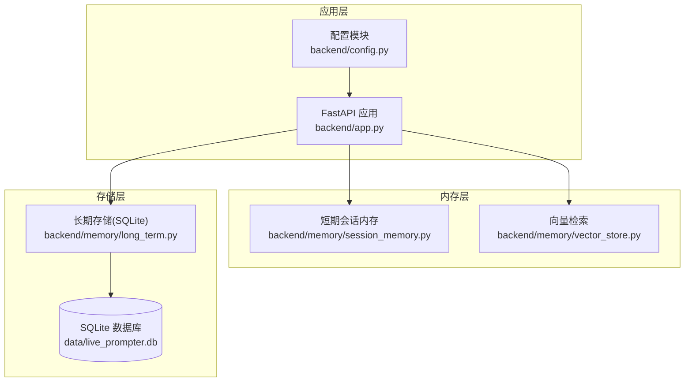
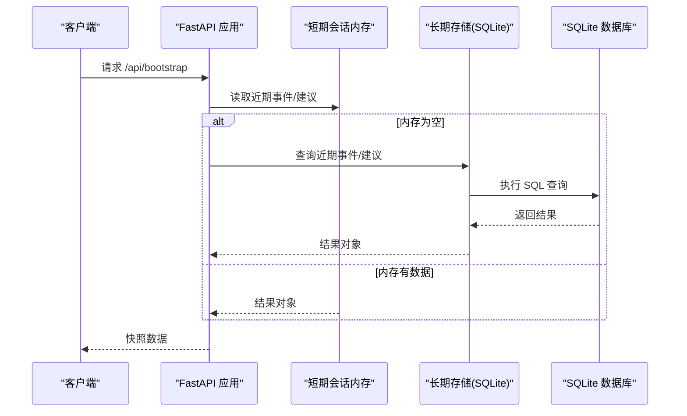
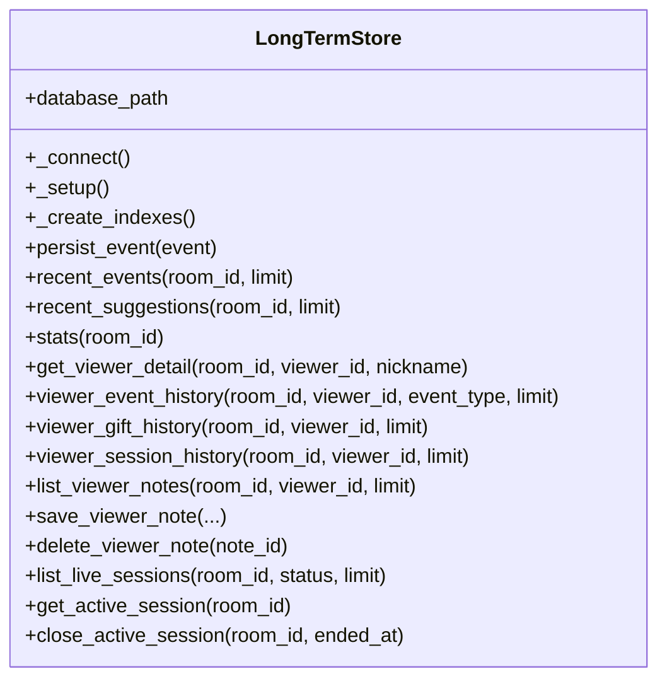
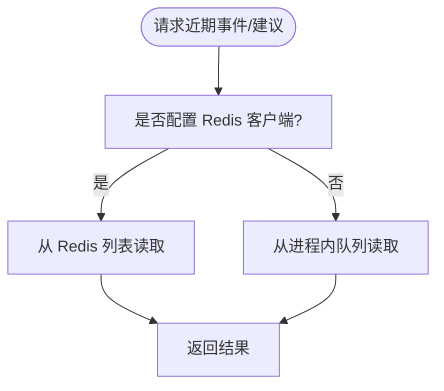
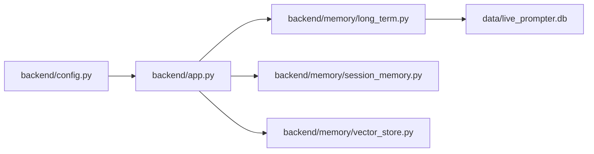

# 数据库性能问题

<cite>
**本文引用的文件**
- [backend/app.py](file://backend/app.py)
- [backend/config.py](file://backend/config.py)
- [backend/memory/long_term.py](file://backend/memory/long_term.py)
- [backend/memory/session_memory.py](file://backend/memory/session_memory.py)
- [backend/memory/vector_store.py](file://backend/memory/vector_store.py)
- [data/DATABASE.md](file://data/DATABASE.md)
</cite>

## 目录
1. [简介](#简介)
2. [项目结构](#项目结构)
3. [核心组件](#核心组件)
4. [架构总览](#架构总览)
5. [详细组件分析](#详细组件分析)
6. [依赖分析](#依赖分析)
7. [性能考量](#性能考量)
8. [故障排查指南](#故障排查指南)
9. [结论](#结论)
10. [附录](#附录)

## 简介
本指南聚焦于 SQLite 长期存储层的性能诊断与优化，结合项目中事件表、建议表、用户画像表（含 viewer_profiles、viewer_gifts、live_sessions、viewer_notes）的实际查询与写入模式，系统阐述索引设计优化、查询执行计划分析、慢查询日志分析、数据库文件大小管理与维护、连接池配置优化以及性能监控工具使用方法。同时给出针对 WHERE 条件、JOIN、LIMIT 的优化策略与最佳实践。

## 项目结构
后端通过 FastAPI 提供 API，业务逻辑由内存层（短期会话）与 SQLite 长期存储层协作完成。数据库路径由配置模块统一管理，长期存储层负责建表、索引、写入与查询。

图表来源
- [backend/app.py:94-220](file://backend/app.py#L94-L220)
- [backend/config.py:52-52](file://backend/config.py#L52-L52)
- [backend/memory/long_term.py:36-44](file://backend/memory/long_term.py#L36-L44)

章节来源
- [backend/app.py:94-220](file://backend/app.py#L94-L220)
- [backend/config.py:52-52](file://backend/config.py#L52-L52)
- [backend/memory/long_term.py:36-44](file://backend/memory/long_term.py#L36-L44)

## 核心组件
- 配置模块：集中管理数据库路径、会话 TTL、模型参数等，确保数据库文件位置与目录存在性。
- 长期存储层：封装 SQLite 连接、建表、索引、写入与查询，提供事件、建议、观众画像、礼物聚合、会话、备注等查询接口。
- 内存层：短期事件与建议缓存，支持 Redis 或进程内队列，降低热点查询对数据库压力。
- 向量检索：用于相似文本检索，避免对 SQLite 的额外负担。

章节来源
- [backend/config.py:63-69](file://backend/config.py#L63-L69)
- [backend/memory/long_term.py:36-44](file://backend/memory/long_term.py#L36-L44)
- [backend/memory/session_memory.py:17-31](file://backend/memory/session_memory.py#L17-L31)
- [backend/memory/vector_store.py:52-63](file://backend/memory/vector_store.py#L52-L63)

## 架构总览
应用启动时，FastAPI 初始化长期存储、短期内存与向量检索实例；API 路由根据业务场景选择内存或数据库查询，必要时回退到数据库以保证一致性。

图表来源
- [backend/app.py:109-112](file://backend/app.py#L109-L112)
- [backend/memory/session_memory.py:66-84](file://backend/memory/session_memory.py#L66-L84)
- [backend/memory/long_term.py:467-502](file://backend/memory/long_term.py#L467-L502)

## 详细组件分析

### 长期存储层（SQLite）
- 连接与建表：初始化时创建事件、建议、观众画像、礼物聚合、会话、备注表，并确保必要列存在。
- 索引策略：为高频查询建立复合索引，覆盖 room_id、viewer_id、event_type、ts、session_id、状态与更新时间等。
- 写入流程：事件写入时自动维护活动会话、更新观众画像与礼物聚合；支持重建聚合以修复历史数据。
- 查询接口：提供近期事件、建议、统计、观众详情、礼物历史、会话列表、备注等查询，均带有 LIMIT 控制。

图表来源
- [backend/memory/long_term.py:36-750](file://backend/memory/long_term.py#L36-L750)

章节来源
- [backend/memory/long_term.py:50-195](file://backend/memory/long_term.py#L50-L195)
- [backend/memory/long_term.py:420-454](file://backend/memory/long_term.py#L420-L454)
- [backend/memory/long_term.py:467-502](file://backend/memory/long_term.py#L467-L502)
- [backend/memory/long_term.py:504-521](file://backend/memory/long_term.py#L504-L521)
- [backend/memory/long_term.py:525-749](file://backend/memory/long_term.py#L525-L749)

### 短期会话内存层（Redis/进程内）
- 事件与建议采用双写策略：优先写入 Redis（若可用），否则写入进程内队列，保证高吞吐与低延迟。
- 读取时优先从内存返回，减少数据库压力；未命中再回源数据库。

图表来源
- [backend/memory/session_memory.py:17-84](file://backend/memory/session_memory.py#L17-L84)

章节来源
- [backend/memory/session_memory.py:17-84](file://backend/memory/session_memory.py#L17-L84)

### 向量检索层
- 若存在 Chroma，则使用持久化向量库；否则使用轻量哈希嵌入函数实现近似相似度检索，避免对 SQLite 的额外 IO 压力。

章节来源
- [backend/memory/vector_store.py:52-108](file://backend/memory/vector_store.py#L52-L108)

## 依赖分析
- 应用层依赖长期存储与短期内存，短期内存可选 Redis；向量检索可选 Chroma。
- 长期存储层直接依赖 SQLite，通过连接池（默认由 sqlite3 提供）访问数据库。
- 数据库文件路径由配置模块统一提供，确保目录存在。

图表来源
- [backend/app.py:25-29](file://backend/app.py#L25-L29)
- [backend/config.py:52-52](file://backend/config.py#L52-L52)
- [backend/memory/long_term.py:36-39](file://backend/memory/long_term.py#L36-L39)

章节来源
- [backend/app.py:25-29](file://backend/app.py#L25-L29)
- [backend/config.py:52-52](file://backend/config.py#L52-L52)
- [backend/memory/long_term.py:36-39](file://backend/memory/long_term.py#L36-L39)

## 性能考量

### 索引设计优化
- 事件表（events）
  - 复合索引 idx_events_room_ts(room_id, ts DESC)：满足按房间倒序取近期事件。
  - 复合索引 idx_events_room_viewer_ts(room_id, viewer_id, ts DESC)：满足按房间+观众倒序取历史。
  - 复合索引 idx_events_room_event_type_ts(room_id, event_type, ts DESC)：满足按类型倒序取近期。
  - 单列索引 idx_events_session_id(session_id)：满足按会话 ID 查询。
- 观众画像表（viewer_profiles）
  - 复合索引 idx_viewer_profiles_room_nickname(room_id, nickname)：满足按昵称模糊匹配。
- 礼物聚合表（viewer_gifts）
  - 复合索引 idx_viewer_gifts_room_viewer_last_sent(room_id, viewer_id, last_sent_at DESC)：满足按房间+观众+最后送礼时间倒序。
- 会话表（live_sessions）
  - 复合索引 idx_live_sessions_room_status_last_event(room_id, status, last_event_at DESC)：满足按房间+状态+最后事件倒序。
- 备注表（viewer_notes）
  - 复合索引 idx_viewer_notes_room_viewer_updated(room_id, viewer_id, updated_at DESC)：满足按房间+观众+更新时间倒序。

优化要点
- WHERE 条件优先使用索引左前列（如 room_id），避免在非索引列上进行过滤。
- ORDER BY 尽量与索引列顺序一致，减少排序成本。
- 对于多列等值过滤，优先使用复合索引，避免多次回表。

章节来源
- [backend/memory/long_term.py:183-195](file://backend/memory/long_term.py#L183-L195)

### 查询执行计划分析
- 使用 EXPLAIN QUERY PLAN 分析 SQL 计划，确认是否命中索引、是否存在全表扫描、是否发生不必要的排序或临时表。
- 建议在开发/测试环境开启计划输出，对比不同 WHERE/ORDER/LIMIT 组合的代价。

### 慢查询日志分析
- 在 SQLite 中可通过 PRAGMA 设置启用慢查询日志（例如设置 long_query_time），捕获超过阈值的查询。
- 结合 EXPLAIN QUERY PLAN 与实际执行时间，定位热点 SQL 并针对性优化。

### WHERE 条件优化
- 优先使用主键或唯一索引列过滤（如 event_id、suggestion_id、note_id）。
- 对组合过滤，确保 WHERE 条件与索引列顺序匹配，避免隐式转换与函数运算导致索引失效。

### JOIN 操作优化
- 项目中涉及的 JOIN 主要是 events 与 live_sessions 的 LEFT JOIN，建议：
  - 确保关联列（session_id）具备索引（已存在 idx_events_session_id）。
  - WHERE 条件尽量前置，减少中间结果集大小。
  - GROUP BY 与 ORDER BY 的列应与索引一致，避免额外排序。

### LIMIT 使用策略
- 对于分页或“取最近 N 条”的查询，务必配合合适的索引与 ORDER BY，避免全表扫描。
- LIMIT 与 OFFSET 不宜过大，建议采用“游标翻页”（基于上次记录的 ts 或主键）策略以提升稳定性。

### 数据库文件大小管理与维护
- VACUUM：定期执行以回收空闲页、整理碎片，建议在低峰时段执行。
- 数据压缩：SQLite 默认不压缩，可通过 WAL 模式与合适的 checkpoint 策略降低写放大。
- 备份策略：建议在执行 VACUUM 前后进行备份，或使用只读快照方式备份。

### 连接池配置优化
- SQLite 默认连接池为单连接，适合单线程或小规模并发；若出现锁竞争，可考虑：
  - 使用 WAL 模式提升并发读性能。
  - 控制并发写入频率，合并短时间内的写入。
  - 通过应用层限流与批处理减少数据库压力。
- 超时设置：在高并发场景下，合理设置连接超时与事务超时，避免长时间阻塞。

### 性能监控工具使用
- EXPLAIN QUERY PLAN：用于查看 SQL 的执行路径，确认索引使用情况。
- ANALYZE：收集统计信息，帮助查询优化器选择更优执行计划。
- 实战建议：在开发环境对热点 SQL 做基准测试，记录不同索引与 LIMIT 下的耗时变化。

## 故障排查指南

### 常见问题与对策
- 查询变慢
  - 检查是否命中索引，必要时调整 WHERE/ORDER/LIMIT。
  - 对大结果集查询增加 LIMIT 或游标翻页。
- 写入阻塞
  - 检查是否存在长事务未提交，适当缩短事务范围。
  - 评估 WAL 模式与 checkpoint 策略。
- 磁盘占用增长
  - 执行 VACUUM 并检查是否有大量历史冗余数据。
  - 清理过期会话与备注，控制表规模。

### 关键查询路径定位
- 近期事件：events 表按 room_id 倒序取最近 N 条。
- 观众详情：viewer_profiles 与 viewer_notes、viewer_gifts、events 的多表查询。
- 会话列表：live_sessions 按 room_id/status/last_event_at 倒序取最近 N 条。

章节来源
- [backend/memory/long_term.py:467-502](file://backend/memory/long_term.py#L467-L502)
- [backend/memory/long_term.py:525-749](file://backend/memory/long_term.py#L525-L749)
- [backend/memory/long_term.py:663-686](file://backend/memory/long_term.py#L663-L686)

## 结论
通过对索引设计、查询计划、慢查询日志、数据库维护与连接池配置的系统化优化，可显著提升 SQLite 在直播场景中的查询与写入性能。建议在生产环境中持续监控热点 SQL，定期执行 ANALYZE 与 VACUUM，并结合 WAL 模式与合理的 LIMIT/游标策略，确保系统在高并发与大数据量下保持稳定高效。

## 附录

### 数据库表与常用查询
- 事件表（events）、建议表（suggestions）、观众画像表（viewer_profiles）、礼物聚合表（viewer_gifts）、会话表（live_sessions）、备注表（viewer_notes）。
- 常用查询示例与字段说明参见数据文档。

章节来源
- [data/DATABASE.md:16-151](file://data/DATABASE.md#L16-L151)