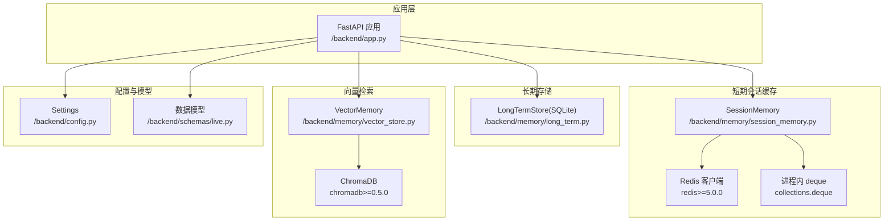
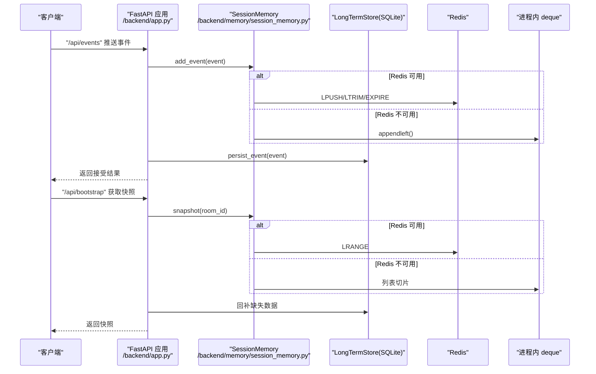
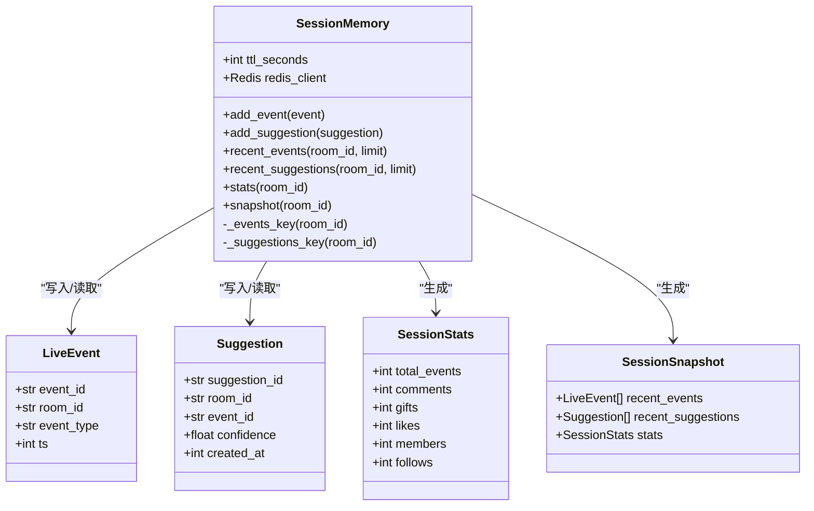
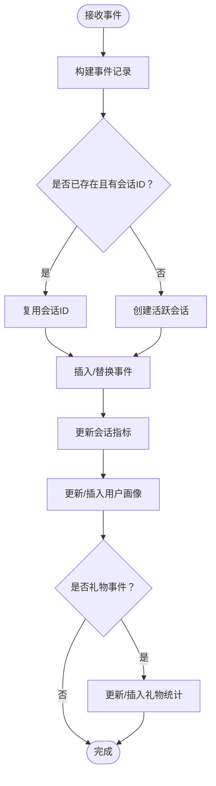
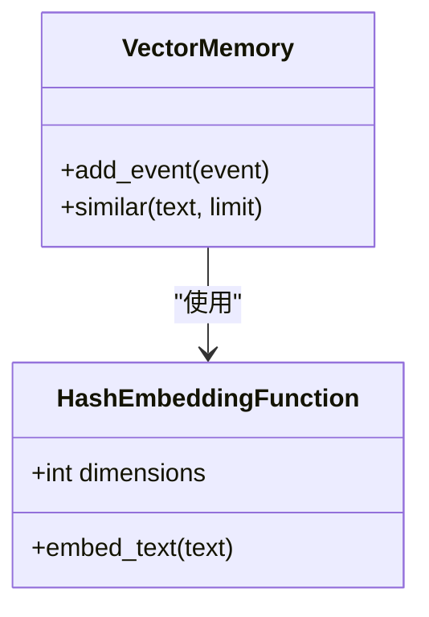
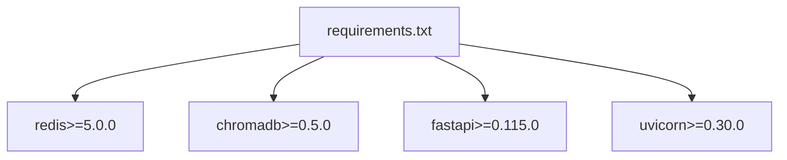

# 缓存性能问题

<cite>
**本文引用的文件**
- [backend/config.py](file://backend/config.py)
- [backend/app.py](file://backend/app.py)
- [backend/memory/session_memory.py](file://backend/memory/session_memory.py)
- [backend/memory/long_term.py](file://backend/memory/long_term.py)
- [backend/memory/vector_store.py](file://backend/memory/vector_store.py)
- [backend/schemas/live.py](file://backend/schemas/live.py)
- [requirements.txt](file://requirements.txt)
</cite>

## 目录
1. [简介](#简介)
2. [项目结构](#项目结构)
3. [核心组件](#核心组件)
4. [架构总览](#架构总览)
5. [详细组件分析](#详细组件分析)
6. [依赖分析](#依赖分析)
7. [性能考量](#性能考量)
8. [故障排查指南](#故障排查指南)
9. [结论](#结论)
10. [附录](#附录)

## 简介
本指南聚焦于项目中的缓存性能问题诊断与优化，围绕以下主题展开：
- Redis 缓存命中率检查与优化：监控、失效策略、TTL 调优
- 短期会话内存的 deque 配置：最大长度限制、内存占用控制、事件清理策略
- 缓存数据结构优化：列表操作优化、键命名策略、过期时间设置
- 缓存退化机制的性能影响：Redis 不可用时的进程内退化策略、数据一致性、性能对比
- 缓存性能监控工具使用：Redis 内存使用、命令响应时间、连接数统计

## 项目结构
该项目采用“三层缓存”设计：
- 短期会话缓存（Redis 或进程内 deque）：用于热数据的快速读写与统计
- 长期存储（SQLite）：用于持久化与历史查询
- 向量检索（Chroma 或本地近似）：用于相似文本检索

图表来源
- [backend/app.py:25-29](file://backend/app.py#L25-L29)
- [backend/memory/session_memory.py:17-31](file://backend/memory/session_memory.py#L17-L31)
- [backend/memory/long_term.py:36-39](file://backend/memory/long_term.py#L36-L39)
- [backend/memory/vector_store.py:52-63](file://backend/memory/vector_store.py#L52-L63)
- [backend/config.py:39-94](file://backend/config.py#L39-L94)
- [backend/schemas/live.py:29-95](file://backend/schemas/live.py#L29-L95)

章节来源
- [backend/app.py:25-29](file://backend/app.py#L25-L29)
- [backend/config.py:54-61](file://backend/config.py#L54-L61)

## 核心组件
- SessionMemory：短期会话缓存，支持 Redis 与进程内 deque 两种模式，负责事件与建议的写入、读取、统计与快照
- LongTermStore：SQLite 长期存储，负责事件与建议的持久化、统计与历史查询
- VectorMemory：向量检索，支持 Chroma 或本地哈希嵌入近似方案
- Settings：集中配置，包含 Redis 地址与会话 TTL 等关键参数

章节来源
- [backend/memory/session_memory.py:17-113](file://backend/memory/session_memory.py#L17-L113)
- [backend/memory/long_term.py:36-750](file://backend/memory/long_term.py#L36-L750)
- [backend/memory/vector_store.py:52-108](file://backend/memory/vector_store.py#L52-L108)
- [backend/config.py:39-94](file://backend/config.py#L39-L94)

## 架构总览
短期会话缓存作为热点数据层，优先使用 Redis；若未安装或未配置，则退化为进程内 deque。应用通过 SessionMemory 统一接口读写短期数据，同时将事件持久化到 SQLite，必要时回补缺失的短期数据。

图表来源
- [backend/app.py:61-78](file://backend/app.py#L61-L78)
- [backend/app.py:49-58](file://backend/app.py#L49-L58)
- [backend/memory/session_memory.py:42-84](file://backend/memory/session_memory.py#L42-L84)
- [backend/memory/long_term.py:420-454](file://backend/memory/long_term.py#L420-L454)

## 详细组件分析

### SessionMemory：短期会话缓存
- Redis 模式
  - 使用列表存储事件与建议，LPUSH + LTRIM 控制长度，EXPIRE 设置 TTL
  - 键命名策略：room:{room_id}:events、room:{room_id}:suggestions
  - 读取使用 LRANGE，按 limit 下标范围获取
- 进程内退化模式
  - 使用 defaultdict(deque(maxlen=120)) 存储事件，deque(maxlen=40) 存储建议
  - 写入使用 appendleft，超出长度自动丢弃尾部
  - 读取使用列表切片 [:limit]
- 统计与快照
  - stats 基于最近 120 条事件进行轻量统计
  - snapshot 将最近事件、建议与统计组合返回

图表来源
- [backend/memory/session_memory.py:17-113](file://backend/memory/session_memory.py#L17-L113)
- [backend/schemas/live.py:29-95](file://backend/schemas/live.py#L29-L95)

章节来源
- [backend/memory/session_memory.py:17-113](file://backend/memory/session_memory.py#L17-L113)
- [backend/schemas/live.py:29-95](file://backend/schemas/live.py#L29-L95)

### 长期存储：SQLite
- 表结构与索引：events、suggestions、viewer_profiles、viewer_gifts、live_sessions、viewer_notes
- 写入流程：根据事件生成记录，确保或创建活跃会话，插入或替换事件，更新会话与画像，必要时重建聚合
- 查询流程：按房间与时间倒序查询最近事件与建议，统计事件总数与各类事件数量

图表来源
- [backend/memory/long_term.py:420-454](file://backend/memory/long_term.py#L420-L454)
- [backend/memory/long_term.py:276-324](file://backend/memory/long_term.py#L276-L324)
- [backend/memory/long_term.py:326-402](file://backend/memory/long_term.py#L326-L402)

章节来源
- [backend/memory/long_term.py:36-750](file://backend/memory/long_term.py#L36-L750)

### 向量检索：VectorMemory
- Chroma 模式：使用 PersistentClient 创建或获取集合，upsert 文档与元数据
- 本地近似模式：HashEmbeddingFunction 将文本映射到固定维度向量，similar 使用词重叠计算相似度

图表来源
- [backend/memory/vector_store.py:52-108](file://backend/memory/vector_store.py#L52-L108)

章节来源
- [backend/memory/vector_store.py:52-108](file://backend/memory/vector_store.py#L52-L108)

## 依赖分析
- Redis 依赖：requirements.txt 明确 redis>=5.0.0，SessionMemory 在可用时启用 Redis 模式
- Chroma 依赖：requirements.txt 明确 chromadb>=0.5.0，VectorMemory 在可用时启用 Chroma 模式
- FastAPI/uvicorn：应用入口与服务启动
- 数据模型：LiveEvent、Suggestion、SessionStats、SessionSnapshot

图表来源
- [requirements.txt:1-6](file://requirements.txt#L1-L6)

章节来源
- [requirements.txt:1-6](file://requirements.txt#L1-L6)

## 性能考量

### Redis 缓存命中率检查与优化
- 命中率监控
  - 使用 Redis INFO 命令查看 keyspace hits/misses，结合业务 QPS 计算命中率
  - 关注 LRANGE/LPUSH/LTRIM/EXPIRE 的耗时分布，定位慢点
- 失效策略
  - 使用 EXPIRE 对短期键设置 TTL，避免无限增长
  - 结合 LTRIM 控制列表长度，减少内存占用
- TTL 配置调优
  - 根据业务峰值与窗口大小调整 SESSION_TTL_SECONDS，平衡内存与实时性
  - 对不同房间的热数据设置差异化 TTL，热点房间更短以回收内存

章节来源
- [backend/memory/session_memory.py:42-64](file://backend/memory/session_memory.py#L42-L64)
- [backend/config.py:54-61](file://backend/config.py#L54-L61)

### 短期会话内存 deque 配置
- 最大长度限制
  - 事件窗口：maxlen=120；建议窗口：maxlen=40
  - 写入使用 appendleft，超出长度自动丢弃尾部，保证 O(1) 写入
- 内存占用控制
  - 进程内 deque 仅保留最近 N 条，避免内存无限增长
  - 读取使用切片 [:limit]，避免拷贝多余数据
- 事件清理策略
  - Redis 模式下由 EXPIRE 自动清理；进程内模式依赖 appendleft 的自动截断

章节来源
- [backend/memory/session_memory.py:26-27](file://backend/memory/session_memory.py#L26-L27)
- [backend/memory/session_memory.py:52-64](file://backend/memory/session_memory.py#L52-L64)

### 缓存数据结构优化
- 列表操作优化
  - LPUSH + LTRIM 替代多次 LRANGE + DEL，减少往返与碎片
  - 使用 EXPIRE 管理生命周期，避免手动清理
- 键命名策略
  - room:{room_id}:events、room:{room_id}:suggestions，清晰隔离房间数据
- 过期时间设置
  - 通过 SESSION_TTL_SECONDS 统一管理短期键过期，避免脏数据滞留

章节来源
- [backend/memory/session_memory.py:32-40](file://backend/memory/session_memory.py#L32-L40)
- [backend/config.py:54-61](file://backend/config.py#L54-L61)

### 缓存退化机制的性能影响
- Redis 不可用时的退化
  - 自动切换至进程内 deque，保持功能可用
  - 读写路径一致，但内存为进程内，容量受限
- 数据一致性
  - Redis 模式：强一致（网络延迟）；进程内模式：最终一致（进程内）
  - 应用层通过回补逻辑（如快照时回补 SQLite 数据）缓解不一致
- 性能对比
  - Redis：低延迟、高吞吐、持久化可选；进程内：零网络开销、内存受限
  - 建议：生产环境优先 Redis，进程内仅作为降级兜底

章节来源
- [backend/memory/session_memory.py:11-14](file://backend/memory/session_memory.py#L11-L14)
- [backend/app.py:49-58](file://backend/app.py#L49-L58)

### 缓存性能监控工具使用
- Redis 内存使用
  - 使用 INFO memory 查看 used_memory、used_memory_rss、maxmemory 等
  - 使用 MEMORY USAGE <key> 查看单键内存占用
- 命令响应时间
  - 使用 MONITOR 观察 LPUSH/LTRIM/LRANGE/EXPIRE 的执行情况
  - 使用 CLIENT LIST 查看连接状态与阻塞情况
- 连接数统计
  - 使用 INFO clients 查看 connected_clients、client_recent_max_input_buffer 等
  - 结合应用侧并发与队列长度，评估连接池配置

章节来源
- [backend/memory/session_memory.py:42-64](file://backend/memory/session_memory.py#L42-L64)

## 故障排查指南

### 常见问题与定位
- Redis 不可用
  - 现象：写入/读取失败或异常
  - 排查：确认 REDIS_URL、网络连通性、认证信息
  - 影响：自动退化为进程内 deque，功能可用但容量受限
- 命中率低
  - 现象：LRANGE 频繁触发，Redis 内存压力大
  - 排查：检查 TTL 是否过长、列表长度是否过大、读取 limit 是否合理
  - 优化：缩短 TTL、降低窗口长度、合并读取批次
- 内存占用过高
  - 现象：Redis 内存接近 maxmemory，触发淘汰
  - 排查：检查键数量、单键长度、TTL 分布
  - 优化：清理冷数据、调整 TTL、拆分房间键空间

章节来源
- [backend/memory/session_memory.py:11-14](file://backend/memory/session_memory.py#L11-L14)
- [backend/config.py:54-61](file://backend/config.py#L54-L61)

### 诊断步骤
- 快速验证
  - 检查 REDIS_URL 是否为空，确认 Redis 可用性
  - 查看 INFO 命令输出，关注 keyspace 命中与内存使用
- 深入分析
  - 使用 MONITOR 观察高频命令，定位热点键与异常模式
  - 使用 MEMORY USAGE 分析单键内存，识别异常增长键
- 修复与回归
  - 调整 SESSION_TTL_SECONDS 与窗口长度，观察命中率与内存变化
  - 回放压测，验证修复效果

章节来源
- [backend/memory/session_memory.py:42-64](file://backend/memory/session_memory.py#L42-L64)

## 结论
- Redis 是短期会话缓存的首选，配合 TTL 与列表截断可有效控制内存与提升命中率
- 进程内 deque 作为降级兜底，适合小规模或开发环境，需关注内存上限
- 通过统一的键命名与 TTL 策略，可显著简化运维与优化工作
- 建议在生产环境持续监控 Redis 命中率、内存与连接数，定期评估并调整 TTL 与窗口长度

## 附录

### 关键配置项
- REDIS_URL：Redis 连接地址
- SESSION_TTL_SECONDS：短期会话键过期时间（秒）

章节来源
- [backend/config.py:54-61](file://backend/config.py#L54-L61)