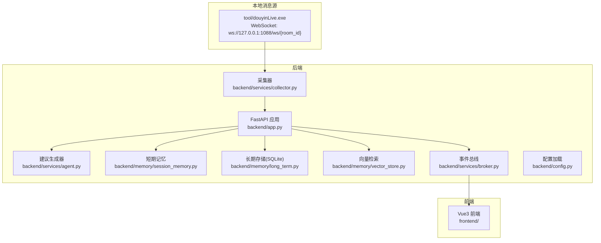
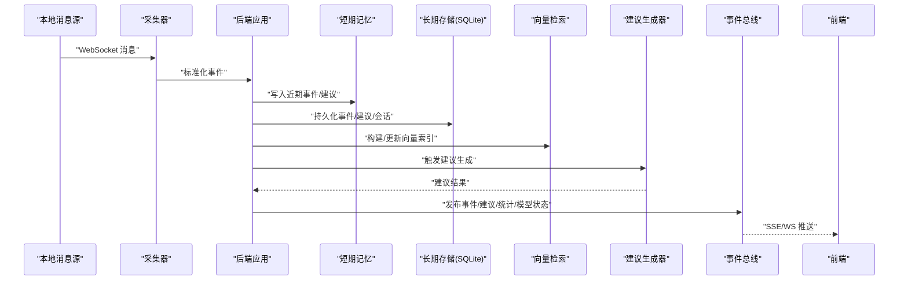
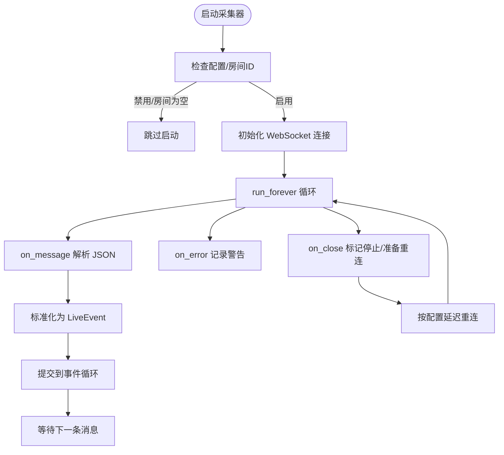
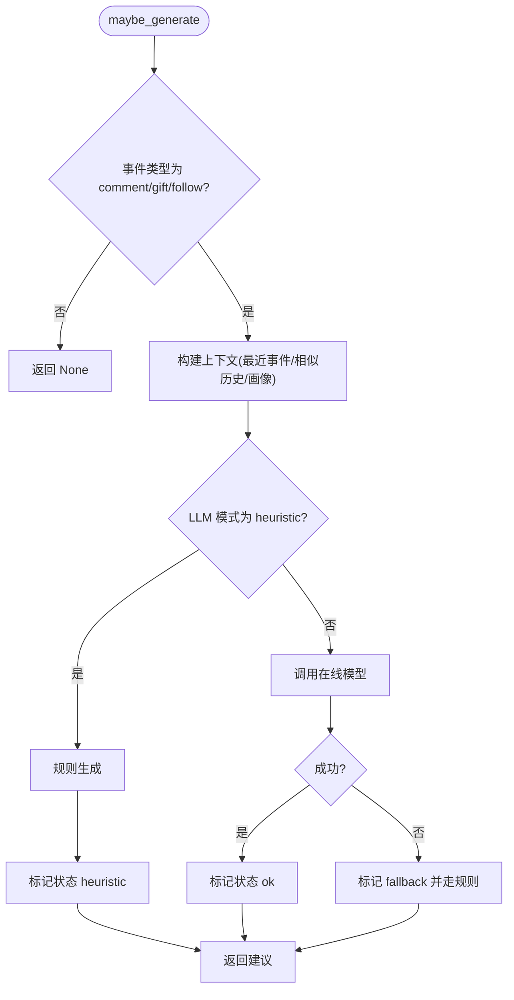
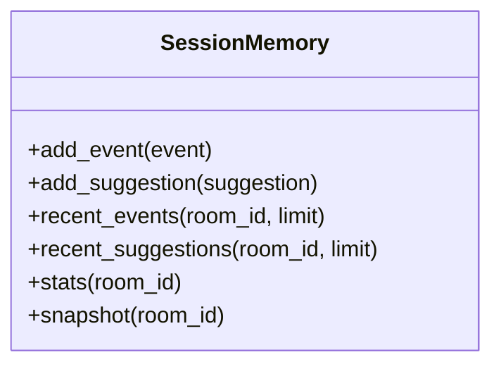
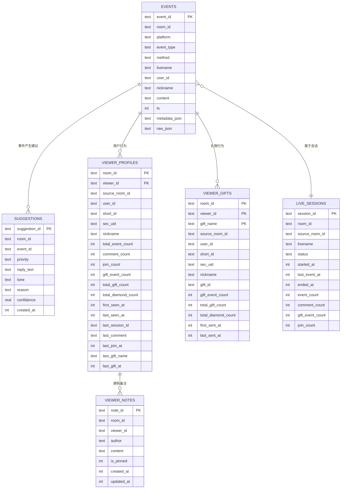
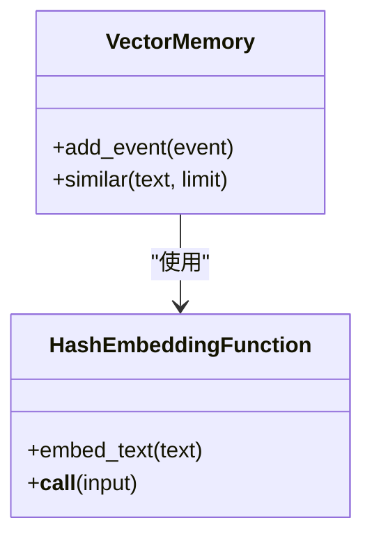
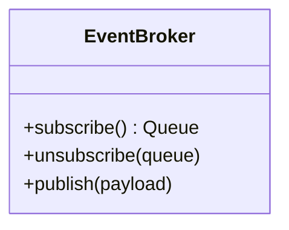
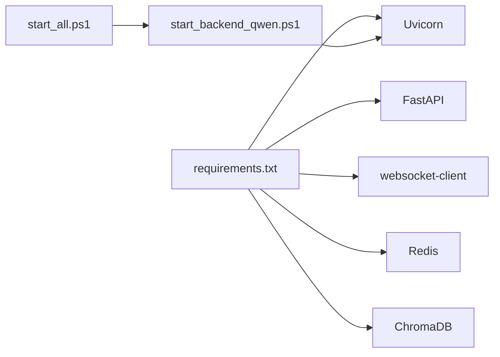

# 故障排除

<cite>
**本文引用的文件**
- [README.md](file://README.md)
- [USAGE.md](file://USAGE.md)
- [requirements.txt](file://requirements.txt)
- [backend/app.py](file://backend/app.py)
- [backend/config.py](file://backend/config.py)
- [backend/services/collector.py](file://backend/services/collector.py)
- [backend/services/agent.py](file://backend/services/agent.py)
- [backend/memory/long_term.py](file://backend/memory/long_term.py)
- [backend/memory/vector_store.py](file://backend/memory/vector_store.py)
- [backend/memory/session_memory.py](file://backend/memory/session_memory.py)
- [backend/services/broker.py](file://backend/services/broker.py)
- [backend/schemas/live.py](file://backend/schemas/live.py)
- [start_all.ps1](file://start_all.ps1)
- [start_backend_qwen.ps1](file://start_backend_qwen.ps1)
- [tool/config.yaml](file://tool/config.yaml)
</cite>

## 目录
1. [简介](#简介)
2. [项目结构](#项目结构)
3. [核心组件](#核心组件)
4. [架构总览](#架构总览)
5. [详细组件分析](#详细组件分析)
6. [依赖分析](#依赖分析)
7. [性能考虑](#性能考虑)
8. [故障排除指南](#故障排除指南)
9. [结论](#结论)
10. [附录](#附录)

## 简介
本指南聚焦于该抖音直播实时提词系统的运行与排障，覆盖启动失败、连接问题、性能问题、日志分析、数据一致性以及紧急预案等常见问题。文档结合后端应用入口、采集器、短期/长期记忆、向量检索、建议生成器与前端接口，提供可操作的诊断步骤与修复建议。

## 项目结构
系统由三部分组成：本地抖音消息源工具、后端（FastAPI）与前端。后端负责事件采集、短期记忆、长期存储、向量检索、建议生成与实时推送；前端通过 SSE/WS 实时展示事件、建议与模型状态。

图表来源
- [backend/app.py:1-220](file://backend/app.py#L1-L220)
- [backend/services/collector.py:1-284](file://backend/services/collector.py#L1-L284)
- [backend/services/agent.py:1-393](file://backend/services/agent.py#L1-L393)
- [backend/memory/session_memory.py:1-113](file://backend/memory/session_memory.py#L1-L113)
- [backend/memory/long_term.py:1-750](file://backend/memory/long_term.py#L1-L750)
- [backend/memory/vector_store.py:1-108](file://backend/memory/vector_store.py#L1-L108)
- [backend/services/broker.py:1-40](file://backend/services/broker.py#L1-L40)
- [backend/config.py:1-94](file://backend/config.py#L1-L94)

章节来源
- [README.md:21-349](file://README.md#L21-L349)
- [USAGE.md:1-256](file://USAGE.md#L1-L256)

## 核心组件
- 配置与入口
  - 配置加载与解析：读取 .env 与环境变量，确保目录存在，解析 LLM 地址/模型，提供健康检查接口。
  - 应用入口：注册 CORS、健康检查、SSE/WS 推送、房间切换、事件注入、Viewer 相关 API。
- 采集与事件处理
  - 采集器：连接本地 WebSocket，解析消息为统一事件，提交到事件循环并交由处理流程。
  - 事件处理：写入短期/长期记忆、向量索引，生成建议，发布统计与模型状态。
- 记忆与检索
  - 短期记忆：Redis 或进程内队列，支持 TTL 控制。
  - 长期存储：SQLite 表结构完备，含索引与增量迁移，支持会话聚合、用户画像与备注。
  - 向量检索：优先 Chroma；不可用时回退为轻量哈希嵌入与近似相似度。
- 建议生成器
  - 在线模型优先（OpenAI 兼容），失败自动回退规则；记录模型状态供前端展示。
- 事件总线
  - SSE/WS 订阅分发，支持过滤房间、心跳与断线清理。

章节来源
- [backend/config.py:1-94](file://backend/config.py#L1-L94)
- [backend/app.py:1-220](file://backend/app.py#L1-L220)
- [backend/services/collector.py:1-284](file://backend/services/collector.py#L1-L284)
- [backend/memory/session_memory.py:1-113](file://backend/memory/session_memory.py#L1-L113)
- [backend/memory/long_term.py:1-750](file://backend/memory/long_term.py#L1-L750)
- [backend/memory/vector_store.py:1-108](file://backend/memory/vector_store.py#L1-L108)
- [backend/services/agent.py:1-393](file://backend/services/agent.py#L1-L393)
- [backend/services/broker.py:1-40](file://backend/services/broker.py#L1-L40)
- [backend/schemas/live.py:1-95](file://backend/schemas/live.py#L1-L95)

## 架构总览
系统采用“采集-处理-存储-检索-建议-推送”的流水线，后端通过事件总线将事件、建议、统计与模型状态实时推送到前端。

图表来源
- [backend/services/collector.py:117-139](file://backend/services/collector.py#L117-L139)
- [backend/app.py:61-78](file://backend/app.py#L61-L78)
- [backend/memory/session_memory.py:42-64](file://backend/memory/session_memory.py#L42-L64)
- [backend/memory/long_term.py:420-454](file://backend/memory/long_term.py#L420-L454)
- [backend/memory/vector_store.py:64-83](file://backend/memory/vector_store.py#L64-L83)
- [backend/services/agent.py:73-114](file://backend/services/agent.py#L73-L114)
- [backend/services/broker.py:28-39](file://backend/services/broker.py#L28-L39)
- [backend/app.py:187-220](file://backend/app.py#L187-L220)

## 详细组件分析

### 组件A：采集器（DouyinCollector）
- 关键职责：连接本地 WebSocket，解析消息为 LiveEvent，提交到事件循环。
- 重连与心跳：异常关闭自动重连，周期性发送 ping，避免被中间件断开。
- 错误处理：忽略非 JSON、解析失败、提交失败等，不影响整体流程。
- 房间切换：支持动态切换房间并重建连接。

图表来源
- [backend/services/collector.py:61-98](file://backend/services/collector.py#L61-L98)
- [backend/services/collector.py:117-139](file://backend/services/collector.py#L117-L139)
- [backend/services/collector.py:145-160](file://backend/services/collector.py#L145-L160)
- [backend/services/collector.py:225-284](file://backend/services/collector.py#L225-L284)

章节来源
- [backend/services/collector.py:1-284](file://backend/services/collector.py#L1-L284)

### 组件B：建议生成器（LivePromptAgent）
- 生成策略：优先在线模型（OpenAI 兼容），失败回退规则；记录模型状态。
- 状态管理：包含模式、模型名、后端地址、上次结果、错误信息与更新时间。
- 上下文构建：最近事件、相似历史、用户画像；向量检索命中相似历史。
- 错误分类：HTTP/网络/超时/JSON 解析/OS 错误/异常，统一标记并回退。

图表来源
- [backend/services/agent.py:73-114](file://backend/services/agent.py#L73-L114)
- [backend/services/agent.py:183-330](file://backend/services/agent.py#L183-L330)
- [backend/services/agent.py:39-54](file://backend/services/agent.py#L39-L54)

章节来源
- [backend/services/agent.py:1-393](file://backend/services/agent.py#L1-L393)

### 组件C：短期记忆（SessionMemory）
- 优先使用 Redis；未安装或未配置时退化为进程内队列。
- TTL 控制热数据生命周期；支持事件与建议的 LRU 截断。
- 读写接口：lpush/ltrim/range，或 deque 访问。

图表来源
- [backend/memory/session_memory.py:17-113](file://backend/memory/session_memory.py#L17-L113)

章节来源
- [backend/memory/session_memory.py:1-113](file://backend/memory/session_memory.py#L1-L113)

### 组件D：长期存储（LongTermStore）
- SQLite 表结构：events、suggestions、viewer_profiles、viewer_gifts、live_sessions、viewer_notes。
- 索引：多处复合索引，加速查询；迁移时自动补齐列。
- 会话管理：活动会话创建/触达/结束；用户画像与礼物聚合。
- 查询接口：最近事件/建议、统计、快照、Viewer 明细与备注。

图表来源
- [backend/memory/long_term.py:50-155](file://backend/memory/long_term.py#L50-L155)
- [backend/memory/long_term.py:420-454](file://backend/memory/long_term.py#L420-L454)
- [backend/memory/long_term.py:688-717](file://backend/memory/long_term.py#L688-L717)

章节来源
- [backend/memory/long_term.py:1-750](file://backend/memory/long_term.py#L1-L750)

### 组件E：向量检索（VectorMemory）
- 优先使用 Chroma；不可用时使用哈希嵌入函数与近似相似度，保证检索能力。
- 文档格式：用户昵称 + 内容；元数据包含房间与事件类型。

图表来源
- [backend/memory/vector_store.py:52-108](file://backend/memory/vector_store.py#L52-L108)
- [backend/memory/vector_store.py:19-49](file://backend/memory/vector_store.py#L19-L49)

章节来源
- [backend/memory/vector_store.py:1-108](file://backend/memory/vector_store.py#L1-L108)

### 组件F：事件总线（EventBroker）
- 维护订阅队列集合；发布时尝试投递，清理阻塞队列；支持断线清理。

图表来源
- [backend/services/broker.py:10-40](file://backend/services/broker.py#L10-L40)

章节来源
- [backend/services/broker.py:1-40](file://backend/services/broker.py#L1-L40)

## 依赖分析
- 后端依赖：FastAPI、Uvicorn、websocket-client、Redis、ChromaDB。
- 启动脚本：PowerShell 脚本负责检查 .env、启动后端与前端。

图表来源
- [requirements.txt:1-6](file://requirements.txt#L1-L6)
- [start_backend_qwen.ps1:12](file://start_backend_qwen.ps1#L12)
- [start_all.ps1:11-15](file://start_all.ps1#L11-L15)

章节来源
- [requirements.txt:1-6](file://requirements.txt#L1-L6)
- [start_backend_qwen.ps1:1-13](file://start_backend_qwen.ps1#L1-L13)
- [start_all.ps1:1-18](file://start_all.ps1#L1-L18)

## 性能考虑
- 短期记忆：Redis 可提升并发读写与跨进程共享；未安装时退化为进程内队列，注意单进程瓶颈。
- 长期存储：SQLite 在小规模场景足够；建议保持索引有效，避免全表扫描。
- 向量检索：Chroma 提升召回质量；不可用时的哈希嵌入为近似方案，性能更优但召回下降。
- 建议生成：在线模型调用耗时与稳定性直接影响前端体验，建议合理设置超时与回退策略。
- SSE/WS：订阅队列满载会清理滞留队列，注意前端重连与过滤房间参数。

章节来源
- [backend/memory/session_memory.py:17-113](file://backend/memory/session_memory.py#L17-L113)
- [backend/memory/long_term.py:183-195](file://backend/memory/long_term.py#L183-L195)
- [backend/memory/vector_store.py:52-108](file://backend/memory/vector_store.py#L52-L108)
- [backend/services/agent.py:183-330](file://backend/services/agent.py#L183-L330)
- [backend/services/broker.py:28-39](file://backend/services/broker.py#L28-L39)

## 故障排除指南

### 启动失败
- 依赖缺失
  - 症状：后端/前端无法启动、导入报错。
  - 排查：确认 Python 依赖安装完整；Redis/Chroma 可选但缺失不影响基本流程。
  - 参考
    - [requirements.txt:1-6](file://requirements.txt#L1-L6)
- 端口冲突
  - 症状：后端/前端端口被占用，启动失败或页面无法访问。
  - 排查：核对默认端口，释放占用或修改配置；前端默认 5173，后端默认 8010。
  - 参考
    - [README.md:130-140](file://README.md#L130-L140)
    - [USAGE.md:118-122](file://USAGE.md#L118-L122)
- 权限问题
  - 症状：无法写入 data 目录或访问 SQLite。
  - 排查：确保运行账户对 data 目录具有读写权限；首次运行会自动创建目录。
  - 参考
    - [backend/config.py:63-69](file://backend/config.py#L63-L69)
- 配置错误
  - 症状：健康检查失败、采集器未连接、模型状态异常。
  - 排查：检查 .env 是否存在且包含必要字段（如 ROOM_ID、LLM_MODE、API Key）；确认 APP_HOST/PORT、COLLECTOR_* 配置。
  - 参考
    - [README.md:82-98](file://README.md#L82-L98)
    - [backend/config.py:40-61](file://backend/config.py#L40-L61)
    - [start_all.ps1:6-9](file://start_all.ps1#L6-L9)

章节来源
- [requirements.txt:1-6](file://requirements.txt#L1-L6)
- [README.md:130-140](file://README.md#L130-L140)
- [USAGE.md:118-122](file://USAGE.md#L118-L122)
- [backend/config.py:63-69](file://backend/config.py#L63-L69)
- [backend/config.py:40-61](file://backend/config.py#L40-L61)
- [start_all.ps1:6-9](file://start_all.ps1#L6-L9)

### 连接问题
- 网络连通性检查
  - 后端与本地消息源：确认 ws://127.0.0.1:1088/ws/{room_id} 可达；检查防火墙与代理。
  - 参考
    - [README.md:76-80](file://README.md#L76-L80)
    - [backend/services/collector.py:54-59](file://backend/services/collector.py#L54-L59)
- WebSocket 连接状态
  - 症状：采集器反复重连、日志出现连接关闭/错误。
  - 排查：检查房间 ID、消息源是否运行、网络波动；采集器具备自动重连与心跳。
  - 参考
    - [backend/services/collector.py:117-139](file://backend/services/collector.py#L117-L139)
    - [backend/services/collector.py:167-181](file://backend/services/collector.py#L167-L181)
- API 接口可用性
  - 健康检查：GET /health；房间切换：POST /api/room；手动注入事件：POST /api/events。
  - 参考
    - [README.md:210-217](file://README.md#L210-L217)
    - [README.md:231-244](file://README.md#L231-L244)
    - [README.md:246-254](file://README.md#L246-L254)
- 数据库连接测试
  - SQLite 默认路径 data/live_prompter.db；确认文件存在且可写。
  - 参考
    - [README.md:195-201](file://README.md#L195-L201)
    - [backend/memory/long_term.py:37-39](file://backend/memory/long_term.py#L37-L39)

章节来源
- [README.md:76-80](file://README.md#L76-L80)
- [backend/services/collector.py:54-59](file://backend/services/collector.py#L54-L59)
- [backend/services/collector.py:117-139](file://backend/services/collector.py#L117-L139)
- [README.md:210-217](file://README.md#L210-L217)
- [README.md:231-244](file://README.md#L231-L244)
- [README.md:246-254](file://README.md#L246-L254)
- [README.md:195-201](file://README.md#L195-L201)
- [backend/memory/long_term.py:37-39](file://backend/memory/long_term.py#L37-L39)

### 性能问题
- 内存使用分析
  - 短期记忆：Redis 模式下内存占用与队列长度相关；未安装时进程内队列增长可能导致内存上升。
  - 参考
    - [backend/memory/session_memory.py:24-31](file://backend/memory/session_memory.py#L24-L31)
- CPU 占用监控
  - 建议生成：在线模型调用耗时与并发；适当降低并发或启用 Redis 缓存。
  - 参考
    - [backend/services/agent.py:183-330](file://backend/services/agent.py#L183-L330)
- 数据库查询优化
  - 确保索引有效；避免大范围扫描；必要时调整查询 limit。
  - 参考
    - [backend/memory/long_term.py:183-195](file://backend/memory/long_term.py#L183-L195)
- 缓存命中率检查
  - Redis：检查队列长度与 TTL 生效；未安装时退化为进程内缓存。
  - 参考
    - [backend/memory/session_memory.py:69-84](file://backend/memory/session_memory.py#L69-L84)

章节来源
- [backend/memory/session_memory.py:24-31](file://backend/memory/session_memory.py#L24-L31)
- [backend/services/agent.py:183-330](file://backend/services/agent.py#L183-L330)
- [backend/memory/long_term.py:183-195](file://backend/memory/long_term.py#L183-L195)
- [backend/memory/session_memory.py:69-84](file://backend/memory/session_memory.py#L69-L84)

### 日志分析
- 日志级别设置
  - 后端默认 INFO 级别；可通过修改日志配置提升/降低详细程度。
  - 参考
    - [backend/app.py:23](file://backend/app.py#L23)
- 关键信息定位
  - 采集器：连接、错误、关闭、重连、心跳失败等日志。
  - 建议生成器：模型状态、错误类型、回退提示。
  - 参考
    - [backend/services/collector.py:140-181](file://backend/services/collector.py#L140-L181)
    - [backend/services/agent.py:222-285](file://backend/services/agent.py#L222-L285)
- 错误堆栈分析
  - 建议生成器对 HTTP/网络/超时/JSON/OS 异常进行分类记录，便于快速定位。
  - 参考
    - [backend/services/agent.py:222-285](file://backend/services/agent.py#L222-L285)
- 时间序列分析
  - 使用 /api/sessions 与 /api/sessions/current 查看会话统计与活跃状态。
  - 参考
    - [README.md:174-185](file://README.md#L174-L185)

章节来源
- [backend/app.py:23](file://backend/app.py#L23)
- [backend/services/collector.py:140-181](file://backend/services/collector.py#L140-L181)
- [backend/services/agent.py:222-285](file://backend/services/agent.py#L222-L285)
- [README.md:174-185](file://README.md#L174-L185)

### 数据一致性
- 数据丢失
  - 症状：事件/建议未落库。
  - 排查：确认采集器已连接、后端日志无异常、SQLite 文件可写；检查 /health 与 /api/bootstrap。
  - 参考
    - [backend/app.py:104-112](file://backend/app.py#L104-L112)
    - [backend/memory/long_term.py:420-454](file://backend/memory/long_term.py#L420-L454)
- 重复数据
  - 症状：事件重复入库。
  - 排查：事件 ID 唯一键约束；检查去重逻辑与会话 ID 设置。
  - 参考
    - [backend/memory/long_term.py:423-428](file://backend/memory/long_term.py#L423-L428)
- 版本冲突/迁移失败
  - 症状：列缺失、索引缺失导致查询异常。
  - 排查：自动迁移会补齐列并创建索引；若失败，检查数据库权限与磁盘空间。
  - 参考
    - [backend/memory/long_term.py:155-154](file://backend/memory/long_term.py#L155-L154)
- 迁移失败
  - 建议：备份原库，删除后让自动迁移重建；或手动执行必要的 ALTER/CREATE。
  - 参考
    - [backend/memory/long_term.py:155-154](file://backend/memory/long_term.py#L155-L154)

章节来源
- [backend/app.py:104-112](file://backend/app.py#L104-L112)
- [backend/memory/long_term.py:420-454](file://backend/memory/long_term.py#L420-L454)
- [backend/memory/long_term.py:155-154](file://backend/memory/long_term.py#L155-L154)

### 紧急情况处理预案
- 服务中断恢复
  - 后端：检查 .env、端口、依赖；重启 uvicorn；确认健康检查。
  - 前端：检查端口占用与依赖安装；重启开发服务器。
  - 参考
    - [start_backend_qwen.ps1:6-12](file://start_backend_qwen.ps1#L6-L12)
    - [USAGE.md:104-114](file://USAGE.md#L104-L114)
- 数据备份恢复
  - 备份 data/live_prompter.db 与 data/chroma；恢复后验证表结构与索引。
  - 参考
    - [README.md:195-201](file://README.md#L195-L201)
- 系统降级策略
  - 关闭 Redis/Chroma：短期记忆退化为进程内队列，向量检索退化为近似方案；建议生成器自动回退规则。
  - 参考
    - [backend/memory/session_memory.py:29-31](file://backend/memory/session_memory.py#L29-L31)
    - [backend/memory/vector_store.py:60-63](file://backend/memory/vector_store.py#L60-L63)
    - [backend/services/agent.py:99-113](file://backend/services/agent.py#L99-L113)

章节来源
- [start_backend_qwen.ps1:6-12](file://start_backend_qwen.ps1#L6-L12)
- [USAGE.md:104-114](file://USAGE.md#L104-L114)
- [README.md:195-201](file://README.md#L195-L201)
- [backend/memory/session_memory.py:29-31](file://backend/memory/session_memory.py#L29-L31)
- [backend/memory/vector_store.py:60-63](file://backend/memory/vector_store.py#L60-L63)
- [backend/services/agent.py:99-113](file://backend/services/agent.py#L99-L113)

## 结论
本指南围绕启动、连接、性能、日志、数据一致性与紧急预案提供了系统化的排障路径。建议在生产环境中优先保障 Redis/Chroma 的可用性与合理的超时配置，同时定期备份 SQLite 与向量库，以便快速恢复与降级运行。

## 附录
- 快速检查清单
  - .env 是否存在且包含 ROOM_ID、LLM_MODE、API Key
  - 本地消息源是否运行，WebSocket 地址是否可达
  - 后端端口 8010 与前端端口 5173 是否被占用
  - Redis/Chroma 是否安装；若未安装，短期记忆/向量检索会退化
  - 健康检查 /health 是否返回正常
  - SSE/WS 是否能收到事件流与模型状态
- 参考文件
  - [README.md:66-140](file://README.md#L66-L140)
  - [USAGE.md:198-256](file://USAGE.md#L198-L256)
  - [tool/config.yaml](file://tool/config.yaml)