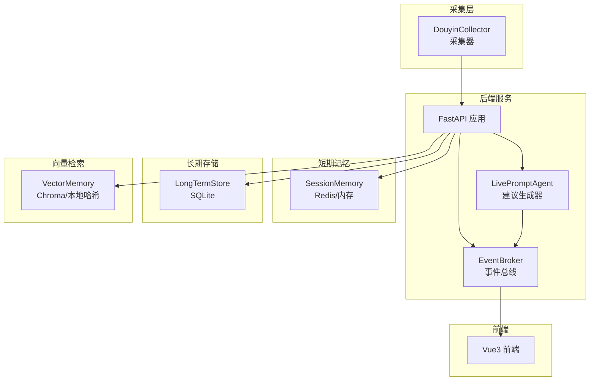
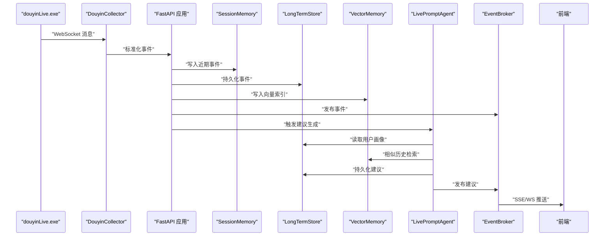
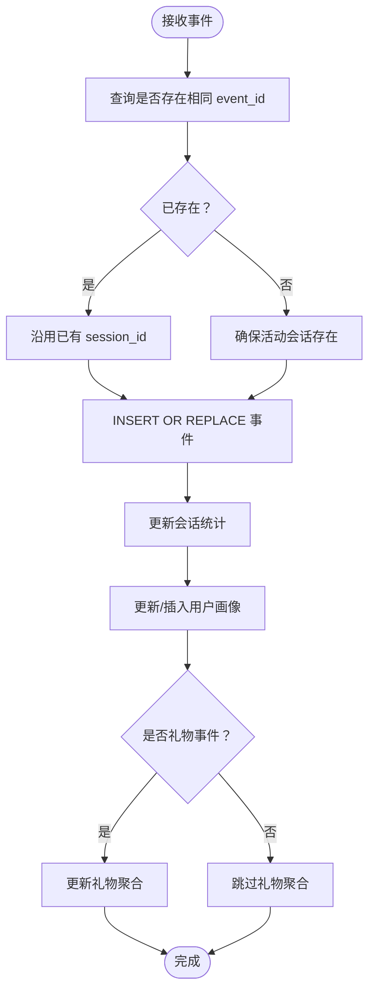
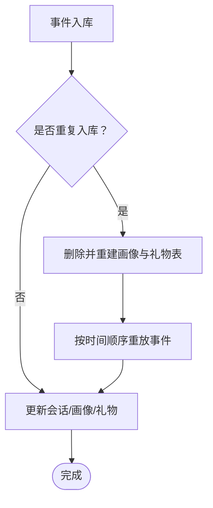
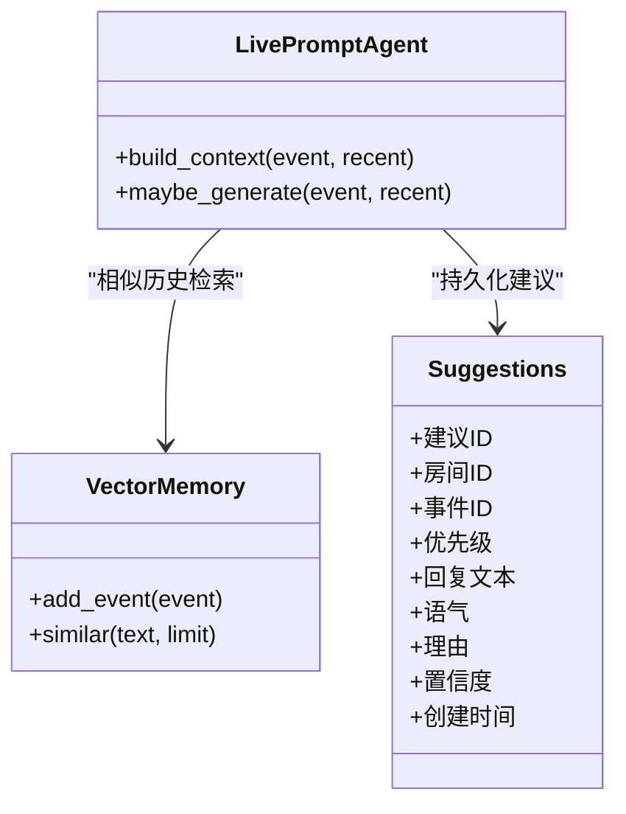
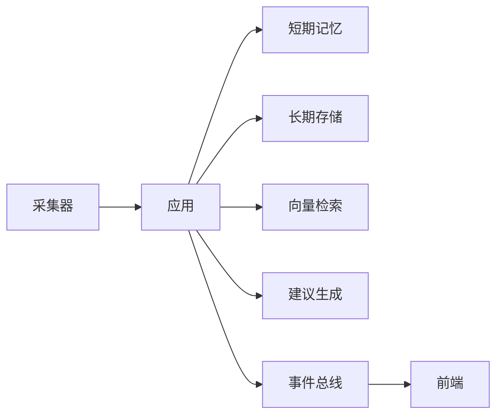

# 数据一致性问题

<cite>
**本文引用的文件**
- [backend/app.py](file://backend/app.py)
- [backend/config.py](file://backend/config.py)
- [backend/memory/long_term.py](file://backend/memory/long_term.py)
- [backend/memory/session_memory.py](file://backend/memory/session_memory.py)
- [backend/memory/vector_store.py](file://backend/memory/vector_store.py)
- [backend/services/collector.py](file://backend/services/collector.py)
- [backend/services/agent.py](file://backend/services/agent.py)
- [backend/services/broker.py](file://backend/services/broker.py)
- [backend/schemas/live.py](file://backend/schemas/live.py)
- [data/DATABASE.md](file://data/DATABASE.md)
- [README.md](file://README.md)
- [requirements.txt](file://requirements.txt)
- [tool/config.yaml](file://tool/config.yaml)
</cite>

## 目录
1. [简介](#简介)
2. [项目结构](#项目结构)
3. [核心组件](#核心组件)
4. [架构总览](#架构总览)
5. [详细组件分析](#详细组件分析)
6. [依赖分析](#依赖分析)
7. [性能考虑](#性能考虑)
8. [故障排查指南](#故障排查指南)
9. [结论](#结论)
10. [附录](#附录)

## 简介
本指南聚焦于该直播提词系统的数据一致性问题处理，覆盖以下方面：
- 数据丢失排查与恢复：事件数据、建议数据、用户画像数据的检测与恢复步骤
- 重复数据处理：事件ID冲突、重复建议生成、数据去重策略
- 版本冲突解决：数据库Schema升级、向量索引重建、配置文件版本管理
- 数据迁移失败处理：备份恢复、增量迁移、数据校验方法
- 数据完整性检查：一致性验证、索引完整性检查、外键约束验证
- 备份与恢复最佳实践：定期备份策略、灾难恢复流程、迁移验证

## 项目结构
系统采用“采集-短期记忆-长期存储-向量检索-建议生成-前端推送”的链路，核心数据落盘于SQLite与可选的Redis、Chroma。

图表来源
- [backend/app.py:61-78](file://backend/app.py#L61-L78)
- [backend/services/collector.py:117-139](file://backend/services/collector.py#L117-L139)
- [backend/services/broker.py:10-40](file://backend/services/broker.py#L10-L40)
- [backend/memory/session_memory.py:17-113](file://backend/memory/session_memory.py#L17-L113)
- [backend/memory/long_term.py:36-750](file://backend/memory/long_term.py#L36-L750)
- [backend/memory/vector_store.py:52-108](file://backend/memory/vector_store.py#L52-L108)
- [backend/services/agent.py:23-393](file://backend/services/agent.py#L23-L393)

章节来源
- [README.md:35-48](file://README.md#L35-L48)
- [backend/app.py:25-29](file://backend/app.py#L25-L29)

## 核心组件
- 采集器：从本地Douyin消息源WebSocket接收事件，标准化为统一事件模型并提交到后端事件循环
- 事件总线：将事件、建议、统计、模型状态广播至SSE/WS订阅端
- 短期记忆：Redis或进程内内存缓存最近事件与建议，支持TTL
- 长期存储：SQLite持久化事件、建议、用户画像、礼物聚合、直播会话、观众备注
- 向量检索：Chroma或本地哈希嵌入，支持相似历史检索
- 建议生成：优先在线模型，失败回退本地启发式规则

章节来源
- [backend/services/collector.py:38-284](file://backend/services/collector.py#L38-L284)
- [backend/services/broker.py:10-40](file://backend/services/broker.py#L10-L40)
- [backend/memory/session_memory.py:17-113](file://backend/memory/session_memory.py#L17-L113)
- [backend/memory/long_term.py:36-750](file://backend/memory/long_term.py#L36-L750)
- [backend/memory/vector_store.py:52-108](file://backend/memory/vector_store.py#L52-L108)
- [backend/services/agent.py:23-393](file://backend/services/agent.py#L23-L393)
- [backend/schemas/live.py:29-95](file://backend/schemas/live.py#L29-L95)

## 架构总览

图表来源
- [backend/services/collector.py:145-159](file://backend/services/collector.py#L145-L159)
- [backend/app.py:61-78](file://backend/app.py#L61-L78)
- [backend/memory/session_memory.py:42-53](file://backend/memory/session_memory.py#L42-L53)
- [backend/memory/long_term.py:420-454](file://backend/memory/long_term.py#L420-L454)
- [backend/memory/vector_store.py:64-83](file://backend/memory/vector_store.py#L64-L83)
- [backend/services/agent.py:73-94](file://backend/services/agent.py#L73-L94)
- [backend/services/broker.py:28-39](file://backend/services/broker.py#L28-L39)

## 详细组件分析

### 事件处理与一致性保障
- 事件ID冲突检测与处理：事件入库前查询是否存在相同event_id，若存在且已有session_id，则沿用原会话ID，避免跨会话错配
- 会话生命周期：首次写入事件时创建活动会话，后续事件触活动态更新；切房或服务关闭时结束活动会话
- 建议生成与持久化：建议生成后写入建议表，同时通过事件总线推送至前端

图表来源
- [backend/memory/long_term.py:420-454](file://backend/memory/long_term.py#L420-L454)
- [backend/memory/long_term.py:289-324](file://backend/memory/long_term.py#L289-L324)
- [backend/memory/long_term.py:326-370](file://backend/memory/long_term.py#L326-L370)
- [backend/memory/long_term.py:372-402](file://backend/memory/long_term.py#L372-L402)

章节来源
- [backend/memory/long_term.py:420-454](file://backend/memory/long_term.py#L420-L454)
- [backend/app.py:61-78](file://backend/app.py#L61-L78)

### 用户画像与礼物聚合
- 画像聚合：按房间+观众ID聚合事件总数、评论数、入房数、礼物事件数、累计礼物数、累计钻石数、首次/末次出现时间等
- 礼物聚合：按房间+观众+礼物名聚合礼物事件次数、累计数量、累计钻石数、首次/末次赠送时间
- 历史重建：当事件重复入库时触发全量画像重建，确保聚合结果正确

图表来源
- [backend/memory/long_term.py:446-452](file://backend/memory/long_term.py#L446-L452)
- [backend/memory/long_term.py:404-419](file://backend/memory/long_term.py#L404-L419)

章节来源
- [backend/memory/long_term.py:404-419](file://backend/memory/long_term.py#L404-L419)
- [backend/memory/long_term.py:326-370](file://backend/memory/long_term.py#L326-L370)
- [backend/memory/long_term.py:372-402](file://backend/memory/long_term.py#L372-L402)

### 向量检索与重复建议
- 向量索引：Chroma可用时使用持久化集合；不可用时使用本地哈希嵌入的轻量相似度方案
- 相似历史：建议生成时检索相似历史片段，辅助上下文构建
- 重复建议：建议表以建议ID为主键，建议生成逻辑仅在特定事件类型触发，避免重复生成

图表来源
- [backend/memory/vector_store.py:52-108](file://backend/memory/vector_store.py#L52-L108)
- [backend/services/agent.py:56-94](file://backend/services/agent.py#L56-L94)
- [backend/memory/long_term.py:456-465](file://backend/memory/long_term.py#L456-L465)

章节来源
- [backend/memory/vector_store.py:52-108](file://backend/memory/vector_store.py#L52-L108)
- [backend/services/agent.py:56-94](file://backend/services/agent.py#L56-L94)
- [backend/memory/long_term.py:456-465](file://backend/memory/long_term.py#L456-L465)

### 数据库Schema与索引
- Schema演进：动态添加缺失列并回填历史数据；创建多处索引提升查询性能
- 索引完整性：事件表按房间+时间、房间+观众+时间、房间+事件类型+时间建立索引；画像与礼物表按房间+关键字段建立索引
- 外键约束：SQLite未启用外键强制，通过应用层约束与一致性校验保障

章节来源
- [backend/memory/long_term.py:155-195](file://backend/memory/long_term.py#L155-L195)
- [data/DATABASE.md:1-151](file://data/DATABASE.md#L1-L151)

## 依赖分析
- 组件耦合：应用层协调采集、短期记忆、长期存储、向量检索与建议生成；事件总线解耦发布与订阅
- 外部依赖：Redis、Chroma为可选增强；采集依赖本地douyinLive可执行文件
- 风险点：Redis/Chroma不可用时的降级路径；SQLite并发写入与事务一致性；事件ID冲突与重复入库

图表来源
- [backend/app.py:25-29](file://backend/app.py#L25-L29)
- [backend/services/broker.py:10-40](file://backend/services/broker.py#L10-L40)

章节来源
- [requirements.txt:1-6](file://requirements.txt#L1-L6)
- [backend/config.py:51-60](file://backend/config.py#L51-L60)

## 性能考虑
- 短期窗口限制：短期事件与建议列表均设置上限，避免内存膨胀
- TTL控制：Redis短期数据设置TTL，降低过期堆积
- 索引优化：针对高频查询字段建立索引，减少全表扫描
- 异步广播：事件总线使用异步队列，避免阻塞主处理流程

章节来源
- [backend/memory/session_memory.py:17-113](file://backend/memory/session_memory.py#L17-L113)
- [backend/memory/long_term.py:183-195](file://backend/memory/long_term.py#L183-L195)
- [backend/services/broker.py:10-40](file://backend/services/broker.py#L10-L40)

## 故障排查指南

### 数据丢失排查与恢复

- 事件数据丢失
  - 现象：前端事件流缺失、统计数据异常
  - 排查步骤
    - 检查采集器连接状态与日志
      - 参考：[backend/services/collector.py:117-139](file://backend/services/collector.py#L117-L139)
    - 校验短期记忆写入
      - 参考：[backend/memory/session_memory.py:42-53](file://backend/memory/session_memory.py#L42-L53)
    - 校验长期存储事件写入与会话更新
      - 参考：[backend/memory/long_term.py:420-454](file://backend/memory/long_term.py#L420-L454)
    - 校验事件ID是否重复导致会话错配
      - 参考：[backend/memory/long_term.py:423-428](file://backend/memory/long_term.py#L423-L428)
  - 恢复方法
    - 若事件重复入库触发重建：等待重建完成后核对画像与礼物聚合
      - 参考：[backend/memory/long_term.py:446-452](file://backend/memory/long_term.py#L446-L452)
    - 如需手动修复：按房间+时间顺序重放事件，重建画像与礼物
      - 参考：[backend/memory/long_term.py:404-419](file://backend/memory/long_term.py#L404-L419)

- 建议数据丢失
  - 现象：前端建议缺失
  - 排查步骤
    - 检查建议生成触发条件与上下文
      - 参考：[backend/services/agent.py:73-94](file://backend/services/agent.py#L73-L94)
    - 核对建议表写入
      - 参考：[backend/memory/long_term.py:456-465](file://backend/memory/long_term.py#L456-L465)
  - 恢复方法
    - 重新生成建议：基于最近事件与相似历史重建建议
      - 参考：[backend/services/agent.py:56-94](file://backend/services/agent.py#L56-L94)

- 用户画像数据丢失
  - 现象：观众详情、礼物历史、会话历史异常
  - 排查步骤
    - 检查画像与礼物表重建逻辑
      - 参考：[backend/memory/long_term.py:404-419](file://backend/memory/long_term.py#L404-L419)
    - 核对索引与查询路径
      - 参考：[backend/memory/long_term.py:525-564](file://backend/memory/long_term.py#L525-L564)
  - 恢复方法
    - 全量重建：删除并重建画像与礼物表，按时间顺序重放事件
      - 参考：[backend/memory/long_term.py:404-419](file://backend/memory/long_term.py#L404-L419)

章节来源
- [backend/services/collector.py:117-139](file://backend/services/collector.py#L117-L139)
- [backend/memory/session_memory.py:42-53](file://backend/memory/session_memory.py#L42-L53)
- [backend/memory/long_term.py:404-419](file://backend/memory/long_term.py#L404-L419)
- [backend/memory/long_term.py:420-454](file://backend/memory/long_term.py#L420-L454)
- [backend/memory/long_term.py:456-465](file://backend/memory/long_term.py#L456-L465)
- [backend/services/agent.py:56-94](file://backend/services/agent.py#L56-L94)

### 重复数据处理

- 事件ID冲突
  - 现象：同ID事件重复入库、会话错配
  - 处理策略
    - 入库前查询并沿用已有session_id
      - 参考：[backend/memory/long_term.py:423-428](file://backend/memory/long_term.py#L423-L428)
    - 重复入库触发全量重建，确保聚合正确
      - 参考：[backend/memory/long_term.py:446-452](file://backend/memory/long_term.py#L446-L452)

- 重复建议生成
  - 现象：同一事件多次生成建议
  - 处理策略
    - 建议生成仅在特定事件类型触发，避免重复
      - 参考：[backend/services/agent.py:73-78](file://backend/services/agent.py#L73-L78)
    - 建议表主键为建议ID，避免重复持久化
      - 参考：[backend/memory/long_term.py:456-465](file://backend/memory/long_term.py#L456-L465)

- 数据去重策略
  - 事件：以event_id为键，INSERT OR REPLACE
    - 参考：[backend/memory/long_term.py:431-445](file://backend/memory/long_term.py#L431-L445)
  - 建议：以建议ID为键，INSERT OR REPLACE
    - 参考：[backend/memory/long_term.py:456-465](file://backend/memory/long_term.py#L456-L465)
  - 画像/礼物：ON CONFLICT按字段更新，避免重复计数
    - 参考：[backend/memory/long_term.py:342-370](file://backend/memory/long_term.py#L342-L370)
    - 参考：[backend/memory/long_term.py:383-402](file://backend/memory/long_term.py#L383-L402)

章节来源
- [backend/memory/long_term.py:423-428](file://backend/memory/long_term.py#L423-L428)
- [backend/memory/long_term.py:431-445](file://backend/memory/long_term.py#L431-L445)
- [backend/memory/long_term.py:456-465](file://backend/memory/long_term.py#L456-L465)
- [backend/services/agent.py:73-78](file://backend/services/agent.py#L73-L78)

### 版本冲突与升级

- 数据库Schema升级
  - 动态列添加与回填
    - 参考：[backend/memory/long_term.py:155-181](file://backend/memory/long_term.py#L155-L181)
    - 参考：[backend/memory/long_term.py:245-275](file://backend/memory/long_term.py#L245-L275)
  - 索引重建
    - 参考：[backend/memory/long_term.py:183-195](file://backend/memory/long_term.py#L183-L195)

- 向量索引重建
  - Chroma不可用时自动降级为本地哈希嵌入
    - 参考：[backend/memory/vector_store.py:13-16](file://backend/memory/vector_store.py#L13-L16)
    - 参考：[backend/memory/vector_store.py:60-83](file://backend/memory/vector_store.py#L60-L83)

- 配置文件版本管理
  - 采集器配置：tool/config.yaml
    - 参考：[tool/config.yaml:1-16](file://tool/config.yaml#L1-L16)
  - 后端配置：.env与Settings
    - 参考：[backend/config.py:39-94](file://backend/config.py#L39-L94)

章节来源
- [backend/memory/long_term.py:155-181](file://backend/memory/long_term.py#L155-L181)
- [backend/memory/long_term.py:245-275](file://backend/memory/long_term.py#L245-L275)
- [backend/memory/long_term.py:183-195](file://backend/memory/long_term.py#L183-L195)
- [backend/memory/vector_store.py:13-16](file://backend/memory/vector_store.py#L13-L16)
- [backend/memory/vector_store.py:60-83](file://backend/memory/vector_store.py#L60-L83)
- [tool/config.yaml:1-16](file://tool/config.yaml#L1-L16)
- [backend/config.py:39-94](file://backend/config.py#L39-L94)

### 数据迁移失败处理

- 备份恢复
  - SQLite数据库：data/live_prompter.db
    - 参考：[backend/config.py:52-53](file://backend/config.py#L52-L53)
    - 参考：[data/DATABASE.md:1-151](file://data/DATABASE.md#L1-L151)
  - Redis短期数据：可选，注意TTL与键空间
    - 参考：[backend/memory/session_memory.py:17-113](file://backend/memory/session_memory.py#L17-L113)

- 增量迁移
  - 基于事件时间窗口进行增量导入
    - 参考：[backend/memory/long_term.py:410-419](file://backend/memory/long_term.py#L410-L419)

- 数据校验方法
  - 一致性验证：比对事件总数、会话统计、画像与礼物聚合
    - 参考：[backend/memory/long_term.py:504-520](file://backend/memory/long_term.py#L504-L520)
    - 参考：[backend/memory/long_term.py:525-564](file://backend/memory/long_term.py#L525-L564)
  - 索引完整性检查：确认索引存在与使用
    - 参考：[backend/memory/long_term.py:183-195](file://backend/memory/long_term.py#L183-L195)
  - 外键约束验证：通过应用层约束与一致性校验保障
    - 参考：[backend/memory/long_term.py:101-103](file://backend/memory/long_term.py#L101-L103)

章节来源
- [backend/config.py:52-53](file://backend/config.py#L52-L53)
- [data/DATABASE.md:1-151](file://data/DATABASE.md#L1-L151)
- [backend/memory/session_memory.py:17-113](file://backend/memory/session_memory.py#L17-L113)
- [backend/memory/long_term.py:410-419](file://backend/memory/long_term.py#L410-L419)
- [backend/memory/long_term.py:504-520](file://backend/memory/long_term.py#L504-L520)
- [backend/memory/long_term.py:525-564](file://backend/memory/long_term.py#L525-L564)
- [backend/memory/long_term.py:183-195](file://backend/memory/long_term.py#L183-L195)

### 数据完整性检查工具与方法

- 数据一致性验证
  - 事件总数与会话统计核对
    - 参考：[backend/memory/long_term.py:504-520](file://backend/memory/long_term.py#L504-L520)
  - 画像与礼物聚合一致性
    - 参考：[backend/memory/long_term.py:404-419](file://backend/memory/long_term.py#L404-L419)

- 索引完整性检查
  - 确认索引存在
    - 参考：[backend/memory/long_term.py:183-195](file://backend/memory/long_term.py#L183-L195)

- 外键约束验证
  - 应用层ON CONFLICT与INSERT OR REPLACE保障
    - 参考：[backend/memory/long_term.py:342-370](file://backend/memory/long_term.py#L342-L370)
    - 参考：[backend/memory/long_term.py:383-402](file://backend/memory/long_term.py#L383-L402)
    - 参考：[backend/memory/long_term.py:431-445](file://backend/memory/long_term.py#L431-L445)
    - 参考：[backend/memory/long_term.py:456-465](file://backend/memory/long_term.py#L456-L465)

章节来源
- [backend/memory/long_term.py:504-520](file://backend/memory/long_term.py#L504-L520)
- [backend/memory/long_term.py:404-419](file://backend/memory/long_term.py#L404-L419)
- [backend/memory/long_term.py:183-195](file://backend/memory/long_term.py#L183-L195)
- [backend/memory/long_term.py:342-370](file://backend/memory/long_term.py#L342-L370)
- [backend/memory/long_term.py:383-402](file://backend/memory/long_term.py#L383-L402)
- [backend/memory/long_term.py:431-445](file://backend/memory/long_term.py#L431-L445)
- [backend/memory/long_term.py:456-465](file://backend/memory/long_term.py#L456-L465)

### 备份与恢复最佳实践

- 定期备份策略
  - SQLite数据库：备份data/live_prompter.db
    - 参考：[backend/config.py:52-53](file://backend/config.py#L52-L53)
  - Redis短期数据：可选，建议配合TTL策略
    - 参考：[backend/memory/session_memory.py:17-113](file://backend/memory/session_memory.py#L17-L113)

- 灾难恢复流程
  - 停止服务 -> 恢复数据库与索引 -> 启动服务 -> 校验一致性
    - 参考：[backend/memory/long_term.py:183-195](file://backend/memory/long_term.py#L183-L195)
    - 参考：[backend/memory/long_term.py:404-419](file://backend/memory/long_term.py#L404-L419)

- 数据迁移验证
  - 增量导入后进行一致性校验与索引完整性检查
    - 参考：[backend/memory/long_term.py:410-419](file://backend/memory/long_term.py#L410-L419)
    - 参考：[backend/memory/long_term.py:504-520](file://backend/memory/long_term.py#L504-L520)

章节来源
- [backend/config.py:52-53](file://backend/config.py#L52-L53)
- [backend/memory/session_memory.py:17-113](file://backend/memory/session_memory.py#L17-L113)
- [backend/memory/long_term.py:183-195](file://backend/memory/long_term.py#L183-L195)
- [backend/memory/long_term.py:404-419](file://backend/memory/long_term.py#L404-L419)
- [backend/memory/long_term.py:410-419](file://backend/memory/long_term.py#L410-L419)
- [backend/memory/long_term.py:504-520](file://backend/memory/long_term.py#L504-L520)

## 结论
本系统通过“事件ID去重、会话生命周期管理、画像与礼物聚合重建、向量检索降级、建议生成触发控制”等机制，有效缓解数据丢失、重复与版本冲突带来的风险。建议在生产环境中结合定期备份、增量迁移与一致性校验，确保数据完整与服务连续性。

## 附录

### 关键接口与数据模型
- 事件模型：LiveEvent
  - 参考：[backend/schemas/live.py:29-44](file://backend/schemas/live.py#L29-L44)
- 建议模型：Suggestion
  - 参考：[backend/schemas/live.py:47-61](file://backend/schemas/live.py#L47-L61)
- 会话快照：SessionSnapshot
  - 参考：[backend/schemas/live.py:87-94](file://backend/schemas/live.py#L87-L94)

### 数据库表结构与常用查询
- 表清单与字段说明
  - 参考：[data/DATABASE.md:1-151](file://data/DATABASE.md#L1-L151)

章节来源
- [backend/schemas/live.py:29-94](file://backend/schemas/live.py#L29-L94)
- [data/DATABASE.md:1-151](file://data/DATABASE.md#L1-L151)