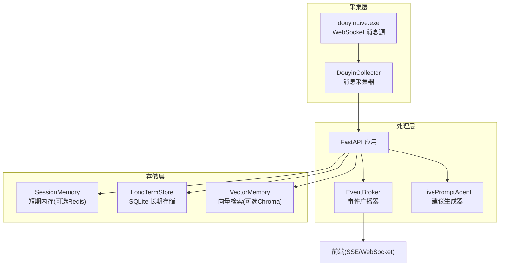
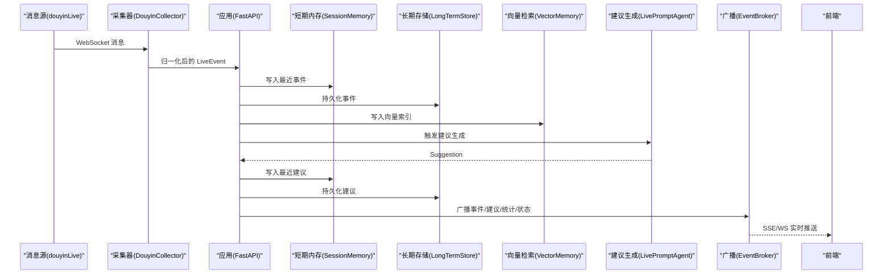
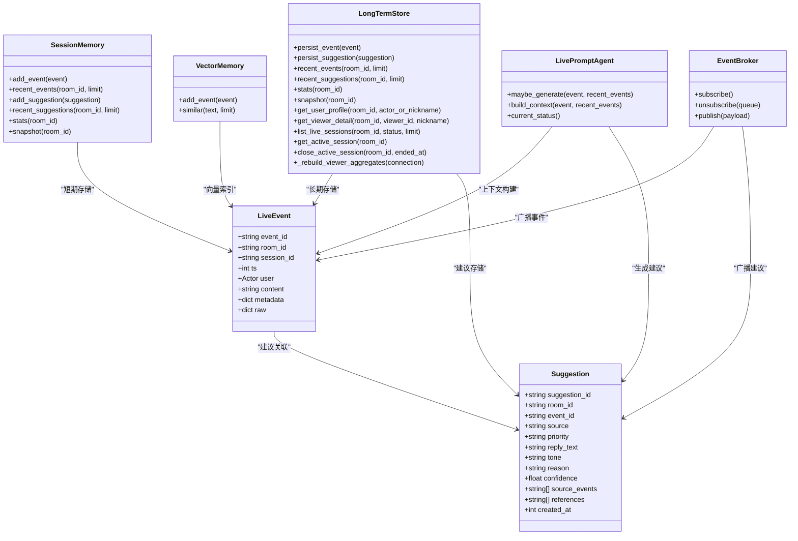

# 数据丢失恢复

<cite>
**本文档引用的文件**
- [backend/app.py](file://backend/app.py)
- [backend/config.py](file://backend/config.py)
- [backend/services/collector.py](file://backend/services/collector.py)
- [backend/memory/long_term.py](file://backend/memory/long_term.py)
- [backend/memory/session_memory.py](file://backend/memory/session_memory.py)
- [backend/memory/vector_store.py](file://backend/memory/vector_store.py)
- [backend/services/broker.py](file://backend/services/broker.py)
- [backend/services/agent.py](file://backend/services/agent.py)
- [backend/schemas/live.py](file://backend/schemas/live.py)
- [data/DATABASE.md](file://data/DATABASE.md)
- [README.md](file://README.md)
</cite>

## 目录
1. [简介](#简介)
2. [项目结构](#项目结构)
3. [核心组件](#核心组件)
4. [架构总览](#架构总览)
5. [详细组件分析](#详细组件分析)
6. [依赖关系分析](#依赖关系分析)
7. [性能考量](#性能考量)
8. [故障排查指南](#故障排查指南)
9. [结论](#结论)
10. [附录](#附录)

## 简介
本指南聚焦于直播场景中的数据丢失恢复，涵盖事件数据与用户画像两类核心数据的丢失检测、恢复策略与预防措施。通过对项目后端架构与数据库设计的深入分析，提供可操作的检测方法（事件ID缺失检查、时间戳异常检测、会话中断识别）、恢复手段（建议重新生成、历史建议回溯、AI模型重算、从事件重建用户画像、聚合数据回填、历史行为恢复），以及配套的SQL查询与Python代码示例路径，帮助快速定位与修复数据问题，确保系统稳定性与数据完整性。

## 项目结构
项目采用“采集-处理-存储-检索-生成-推送”的分层架构：
- 采集层：本地抖音消息源通过WebSocket提供事件流，后端采集器负责连接与消息归一化。
- 处理层：事件进入后端，写入短期内存、长期存储、向量索引，并触发建议生成与状态上报。
- 存储层：SQLite作为长期存储，Redis（可选）作为短期缓存，Chroma（可选）作为向量索引。
- 推送层：通过SSE与WebSocket向前端实时推送事件、建议、统计与模型状态。

图表来源
- [backend/app.py:1-220](file://backend/app.py#L1-L220)
- [backend/services/collector.py:1-284](file://backend/services/collector.py#L1-L284)
- [backend/memory/session_memory.py:1-113](file://backend/memory/session_memory.py#L1-L113)
- [backend/memory/long_term.py:1-750](file://backend/memory/long_term.py#L1-L750)
- [backend/memory/vector_store.py:1-108](file://backend/memory/vector_store.py#L1-L108)
- [backend/services/broker.py:1-40](file://backend/services/broker.py#L1-L40)
- [backend/services/agent.py:1-393](file://backend/services/agent.py#L1-L393)

章节来源
- [README.md:1-349](file://README.md#L1-L349)
- [backend/app.py:1-220](file://backend/app.py#L1-L220)

## 核心组件
- 事件模型与上下文：统一的LiveEvent、Suggestion、SessionStats、SessionSnapshot等模型，确保跨模块数据一致性。
- 采集器：负责连接本地WebSocket、解析消息、归一化为LiveEvent并提交到事件循环。
- 短期内存：优先使用Redis存储最近事件与建议，未安装Redis时退化为进程内内存，保障基本可用性。
- 长期存储：SQLite持久化事件、建议、用户画像、礼物聚合、直播会话与备注，提供聚合与回溯能力。
- 向量检索：Chroma或本地哈希嵌入函数，支持相似历史检索，辅助建议生成与上下文构建。
- 建议生成器：OpenAI兼容接口优先，失败时回退启发式规则，输出标准化Suggestion。
- 事件广播器：将事件、建议、统计与模型状态广播至SSE/WS订阅端。

章节来源
- [backend/schemas/live.py:1-95](file://backend/schemas/live.py#L1-L95)
- [backend/services/collector.py:1-284](file://backend/services/collector.py#L1-L284)
- [backend/memory/session_memory.py:1-113](file://backend/memory/session_memory.py#L1-L113)
- [backend/memory/long_term.py:1-750](file://backend/memory/long_term.py#L1-L750)
- [backend/memory/vector_store.py:1-108](file://backend/memory/vector_store.py#L1-L108)
- [backend/services/agent.py:1-393](file://backend/services/agent.py#L1-L393)
- [backend/services/broker.py:1-40](file://backend/services/broker.py#L1-L40)

## 架构总览
事件从采集器进入后端，经过短期内存、长期存储、向量检索与建议生成，再通过广播器推送到前端。该流程决定了数据丢失的潜在位置与恢复点。

图表来源
- [backend/services/collector.py:145-284](file://backend/services/collector.py#L145-L284)
- [backend/app.py:61-78](file://backend/app.py#L61-L78)
- [backend/memory/long_term.py:420-454](file://backend/memory/long_term.py#L420-L454)
- [backend/memory/vector_store.py:64-83](file://backend/memory/vector_store.py#L64-L83)
- [backend/services/agent.py:73-94](file://backend/services/agent.py#L73-L94)
- [backend/services/broker.py:28-39](file://backend/services/broker.py#L28-L39)

## 详细组件分析

### 事件数据丢失检测与恢复

#### 1. 事件ID缺失检查
- 检测思路：对比事件表中是否存在重复或缺失的event_id，结合会话ID进行分段校验。
- 关键表与字段：events.event_id、events.session_id。
- SQL检测示例路径：
  - 查看事件总数与去重计数差异，定位重复或缺失：[data/DATABASE.md:101-151](file://data/DATABASE.md#L101-L151)
  - 按会话分组统计事件数量，识别断层：[backend/memory/long_term.py:663-686](file://backend/memory/long_term.py#L663-L686)
- 恢复策略：
  - 建议重新生成：当事件ID缺失导致建议丢失时，可基于现有事件重新生成建议并回填：[backend/services/agent.py:73-94](file://backend/services/agent.py#L73-L94)
  - 历史建议回溯：从suggestions表按事件ID回溯并恢复：[backend/memory/long_term.py:487-502](file://backend/memory/long_term.py#L487-L502)

章节来源
- [backend/memory/long_term.py:420-454](file://backend/memory/long_term.py#L420-L454)
- [backend/services/agent.py:73-94](file://backend/services/agent.py#L73-L94)
- [data/DATABASE.md:101-151](file://data/DATABASE.md#L101-L151)

#### 2. 时间戳异常检测
- 检测思路：检查events.ts字段是否出现异常跳变、倒序或与系统时间偏差过大。
- SQL检测示例路径：
  - 查询事件时间序列，识别异常波动：[backend/memory/long_term.py:467-485](file://backend/memory/long_term.py#L467-L485)
  - 按房间与时间窗口统计事件密度，发现异常稀疏或密集时段：[backend/memory/long_term.py:663-686](file://backend/memory/long_term.py#L663-L686)
- 恢复策略：
  - 会话中断识别与修复：若时间戳异常导致会话中断，可通过重建活动会话并回填统计：[backend/memory/long_term.py:276-324](file://backend/memory/long_term.py#L276-L324)
  - 建议重新生成：时间异常可能影响建议生成上下文，可基于修正后的事件重新生成：[backend/services/agent.py:56-71](file://backend/services/agent.py#L56-L71)

章节来源
- [backend/memory/long_term.py:276-324](file://backend/memory/long_term.py#L276-L324)
- [backend/memory/long_term.py:467-485](file://backend/memory/long_term.py#L467-L485)
- [backend/services/agent.py:56-71](file://backend/services/agent.py#L56-L71)

#### 3. 会话中断识别
- 检测思路：通过live_sessions表status与last_event_at判断活动会话是否中断；结合events.session_id与时间戳异常定位断层。
- SQL检测示例路径：
  - 查询当前活动会话：[data/DATABASE.md:133-140](file://data/DATABASE.md#L133-L140)
  - 结束活动会话并回填结束时间：[backend/memory/long_term.py:700-716](file://backend/memory/long_term.py#L700-L716)
- 恢复策略：
  - 重新创建活动会话：当检测到会话中断时，基于最新事件创建新会话并回填统计：[backend/memory/long_term.py:276-324](file://backend/memory/long_term.py#L276-L324)
  - 历史建议回溯：针对中断期间的事件重新生成建议并回填：[backend/services/agent.py:73-94](file://backend/services/agent.py#L73-L94)

章节来源
- [backend/memory/long_term.py:700-716](file://backend/memory/long_term.py#L700-L716)
- [backend/memory/long_term.py:276-324](file://backend/memory/long_term.py#L276-L324)
- [backend/services/agent.py:73-94](file://backend/services/agent.py#L73-L94)

#### 4. 建议数据丢失恢复
- 检测思路：比较events与suggestions表的事件覆盖度，识别建议缺失的事件。
- SQL检测示例路径：
  - 查询最近建议与对应事件：[backend/memory/long_term.py:487-502](file://backend/memory/long_term.py#L487-L502)
- 恢复策略：
  - 建议重新生成：基于事件与上下文重新生成Suggestion并持久化：[backend/services/agent.py:73-94](file://backend/services/agent.py#L73-L94)
  - AI模型重算：当启用在线模型时，可调用OpenAI兼容接口重算建议：[backend/services/agent.py:183-329](file://backend/services/agent.py#L183-L329)

章节来源
- [backend/services/agent.py:73-94](file://backend/services/agent.py#L73-L94)
- [backend/services/agent.py:183-329](file://backend/services/agent.py#L183-L329)

### 用户画像数据丢失修复

#### 1. 从事件重建用户画像
- 修复思路：基于events表重建viewer_profiles与viewer_gifts聚合，回填缺失的画像字段。
- SQL修复示例路径：
  - 删除并重建用户画像聚合：[backend/memory/long_term.py:404-419](file://backend/memory/long_term.py#L404-L419)
  - 查询用户画像详情：[backend/memory/long_term.py:736-749](file://backend/memory/long_term.py#L736-L749)
- Python代码示例路径：
  - 调用重建聚合逻辑：[backend/memory/long_term.py:404-419](file://backend/memory/long_term.py#L404-L419)

章节来源
- [backend/memory/long_term.py:404-419](file://backend/memory/long_term.py#L404-L419)
- [backend/memory/long_term.py:736-749](file://backend/memory/long_term.py#L736-L749)

#### 2. 聚合数据回填
- 修复思路：针对viewer_profiles与viewer_gifts的缺失字段（如last_session_id、total_diamond_count等）进行回填。
- SQL修复示例路径：
  - 确保viewer_profiles列存在并回填缺失字段：[backend/memory/long_term.py:172-181](file://backend/memory/long_term.py#L172-L181)
  - 回填事件表中的派生字段（viewer_id、gift_*等）：[backend/memory/long_term.py:245-275](file://backend/memory/long_term.py#L245-L275)

章节来源
- [backend/memory/long_term.py:172-181](file://backend/memory/long_term.py#L172-L181)
- [backend/memory/long_term.py:245-275](file://backend/memory/long_term.py#L245-L275)

#### 3. 历史行为恢复
- 修复思路：通过viewer_event_history、viewer_session_history等查询接口恢复用户历史行为与会话轨迹。
- SQL修复示例路径：
  - 查询用户历史评论：[data/DATABASE.md:112-121](file://data/DATABASE.md#L112-L121)
  - 查询用户礼物历史：[data/DATABASE.md:123-131](file://data/DATABASE.md#L123-L131)
  - 查询用户会话历史：[backend/memory/long_term.py:600-618](file://backend/memory/long_term.py#L600-L618)

章节来源
- [data/DATABASE.md:112-131](file://data/DATABASE.md#L112-L131)
- [backend/memory/long_term.py:600-618](file://backend/memory/long_term.py#L600-L618)

## 依赖关系分析

图表来源
- [backend/schemas/live.py:29-95](file://backend/schemas/live.py#L29-L95)
- [backend/memory/session_memory.py:17-113](file://backend/memory/session_memory.py#L17-L113)
- [backend/memory/long_term.py:36-750](file://backend/memory/long_term.py#L36-L750)
- [backend/memory/vector_store.py:52-108](file://backend/memory/vector_store.py#L52-L108)
- [backend/services/agent.py:23-393](file://backend/services/agent.py#L23-L393)
- [backend/services/broker.py:10-40](file://backend/services/broker.py#L10-L40)

## 性能考量
- 短期内存容量：SessionMemory默认窗口大小限制（事件与建议）避免内存无限增长，Redis模式下配合TTL控制热数据生命周期。
- 长期存储索引：events表建立多处索引（room_id+ts、room_id+viewer_id+ts、session_id等），提升查询与回溯效率。
- 向量检索降级：未安装Chroma时使用本地哈希嵌入函数，保证检索能力可用但精度降低。
- 建议生成回退：在线模型失败时自动回退启发式规则，确保系统稳定性。

章节来源
- [backend/memory/session_memory.py:17-113](file://backend/memory/session_memory.py#L17-L113)
- [backend/memory/long_term.py:183-195](file://backend/memory/long_term.py#L183-L195)
- [backend/memory/vector_store.py:19-50](file://backend/memory/vector_store.py#L19-L50)
- [backend/services/agent.py:96-113](file://backend/services/agent.py#L96-L113)

## 故障排查指南

### 1. 事件丢失定位
- 步骤：
  - 检查events表是否存在重复或缺失的event_id：[backend/memory/long_term.py:420-454](file://backend/memory/long_term.py#L420-L454)
  - 校验时间戳异常与会话中断：[backend/memory/long_term.py:276-324](file://backend/memory/long_term.py#L276-L324)
  - 对比建议生成覆盖率：[backend/services/agent.py:73-94](file://backend/services/agent.py#L73-L94)

### 2. 用户画像缺失修复
- 步骤：
  - 重建聚合：删除并重建viewer_profiles与viewer_gifts：[backend/memory/long_term.py:404-419](file://backend/memory/long_term.py#L404-L419)
  - 回填缺失字段：确保viewer_profiles列存在并回填：[backend/memory/long_term.py:172-181](file://backend/memory/long_term.py#L172-L181)
  - 查询历史行为：使用历史查询接口恢复用户轨迹：[backend/memory/long_term.py:566-618](file://backend/memory/long_term.py#L566-L618)

### 3. 建议生成异常
- 步骤：
  - 检查模型状态与错误日志：[backend/services/agent.py:39-54](file://backend/services/agent.py#L39-L54)
  - 回退到启发式规则：[backend/services/agent.py:115-181](file://backend/services/agent.py#L115-L181)
  - 在线模型重算：调用OpenAI兼容接口重算建议：[backend/services/agent.py:183-329](file://backend/services/agent.py#L183-L329)

章节来源
- [backend/memory/long_term.py:404-419](file://backend/memory/long_term.py#L404-L419)
- [backend/memory/long_term.py:172-181](file://backend/memory/long_term.py#L172-L181)
- [backend/memory/long_term.py:566-618](file://backend/memory/long_term.py#L566-L618)
- [backend/services/agent.py:39-54](file://backend/services/agent.py#L39-L54)
- [backend/services/agent.py:115-181](file://backend/services/agent.py#L115-L181)
- [backend/services/agent.py:183-329](file://backend/services/agent.py#L183-L329)

## 结论
通过上述检测与恢复策略，可在事件数据与用户画像层面有效应对数据丢失问题。建议将以下措施纳入日常运维：
- 定期巡检events与suggestions的覆盖度与时间戳连续性。
- 在会话中断或时间戳异常时，及时重建活动会话并回填统计。
- 对用户画像缺失场景，定期执行聚合重建与字段回填。
- 建立建议生成的监控与回退机制，确保系统在模型异常时仍可稳定运行。

## 附录

### A. 数据完整性验证方法
- 事件完整性：对比events表与会话统计，确保事件计数与会话计数一致。
- 建议完整性：对比events与suggestions的事件覆盖度，确保关键事件均有建议。
- 用户画像完整性：对比viewer_profiles与events的交互计数，确保聚合字段与事件一致。

章节来源
- [backend/memory/long_term.py:504-521](file://backend/memory/long_term.py#L504-L521)
- [backend/memory/long_term.py:487-502](file://backend/memory/long_term.py#L487-L502)
- [backend/memory/long_term.py:326-402](file://backend/memory/long_term.py#L326-L402)

### B. 预防措施
- 配置Redis与Chroma：提升短期缓存与向量检索能力，减少数据丢失风险。
- 健康检查与告警：利用/health接口与模型状态监控，提前发现异常。
- 自动化巡检：编写脚本定期执行SQL校验与修复任务，降低人工干预成本。

章节来源
- [backend/app.py:104-106](file://backend/app.py#L104-L106)
- [backend/services/agent.py:39-54](file://backend/services/agent.py#L39-L54)
- [backend/config.py:63-91](file://backend/config.py#L63-L91)