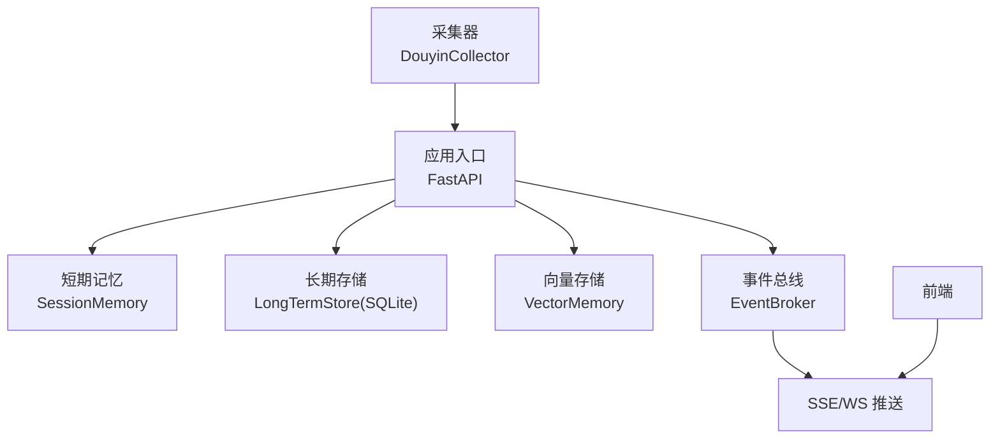
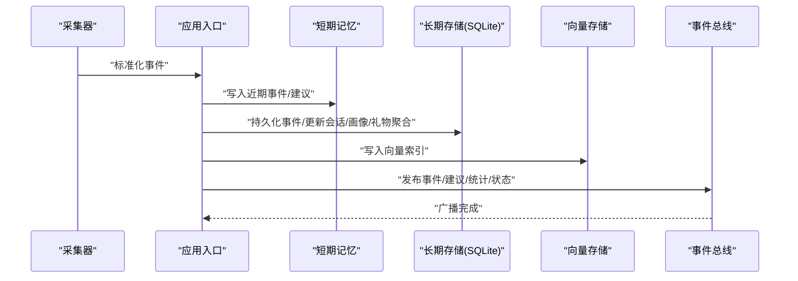
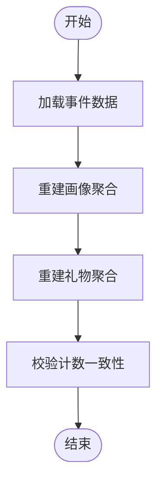
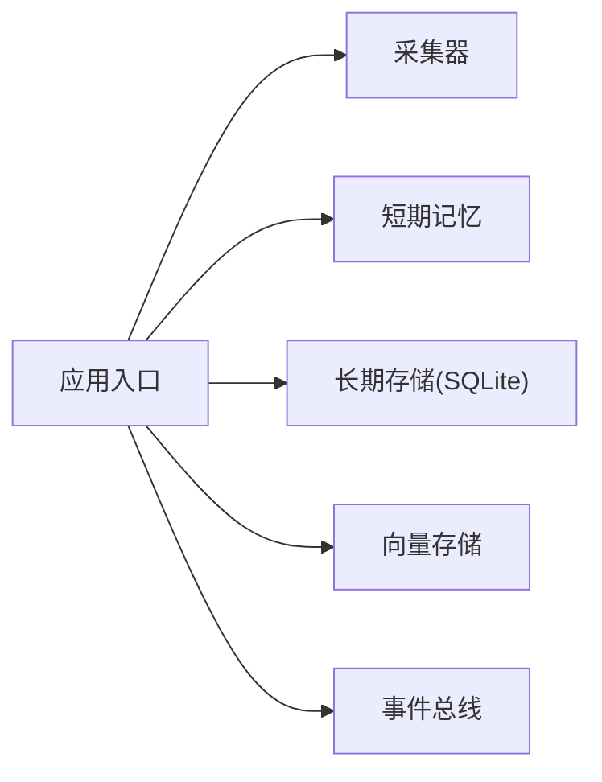

# 数据完整性验证

<cite>
**本文引用的文件**
- [backend/app.py](file://backend/app.py)
- [backend/config.py](file://backend/config.py)
- [backend/memory/long_term.py](file://backend/memory/long_term.py)
- [backend/memory/session_memory.py](file://backend/memory/session_memory.py)
- [backend/memory/vector_store.py](file://backend/memory/vector_store.py)
- [backend/schemas/live.py](file://backend/schemas/live.py)
- [backend/services/broker.py](file://backend/services/broker.py)
- [backend/services/collector.py](file://backend/services/collector.py)
- [data/DATABASE.md](file://data/DATABASE.md)
- [README.md](file://README.md)
</cite>

## 目录
1. [简介](#简介)
2. [项目结构](#项目结构)
3. [核心组件](#核心组件)
4. [架构总览](#架构总览)
5. [详细组件分析](#详细组件分析)
6. [依赖分析](#依赖分析)
7. [性能考量](#性能考量)
8. [故障排查指南](#故障排查指南)
9. [结论](#结论)
10. [附录](#附录)

## 简介
本指南围绕“数据完整性验证”主题，结合代码库中的数据库表结构、写入路径与索引设计，系统阐述以下内容：
- 事件总数统计与建议数量核对
- 用户画像完整性检查（含历史回填与聚合更新）
- 索引完整性检查（主键索引、外键约束、复合索引有效性）
- 外键约束验证（房间ID一致性、会话ID关联性、用户ID正确性）
- SQL 查询模板与 Python 自动化脚本思路
- 定期完整性检查的最佳实践与监控告警机制

该指南旨在帮助开发者与运维人员建立可操作、可落地的数据质量保障体系。

## 项目结构
后端采用“采集-标准化-短期记忆-长期存储-向量检索-建议生成-前端推送”的链路。与数据完整性直接相关的关键模块包括：
- 采集器：负责从本地 WebSocket 源拉取消息并标准化为统一事件对象
- 应用入口：接收事件、触发处理流程、发布统计与状态
- 长期存储：SQLite 表与索引，负责事件、画像、会话、建议等数据的持久化与聚合
- 短期记忆：Redis 或进程内队列，用于近期事件与建议的快速访问
- 向量存储：Chroma 或本地近似方案，支撑相似历史检索

图表来源
- [backend/services/collector.py:38-284](file://backend/services/collector.py#L38-L284)
- [backend/app.py:61-78](file://backend/app.py#L61-L78)
- [backend/memory/session_memory.py:17-113](file://backend/memory/session_memory.py#L17-L113)
- [backend/memory/long_term.py:36-155](file://backend/memory/long_term.py#L36-L155)
- [backend/memory/vector_store.py:52-108](file://backend/memory/vector_store.py#L52-L108)
- [backend/services/broker.py:10-40](file://backend/services/broker.py#L10-L40)

章节来源
- [README.md:35-48](file://README.md#L35-L48)
- [backend/app.py:1-220](file://backend/app.py#L1-L220)
- [backend/config.py:1-94](file://backend/config.py#L1-L94)

## 核心组件
- 事件模型与标准化：统一事件结构，确保字段一致性与可追踪性
- 长期存储与索引：事件表、会话表、画像表、礼物聚合表、备注表，配套主键与复合索引
- 短期记忆与向量检索：保证高频读取与相似历史检索能力
- 事件总线：将事件、建议、统计与模型状态广播至前端

章节来源
- [backend/schemas/live.py:8-95](file://backend/schemas/live.py#L8-L95)
- [backend/memory/long_term.py:54-148](file://backend/memory/long_term.py#L54-L148)
- [backend/memory/session_memory.py:17-113](file://backend/memory/session_memory.py#L17-L113)
- [backend/memory/vector_store.py:52-108](file://backend/memory/vector_store.py#L52-L108)
- [backend/services/broker.py:10-40](file://backend/services/broker.py#L10-L40)

## 架构总览
事件从采集器进入，经标准化后写入短期记忆与长期存储，并触发会话聚合、画像更新与建议生成，随后通过事件总线推送至前端。

图表来源
- [backend/services/collector.py:225-284](file://backend/services/collector.py#L225-L284)
- [backend/app.py:61-78](file://backend/app.py#L61-L78)
- [backend/memory/session_memory.py:42-64](file://backend/memory/session_memory.py#L42-L64)
- [backend/memory/long_term.py:420-454](file://backend/memory/long_term.py#L420-L454)
- [backend/memory/vector_store.py:64-83](file://backend/memory/vector_store.py#L64-L83)
- [backend/services/broker.py:28-39](file://backend/services/broker.py#L28-L39)

## 详细组件分析

### 事件总数统计与建议数量核对
- 统计口径
  - 事件总数：按房间维度统计事件条目数
  - 分类统计：评论、礼物、点赞、入房、关注等事件类型的计数
- 建议数量核对
  - 建议表与事件表存在一一对应关系（建议绑定事件ID），可通过事件表与建议表进行交叉校验
- 实施要点
  - 事件表与建议表均具备按房间过滤与时间排序的索引，便于高效统计
  - 建议生成逻辑仅针对特定事件类型，建议数量应与相应事件数量保持合理比例

章节来源
- [backend/memory/long_term.py:504-521](file://backend/memory/long_term.py#L504-L521)
- [backend/memory/long_term.py:456-466](file://backend/memory/long_term.py#L456-L466)
- [data/DATABASE.md:101-151](file://data/DATABASE.md#L101-L151)

### 用户画像完整性检查
- 画像聚合
  - 画像表按房间+观众ID聚合，包含事件总量、各类事件计数、首次/末次出现时间、最近会话ID、最近内容等
  - 礼物聚合表按房间+观众ID+礼物名聚合，包含事件次数、累计数量、累计钻石数、首次/末次送礼时间
- 回填与重建
  - 长期存储在初始化阶段会回填缺失字段并重建聚合，确保历史数据一致性
- 检查项
  - 字段完整性：如累计礼物数、累计钻石数、最近会话ID等是否正确更新
  - 一致性校验：画像表与事件表、礼物聚合表之间的计数是否一致
  - 历史回填：确认历史事件是否已完整回填并重建聚合

图表来源
- [backend/memory/long_term.py:404-420](file://backend/memory/long_term.py#L404-L420)
- [backend/memory/long_term.py:326-402](file://backend/memory/long_term.py#L326-L402)

章节来源
- [backend/memory/long_term.py:81-148](file://backend/memory/long_term.py#L81-L148)
- [backend/memory/long_term.py:404-420](file://backend/memory/long_term.py#L404-L420)
- [backend/memory/long_term.py:326-402](file://backend/memory/long_term.py#L326-L402)

### 索引完整性检查方法
- 主键索引验证
  - 事件表、建议表、会话表、画像表、礼物聚合表、备注表均具备主键，用于唯一性约束
- 外键约束检查
  - 代码库未显式声明外键约束，但通过业务逻辑保证引用关系：
    - 事件表的会话ID与会话表主键关联
    - 事件表的观众ID与画像表复合主键关联
    - 事件表的观众ID与礼物聚合表复合主键关联
    - 建议表绑定事件ID与事件表关联
- 复合索引有效性测试
  - 事件表：按房间+时间、房间+观众ID+时间、房间+事件类型+时间、按会话ID
  - 画像表：按房间+昵称
  - 礼物聚合表：按房间+观众ID+最后送礼时间
  - 会话表：按房间+状态+最后事件时间
  - 备注表：按房间+观众ID+更新时间

章节来源
- [backend/memory/long_term.py:54-148](file://backend/memory/long_term.py#L54-L148)
- [backend/memory/long_term.py:183-195](file://backend/memory/long_term.py#L183-L195)

### 外键约束验证
- 房间ID一致性
  - 事件表、画像表、礼物聚合表、备注表均包含房间ID字段，需确保写入时房间ID一致且有效
- 会话ID关联性
  - 事件表的会话ID应与会话表主键一致；若事件写入时未指定会话ID，则应自动创建或复用活动会话
- 用户ID正确性检查
  - 事件表的用户ID、短ID、安全ID、昵称与画像表字段保持一致；画像表与礼物聚合表的用户信息应同步更新

章节来源
- [backend/memory/long_term.py:276-324](file://backend/memory/long_term.py#L276-L324)
- [backend/memory/long_term.py:326-402](file://backend/memory/long_term.py#L326-L402)
- [backend/memory/long_term.py:420-454](file://backend/memory/long_term.py#L420-L454)

### SQL 查询模板与 Python 脚本思路
- 事件总数统计
  - 按房间统计事件总数与分类计数
- 建议数量核对
  - 统计建议数量并与事件数量进行交叉验证
- 用户画像完整性检查
  - 按房间与观众ID查询画像与礼物聚合，核对计数字段
- 外键一致性检查
  - 校验事件表的会话ID与会话表主键一致
  - 校验事件表的观众ID与画像/礼物聚合表主键一致
- Python 脚本思路
  - 使用 SQLite 连接器执行上述查询
  - 输出差异与异常清单，支持导出报告
  - 结合定时任务或守护进程周期性执行

章节来源
- [backend/memory/long_term.py:504-521](file://backend/memory/long_term.py#L504-L521)
- [backend/memory/long_term.py:456-466](file://backend/memory/long_term.py#L456-L466)
- [backend/memory/long_term.py:525-564](file://backend/memory/long_term.py#L525-L564)
- [backend/memory/long_term.py:600-618](file://backend/memory/long_term.py#L600-L618)
- [data/DATABASE.md:101-151](file://data/DATABASE.md#L101-L151)

## 依赖分析
- 组件耦合
  - 应用入口依赖采集器、短期记忆、长期存储、向量存储与事件总线
  - 长期存储内部通过事务与索引保障数据一致性
- 外部依赖
  - Redis（可选）：短期记忆退化为进程内队列
  - Chroma（可选）：向量检索退化为本地相似度方案
- 潜在循环依赖
  - 未发现循环导入；模块职责清晰

图表来源
- [backend/app.py:25-29](file://backend/app.py#L25-L29)
- [backend/services/collector.py:38-52](file://backend/services/collector.py#L38-L52)
- [backend/memory/session_memory.py:17-31](file://backend/memory/session_memory.py#L17-L31)
- [backend/memory/long_term.py:36-44](file://backend/memory/long_term.py#L36-L44)
- [backend/memory/vector_store.py:52-63](file://backend/memory/vector_store.py#L52-L63)
- [backend/services/broker.py:10-21](file://backend/services/broker.py#L10-L21)

章节来源
- [backend/app.py:1-220](file://backend/app.py#L1-L220)
- [backend/config.py:52-69](file://backend/config.py#L52-L69)

## 性能考量
- 索引优化
  - 事件表多维索引覆盖常见查询模式（房间+时间、房间+观众ID+时间、房间+事件类型+时间、按会话ID）
  - 画像、礼物聚合、会话、备注表的复合索引提升查询效率
- 写入路径
  - 事件写入时先判断是否存在会话ID，避免重复创建；成功后更新会话统计与画像/礼物聚合
- 读取路径
  - 短期记忆优先，Redis 可选；无 Redis 时退化为进程内队列，保证可用性
- 向量检索
  - 可选 Chroma；不可用时采用本地哈希嵌入函数，维持检索能力

章节来源
- [backend/memory/long_term.py:183-195](file://backend/memory/long_term.py#L183-L195)
- [backend/memory/long_term.py:420-454](file://backend/memory/long_term.py#L420-L454)
- [backend/memory/session_memory.py:17-31](file://backend/memory/session_memory.py#L17-L31)
- [backend/memory/vector_store.py:19-50](file://backend/memory/vector_store.py#L19-L50)

## 故障排查指南
- 采集链路问题
  - 检查采集器是否连接成功、心跳是否正常、消息是否可解析
- 写入一致性问题
  - 若事件重复写入，确认事件ID唯一性；检查会话ID是否正确继承或创建
- 聚合不一致
  - 如画像或礼物聚合计数异常，执行重建流程并核对历史事件
- 索引失效
  - 如查询变慢，检查索引是否存在；必要时重建索引
- 前端无数据
  - 检查事件总线是否正常广播，SSE/WS 是否连通

章节来源
- [backend/services/collector.py:117-198](file://backend/services/collector.py#L117-L198)
- [backend/memory/long_term.py:420-454](file://backend/memory/long_term.py#L420-L454)
- [backend/services/broker.py:28-39](file://backend/services/broker.py#L28-L39)
- [backend/app.py:187-220](file://backend/app.py#L187-L220)

## 结论
本项目通过标准化事件模型、完善的索引设计与可选的短期/长期存储方案，构建了较为稳健的数据完整性基础。建议在现有基础上补充：
- 显式外键约束或在应用层增加外键一致性校验
- 增设自动化完整性检查脚本与周期性巡检任务
- 建立监控告警机制，对事件总数、画像计数、索引命中率等关键指标进行持续观测

## 附录
- 关键表与字段说明参见数据库文档
- 常用查询模板参见数据库文档中的示例

章节来源
- [data/DATABASE.md:1-151](file://data/DATABASE.md#L1-L151)