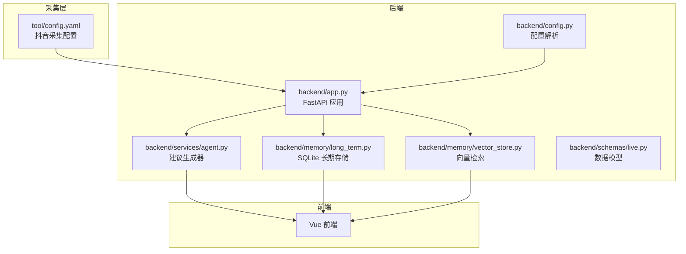
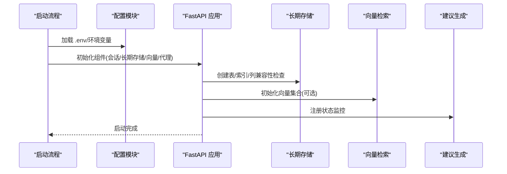
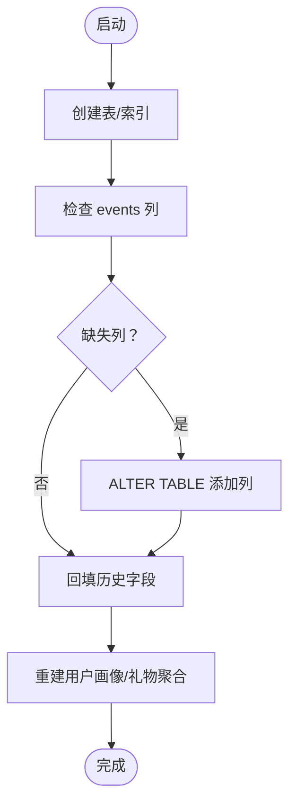
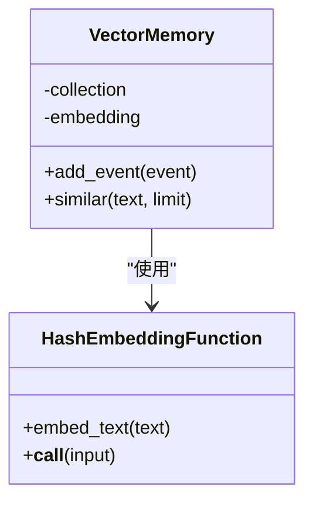
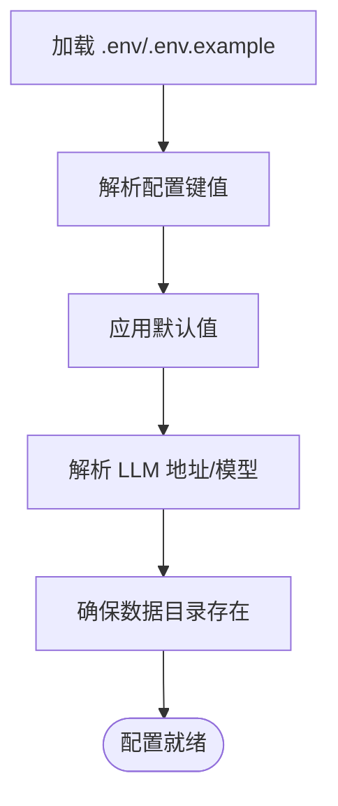
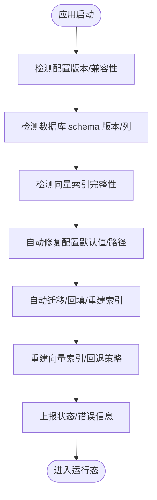
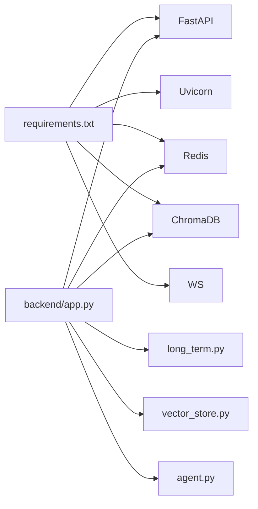

# 版本冲突解决

<cite>
**本文引用的文件**
- [backend/app.py](file://backend/app.py)
- [backend/config.py](file://backend/config.py)
- [backend/memory/long_term.py](file://backend/memory/long_term.py)
- [backend/memory/vector_store.py](file://backend/memory/vector_store.py)
- [backend/schemas/live.py](file://backend/schemas/live.py)
- [backend/services/agent.py](file://backend/services/agent.py)
- [tool/config.yaml](file://tool/config.yaml)
- [data/DATABASE.md](file://data/DATABASE.md)
- [README.md](file://README.md)
- [USAGE.md](file://USAGE.md)
- [requirements.txt](file://requirements.txt)
</cite>

## 目录
1. [简介](#简介)
2. [项目结构](#项目结构)
3. [核心组件](#核心组件)
4. [架构总览](#架构总览)
5. [详细组件分析](#详细组件分析)
6. [依赖关系分析](#依赖关系分析)
7. [性能考量](#性能考量)
8. [故障排查指南](#故障排查指南)
9. [结论](#结论)
10. [附录](#附录)

## 简介
本指南聚焦于版本冲突的识别与自动修复，覆盖数据库 schema 升级、向量索引重建、配置文件版本管理与兼容性处理，并提供启动时自动检测与修复的实践思路与流程图示。文档同时给出备份与回滚策略，帮助在升级过程中安全可控地演进系统。

## 项目结构
项目采用“采集-存储-检索-生成-前端”分层架构，核心入口为后端 FastAPI 应用，配置由环境变量与 .env 解析，长期存储基于 SQLite，向量检索可选 Chroma，短期记忆可选 Redis，Agent 生成建议支持在线模型与启发式回退。

**图表来源**
- [backend/app.py:1-220](file://backend/app.py#L1-L220)
- [backend/config.py:1-94](file://backend/config.py#L1-L94)
- [backend/services/agent.py:1-393](file://backend/services/agent.py#L1-L393)
- [backend/memory/long_term.py:1-750](file://backend/memory/long_term.py#L1-L750)
- [backend/memory/vector_store.py:1-108](file://backend/memory/vector_store.py#L1-L108)
- [backend/schemas/live.py:1-95](file://backend/schemas/live.py#L1-L95)
- [tool/config.yaml:1-16](file://tool/config.yaml#L1-L16)

**章节来源**
- [README.md:1-349](file://README.md#L1-L349)
- [USAGE.md:1-256](file://USAGE.md#L1-L256)

## 核心组件
- 配置模块：负责从 .env 与环境变量加载配置，提供默认值与运行时解析（如 LLM 地址与模型名），并确保本地数据目录存在。
- 长期存储：基于 SQLite 的事件、画像、礼物、会话与备注表，具备列兼容性检查与索引维护，支持历史数据回填与聚合重建。
- 向量检索：优先使用 Chroma 持久化向量库；若不可用则退化为本地哈希嵌入与轻量相似度策略。
- 建议生成：优先调用在线模型，失败时自动回退至启发式规则；状态通过模型状态对象对外展示。
- 应用入口：FastAPI 提供健康检查、SSE/WS 实时流与 REST 接口，贯穿事件采集、存储、检索与建议推送。

**章节来源**
- [backend/config.py:1-94](file://backend/config.py#L1-L94)
- [backend/memory/long_term.py:1-750](file://backend/memory/long_term.py#L1-L750)
- [backend/memory/vector_store.py:1-108](file://backend/memory/vector_store.py#L1-L108)
- [backend/services/agent.py:1-393](file://backend/services/agent.py#L1-L393)
- [backend/app.py:1-220](file://backend/app.py#L1-L220)

## 架构总览
系统启动时，应用初始化配置、连接 Redis/Chroma、建立 SQLite 表与索引，并在生命周期内持续处理事件、生成建议、推送流式数据。

**图表来源**
- [backend/config.py:1-94](file://backend/config.py#L1-L94)
- [backend/app.py:1-220](file://backend/app.py#L1-L220)
- [backend/memory/long_term.py:1-750](file://backend/memory/long_term.py#L1-L750)
- [backend/memory/vector_store.py:1-108](file://backend/memory/vector_store.py#L1-L108)
- [backend/services/agent.py:1-393](file://backend/services/agent.py#L1-L393)

## 详细组件分析

### 数据库 schema 升级与版本兼容
- 自动建表与索引：首次启动时创建核心表与常用索引，确保查询性能与一致性。
- 列兼容性检查：通过 PRAGMA 查询现有列，逐项添加缺失列，避免因字段变更导致的运行时异常。
- 历史数据回填：对既有事件进行字段补全与修正，确保 session_id、viewer_id 等关键字段一致。
- 聚合重建：在回填完成后重建 viewer_profiles 与 viewer_gifts 聚合，保持画像与礼物统计准确。

**图表来源**
- [backend/memory/long_term.py:150-195](file://backend/memory/long_term.py#L150-L195)
- [backend/memory/long_term.py:245-275](file://backend/memory/long_term.py#L245-L275)
- [backend/memory/long_term.py:404-420](file://backend/memory/long_term.py#L404-L420)

**章节来源**
- [backend/memory/long_term.py:150-195](file://backend/memory/long_term.py#L150-L195)
- [backend/memory/long_term.py:245-275](file://backend/memory/long_term.py#L245-L275)
- [backend/memory/long_term.py:404-420](file://backend/memory/long_term.py#L404-L420)
- [data/DATABASE.md:1-151](file://data/DATABASE.md#L1-L151)

### 字段兼容性检查与数据迁移策略
- 字段发现：通过 PRAGMA table_info 获取现有列集合，避免重复添加。
- 迁移策略：
  - 新增列：使用 ALTER TABLE 添加默认值，保证已有记录可读。
  - 回填：扫描历史记录，基于 metadata/raw 结构提取并填充缺失字段。
  - 一致性：使用 ON CONFLICT UPSERT/INSERT OR REPLACE 保证幂等。
- 索引维护：在建表后创建复合索引，加速高频查询（如按房间时间排序、按 viewer_id 聚合）。

**章节来源**
- [backend/memory/long_term.py:46-48](file://backend/memory/long_term.py#L46-L48)
- [backend/memory/long_term.py:155-181](file://backend/memory/long_term.py#L155-L181)
- [backend/memory/long_term.py:183-195](file://backend/memory/long_term.py#L183-L195)
- [backend/memory/long_term.py:245-275](file://backend/memory/long_term.py#L245-L275)

### 向量索引重建与相似度检索优化
- 可选依赖：当 chromadb 可用时，使用 PersistentClient 创建/获取集合；否则退化为本地哈希嵌入与关键词重叠评分。
- 索引重建：
  - 清空旧集合：删除旧数据后重建。
  - 重新 upsert：遍历历史事件，计算嵌入并写入集合。
  - 查询优化：使用 query_embeddings 计算相似度，返回 top-N 文档。
- 降级策略：无 Chroma 时，维持有限容量的内存列表，基于词集重叠近似相似度。

**图表来源**
- [backend/memory/vector_store.py:52-108](file://backend/memory/vector_store.py#L52-L108)
- [backend/memory/vector_store.py:19-50](file://backend/memory/vector_store.py#L19-L50)

**章节来源**
- [backend/memory/vector_store.py:52-108](file://backend/memory/vector_store.py#L52-L108)

### 配置文件版本管理与环境变量兼容
- 配置加载顺序：优先读取项目根目录 .env，其次读取当前 shell 环境变量。
- 默认值策略：所有关键配置均提供默认值，保证本地开箱即用。
- LLM 解析：根据模式自动解析模型服务地址与模型名，支持 DashScope/OpenAI 兼容网关。
- 存储路径：确保 data、数据库与 Chroma 目录存在，避免运行时 IO 错误。

**图表来源**
- [backend/config.py:11-36](file://backend/config.py#L11-L36)
- [backend/config.py:40-94](file://backend/config.py#L40-L94)

**章节来源**
- [backend/config.py:11-36](file://backend/config.py#L11-L36)
- [backend/config.py:40-94](file://backend/config.py#L40-L94)
- [README.md:142-207](file://README.md#L142-L207)
- [USAGE.md:24-48](file://USAGE.md#L24-L48)

### 版本冲突检测与自动修复（启动时）
以下为启动时自动检测与修复的通用流程，可结合项目现有组件落地：

说明要点（非特定代码实现，仅为流程设计）：
- 配置检测：对比当前配置与默认值差异，补齐缺失项；解析 LLM 地址/模型，确保可访问。
- 数据库检测：读取 PRAGMA 列信息，比对所需列集合，自动执行 ALTER TABLE 并回填数据。
- 向量检测：尝试连接 Chroma 集合，若失败则启用本地哈希嵌入；若集合损坏则重建。
- 上报与日志：将修复结果与错误信息写入模型状态，便于前端与运维观察。

[本节为概念性流程，不直接分析具体文件，故不附“章节来源”]

## 依赖关系分析
- 后端依赖：FastAPI、Uvicorn、Redis、ChromaDB、websocket-client。
- 组件耦合：应用入口依赖配置、存储与检索；建议生成依赖存储与向量；前端通过 SSE/WS 接收实时数据。

**图表来源**
- [requirements.txt:1-6](file://requirements.txt#L1-L6)
- [backend/app.py:1-220](file://backend/app.py#L1-L220)

**章节来源**
- [requirements.txt:1-6](file://requirements.txt#L1-L6)
- [backend/app.py:1-220](file://backend/app.py#L1-L220)

## 性能考量
- SQLite 索引：为高频查询创建复合索引，降低大表扫描成本。
- 向量检索：Chroma 持久化可提升大规模相似度查询性能；无依赖时使用本地嵌入与词集重叠，权衡准确性与性能。
- 短期记忆：Redis 模式下利用列表与过期策略控制热数据生命周期；无 Redis 时使用进程内队列，容量受限但无需外部依赖。
- 建议生成：在线模型失败时快速回退启发式规则，保障前端体验连续性。

[本节为通用指导，不直接分析具体文件，故不附“章节来源”]

## 故障排查指南
- 健康检查：通过 /health 接口确认房间号与活动会话状态。
- 日志与状态：建议生成器维护模型状态，前端可据此判断在线模型是否可用、是否回退至规则。
- 常见问题：网络错误、超时、JSON 解析失败、权限头缺失等，均会被捕获并记录，状态标记相应错误类型。
- 数据库问题：若出现列缺失或索引异常，检查迁移脚本是否执行成功，必要时手动回填或重建索引。

**章节来源**
- [backend/app.py:104-107](file://backend/app.py#L104-L107)
- [backend/services/agent.py:96-393](file://backend/services/agent.py#L96-L393)

## 结论
通过在启动阶段执行配置解析与兼容性检查、数据库 schema 自动迁移与索引重建、向量索引的可选重建与降级策略，系统可在版本演进中最大限度减少人工干预与停机风险。配合完善的日志与状态上报，可实现“自动修复+可观测”的版本升级闭环。

[本节为总结性内容，不直接分析具体文件，故不附“章节来源”]

## 附录

### 版本升级前的备份策略
- 数据库备份：在升级前导出 SQLite 数据库文件，保留完整历史与索引。
- 向量索引备份：若使用 Chroma，备份持久化目录；若无依赖，记录当前向量集合的元数据与重建策略。
- 配置备份：备份 .env 与 tool/config.yaml，记录当前关键配置项。

**章节来源**
- [data/DATABASE.md:1-151](file://data/DATABASE.md#L1-L151)
- [backend/config.py:11-36](file://backend/config.py#L11-L36)
- [tool/config.yaml:1-16](file://tool/config.yaml#L1-L16)

### 回滚方案
- 快速回滚：停止新版本，恢复备份的 .env、数据库与 Chroma 目录，重启服务。
- 渐进回滚：保留新版本的 schema 变更，但暂时禁用新特性，逐步回退到稳定版本。
- 配置回滚：若配置变更导致异常，恢复 .env 与 tool/config.yaml 的上一版本。

**章节来源**
- [backend/config.py:11-36](file://backend/config.py#L11-L36)
- [tool/config.yaml:1-16](file://tool/config.yaml#L1-L16)