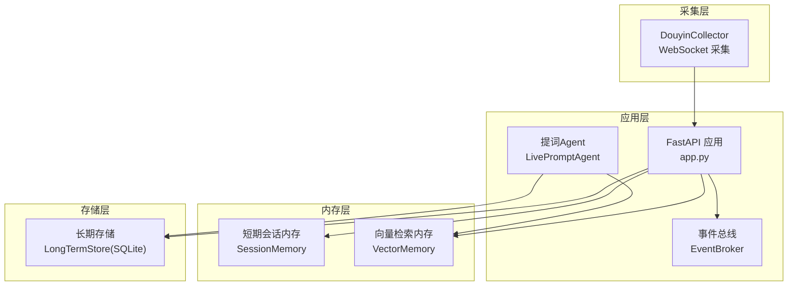
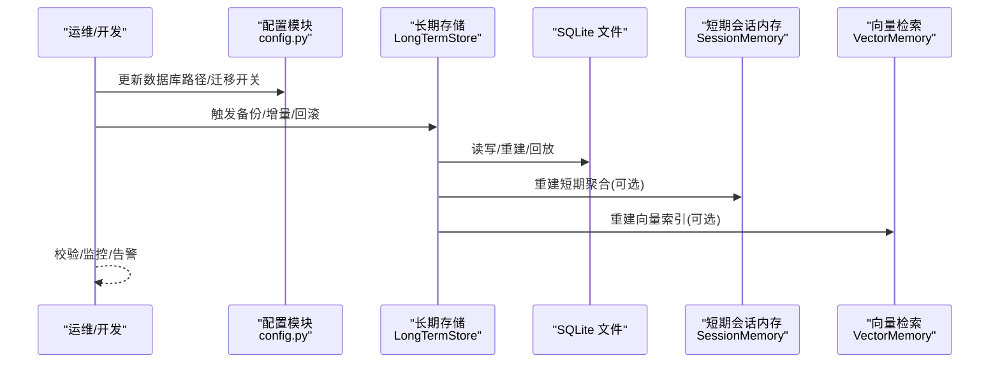
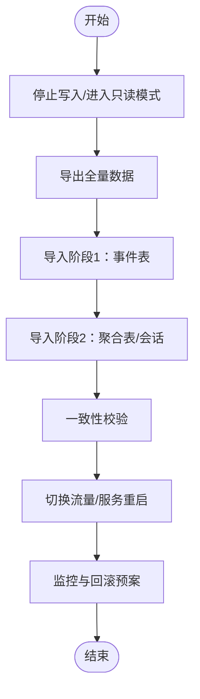
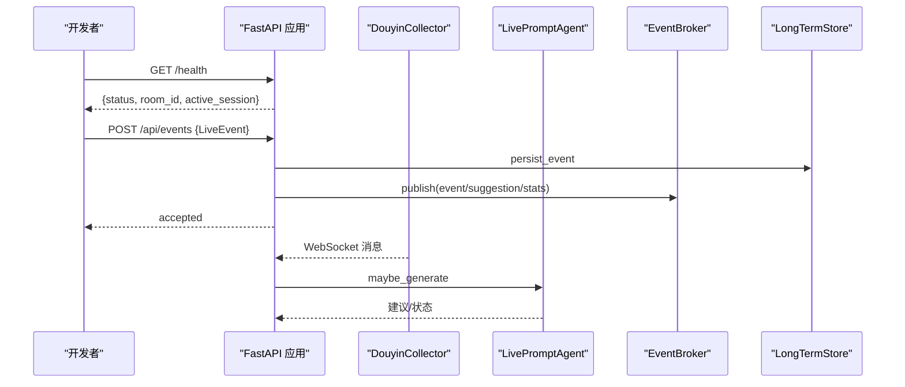
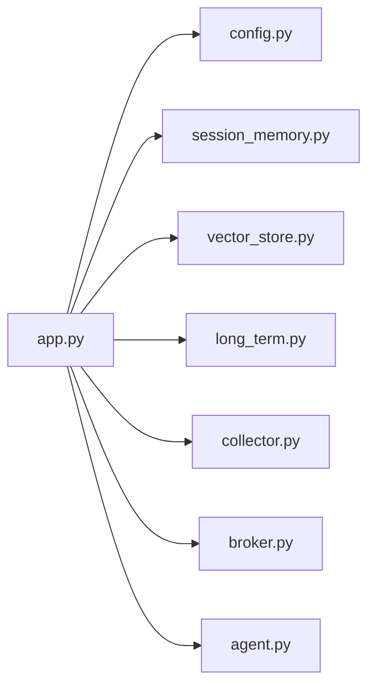

# 迁移失败处理

<cite>
**本文引用的文件**
- [README.md](file://README.md)
- [DATABASE.md](file://data/DATABASE.md)
- [app.py](file://backend/app.py)
- [config.py](file://backend/config.py)
- [long_term.py](file://backend/memory/long_term.py)
- [session_memory.py](file://backend/memory/session_memory.py)
- [vector_store.py](file://backend/memory/vector_store.py)
- [agent.py](file://backend/services/agent.py)
- [broker.py](file://backend/services/broker.py)
- [collector.py](file://backend/services/collector.py)
- [debug_client.py](file://deprecated/debug_client.py)
</cite>

## 目录
1. [简介](#简介)
2. [项目结构](#项目结构)
3. [核心组件](#核心组件)
4. [架构总览](#架构总览)
5. [详细组件分析](#详细组件分析)
6. [依赖分析](#依赖分析)
7. [性能考量](#性能考量)
8. [故障排查指南](#故障排查指南)
9. [结论](#结论)
10. [附录](#附录)

## 简介
本指南聚焦“数据迁移失败处理”，结合仓库现有代码与数据结构，提供一套可落地的备份恢复策略、增量迁移实施方案、断点续传与进度跟踪思路、数据校验方法以及迁移失败的诊断与应急预案。目标是在不破坏生产环境的前提下，安全、可靠地完成数据迁移与回滚。

## 项目结构
项目采用后端（FastAPI）+ 内存层（短期会话、向量检索）+ 长期存储（SQLite）的分层设计。数据主要落盘至 SQLite 数据库文件，同时支持可选的 Redis 与 Chroma 作为短期与向量检索增强。

图表来源
- [app.py:1-220](file://backend/app.py#L1-L220)
- [collector.py:1-284](file://backend/services/collector.py#L1-L284)
- [session_memory.py:1-113](file://backend/memory/session_memory.py#L1-L113)
- [vector_store.py:1-108](file://backend/memory/vector_store.py#L1-L108)
- [long_term.py:1-750](file://backend/memory/long_term.py#L1-L750)
- [broker.py:1-40](file://backend/services/broker.py#L1-L40)
- [agent.py:1-393](file://backend/services/agent.py#L1-L393)

章节来源
- [README.md:21-349](file://README.md#L21-L349)
- [config.py:39-94](file://backend/config.py#L39-L94)

## 核心组件
- 配置与路径：通过配置模块集中管理数据库路径、数据目录、Redis/Chroma 等可选依赖路径，确保迁移前后路径一致。
- 长期存储（SQLite）：负责事件、建议、观众画像、礼物聚合、直播场次、备注等核心表的持久化与重建。
- 短期会话内存：在 Redis 可用时持久化热数据，不可用时退化为进程内队列，保障迁移期间的稳定性。
- 向量检索：优先使用 Chroma，不可用时退化为本地哈希嵌入与轻量相似度匹配。
- 采集与事件处理：WebSocket 采集、事件归一化、提交到事件总线、SSE/WebSocket 推送。
- 提词 Agent：优先调用在线模型，失败时回退本地规则，记录状态便于诊断。

章节来源
- [config.py:39-94](file://backend/config.py#L39-L94)
- [long_term.py:36-155](file://backend/memory/long_term.py#L36-L155)
- [session_memory.py:17-31](file://backend/memory/session_memory.py#L17-L31)
- [vector_store.py:52-83](file://backend/memory/vector_store.py#L52-L83)
- [collector.py:38-98](file://backend/services/collector.py#L38-L98)
- [agent.py:23-54](file://backend/services/agent.py#L23-L54)

## 架构总览
迁移失败处理涉及“备份—增量—校验—回滚”的闭环。下图展示迁移过程中的关键交互与数据流向。

图表来源
- [config.py:39-94](file://backend/config.py#L39-L94)
- [long_term.py:404-454](file://backend/memory/long_term.py#L404-L454)
- [session_memory.py:17-31](file://backend/memory/session_memory.py#L17-L31)
- [vector_store.py:52-83](file://backend/memory/vector_store.py#L52-L83)

## 详细组件分析

### 备份与恢复策略
- 备份对象
  - SQLite 数据库文件：data/live_prompter.db
  - 可选：Chroma 向量目录（如启用）
- 备份方法
  - 文件级备份：直接复制 SQLite 文件与 Chroma 目录
  - 一致性保障：迁移前停止写入或在只读模式下导出
- 恢复方法
  - 停止服务，替换数据库文件与向量目录
  - 启动后验证健康检查与活动会话状态
- 增量备份策略
  - 基于时间戳或事件计数的增量导出
  - 结合数据库事务日志（SQLite WAL）进行增量捕获（如启用）

章节来源
- [DATABASE.md:1-151](file://data/DATABASE.md#L1-L151)
- [config.py:51-53](file://backend/config.py#L51-L53)

### 增量迁移实施方案
- 分阶段迁移
  - 第一阶段：锁定写入，导出全量事件与聚合表
  - 第二阶段：增量导出（基于最后导入时间戳），导入目标库
  - 第三阶段：切换流量，验证一致性
- 进度跟踪
  - 记录已导入的最大事件时间戳或事件 ID
  - 统计各表导入条目数，形成进度报告
- 断点续传
  - 从上次断点继续导入，避免重复
  - 导入过程中保持幂等（INSERT OR REPLACE/UPSERT）
- 并发与一致性
  - 迁移窗口内暂停写入或只读导入
  - 导入完成后一次性切换

（本图为概念性流程，无需图表来源）

### 数据校验方法
- 数据完整性检查
  - 表结构一致性：比对目标库表结构与索引
  - 关键字段校验：事件主键、会话 ID、观众 ID、时间戳等
- 行数对比验证
  - 事件表、建议表、观众画像表、礼物聚合表、直播会话表逐表比对
- 业务逻辑验证
  - 观众画像聚合：评论/礼物/入房计数一致性
  - 直播会话：活动/结束状态、起止时间、事件计数
  - 向量检索：相似度匹配结果在迁移前后保持稳定

章节来源
- [DATABASE.md:16-151](file://data/DATABASE.md#L16-L151)
- [long_term.py:404-454](file://backend/memory/long_term.py#L404-L454)

### 迁移失败诊断与日志分析
- 日志位置与级别
  - 后端日志：标准输出（INFO/ERROR/WARNING）
  - 采集器日志：连接、重连、错误、消息解析失败
  - 提词 Agent：模型调用错误、回退策略、状态变更
- 关键日志点
  - SQLite 写入异常、事务回滚、索引重建失败
  - 向量索引创建/查询异常
  - SSE/WebSocket 订阅队列满导致的消息丢失
- 诊断工具
  - 健康检查接口：确认活动会话与房间号
  - 手动注入事件接口：用于联调与替换采集端
  - 旧版调试客户端：打印原始消息，辅助定位采集端问题

图表来源
- [app.py:104-133](file://backend/app.py#L104-L133)
- [collector.py:140-181](file://backend/services/collector.py#L140-L181)
- [agent.py:73-114](file://backend/services/agent.py#L73-L114)
- [broker.py:28-39](file://backend/services/broker.py#L28-L39)
- [long_term.py:420-454](file://backend/memory/long_term.py#L420-L454)

章节来源
- [app.py:104-133](file://backend/app.py#L104-L133)
- [collector.py:140-181](file://backend/services/collector.py#L140-L181)
- [agent.py:23-54](file://backend/services/agent.py#L23-L54)
- [broker.py:28-39](file://backend/services/broker.py#L28-L39)
- [debug_client.py:68-100](file://deprecated/debug_client.py#L68-L100)

### 风险评估与应急预案
- 风险识别
  - 写入冲突：迁移窗口内写入导致数据不一致
  - 索引重建失败：大表重建耗时长，影响可用性
  - 向量索引不可用：Chroma 缺失导致检索能力退化
  - 采集中断：WebSocket 连接异常导致事件丢失
- 应急预案
  - 快速回滚：保留备份文件，一键替换回滚
  - 降级运行：禁用可选依赖（Redis/Chroma），仅保留 SQLite
  - 限流与隔离：迁移窗口内限制写入，使用只读副本
  - 监控告警：设置阈值（导入耗时、队列积压、错误率）

章节来源
- [config.py:51-53](file://backend/config.py#L51-L53)
- [vector_store.py:13-16](file://backend/memory/vector_store.py#L13-L16)
- [collector.py:61-78](file://backend/services/collector.py#L61-L78)

## 依赖分析
- 组件耦合
  - app.py 依赖配置、内存层、长期存储、事件总线、采集器与 Agent
  - LongTermStore 依赖 SQLite，内部包含索引与重建逻辑
  - SessionMemory/VectorMemory 依赖可选外部库（Redis/Chroma）
- 外部依赖
  - SQLite：本地文件型数据库，迁移成本低
  - Redis：可选，用于短期会话缓存
  - Chroma：可选，用于向量检索

图表来源
- [app.py:1-220](file://backend/app.py#L1-L220)
- [config.py:39-94](file://backend/config.py#L39-L94)
- [session_memory.py:1-113](file://backend/memory/session_memory.py#L1-L113)
- [vector_store.py:1-108](file://backend/memory/vector_store.py#L1-L108)
- [long_term.py:1-750](file://backend/memory/long_term.py#L1-L750)
- [collector.py:1-284](file://backend/services/collector.py#L1-L284)
- [broker.py:1-40](file://backend/services/broker.py#L1-L40)
- [agent.py:1-393](file://backend/services/agent.py#L1-L393)

## 性能考量
- SQLite
  - 大表导入建议使用批量插入与事务包裹
  - 索引在导入后再批量创建，减少写放大
- Redis/Chroma
  - 可选依赖在迁移期间可临时禁用，降低复杂度
- 事件总线
  - 订阅队列满时会丢弃过期队列，应监控并扩容

## 故障排查指南
- 健康检查
  - 使用健康检查接口确认服务状态与活动会话
- 采集问题
  - 查看采集器日志，确认连接、重连、消息解析
  - 使用旧版调试客户端抓取原始消息
- 模型与建议
  - 查看 Agent 状态与错误码，判断是否回退到本地规则
- 存储问题
  - 检查 SQLite 文件权限与磁盘空间
  - 关注索引重建与写入异常日志

章节来源
- [app.py:104-107](file://backend/app.py#L104-L107)
- [collector.py:117-139](file://backend/services/collector.py#L117-L139)
- [agent.py:222-285](file://backend/services/agent.py#L222-L285)
- [debug_client.py:68-100](file://deprecated/debug_client.py#L68-L100)

## 结论
通过文件级备份、分阶段增量导入、断点续传与全面校验，结合健康检查与日志诊断，可在不中断生产的前提下安全完成迁移。遇到失败时，利用回滚预案与降级运行策略，确保系统快速恢复。

## 附录
- 数据库表结构参考：见数据目录下的数据库说明文件
- 配置项参考：数据库路径、数据目录、Redis/Chroma 路径等

章节来源
- [DATABASE.md:1-151](file://data/DATABASE.md#L1-L151)
- [config.py:51-53](file://backend/config.py#L51-L53)