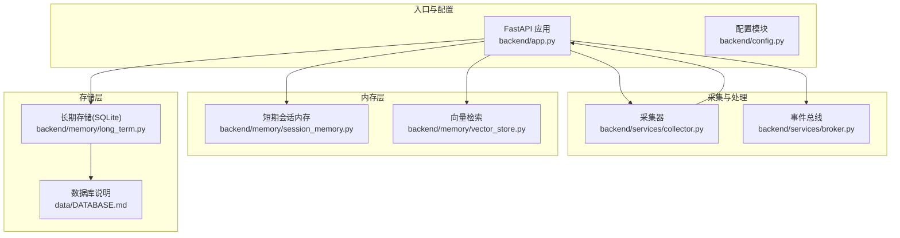
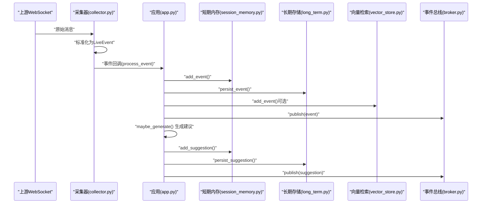
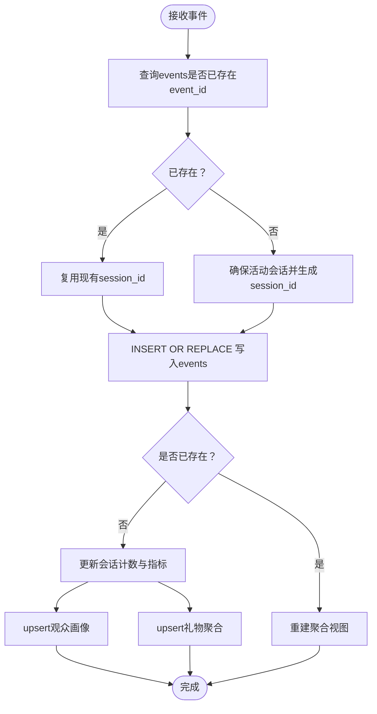
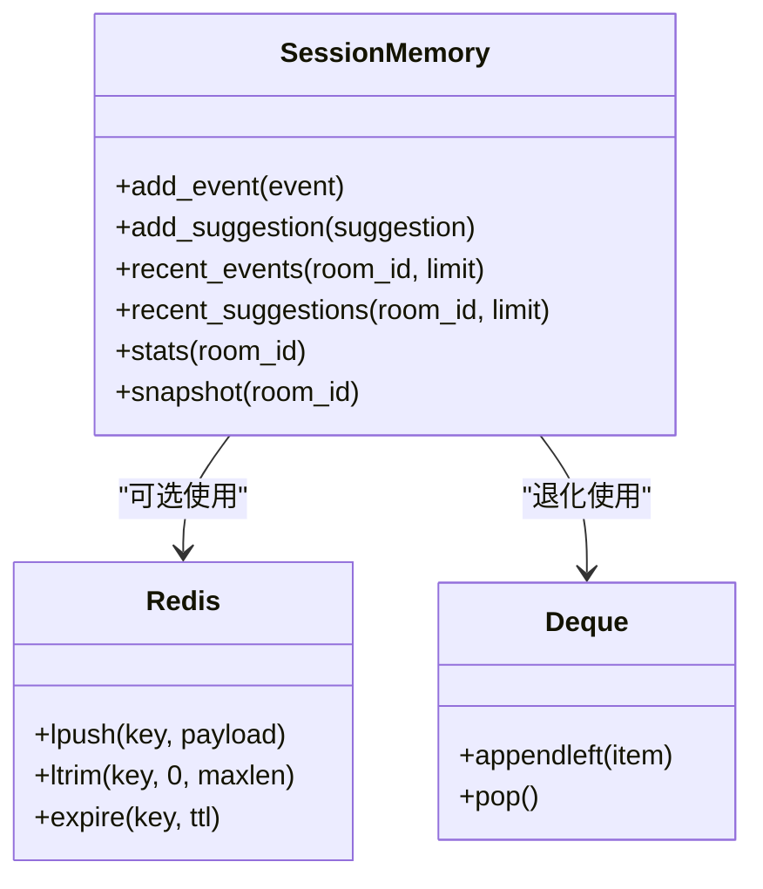
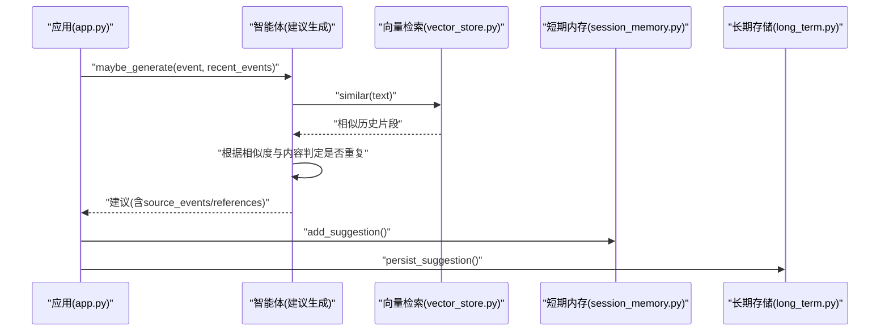
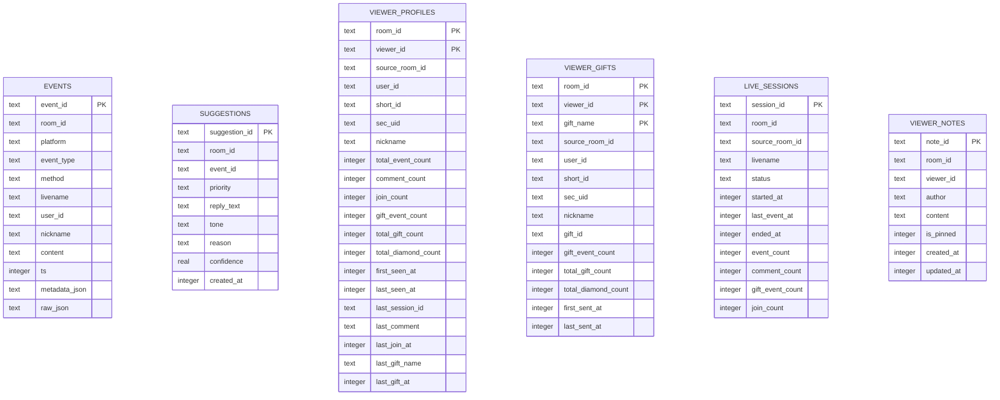
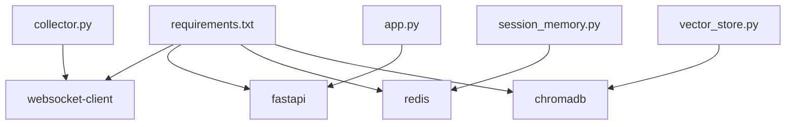

# 重复数据处理

<cite>
**本文引用的文件**
- [backend/app.py](file://backend/app.py)
- [backend/config.py](file://backend/config.py)
- [backend/memory/long_term.py](file://backend/memory/long_term.py)
- [backend/memory/session_memory.py](file://backend/memory/session_memory.py)
- [backend/memory/vector_store.py](file://backend/memory/vector_store.py)
- [backend/services/collector.py](file://backend/services/collector.py)
- [backend/services/broker.py](file://backend/services/broker.py)
- [backend/schemas/live.py](file://backend/schemas/live.py)
- [data/DATABASE.md](file://data/DATABASE.md)
- [requirements.txt](file://requirements.txt)
</cite>

## 目录
1. [简介](#简介)
2. [项目结构](#项目结构)
3. [核心组件](#核心组件)
4. [架构总览](#架构总览)
5. [详细组件分析](#详细组件分析)
6. [依赖分析](#依赖分析)
7. [性能考虑](#性能考虑)
8. [故障排查指南](#故障排查指南)
9. [结论](#结论)
10. [附录](#附录)

## 简介
本指南聚焦于“重复数据处理”，围绕事件ID冲突检测与处理、重复事件过滤与去重策略、重复建议生成控制（建议ID去重、内容相似度检测、重复建议合并）、以及数据去重的数据库实现（INSERT OR REPLACE、ON CONFLICT、唯一约束）展开。同时提供重复数据检测的SQL查询思路与Python代码路径示例，最后给出预防重复数据产生的最佳实践与配置建议。

## 项目结构
后端采用分层设计：入口应用负责路由与事件发布；采集器负责拉取实时事件；短期内存用于高频热数据；长期存储负责持久化与聚合；向量检索用于相似内容检索；Broker负责事件广播。

图表来源
- [backend/app.py:1-220](file://backend/app.py#L1-L220)
- [backend/services/collector.py:1-284](file://backend/services/collector.py#L1-L284)
- [backend/services/broker.py:1-40](file://backend/services/broker.py#L1-L40)
- [backend/memory/session_memory.py:1-113](file://backend/memory/session_memory.py#L1-L113)
- [backend/memory/vector_store.py:1-108](file://backend/memory/vector_store.py#L1-L108)
- [backend/memory/long_term.py:1-750](file://backend/memory/long_term.py#L1-L750)
- [data/DATABASE.md:1-151](file://data/DATABASE.md#L1-L151)

章节来源
- [backend/app.py:1-220](file://backend/app.py#L1-L220)
- [backend/config.py:1-94](file://backend/config.py#L1-L94)
- [data/DATABASE.md:1-151](file://data/DATABASE.md#L1-L151)

## 核心组件
- 事件ID与模型定义：事件ID为主键，建议ID为主键，用于冲突检测与去重。
- 采集器：从上游WebSocket拉取消息，标准化为事件对象，提交至事件循环。
- 长期存储：SQLite持久化，使用INSERT OR REPLACE与ON CONFLICT进行主键冲突处理与聚合更新。
- 短期内存：Redis或本地deque，用于高频热数据窗口管理，避免重复事件在前端重复展示。
- 向量检索：用于相似内容检测，辅助建议去重与合并。
- Broker：事件广播，确保事件与建议在SSE/WebSocket中可靠分发。

章节来源
- [backend/schemas/live.py:1-95](file://backend/schemas/live.py#L1-L95)
- [backend/services/collector.py:1-284](file://backend/services/collector.py#L1-L284)
- [backend/memory/long_term.py:1-750](file://backend/memory/long_term.py#L1-L750)
- [backend/memory/session_memory.py:1-113](file://backend/memory/session_memory.py#L1-L113)
- [backend/memory/vector_store.py:1-108](file://backend/memory/vector_store.py#L1-L108)
- [backend/services/broker.py:1-40](file://backend/services/broker.py#L1-L40)

## 架构总览
事件从采集器进入，经应用层处理后写入短期内存、长期存储与向量库，并通过Broker广播。重复数据处理贯穿采集、入库、聚合与展示各环节。

图表来源
- [backend/services/collector.py:145-284](file://backend/services/collector.py#L145-L284)
- [backend/app.py:61-78](file://backend/app.py#L61-L78)
- [backend/memory/session_memory.py:42-84](file://backend/memory/session_memory.py#L42-L84)
- [backend/memory/long_term.py:420-454](file://backend/memory/long_term.py#L420-L454)
- [backend/memory/vector_store.py:64-83](file://backend/memory/vector_store.py#L64-L83)
- [backend/services/broker.py:28-39](file://backend/services/broker.py#L28-L39)

## 详细组件分析

### 事件ID冲突检测与处理
- 冲突检测点：长期存储写入前先查询是否存在相同event_id，若存在则复用已有session_id，避免重复插入。
- 处理策略：使用INSERT OR REPLACE写入events表，确保event_id唯一性；若已存在则替换整行，随后触发聚合重建或增量更新。
- 建议ID去重：建议表以suggestion_id为主键，写入时同样使用INSERT OR REPLACE，确保建议ID唯一。

图表来源
- [backend/memory/long_term.py:420-454](file://backend/memory/long_term.py#L420-L454)
- [backend/memory/long_term.py:404-420](file://backend/memory/long_term.py#L404-L420)
- [backend/memory/long_term.py:326-370](file://backend/memory/long_term.py#L326-L370)
- [backend/memory/long_term.py:372-402](file://backend/memory/long_term.py#L372-L402)

章节来源
- [backend/memory/long_term.py:420-454](file://backend/memory/long_term.py#L420-L454)
- [backend/memory/long_term.py:404-420](file://backend/memory/long_term.py#L404-L420)

### 重复事件过滤与去重策略
- 短期内存窗口：短期内存按房间维护事件与建议的双端队列，限制长度并设置TTL，天然过滤重复与过期事件。
- Redis降级：当未配置Redis时，自动退化为本地deque，保持行为一致。
- 展示层去重：前端仅展示最近若干条事件，结合后端SSE/WS推送，避免重复渲染。

图表来源
- [backend/memory/session_memory.py:17-113](file://backend/memory/session_memory.py#L17-L113)

章节来源
- [backend/memory/session_memory.py:17-113](file://backend/memory/session_memory.py#L17-L113)

### 重复建议生成控制
- 建议ID去重：建议表以suggestion_id为主键，写入时使用INSERT OR REPLACE，保证ID唯一。
- 内容相似度检测：向量检索提供相似历史内容，辅助判断是否为重复建议。
- 重复建议合并：建议模型包含source_events与references字段，可用于合并逻辑（例如将相似建议归并到同一建议下）。

图表来源
- [backend/app.py:69-73](file://backend/app.py#L69-L73)
- [backend/memory/vector_store.py:85-108](file://backend/memory/vector_store.py#L85-L108)
- [backend/memory/session_memory.py:54-84](file://backend/memory/session_memory.py#L54-L84)
- [backend/memory/long_term.py:456-466](file://backend/memory/long_term.py#L456-L466)

章节来源
- [backend/memory/long_term.py:456-466](file://backend/memory/long_term.py#L456-L466)
- [backend/memory/vector_store.py:64-108](file://backend/memory/vector_store.py#L64-L108)
- [backend/memory/session_memory.py:54-84](file://backend/memory/session_memory.py#L54-L84)

### 数据去重的数据库实现
- 主键冲突检查：events与suggestions表均以主键唯一；写入前查询event_id/suggestion_id是否存在。
- INSERT OR REPLACE：events与suggestions写入统一使用INSERT OR REPLACE，确保主键冲突时替换整行。
- ON CONFLICT：viewer_profiles与viewer_gifts使用ON CONFLICT子句，按复合主键进行增量更新。
- 唯一约束：events的event_id、suggestions的suggestion_id、viewer_profiles的(room_id, viewer_id)、viewer_gifts的(room_id, viewer_id, gift_name)构成唯一约束。

图表来源
- [backend/memory/long_term.py:54-147](file://backend/memory/long_term.py#L54-L147)

章节来源
- [backend/memory/long_term.py:54-147](file://backend/memory/long_term.py#L54-L147)
- [backend/memory/long_term.py:326-402](file://backend/memory/long_term.py#L326-L402)

## 依赖分析
- 采集器依赖websocket-client，负责连接上游WebSocket并解析消息。
- 应用层依赖FastAPI与CORS中间件，提供HTTP与SSE/WS接口。
- 存储层依赖SQLite，无需额外数据库服务。
- 可选依赖：Redis（短期内存）、Chroma（向量检索）。

图表来源
- [requirements.txt:1-6](file://requirements.txt#L1-L6)
- [backend/services/collector.py:14-14](file://backend/services/collector.py#L14-L14)
- [backend/memory/session_memory.py:11-14](file://backend/memory/session_memory.py#L11-L14)
- [backend/memory/vector_store.py:13-16](file://backend/memory/vector_store.py#L13-L16)

章节来源
- [requirements.txt:1-6](file://requirements.txt#L1-L6)

## 性能考虑
- SQLite写入：INSERT OR REPLACE与ON CONFLICT在小规模数据下开销可控；建议合理设置索引（如events的room_id/ts等），避免全表扫描。
- 向量检索：本地哈希嵌入函数作为降级方案，避免外部依赖；生产场景建议启用Chroma以提升相似度检索性能。
- 短期内存：Redis模式下利用lpush/ltrim/expire实现高效窗口管理；无Redis时本地deque退化，性能略低但可用。
- 广播链路：Broker使用异步队列，注意订阅队列满载时的清理逻辑，避免内存泄漏。

## 故障排查指南
- 事件重复入库：检查events表的event_id是否唯一；确认INSERT OR REPLACE是否正确执行；查看是否触发了聚合重建逻辑。
- 建议重复生成：检查向量相似度阈值与建议ID去重策略；核对source_events/references是否正确合并。
- Redis不可用：短期内存自动退化为本地deque；确认deque长度与TTL设置是否合理。
- WebSocket断连：采集器具备重连机制与ping循环，检查collector_host/port与房间ID配置。

章节来源
- [backend/memory/long_term.py:420-454](file://backend/memory/long_term.py#L420-L454)
- [backend/memory/long_term.py:326-402](file://backend/memory/long_term.py#L326-L402)
- [backend/memory/session_memory.py:17-113](file://backend/memory/session_memory.py#L17-L113)
- [backend/services/collector.py:117-198](file://backend/services/collector.py#L117-L198)

## 结论
本项目通过“采集层标准化+短期内存窗口+长期存储主键去重+向量相似度辅助”的多层策略，有效降低重复数据风险。INSERT OR REPLACE与ON CONFLICT确保主键唯一性与增量聚合；Redis与本地deque保障高频场景下的去重与性能；Broker确保事件与建议可靠分发。建议在生产环境中启用Redis与Chroma，并结合业务阈值优化相似度检测与建议合并策略。

## 附录

### 重复数据检测的SQL查询思路
以下为常见重复检测思路（非具体代码，仅提供查询方向）：
- 检测重复事件ID：按event_id分组，统计出现次数大于1的记录。
- 检测重复建议ID：按suggestion_id分组，统计出现次数大于1的记录。
- 检测重复内容（基于内容与时间窗口）：在指定时间窗口内，按内容聚合，统计重复率。
- 检测重复观众画像：按(room_id, viewer_id)聚合，检查字段变更与异常波动。

章节来源
- [data/DATABASE.md:101-150](file://data/DATABASE.md#L101-L150)

### Python代码示例路径
- 事件写入与去重：[backend/memory/long_term.py:420-454](file://backend/memory/long_term.py#L420-L454)
- 建议写入与去重：[backend/memory/long_term.py:456-466](file://backend/memory/long_term.py#L456-L466)
- 观众画像ON CONFLICT更新：[backend/memory/long_term.py:326-370](file://backend/memory/long_term.py#L326-L370)
- 礼物聚合ON CONFLICT更新：[backend/memory/long_term.py:372-402](file://backend/memory/long_term.py#L372-L402)
- 向量相似度检索：[backend/memory/vector_store.py:85-108](file://backend/memory/vector_store.py#L85-L108)
- 短期内存窗口管理：[backend/memory/session_memory.py:42-84](file://backend/memory/session_memory.py#L42-L84)

### 最佳实践与配置建议
- 配置项
  - ROOM_ID：确保采集器连接正确的房间。
  - REDIS_URL：启用Redis以提升短期内存性能与可靠性。
  - LLM_MODE/LLM_BASE_URL/LLM_MODEL：建议与向量检索配合，提升建议质量与去重效果。
- 行为建议
  - 在采集器层对重复消息进行去重（如基于消息ID），减少下游压力。
  - 对建议生成增加相似度阈值与时间窗口，避免短时间内重复建议。
  - 定期对events与suggestions表进行去重校验与修复。
  - 使用索引优化常用查询（如events的room_id/ts、suggestions的room_id等）。

章节来源
- [backend/config.py:40-94](file://backend/config.py#L40-L94)
- [backend/services/collector.py:225-284](file://backend/services/collector.py#L225-L284)
- [backend/memory/long_term.py:183-195](file://backend/memory/long_term.py#L183-L195)