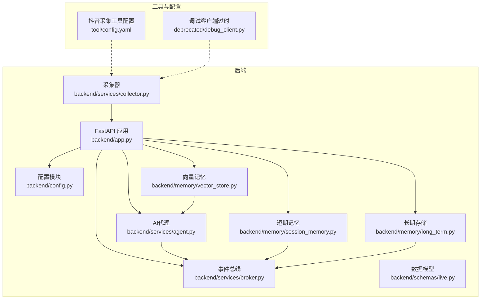
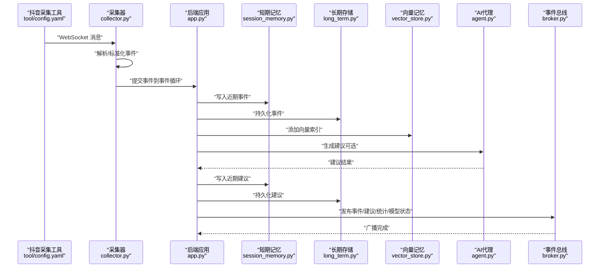
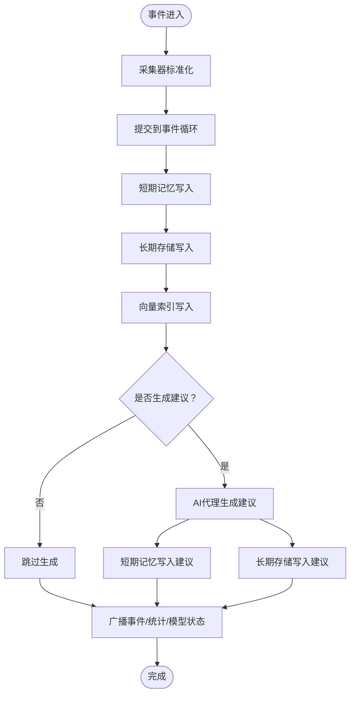
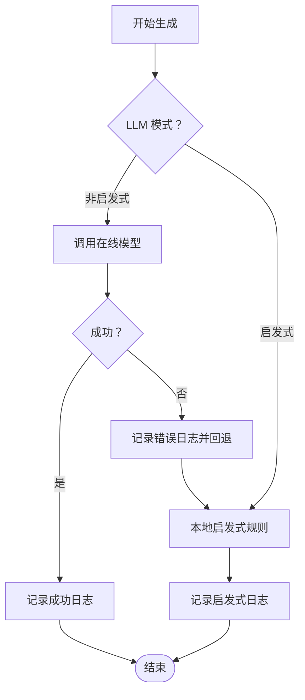
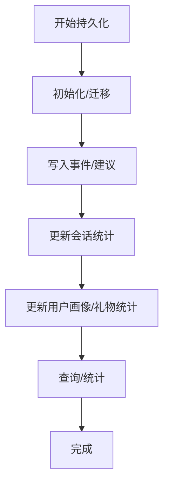
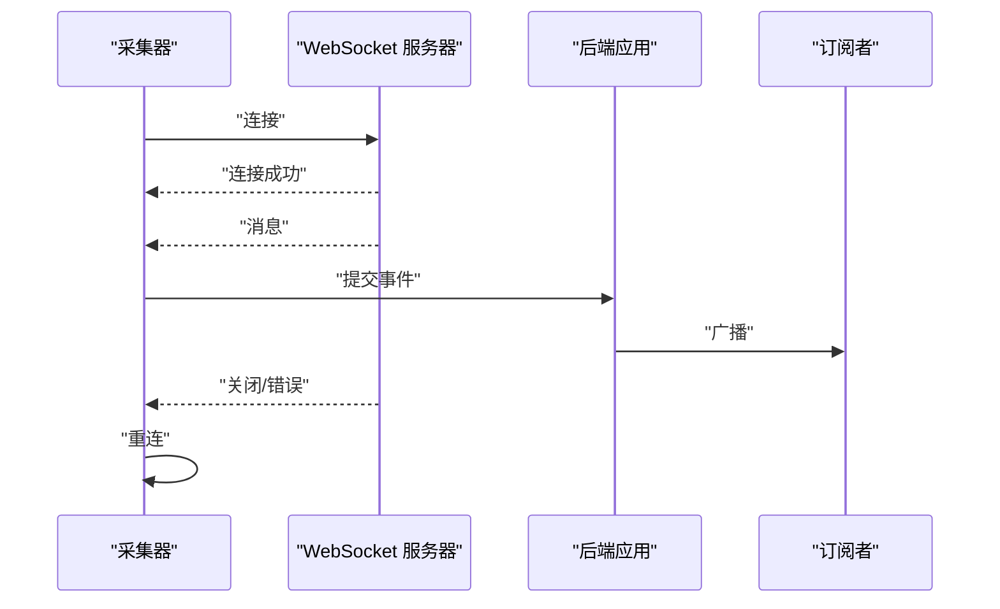
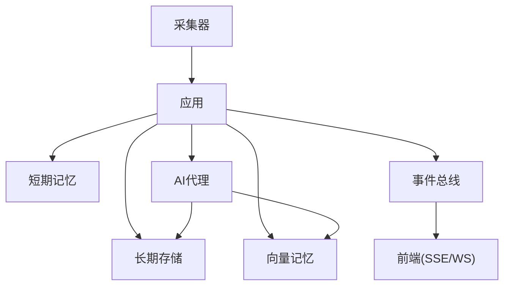

# 日志分析

<cite>
**本文引用的文件**
- [backend/app.py](file://backend/app.py)
- [backend/config.py](file://backend/config.py)
- [backend/services/collector.py](file://backend/services/collector.py)
- [backend/services/agent.py](file://backend/services/agent.py)
- [backend/memory/long_term.py](file://backend/memory/long_term.py)
- [backend/memory/session_memory.py](file://backend/memory/session_memory.py)
- [backend/memory/vector_store.py](file://backend/memory/vector_store.py)
- [backend/services/broker.py](file://backend/services/broker.py)
- [backend/schemas/live.py](file://backend/schemas/live.py)
- [deprecated/debug_client.py](file://deprecated/debug_client.py)
- [tool/config.yaml](file://tool/config.yaml)
- [README.md](file://README.md)
- [USAGE.md](file://USAGE.md)
</cite>

## 目录
1. [简介](#简介)
2. [项目结构](#项目结构)
3. [核心组件](#核心组件)
4. [架构总览](#架构总览)
5. [详细组件分析](#详细组件分析)
6. [依赖分析](#依赖分析)
7. [性能考虑](#性能考虑)
8. [故障排查指南](#故障排查指南)
9. [结论](#结论)
10. [附录](#附录)

## 简介
本指南聚焦于该抖音直播实时提词系统的日志分析与调试实践，覆盖以下方面：
- 如何配置不同级别的日志输出（DEBUG/INFO/WARNING/ERROR）
- 关键日志信息的识别与分析方法（事件处理流程、AI模型调用、数据库操作、WebSocket连接）
- 错误堆栈分析技巧（异常类型识别、调用链分析、错误上下文提取）
- 时间序列日志分析方法（事件时间戳分析、性能趋势、错误频率统计）
- 日志文件位置与轮转配置（日志目录结构、清理策略、备份方法）
- 常见错误模式识别与快速定位

## 项目结构
该项目采用后端（FastAPI）、内存层（短期/长期/向量）、服务层（采集/代理/代理）与前端的分层组织。日志主要分布在后端入口、采集器、AI代理、内存层与事件总线等模块。

图表来源
- [backend/app.py:1-220](file://backend/app.py#L1-L220)
- [backend/config.py:1-94](file://backend/config.py#L1-L94)
- [backend/services/broker.py:1-40](file://backend/services/broker.py#L1-L40)
- [backend/services/collector.py:1-284](file://backend/services/collector.py#L1-L284)
- [backend/services/agent.py:1-393](file://backend/services/agent.py#L1-L393)
- [backend/memory/session_memory.py:1-113](file://backend/memory/session_memory.py#L1-L113)
- [backend/memory/long_term.py:1-750](file://backend/memory/long_term.py#L1-L750)
- [backend/memory/vector_store.py:1-108](file://backend/memory/vector_store.py#L1-L108)
- [backend/schemas/live.py:1-95](file://backend/schemas/live.py#L1-L95)
- [tool/config.yaml:1-16](file://tool/config.yaml#L1-L16)
- [deprecated/debug_client.py:1-139](file://deprecated/debug_client.py#L1-L139)

章节来源
- [README.md:21-349](file://README.md#L21-L349)
- [USAGE.md:1-256](file://USAGE.md#L1-L256)

## 核心组件
- 后端应用与日志初始化：后端入口在应用启动时设置基础日志级别与格式，便于全局输出统一风格的日志。
- 采集器：负责连接本地抖音采集工具的 WebSocket，进行消息解析、事件标准化与提交到事件循环，同时记录连接、错误、重连等关键日志。
- AI代理：负责构建建议生成上下文、调用在线模型或回退到本地规则，并记录模型状态、错误与成功生成的日志。
- 内存层：
  - 短期记忆：优先使用 Redis，否则退化为进程内队列；用于最近事件与建议的缓存。
  - 长期存储：基于 SQLite 的持久化存储，记录事件、建议、用户画像、会话等；用于统计与查询。
  - 向量记忆：优先使用 Chroma 向量库，否则使用本地哈希嵌入的轻量相似度方案。
- 事件总线：在事件处理完成后，将事件、建议、统计与模型状态广播至 SSE/WS 订阅端。
- 数据模型：统一的事件、建议、统计与模型状态结构，便于日志中携带一致的上下文字段。

章节来源
- [backend/app.py:22-23](file://backend/app.py#L22-L23)
- [backend/services/collector.py:20](file://backend/services/collector.py#L20)
- [backend/services/agent.py:20](file://backend/services/agent.py#L20)
- [backend/memory/session_memory.py:17-31](file://backend/memory/session_memory.py#L17-L31)
- [backend/memory/long_term.py:36](file://backend/memory/long_term.py#L36)
- [backend/memory/vector_store.py:52](file://backend/memory/vector_store.py#L52)
- [backend/services/broker.py:10](file://backend/services/broker.py#L10)
- [backend/schemas/live.py:29-95](file://backend/schemas/live.py#L29-L95)

## 架构总览
下图展示了从采集到前端推送的端到端事件流，以及各环节的日志落点与关键信息。

图表来源
- [backend/services/collector.py:117-160](file://backend/services/collector.py#L117-L160)
- [backend/app.py:61-78](file://backend/app.py#L61-L78)
- [backend/memory/session_memory.py:42-64](file://backend/memory/session_memory.py#L42-L64)
- [backend/memory/long_term.py:420-454](file://backend/memory/long_term.py#L420-L454)
- [backend/memory/vector_store.py:64-83](file://backend/memory/vector_store.py#L64-L83)
- [backend/services/agent.py:73-94](file://backend/services/agent.py#L73-L94)
- [backend/services/broker.py:28](file://backend/services/broker.py#L28)

## 详细组件分析

### 日志级别配置与输出
- 全局日志初始化：后端应用启动时设置基础日志级别与格式，便于统一输出 INFO 级别及以上的日志。
- 采集器日志：使用模块级 logger 输出连接、错误、重连、消息解析失败等日志。
- AI代理日志：记录模型调用错误、回退策略、成功生成等日志。
- 内存层日志：短期/长期/向量层在关键路径上输出警告或异常日志（如 Redis 不可用、Chroma 缺失、SQLite 异常等）。
- 事件总线日志：在广播过程中对队列溢出等异常进行清理与记录。

章节来源
- [backend/app.py:22-23](file://backend/app.py#L22-L23)
- [backend/services/collector.py:20](file://backend/services/collector.py#L20)
- [backend/services/agent.py:20](file://backend/services/agent.py#L20)
- [backend/memory/session_memory.py:17-31](file://backend/memory/session_memory.py#L17-L31)
- [backend/memory/long_term.py:36](file://backend/memory/long_term.py#L36)
- [backend/memory/vector_store.py:52](file://backend/memory/vector_store.py#L52)
- [backend/services/broker.py:28](file://backend/services/broker.py#L28)

### 事件处理流程日志
- 关键路径：采集器标准化事件 → 提交到事件循环 → 写入短期记忆 → 持久化到长期存储 → 添加向量索引 → 生成建议（可选） → 写入短期/长期记忆 → 广播事件/建议/统计/模型状态。
- 日志要点：
  - 采集器：连接成功、消息解析失败、WebSocket 错误、重连延迟、事件提交结果。
  - 应用：事件处理完成、统计计算、模型状态更新。
  - 内存层：Redis/Chroma 可用性提示、SQLite 写入与查询结果。
  - 代理：模型调用成功/失败、回退策略、建议字段规范化。
  - 总线：广播成功/队列溢出清理。

图表来源
- [backend/services/collector.py:145-160](file://backend/services/collector.py#L145-L160)
- [backend/app.py:61-78](file://backend/app.py#L61-L78)
- [backend/memory/session_memory.py:42-64](file://backend/memory/session_memory.py#L42-L64)
- [backend/memory/long_term.py:420-454](file://backend/memory/long_term.py#L420-L454)
- [backend/memory/vector_store.py:64-83](file://backend/memory/vector_store.py#L64-L83)
- [backend/services/agent.py:73-94](file://backend/services/agent.py#L73-L94)
- [backend/services/broker.py:28](file://backend/services/broker.py#L28)

章节来源
- [backend/app.py:61-78](file://backend/app.py#L61-L78)
- [backend/services/collector.py:145-160](file://backend/services/collector.py#L145-L160)
- [backend/services/agent.py:73-94](file://backend/services/agent.py#L73-L94)
- [backend/memory/session_memory.py:42-64](file://backend/memory/session_memory.py#L42-L64)
- [backend/memory/long_term.py:420-454](file://backend/memory/long_term.py#L420-L454)
- [backend/memory/vector_store.py:64-83](file://backend/memory/vector_store.py#L64-L83)
- [backend/services/broker.py:28](file://backend/services/broker.py#L28)

### AI模型调用日志
- 日志类别：
  - 成功：记录建议生成、模型名称、优先级、置信度等。
  - 失败：HTTP 错误、网络错误、超时、JSON 解析失败、OS/系统错误、意外异常等，并标记模型状态。
  - 回退：当在线模型失败时，记录回退到启发式规则的日志。
- 关键字段：房间号、事件 ID、模型名、优先级、置信度、错误原因等，便于后续分析与审计。

图表来源
- [backend/services/agent.py:96-114](file://backend/services/agent.py#L96-L114)
- [backend/services/agent.py:183-330](file://backend/services/agent.py#L183-L330)

章节来源
- [backend/services/agent.py:96-114](file://backend/services/agent.py#L96-L114)
- [backend/services/agent.py:183-330](file://backend/services/agent.py#L183-L330)

### 数据库操作日志
- 长期存储（SQLite）：
  - 初始化表结构、索引、列迁移与回填。
  - 事件写入、会话更新、用户画像与礼物统计更新。
  - 查询最近事件/建议、统计、会话、用户详情等。
- 日志要点：建表/索引创建、写入/更新成功与否、查询结果数量、会话状态变更。

图表来源
- [backend/memory/long_term.py:50-155](file://backend/memory/long_term.py#L50-L155)
- [backend/memory/long_term.py:420-454](file://backend/memory/long_term.py#L420-L454)
- [backend/memory/long_term.py:467-521](file://backend/memory/long_term.py#L467-L521)

章节来源
- [backend/memory/long_term.py:50-155](file://backend/memory/long_term.py#L50-L155)
- [backend/memory/long_term.py:420-454](file://backend/memory/long_term.py#L420-L454)
- [backend/memory/long_term.py:467-521](file://backend/memory/long_term.py#L467-L521)

### WebSocket 连接日志
- 采集器：连接建立、消息接收、错误与关闭、心跳发送、重连机制。
- 后端：WebSocket 接入、订阅队列管理、消息广播、断开清理。
- 日志要点：连接成功/失败、消息类型、错误码/消息、心跳失败、重连延迟、广播队列溢出清理。

图表来源
- [backend/services/collector.py:117-181](file://backend/services/collector.py#L117-L181)
- [backend/app.py:209-220](file://backend/app.py#L209-L220)
- [backend/services/broker.py:16-40](file://backend/services/broker.py#L16-L40)

章节来源
- [backend/services/collector.py:117-181](file://backend/services/collector.py#L117-L181)
- [backend/app.py:209-220](file://backend/app.py#L209-L220)
- [backend/services/broker.py:16-40](file://backend/services/broker.py#L16-L40)

### 时间序列日志分析
- 事件时间戳：事件模型包含毫秒级时间戳，可用于事件序列分析。
- 性能趋势：结合建议生成耗时（代理内部计时）、数据库写入耗时、向量索引写入耗时、WebSocket 广播耗时等。
- 错误频率：按小时/天统计模型错误、网络错误、超时、JSON 解析失败等的出现频次，识别异常高峰。

章节来源
- [backend/schemas/live.py:40](file://backend/schemas/live.py#L40)
- [backend/services/agent.py:183-330](file://backend/services/agent.py#L183-L330)
- [backend/memory/long_term.py:420-454](file://backend/memory/long_term.py#L420-L454)
- [backend/memory/vector_store.py:64-83](file://backend/memory/vector_store.py#L64-L83)
- [backend/services/broker.py:28](file://backend/services/broker.py#L28)

### 日志文件位置与轮转配置
- 后端日志：当前未配置专用日志文件输出，建议通过命令行重定向或集成第三方日志库实现文件输出与轮转。
- 调试客户端日志：将原始消息打印并写入 logs/ 目录下的带时间戳日志文件，便于离线分析。
- 建议：
  - 使用 Python logging.handlers.RotatingFileHandler 或第三方库（如 watchdog）实现按大小/时间轮转。
  - 为不同模块设置独立 handler，区分 DEBUG/INFO/WARNING/ERROR。
  - 保留关键上下文字段（房间号、事件 ID、模型名、错误码）以便检索。

章节来源
- [deprecated/debug_client.py:36-66](file://deprecated/debug_client.py#L36-L66)
- [backend/app.py:22-23](file://backend/app.py#L22-L23)

## 依赖分析
- 组件耦合：
  - 采集器与应用：通过事件循环与回调连接，日志在采集器侧输出。
  - 应用与内存层：短期/长期/向量层在应用处理流程中被调用，日志在各自模块输出。
  - AI代理与向量/长期存储：代理依赖向量检索与用户画像，日志在代理与存储层输出。
  - 事件总线：作为广播枢纽，日志集中在发布与订阅管理处。
- 外部依赖：
  - Redis：可选，用于短期记忆；缺失时退化为进程内队列。
  - Chroma：可选，用于向量检索；缺失时使用本地哈希嵌入方案。
  - WebSocket 客户端：用于采集器连接本地采集工具。

图表来源
- [backend/services/collector.py:61-78](file://backend/services/collector.py#L61-L78)
- [backend/app.py:61-78](file://backend/app.py#L61-L78)
- [backend/memory/session_memory.py:17-31](file://backend/memory/session_memory.py#L17-L31)
- [backend/memory/long_term.py:36](file://backend/memory/long_term.py#L36)
- [backend/memory/vector_store.py:52](file://backend/memory/vector_store.py#L52)
- [backend/services/agent.py:23-37](file://backend/services/agent.py#L23-L37)
- [backend/services/broker.py:10](file://backend/services/broker.py#L10)

章节来源
- [backend/services/collector.py:61-78](file://backend/services/collector.py#L61-L78)
- [backend/app.py:61-78](file://backend/app.py#L61-L78)
- [backend/memory/session_memory.py:17-31](file://backend/memory/session_memory.py#L17-L31)
- [backend/memory/long_term.py:36](file://backend/memory/long_term.py#L36)
- [backend/memory/vector_store.py:52](file://backend/memory/vector_store.py#L52)
- [backend/services/agent.py:23-37](file://backend/services/agent.py#L23-L37)
- [backend/services/broker.py:10](file://backend/services/broker.py#L10)

## 性能考虑
- 日志开销控制：避免在高频路径中输出大量 DEBUG 信息；必要时将 DEBUG 降级为 INFO 或按需开启。
- I/O 优化：批量写入数据库与向量索引，减少事务次数；合理设置 Redis TTL 与队列长度。
- 广播效率：监控订阅队列长度，避免队列溢出导致清理；必要时增加并发消费者。
- 模型调用：设置合理的超时与重试策略，记录耗时分布，识别慢调用。

## 故障排查指南
- 页面无建议：
  - 检查采集工具是否运行、房间号是否正确、后端是否已重启。
  - 查看采集器连接日志与消息解析日志。
- 顶部显示回退：
  - 检查模型 API Key、网络连通性、超时与限流情况。
  - 查看代理的 HTTP/网络/超时/JSON 解析错误日志。
- 顶部显示启发式：
  - 检查配置中的 LLM_MODE 是否为 heuristic。
- 前端无法打开：
  - 检查前端脚本是否正常启动、端口占用情况。
- 后端启动但无数据写入：
  - 检查采集器连接日志、事件提交结果、数据库写入日志。
- WebSocket 断开/重连频繁：
  - 查看重连延迟、心跳发送失败、关闭码与消息。
- 数据库异常：
  - 检查建表/索引创建、写入/更新、查询结果与会话状态变更日志。

章节来源
- [USAGE.md:198-240](file://USAGE.md#L198-L240)
- [backend/services/collector.py:117-181](file://backend/services/collector.py#L117-L181)
- [backend/services/agent.py:232-285](file://backend/services/agent.py#L232-L285)
- [backend/memory/long_term.py:50-155](file://backend/memory/long_term.py#L50-L155)

## 结论
通过以上日志分析与调试实践，可以有效定位事件处理链路中的瓶颈与异常，提升系统的可观测性与稳定性。建议在生产环境中引入结构化日志与集中化日志收集，配合告警与可视化仪表盘，持续优化性能与用户体验。

## 附录
- 关键日志字段清单（用于检索与聚合）：
  - 采集器：房间号、消息类型、错误码、重连延迟、消息解析失败。
  - AI代理：房间号、事件 ID、模型名、优先级、置信度、错误原因、回退标志。
  - 内存层：模块类型（短期/长期/向量）、操作类型（写入/查询/更新）、结果状态。
  - 事件总线：广播队列长度、溢出清理数量。
- 常见错误模式与定位：
  - 模型 HTTP 错误：检查状态码与响应体，定位鉴权或配额问题。
  - 网络错误：检查 DNS、防火墙、代理与超时设置。
  - 超时：调整超时阈值，观察慢查询与慢调用。
  - JSON 解析失败：检查模型返回格式与清洗逻辑。
  - Redis/Chroma 不可用：确认依赖安装与路径配置，启用退化策略。