# 紧急情况处理

<cite>
**本文档引用的文件**
- [README.md](file://README.md)
- [USAGE.md](file://USAGE.md)
- [backend/app.py](file://backend/app.py)
- [backend/config.py](file://backend/config.py)
- [backend/memory/session_memory.py](file://backend/memory/session_memory.py)
- [backend/memory/long_term.py](file://backend/memory/long_term.py)
- [backend/memory/vector_store.py](file://backend/memory/vector_store.py)
- [backend/services/agent.py](file://backend/services/agent.py)
- [backend/services/broker.py](file://backend/services/broker.py)
- [backend/services/collector.py](file://backend/services/collector.py)
- [data/DATABASE.md](file://data/DATABASE.md)
- [start_all.ps1](file://start_all.ps1)
- [start_backend_qwen.ps1](file://start_backend_qwen.ps1)
</cite>

## 目录
1. [简介](#简介)
2. [项目结构](#项目结构)
3. [核心组件](#核心组件)
4. [架构概览](#架构概览)
5. [详细组件分析](#详细组件分析)
6. [应急处理流程](#应急处理流程)
7. [系统降级策略](#系统降级策略)
8. [故障隔离方法](#故障隔离方法)
9. [恢复验证步骤](#恢复验证步骤)
10. [预防性维护](#预防性维护)
11. [故障恢复指南](#故障恢复指南)
12. [附录](#附录)

## 简介

本指南针对抖音直播场景的实时提词系统提供全面的紧急情况处理和快速恢复方案。该系统采用多层降级设计，确保在各种故障情况下仍能保持基本功能运行。

系统主要特点：
- **可选依赖**：Redis、Chroma、在线模型均为可选组件
- **自动降级**：各组件故障时自动切换到备用模式
- **进程内内存**：短期记忆可在无Redis时使用进程内存
- **文本相似**：向量检索不可用时使用轻量文本相似度
- **启发式规则**：AI模型不可用时使用本地规则

## 项目结构

系统采用模块化设计，主要分为以下层次：

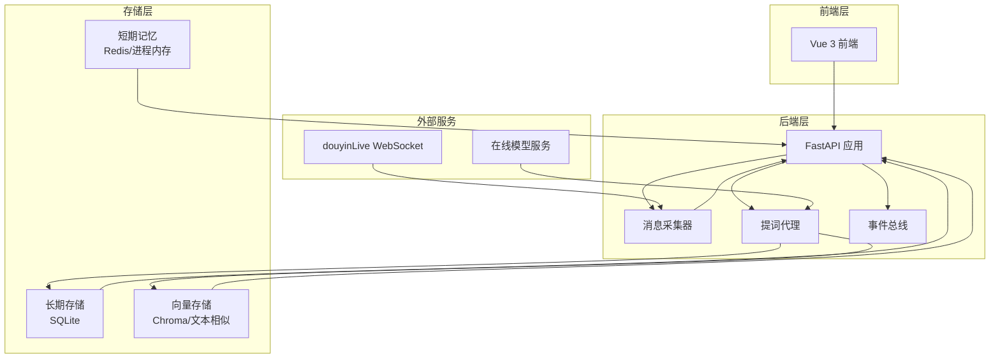

**图表来源**
- [backend/app.py:1-220](file://backend/app.py#L1-L220)
- [backend/config.py:1-94](file://backend/config.py#L1-L94)

**章节来源**
- [README.md:21-34](file://README.md#L21-L34)
- [backend/app.py:1-220](file://backend/app.py#L1-L220)

## 核心组件

### 应用入口与生命周期管理

应用入口负责组件初始化、生命周期管理和健康检查：

- **组件初始化**：Redis短期记忆、SQLite长期存储、Chroma向量存储、AI代理
- **生命周期管理**：启动时启动消息采集器，关闭时清理资源
- **健康检查**：提供服务状态和房间信息

### 配置管理系统

配置系统支持环境变量和.env文件，提供灵活的部署选项：

- **Redis配置**：可选的Redis连接URL
- **存储配置**：SQLite数据库路径和Chroma目录
- **模型配置**：支持多种模型模式（heuristic、qwen、openai）
- **采集配置**：WebSocket连接参数

**章节来源**
- [backend/app.py:25-30](file://backend/app.py#L25-L30)
- [backend/config.py:40-94](file://backend/config.py#L40-L94)

## 架构概览

系统采用事件驱动架构，通过事件总线实现组件解耦：

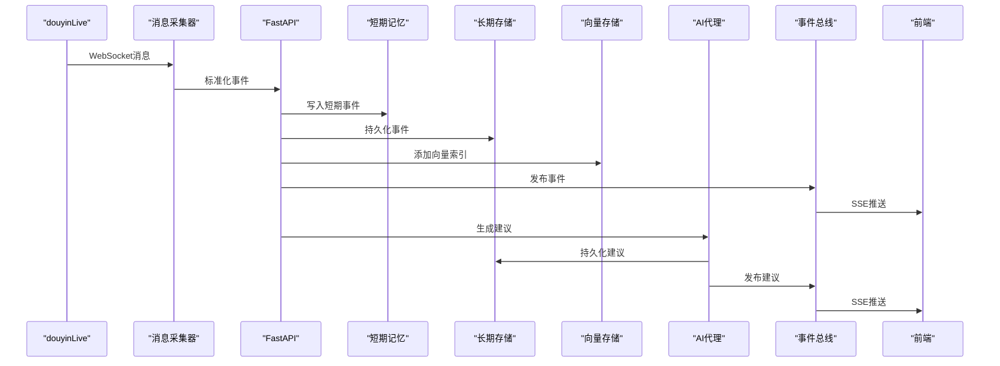

**图表来源**
- [backend/app.py:61-78](file://backend/app.py#L61-L78)
- [backend/services/collector.py:145-159](file://backend/services/collector.py#L145-L159)

## 详细组件分析

### 短期记忆系统（SessionMemory）

短期记忆系统提供实时事件缓存，支持Redis和进程内存两种模式：

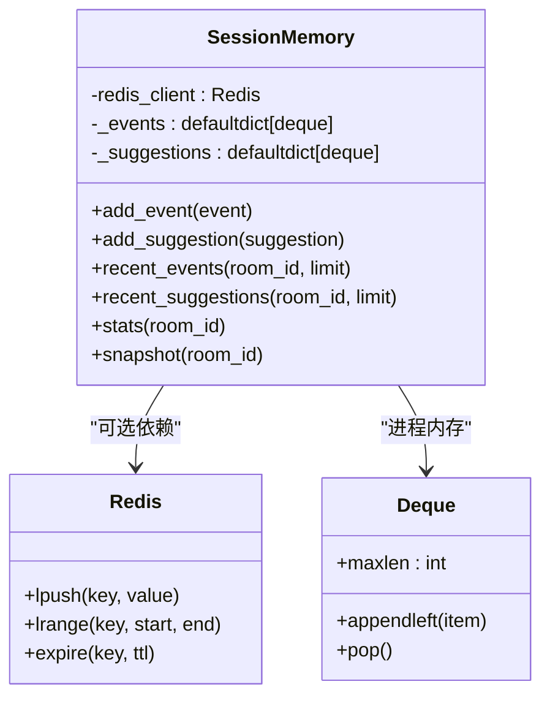

**图表来源**
- [backend/memory/session_memory.py:17-113](file://backend/memory/session_memory.py#L17-L113)

#### 自动降级机制

- **Redis可用**：使用Redis进行高性能缓存
- **Redis不可用**：自动降级到进程内deque
- **TTL管理**：Redis模式下支持过期时间控制

**章节来源**
- [backend/memory/session_memory.py:17-65](file://backend/memory/session_memory.py#L17-L65)

### 长期存储系统（LongTermStore）

SQLite长期存储提供完整的数据持久化：

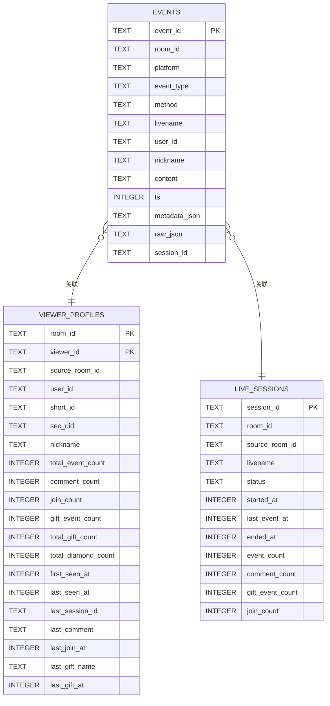

**图表来源**
- [backend/memory/long_term.py:54-148](file://backend/memory/long_term.py#L54-L148)

#### 数据完整性保障

- **事务处理**：使用SQLite事务确保数据一致性
- **索引优化**：为常用查询建立索引
- **字段扩展**：动态添加缺失字段并回填数据
- **会话管理**：自动创建和结束直播会话

**章节来源**
- [backend/memory/long_term.py:36-155](file://backend/memory/long_term.py#L36-L155)

### 向量存储系统（VectorMemory）

向量存储提供相似事件检索功能：

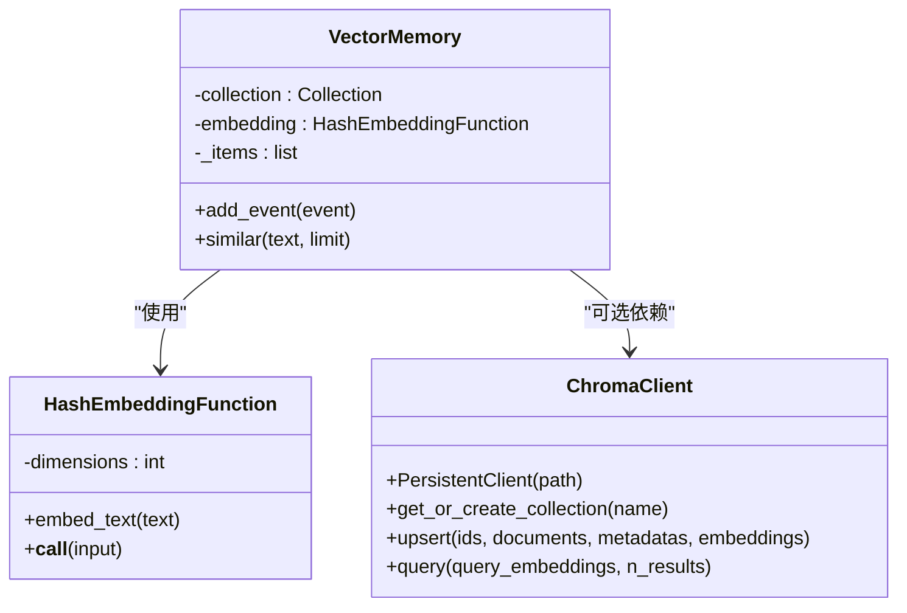

**图表来源**
- [backend/memory/vector_store.py:52-108](file://backend/memory/vector_store.py#L52-L108)

#### 智能降级策略

- **Chroma可用**：使用持久化向量库进行精确检索
- **Chroma不可用**：使用哈希嵌入函数和文本相似度
- **内存限制**：进程内模式限制存储数量

**章节来源**
- [backend/memory/vector_store.py:52-108](file://backend/memory/vector_store.py#L52-L108)

### AI代理系统（LivePromptAgent）

AI代理提供智能提词建议生成功能：

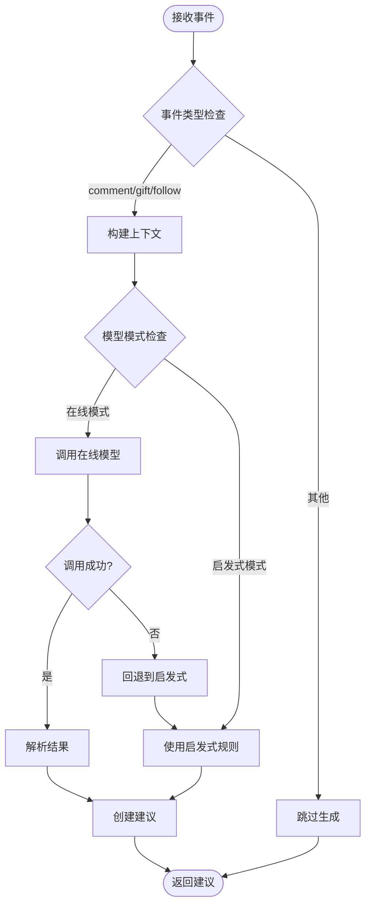

**图表来源**
- [backend/services/agent.py:73-114](file://backend/services/agent.py#L73-L114)

#### 多层容错机制

- **在线模型**：优先使用在线模型服务
- **网络异常**：捕获各种网络和超时异常
- **模型失败**：自动回退到本地启发式规则
- **状态监控**：实时记录模型运行状态

**章节来源**
- [backend/services/agent.py:23-114](file://backend/services/agent.py#L23-L114)

## 应急处理流程

### 快速重启步骤

#### 完整系统重启

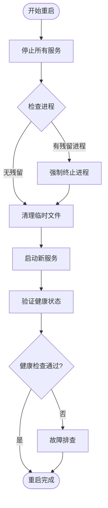

#### 分步重启流程

1. **停止后端服务**
   ```powershell
   # 停止后端进程
   taskkill /F /IM python.exe
   ```

2. **重启消息采集器**
   ```powershell
   # 启动采集器
   .\tool\douyinLive-windows-amd64.exe
   ```

3. **启动后端服务**
   ```powershell
   # 启动FastAPI服务
   python -m uvicorn backend.app:app --host 127.0.0.1 --port 8010 --reload
   ```

4. **启动前端服务**
   ```powershell
   # 启动Vue前端
   cd frontend && npm run dev
   ```

**章节来源**
- [start_all.ps1:11-17](file://start_all.ps1#L11-L17)
- [start_backend_qwen.ps1:11-12](file://start_backend_qwen.ps1#L11-L12)

### 降级运行模式

#### Redis不可用时的进程内内存模式

当Redis不可用时，系统自动切换到进程内内存模式：

1. **检测机制**：导入Redis失败时自动检测
2. **降级策略**：使用collections.deque替代Redis
3. **功能限制**：失去分布式共享和持久化特性
4. **性能影响**：单进程内存限制

#### Chroma不可用时的文本相似模式

当Chroma不可用时，系统使用轻量文本相似度：

1. **哈希嵌入**：使用SHA256哈希生成向量
2. **文本匹配**：基于词汇重叠度计算相似度
3. **性能优化**：限制存储数量，保持响应速度
4. **准确性权衡**：精度降低但功能保持

#### AI模型不可用时的启发式规则模式

当在线模型不可用时，系统完全依赖本地规则：

1. **规则引擎**：预定义的回复模板和逻辑
2. **上下文感知**：结合用户画像和历史记录
3. **优先级管理**：不同事件类型的处理优先级
4. **质量保证**：稳定的输出质量和一致性

**章节来源**
- [backend/memory/session_memory.py:29-30](file://backend/memory/session_memory.py#L29-L30)
- [backend/memory/vector_store.py:60-63](file://backend/memory/vector_store.py#L60-L63)
- [backend/services/agent.py:99-113](file://backend/services/agent.py#L99-L113)

## 系统降级策略

### 组件级降级策略

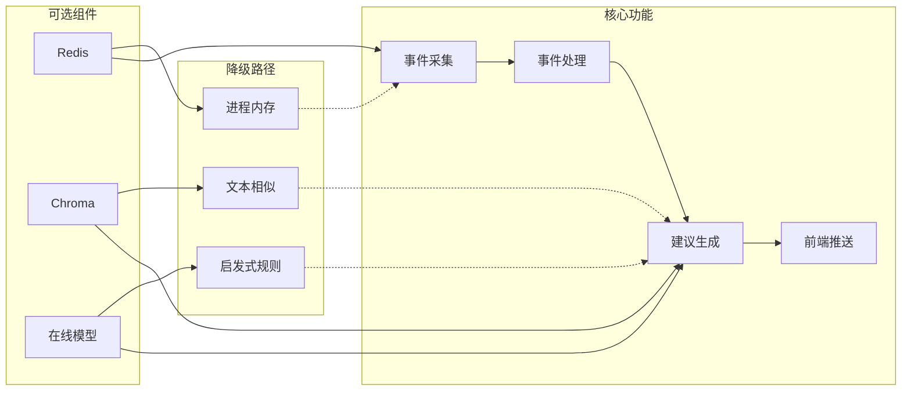

### 状态监控与告警

系统提供多层级状态监控：

1. **健康检查接口**：`/health` 返回服务状态
2. **模型状态**：实时显示AI模型运行状态
3. **组件状态**：监控各组件可用性
4. **性能指标**：响应时间和吞吐量监控

**章节来源**
- [backend/app.py:104-106](file://backend/app.py#L104-L106)
- [backend/services/agent.py:39-54](file://backend/services/agent.py#L39-L54)

## 故障隔离方法

### 服务停用策略

#### 组件级停用

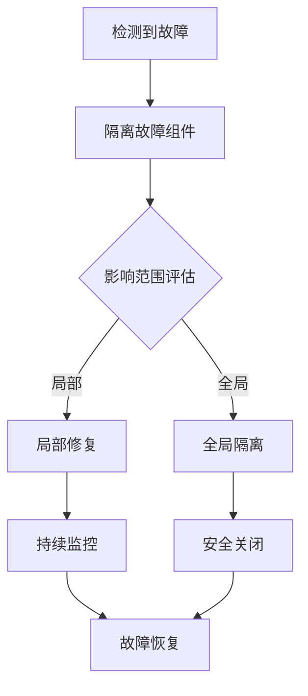

#### 优雅降级

1. **渐进式降级**：逐步禁用非关键功能
2. **资源释放**：及时释放故障组件占用的资源
3. **状态保存**：保存当前运行状态
4. **通知机制**：向管理员发送故障通知

### 流量控制机制

#### 请求限流

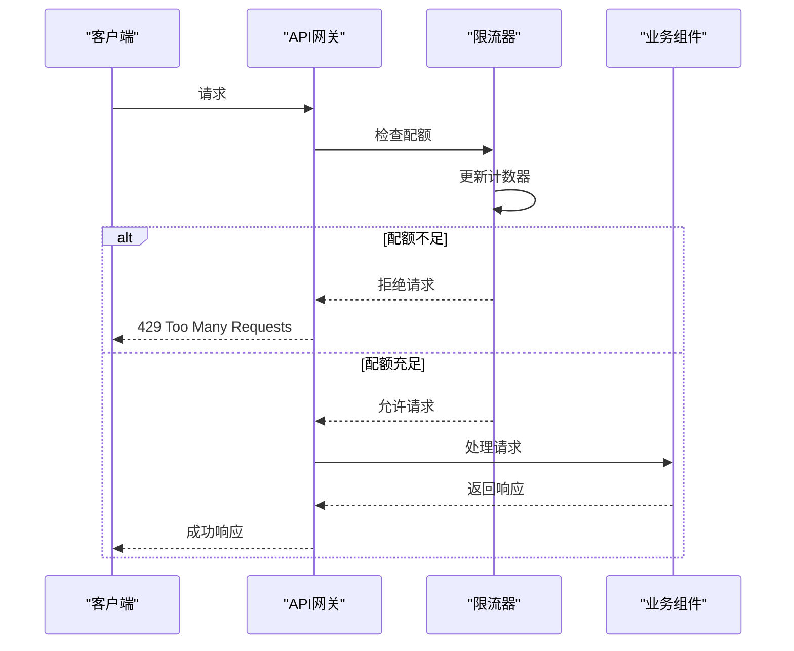

#### 错误转移策略

1. **负载均衡**：将请求转发到健康节点
2. **熔断保护**：暂时停止向故障服务发送请求
3. **重试机制**：对临时性故障进行有限重试
4. **降级响应**：返回简化版本的功能

**章节来源**
- [backend/services/collector.py:117-139](file://backend/services/collector.py#L117-L139)

## 恢复验证步骤

### 功能测试验证

#### 基础功能测试

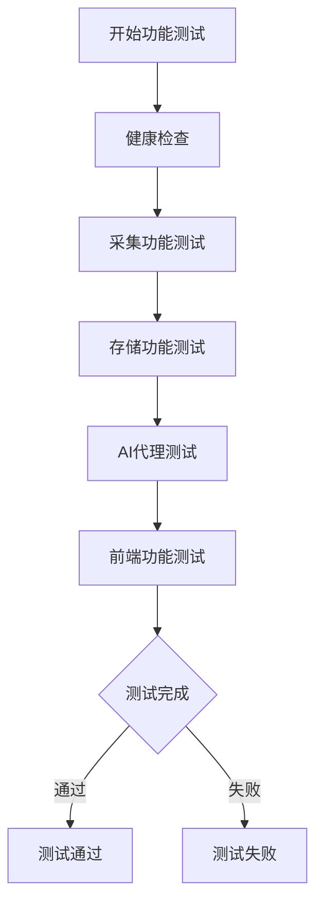

#### 关键指标验证

1. **响应时间**：确保在合理范围内
2. **成功率**：业务操作成功率
3. **数据一致性**：存储数据完整性
4. **用户体验**：界面响应和显示

### 性能验证

#### 性能基准测试

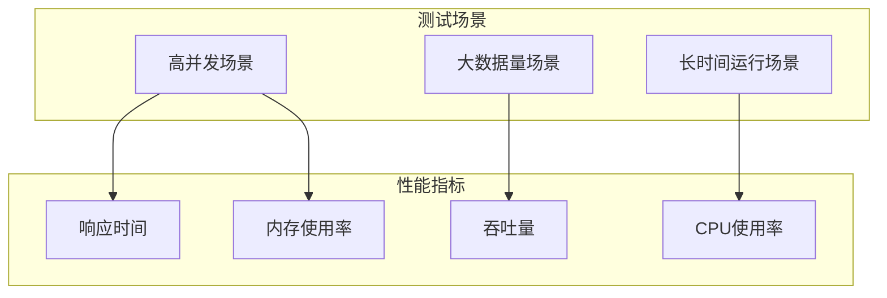

#### 监控指标对比

1. **基线对比**：与正常运行时的性能对比
2. **阈值检查**：各项指标是否在正常范围内
3. **趋势分析**：性能是否随时间恶化
4. **容量评估**：系统承载能力评估

### 数据完整性检查

#### 数据一致性验证

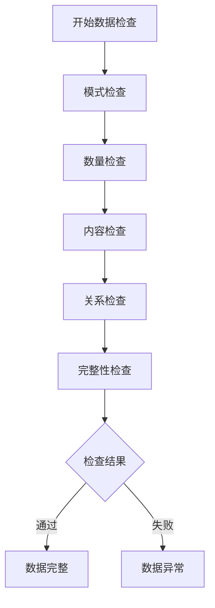

#### 关键数据验证

1. **事件完整性**：所有事件是否正确存储
2. **用户画像**：用户统计数据是否准确
3. **会话连续性**：直播会话是否完整
4. **建议质量**：生成的建议是否符合预期

**章节来源**
- [data/DATABASE.md:1-151](file://data/DATABASE.md#L1-L151)

## 预防性维护

### 定期健康检查

#### 自动化检查

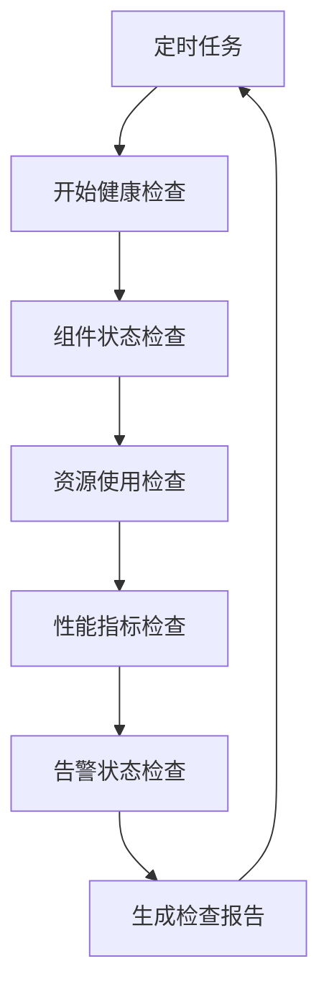

#### 检查内容

1. **服务可用性**：各组件运行状态
2. **资源使用率**：CPU、内存、磁盘使用情况
3. **性能指标**：响应时间、吞吐量等
4. **错误日志**：异常和错误统计

### 容量预警

#### 预警机制

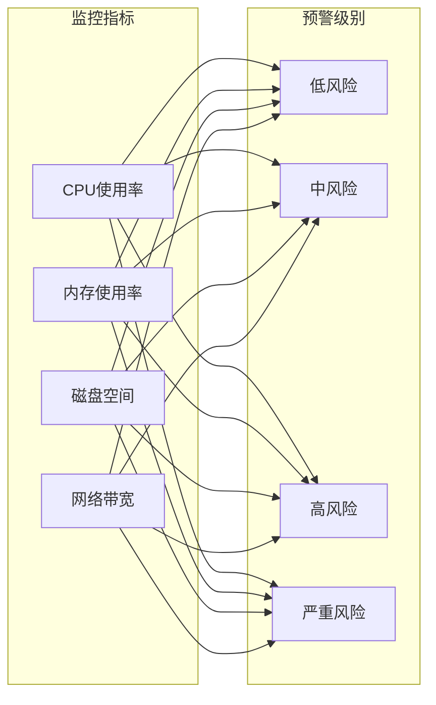

#### 预警策略

1. **阈值设置**：为各项指标设置合理的阈值
2. **分级告警**：不同级别的预警对应不同的处理措施
3. **自动处理**：达到特定阈值时自动采取缓解措施
4. **人工干预**：严重情况下通知运维人员

### 性能基线监控

#### 基线建立

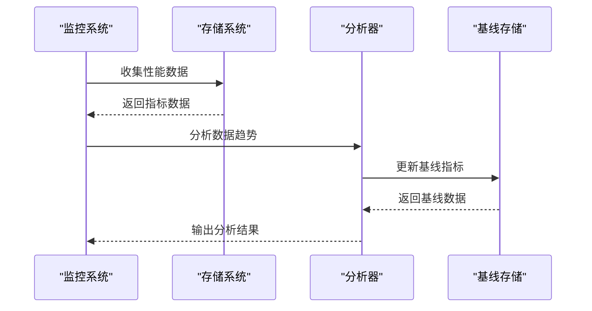

#### 基线管理

1. **历史数据分析**：基于历史数据建立性能基线
2. **动态调整**：根据业务变化调整基线参数
3. **异常检测**：识别偏离基线的异常情况
4. **趋势预测**：预测未来的性能发展趋势

**章节来源**
- [backend/app.py:104-106](file://backend/app.py#L104-L106)

## 故障恢复指南

### 数据备份恢复

#### 完整备份恢复

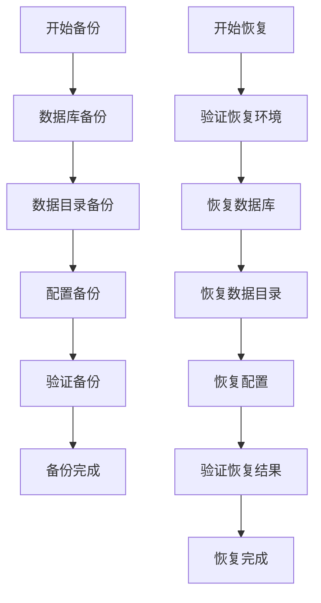

#### 增量数据恢复

1. **增量备份策略**：定期创建增量备份
2. **差异检测**：识别发生变化的数据
3. **增量恢复**：只恢复变化的部分
4. **一致性保证**：确保恢复后数据一致性

#### 部分数据修复

1. **数据诊断**：识别损坏或不一致的数据
2. **修复策略**：制定针对性的修复方案
3. **数据重建**：基于其他数据源重建丢失数据
4. **验证修复**：验证修复结果的正确性

### 系统恢复流程

#### 快速恢复步骤

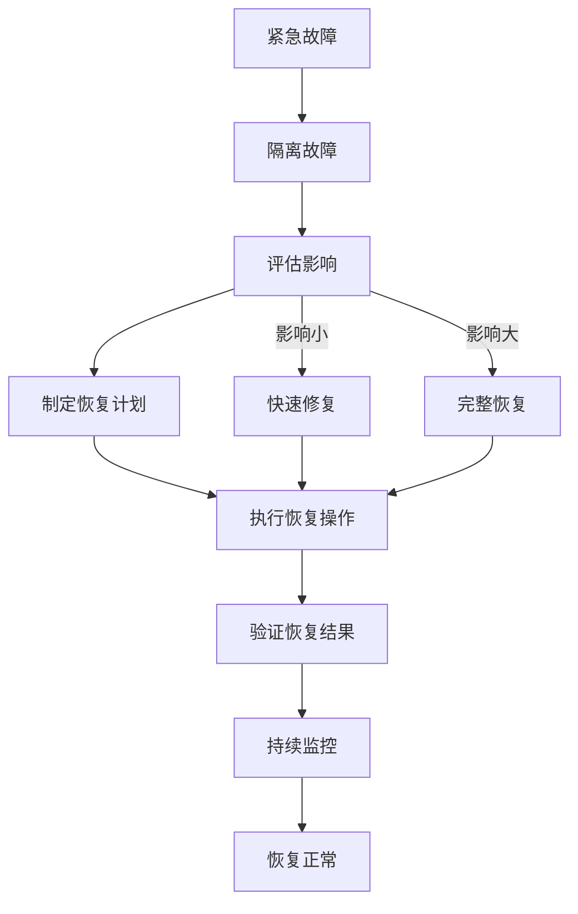

#### 恢复验证清单

1. **基础功能**：核心功能是否正常
2. **数据完整性**：数据是否完整且正确
3. **性能指标**：性能是否回到正常水平
4. **用户体验**：界面和交互是否正常
5. **监控告警**：系统监控是否正常

### 应急联系人和联系方式

#### 运维团队

- **值班负责人**：[姓名] - [电话]
- **技术支持**：[姓名] - [电话]
- **开发团队**：[姓名] - [电话]

#### 外部支持

- **云服务提供商**：[联系方式]
- **数据库供应商**：[联系方式]
- **网络服务商**：[联系方式]

**章节来源**
- [USAGE.md:179-256](file://USAGE.md#L179-L256)

## 结论

本紧急情况处理指南提供了全面的故障应对策略和恢复方案。系统通过多层次的降级设计和自动容错机制，确保在各种故障情况下都能保持基本功能运行。

关键要点：

1. **预防为主**：通过定期维护和监控预防故障发生
2. **快速响应**：建立完善的应急响应机制
3. **自动降级**：利用系统的自动降级能力减少人工干预
4. **数据保护**：建立完善的数据备份和恢复机制
5. **持续改进**：根据故障经验不断完善应急预案

建议定期演练应急处理流程，确保团队熟悉各种故障场景的处理方法，提高系统的整体可靠性和稳定性。