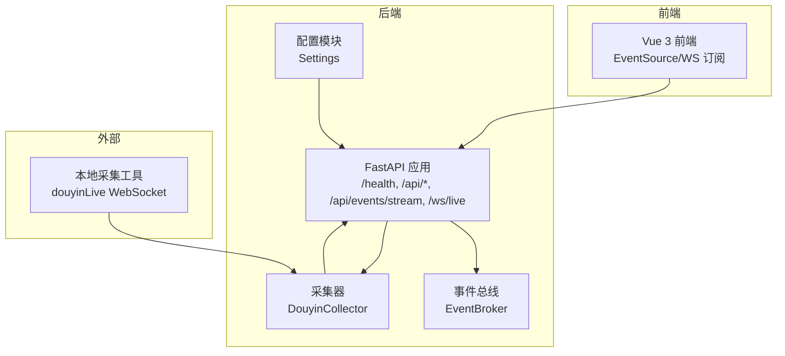
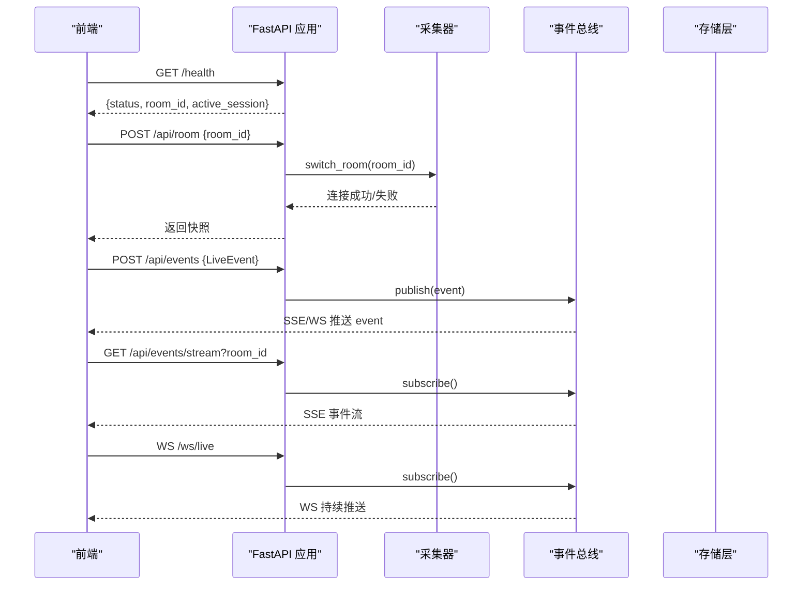
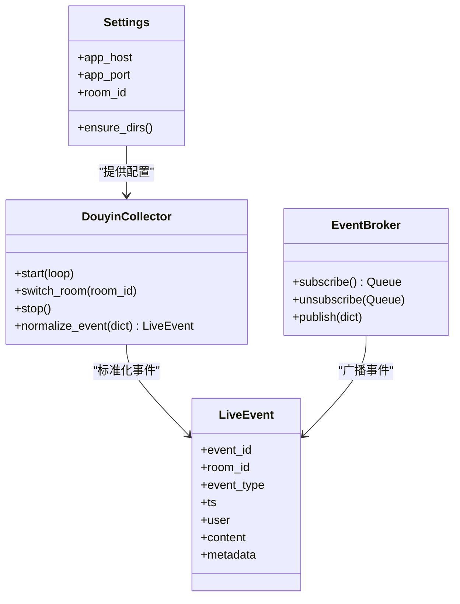

# API接口连通性

<cite>
**本文档引用的文件**
- [README.md](file://README.md)
- [USAGE.md](file://USAGE.md)
- [backend/app.py](file://backend/app.py)
- [backend/config.py](file://backend/config.py)
- [backend/schemas/live.py](file://backend/schemas/live.py)
- [backend/services/broker.py](file://backend/services/broker.py)
- [backend/services/collector.py](file://backend/services/collector.py)
- [frontend/src/stores/live.js](file://frontend/src/stores/live.js)
</cite>

## 目录
1. [简介](#简介)
2. [项目结构](#项目结构)
3. [核心组件](#核心组件)
4. [架构总览](#架构总览)
5. [详细组件分析](#详细组件分析)
6. [依赖关系分析](#依赖关系分析)
7. [性能考量](#性能考量)
8. [故障排查指南](#故障排查指南)
9. [结论](#结论)
10. [附录](#附录)

## 简介
本指南聚焦于后端提供的关键API接口连通性测试与诊断方法，涵盖健康检查、房间切换、事件注入、SSE事件流以及WebSocket实时流。文档同时提供HTTP状态码含义与常见错误响应分析，帮助快速定位问题并验证接口可用性。

## 项目结构
后端采用FastAPI框架，提供REST、SSE与WebSocket三种实时通道；前端通过EventSource与WebSocket消费实时事件流；采集器负责从本地工具获取直播事件并标准化后交由后端处理。

图表来源
- [backend/app.py:104-220](file://backend/app.py#L104-L220)
- [backend/services/broker.py:10-40](file://backend/services/broker.py#L10-L40)
- [backend/services/collector.py:38-284](file://backend/services/collector.py#L38-L284)
- [backend/config.py:39-94](file://backend/config.py#L39-L94)

章节来源
- [README.md:208-275](file://README.md#L208-L275)
- [backend/app.py:104-220](file://backend/app.py#L104-L220)

## 核心组件
- 健康检查接口：返回服务状态、当前房间号与活动会话信息，便于快速确认后端存活与配置。
- 房间切换接口：接收房间号并切换采集与会话，返回当前快照。
- 事件注入接口：手动注入标准化事件，用于联调或替换采集端。
- SSE事件流接口：按房间过滤推送事件、建议、统计与模型状态。
- WebSocket接口：建立持久连接，先下发一次快照，随后持续推送事件。

章节来源
- [backend/app.py:104-220](file://backend/app.py#L104-L220)
- [backend/schemas/live.py:29-95](file://backend/schemas/live.py#L29-L95)
- [backend/services/broker.py:10-40](file://backend/services/broker.py#L10-L40)
- [backend/services/collector.py:38-284](file://backend/services/collector.py#L38-L284)

## 架构总览
后端生命周期管理采集器，事件经处理后进入事件总线，SSE与WebSocket订阅端从总线拉取并分发。前端通过EventSource订阅SSE，或通过WebSocket直连，均能获得一致的事件流。

图表来源
- [backend/app.py:104-220](file://backend/app.py#L104-L220)
- [backend/services/broker.py:10-40](file://backend/services/broker.py#L10-L40)
- [backend/services/collector.py:80-98](file://backend/services/collector.py#L80-L98)

## 详细组件分析

### 健康检查接口（/health）
- 接口定义：GET /health
- 功能：返回服务状态、当前房间号与活动会话信息，便于快速确认后端存活与配置。
- 响应字段：
  - status：服务状态
  - room_id：当前房间号
  - active_session：活动会话信息
- curl测试示例：
  - curl -i http://127.0.0.1:8010/health
- 响应验证要点：
  - HTTP状态码：200 OK
  - 字段完整性：status、room_id、active_session
  - 若返回非200，检查后端进程与端口绑定

章节来源
- [backend/app.py:104-107](file://backend/app.py#L104-L107)
- [README.md:210-217](file://README.md#L210-L217)

### 房间切换接口（/api/room）
- 接口定义：POST /api/room
- 请求头：Content-Type: application/json
- 请求体字段：
  - room_id：目标房间号（必填）
- 成功响应：返回当前快照（recent_events、recent_suggestions、stats、model_status）
- 错误响应：
  - 400 Bad Request：当room_id为空或无效
- curl测试示例：
  - curl -X POST http://127.0.0.1:8010/api/room -H "Content-Type: application/json" -d '{"room_id":"32137571630"}'
- 参数验证要点：
  - room_id必须非空且与当前房间不同才触发切换
  - 切换后会关闭原房间活动会话并连接新房间

章节来源
- [backend/app.py:115-127](file://backend/app.py#L115-L127)
- [backend/services/collector.py:80-98](file://backend/services/collector.py#L80-L98)
- [README.md:231-245](file://README.md#L231-L245)

### 事件注入接口（/api/events）
- 接口定义：POST /api/events
- 请求头：Content-Type: application/json
- 请求体：标准LiveEvent对象（见下方Schema）
- 成功响应：
  - accepted：是否接受
  - event_id：事件ID
  - session_id：会话ID
  - suggestion：若生成建议则返回，否则为null
- curl测试示例：
  - curl -X POST http://127.0.0.1:8010/api/events -H "Content-Type: application/json" -d '{"event_id":"...","room_id":"32137571630","event_type":"comment","ts":1775218578225,"user":{"id":"","nickname":"昵称"},"content":"测试评论"}'
- 提交验证要点：
  - 请求体需符合LiveEvent Schema
  - 事件会被写入短期/长期存储并触发建议生成与统计更新
  - 建议生成逻辑优先调用模型，失败时回退至启发式规则

章节来源
- [backend/app.py:129-133](file://backend/app.py#L129-L133)
- [backend/schemas/live.py:29-45](file://backend/schemas/live.py#L29-L45)
- [README.md:246-254](file://README.md#L246-L254)

### SSE事件流接口（/api/events/stream）
- 接口定义：GET /api/events/stream?room_id=...
- 功能：按房间过滤推送事件、建议、统计与模型状态
- 事件类型：
  - event：标准化事件
  - suggestion：建议
  - stats：统计
  - model_status：模型状态
- curl测试示例：
  - curl -N http://127.0.0.1:8010/api/events/stream?room_id=32137571630
- 客户端测试要点：
  - 使用浏览器EventSource或curl -N保持连接
  - 事件按SSE格式推送，前端会根据事件类型分别处理
  - 未指定room_id时默认使用配置中的房间号

章节来源
- [backend/app.py:187-206](file://backend/app.py#L187-L206)
- [frontend/src/stores/live.js:173-205](file://frontend/src/stores/live.js#L173-L205)
- [README.md:255-267](file://README.md#L255-L267)

### WebSocket接口（/ws/live）
- 接口定义：GET /ws/live
- 握手过程：
  - 建立WebSocket连接
  - 服务端立即发送一次bootstrap快照
  - 之后持续推送事件
- 客户端测试要点：
  - 前端使用原生WebSocket对象连接
  - 首次收到bootstrap快照后，后续事件与SSE一致
  - 断开重连由前端逻辑处理

章节来源
- [backend/app.py:209-220](file://backend/app.py#L209-L220)
- [frontend/src/stores/live.js:173-205](file://frontend/src/stores/live.js#L173-L205)
- [README.md:268-275](file://README.md#L268-L275)

### 数据模型与事件格式
- LiveEvent：标准化直播事件，包含事件ID、房间ID、事件类型、时间戳、用户信息、内容与元数据等
- Suggestion：建议生成结果
- SessionStats：房间统计
- ModelStatus：模型状态
- 事件类型映射：采集器将原始方法映射为comment/gift/follow/like/member/system

章节来源
- [backend/schemas/live.py:29-95](file://backend/schemas/live.py#L29-L95)
- [backend/services/collector.py:22-28](file://backend/services/collector.py#L22-L28)

## 依赖关系分析
后端应用依赖配置模块、事件总线与采集器；采集器负责连接本地工具并标准化事件；事件总线负责在SSE与WebSocket之间广播事件。

图表来源
- [backend/config.py:39-94](file://backend/config.py#L39-L94)
- [backend/services/broker.py:10-40](file://backend/services/broker.py#L10-L40)
- [backend/services/collector.py:38-284](file://backend/services/collector.py#L38-L284)
- [backend/schemas/live.py:29-45](file://backend/schemas/live.py#L29-L45)

## 性能考量
- SSE连接池：每个订阅端创建独立队列，事件广播采用异步队列，避免阻塞主线程
- WebSocket连接：连接数与消息吞吐取决于订阅数量与事件频率
- 采集器线程：独立线程处理WebSocket连接、心跳与消息解析，异常时自动重连
- 建议生成：优先调用在线模型，失败回退启发式规则，减少前端等待时间

[本节为通用性能讨论，无需特定文件来源]

## 故障排查指南

### 常见HTTP状态码与错误响应
- 400 Bad Request
  - 房间切换：room_id为空
  - 查看详情：{"detail":"room_id is required"}
- 404 Not Found
  - 查看用户详情或便签：{"detail":"viewer not found"}
- 500 Internal Server Error
  - 服务器内部异常，检查后端日志
- 503 Service Unavailable
  - 服务不可用，通常表示后端未启动或端口占用

章节来源
- [backend/app.py:118-119](file://backend/app.py#L118-L119)
- [backend/app.py:139-140](file://backend/app.py#L139-L140)
- [backend/app.py:148-149](file://backend/app.py#L148-L149)
- [backend/app.py:160-161](file://backend/app.py#L160-L161)
- [backend/app.py:168-170](file://backend/app.py#L168-L170)

### 健康检查失败
- 检查后端进程是否启动
- 确认端口绑定与防火墙设置
- 使用curl验证：curl -i http://127.0.0.1:8010/health

章节来源
- [backend/app.py:104-107](file://backend/app.py#L104-L107)

### 房间切换失败
- 确认room_id非空且与当前房间不同
- 检查采集器是否已连接本地工具
- 查看后端日志中关于连接与重连的信息

章节来源
- [backend/app.py:115-127](file://backend/app.py#L115-L127)
- [backend/services/collector.py:80-98](file://backend/services/collector.py#L80-L98)

### 事件注入无效
- 确认请求体符合LiveEvent Schema
- 检查事件类型映射与元数据字段
- 观察SSE/WS是否收到对应事件

章节来源
- [backend/app.py:129-133](file://backend/app.py#L129-L133)
- [backend/schemas/live.py:29-45](file://backend/schemas/live.py#L29-L45)

### SSE/WS无法接收事件
- 确认EventSource/WS连接URL与room_id
- 检查采集器是否正常连接本地工具
- 查看后端日志中事件广播与订阅情况

章节来源
- [backend/app.py:187-220](file://backend/app.py#L187-L220)
- [backend/services/broker.py:10-40](file://backend/services/broker.py#L10-L40)
- [frontend/src/stores/live.js:173-205](file://frontend/src/stores/live.js#L173-L205)

## 结论
通过上述接口连通性测试与诊断方法，可快速验证后端服务、采集链路与前端订阅通道的可用性。建议在联调阶段优先进行健康检查与房间切换测试，再逐步验证事件注入与实时流通道，最后结合错误响应与日志进行问题定位。

[本节为总结性内容，无需特定文件来源]

## 附录

### 接口清单与测试要点
- /health
  - 方法：GET
  - 测试：curl -i http://127.0.0.1:8010/health
  - 验证：200 OK，包含status、room_id、active_session
- /api/room
  - 方法：POST，Content-Type: application/json
  - 测试：curl -X POST http://127.0.0.1:8010/api/room -H "Content-Type: application/json" -d '{"room_id":"..."}'
  - 验证：200 OK，返回快照；400时检查room_id
- /api/events
  - 方法：POST，Content-Type: application/json
  - 测试：curl -X POST http://127.0.0.1:8010/api/events -H "Content-Type: application/json" -d '{...}'
  - 验证：200 OK，包含accepted、event_id、session_id、suggestion
- /api/events/stream
  - 方法：GET
  - 测试：curl -N http://127.0.0.1:8010/api/events/stream?room_id=...
  - 验证：SSE事件流，包含event、suggestion、stats、model_status
- /ws/live
  - 方法：GET
  - 测试：浏览器或WebSocket客户端连接 ws://127.0.0.1:8010/ws/live
  - 验证：连接成功后先收到bootstrap快照，随后持续推送事件

章节来源
- [backend/app.py:104-220](file://backend/app.py#L104-L220)
- [README.md:208-275](file://README.md#L208-L275)