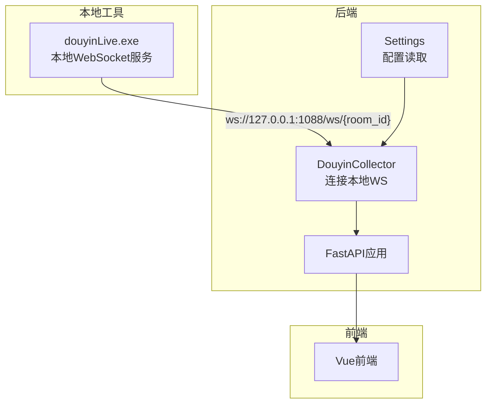
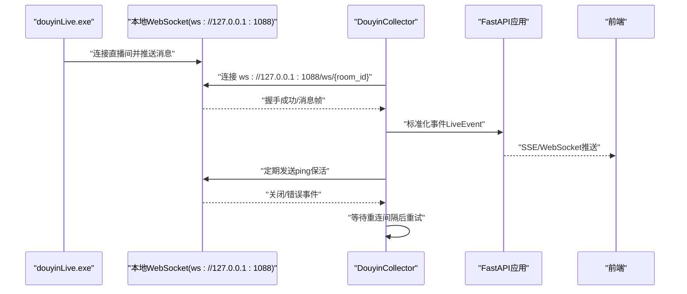
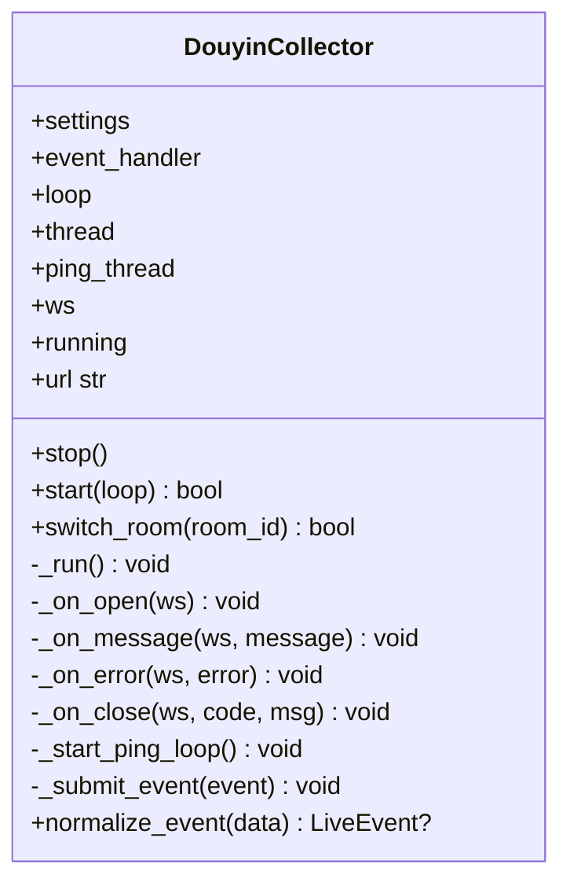
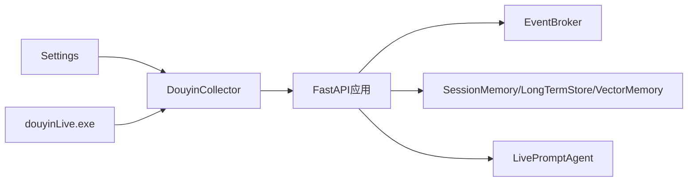

# WebSocket连接问题

<cite>
**本文引用的文件**
- [README.md](file://README.md)
- [USAGE.md](file://USAGE.md)
- [backend/config.py](file://backend/config.py)
- [backend/services/collector.py](file://backend/services/collector.py)
- [backend/app.py](file://backend/app.py)
- [tool/config.yaml](file://tool/config.yaml)
- [start_all.ps1](file://start_all.ps1)
- [start_backend_qwen.ps1](file://start_backend_qwen.ps1)
- [start_frontend.ps1](file://start_frontend.ps1)
- [logs/backend_8010.err.log](file://logs/backend_8010.err.log)
</cite>

## 目录
1. [简介](#简介)
2. [项目结构](#项目结构)
3. [核心组件](#核心组件)
4. [架构总览](#架构总览)
5. [详细组件分析](#详细组件分析)
6. [依赖分析](#依赖分析)
7. [性能考虑](#性能考虑)
8. [故障排查指南](#故障排查指南)
9. [结论](#结论)
10. [附录](#附录)

## 简介
本指南聚焦于抖音直播场景下 WebSocket 连接问题的诊断与修复，围绕以下关键点展开：
- douyinLive 可执行文件的存在性、端口占用与进程状态检查
- collector 服务连接配置项（collector_host、collector_port、room_id）的正确设置
- 连接建立失败的常见原因与解决路径（地址解析失败、端口不可达、握手失败、协议不匹配）
- 连接断开后的自动重连机制与重连间隔配置
- 连接测试命令与调试方法（含 websocat 工具使用）
- 面向日志的错误定位与常见错误（连接超时、握手失败、协议不匹配）的解决方案

## 项目结构
该项目由三部分组成：
- tool/douyinLive-windows-amd64.exe：本地 WebSocket 消息源，负责连接抖音直播间并向本地端口暴露 WebSocket
- backend：FastAPI 应用，内置 collector 连接本地 WebSocket 并进行事件处理
- frontend：Vue 前端，实时展示事件与建议

图表来源
- [README.md:37-48](file://README.md#L37-L48)
- [backend/services/collector.py:54-59](file://backend/services/collector.py#L54-L59)
- [backend/config.py:47-48](file://backend/config.py#L47-L48)

章节来源
- [README.md:35-48](file://README.md#L35-L48)
- [USAGE.md:49-61](file://USAGE.md#L49-L61)

## 核心组件
- 配置系统（Settings）：从环境变量与 .env 读取 collector_host、collector_port、room_id、collector_enabled、collector_ping_interval_seconds、collector_reconnect_delay_seconds 等关键配置
- Collector（DouyinCollector）：负责连接本地 WebSocket、处理消息、心跳保活、异常与断开后的重连
- FastAPI 应用：启动时初始化 collector 并在生命周期内维持其运行
- 工具配置（tool/config.yaml）：douyinLive 的端口与 Cookie 等配置

章节来源
- [backend/config.py:39-62](file://backend/config.py#L39-L62)
- [backend/services/collector.py:38-53](file://backend/services/collector.py#L38-L53)
- [backend/app.py:81-92](file://backend/app.py#L81-L92)
- [tool/config.yaml:4-5](file://tool/config.yaml#L4-L5)

## 架构总览
下图展示了从本地消息源到后端采集再到前端展示的整体链路，以及关键的连接点与配置项。

图表来源
- [README.md:37-48](file://README.md#L37-L48)
- [backend/services/collector.py:117-139](file://backend/services/collector.py#L117-L139)
- [backend/services/collector.py:182-198](file://backend/services/collector.py#L182-L198)
- [backend/app.py:209-220](file://backend/app.py#L209-L220)

## 详细组件分析

### 组件一：DouyinCollector（WebSocket客户端）
- 连接目标 URL 由 settings.collector_host、collector_port、room_id 组成
- 连接建立后启动心跳线程，周期性发送 ping 保持活跃
- 断开后按 settings.collector_reconnect_delay_seconds 间隔重连
- 对非 JSON 消息进行忽略与告警；错误与关闭事件记录日志

图表来源
- [backend/services/collector.py:38-53](file://backend/services/collector.py#L38-L53)
- [backend/services/collector.py:117-139](file://backend/services/collector.py#L117-L139)
- [backend/services/collector.py:182-198](file://backend/services/collector.py#L182-L198)

章节来源
- [backend/services/collector.py:54-59](file://backend/services/collector.py#L54-L59)
- [backend/services/collector.py:117-139](file://backend/services/collector.py#L117-L139)
- [backend/services/collector.py:161-180](file://backend/services/collector.py#L161-L180)
- [backend/services/collector.py:182-198](file://backend/services/collector.py#L182-L198)

### 组件二：配置系统（Settings）
- 关键连接配置项
  - collector_host：本地 WebSocket 主机地址，默认 127.0.0.1
  - collector_port：本地 WebSocket 端口，默认 1088
  - room_id：房间标识，不能为空
  - collector_enabled：是否启用采集器
  - collector_ping_interval_seconds：心跳间隔
  - collector_reconnect_delay_seconds：断开重连间隔
- 环境变量优先级：.env > 系统环境变量

章节来源
- [backend/config.py:47-50](file://backend/config.py#L47-L50)
- [backend/config.py:11-36](file://backend/config.py#L11-L36)

### 组件三：FastAPI 应用与生命周期
- 应用启动时创建 EventBroker、SessionMemory、LongTermStore、VectorMemory、LivePromptAgent
- 在 lifespan 中启动 collector.start，并在关闭时停止
- 提供 /ws/live 等接口，向前端推送事件与建议

章节来源
- [backend/app.py:25-29](file://backend/app.py#L25-L29)
- [backend/app.py:84-92](file://backend/app.py#L84-L92)
- [backend/app.py:209-220](file://backend/app.py#L209-L220)

### 组件四：工具配置（tool/config.yaml）
- port：douyinLive 默认监听端口 1088
- cookie：可选登录态 Cookie（仅本地使用）

章节来源
- [tool/config.yaml:4-5](file://tool/config.yaml#L4-L5)
- [tool/config.yaml:10-15](file://tool/config.yaml#L10-L15)

## 依赖分析
- Collector 依赖 Settings 提供的连接参数
- FastAPI 应用在启动时注入 EventBroker 与 Memory 组件，并将事件处理回调传给 Collector
- 工具端（douyinLive）与后端通过本地 WebSocket 通信，端口与房间号需一致

图表来源
- [backend/config.py:39-62](file://backend/config.py#L39-L62)
- [backend/services/collector.py:38-53](file://backend/services/collector.py#L38-L53)
- [backend/app.py:25-29](file://backend/app.py#L25-L29)

章节来源
- [backend/app.py:81-92](file://backend/app.py#L81-L92)
- [backend/services/collector.py:117-139](file://backend/services/collector.py#L117-L139)

## 性能考虑
- 心跳间隔（collector_ping_interval_seconds）过短会增加网络与 CPU 开销，过长可能导致误判断开
- 重连间隔（collector_reconnect_delay_seconds）过短会放大抖动，过长影响恢复速度
- 建议结合网络状况与业务需求调整上述参数，避免频繁重连或资源浪费

## 故障排查指南

### 一、douyinLive 可执行文件是否存在、端口占用与进程状态检查
- 可执行文件位置与默认行为
  - 可执行文件位于 tool/douyinLive-windows-amd64.exe
  - 默认在本地启动 WebSocket 服务，端口为 1088
- 端口占用检查
  - 使用系统工具检查 1088 端口是否被占用
  - 若被占用，修改 tool/config.yaml 的 port 或释放端口
- 进程状态检查
  - 确认 douyinLive.exe 已启动且未异常退出
  - 如需登录态，可在 tool/config.yaml 中配置 Cookie

章节来源
- [USAGE.md:51-61](file://USAGE.md#L51-L61)
- [tool/config.yaml:4-5](file://tool/config.yaml#L4-L5)
- [tool/config.yaml:10-15](file://tool/config.yaml#L10-L15)

### 二、collector 服务连接配置校验
- 关键配置项
  - collector_host：默认 127.0.0.1
  - collector_port：默认 1088
  - room_id：必须非空
  - collector_enabled：默认启用
  - collector_ping_interval_seconds：默认 30 秒
  - collector_reconnect_delay_seconds：默认 3 秒
- 设置方式
  - 通过 .env 文件覆盖默认值
  - 环境变量优先级：.env > 系统环境变量

章节来源
- [backend/config.py:47-50](file://backend/config.py#L47-L50)
- [backend/config.py:11-36](file://backend/config.py#L11-L36)
- [README.md:148-155](file://README.md#L148-L155)

### 三、连接建立失败的常见原因与解决
- 地址解析失败
  - 检查 collector_host 是否可解析
  - 确认本地回环地址 127.0.0.1 可用
- 端口不可达
  - 确认 1088 端口未被占用
  - 确认 douyinLive.exe 已启动并监听该端口
- 握手失败/协议不匹配
  - 确认 URL 路径为 /ws/{room_id}
  - 确认房间号与工具配置一致
- SSL 证书问题
  - 本地 WebSocket 不涉及 HTTPS，无需证书
  - 若通过代理或反向代理，请确保代理配置正确

章节来源
- [backend/services/collector.py:54-59](file://backend/services/collector.py#L54-L59)
- [README.md:76-80](file://README.md#L76-L80)
- [USAGE.md:57-61](file://USAGE.md#L57-L61)

### 四、连接断开的自动重连机制与重连间隔
- 机制
  - 断开后按 settings.collector_reconnect_delay_seconds 等待
  - 重新创建 WebSocket 连接并恢复心跳
- 重连间隔
  - 默认 3 秒，可通过环境变量调整

章节来源
- [backend/services/collector.py:136-138](file://backend/services/collector.py#L136-L138)
- [backend/config.py:49-50](file://backend/config.py#L49-L50)

### 五、连接测试命令与调试方法
- 使用 websocat 测试本地 WebSocket
  - 命令示例（请根据实际 room_id 替换）：
    - websocat -n1 ws://127.0.0.1:1088/ws/你的房间号
  - 观察输出是否返回标准事件结构
- 日志定位
  - 后端日志中包含连接与断开的关键信息，可据此判断问题类型
  - 示例日志片段（来自 logs/backend_8010.err.log）：
    - “Connecting to Douyin websocket at ...”
    - “Douyin collector connected”
    - “Douyin collector websocket error: ...”
    - “Douyin collector connection closed: code=None msg=None”
    - “Douyin collector disconnected, retrying in 3.0s”

章节来源
- [logs/backend_8010.err.log:3-29](file://logs/backend_8010.err.log#L3-L29)
- [backend/services/collector.py:127-138](file://backend/services/collector.py#L127-L138)

### 六、常见错误与具体解决方案
- 连接超时
  - 检查网络与防火墙
  - 确认端口未被占用
  - 适当增大 collector_reconnect_delay_seconds 以减少抖动
- 握手失败
  - 确认 URL 路径与房间号正确
  - 确认工具端已启动并监听
- 协议不匹配
  - 确保使用 ws://（非 wss://），本地不涉及证书
  - 确认路径为 /ws/{room_id}

章节来源
- [backend/services/collector.py:127-138](file://backend/services/collector.py#L127-L138)
- [README.md:76-80](file://README.md#L76-L80)

## 结论
- 本地 WebSocket 采集链路的关键在于：douyinLive.exe 正常运行、端口 1088 可用、collector 配置正确、room_id 与工具端一致
- 断开后具备自动重连与心跳保活机制，合理配置重连与心跳间隔可提升稳定性
- 借助 websocat 与后端日志可快速定位问题类型并逐项修复

## 附录

### A. 启动顺序与脚本
- 启动后端与前端的脚本会自动检查 .env 是否存在并加载
- 后端启动时内置 collector，无需额外步骤

章节来源
- [start_all.ps1:6-12](file://start_all.ps1#L6-L12)
- [start_backend_qwen.ps1:6-12](file://start_backend_qwen.ps1#L6-L12)
- [start_frontend.ps1:10-18](file://start_frontend.ps1#L10-L18)