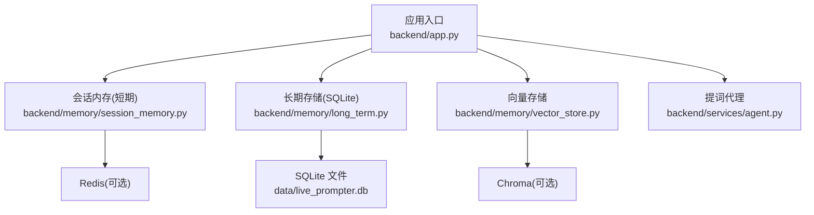
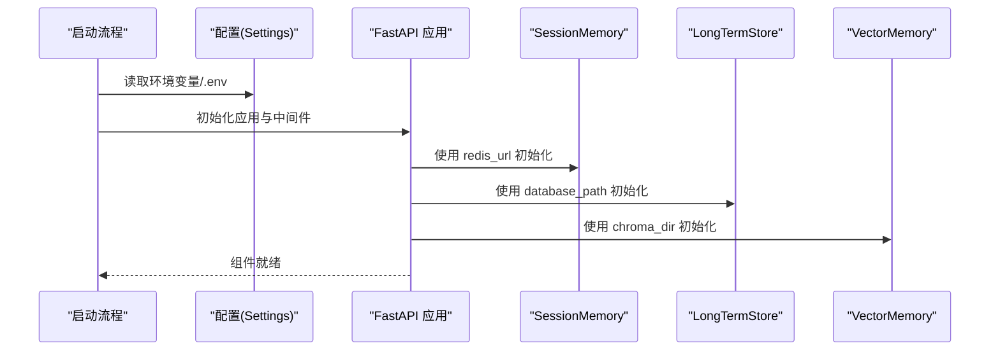
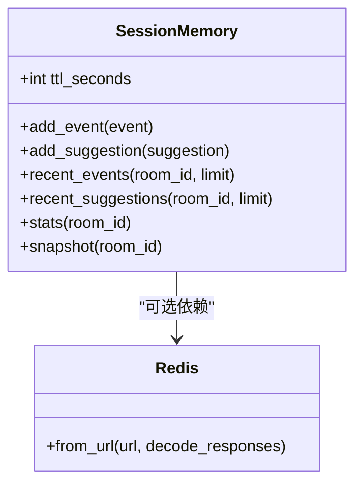
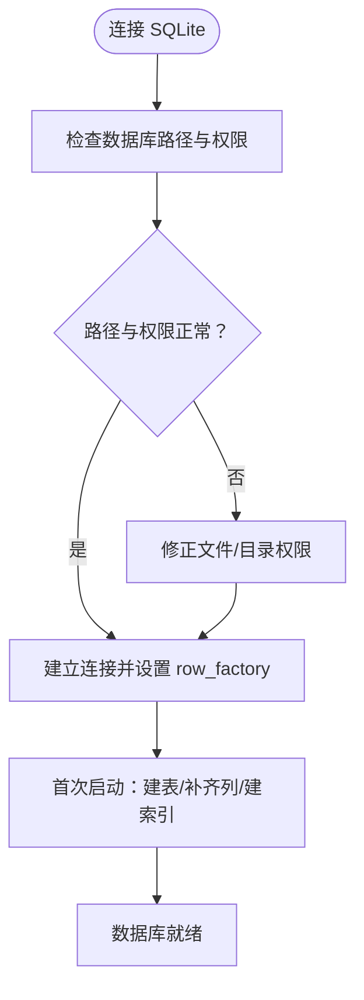
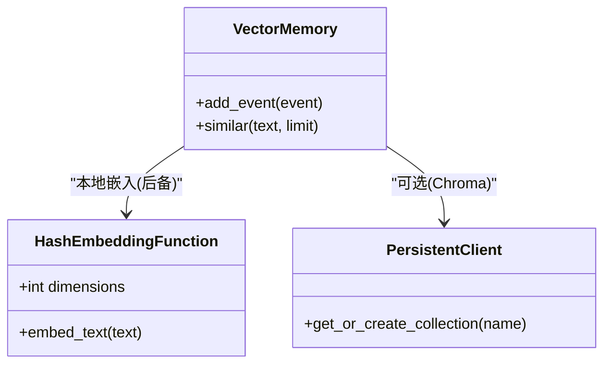
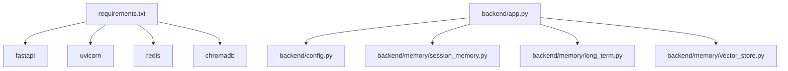

# 数据库连接问题

<cite>
**本文引用的文件**
- [backend/config.py](file://backend/config.py)
- [backend/app.py](file://backend/app.py)
- [backend/memory/session_memory.py](file://backend/memory/session_memory.py)
- [backend/memory/long_term.py](file://backend/memory/long_term.py)
- [backend/memory/vector_store.py](file://backend/memory/vector_store.py)
- [backend/services/agent.py](file://backend/services/agent.py)
- [backend/schemas/live.py](file://backend/schemas/live.py)
- [data/DATABASE.md](file://data/DATABASE.md)
- [requirements.txt](file://requirements.txt)
</cite>

## 目录
1. [简介](#简介)
2. [项目结构](#项目结构)
3. [核心组件](#核心组件)
4. [架构总览](#架构总览)
5. [详细组件分析](#详细组件分析)
6. [依赖分析](#依赖分析)
7. [性能考虑](#性能考虑)
8. [故障排查指南](#故障排查指南)
9. [结论](#结论)
10. [附录](#附录)

## 简介
本指南聚焦于本项目涉及的数据库连接问题，涵盖以下方面：
- Redis 连接问题：连接字符串格式、认证配置、网络连通性检查
- SQLite 数据库文件访问问题：文件权限设置、路径配置、数据库锁定问题
- Chroma 向量数据库连接问题：向量维度配置、嵌入模型选择、内存分配问题
- 数据库连接池与性能调优建议
- 具体的连接测试命令与常见错误代码分析（如 Redis 连接超时、SQLite 数据库忙锁、Chroma 连接拒绝）
- 数据库备份与恢复的基本操作指导

## 项目结构
本项目后端采用多层存储与缓存架构：
- 应用入口负责组装各组件（会话内存、长期存储、向量存储、代理等）
- 会话内存层优先使用 Redis，若未安装或未配置则退化为进程内队列
- 长期存储层使用 SQLite 文件数据库
- 向量存储层优先使用 Chroma（持久化），否则使用本地哈希嵌入函数与内存列表

图表来源
- [backend/app.py:22-29](file://backend/app.py#L22-L29)
- [backend/memory/session_memory.py:17-31](file://backend/memory/session_memory.py#L17-L31)
- [backend/memory/long_term.py:36-44](file://backend/memory/long_term.py#L36-L44)
- [backend/memory/vector_store.py:52-63](file://backend/memory/vector_store.py#L52-L63)

章节来源
- [backend/app.py:22-29](file://backend/app.py#L22-L29)
- [backend/config.py:51-54](file://backend/config.py#L51-L54)

## 核心组件
- 配置中心：集中读取环境变量与 .env，提供默认值，确保本地可运行
- 会话内存（短期）：优先 Redis，否则进程内队列
- 长期存储（SQLite）：事件、建议、观众画像、礼物、直播场次、备注等表
- 向量存储：优先 Chroma，否则本地哈希嵌入+内存检索
- 提词代理：结合向量检索与本地规则生成建议

章节来源
- [backend/config.py:40-93](file://backend/config.py#L40-L93)
- [backend/memory/session_memory.py:17-113](file://backend/memory/session_memory.py#L17-L113)
- [backend/memory/long_term.py:36-750](file://backend/memory/long_term.py#L36-L750)
- [backend/memory/vector_store.py:52-108](file://backend/memory/vector_store.py#L52-L108)
- [backend/services/agent.py:23-114](file://backend/services/agent.py#L23-L114)

## 架构总览
应用启动时，依据配置初始化各组件：
- 创建必要的数据目录
- 初始化 Redis 客户端（若可用且配置有效）
- 初始化 SQLite 数据库（自动建表、索引、列补齐）
- 初始化 Chroma 客户端（若可用）

图表来源
- [backend/config.py:63-68](file://backend/config.py#L63-L68)
- [backend/app.py:22-29](file://backend/app.py#L22-L29)
- [backend/memory/session_memory.py:17-31](file://backend/memory/session_memory.py#L17-L31)
- [backend/memory/long_term.py:50-155](file://backend/memory/long_term.py#L50-L155)
- [backend/memory/vector_store.py:60-63](file://backend/memory/vector_store.py#L60-L63)

## 详细组件分析

### Redis 连接问题诊断与修复
- 连接字符串格式
  - 使用统一的 URL 格式进行配置，便于跨平台与容器部署
  - 若未提供或不可用，短期会话将退化为进程内队列，不影响核心功能
- 认证配置
  - 通过 URL 的鉴权参数传递凭据（如密码）
  - 若 URL 缺少必要凭据，将导致连接失败
- 网络连通性检查
  - 在应用启动阶段尝试建立连接并进行基本读写校验
  - 如连接失败，组件会降级为内存模式，日志中应出现相应错误
- TTL 与过期策略
  - Redis 模式下通过过期时间控制热数据生命周期，避免无限增长
- 常见错误与现象
  - 连接超时：通常由网络延迟或目标端口不可达引起
  - 权限不足：URL 缺少凭据或凭据错误
  - 服务不可用：目标实例宕机或防火墙阻断

图表来源
- [backend/memory/session_memory.py:17-31](file://backend/memory/session_memory.py#L17-L31)
- [backend/memory/session_memory.py:42-84](file://backend/memory/session_memory.py#L42-L84)

章节来源
- [backend/memory/session_memory.py:17-31](file://backend/memory/session_memory.py#L17-L31)
- [backend/memory/session_memory.py:42-84](file://backend/memory/session_memory.py#L42-L84)
- [backend/config.py:54](file://backend/config.py#L54)

### SQLite 数据库文件访问问题诊断与修复
- 路径配置
  - 默认数据库文件位于 data/live_prompter.db
  - 启动时会自动创建 data 目录与父目录，确保可写
- 文件权限设置
  - 确保运行用户对 data 目录及 live_prompter.db 具备读写权限
  - 在 Windows 上检查文件属性与 NTFS 权限
- 数据库锁定问题
  - SQLite 通过文件锁实现并发控制，常见“数据库忙”由长时间事务或并发写入引起
  - 建议减少长事务、合并批量写入、避免同时多进程写同一数据库
- 表结构与索引
  - 首次启动会自动建表、补齐列、创建索引，确保查询性能
- 常见错误与现象
  - 数据库忙：并发写入或长时间事务导致
  - 权限不足：无法创建/写入数据库文件
  - 文件损坏：磁盘异常或非正常退出导致页损坏

图表来源
- [backend/config.py:51-68](file://backend/config.py#L51-L68)
- [backend/memory/long_term.py:50-155](file://backend/memory/long_term.py#L50-L155)
- [backend/memory/long_term.py:41-44](file://backend/memory/long_term.py#L41-L44)

章节来源
- [backend/config.py:51-68](file://backend/config.py#L51-L68)
- [backend/memory/long_term.py:50-155](file://backend/memory/long_term.py#L50-L155)
- [backend/memory/long_term.py:41-44](file://backend/memory/long_term.py#L41-L44)
- [data/DATABASE.md:1-151](file://data/DATABASE.md#L1-L151)

### Chroma 向量数据库连接问题诊断与修复
- 向量维度配置
  - 本地哈希嵌入函数默认维度为 64，可在初始化时调整
  - 该维度影响向量检索性能与内存占用
- 嵌入模型选择
  - 若未安装 chromadb，则使用本地哈希嵌入函数作为后备
  - 项目未内置外部嵌入模型，因此不涉及外部模型下载与配置
- 内存分配问题
  - Chroma 为本地持久化向量库，内存占用与向量数量、维度相关
  - 建议在资源受限环境中降低维度或限制集合大小
- 常见错误与现象
  - 连接拒绝：Chroma 服务未启动或端口被占用
  - 路径权限：向量存储目录不可写
  - 版本不匹配：客户端与服务端版本差异导致协议不兼容

图表来源
- [backend/memory/vector_store.py:52-63](file://backend/memory/vector_store.py#L52-L63)
- [backend/memory/vector_store.py:19-49](file://backend/memory/vector_store.py#L19-L49)
- [backend/memory/vector_store.py:60-63](file://backend/memory/vector_store.py#L60-L63)

章节来源
- [backend/memory/vector_store.py:19-49](file://backend/memory/vector_store.py#L19-L49)
- [backend/memory/vector_store.py:52-108](file://backend/memory/vector_store.py#L52-L108)
- [backend/config.py:53](file://backend/config.py#L53)

## 依赖分析
- 运行时依赖
  - fastapi、uvicorn：Web 服务框架
  - redis：可选，用于短期会话缓存
  - chromadb：可选，用于向量持久化
- 组件耦合
  - 应用入口依赖配置中心，分别注入 Redis URL、数据库路径、Chroma 目录
  - 会话内存与向量存储均为可选依赖，具备降级能力
  - 长期存储为必选依赖（SQLite）

图表来源
- [requirements.txt:1-6](file://requirements.txt#L1-L6)
- [backend/app.py:13-29](file://backend/app.py#L13-L29)

章节来源
- [requirements.txt:1-6](file://requirements.txt#L1-L6)
- [backend/app.py:13-29](file://backend/app.py#L13-L29)

## 性能考虑
- Redis
  - 控制 TTL，避免热数据无限增长
  - 合理设置列表长度上限，减少内存占用
  - 将热点数据保持在内存中，降低磁盘 IO
- SQLite
  - 利用现有索引（按房间、时间、事件类型等）优化查询
  - 合并批量写入，减少提交次数
  - 避免长时间事务，及时提交或回滚
- Chroma
  - 根据硬件资源调整向量维度
  - 控制集合规模，定期清理无用向量
  - 使用持久化模式时，确保磁盘空间充足

## 故障排查指南

### Redis 连接问题
- 检查点
  - URL 是否完整（含协议、主机、端口、凭据）
  - 网络连通性（ping/ telnet/ nslookup）
  - 防火墙与安全组放行
  - 凭据正确性与权限范围
- 测试命令
  - 使用客户端工具连接验证（如 redis-cli）
  - 在应用日志中确认连接失败原因
- 常见错误代码
  - 连接超时：网络延迟或目标端口不可达
  - 权限不足：认证失败
  - 服务不可用：实例宕机或被限流

章节来源
- [backend/memory/session_memory.py:17-31](file://backend/memory/session_memory.py#L17-L31)
- [backend/config.py:54](file://backend/config.py#L54)

### SQLite 数据库问题
- 检查点
  - data 目录与 live_prompter.db 文件权限
  - 磁盘空间是否充足
  - 是否存在其他进程占用数据库文件
- 测试命令
  - 使用 sqlite3 命令行打开数据库，执行简单查询验证
  - 查看数据库锁状态与进程占用情况
- 常见错误代码
  - 数据库忙：并发写入或长时间事务
  - 权限不足：无法创建/写入数据库文件
  - 文件损坏：磁盘异常或非正常退出

章节来源
- [backend/config.py:51-68](file://backend/config.py#L51-L68)
- [backend/memory/long_term.py:50-155](file://backend/memory/long_term.py#L50-L155)
- [data/DATABASE.md:1-151](file://data/DATABASE.md#L1-L151)

### Chroma 连接问题
- 检查点
  - 向量存储目录权限与磁盘空间
  - 客户端与服务端版本兼容性
  - 端口占用与网络连通性
- 测试命令
  - 使用 chroma 客户端工具连接验证
  - 在应用日志中确认连接失败原因
- 常见错误代码
  - 连接拒绝：服务未启动或端口被占用
  - 路径权限：向量存储目录不可写
  - 版本不匹配：协议不兼容

章节来源
- [backend/memory/vector_store.py:52-63](file://backend/memory/vector_store.py#L52-L63)
- [backend/config.py:53](file://backend/config.py#L53)

### 数据库备份与恢复
- 备份
  - 复制 data/live_prompter.db 文件至安全位置
  - 复制 data/chroma 目录（若启用 Chroma）
- 恢复
  - 停止服务后，将备份文件覆盖原文件
  - 确认权限与所有权正确
  - 启动服务并验证数据完整性

章节来源
- [data/DATABASE.md:1-151](file://data/DATABASE.md#L1-L151)
- [backend/config.py:51-54](file://backend/config.py#L51-L54)

## 结论
本项目在数据库连接方面提供了良好的可选依赖与降级机制：
- Redis：可选，提供短期会话缓存；未配置时自动退化
- SQLite：必选，自动建表与索引，保障长期数据持久化
- Chroma：可选，提供向量持久化；未安装时使用本地哈希嵌入函数

针对连接问题，建议优先检查配置项（URL、路径、权限）、网络连通性与版本兼容性，并结合日志定位具体错误。通过合理的性能调优与备份策略，可显著提升系统的稳定性与可维护性。

## 附录
- 关键配置项
  - APP_HOST、APP_PORT：应用监听地址与端口
  - ROOM_ID：默认房间 ID
  - DATA_DIR、DATABASE_PATH：数据目录与 SQLite 文件路径
  - CHROMA_DIR：Chroma 向量存储目录
  - REDIS_URL：Redis 连接 URL
  - SESSION_TTL_SECONDS：Redis 中短期数据过期时间
  - LLM_MODE、LLM_BASE_URL、LLM_MODEL、LLM_API_KEY：大模型相关配置（与向量检索配合）

章节来源
- [backend/config.py:43-61](file://backend/config.py#L43-L61)
- [backend/config.py:70-90](file://backend/config.py#L70-L90)