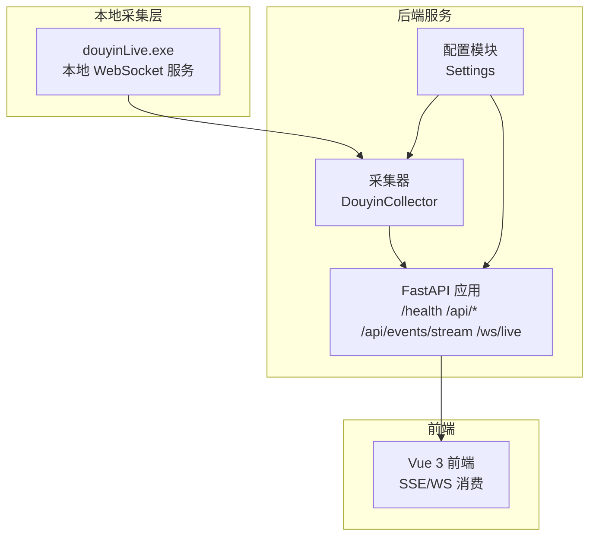
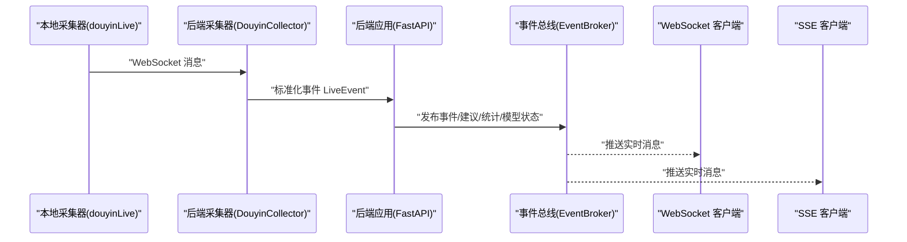
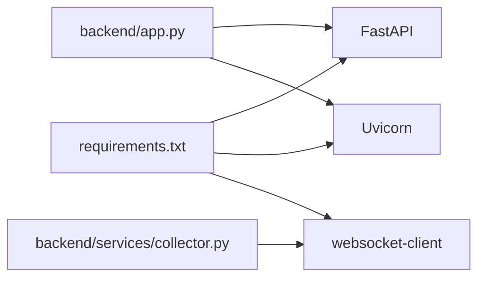

# 网络连通性测试

<cite>
**本文引用的文件**
- [README.md](file://README.md)
- [USAGE.md](file://USAGE.md)
- [requirements.txt](file://requirements.txt)
- [backend/app.py](file://backend/app.py)
- [backend/config.py](file://backend/config.py)
- [backend/services/collector.py](file://backend/services/collector.py)
- [tool/config.yaml](file://tool/config.yaml)
- [start_all.ps1](file://start_all.ps1)
- [start_backend_qwen.ps1](file://start_backend_qwen.ps1)
- [start_frontend.ps1](file://start_frontend.ps1)
</cite>

## 目录
1. [简介](#简介)
2. [项目结构](#项目结构)
3. [核心组件](#核心组件)
4. [架构总览](#架构总览)
5. [详细组件分析](#详细组件分析)
6. [依赖分析](#依赖分析)
7. [性能考虑](#性能考虑)
8. [故障排查指南](#故障排查指南)
9. [结论](#结论)
10. [附录](#附录)

## 简介
本指南围绕“网络连通性测试与诊断”展开，结合本项目的实际运行链路，给出可操作的测试步骤与排障思路。项目由本地抖音直播消息源、后端服务与前端界面构成，涉及本地 WebSocket 连接、SSE/WS 实时推送、以及对外在线模型调用。因此，网络层面的连通性测试应覆盖：
- 本地 WebSocket 可达性（ping/WS）
- 本地 HTTP 服务可达性（健康检查/SSE/WS）
- 外部在线模型服务可达性（DNS 解析、HTTP/HTTPS 出站）
- 代理与企业网络影响评估
- 延迟与带宽影响评估（traceroute/mtr/speedtest）

## 项目结构
该项目采用前后端分离与本地采集器集成的架构：
- 本地采集器：通过本地 WebSocket 提供直播事件流
- 后端服务：FastAPI 提供健康检查、SSE、WebSocket 接口
- 前端：Vue 3 前端，消费 SSE/WS 实时事件
- 在线模型：通过 HTTP 接口调用（默认对接 DashScope/OpenAI 兼容）

图表来源
- [backend/app.py:104-220](file://backend/app.py#L104-L220)
- [backend/config.py:40-94](file://backend/config.py#L40-L94)
- [backend/services/collector.py:38-284](file://backend/services/collector.py#L38-L284)
- [tool/config.yaml:1-16](file://tool/config.yaml#L1-L16)

章节来源
- [README.md:21-48](file://README.md#L21-L48)
- [USAGE.md:9-14](file://USAGE.md#L9-L14)

## 核心组件
- 本地 WebSocket 采集器：负责连接本地消息源并标准化事件，随后进入后端事件循环。
- 后端 FastAPI：提供健康检查、SSE 实时流、WebSocket 实时流、事件注入等接口。
- 前端：通过 SSE/WS 订阅后端推送，展示事件与建议。
- 配置模块：集中管理运行参数，包括本地采集器地址、端口、房间号、在线模型参数等。

章节来源
- [backend/services/collector.py:38-79](file://backend/services/collector.py#L38-L79)
- [backend/app.py:104-220](file://backend/app.py#L104-L220)
- [backend/config.py:40-94](file://backend/config.py#L40-L94)

## 架构总览
下图展示了从本地采集器到后端再到前端的整体链路，以及对外在线模型调用的关键点。

图表来源
- [backend/services/collector.py:117-139](file://backend/services/collector.py#L117-L139)
- [backend/app.py:61-78](file://backend/app.py#L61-L78)
- [backend/app.py:187-220](file://backend/app.py#L187-L220)

## 详细组件分析

### 本地 WebSocket 连通性测试
- 目标：验证本地采集器 WebSocket 服务可达，且后端采集器能成功连接。
- 关键地址与端口：默认本地 WebSocket 地址为 ws://127.0.0.1:1088/ws/{room_id}。
- 测试要点：
  - 本地回环连通性：使用 ping 127.0.0.1 验证本机网络栈。
  - 端口监听：确认本地 1088 端口处于监听状态（可使用 netstat/ss 查看）。
  - WebSocket 可达：使用浏览器或 WebSocket 客户端连接 ws://127.0.0.1:1088/ws/{room_id}，观察握手与心跳。
  - 后端采集器日志：关注连接建立、心跳发送、断线重连等日志。

章节来源
- [backend/services/collector.py:54-59](file://backend/services/collector.py#L54-L59)
- [backend/config.py:46-50](file://backend/config.py#L46-L50)
- [tool/config.yaml:4-5](file://tool/config.yaml#L4-L5)

### 后端 HTTP 服务连通性测试
- 目标：验证后端服务监听与接口可用。
- 关键地址与端口：默认 http://127.0.0.1:8010。
- 测试要点：
  - 健康检查：访问 /health，确认返回服务状态与房间号。
  - SSE 接口：访问 /api/events/stream，确认事件流推送。
  - WebSocket 接口：访问 /ws/live，确认握手与推送。
  - 端口占用：若 8010 端口被占用，需调整端口或释放占用。

章节来源
- [backend/app.py:104-106](file://backend/app.py#L104-L106)
- [backend/app.py:187-206](file://backend/app.py#L187-L206)
- [backend/app.py:209-220](file://backend/app.py#L209-L220)
- [backend/config.py:43-44](file://backend/config.py#L43-L44)

### 在线模型服务连通性测试
- 目标：验证对外在线模型服务（DashScope/OpenAI 兼容）可达。
- 关键地址与端口：默认 HTTPS 出站，域名解析与 TLS 握手。
- 测试要点：
  - DNS 解析：nslookup 或 dig 解析 dashscope.aliyuncs.com 或 api.openai.com。
  - 出站连通：curl 或浏览器访问 HTTPS 地址，确认证书与响应。
  - 超时与限流：根据 LLM 超时配置与网络状况评估。

章节来源
- [backend/config.py:70-90](file://backend/config.py#L70-L90)
- [USAGE.md:215-217](file://USAGE.md#L215-L217)

### 代理与企业网络影响评估
- 目标：识别代理、企业防火墙、安全策略对本地与外网通信的影响。
- 评估要点：
  - 本地代理：若系统配置了 HTTP/HTTPS 代理，需确认代理对 127.0.0.1 与 1088/8010 端口的影响。
  - 企业网络：检查是否允许访问 DashScope/OpenAI 兼容域名；是否限制出站 HTTPS。
  - 安全软件：确认杀软/防火墙未拦截本地 WebSocket 或后端进程。

章节来源
- [USAGE.md:215-217](file://USAGE.md#L215-L217)

### 延迟与带宽测试
- 目标：评估网络延迟与吞吐对实时体验的影响。
- 方法建议：
  - traceroute/tracert：追踪到目标域名的路由路径，识别潜在瓶颈。
  - mtr：持续测试路径与丢包率，定位不稳定段。
  - speedtest：评估下行/上行带宽，辅助判断是否受限。

章节来源
- [USAGE.md:215-217](file://USAGE.md#L215-L217)

### 不同操作系统下的网络诊断工具使用
- Windows
  - 本地连通性：ping 127.0.0.1、netstat -an | findstr :1088、:8010
  - 外网连通性：nslookup dashscope.aliyuncs.com、curl HTTPS 地址
- Linux/macOS
  - 本地连通性：ping 127.0.0.1、ss -tuln | grep :1088、:8010
  - 外网连通性：nslookup/openresolv 解析、curl HTTPS 地址

章节来源
- [USAGE.md:215-217](file://USAGE.md#L215-L217)

## 依赖分析
- 后端依赖
  - FastAPI、Uvicorn：提供 HTTP/SSE/WebSocket 服务
  - websocket-client：与本地 WebSocket 采集器通信
  - Redis、Chroma：可选增强（不影响基础连通性测试）

图表来源
- [requirements.txt:1-6](file://requirements.txt#L1-L6)
- [backend/app.py:94-101](file://backend/app.py#L94-L101)
- [backend/services/collector.py:14](file://backend/services/collector.py#L14)

章节来源
- [requirements.txt:1-6](file://requirements.txt#L1-L6)

## 性能考虑
- 本地 WebSocket 心跳：采集器周期性发送 ping，确保连接稳定；若心跳失败，可能导致事件丢失。
- SSE/WS 推送：前端订阅实时事件，网络抖动会影响刷新频率与延迟。
- 在线模型调用：超时与限流直接影响建议生成成功率与回退策略。

章节来源
- [backend/services/collector.py:182-198](file://backend/services/collector.py#L182-L198)
- [backend/config.py:59-61](file://backend/config.py#L59-L61)

## 故障排查指南
- 页面打开但无建议
  - 检查本地采集器是否启动、房间号是否正确、直播间是否开播
  - 后端是否已重启到最新版本
- 顶部显示 fallback
  - 检查在线模型密钥、网络访问 DashScope、是否存在超时或限流
- 顶部显示 heuristic
  - 检查 .env 中 LLM_MODE 设置或环境变量加载
- 前端无法打开
  - 检查前端启动脚本、5173 端口占用情况
- 后端启动但未写入数据
  - 检查本地采集器是否运行、后端日志中是否连接到 ws://127.0.0.1:1088/ws/{room_id}

章节来源
- [USAGE.md:200-240](file://USAGE.md#L200-L240)

## 结论
本指南提供了从本地 WebSocket 采集、后端 HTTP 服务到外部在线模型调用的全链路连通性测试方法。结合 ping、nslookup、traceroute/mtr、speedtest 等工具，可快速定位网络问题；同时，依据项目配置与日志，可精准判断是本地采集器、后端服务还是外网访问环节出现异常。

## 附录
- 启动脚本与默认地址
  - 后端默认地址：http://127.0.0.1:8010
  - 前端默认地址：http://127.0.0.1:5173
  - 本地 WebSocket 默认地址：ws://127.0.0.1:1088/ws/{room_id}

章节来源
- [USAGE.md:118-122](file://USAGE.md#L118-L122)
- [README.md:136-140](file://README.md#L136-L140)
- [backend/services/collector.py:54-59](file://backend/services/collector.py#L54-L59)