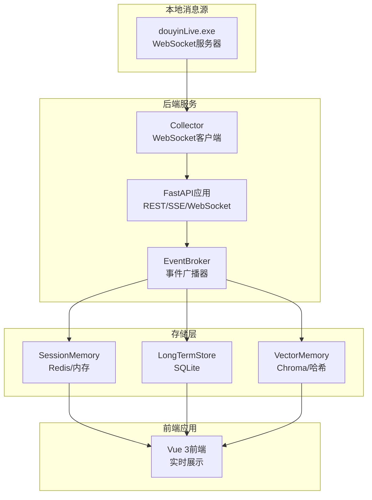
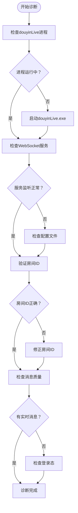
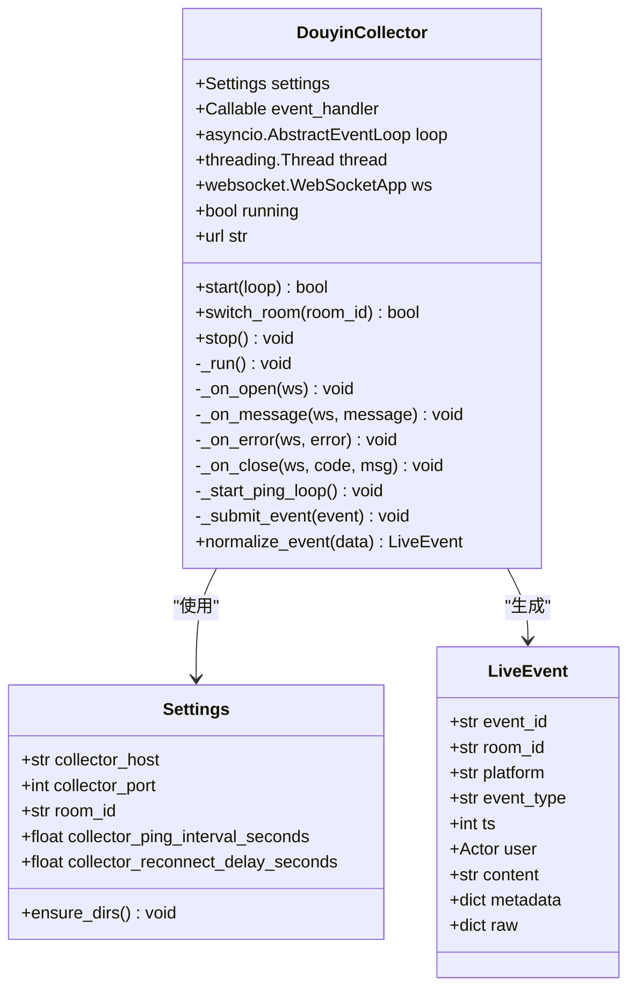
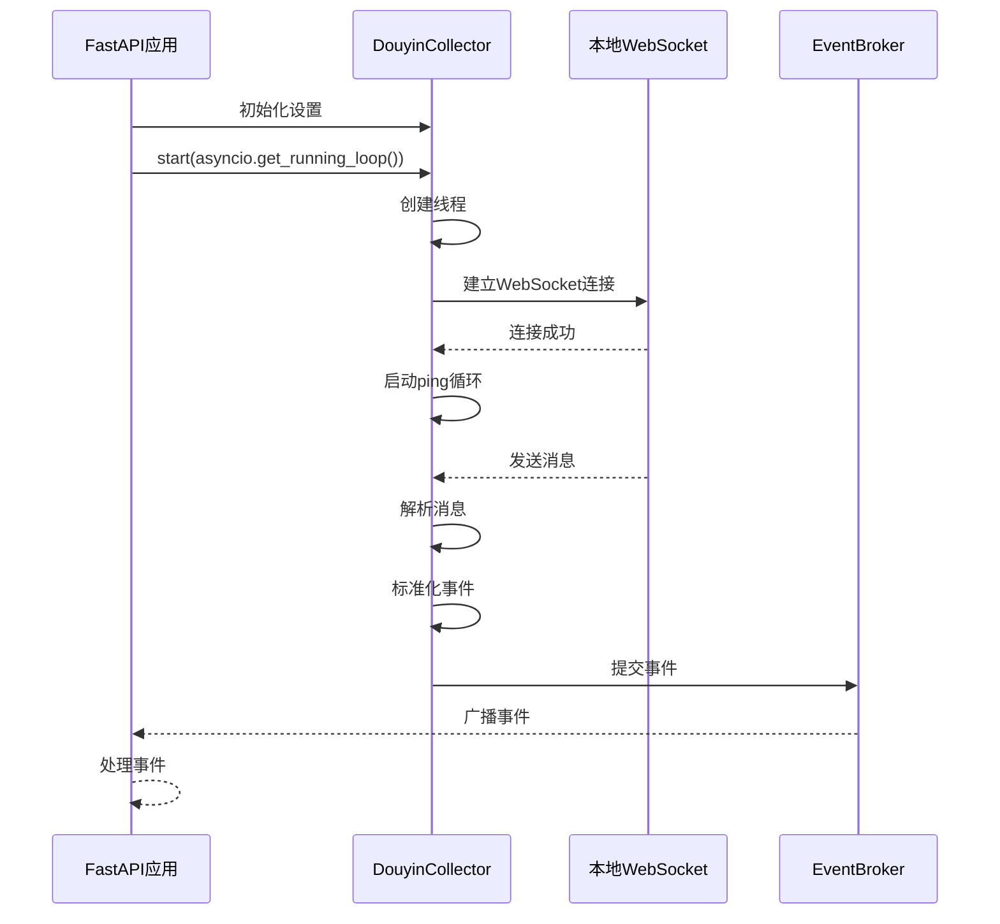
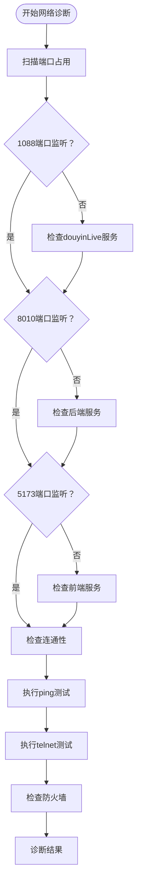
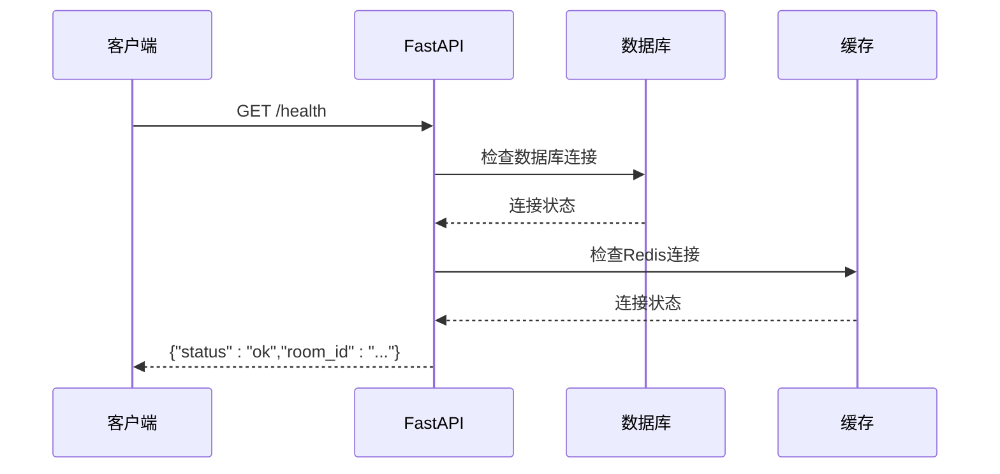
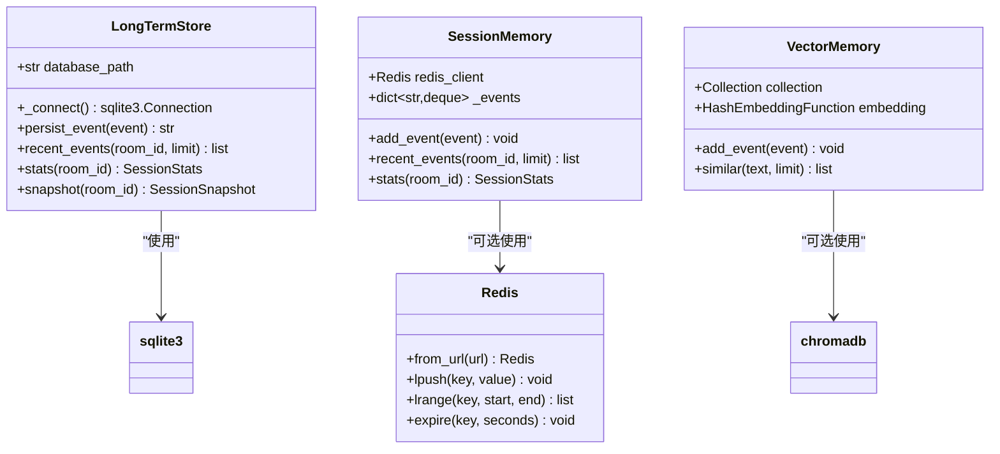
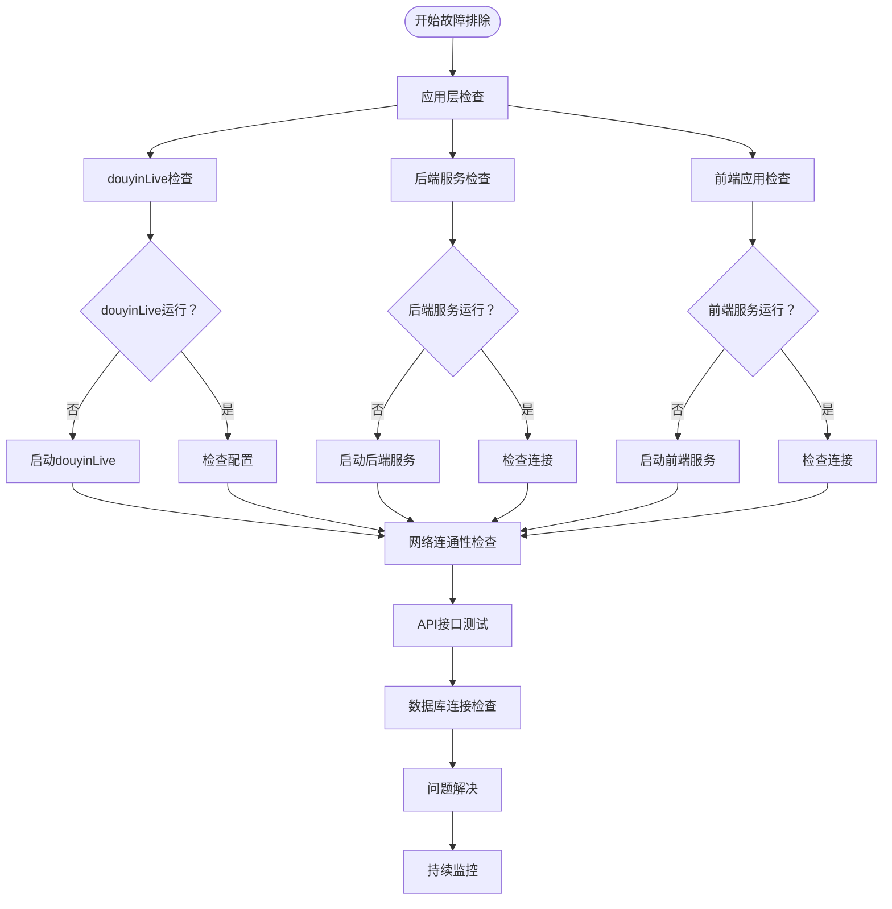

# 连接问题

<cite>
**本文档引用的文件**
- [README.md](file://README.md)
- [USAGE.md](file://USAGE.md)
- [backend/app.py](file://backend/app.py)
- [backend/config.py](file://backend/config.py)
- [backend/services/collector.py](file://backend/services/collector.py)
- [backend/services/broker.py](file://backend/services/broker.py)
- [backend/memory/vector_store.py](file://backend/memory/vector_store.py)
- [backend/memory/long_term.py](file://backend/memory/long_term.py)
- [backend/memory/session_memory.py](file://backend/memory/session_memory.py)
- [backend/schemas/live.py](file://backend/schemas/live.py)
- [requirements.txt](file://requirements.txt)
- [start_all.ps1](file://start_all.ps1)
</cite>

## 目录
1. [简介](#简介)
2. [项目架构概览](#项目架构概览)
3. [连接问题诊断总览](#连接问题诊断总览)
4. [douyinLive可执行文件诊断](#douyinlive可执行文件诊断)
5. [本地WebSocket服务器诊断](#本地websocket服务器诊断)
6. [后端collector服务诊断](#后端collector服务诊断)
7. [网络连通性检查](#网络连通性检查)
8. [API接口可用性测试](#api接口可用性测试)
9. [数据库连接问题诊断](#数据库连接问题诊断)
10. [常见错误及解决方案](#常见错误及解决方案)
11. [故障排除流程图](#故障排除流程图)
12. [预防性维护建议](#预防性维护建议)

## 简介

本指南专门针对抖音直播场景的实时提词系统中的连接问题进行全面诊断。该系统采用三层架构：本地消息源(douyinLive)、后端FastAPI服务、前端Vue应用，通过WebSocket实现实时数据传输。本文档提供了从底层到高层的完整连接问题排查方法，涵盖douyinLive可执行文件、本地WebSocket服务器、后端collector服务、网络连通性、API接口可用性以及数据库连接等各个方面。

## 项目架构概览

系统采用典型的生产者-消费者架构，数据流向清晰明确：



**图表来源**
- [backend/app.py:84-92](file://backend/app.py#L84-L92)
- [backend/services/collector.py:38-53](file://backend/services/collector.py#L38-L53)
- [backend/services/broker.py:10-21](file://backend/services/broker.py#L10-L21)

## 连接问题诊断总览

### 诊断层次结构

系统连接问题按层次可分为三个层面：

1. **应用层连接问题**：douyinLive可执行文件、后端服务、前端应用
2. **网络层连接问题**：WebSocket连接、HTTP接口、端口监听
3. **存储层连接问题**：数据库、缓存、向量数据库

### 诊断优先级

按照影响范围和紧急程度，建议的诊断顺序：
1. 应用层基础连接验证
2. 网络连通性检查
3. API接口可用性测试
4. 存储层连接诊断
5. 特定错误类型处理

## douyinLive可执行文件诊断

### 启动状态检查

douyinLive作为本地WebSocket服务器，是整个系统的基础。需要验证其运行状态和配置正确性。

#### 启动验证步骤

1. **进程状态检查**
   - 确认douyinLive.exe进程正在运行
   - 检查进程是否处于正常工作状态而非崩溃退出
   - 验证进程权限是否足够访问网络

2. **WebSocket服务验证**
   - 确认本地WebSocket服务在127.0.0.1:1088端口监听
   - 验证房间ID配置正确性
   - 检查登录态Cookie配置（如需要）

3. **消息源质量检查**
   - 确认直播间确实有实时消息
   - 验证消息格式符合预期
   - 检查消息延迟情况

#### 配置文件检查



**图表来源**
- [USAGE.md:49-72](file://USAGE.md#L49-L72)
- [README.md:68-80](file://README.md#L68-L80)

**章节来源**
- [USAGE.md:49-72](file://USAGE.md#L49-L72)
- [USAGE.md:198-208](file://USAGE.md#L198-L208)
- [README.md:68-80](file://README.md#L68-L80)

## 本地WebSocket服务器诊断

### 服务器状态监控

本地WebSocket服务器负责将抖音直播消息转换为统一格式供后端消费。

#### 服务器组件分析



**图表来源**
- [backend/services/collector.py:38-284](file://backend/services/collector.py#L38-L284)
- [backend/config.py:39-94](file://backend/config.py#L39-L94)
- [backend/schemas/live.py:29-44](file://backend/schemas/live.py#L29-L44)

#### 连接状态检查要点

1. **连接建立检查**
   - 验证collector是否成功连接到ws://127.0.0.1:1088/ws/{room_id}
   - 检查连接状态标志位running
   - 确认ping循环正常运行

2. **消息处理验证**
   - 验证JSON消息解析正确性
   - 检查事件标准化过程
   - 确认事件提交到异步事件循环

3. **重连机制测试**
   - 验证断线自动重连
   - 检查重连延迟配置
   - 确认重连后状态恢复

**章节来源**
- [backend/services/collector.py:117-181](file://backend/services/collector.py#L117-L181)
- [backend/services/collector.py:200-214](file://backend/services/collector.py#L200-L214)

## 后端collector服务诊断

### 服务组件架构

后端collector服务作为WebSocket客户端，负责与本地消息源建立连接并处理消息。

#### 服务启动流程



**图表来源**
- [backend/app.py:84-92](file://backend/app.py#L84-L92)
- [backend/services/collector.py:61-78](file://backend/services/collector.py#L61-L78)
- [backend/services/collector.py:117-139](file://backend/services/collector.py#L117-L139)

#### 关键配置参数

| 参数名 | 默认值 | 作用 | 诊断要点 |
|--------|--------|------|----------|
| COLLECTOR_ENABLED | true | 启用/禁用采集器 | 检查配置是否正确 |
| COLLECTOR_HOST | 127.0.0.1 | WebSocket主机 | 确认IP可达性 |
| COLLECTOR_PORT | 1088 | WebSocket端口 | 检查端口占用 |
| ROOM_ID | 32137571630 | 直播间标识 | 验证房间ID正确性 |
| PING_INTERVAL_SECONDS | 30 | 心跳间隔 | 检查心跳频率 |
| RECONNECT_DELAY_SECONDS | 3 | 重连延迟 | 验证重连策略 |

**章节来源**
- [backend/config.py:43-61](file://backend/config.py#L43-L61)
- [backend/services/collector.py:54-59](file://backend/services/collector.py#L54-L59)

## 网络连通性检查

### 端口和服务验证

网络连通性是系统正常运行的基础，需要逐层验证各个网络组件。

#### 端口监听检查



**图表来源**
- [USAGE.md:116-122](file://USAGE.md#L116-L122)
- [README.md:130-140](file://README.md#L130-L140)

#### 连通性测试方法

1. **Ping测试**
   ```bash
   # 测试本地环回连接
   ping 127.0.0.1
   
   # 测试端口连通性
   telnet 127.0.0.1 1088
   telnet 127.0.0.1 8010
   telnet 127.0.0.1 5173
   ```

2. **Telnet测试**
   - 验证端口是否开放
   - 检查端口响应时间
   - 确认服务正常响应

3. **防火墙检查**
   - 检查Windows防火墙规则
   - 验证入站/出站规则
   - 确认端口放行配置

**章节来源**
- [USAGE.md:116-122](file://USAGE.md#L116-L122)
- [README.md:130-140](file://README.md#L130-L140)

## API接口可用性测试

### 接口测试矩阵

API接口是系统对外提供服务的主要通道，需要定期进行可用性测试。

#### 健康检查接口



**图表来源**
- [backend/app.py:104-107](file://backend/app.py#L104-L107)

#### 接口测试清单

| 接口 | 方法 | 路径 | 测试要点 | 预期结果 |
|------|------|------|----------|----------|
| 健康检查 | GET | /health | 服务状态、房间ID、会话状态 | 返回状态码200 |
| 前端快照 | GET | /api/bootstrap | 最近事件、建议、统计 | 返回完整快照 |
| 房间切换 | POST | /api/room | 房间ID验证、会话关闭 | 返回新房间快照 |
| 事件注入 | POST | /api/events | 事件格式验证、处理流程 | 返回接受确认 |
| 事件流 | GET | /api/events/stream | SSE连接、事件推送 | 建立连接并推送事件 |
| WebSocket | GET | /ws/live | WebSocket连接、消息推送 | 建立连接并推送快照 |

#### 接口测试命令

```bash
# 健康检查
curl http://127.0.0.1:8010/health

# 前端快照
curl "http://127.0.0.1:8010/api/bootstrap?room_id=32137571630"

# 房间切换
curl -X POST http://127.0.0.1:8010/api/room \
  -H "Content-Type: application/json" \
  -d '{"room_id": "32137571630"}'

# 事件注入
curl -X POST http://127.0.0.1:8010/api/events \
  -H "Content-Type: application/json" \
  -d '{"event_id": "test123","room_id": "32137571630","event_type": "comment","content": "测试内容"}'
```

**章节来源**
- [backend/app.py:104-133](file://backend/app.py#L104-L133)
- [README.md:208-275](file://README.md#L208-L275)

## 数据库连接问题诊断

### 存储层架构分析

系统采用多层存储架构，确保在不同依赖缺失时仍能正常运行。

#### 存储层组件



**图表来源**
- [backend/memory/long_term.py:36-40](file://backend/memory/long_term.py#L36-L40)
- [backend/memory/session_memory.py:17-31](file://backend/memory/session_memory.py#L17-L31)
- [backend/memory/vector_store.py:52-63](file://backend/memory/vector_store.py#L52-L63)

#### SQLite数据库诊断

1. **数据库文件检查**
   - 验证data/live_prompter.db文件存在
   - 检查文件权限是否正确
   - 确认磁盘空间充足

2. **表结构验证**
   - 验证核心表是否存在：events、suggestions、viewer_profiles
   - 检查索引是否完整
   - 确认表结构版本匹配

3. **数据完整性检查**
   - 验证事件记录完整性
   - 检查建议记录一致性
   - 确认用户画像数据正确性

#### Redis连接诊断

1. **连接状态检查**
   - 验证Redis服务运行状态
   - 检查连接URL格式正确性
   - 确认认证凭据有效

2. **数据访问测试**
   - 验证事件列表操作
   - 检查建议列表访问
   - 确认TTL设置生效

#### Chroma向量数据库诊断

1. **Chroma服务检查**
   - 验证Chroma客户端连接
   - 检查持久化目录权限
   - 确认嵌入函数正常工作

2. **向量检索测试**
   - 验证向量索引创建
   - 检查相似度查询
   - 确认降级机制正常

**章节来源**
- [backend/memory/long_term.py:50-155](file://backend/memory/long_term.py#L50-L155)
- [backend/memory/session_memory.py:29-31](file://backend/memory/session_memory.py#L29-L31)
- [backend/memory/vector_store.py:60-83](file://backend/memory/vector_store.py#L60-L83)

## 常见错误及解决方案

### 连接超时问题

#### 问题特征
- WebSocket连接建立缓慢
- 请求响应时间过长
- 服务无响应或超时

#### 诊断步骤
1. **网络延迟测试**
   - 使用ping测试本地延迟
   - 检查端口响应时间
   - 验证DNS解析速度

2. **资源瓶颈检查**
   - 监控CPU使用率
   - 检查内存占用情况
   - 确认磁盘I/O性能

3. **配置优化**
   - 调整超时参数设置
   - 优化重连策略
   - 检查网络缓冲区大小

#### 解决方案
- 增加超时阈值
- 优化网络配置
- 升级硬件资源

### 认证失败问题

#### 问题特征
- WebSocket握手失败
- API请求返回401状态
- 数据库连接拒绝

#### 诊断步骤
1. **凭证验证**
   - 检查API密钥格式
   - 验证房间ID正确性
   - 确认认证头设置

2. **权限检查**
   - 验证用户权限级别
   - 检查IP白名单设置
   - 确认令牌有效期

3. **服务端配置**
   - 检查认证中间件
   - 验证安全策略
   - 确认会话管理

#### 解决方案
- 更新有效的API密钥
- 修正房间ID配置
- 重新生成认证令牌

### 协议不匹配问题

#### 问题特征
- WebSocket协议升级失败
- HTTP版本不兼容
- SSL/TLS握手错误

#### 诊断步骤
1. **协议版本检查**
   - 验证WebSocket版本
   - 检查HTTP协议支持
   - 确认SSL证书有效性

2. **浏览器兼容性**
   - 测试不同浏览器
   - 检查WebSocket支持
   - 验证跨域策略

3. **服务器配置**
   - 检查协议支持
   - 验证压缩算法
   - 确认头部设置

#### 解决方案
- 统一协议版本
- 更新服务器配置
- 修复SSL证书

### 数据库连接问题

#### SQLite连接失败
- 检查数据库文件路径
- 验证文件权限设置
- 确认磁盘空间充足

#### Redis连接异常
- 验证Redis服务状态
- 检查连接URL格式
- 确认网络连通性

#### Chroma连接错误
- 检查Chroma服务运行
- 验证嵌入函数配置
- 确认持久化目录权限

**章节来源**
- [USAGE.md:198-240](file://USAGE.md#L198-L240)
- [backend/config.py:63-69](file://backend/config.py#L63-L69)

## 故障排除流程图

### 综合故障排除流程



**图表来源**
- [start_all.ps1:11-17](file://start_all.ps1#L11-L17)
- [USAGE.md:89-114](file://USAGE.md#L89-L114)

### 快速诊断检查表

| 诊断类别 | 检查项目 | 期望状态 | 备注 |
|----------|----------|----------|------|
| 应用层 | douyinLive进程 | 正常运行 | 检查进程ID |
| 应用层 | 后端服务进程 | 正常运行 | 检查端口占用 |
| 应用层 | 前端服务进程 | 正常运行 | 检查端口占用 |
| 网络层 | 1088端口监听 | 开放状态 | 检查防火墙 |
| 网络层 | 8010端口监听 | 开放状态 | 检查防火墙 |
| 网络层 | 5173端口监听 | 开放状态 | 检查防火墙 |
| API层 | /health接口 | 200状态码 | 检查服务状态 |
| API层 | /api/bootstrap接口 | 返回数据 | 检查房间ID |
| 存储层 | SQLite数据库 | 可访问 | 检查文件权限 |
| 存储层 | Redis连接 | 成功连接 | 检查URL格式 |
| 存储层 | Chroma连接 | 成功连接 | 检查嵌入函数 |

## 预防性维护建议

### 日常维护任务

1. **监控指标设置**
   - 连接成功率监控
   - 响应时间跟踪
   - 错误率统计

2. **备份策略**
   - 数据库定期备份
   - 配置文件版本控制
   - 日志轮转管理

3. **性能优化**
   - 连接池配置优化
   - 缓存策略调整
   - 索引维护计划

### 最佳实践

1. **配置管理**
   - 使用环境变量管理敏感信息
   - 定期更新API密钥
   - 版本化配置文件

2. **日志管理**
   - 结构化日志输出
   - 异常堆栈追踪
   - 性能指标记录

3. **安全加固**
   - 最小权限原则
   - 加密通信启用
   - 访问控制策略

通过遵循本指南提供的诊断方法和最佳实践，可以有效识别和解决系统中的连接问题，确保抖音直播场景的实时提词系统稳定可靠地运行。