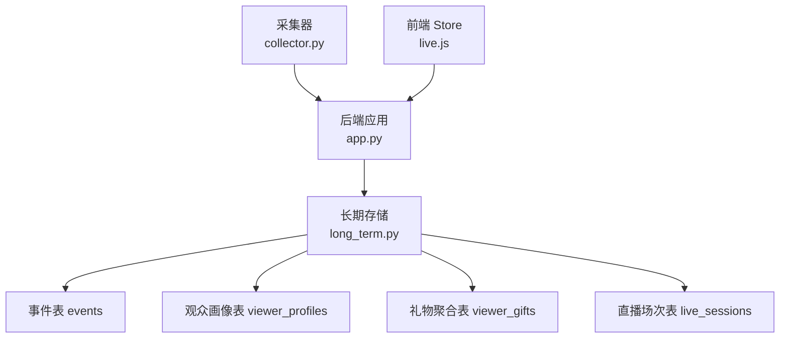
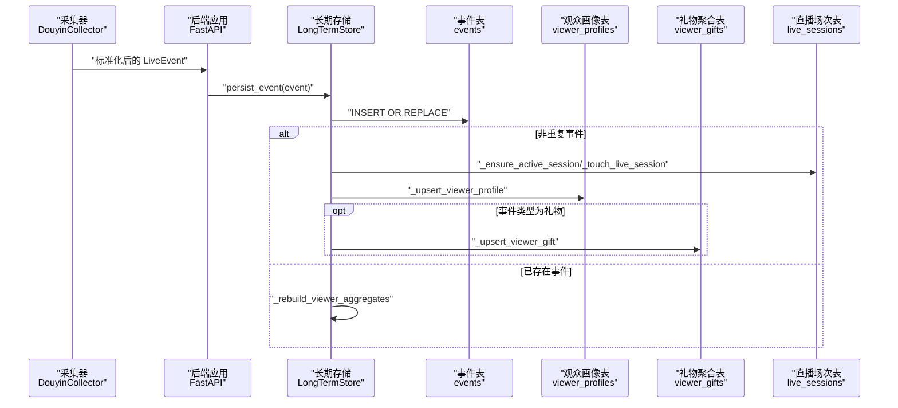
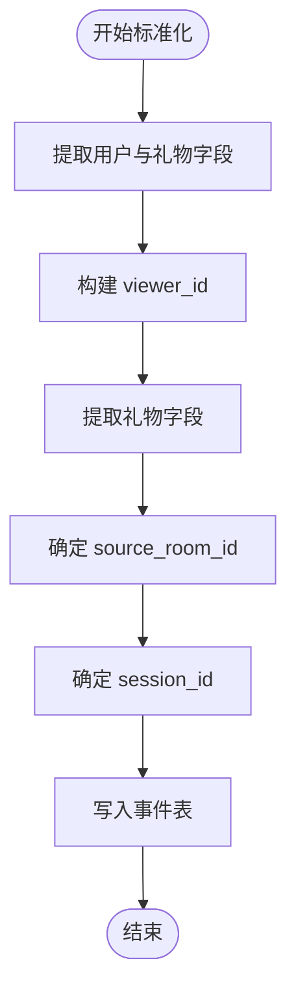

# 事件表设计

<cite>
**本文引用的文件列表**
- [DATABASE.md](file://data/DATABASE.md)
- [long_term.py](file://backend/memory/long_term.py)
- [live.py](file://backend/schemas/live.py)
- [collector.py](file://backend/services/collector.py)
- [app.py](file://backend/app.py)
- [config.py](file://backend/config.py)
- [live.js](file://frontend/src/stores/live.js)
</cite>

## 目录
1. [简介](#简介)
2. [项目结构与角色定位](#项目结构与角色定位)
3. [事件表核心结构](#事件表核心结构)
4. [架构总览](#架构总览)
5. [组件与流程详解](#组件与流程详解)
6. [索引策略与查询优化](#索引策略与查询优化)
7. [数据生命周期与存储优化](#数据生命周期与存储优化)
8. [数据标准化与清洗](#数据标准化与清洗)
9. [最佳实践与常见查询模式](#最佳实践与常见查询模式)
10. [故障排查指南](#故障排查指南)
11. [结论](#结论)

## 简介
本文件围绕事件表(events)进行完整设计说明，覆盖字段定义、数据类型、约束、索引策略、查询优化、数据标准化、生命周期管理、与其他表的关系以及最佳实践。事件表用于持久化直播过程中的原始事件（如评论、礼物、点赞、关注、成员进入、系统事件），并为上层统计与分析提供基础。

## 项目结构与角色定位
- 事件采集：通过采集器从外部直播平台接入原始消息，标准化为统一的事件模型。
- 事件处理：后端应用接收事件，写入会话内存、向量库与长期存储；同时发布到事件总线供前端实时订阅。
- 长期存储：事件表(events)负责事件的持久化，配合其他聚合表（观众画像、礼物聚合、直播场次）支撑查询与报表。

图表来源
- [collector.py:225-284](file://backend/services/collector.py#L225-L284)
- [app.py:61-78](file://backend/app.py#L61-L78)
- [long_term.py:54-149](file://backend/memory/long_term.py#L54-L149)
- [live.js:158-205](file://frontend/src/stores/live.js#L158-L205)

章节来源
- [app.py:61-78](file://backend/app.py#L61-L78)
- [collector.py:225-284](file://backend/services/collector.py#L225-L284)
- [long_term.py:54-149](file://backend/memory/long_term.py#L54-L149)
- [live.js:158-205](file://frontend/src/stores/live.js#L158-L205)

## 事件表核心结构
事件表(events)用于保存每一条直播事件的原始记录，包含主键、房间标识、事件类型、时间戳、用户身份、内容、礼物信息、元数据与原始消息等字段。以下为关键字段说明与约束（基于数据库DDL与业务逻辑推导）：

- 主键 event_id
  - 类型：文本
  - 约束：非空，唯一
  - 作用：事件唯一标识，用于去重与幂等写入
- 房间标识 room_id
  - 类型：文本
  - 约束：非空
  - 作用：事件所属房间，用于分区查询
- 源房间标识 source_room_id
  - 类型：文本
  - 默认值：空字符串
  - 作用：原始消息中的真实房间号，便于跨房间追踪
- 会话标识 session_id
  - 类型：文本
  - 默认值：空字符串
  - 作用：事件所属直播会话，支持按会话聚合统计
- 平台 platform
  - 类型：文本
  - 默认值："douyin"
  - 作用：事件来源平台，便于多平台扩展
- 用户标识 user_id / short_id / sec_uid / nickname
  - 类型：文本
  - 默认值：空字符串
  - 作用：用户身份字段，配合 viewer_id 统一识别
- 观众唯一标识 viewer_id
  - 类型：文本
  - 默认值：空字符串
  - 作用：统一的观众标识，生成规则见下节“数据标准化”
- 事件类型 event_type
  - 类型：文本
  - 取值示例："comment" / "member" / "gift" / "like" / "follow" / "system"
  - 作用：事件分类，用于过滤与统计
- 方法 method
  - 类型：文本
  - 默认值："unknown"
  - 作用：事件来源方法名，便于溯源
- 直播名称 livename
  - 类型：文本
  - 默认值："未知直播间"
  - 作用：直播标题，便于展示
- 内容 content
  - 类型：文本
  - 默认值：空字符串
  - 作用：事件内容（如评论文本）
- 时间戳 ts
  - 类型：整数（毫秒）
  - 约束：非空
  - 作用：事件发生时间，用于排序与窗口分析
- 礼物相关 gift_name / gift_id / gift_count / gift_diamond_count
  - 类型：文本/整数
  - 默认值：gift_count默认0，其余空字符串
  - 作用：礼物事件的名称、ID、数量、钻石消耗
- 元数据与原始消息 metadata_json / raw_json
  - 类型：文本（JSON）
  - 默认值：空字符串
  - 作用：标准化后的元数据与原始消息，便于检索与回溯

章节来源
- [DATABASE.md:16-32](file://data/DATABASE.md#L16-L32)
- [long_term.py:54-67](file://backend/memory/long_term.py#L54-L67)
- [long_term.py:155-171](file://backend/memory/long_term.py#L155-L171)
- [live.py:29-44](file://backend/schemas/live.py#L29-L44)

## 架构总览
事件从采集器标准化后进入后端应用，随后写入会话内存、向量库与长期存储。长期存储中，事件表承担原始事件的持久化职责，并通过索引与聚合表支撑高效查询。

图表来源
- [collector.py:225-284](file://backend/services/collector.py#L225-L284)
- [app.py:61-78](file://backend/app.py#L61-L78)
- [long_term.py:420-454](file://backend/memory/long_term.py#L420-L454)
- [long_term.py:276-324](file://backend/memory/long_term.py#L276-L324)
- [long_term.py:326-402](file://backend/memory/long_term.py#L326-L402)

## 组件与流程详解

### 事件采集与标准化
- 采集器从外部直播平台接入消息，根据方法名映射事件类型，抽取用户与礼物信息，构造统一的事件模型。
- 标准化过程中会补充来源房间号、礼物计数、钻石消耗等元数据。

章节来源
- [collector.py:225-284](file://backend/services/collector.py#L225-L284)
- [live.py:29-44](file://backend/schemas/live.py#L29-L44)

### 事件持久化与会话管理
- 长期存储在写入事件前检查是否已存在相同 event_id；若不存在则分配活跃会话 session_id，并更新直播场次统计。
- 对于重复事件，触发对聚合表的重建以保持一致性。

章节来源
- [long_term.py:420-454](file://backend/memory/long_term.py#L420-L454)
- [long_term.py:276-324](file://backend/memory/long_term.py#L276-L324)

### 观众画像与礼物聚合
- 写入事件后，按房间与观众维度更新观众画像表与礼物聚合表，支持后续查询与分析。

章节来源
- [long_term.py:326-402](file://backend/memory/long_term.py#L326-L402)

## 索引策略与查询优化
事件表的索引设计围绕高频查询模式展开，确保按房间、时间、观众、事件类型与会话ID的高效检索。

- 复合索引
  - idx_events_room_ts(room_id, ts DESC)
    - 用途：按房间倒序查询最新事件
    - 性能：避免全表扫描，加速时间序列查询
  - idx_events_room_viewer_ts(room_id, viewer_id, ts DESC)
    - 用途：按房间+观众倒序查询事件历史
    - 性能：支持观众画像与互动历史查询
  - idx_events_room_event_type_ts(room_id, event_type, ts DESC)
    - 用途：按房间+事件类型倒序查询
    - 性能：支持分类型统计与筛选
  - idx_events_session_id(session_id)
    - 用途：按会话ID查询事件
    - 性能：支持直播场次内事件聚合

- 单列索引
  - idx_events_event_id(event_id)
    - 用途：主键唯一性约束，加速幂等写入与去重
  - idx_events_room_id(room_id)
    - 用途：按房间过滤
  - idx_events_viewer_id(viewer_id)
    - 用途：按观众过滤
  - idx_events_event_type(event_type)
    - 用途：按事件类型过滤

- 查询优化建议
  - 使用复合索引时，遵循最左前缀原则，优先将房间号放在首位，再按需添加观众、事件类型、时间戳。
  - 对于时间范围查询，建议结合房间与时间戳索引，避免在WHERE子句中对索引列使用函数或表达式。
  - 对于会话聚合，优先使用 session_id 索引，减少JOIN成本。

章节来源
- [long_term.py:183-195](file://backend/memory/long_term.py#L183-L195)
- [DATABASE.md:101-150](file://data/DATABASE.md#L101-L150)

## 数据生命周期与存储优化
- 存储介质：SQLite 文件数据库，路径由配置项指定。
- 数据保留策略：仓库未提供明确的自动清理策略。建议结合业务需求制定保留周期（例如按月/季度清理历史事件），并在清理前确保聚合表已重建。
- 自动清理机制：当前未实现自动清理逻辑。可通过定期任务执行删除过期事件并重建聚合表的方式实现。
- 存储优化
  - 合理使用索引，避免冗余索引造成写入开销。
  - 将大字段（如 JSON 文本）与频繁查询字段分离，必要时拆表或归档。
  - 定期维护数据库（如 VACUUM/ANALYZE）以保持查询性能。

章节来源
- [config.py:52](file://backend/config.py#L52)
- [long_term.py:404-420](file://backend/memory/long_term.py#L404-L420)

## 数据标准化与清洗
事件表的标准化流程将采集器的原始消息转换为统一的结构化事件，确保字段一致性与可查询性。

- 字段提取与清洗
  - 观众唯一标识 viewer_id：优先使用 user.id，其次 secUid，再短ID，最后昵称，均为空则置空。
  - 礼物字段：从原始消息与元数据中提取礼物名称、ID、数量、钻石消耗，缺失时采用默认值。
  - 源房间号 source_room_id：优先来自元数据或原始消息，否则回退到事件中的房间号。
  - 会话 ID：若事件已存在且已有会话ID，则沿用；否则创建或获取活跃会话。
- 回填与补全
  - 在数据库初始化阶段，对历史事件进行回填，补齐缺失的标准化字段，确保后续查询一致性。

图表来源
- [long_term.py:216-243](file://backend/memory/long_term.py#L216-L243)
- [long_term.py:245-276](file://backend/memory/long_term.py#L245-L276)
- [collector.py:225-284](file://backend/services/collector.py#L225-L284)

章节来源
- [long_term.py:216-243](file://backend/memory/long_term.py#L216-L243)
- [long_term.py:245-276](file://backend/memory/long_term.py#L245-L276)
- [collector.py:225-284](file://backend/services/collector.py#L225-L284)

## 最佳实践与常见查询模式
- 写入最佳实践
  - 使用 event_id 作为幂等写入的关键，避免重复事件。
  - 在写入前检查是否存在相同 event_id，若存在则沿用 session_id。
  - 礼物事件应确保 gift_count 与 gift_diamond_count 的正确计算。
- 常见查询模式
  - 按房间查询最新事件：使用 idx_events_room_ts
  - 按房间+观众查询历史：使用 idx_events_room_viewer_ts
  - 按房间+事件类型查询：使用 idx_events_room_event_type_ts
  - 按会话查询事件：使用 idx_events_session_id
- SQL 示例参考
  - 查看一个观众的评论历史
  - 查看当前活动场次
  - 查看观众的礼物聚合

章节来源
- [DATABASE.md:101-150](file://data/DATABASE.md#L101-L150)
- [long_term.py:467-485](file://backend/memory/long_term.py#L467-L485)
- [long_term.py:566-586](file://backend/memory/long_term.py#L566-L586)
- [long_term.py:688-698](file://backend/memory/long_term.py#L688-L698)

## 故障排查指南
- 事件未入库或重复入库
  - 检查 event_id 是否唯一，确认幂等写入逻辑是否生效。
  - 若重复事件导致聚合表异常，可触发重建流程。
- 查询性能下降
  - 确认是否使用了合适的复合索引，避免在索引列上使用函数或表达式。
  - 对于大量数据，考虑分页与限制返回条数。
- 会话统计不准确
  - 检查会话创建与更新逻辑，确保在写入事件时正确更新直播场次统计。
- 前端事件流断连
  - 检查后端 SSE/WebSocket 订阅状态与连接参数，确认房间切换与重连逻辑。

章节来源
- [long_term.py:420-454](file://backend/memory/long_term.py#L420-L454)
- [long_term.py:276-324](file://backend/memory/long_term.py#L276-L324)
- [app.py:187-220](file://backend/app.py#L187-L220)

## 结论
事件表(events)是直播事件数据的基石，其设计兼顾了高并发写入、灵活查询与可扩展性。通过合理的索引策略、标准化流程与生命周期管理，可在保证性能的同时满足多样化的业务需求。建议结合实际业务制定数据保留与清理策略，并持续监控查询性能与写入吞吐，以维持系统的长期稳定运行。