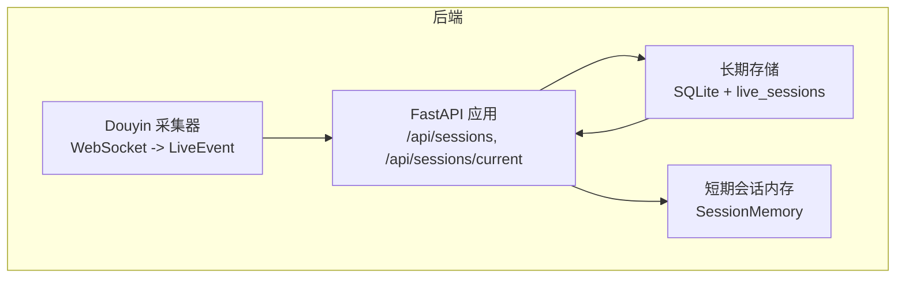
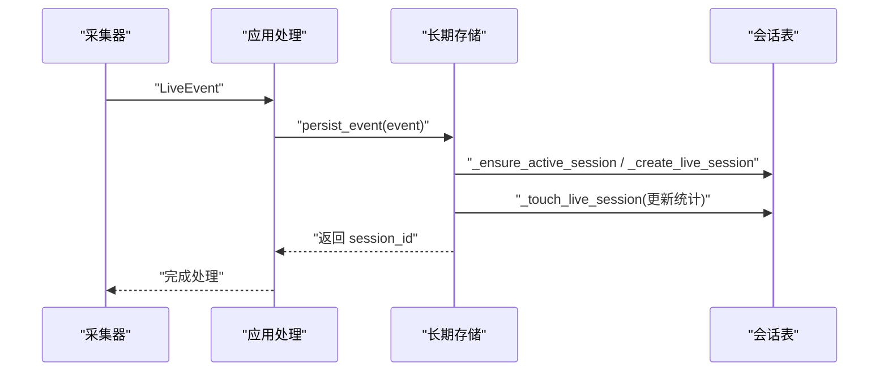
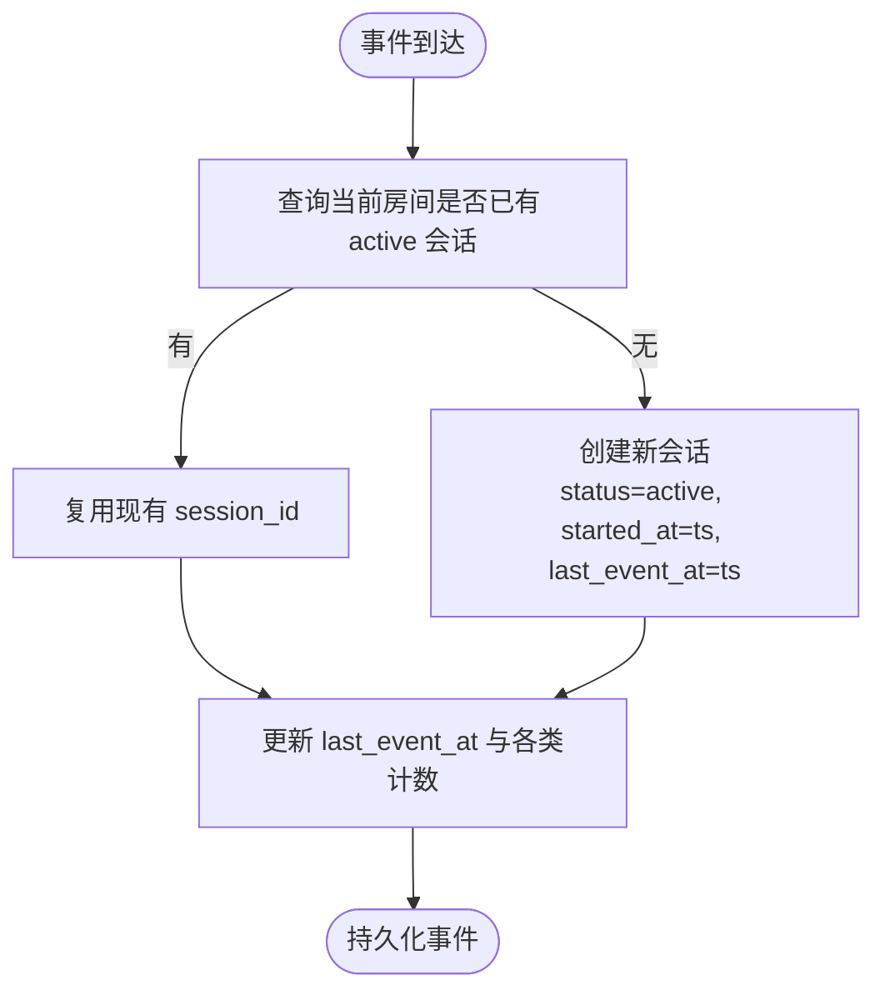
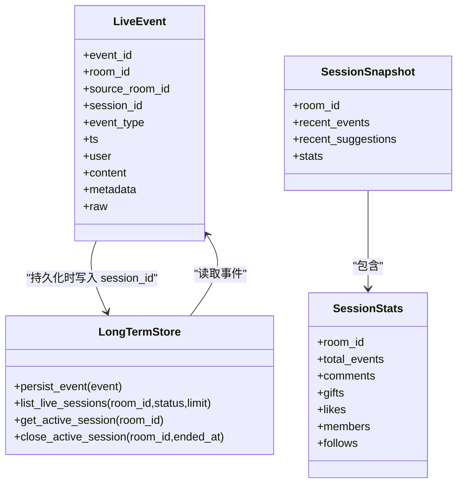

# 会话管理表设计

<cite>
**本文引用的文件**
- [DATABASE.md](file://data/DATABASE.md)
- [live.py](file://backend/schemas/live.py)
- [long_term.py](file://backend/memory/long_term.py)
- [app.py](file://backend/app.py)
- [collector.py](file://backend/services/collector.py)
- [session_memory.py](file://backend/memory/session_memory.py)
- [config.py](file://backend/config.py)
</cite>

## 目录
1. [简介](#简介)
2. [项目结构](#项目结构)
3. [核心组件](#核心组件)
4. [架构总览](#架构总览)
5. [详细组件分析](#详细组件分析)
6. [依赖分析](#依赖分析)
7. [性能考虑](#性能考虑)
8. [故障排查指南](#故障排查指南)
9. [结论](#结论)
10. [附录](#附录)

## 简介
本设计文档围绕直播会话管理表（live_sessions）进行系统性阐述，目标是帮助读者理解：
- 会话表的设计理念与字段含义
- 会话生命周期管理（创建、活跃维护、结束）
- 会话表与事件表的关联关系（事件归属、统计聚合、时间线管理）
- 会话状态机（active/ended）及状态查询与修复
- 查询优化（状态过滤、时间范围、统计聚合）
- 在直播监控中的应用（实时统计、历史回放、性能分析）

## 项目结构
与会话管理直接相关的代码分布在以下模块中：
- 数据库与表结构说明：data/DATABASE.md
- 事件与会话数据模型：backend/schemas/live.py
- 长期存储与会话逻辑：backend/memory/long_term.py
- 应用入口与会话查询接口：backend/app.py
- 采集器与事件归一化：backend/services/collector.py
- 短期会话内存层：backend/memory/session_memory.py
- 运行配置：backend/config.py

图表来源
- [app.py:174-184](file://backend/app.py#L174-L184)
- [collector.py:225-283](file://backend/services/collector.py#L225-L283)
- [long_term.py:123-136](file://backend/memory/long_term.py#L123-L136)
- [session_memory.py:17-113](file://backend/memory/session_memory.py#L17-L113)

章节来源
- [app.py:174-184](file://backend/app.py#L174-L184)
- [collector.py:225-283](file://backend/services/collector.py#L225-L283)
- [long_term.py:123-136](file://backend/memory/long_term.py#L123-L136)
- [session_memory.py:17-113](file://backend/memory/session_memory.py#L17-L113)

## 核心组件
- 事件模型与会话快照：LiveEvent、SessionSnapshot、SessionStats
- 会话表结构：live_sessions（主键 session_id，房间维度，状态与计数）
- 长期存储：负责会话创建、活跃维护、结束、查询与修复
- 应用接口：提供会话列表与当前活动会话查询
- 采集器：将原始消息标准化为 LiveEvent 并交由处理流程

章节来源
- [live.py:29-94](file://backend/schemas/live.py#L29-L94)
- [DATABASE.md:65-84](file://data/DATABASE.md#L65-L84)
- [long_term.py:276-324](file://backend/memory/long_term.py#L276-L324)
- [app.py:174-184](file://backend/app.py#L174-L184)

## 架构总览
会话管理贯穿“采集 -> 处理 -> 存储 -> 查询”的闭环：
- 采集器将原始消息标准化为 LiveEvent，其中包含 room_id、source_room_id、event_type、ts 等关键字段
- 处理流程在持久化事件的同时，确保事件归属到当前活动会话（session_id），并更新会话统计
- 会话表记录房间级的活动会话，支持按状态与时间排序查询
- 应用层提供会话列表与当前活动会话查询接口，供前端与监控使用

图表来源
- [collector.py:225-283](file://backend/services/collector.py#L225-L283)
- [long_term.py:420-454](file://backend/memory/long_term.py#L420-L454)
- [long_term.py:289-324](file://backend/memory/long_term.py#L289-L324)

## 详细组件分析

### 会话表字段设计与语义
- session_id：会话主键，唯一标识一场直播会话
- room_id：房间号，区分不同直播间的会话
- source_room_id：原始消息中的真实房间号，可能与 room_id 不同
- livename：直播间名称
- status：会话状态，枚举 active/ended
- started_at：会话开始时间（毫秒）
- last_event_at：最后事件到达时间（毫秒）
- ended_at：会话结束时间（毫秒），未结束时为 NULL
- event_count：事件总数
- comment_count：评论事件数
- gift_event_count：礼物事件数
- join_count：加入/成员事件数

这些字段共同构成会话的时间线、归属与统计视图，支撑实时与历史分析。

章节来源
- [DATABASE.md:65-84](file://data/DATABASE.md#L65-L84)
- [long_term.py:123-136](file://backend/memory/long_term.py#L123-L136)

### 会话生命周期管理
- 创建：当新事件到达且当前房间无 active 会话时，创建新会话，设置 status=active，started_at=last_event_at=ts，其他计数为 0
- 维护：每次事件到达时，更新 last_event_at、event_count、以及按事件类型累加 comment_count/gift_event_count/join_count
- 结束：在房间切换或服务关闭时，将当前 active 会话标记为 ended，写入 ended_at，并确保 last_event_at 不小于已记录值

图表来源
- [long_term.py:289-324](file://backend/memory/long_term.py#L289-L324)
- [long_term.py:420-454](file://backend/memory/long_term.py#L420-L454)

章节来源
- [long_term.py:289-324](file://backend/memory/long_term.py#L289-L324)
- [long_term.py:420-454](file://backend/memory/long_term.py#L420-L454)
- [app.py:84-91](file://backend/app.py#L84-L91)

### 会话与事件的关联关系
- 事件归属：每个事件记录包含 session_id，用于将事件归入对应会话
- 统计聚合：会话表维护 event_count、comment_count、gift_event_count、join_count，随事件到达增量更新
- 时间线管理：会话表记录 started_at、last_event_at、ended_at，形成会话时间轴
- 历史回放：可通过 events 表按 room_id/ts 排序回放某会话期间的事件序列

章节来源
- [DATABASE.md:16-32](file://data/DATABASE.md#L16-L32)
- [long_term.py:420-454](file://backend/memory/long_term.py#L420-L454)
- [long_term.py:183-195](file://backend/memory/long_term.py#L183-L195)

### 会话状态机设计
- 状态：active、ended
- 转换：
  - active -> ended：由房间切换或服务关闭触发
  - ended -> 无：结束后的会话不再接收新事件
- 状态查询：
  - 当前活动会话：按 room_id + status='active' 查询最新一条
  - 历史会话列表：按 room_id + 可选 status 过滤，按 last_event_at 降序
- 状态修复：
  - 若出现异常导致 active 会话长时间无更新，可在服务重启或维护时调用结束逻辑，确保 ended_at 正确

章节来源
- [DATABASE.md:67-84](file://data/DATABASE.md#L67-L84)
- [long_term.py:663-698](file://backend/memory/long_term.py#L663-L698)
- [app.py:174-184](file://backend/app.py#L174-L184)

### 查询优化
- 索引策略：
  - events(session_id)：加速事件归属查询
  - live_sessions(room_id, status, last_event_at DESC)：加速房间维度的活动/历史会话查询
- 查询模式：
  - 活动会话：按 room_id + status='active' 排序取第一条
  - 历史会话：按 room_id + status（可选）+ last_event_at DESC 分页
- 统计聚合：
  - 使用 SQL 聚合函数快速计算事件总数与各类型计数
  - 对 viewer 层面的统计，采用 viewer_profiles 与 viewer_gifts 的聚合表，减少复杂联接

章节来源
- [long_term.py:183-195](file://backend/memory/long_term.py#L183-L195)
- [long_term.py:663-698](file://backend/memory/long_term.py#L663-L698)
- [long_term.py:504-520](file://backend/memory/long_term.py#L504-L520)

### 在直播监控中的应用
- 实时统计：短期内存层基于最近事件窗口生成 SessionStats，结合 SSE/WebSocket 推送
- 历史回放：通过 events 表按时间线回放某会话期间的事件
- 性能分析：利用 live_sessions 的时间戳与计数，评估会话活跃度、峰值流量与资源占用

章节来源
- [session_memory.py:86-112](file://backend/memory/session_memory.py#L86-L112)
- [app.py:187-206](file://backend/app.py#L187-L206)
- [long_term.py:467-485](file://backend/memory/long_term.py#L467-L485)

## 依赖分析
- 事件模型依赖：LiveEvent、SessionSnapshot、SessionStats 来自 schemas/live.py
- 会话逻辑依赖：长期存储类 LongTermStore 提供会话创建、维护、结束与查询
- 应用接口依赖：FastAPI 提供 /api/sessions 与 /api/sessions/current
- 采集器依赖：DouyinCollector 将原始消息标准化为 LiveEvent
- 短期内存依赖：SessionMemory 提供实时统计与快照

图表来源
- [live.py:29-94](file://backend/schemas/live.py#L29-L94)
- [long_term.py:420-454](file://backend/memory/long_term.py#L420-L454)
- [long_term.py:663-698](file://backend/memory/long_term.py#L663-L698)

章节来源
- [live.py:29-94](file://backend/schemas/live.py#L29-L94)
- [long_term.py:420-454](file://backend/memory/long_term.py#L420-L454)
- [long_term.py:663-698](file://backend/memory/long_term.py#L663-L698)

## 性能考虑
- 会话创建与更新：使用原子性 SQL 更新，避免并发竞争
- 索引覆盖：events(session_id) 与 live_sessions 的复合索引提升查询效率
- 热点数据：短期内存层（SessionMemory）缓存最近事件与建议，降低数据库压力
- 房间切换：在切换房间时主动结束当前会话，防止遗留 active 会话影响后续统计

章节来源
- [long_term.py:183-195](file://backend/memory/long_term.py#L183-L195)
- [session_memory.py:17-113](file://backend/memory/session_memory.py#L17-L113)
- [app.py:115-126](file://backend/app.py#L115-L126)

## 故障排查指南
- 无法获取当前活动会话
  - 检查 live_sessions 是否存在 status='active' 的记录
  - 确认房间号正确且服务已启动
- 会话未结束
  - 在房间切换或服务关闭时调用结束逻辑，确保 ended_at 被写入
- 事件未归属会话
  - 确认事件持久化流程中已调用 _ensure_active_session 并返回 session_id
- 查询结果异常
  - 检查索引是否存在，必要时重建索引
  - 校验 room_id 与 status 参数

章节来源
- [long_term.py:688-716](file://backend/memory/long_term.py#L688-L716)
- [long_term.py:420-454](file://backend/memory/long_term.py#L420-L454)
- [app.py:174-184](file://backend/app.py#L174-L184)

## 结论
live_sessions 表通过简洁而完备的字段设计，实现了对直播会话的全生命周期管理。配合长期存储的原子性更新与短期内存层的实时统计，既能满足实时监控需求，又能支撑历史回放与性能分析。通过合理的索引与查询模式，系统在高并发场景下仍能保持良好的响应性能。

## 附录
- 事件与会话数据模型定义参见 [live.py:29-94](file://backend/schemas/live.py#L29-L94)
- 会话表结构与常用查询参见 [DATABASE.md:65-150](file://data/DATABASE.md#L65-L150)
- 会话创建、维护与结束逻辑参见 [long_term.py:276-324](file://backend/memory/long_term.py#L276-L324)
- 会话查询接口参见 [app.py:174-184](file://backend/app.py#L174-L184)
- 采集器与事件归一化参见 [collector.py:225-283](file://backend/services/collector.py#L225-L283)
- 短期会话内存层参见 [session_memory.py:17-113](file://backend/memory/session_memory.py#L17-113)
- 运行配置参见 [config.py:39-94](file://backend/config.py#L39-L94)