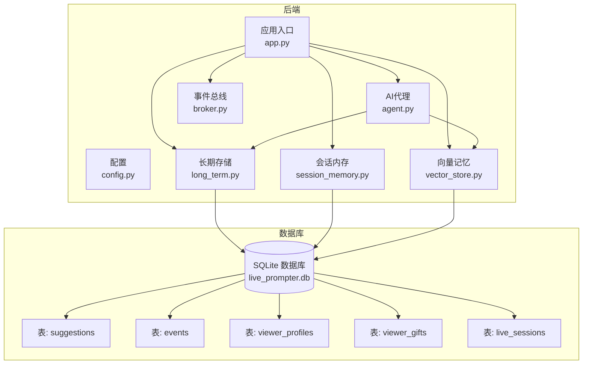
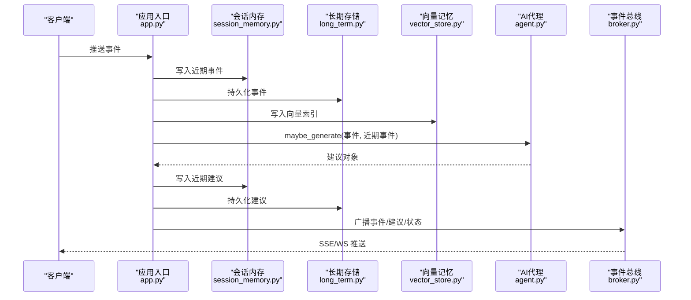
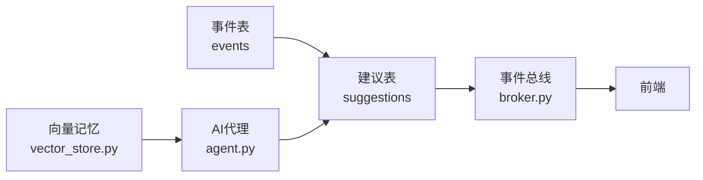

# 建议表设计

<cite>
**本文引用的文件**
- [DATABASE.md](file://data/DATABASE.md)
- [live.py](file://backend/schemas/live.py)
- [long_term.py](file://backend/memory/long_term.py)
- [agent.py](file://backend/services/agent.py)
- [app.py](file://backend/app.py)
- [config.py](file://backend/config.py)
- [session_memory.py](file://backend/memory/session_memory.py)
- [vector_store.py](file://backend/memory/vector_store.py)
- [broker.py](file://backend/services/broker.py)
</cite>

## 目录
1. [简介](#简介)
2. [项目结构](#项目结构)
3. [核心组件](#核心组件)
4. [架构总览](#架构总览)
5. [详细组件分析](#详细组件分析)
6. [依赖分析](#依赖分析)
7. [性能考量](#性能考量)
8. [故障排查指南](#故障排查指南)
9. [结论](#结论)
10. [附录](#附录)

## 简介
本设计文档围绕“建议表（suggestions）”展开，系统性说明其结构设计、字段定义、业务逻辑、与事件表的关联关系、数据访问模式、统计分析、维护策略以及在AI建议生成流程中的作用。建议表用于存储从直播事件中生成的“提词建议”，为主播提供即时、可口播的回复提示，提升互动效率与体验。

## 项目结构
建议表位于SQLite数据库中，与事件表（events）、观众画像表（viewer_profiles）、礼物聚合表（viewer_gifts）、直播场次表（live_sessions）共同构成直播数据域。建议表的创建、索引、查询与持久化由长期存储层负责；建议生成由AI代理负责；前端通过SSE/WS接收建议流。

图表来源
- [app.py:1-220](file://backend/app.py#L1-L220)
- [config.py:1-94](file://backend/config.py#L1-L94)
- [agent.py:1-393](file://backend/services/agent.py#L1-L393)
- [long_term.py:1-750](file://backend/memory/long_term.py#L1-L750)
- [session_memory.py:1-113](file://backend/memory/session_memory.py#L1-L113)
- [vector_store.py:1-108](file://backend/memory/vector_store.py#L1-L108)
- [broker.py:1-39](file://backend/services/broker.py#L1-L39)

章节来源
- [app.py:1-220](file://backend/app.py#L1-L220)
- [config.py:1-94](file://backend/config.py#L1-L94)

## 核心组件
- 建议模型（Suggestion）
  - 字段：建议ID、房间ID、事件关联、来源、优先级、回复文本、语调、原因、置信度、源事件、引用、创建时间
  - 用途：统一建议数据结构，便于序列化/反序列化与跨模块传递
- 长期存储（LongTermStore）
  - 负责建议表的建表、索引、插入/更新、查询最近建议等
- AI代理（LivePromptAgent）
  - 依据事件与上下文生成建议，支持在线模型与规则回退
- 会话内存（SessionMemory）
  - 提供Redis或内存中的短期建议缓存，支持限长队列与TTL
- 向量记忆（VectorMemory）
  - 为建议生成提供相似历史片段，增强上下文相关性
- 应用入口（app.py）
  - 统一编排事件处理、建议生成、持久化与消息广播

章节来源
- [live.py:47-62](file://backend/schemas/live.py#L47-L62)
- [long_term.py:69-79](file://backend/memory/long_term.py#L69-L79)
- [agent.py:23-38](file://backend/services/agent.py#L23-L38)
- [session_memory.py:17-113](file://backend/memory/session_memory.py#L17-L113)
- [vector_store.py:52-108](file://backend/memory/vector_store.py#L52-L108)
- [app.py:61-78](file://backend/app.py#L61-L78)

## 架构总览
建议生成与落库的端到端流程如下：

图表来源
- [app.py:61-78](file://backend/app.py#L61-L78)
- [agent.py:73-94](file://backend/services/agent.py#L73-L94)
- [session_memory.py:42-64](file://backend/memory/session_memory.py#L42-L64)
- [long_term.py:456-465](file://backend/memory/long_term.py#L456-L465)
- [vector_store.py:64-83](file://backend/memory/vector_store.py#L64-L83)
- [broker.py:28-39](file://backend/services/broker.py#L28-L39)

## 详细组件分析

### 建议表结构设计
- 表名：suggestions
- 主键：suggestion_id
- 关键字段
  - suggestion_id：建议唯一标识
  - room_id：房间标识
  - event_id：关联的事件标识
  - priority：优先级（low/medium/high）
  - reply_text：建议回复文本
  - tone：语调标签
  - reason：生成原因
  - confidence：置信度（0~1）
  - created_at：创建时间戳
- 约束与类型
  - 主键唯一
  - room_id、event_id、priority、reply_text、tone、reason、confidence、created_at 均非空
  - priority 为文本枚举
  - confidence 为浮点数
- 索引
  - 建议表未显式创建索引，但查询通常按 room_id 与 created_at 排序，可考虑增加 room_id+created_at 复合索引以优化查询

章节来源
- [DATABASE.md:12](file://data/DATABASE.md#L12)
- [DATABASE.md:69-79](file://data/DATABASE.md#L69-L79)
- [long_term.py:69-79](file://backend/memory/long_term.py#L69-L79)

### 字段定义与约束说明
- 建议ID（suggestion_id）
  - 作用：建议唯一标识，便于去重与追踪
  - 约束：主键，全局唯一
- 房间ID（room_id）
  - 作用：房间维度隔离与查询
  - 约束：非空
- 事件关联（event_id）
  - 作用：建立建议与事件的直接关联，便于溯源
  - 约束：非空
- 优先级（priority）
  - 作用：建议重要程度，驱动前端展示与播报顺序
  - 约束：枚举值 low/medium/high
- 回复文本（reply_text）
  - 作用：可直接口播的简短回复
  - 约束：非空文本
- 语调（tone）
  - 作用：建议的语气标签，便于统一风格
  - 约束：非空文本
- 置信度（confidence）
  - 作用：建议质量的量化指标
  - 约束：0~1 浮点数
- 创建时间（created_at）
  - 作用：排序与统计的基础
  - 约束：整数时间戳

章节来源
- [live.py:47-62](file://backend/schemas/live.py#L47-L62)
- [long_term.py:456-465](file://backend/memory/long_term.py#L456-L465)

### 与事件表的关联关系
- 外键设计
  - 建议表未声明外键约束，但通过 event_id 与 events 表形成逻辑关联
- 数据一致性
  - 建议生成依赖事件存在性；若事件缺失，建议无法正确关联
  - 建议表不维护级联更新/删除，避免跨表复杂性
- 级联更新
  - 未启用，建议表仅持有 event_id 作为弱引用

章节来源
- [DATABASE.md:69-79](file://data/DATABASE.md#L69-L79)
- [long_term.py:456-465](file://backend/memory/long_term.py#L456-L465)

### 数据访问模式
- 查询优化
  - 按房间查询最近建议：按 created_at 降序，限制数量
  - 建议表未见索引，建议增加 room_id+created_at 复合索引
- 缓存策略
  - 会话内存（短期）：Redis 或内存队列，分别限制事件与建议长度，支持TTL
  - 长期存储（持久化）：SQLite，适合离线分析与回放
- 批量操作
  - 插入/更新：INSERT OR REPLACE，幂等写入
  - 批量查询：LIMIT 控制结果集大小

章节来源
- [long_term.py:487-502](file://backend/memory/long_term.py#L487-L502)
- [session_memory.py:17-113](file://backend/memory/session_memory.py#L17-L113)
- [long_term.py:456-465](file://backend/memory/long_term.py#L456-L465)

### 建议质量评估与统计分析
- 质量评估
  - 置信度（confidence）：模型/规则输出的质量量化
  - 优先级（priority）：高/中/低，用于筛选与排序
- 使用频率统计
  - 可基于 created_at 时间窗口统计建议生成频次
  - 结合事件类型（comment/gift/follow）分析建议触发率
- 效果跟踪
  - 建议与事件的关联可用于回溯与效果评估
  - 建议文本与语调可作为内容质量与风格一致性分析维度

章节来源
- [agent.py:96-182](file://backend/services/agent.py#L96-L182)
- [agent.py:353-392](file://backend/services/agent.py#L353-L392)

### 维护策略
- 数据清理
  - 建议表未内置清理策略，建议按时间窗口定期归档/删除过期建议
- 性能监控
  - 建议表查询未见索引，建议添加 room_id+created_at 复合索引
  - 监控建议生成耗时与失败率（网络/模型/解析错误）
- 容量规划
  - 建议表增长与事件量成正比，结合房间活跃度与建议生成率评估存储需求

章节来源
- [long_term.py:487-502](file://backend/memory/long_term.py#L487-L502)
- [agent.py:232-285](file://backend/services/agent.py#L232-L285)

### 在AI建议生成流程中的作用
- 数据流转
  - 事件进入后，先写入会话内存与长期存储，同时写入向量索引
  - AI代理基于事件与上下文生成建议，写入会话内存与长期存储，并广播至前端
- 状态管理
  - AI代理维护模型状态（模式、模型名、后端、最后结果、错误、更新时间）
- 版本控制
  - 建议表未体现版本字段，建议可在 schema 层扩展版本号字段以支持回滚与对比

章节来源
- [app.py:61-78](file://backend/app.py#L61-L78)
- [agent.py:23-54](file://backend/services/agent.py#L23-L54)
- [agent.py:96-182](file://backend/services/agent.py#L96-L182)

## 依赖分析
建议表的依赖关系主要体现在以下方面：
- 与事件表的逻辑关联（event_id）
- 与向量记忆的上下文依赖（相似历史片段）
- 与AI代理的生成依赖（模型/规则）
- 与前端的展示依赖（SSE/WS）

图表来源
- [agent.py:65-71](file://backend/services/agent.py#L65-L71)
- [vector_store.py:85-107](file://backend/memory/vector_store.py#L85-L107)
- [broker.py:28-39](file://backend/services/broker.py#L28-L39)

## 性能考量
- 建议表查询未见索引，建议增加 room_id+created_at 复合索引以优化按房间与时间的查询
- 建议生成涉及网络请求与解析，建议对模型响应进行超时与重试控制
- 会话内存采用限长队列与TTL，避免内存膨胀；Redis 模式下可进一步利用过期机制

章节来源
- [long_term.py:487-502](file://backend/memory/long_term.py#L487-L502)
- [agent.py:222-285](file://backend/services/agent.py#L222-L285)
- [session_memory.py:17-113](file://backend/memory/session_memory.py#L17-L113)

## 故障排查指南
- 建议未生成
  - 检查事件类型是否触发建议生成（comment/gift/follow）
  - 检查AI代理状态与错误日志
- 建议未显示
  - 检查SSE/WS订阅是否正确过滤房间ID
  - 检查会话内存与长期存储的写入链路
- 模型错误
  - 关注HTTP错误码、网络错误、JSON解析异常、超时等日志

章节来源
- [agent.py:73-78](file://backend/services/agent.py#L73-L78)
- [agent.py:232-285](file://backend/services/agent.py#L232-L285)
- [app.py:187-220](file://backend/app.py#L187-L220)

## 结论
建议表是直播AI提词系统的核心数据载体，承担着建议生成、持久化与前端展示的桥梁职责。当前设计简洁清晰，但在索引、外键与版本控制方面仍有优化空间。通过合理的索引、缓存与监控策略，可显著提升建议查询与生成的性能与稳定性。

## 附录
- 建议表DDL（来自长期存储初始化脚本）
  - 建表语句包含主键与非空约束
- 建议表查询示例（来自长期存储）
  - 按房间查询最近建议，按创建时间倒序，限制数量

章节来源
- [long_term.py:50-154](file://backend/memory/long_term.py#L50-L154)
- [long_term.py:487-502](file://backend/memory/long_term.py#L487-L502)