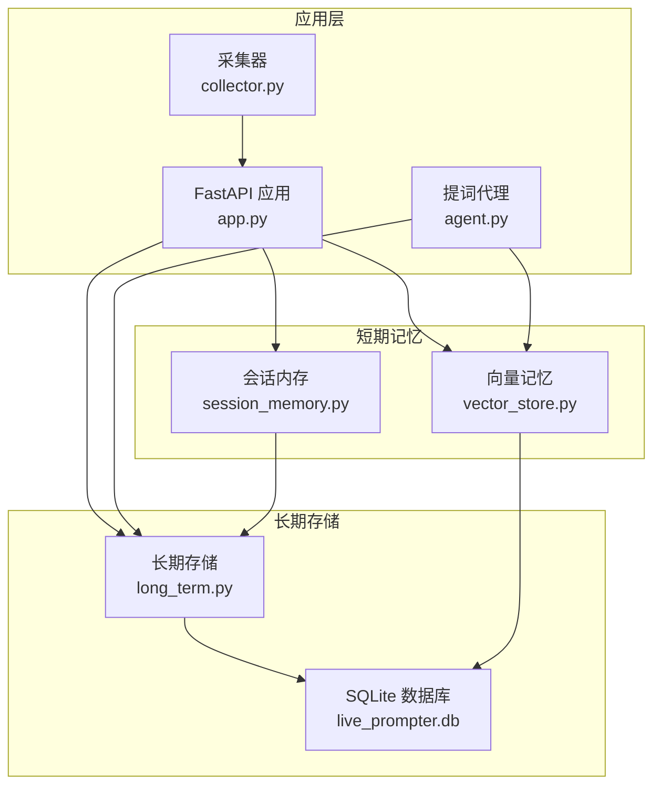
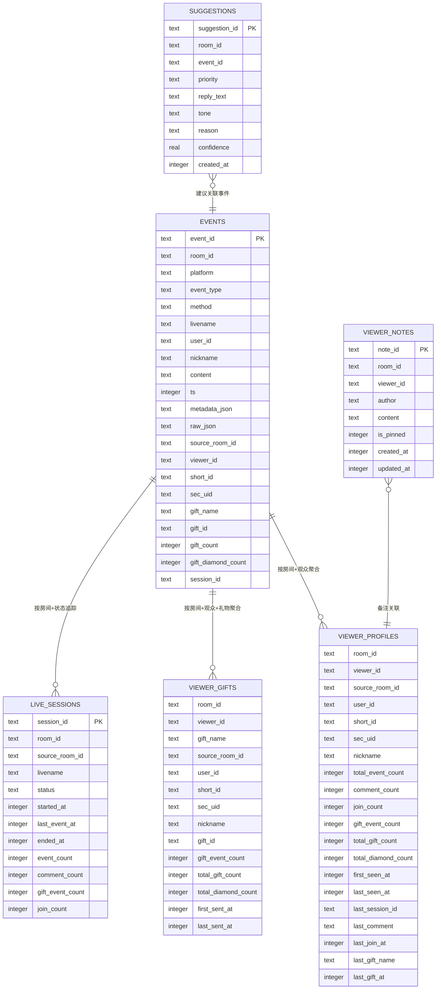
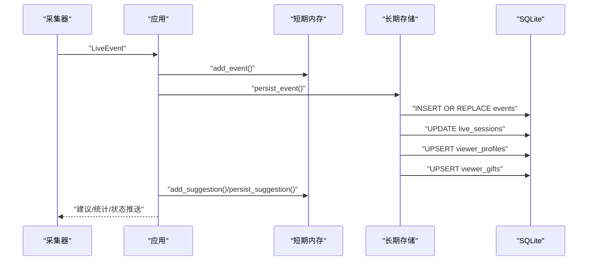
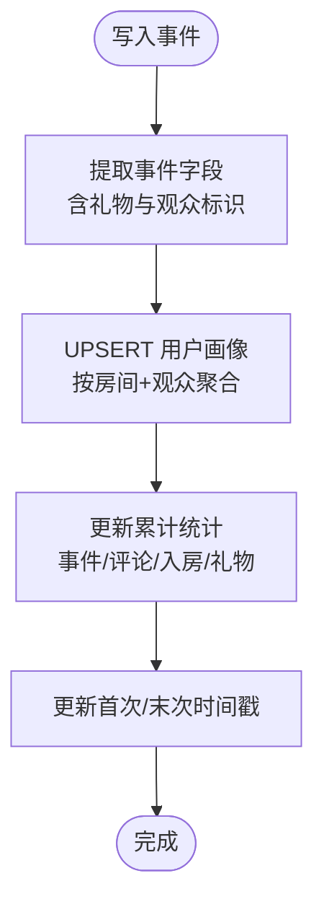
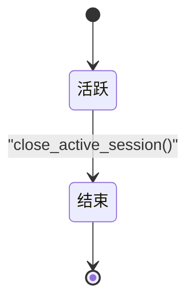
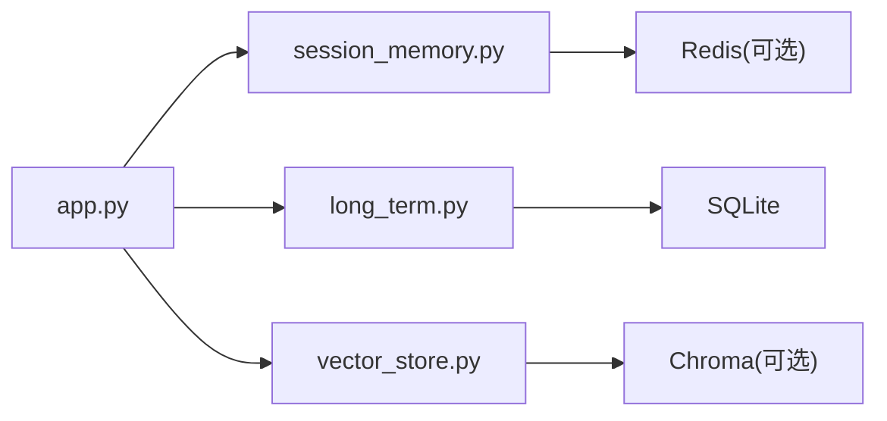

# 数据库架构概览

<cite>
**本文档引用的文件**
- [DATABASE.md](file://data/DATABASE.md)
- [long_term.py](file://backend/memory/long_term.py)
- [session_memory.py](file://backend/memory/session_memory.py)
- [vector_store.py](file://backend/memory/vector_store.py)
- [config.py](file://backend/config.py)
- [live.py](file://backend/schemas/live.py)
- [app.py](file://backend/app.py)
- [collector.py](file://backend/services/collector.py)
- [agent.py](file://backend/services/agent.py)
</cite>

## 目录
1. [简介](#简介)
2. [项目结构](#项目结构)
3. [核心组件](#核心组件)
4. [架构总览](#架构总览)
5. [详细组件分析](#详细组件分析)
6. [依赖关系分析](#依赖关系分析)
7. [性能考量](#性能考量)
8. [故障排查指南](#故障排查指南)
9. [结论](#结论)
10. [附录](#附录)

## 简介
本文件面向主播侧的长期存储与分析系统，聚焦 SQLite 数据库存储层的整体设计与实现。文档从数据库设计理念、分层职责、一致性保障、扩展性与迁移策略、初始化流程、备份与恢复等方面进行系统化阐述，帮助读者快速理解并安全地维护该数据库。

## 项目结构
系统采用“短期内存 + 长期存储 + 向量检索”的三层记忆体系：
- 短期会话内存（Redis/进程内队列）：存放最近事件与建议，用于实时交互与统计。
- 长期存储（SQLite）：持久化事件流水、用户画像、会话管理、建议与备注等。
- 向量检索（Chroma/本地近似）：基于历史事件构建可检索的语义空间，支撑相似内容召回。

图表来源
- [app.py:25-29](file://backend/app.py#L25-L29)
- [session_memory.py:17-31](file://backend/memory/session_memory.py#L17-L31)
- [vector_store.py:52-63](file://backend/memory/vector_store.py#L52-L63)
- [long_term.py:36-39](file://backend/memory/long_term.py#L36-L39)

章节来源
- [app.py:25-29](file://backend/app.py#L25-L29)
- [config.py:51-53](file://backend/config.py#L51-L53)

## 核心组件
- 长期存储层（LongTermStore）
  - 负责事件流水、用户画像、礼物聚合、直播会话、建议与备注的持久化。
  - 提供事件写入、会话管理、画像查询、历史检索等接口。
- 短期会话内存（SessionMemory）
  - 优先使用 Redis 存放最近事件与建议；未安装 Redis 时退化为进程内双端队列。
- 向量检索（VectorMemory）
  - 使用 Chroma 持久化向量库；未安装时使用本地哈希嵌入与轻量相似度方案。
- 配置与入口（config.py, app.py）
  - 统一读取环境变量与 .env，确保数据目录、数据库路径、向量库路径存在。
  - 应用启动时初始化各记忆层实例。

章节来源
- [long_term.py:36-39](file://backend/memory/long_term.py#L36-L39)
- [session_memory.py:17-31](file://backend/memory/session_memory.py#L17-L31)
- [vector_store.py:52-63](file://backend/memory/vector_store.py#L52-L63)
- [config.py:51-68](file://backend/config.py#L51-L68)
- [app.py:25-29](file://backend/app.py#L25-L29)

## 架构总览
数据库整体采用“事件流水 + 聚合视图”的设计：事件流水表保留原始事实，用户画像与礼物聚合表通过增量更新维持高效查询；直播会话表贯穿事件与画像，形成完整的业务生命周期视图。

图表来源
- [long_term.py:54-147](file://backend/memory/long_term.py#L54-L147)
- [DATABASE.md:16-150](file://data/DATABASE.md#L16-L150)

## 详细组件分析

### 事件流水表（events）
- 设计要点
  - 主键 event_id，确保每条事件唯一。
  - 包含原始消息与标准化元数据，便于审计与回溯。
  - 新增字段（如 source_room_id、viewer_id、session_id、礼物相关字段）通过迁移脚本补齐。
- 写入流程
  - 接收 LiveEvent，提取礼物字段与观众标识，写入事件表。
  - 若事件已存在且已有 session_id，则沿用；否则创建或复用活跃会话。
  - 同步更新会话统计与用户画像聚合。

图表来源
- [app.py:61-78](file://backend/app.py#L61-L78)
- [long_term.py:420-454](file://backend/memory/long_term.py#L420-L454)

章节来源
- [long_term.py:216-243](file://backend/memory/long_term.py#L216-L243)
- [long_term.py:420-454](file://backend/memory/long_term.py#L420-L454)

### 用户画像层（viewer_profiles）
- 设计要点
  - 复合主键 (room_id, viewer_id)，按房间与观众聚合统计。
  - 聚合指标包括事件总数、评论数、入房数、礼物事件数、钻石总计、首次/末次出现时间等。
  - 新增字段（total_gift_count、total_diamond_count、last_session_id）通过迁移脚本补齐。
- 查询与更新
  - 使用 UPSERT（ON CONFLICT）在单事务中原子性更新多类统计。
  - 支持昵称回退到历史 user_profiles 表兼容。

图表来源
- [long_term.py:326-370](file://backend/memory/long_term.py#L326-L370)

章节来源
- [long_term.py:326-370](file://backend/memory/long_term.py#L326-L370)
- [long_term.py:525-564](file://backend/memory/long_term.py#L525-L564)

### 礼物聚合表（viewer_gifts）
- 设计要点
  - 复合主键 (room_id, viewer_id, gift_name)，按房间-观众-礼物聚合。
  - 记录礼物事件次数、总量、钻石总计、首次/末次赠送时间。
- 更新策略
  - 每次礼物事件触发 UPSERT，累加次数与数量，维护时间边界。

章节来源
- [long_term.py:372-402](file://backend/memory/long_term.py#L372-L402)

### 会话管理层（live_sessions）
- 设计要点
  - 以 session_id 为主键，记录每场直播的生命周期。
  - 字段覆盖状态、起止时间、事件与互动计数。
- 生命周期
  - 新事件写入时自动创建或复用活跃会话。
  - 切换房间或服务关闭时结束当前会话。

图表来源
- [long_term.py:276-324](file://backend/memory/long_term.py#L276-L324)
- [long_term.py:688-716](file://backend/memory/long_term.py#L688-L716)

章节来源
- [long_term.py:276-324](file://backend/memory/long_term.py#L276-L324)
- [long_term.py:688-716](file://backend/memory/long_term.py#L688-L716)

### 建议与备注（suggestions, viewer_notes）
- 建议表（suggestions）
  - 关联事件与会话，记录建议优先级、回复文本、语气、理由与置信度。
- 备注表（viewer_notes）
  - 支持置顶、作者、创建/更新时间，便于主播与运营维护观众档案。

章节来源
- [long_term.py:456-465](file://backend/memory/long_term.py#L456-L465)
- [long_term.py:642-661](file://backend/memory/long_term.py#L642-L661)

## 依赖关系分析
- 组件耦合
  - 应用层（app.py）统一注入短期内存、长期存储与向量检索实例。
  - 长期存储层依赖 SQLite 与 Pydantic 数据模型。
  - 向量检索层可选依赖 Chroma，降级为本地哈希嵌入。
- 外部依赖
  - Redis（可选）：短期内存的高性能后端。
  - Chroma（可选）：向量检索的持久化后端。
  - LLM 接口（可选）：在线模式下的建议生成。

图表来源
- [app.py:25-29](file://backend/app.py#L25-L29)
- [session_memory.py:11-31](file://backend/memory/session_memory.py#L11-L31)
- [vector_store.py:13-63](file://backend/memory/vector_store.py#L13-L63)

章节来源
- [app.py:25-29](file://backend/app.py#L25-L29)
- [session_memory.py:11-31](file://backend/memory/session_memory.py#L11-L31)
- [vector_store.py:13-63](file://backend/memory/vector_store.py#L13-L63)

## 性能考量
- 索引策略
  - events：按房间+时间、房间+观众+时间、房间+事件类型+时间、会话ID建立索引，覆盖高频查询。
  - viewer_profiles：按房间+昵称建立索引，支持昵称回退查找。
  - viewer_gifts：按房间+观众+最后赠送时间排序，加速礼物历史查询。
  - live_sessions：按房间+状态+最后事件时间排序，支持活跃会话快速定位。
  - viewer_notes：按房间+观众+更新时间排序，支持备注列表与置顶展示。
- 写入优化
  - 使用 INSERT OR REPLACE 与 UPSERT（ON CONFLICT）减少重复写入。
  - 事件重建（_rebuild_viewer_aggregates）在批量场景下一次性重算，避免逐条更新的开销。
- 查询优化
  - 通过复合索引与分区字段（room_id、session_id）缩小扫描范围。
  - 短期内存与长期存储分离，热点数据走短期内存，冷数据走 SQLite。

章节来源
- [long_term.py:183-195](file://backend/memory/long_term.py#L183-L195)
- [long_term.py:404-420](file://backend/memory/long_term.py#L404-L420)

## 故障排查指南
- 数据库连接失败
  - 检查数据库路径与权限，确认 data 目录存在。
  - 参考：[config.py:63-68](file://backend/config.py#L63-L68)
- 表结构不一致
  - 长期存储初始化会自动添加缺失列并重建索引；若历史数据异常，可执行重建聚合逻辑。
  - 参考：[_ensure_event_columns:155-171](file://backend/memory/long_term.py#L155-L171)、[_ensure_viewer_profile_columns:172-181](file://backend/memory/long_term.py#L172-L181)、[_create_indexes:183-195](file://backend/memory/long_term.py#L183-L195)、[_rebuild_viewer_aggregates:404-420](file://backend/memory/long_term.py#L404-L420)
- 事件重复或丢失
  - 事件表主键去重；若发现历史字段缺失，执行回填逻辑。
  - 参考：[_backfill_event_columns:245-275](file://backend/memory/long_term.py#L245-L275)
- 会话状态异常
  - 使用关闭活跃会话接口，确保状态一致性。
  - 参考：[close_active_session:700-716](file://backend/memory/long_term.py#L700-L716)
- 短期内存不可用
  - Redis 未安装或连接失败时，短期内存自动退化为进程内队列。
  - 参考：[session_memory.py:11-31](file://backend/memory/session_memory.py#L11-L31)

章节来源
- [config.py:63-68](file://backend/config.py#L63-L68)
- [long_term.py:155-195](file://backend/memory/long_term.py#L155-L195)
- [long_term.py:245-275](file://backend/memory/long_term.py#L245-L275)
- [long_term.py:404-420](file://backend/memory/long_term.py#L404-L420)
- [long_term.py:700-716](file://backend/memory/long_term.py#L700-L716)
- [session_memory.py:11-31](file://backend/memory/session_memory.py#L11-L31)

## 结论
该数据库以 SQLite 为核心，结合短期内存与向量检索，实现了事件流水、用户画像、会话管理与建议/备注的完整闭环。通过索引与 UPSERT 的组合，兼顾了写入性能与查询效率；通过可选的 Redis 与 Chroma，进一步提升了实时性与可扩展性。初始化流程与迁移脚本确保了表结构演进与历史数据的平滑过渡。

## 附录

### 数据库初始化流程
- 创建表与索引
  - 在首次启动时，长时存储层执行建表脚本并创建必要索引。
  - 参考：[_setup:50-154](file://backend/memory/long_term.py#L50-L154)
- 表结构演进
  - 自动检测缺失列并添加；随后重建索引与历史聚合。
  - 参考：[_ensure_event_columns:155-171](file://backend/memory/long_term.py#L155-L171)、[_ensure_viewer_profile_columns:172-181](file://backend/memory/long_term.py#L172-L181)、[_create_indexes:183-195](file://backend/memory/long_term.py#L183-L195)
- 历史数据迁移
  - 回填历史事件中的缺失字段，生成观众标识与礼物统计。
  - 参考：[_backfill_event_columns:245-275](file://backend/memory/long_term.py#L245-L275)
- 聚合重建
  - 清空并重新计算用户画像与礼物聚合，保证统计一致性。
  - 参考：[_rebuild_viewer_aggregates:404-420](file://backend/memory/long_term.py#L404-L420)

章节来源
- [long_term.py:50-154](file://backend/memory/long_term.py#L50-L154)
- [long_term.py:155-195](file://backend/memory/long_term.py#L155-L195)
- [long_term.py:245-275](file://backend/memory/long_term.py#L245-L275)
- [long_term.py:404-420](file://backend/memory/long_term.py#L404-L420)

### 数据一致性保证机制
- 事务与原子性
  - 写入事件与更新画像/会话使用单连接事务，确保原子性。
  - 参考：[persist_event:420-454](file://backend/memory/long_term.py#L420-454)
- 约束与校验
  - 主键约束防止重复；ON CONFLICT 实现 UPSERT；默认值保证统计字段可读。
  - 参考：[viewer_profiles 建表:81-103](file://backend/memory/long_term.py#L81-L103)、[viewer_gifts 建表:105-121](file://backend/memory/long_term.py#L105-L121)
- 完整性校验
  - 初始化阶段自动补齐缺失列与索引；回填阶段修复历史数据不一致。

章节来源
- [long_term.py:420-454](file://backend/memory/long_term.py#L420-L454)
- [long_term.py:81-121](file://backend/memory/long_term.py#L81-L121)
- [long_term.py:155-195](file://backend/memory/long_term.py#L155-L195)
- [long_term.py:245-275](file://backend/memory/long_term.py#L245-L275)

### 扩展性与演进策略
- 表结构演进
  - 通过 _table_columns 检测现有列，按需 ALTER TABLE 添加新列。
  - 参考：[_table_columns:46-48](file://backend/memory/long_term.py#L46-L48)、[_ensure_event_columns:155-171](file://backend/memory/long_term.py#L155-L171)、[_ensure_viewer_profile_columns:172-181](file://backend/memory/long_term.py#L172-L181)
- 索引策略
  - 针对高频查询（房间+时间、房间+观众、房间+事件类型、会话ID、备注更新时间）建立复合索引。
  - 参考：[_create_indexes:183-195](file://backend/memory/long_term.py#L183-L195)
- 性能优化
  - 事件重建批处理；短期内存缓存热点数据；向量检索可选 Chroma 与本地降级方案。
  - 参考：[_rebuild_viewer_aggregates:404-420](file://backend/memory/long_term.py#L404-L420)、[session_memory.py:17-31](file://backend/memory/session_memory.py#L17-L31)、[vector_store.py:52-63](file://backend/memory/vector_store.py#L52-L63)

章节来源
- [long_term.py:46-48](file://backend/memory/long_term.py#L46-L48)
- [long_term.py:155-195](file://backend/memory/long_term.py#L155-L195)
- [long_term.py:404-420](file://backend/memory/long_term.py#L404-L420)
- [session_memory.py:17-31](file://backend/memory/session_memory.py#L17-L31)
- [vector_store.py:52-63](file://backend/memory/vector_store.py#L52-L63)

### 备份与恢复策略
- 数据导出
  - 使用 SQLite 原生命令导出数据库文件（例如 .backup 或 .dump），确保在写入低峰期执行。
- 数据导入
  - 将备份文件还原至目标路径，重启应用后由初始化流程自动补齐缺失列与索引。
- 版本升级
  - 升级后运行初始化脚本，执行回填与重建聚合，确保历史数据一致性。
- 注意事项
  - 备份前建议停止写入或使用只读模式，避免数据不一致。
  - 恢复后验证关键查询（如活跃会话、用户画像）是否正常。

章节来源
- [DATABASE.md:1-151](file://data/DATABASE.md#L1-L151)
- [long_term.py:50-154](file://backend/memory/long_term.py#L50-L154)