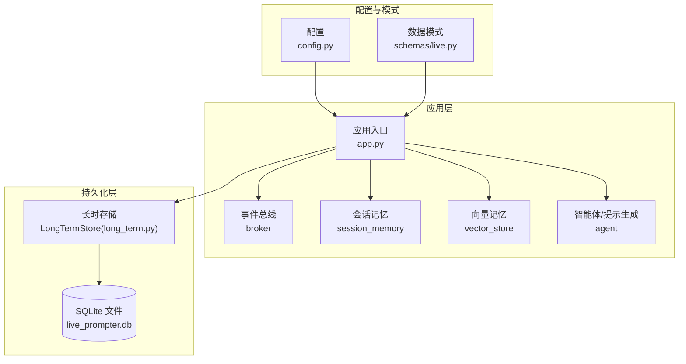
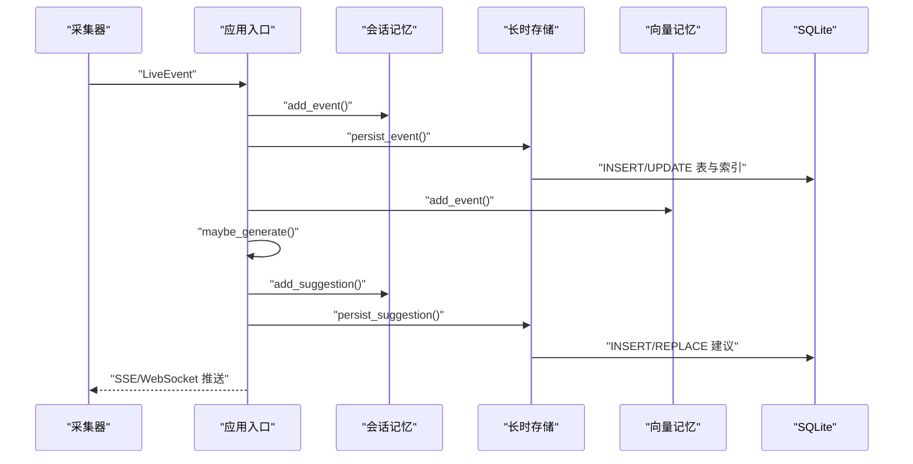
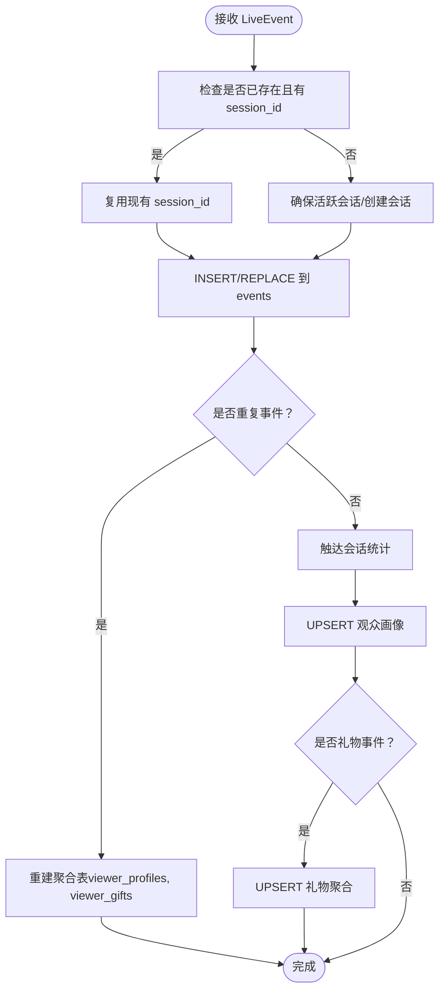
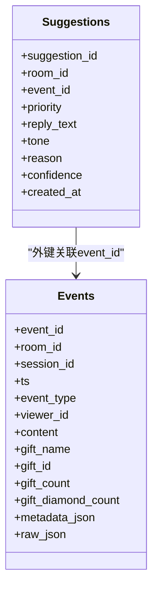
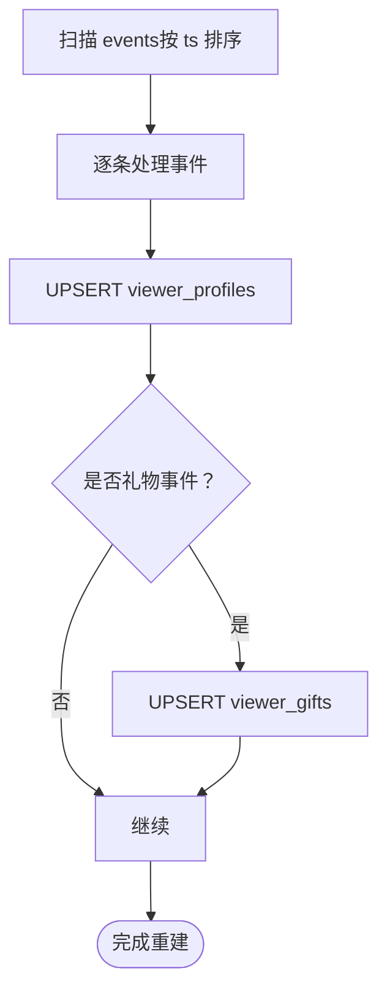
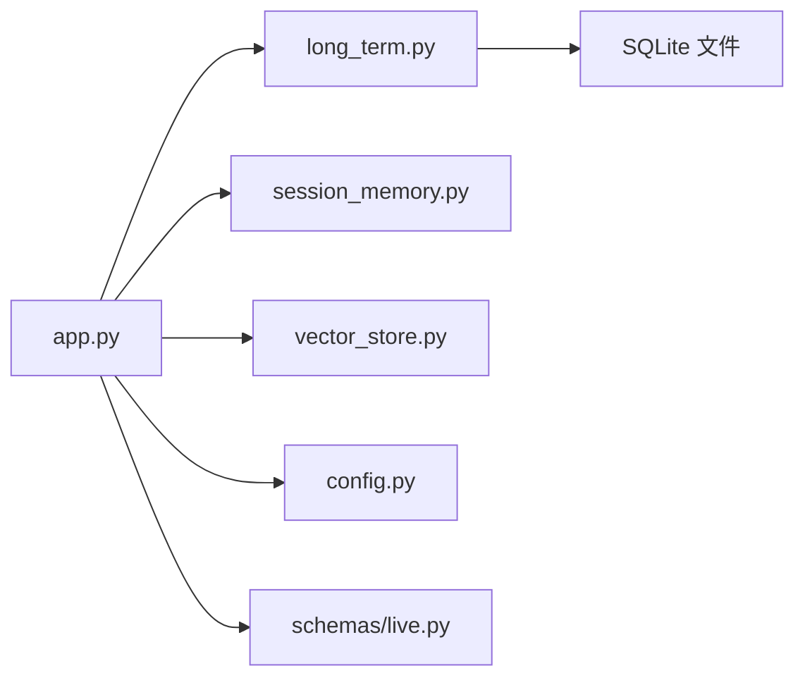

# 数据库设计

<cite>
**本文引用的文件**
- [DATABASE.md](file://data/DATABASE.md)
- [long_term.py](file://backend/memory/long_term.py)
- [config.py](file://backend/config.py)
- [app.py](file://backend/app.py)
- [live.py](file://backend/schemas/live.py)
</cite>

## 目录
1. [简介](#简介)
2. [项目结构](#项目结构)
3. [核心组件](#核心组件)
4. [架构总览](#架构总览)
5. [详细组件分析](#详细组件分析)
6. [依赖分析](#依赖分析)
7. [性能考量](#性能考量)
8. [故障排查指南](#故障排查指南)
9. [结论](#结论)
10. [附录](#附录)

## 简介
本文件面向 SQLite 长期存储层，系统性阐述数据库整体设计思路、表结构、索引策略、事件表与建议表（suggestion）的设计要点、用户画像表（viewer_profiles）的聚合与历史追踪机制、数据访问模式（查询优化、缓存策略、事务处理）、数据生命周期管理（保留、归档、清理），以及数据安全与备份恢复策略。目标是帮助开发者与运维人员快速理解并高效维护该数据库。

## 项目结构
数据库位于后端内存层，采用 SQLite 文件数据库，通过长时存储类统一初始化表结构、索引与数据写入流程；应用入口负责事件采集、会话记忆与向量记忆的协同，最终落盘到 SQLite。前端通过 API 获取快照、实时流与 WebSocket 推送。

图表来源
- [app.py:22-29](file://backend/app.py#L22-L29)
- [long_term.py:36-44](file://backend/memory/long_term.py#L36-L44)
- [config.py:51-53](file://backend/config.py#L51-L53)
- [live.py:29-44](file://backend/schemas/live.py#L29-L44)

章节来源
- [app.py:22-29](file://backend/app.py#L22-L29)
- [config.py:51-53](file://backend/config.py#L51-L53)
- [long_term.py:36-44](file://backend/memory/long_term.py#L36-L44)
- [live.py:29-44](file://backend/schemas/live.py#L29-L44)

## 核心组件
- 长时存储层（LongTermStore）
  - 负责数据库连接、表结构初始化与迁移、索引创建、事件写入、聚合更新、查询接口封装。
- 事件模型（LiveEvent）
  - 统一事件结构，包含房间、平台、事件类型、时间戳、用户身份、内容与元数据。
- 建议模型（Suggestion）
  - 存储由事件生成的回复建议，包含优先级、语气、置信度等。
- 配置（Settings）
  - 提供数据库路径、数据目录、Redis 地址、会话 TTL 等运行参数。

章节来源
- [long_term.py:36-44](file://backend/memory/long_term.py#L36-L44)
- [live.py:29-44](file://backend/schemas/live.py#L29-L44)
- [live.py:47-61](file://backend/schemas/live.py#L47-L61)
- [config.py:51-53](file://backend/config.py#L51-L53)

## 架构总览
下图展示事件从采集到落库、聚合与查询的关键流程，以及与会话记忆、向量记忆的协作关系。

图表来源
- [app.py:61-78](file://backend/app.py#L61-L78)
- [long_term.py:420-454](file://backend/memory/long_term.py#L420-L454)
- [long_term.py:456-465](file://backend/memory/long_term.py#L456-L465)

## 详细组件分析

### 事件表（events）设计
- 设计目标
  - 记录原始事件流水，支持按房间、时间、事件类型、观众等多维检索。
  - 为后续聚合表（viewer_profiles、viewer_gifts）提供增量/全量重建的数据源。
- 字段定义与含义
  - 主键与标识：event_id（事件唯一标识）、session_id（所属直播场次）、ts（毫秒级时间戳）。
  - 房间与来源：room_id（系统房间号）、source_room_id（原始消息真实 roomId）。
  - 平台与事件：platform（平台标识）、event_type（comment/member/gift/like/follow/system）、method（采集方式）、livename（直播间名称）。
  - 用户身份：user_id/short_id/sec_uid/nickname，以及 viewer_id（统一观众标识）。
  - 内容与礼物：content（评论/事件文本）、gift_name/gift_id/gift_count/gift_diamond_count（礼物相关）。
  - 元数据与原始消息：metadata_json/raw_json（标准化附加信息与原始消息）。
- 数据类型与约束
  - 主键与非空：event_id、room_id、platform、event_type、method、livename、ts。
  - 默认值与整型校验：gift_count 默认 0、gift_diamond_count 默认 0。
  - JSON 字段：metadata_json、raw_json 使用 TEXT 存储 JSON。
- 索引策略
  - idx_events_room_ts：按房间+时间倒序，支撑“最近事件”查询。
  - idx_events_room_viewer_ts：按房间+观众+时间倒序，支撑“某观众最近事件”查询。
  - idx_events_room_event_type_ts：按房间+事件类型+时间倒序，支撑“某类型事件”查询。
  - idx_events_session_id：按会话 ID，支撑“会话内事件”查询。
- 写入与更新逻辑
  - 写入前检查是否存在相同 event_id 且已有 session_id；若存在则复用 session_id。
  - 否则确保/创建活跃会话，更新会话统计与最后事件时间。
  - 对于重复事件，触发聚合表重建；否则执行会话触达、观众画像与礼物聚合的 UPSERT。
- 查询优化
  - 按房间筛选时优先使用复合索引；按事件类型过滤时利用 idx_events_room_event_type_ts。
  - 观众维度查询优先使用 idx_events_room_viewer_ts。
- 复杂度与性能
  - 单条写入 O(1)，批量重建 O(N)；索引写入成本摊销在写入阶段。
  - 建议限制单次重建规模，结合增量更新策略。

图表来源
- [long_term.py:420-454](file://backend/memory/long_term.py#L420-L454)
- [long_term.py:276-324](file://backend/memory/long_term.py#L276-L324)
- [long_term.py:326-370](file://backend/memory/long_term.py#L326-L370)
- [long_term.py:372-402](file://backend/memory/long_term.py#L372-L402)

章节来源
- [long_term.py:54-67](file://backend/memory/long_term.py#L54-L67)
- [long_term.py:183-195](file://backend/memory/long_term.py#L183-L195)
- [long_term.py:420-454](file://backend/memory/long_term.py#L420-L454)

### 建议表（suggestions）设计
- 设计目标
  - 存储由事件生成的回复建议，便于回溯与二次利用。
- 结构关系
  - 与事件表（events）通过 event_id 关联，建议表记录生成时所依据的事件。
  - 与房间（room_id）关联，便于按房间检索建议。
- 字段定义
  - 主键：suggestion_id（建议唯一标识）。
  - 关联：room_id、event_id。
  - 生成信息：priority（优先级）、reply_text（回复文本）、tone（语气）、reason（理由）、confidence（置信度）。
  - 时间：created_at（毫秒级时间戳）。
- 索引策略
  - 建议表未显式创建索引，但按 room_id 查询与按 created_at 倒序查询较为常见，可在业务量增长时评估添加 room_id 或 room_id+created_at 复合索引。
- 写入与查询
  - 写入：INSERT OR REPLACE，避免重复建议覆盖。
  - 查询：recent_suggestions 按 created_at 倒序返回最新建议列表。
- 与事件表的关系
  - 建议来源于事件，建议表中的 event_id 可用于回溯原始事件上下文。

图表来源
- [long_term.py:54-67](file://backend/memory/long_term.py#L54-L67)
- [long_term.py:69-79](file://backend/memory/long_term.py#L69-L79)

章节来源
- [long_term.py:69-79](file://backend/memory/long_term.py#L69-L79)
- [long_term.py:456-465](file://backend/memory/long_term.py#L456-L465)
- [live.py:47-61](file://backend/schemas/live.py#L47-L61)

### 观众画像表（viewer_profiles）设计
- 设计目标
  - 按房间+观众聚合统计，提供观众画像与行为概览。
- 聚合字段
  - 总计：total_event_count、comment_count、join_count、gift_event_count、total_gift_count、total_diamond_count。
  - 时间：first_seen_at、last_seen_at、last_join_at、last_gift_at。
  - 最近：last_session_id、last_comment、last_gift_name。
  - 身份：source_room_id、user_id、short_id、sec_uid、nickname。
- 主键与分区
  - 主键：(room_id, viewer_id)，天然按房间与观众分组。
- 历史追踪机制
  - 支持增量更新（ON CONFLICT UPSERT）与全量重建（_rebuild_viewer_aggregates）。
  - 全量重建时按 ts 顺序扫描 events，逐条对 viewer_profiles 与 viewer_gifts 执行 UPSERT。
- 写入策略
  - 新增事件时，根据事件类型累加对应计数；礼物事件同时累加钻石数与礼物总数。
  - 更新首次/末次时间、最近会话、最近评论/礼物等字段。
- 查询优化
  - 按昵称查找时，先精确匹配 viewer_id，再按 nickname 倒序取最新。
  - 兼容历史 user_profiles 表（仅在存在时回退读取）。

图表来源
- [long_term.py:404-420](file://backend/memory/long_term.py#L404-L420)
- [long_term.py:326-370](file://backend/memory/long_term.py#L326-L370)
- [long_term.py:372-402](file://backend/memory/long_term.py#L372-L402)

章节来源
- [long_term.py:81-103](file://backend/memory/long_term.py#L81-L103)
- [long_term.py:404-420](file://backend/memory/long_term.py#L404-L420)
- [long_term.py:525-564](file://backend/memory/long_term.py#L525-L564)

### 礼物聚合表（viewer_gifts）设计
- 设计目标
  - 按房间+观众+礼物名称聚合礼物历史，支持礼物频次、数量与钻石消耗统计。
- 聚合字段
  - 计数：gift_event_count、total_gift_count、first_sent_at、last_sent_at。
  - 身份：source_room_id、user_id、short_id、sec_uid、nickname、gift_id。
- 主键与分区
  - 主键：(room_id, viewer_id, gift_name)，天然按房间、观众、礼物分组。
- 写入策略
  - 礼物事件发生时，UPSERT 增量更新；礼物数量按 repeatCount/comboCount/groupCount 等字段取最大值，确保不小于 1。

章节来源
- [long_term.py:105-121](file://backend/memory/long_term.py#L105-L121)
- [long_term.py:372-402](file://backend/memory/long_term.py#L372-L402)

### 直播场次表（live_sessions）设计
- 设计目标
  - 记录直播场次状态与统计，支持活动场次查询与结束。
- 字段定义
  - 标识：session_id、room_id、source_room_id、livename。
  - 状态：status（active/ended）。
  - 时间：started_at、last_event_at、ended_at。
  - 统计：event_count、comment_count、gift_event_count、join_count。
- 写入与更新
  - 新事件到达时，确保活跃会话存在；若不存在则创建；否则更新统计与最后事件时间。
  - 结束时将状态置为 ended，并设置结束时间。

章节来源
- [long_term.py:123-136](file://backend/memory/long_term.py#L123-L136)
- [long_term.py:276-324](file://backend/memory/long_term.py#L276-L324)
- [long_term.py:688-716](file://backend/memory/long_term.py#L688-L716)

### 观众备注表（viewer_notes）设计
- 设计目标
  - 为主播或运营提供对观众的备注与置顶能力。
- 字段定义
  - 标识：note_id。
  - 关联：room_id、viewer_id。
  - 内容：author、content、is_pinned。
  - 时间：created_at、updated_at。
- 查询优化
  - 按房间+观众+更新时间倒序查询，支持置顶优先展示。

章节来源
- [long_term.py:138-147](file://backend/memory/long_term.py#L138-L147)
- [long_term.py:620-632](file://backend/memory/long_term.py#L620-L632)

## 依赖分析
- 组件耦合
  - 应用入口依赖长时存储、会话记忆、向量记忆与事件总线。
  - 长时存储依赖 SQLite 与数据模式（LiveEvent/Suggestion）。
- 外部依赖
  - 数据库：SQLite 文件（路径来自配置）。
  - 缓存：Redis（会话记忆使用）。
  - 向量存储：Chroma（向量记忆使用）。
- 潜在循环依赖
  - 未发现循环导入；模块职责清晰（入口、存储、记忆、模式）。

图表来源
- [app.py:22-29](file://backend/app.py#L22-L29)
- [long_term.py:36-44](file://backend/memory/long_term.py#L36-L44)
- [config.py:51-53](file://backend/config.py#L51-L53)
- [live.py:29-44](file://backend/schemas/live.py#L29-L44)

章节来源
- [app.py:22-29](file://backend/app.py#L22-L29)
- [long_term.py:36-44](file://backend/memory/long_term.py#L36-L44)
- [config.py:51-53](file://backend/config.py#L51-L53)
- [live.py:29-44](file://backend/schemas/live.py#L29-L44)

## 性能考量
- 写入性能
  - 事件写入采用 INSERT/REPLACE 与 UPSERT，配合会话触达与聚合更新；建议控制单次重建规模，避免全量重建频繁触发。
  - 礼物事件的数值计算（repeatCount/comboCount/groupCount）在写入前取最大值，减少后续复杂计算。
- 查询性能
  - 已有索引覆盖常见查询模式：房间+时间、房间+观众+时间、房间+事件类型+时间、会话 ID。
  - 建议在高并发场景下评估为 suggestions 表添加 room_id+created_at 复合索引。
- 缓存策略
  - 会话记忆（Redis）用于短期高频读写，长时存储（SQLite）用于持久化与聚合重建。
  - 前端通过 SSE/WebSocket 实时订阅，降低轮询开销。
- 事务处理
  - 写入过程使用单连接事务语义（with self._connect() as connection），保证同一事务内的多条 SQL 一致性。
- I/O 优化
  - SQLite 文件位于本地磁盘，建议部署在高性能磁盘上；定期检查文件大小与碎片情况。

章节来源
- [long_term.py:183-195](file://backend/memory/long_term.py#L183-L195)
- [long_term.py:420-454](file://backend/memory/long_term.py#L420-L454)
- [app.py:61-78](file://backend/app.py#L61-L78)

## 故障排查指南
- 数据库路径与权限
  - 确认 DATABASE_PATH 指向有效路径，且进程具备读写权限。
- 表结构缺失或列缺失
  - 长时存储初始化会自动创建表与索引，并补充缺失列；如遇异常，检查数据库连接与权限。
- 聚合重建失败
  - 若 events 中历史数据不完整，可能影响 viewer_profiles 与 viewer_gifts 的重建；可通过 _rebuild_viewer_aggregates 重新执行。
- 会话未正确结束
  - 应用退出时会尝试关闭当前活跃会话；若异常中断，需手动检查 live_sessions 状态并修复。
- 查询结果为空
  - 检查 room_id、viewer_id、event_type 等过滤条件是否正确；确认索引是否生效。
- 建议未显示
  - 确认 suggestions 表中存在对应 event_id 的记录；按 created_at 倒序查询。

章节来源
- [config.py:51-53](file://backend/config.py#L51-L53)
- [long_term.py:50-154](file://backend/memory/long_term.py#L50-L154)
- [long_term.py:404-420](file://backend/memory/long_term.py#L404-L420)
- [long_term.py:688-716](file://backend/memory/long_term.py#L688-L716)
- [long_term.py:456-465](file://backend/memory/long_term.py#L456-L465)

## 结论
该 SQLite 数据库围绕事件流水与观众画像两大核心，采用“原始事件+聚合表”的设计，既保证了数据完整性与可追溯性，又通过索引与缓存策略满足了实时查询需求。建议在生产环境中持续监控写入吞吐、查询延迟与数据库文件大小，适时扩展索引与优化重建策略，确保系统长期稳定运行。

## 附录
- 常用查询参考
  - 观众总体画像：按 room_id 与 viewer_id 查询 viewer_profiles。
  - 观众评论历史：按 room_id、viewer_id、event_type=comment 查询 events 并按 ts 倒序。
  - 观众礼物聚合：按 room_id、viewer_id 查询 viewer_gifts 并按 last_sent_at 倒序。
  - 当前活动场次：按 room_id 与 status='active' 查询 live_sessions。
  - 观众备注：按 room_id、viewer_id 查询 viewer_notes 并按 is_pinned 降序、updated_at 倒序。

章节来源
- [DATABASE.md:101-150](file://data/DATABASE.md#L101-L150)