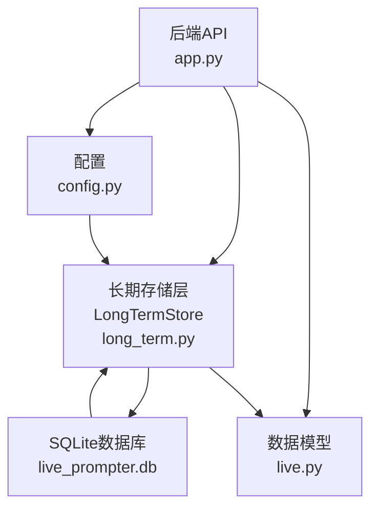
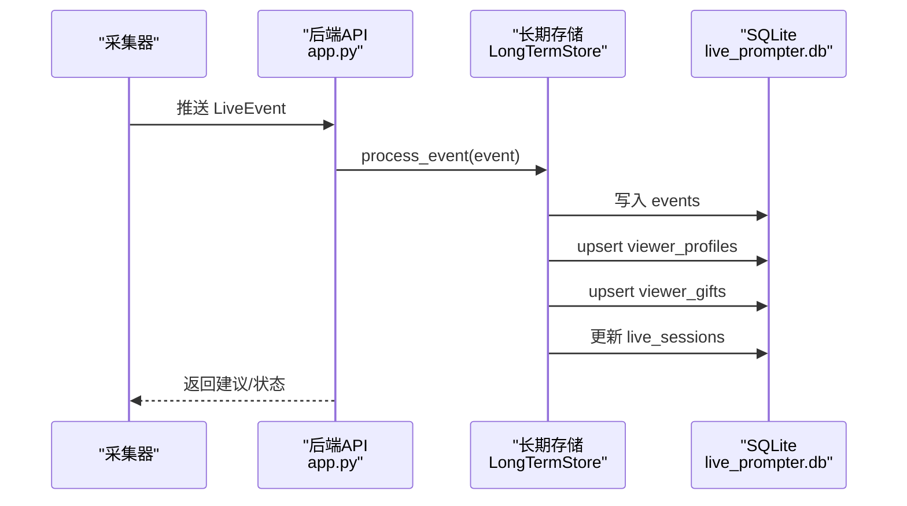
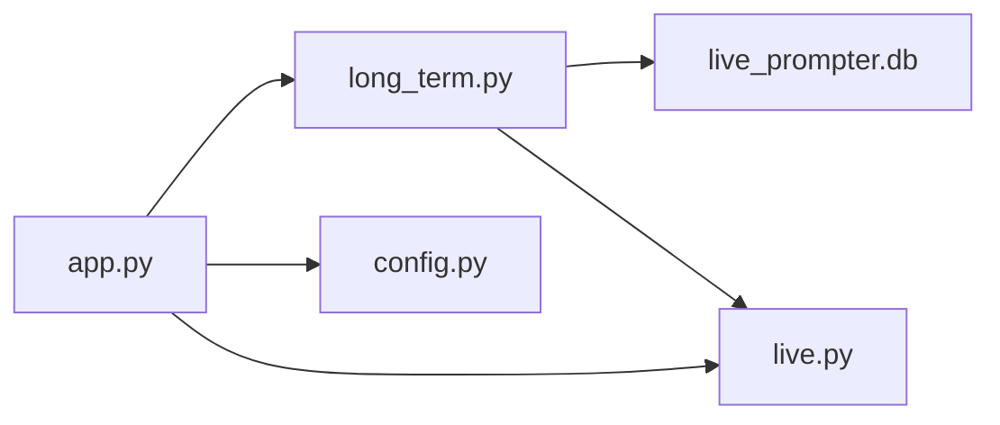

# 用户画像表设计

<cite>
**本文引用的文件**
- [DATABASE.md](file://data/DATABASE.md)
- [long_term.py](file://backend/memory/long_term.py)
- [app.py](file://backend/app.py)
- [live.py](file://backend/schemas/live.py)
- [config.py](file://backend/config.py)
</cite>

## 目录
1. [简介](#简介)
2. [项目结构](#项目结构)
3. [核心组件](#核心组件)
4. [架构总览](#架构总览)
5. [详细组件分析](#详细组件分析)
6. [依赖分析](#依赖分析)
7. [性能考虑](#性能考虑)
8. [故障排查指南](#故障排查指南)
9. [结论](#结论)
10. [附录](#附录)

## 简介
本设计文档围绕用户画像表 viewer_profiles 的结构与聚合计算进行深入说明，涵盖字段设计、统计指标、时间维度、行为特征；解释事件统计、礼物统计、会话统计的聚合机制；阐述增量更新策略（ON CONFLICT 处理、数据合并、冲突解决）；介绍查询优化（复合索引、视图设计、缓存策略）；并给出扩展性设计（字段演进、新指标添加、历史数据处理），以及在个性化推荐中的应用（用户分群、行为预测、互动建议）。

## 项目结构
该仓库采用后端 API + 内存/存储层分离的架构。与用户画像表直接相关的模块包括：
- 后端入口与路由：FastAPI 应用负责接收事件、提供查询接口
- 长期存储层：SQLite 持久化，包含 viewer_profiles、viewer_gifts、live_sessions、events、viewer_notes 等表
- 数据模型：LiveEvent、Actor 等用于统一事件结构
- 配置：数据库路径、Redis、向量存储等运行参数

图表来源
- [app.py:1-220](file://backend/app.py#L1-L220)
- [long_term.py:1-200](file://backend/memory/long_term.py#L1-L200)
- [config.py:1-94](file://backend/config.py#L1-L94)
- [live.py:1-95](file://backend/schemas/live.py#L1-L95)

章节来源
- [app.py:1-220](file://backend/app.py#L1-L220)
- [long_term.py:1-200](file://backend/memory/long_term.py#L1-L200)
- [config.py:1-94](file://backend/config.py#L1-L94)
- [live.py:1-95](file://backend/schemas/live.py#L1-L95)

## 核心组件
- 用户画像表 viewer_profiles：按房间与用户聚合的宽表，包含事件总量、评论数、加入次数、礼物事件数、礼物总数、钻石总数、首次/最近时间、最近会话ID、最近评论、最近加入时间、最近礼物名称与时间等字段。
- 礼物聚合表 viewer_gifts：按房间-用户-礼物名聚合，包含礼物事件数、礼物总数、钻石总数、首次/最近送礼时间。
- 事件表 events：原始事件流水，包含事件类型、内容、礼物信息、会话ID等。
- 会话表 live_sessions：直播场次状态与计数。
- 视图/查询：通过复合索引与多表关联，支持快速画像查询与详情聚合。

章节来源
- [DATABASE.md:33-52](file://data/DATABASE.md#L33-L52)
- [long_term.py:81-103](file://backend/memory/long_term.py#L81-L103)
- [long_term.py:105-121](file://backend/memory/long_term.py#L105-L121)
- [long_term.py:123-136](file://backend/memory/long_term.py#L123-L136)

## 架构总览
用户画像的生成与维护流程如下：
- 采集器收到直播事件后，经统一模型转换为 LiveEvent
- 长期存储层将事件持久化到 events 表，并同步更新 viewer_profiles 与 viewer_gifts 的聚合
- 会话表根据事件类型与时间戳维护直播场次状态
- API 层提供查询接口，返回聚合后的用户画像与详情

图表来源
- [app.py:61-78](file://backend/app.py#L61-L78)
- [long_term.py:420-424](file://backend/memory/long_term.py#L420-L424)
- [long_term.py:326-370](file://backend/memory/long_term.py#L326-L370)
- [long_term.py:372-402](file://backend/memory/long_term.py#L372-L402)
- [long_term.py:276-324](file://backend/memory/long_term.py#L276-L324)

## 详细组件分析

### 字段设计与含义
- 用户标识
  - room_id：房间号
  - viewer_id：用户唯一标识（由 Actor.viewer_id 生成）
- 统计指标
  - total_event_count：事件总数
  - comment_count：评论事件数
  - join_count：加入房间事件数
  - gift_event_count：礼物事件数
  - total_gift_count：礼物数量总和
  - total_diamond_count：钻石数量总和
- 时间维度
  - first_seen_at：首次出现时间
  - last_seen_at：最近出现时间
  - last_join_at：最近加入时间
  - last_gift_at：最近送礼时间
- 行为特征
  - last_session_id：最近会话ID
  - last_comment：最近评论内容
  - last_gift_name：最近礼物名称
- 元信息
  - source_room_id、user_id、short_id、sec_uid、nickname：用户身份与来源房间信息

章节来源
- [DATABASE.md:37-51](file://data/DATABASE.md#L37-L51)
- [long_term.py:81-103](file://backend/memory/long_term.py#L81-L103)
- [live.py:8-27](file://backend/schemas/live.py#L8-L27)

### 聚合计算逻辑

#### 事件统计
- 每条事件写入 events 表后，立即对 viewer_profiles 执行 UPSERT
- 计数类字段按事件类型累加：comment_count、join_count、gift_event_count
- 总数字段按事件累加：total_event_count
- 时间字段按时间戳取极值：first_seen_at 取更早，last_seen_at 取更晚
- 行为特征字段按事件类型更新：last_comment、last_join_at、last_gift_name、last_gift_at
- last_session_id 在事件中携带 session_id 时更新

章节来源
- [long_term.py:326-370](file://backend/memory/long_term.py#L326-L370)

#### 礼物统计
- 对于礼物事件，同时更新 viewer_gifts 表
- 礼物事件数 gift_event_count 自增
- 礼物数量 total_gift_count 与钻石数量 total_diamond_count 累加
- 首次/最近送礼时间 first_sent_at、last_sent_at 按时间戳取极值
- gift_id 与用户身份字段在冲突时进行选择性覆盖

章节来源
- [long_term.py:372-402](file://backend/memory/long_term.py#L372-L402)

#### 会话统计
- 每条事件写入时，若存在 session_id，则更新 live_sessions
- live_sessions 中的 event_count、comment_count、gift_event_count、join_count 按事件类型自增
- started_at、last_event_at、ended_at 等时间字段按事件时间戳更新

章节来源
- [long_term.py:276-324](file://backend/memory/long_term.py#L276-L324)

### 增量更新策略（ON CONFLICT）
- viewer_profiles：以 (room_id, viewer_id) 为主键，使用 ON CONFLICT 执行选择性合并
  - 非空字段优先覆盖（如 source_room_id、user_id、short_id、sec_uid、nickname、last_session_id、last_comment、last_gift_name）
  - 数值类字段累加（total_event_count、comment_count、join_count、gift_event_count、total_gift_count、total_diamond_count）
  - 时间类字段取极值（first_seen_at 取更早，last_seen_at 取更晚）
  - last_join_at、last_gift_at 在有新值时更新
- viewer_gifts：以 (room_id, viewer_id, gift_name) 为主键，同样使用 ON CONFLICT 执行选择性合并
  - 非空字段优先覆盖
  - 数值类字段累加
  - 时间类字段取极值

章节来源
- [long_term.py:343-361](file://backend/memory/long_term.py#L343-L361)
- [long_term.py:385-396](file://backend/memory/long_term.py#L385-L396)

### 查询优化
- 复合索引
  - events：room_id + ts DESC、room_id + viewer_id + ts DESC、room_id + event_type + ts DESC、session_id
  - viewer_profiles：room_id + nickname
  - viewer_gifts：room_id + viewer_id + last_sent_at DESC
  - live_sessions：room_id + status + last_event_at DESC
  - viewer_notes：room_id + viewer_id + updated_at DESC
- 查询路径
  - 获取单个用户画像：按 room_id + viewer_id 或 room_id + nickname 查询
  - 获取用户详情：在画像基础上补充最近评论、礼物历史、最近会话、备注
- 缓存策略
  - 会话内存：短期事件与建议缓存在 Redis（由 SessionMemory 提供）
  - 长期存储：SQLite 作为持久化层，配合索引与查询优化
  - 向量记忆：向量化存储用于相似度检索（与画像互补）

章节来源
- [long_term.py:183-195](file://backend/memory/long_term.py#L183-L195)
- [long_term.py:525-564](file://backend/memory/long_term.py#L525-L564)
- [long_term.py:736-749](file://backend/memory/long_term.py#L736-L749)
- [app.py:26-28](file://backend/app.py#L26-L28)

### 扩展性设计
- 字段演进
  - 通过 _ensure_viewer_profile_columns 动态添加新列（如 total_gift_count、total_diamond_count、last_session_id）
  - 通过 _ensure_event_columns 动态补齐事件表缺失列
- 新指标添加
  - 在 viewer_profiles 中新增数值/时间/字符串字段，并在 UPSERT 中进行选择性合并
  - 在 viewer_gifts 中新增礼物维度指标（如礼物价值分布、偏好类别）
- 历史数据处理
  - _rebuild_viewer_aggregates 重算历史事件，确保聚合一致性
  - _backfill_event_columns 回填历史事件的缺失列，保证后续聚合正确

章节来源
- [long_term.py:172-181](file://backend/memory/long_term.py#L172-L181)
- [long_term.py:155-170](file://backend/memory/long_term.py#L155-L170)
- [long_term.py:404-419](file://backend/memory/long_term.py#L404-L419)

### 在个性化推荐中的应用
- 用户分群
  - 基于 total_event_count、comment_count、gift_event_count、total_diamond_count 等指标进行聚类或阈值分层
  - 结合 last_seen_at、last_session_id 判断活跃度与粘性
- 行为预测
  - 使用最近行为（last_comment、last_gift_name、last_join_at、last_gift_at）构建短期序列特征
  - 结合 live_sessions 的实时状态，预测互动概率
- 互动建议
  - 基于 viewer_gifts 的偏好历史，推荐对应礼物或话题
  - 基于 events 的评论内容与时间序列，生成回复建议与互动引导

章节来源
- [DATABASE.md:101-150](file://data/DATABASE.md#L101-L150)
- [long_term.py:566-586](file://backend/memory/long_term.py#L566-L586)
- [long_term.py:587-596](file://backend/memory/long_term.py#L587-L596)
- [long_term.py:727-734](file://backend/memory/long_term.py#L727-L734)

## 依赖分析
- 后端 API 依赖长期存储层提供的画像查询与详情聚合能力
- 长期存储层依赖 SQLite 与 Pydantic 数据模型
- 配置模块提供数据库路径、Redis、向量存储等运行参数

图表来源
- [app.py:1-220](file://backend/app.py#L1-L220)
- [long_term.py:1-200](file://backend/memory/long_term.py#L1-L200)
- [config.py:1-94](file://backend/config.py#L1-L94)
- [live.py:1-95](file://backend/schemas/live.py#L1-L95)

章节来源
- [app.py:1-220](file://backend/app.py#L1-L220)
- [long_term.py:1-200](file://backend/memory/long_term.py#L1-L200)
- [config.py:1-94](file://backend/config.py#L1-L94)
- [live.py:1-95](file://backend/schemas/live.py#L1-L95)

## 性能考虑
- 写入性能
  - 使用批量/逐条写入 events，随后一次性执行 viewer_profiles 与 viewer_gifts 的 UPSERT
  - ON CONFLICT 选择性合并减少全量更新成本
- 查询性能
  - 为高频查询建立复合索引，避免全表扫描
  - 分页查询与限制返回条数（如最近事件、礼物历史、会话历史）
- 存储与内存
  - 会话短期事件与建议缓存在 Redis，降低 SQLite 压力
  - 长期存储仅保留必要聚合与历史明细

## 故障排查指南
- 画像不更新
  - 检查事件是否成功写入 events 表
  - 确认 viewer_id 是否有效（来自 Actor.viewer_id）
  - 查看 UPSERT 语句是否触发 ON CONFLICT
- 字段缺失
  - 使用 _ensure_viewer_profile_columns/_ensure_event_columns 动态补齐
  - 若历史数据缺失，执行 _rebuild_viewer_aggregates 重算
- 查询异常
  - 检查复合索引是否存在
  - 确认查询条件是否匹配索引前缀（如 room_id + viewer_id）

章节来源
- [long_term.py:172-181](file://backend/memory/long_term.py#L172-L181)
- [long_term.py:404-419](file://backend/memory/long_term.py#L404-L419)
- [long_term.py:183-195](file://backend/memory/long_term.py#L183-L195)

## 结论
viewer_profiles 作为用户画像的核心宽表，通过 ON CONFLICT 的增量更新策略与多表聚合，实现了高效、一致的用户行为画像。配合复合索引与会话缓存，满足了实时推荐与运营分析的需求。未来可在字段演进、新指标扩展与历史回填方面持续完善，以支撑更丰富的个性化场景。

## 附录
- 常用查询示例（来自数据库文档）
  - 单用户画像查询
  - 用户评论历史查询
  - 用户礼物聚合查询
  - 当前活动场次查询
  - 用户备注查询

章节来源
- [DATABASE.md:101-150](file://data/DATABASE.md#L101-L150)