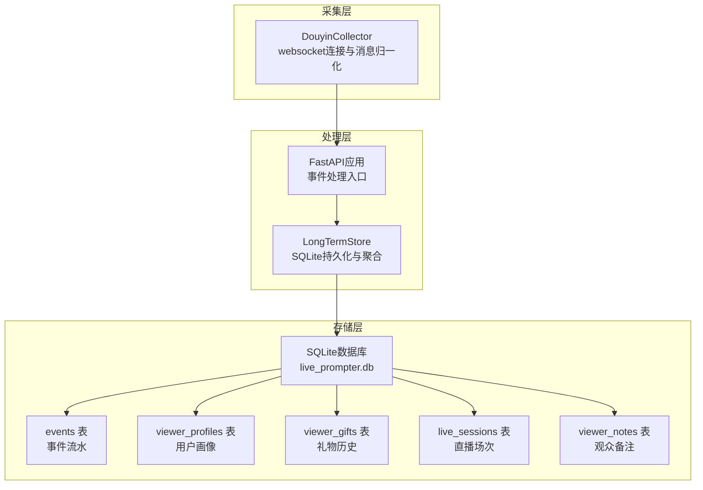
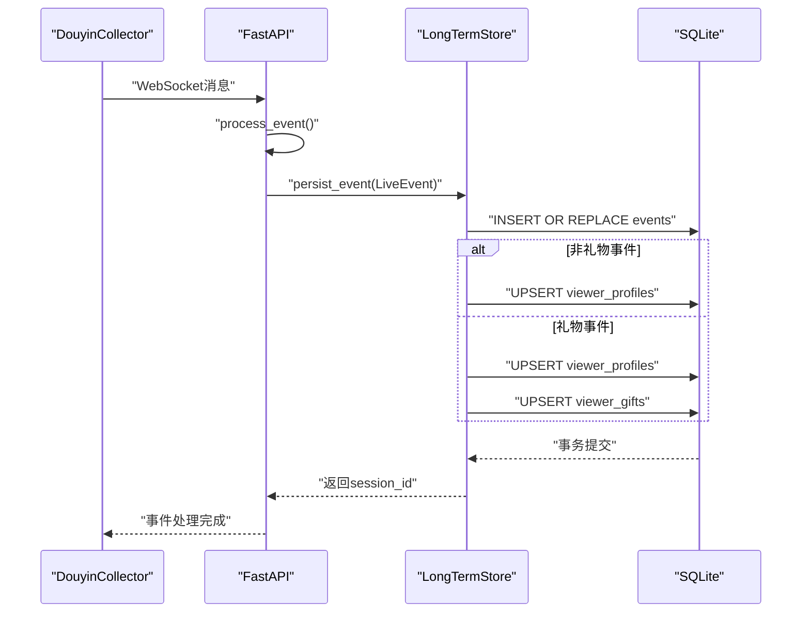
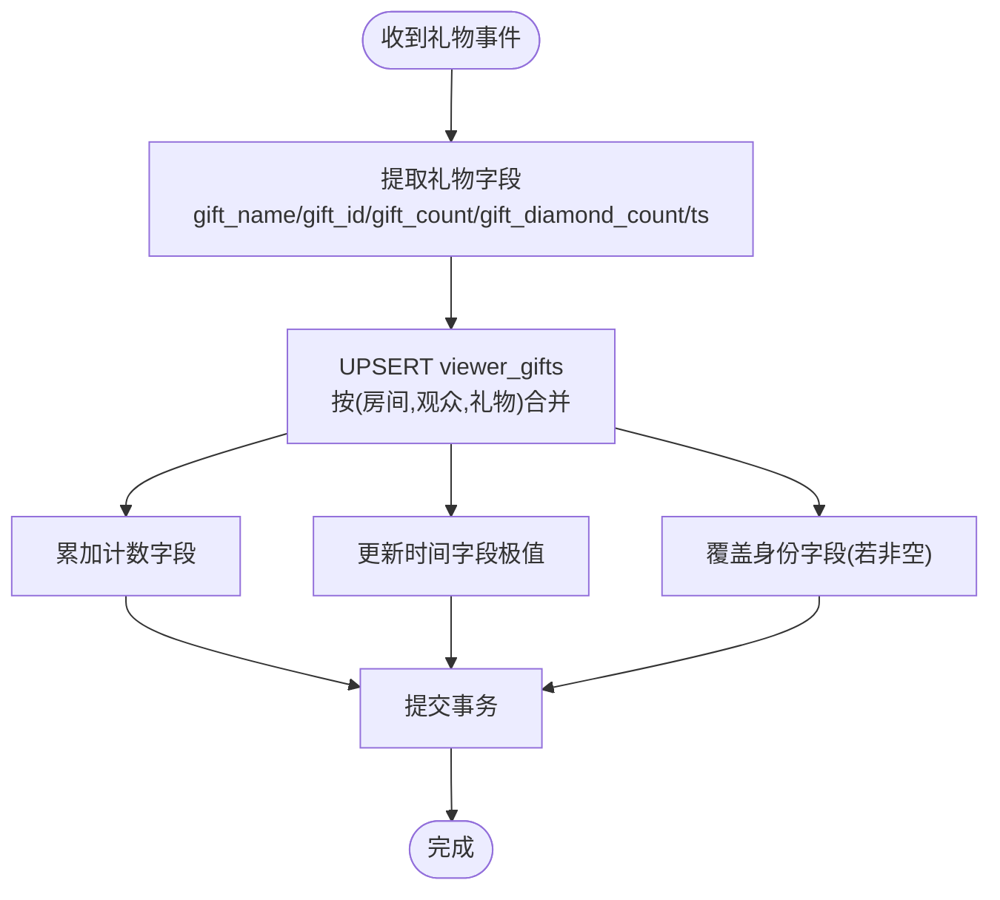
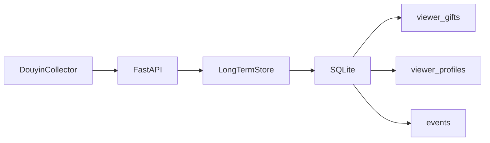

# 礼物历史表设计

<cite>
**本文档引用的文件**
- [DATABASE.md](file://data/DATABASE.md)
- [long_term.py](file://backend/memory/long_term.py)
- [live.py](file://backend/schemas/live.py)
- [app.py](file://backend/app.py)
- [collector.py](file://backend/services/collector.py)
- [config.py](file://backend/config.py)
</cite>

## 目录
1. [简介](#简介)
2. [项目结构](#项目结构)
3. [核心组件](#核心组件)
4. [架构总览](#架构总览)
5. [详细组件分析](#详细组件分析)
6. [依赖关系分析](#依赖关系分析)
7. [性能考量](#性能考量)
8. [故障排查指南](#故障排查指南)
9. [结论](#结论)
10. [附录](#附录)

## 简介
本设计文档围绕礼物历史表（viewer_gifts）展开，系统阐述其专门化设计、字段结构、与用户画像表（viewer_profiles）的协作关系、唯一性约束与去重逻辑、查询模式以及性能优化策略，并结合主播运营场景给出应用建议。该表用于按房间、观众与礼物名称进行聚合，记录每个礼物的发送频次、数量与钻石消耗总量，以及首次与最后发送时间，支撑礼物排行榜、偏好分析与价值评估等业务需求。

## 项目结构
本项目采用分层架构：采集层负责从直播平台接收实时消息并标准化为统一事件模型；处理层将事件持久化至SQLite，并维护多张核心表；API层提供前端交互接口。礼物历史表位于长期存储层，与事件流水表、用户画像表、直播场次表共同构成完整的直播运营数据体系。

图表来源
- [collector.py:1-284](file://backend/services/collector.py#L1-L284)
- [app.py:61-78](file://backend/app.py#L61-L78)
- [long_term.py:50-154](file://backend/memory/long_term.py#L50-L154)

章节来源
- [collector.py:1-284](file://backend/services/collector.py#L1-L284)
- [app.py:61-78](file://backend/app.py#L61-L78)
- [long_term.py:50-154](file://backend/memory/long_term.py#L50-L154)

## 核心组件
- 礼物历史表（viewer_gifts）
  - 主键：(room_id, viewer_id, gift_name)，确保同一房间、同一观众对某一礼物的唯一记录
  - 字段：gift_event_count、total_gift_count、total_diamond_count、first_sent_at、last_sent_at
  - 作用：按礼物维度聚合统计，支持礼物偏好与价值分析
- 用户画像表（viewer_profiles）
  - 主键：(room_id, viewer_id)，记录观众总体行为指标
  - 与礼物历史表协作：两者均以房间+观众为维度，viewer_gifts补充礼物维度的细粒度统计
- 事件流水表（events）
  - 记录原始事件，包含礼物相关的gift_name、gift_id、gift_count、gift_diamond_count等字段
  - 通过抽取与聚合生成viewer_profiles与viewer_gifts

章节来源
- [DATABASE.md:53-64](file://data/DATABASE.md#L53-L64)
- [long_term.py:105-121](file://backend/memory/long_term.py#L105-L121)
- [long_term.py:326-370](file://backend/memory/long_term.py#L326-L370)
- [long_term.py:372-402](file://backend/memory/long_term.py#L372-L402)

## 架构总览
礼物历史表的构建流程如下：采集器将直播消息标准化为LiveEvent，事件进入处理流程后，先持久化到events表，再根据事件类型更新viewer_profiles与viewer_gifts。其中，礼物事件会触发viewer_gifts的插入或更新逻辑，利用复合主键实现去重与增量累加。

图表来源
- [collector.py:145-283](file://backend/services/collector.py#L145-L283)
- [app.py:61-78](file://backend/app.py#L61-L78)
- [long_term.py:420-454](file://backend/memory/long_term.py#L420-L454)
- [long_term.py:372-402](file://backend/memory/long_term.py#L372-L402)

## 详细组件分析

### 礼物历史表字段结构与设计考虑
- 房间标识与观众标识
  - room_id、viewer_id：与用户画像表一致，确保跨表关联与维度一致性
- 礼物标识
  - gift_name：礼物名称，作为聚合键之一，便于按礼物维度统计
  - gift_id：礼物ID，冗余存储便于后续扩展与关联
- 统计指标
  - gift_event_count：该礼物在该房间被该观众赠送的事件次数（按事件粒度）
  - total_gift_count：该礼物累计赠送数量（按数量字段累加）
  - total_diamond_count：该礼物累计钻石消耗（数量×单价累加）
- 时间维度
  - first_sent_at：首次赠送时间戳
  - last_sent_at：最后一次赠送时间戳
- 设计要点
  - 复合主键确保同一房间、同一观众对同一礼物仅有一条记录，避免重复统计
  - 使用ON CONFLICT更新策略，对计数字段进行累加，对时间字段取极值，保证单调性与正确性
  - 冗余存储用户身份字段（user_id、short_id、sec_uid、nickname），便于不依赖events表的快速展示

章节来源
- [DATABASE.md:57-63](file://data/DATABASE.md#L57-L63)
- [long_term.py:105-121](file://backend/memory/long_term.py#L105-L121)
- [long_term.py:372-402](file://backend/memory/long_term.py#L372-L402)

### 礼物历史表与用户画像表的协作关系
- 维度一致性
  - 两者均以(room_id, viewer_id)为维度，viewer_profiles提供总体画像，viewer_gifts提供礼物维度的细化统计
- 更新策略
  - viewer_profiles：按事件类型累加各类事件计数，按时间字段取极值更新首次/末次时间
  - viewer_gifts：仅在礼物事件时更新，按礼物名称聚合，累加数量与钻石消耗，更新首次/末次时间
- 展示与查询
  - 用户详情页同时返回总体画像与礼物历史，便于综合分析观众行为

章节来源
- [long_term.py:326-370](file://backend/memory/long_term.py#L326-L370)
- [long_term.py:372-402](file://backend/memory/long_term.py#L372-L402)
- [long_term.py:736-749](file://backend/memory/long_term.py#L736-L749)

### 唯一性约束、去重逻辑与数据一致性
- 唯一性约束
  - 主键：(room_id, viewer_id, gift_name)，确保同一维度组合的唯一性
- 去重与更新逻辑
  - 插入策略：INSERT INTO ... VALUES (...) ON CONFLICT(room_id, viewer_id, gift_name) DO UPDATE SET ...
  - 更新规则：
    - 数值类字段：累加（gift_event_count、total_gift_count、total_diamond_count）
    - 时间类字段：取极值（first_sent_at取更早，last_sent_at取更晚）
    - 其他字段：当excluded非空时覆盖，否则保留原值
- 数据一致性保障
  - 单事务内完成events写入与viewer_*表更新，避免中间状态
  - 对于重建场景（如回放或修复），提供全量重建函数，清空后按事件顺序重算

图表来源
- [long_term.py:372-402](file://backend/memory/long_term.py#L372-L402)

章节来源
- [long_term.py:372-402](file://backend/memory/long_term.py#L372-L402)
- [long_term.py:404-420](file://backend/memory/long_term.py#L404-L420)

### 查询模式与典型用例
- 观众礼物历史查询
  - 场景：查看某观众在某房间送过哪些礼物、各礼物的累计数量与钻石消耗、最近一次赠送时间
  - SQL：按last_sent_at降序、gift_name升序排序，限制条数
- 礼物偏好分析
  - 场景：按礼物名称聚合统计，计算每个礼物的总赠送次数、总数量、总钻石消耗
  - 方法：可在viewer_gifts上按gift_name分组汇总，或在应用层聚合
- 礼物价值分析
  - 场景：计算礼物的平均钻石消耗、总价值贡献
  - 方法：结合total_diamond_count与total_gift_count进行比率分析
- 礼物排行榜
  - 场景：按房间维度对礼物进行排行，支持“总赠送次数”、“总数量”、“总钻石消耗”等维度
  - 方法：在viewer_gifts上按维度排序并限制输出

章节来源
- [DATABASE.md:123-131](file://data/DATABASE.md#L123-L131)
- [long_term.py:587-598](file://backend/memory/long_term.py#L587-L598)

### 性能优化策略
- 索引设计
  - viewer_gifts：idx_viewer_gifts_room_viewer_last_sent(room_id, viewer_id, last_sent_at DESC)，支持按房间+观众+时间的高效查询
  - events：idx_events_room_viewer_ts(room_id, viewer_id, ts DESC)，支持按房间+观众+时间的事件检索
  - live_sessions：idx_live_sessions_room_status_last_event(room_id, status, last_event_at DESC)，支持活动场次查询
- 查询优化
  - 使用复合索引覆盖查询条件，减少回表与排序成本
  - 在viewer_gifts上按维度分组时，尽量利用索引列作为过滤条件
- 数据压缩与归档
  - 对历史较久的事件可考虑归档至冷存储，减少热表大小
  - 控制单次查询的limit，避免一次性加载过多数据
- 并发与事务
  - UPSERT操作在单事务中执行，减少锁竞争
  - 对重建场景提供批量处理与事务分批提交，降低长事务风险

章节来源
- [long_term.py:183-195](file://backend/memory/long_term.py#L183-L195)
- [long_term.py:372-402](file://backend/memory/long_term.py#L372-L402)

### 在主播运营中的应用
- 礼物营销
  - 基于礼物历史识别高价值礼物与热门礼物，制定营销策略与联动活动
- 粉丝分析
  - 分析不同观众的礼物偏好，识别忠实粉丝与潜在高价值粉丝
- 收入统计
  - 通过total_diamond_count与total_gift_count计算礼物收入与转化效果
- 实时互动
  - 结合实时事件流与礼物历史，为主播提供互动提示与个性化回复素材

章节来源
- [DATABASE.md:101-150](file://data/DATABASE.md#L101-L150)
- [app.py:135-141](file://backend/app.py#L135-L141)
- [long_term.py:736-749](file://backend/memory/long_term.py#L736-L749)

## 依赖关系分析
- 采集层依赖
  - WebSocket消息解析与事件类型映射，确保礼物事件被正确识别
- 处理层依赖
  - FastAPI事件处理入口，将LiveEvent传递给持久化层
- 存储层依赖
  - SQLite作为单一文件数据库，viewer_gifts与viewer_profiles共享房间+观众维度，events提供原始数据源
- 外部依赖
  - Redis（可选）用于短期会话缓存，不影响礼物历史表的持久化

图表来源
- [collector.py:1-284](file://backend/services/collector.py#L1-L284)
- [app.py:61-78](file://backend/app.py#L61-L78)
- [long_term.py:50-154](file://backend/memory/long_term.py#L50-L154)

章节来源
- [collector.py:1-284](file://backend/services/collector.py#L1-L284)
- [app.py:61-78](file://backend/app.py#L61-L78)
- [long_term.py:50-154](file://backend/memory/long_term.py#L50-L154)

## 性能考量
- 写入路径
  - 礼物事件写入events后，立即更新viewer_profiles与viewer_gifts，单事务保证一致性
  - UPSERT使用ON CONFLICT，避免重复插入与额外查询
- 读取路径
  - viewer_gifts按last_sent_at降序查询，适合“最近礼物”展示
  - events按房间+观众+时间查询，适合事件历史回溯
- 索引命中
  - 合理的复合索引可显著提升查询性能，避免全表扫描
- 扩展性
  - 当前为单机SQLite，若需水平扩展，可考虑分片或迁移至分布式数据库，同时保持复合主键与索引策略不变

章节来源
- [long_term.py:372-402](file://backend/memory/long_term.py#L372-L402)
- [long_term.py:587-598](file://backend/memory/long_term.py#L587-L598)
- [long_term.py:183-195](file://backend/memory/long_term.py#L183-L195)

## 故障排查指南
- 事件未入库
  - 检查WebSocket连接状态与消息解析是否成功
  - 确认事件类型映射是否包含礼物事件
- 礼物统计异常
  - 核对gift_count与gift_diamond_count提取逻辑，确保数值字段非负且有效
  - 检查UPSERT更新条件，确认时间字段极值更新逻辑符合预期
- 查询结果为空
  - 确认查询参数（房间ID、观众ID）正确
  - 检查索引是否存在且被查询条件命中
- 数据不一致
  - 如发生重建或修复，使用重建函数按事件顺序重算，避免并发写入干扰

章节来源
- [collector.py:145-283](file://backend/services/collector.py#L145-L283)
- [long_term.py:197-214](file://backend/memory/long_term.py#L197-L214)
- [long_term.py:372-402](file://backend/memory/long_term.py#L372-L402)
- [long_term.py:404-420](file://backend/memory/long_term.py#L404-L420)

## 结论
礼物历史表（viewer_gifts）通过复合主键与UPSERT更新策略，实现了对礼物维度的高效聚合与去重。它与用户画像表协同工作，既满足实时展示需求，又为礼物营销、粉丝分析与收入统计提供了坚实的数据基础。配合合理的索引与查询优化，可在单机SQLite环境下实现良好的性能表现。未来可根据业务规模与访问模式进一步扩展存储方案。

## 附录
- 关键SQL参考
  - 礼物历史查询：[DATABASE.md:123-131](file://data/DATABASE.md#L123-L131)
  - 用户画像查询：[DATABASE.md:103-110](file://data/DATABASE.md#L103-L110)
- 事件模型定义
  - LiveEvent与Actor：[live.py:8-27](file://backend/schemas/live.py#L8-L27)
  - LiveEvent字段：[live.py:29-44](file://backend/schemas/live.py#L29-L44)
- 应用入口与事件处理
  - FastAPI路由与事件处理：[app.py:61-78](file://backend/app.py#L61-L78)
  - 采集器WebSocket与消息解析：[collector.py:145-283](file://backend/services/collector.py#L145-L283)
- 数据库配置
  - SQLite路径与目录：[config.py:52-68](file://backend/config.py#L52-L68)