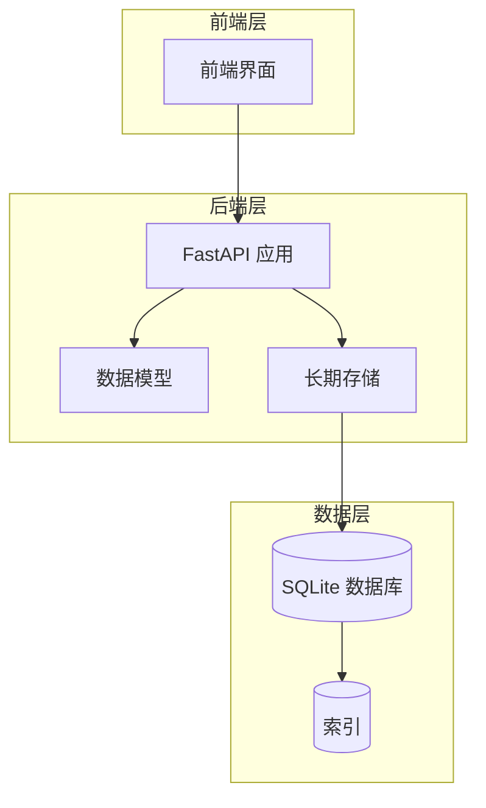
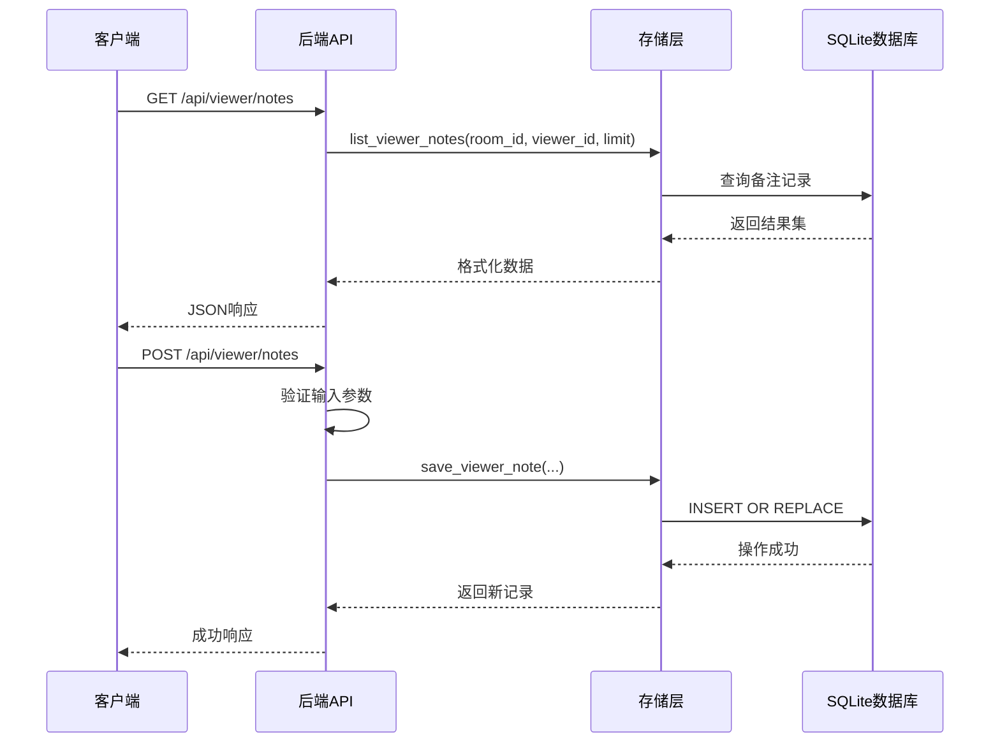
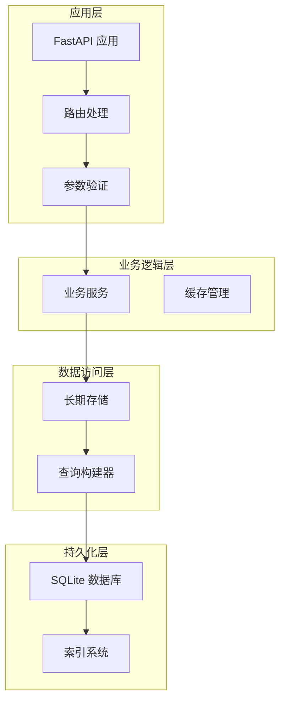
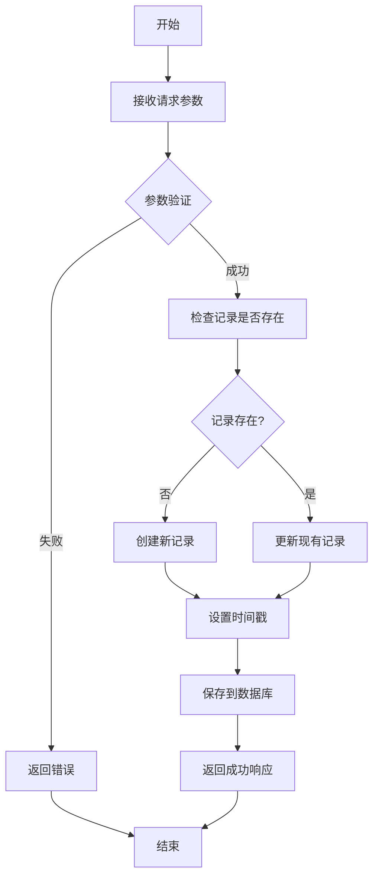
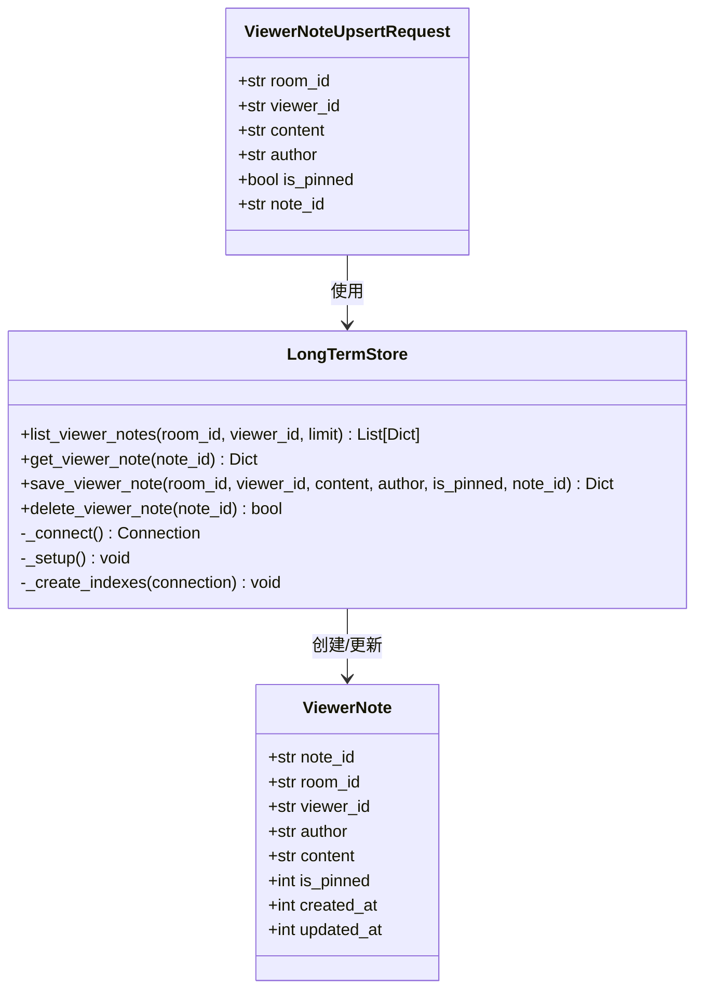
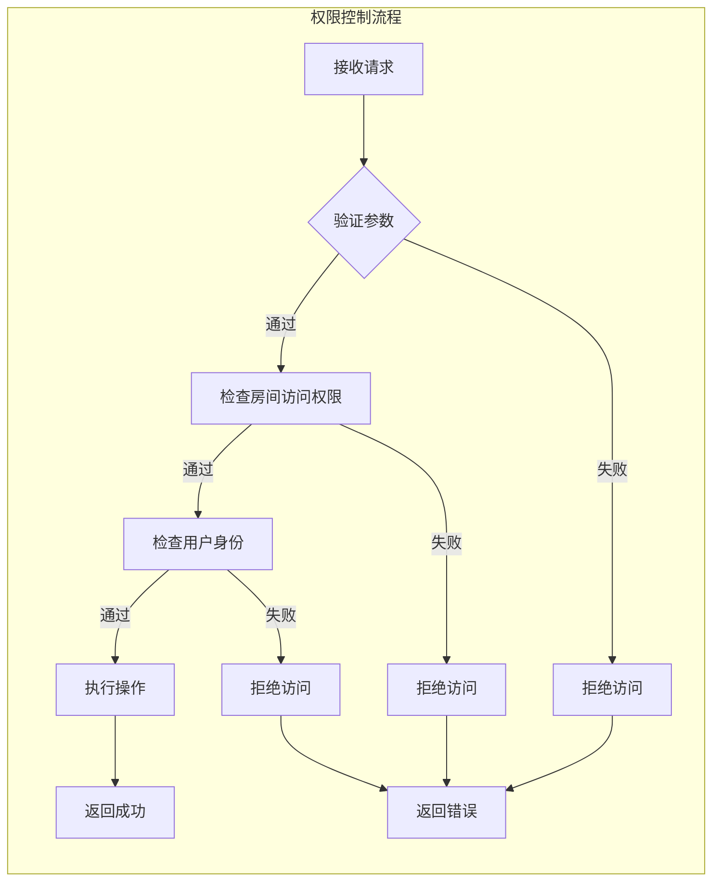
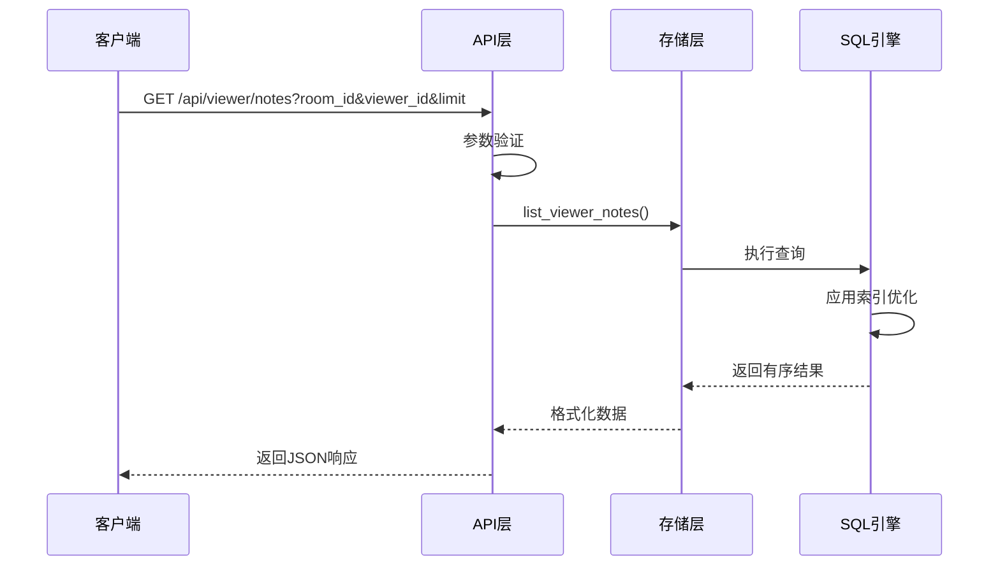
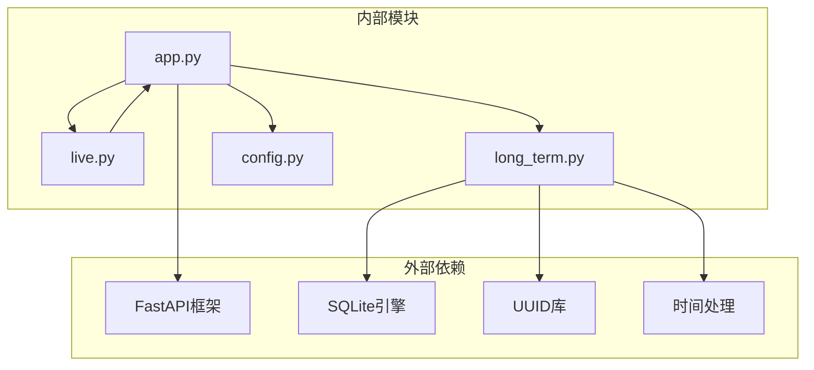
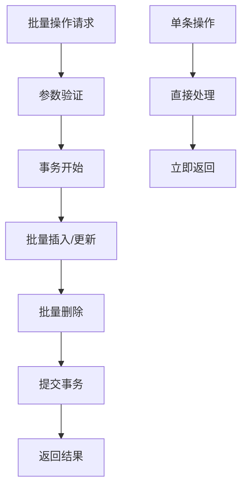

# 观众备注表设计

<cite>
**本文档引用的文件**
- [DATABASE.md](file://data/DATABASE.md)
- [long_term.py](file://backend/memory/long_term.py)
- [app.py](file://backend/app.py)
- [live.py](file://backend/schemas/live.py)
- [config.py](file://backend/config.py)
</cite>

## 目录
1. [简介](#简介)
2. [项目结构](#项目结构)
3. [核心组件](#核心组件)
4. [架构概览](#架构概览)
5. [详细组件分析](#详细组件分析)
6. [依赖关系分析](#依赖关系分析)
7. [性能考虑](#性能考虑)
8. [故障排除指南](#故障排除指南)
9. [结论](#结论)

## 简介

观众备注表(viewer_notes)是直播平台中用于主播和运营人员管理观众的重要功能模块。该表允许用户为特定房间的观众添加个人备注，支持置顶功能、作者身份标识和时间戳管理。本文档将详细介绍观众备注表的设计理念、数据结构、权限控制机制、查询优化策略以及在主播管理中的应用场景。

## 项目结构

该项目采用分层架构设计，主要包含以下核心模块：

**图表来源**
- [app.py:1-220](file://backend/app.py#L1-L220)
- [long_term.py:1-200](file://backend/memory/long_term.py#L1-L200)

**章节来源**
- [app.py:1-220](file://backend/app.py#L1-L220)
- [long_term.py:1-200](file://backend/memory/long_term.py#L1-L200)

## 核心组件

### 数据模型定义

观众备注表采用简洁而高效的数据结构设计，确保满足直播场景下的高性能需求：

| 字段名称 | 数据类型 | 约束条件 | 描述 |
|---------|---------|---------|------|
| note_id | TEXT | PRIMARY KEY | 备注唯一标识符，使用UUID生成 |
| room_id | TEXT | NOT NULL | 房间关联标识，支持多房间管理 |
| viewer_id | TEXT | NOT NULL | 观众标识符，基于多种身份源组合 |
| author | TEXT | NOT NULL | 备注作者，默认为"主播" |
| content | TEXT | NOT NULL | 备注内容，支持任意文本 |
| is_pinned | INTEGER | DEFAULT 0 | 置顶状态，0为未置顶，1为置顶 |
| created_at | INTEGER | NOT NULL | 创建时间戳（毫秒） |
| updated_at | INTEGER | NOT NULL | 更新时间戳（毫秒） |

### API 接口设计

系统提供了完整的RESTful API接口来管理观众备注：

**图表来源**
- [app.py:144-171](file://backend/app.py#L144-L171)
- [long_term.py:620-661](file://backend/memory/long_term.py#L620-L661)

**章节来源**
- [app.py:36-42](file://backend/app.py#L36-L42)
- [app.py:144-171](file://backend/app.py#L144-L171)
- [long_term.py:138-147](file://backend/memory/long_term.py#L138-L147)

## 架构概览

### 整体架构设计

**图表来源**
- [app.py:1-220](file://backend/app.py#L1-L220)
- [long_term.py:1-200](file://backend/memory/long_term.py#L1-L200)

### 数据流处理

系统采用事件驱动的方式处理观众备注的创建、更新和删除操作：

**图表来源**
- [app.py:153-164](file://backend/app.py#L153-L164)
- [long_term.py:642-656](file://backend/memory/long_term.py#L642-L656)

## 详细组件分析

### 数据模型类图

**图表来源**
- [app.py:36-42](file://backend/app.py#L36-L42)
- [long_term.py:620-661](file://backend/memory/long_term.py#L620-L661)

### 权限控制机制

系统采用简单的基于角色的权限控制机制：

**图表来源**
- [app.py:153-164](file://backend/app.py#L153-L164)
- [long_term.py:642-656](file://backend/memory/long_term.py#L642-L656)

### 查询优化策略

系统实现了多层次的查询优化策略：

#### 索引设计
- 主键索引：`PRIMARY KEY (note_id)`
- 复合索引：`(room_id, viewer_id, updated_at DESC)`
- 查询优化：支持按房间和观众ID快速定位

#### 排序和筛选功能

**图表来源**
- [long_term.py:620-632](file://backend/memory/long_term.py#L620-L632)
- [app.py:144-150](file://backend/app.py#L144-L150)

**章节来源**
- [long_term.py:183-195](file://backend/memory/long_term.py#L183-L195)
- [long_term.py:620-632](file://backend/memory/long_term.py#L620-L632)

## 依赖关系分析

### 组件耦合度分析

**图表来源**
- [app.py:1-220](file://backend/app.py#L1-L220)
- [long_term.py:1-200](file://backend/memory/long_term.py#L1-L200)

### 数据完整性保证

系统通过多种机制确保数据完整性：

#### 外键约束
- 虽然SQLite不强制外键约束，但通过业务逻辑确保数据一致性
- 依赖房间ID和观众ID的正确性

#### 内容验证
- 必填字段验证：`room_id`、`viewer_id`、`content`
- 类型安全：Pydantic模型提供类型检查
- 空白字符处理：统一的字符串清理机制

#### 时间戳更新
- 自动维护创建和更新时间戳
- 使用毫秒级时间戳确保精确性

**章节来源**
- [app.py:153-164](file://backend/app.py#L153-L164)
- [long_term.py:642-656](file://backend/memory/long_term.py#L642-L656)

## 性能考虑

### 查询性能优化

#### 索引策略
- 复合索引 `(room_id, viewer_id, updated_at DESC)` 支持高效查询
- 限制返回数量避免大数据集扫描
- 使用LIMIT子句控制结果集大小

#### 缓存机制
- 利用SQLite的内存特性减少磁盘I/O
- 合理的连接池管理
- 避免重复查询相同数据

### 批量操作支持

系统支持高效的批量操作：

**图表来源**
- [long_term.py:620-661](file://backend/memory/long_term.py#L620-L661)

## 故障排除指南

### 常见问题及解决方案

#### 数据库连接问题
- **症状**：查询超时或连接失败
- **原因**：数据库文件被其他进程占用
- **解决**：重启应用或检查文件权限

#### 参数验证错误
- **症状**：HTTP 400 错误
- **原因**：缺少必需参数或参数格式不正确
- **解决**：检查请求参数格式和完整性

#### 数据一致性问题
- **症状**：查询结果异常
- **原因**：并发写入导致的数据竞争
- **解决**：使用事务确保原子性操作

**章节来源**
- [app.py:148-171](file://backend/app.py#L148-L171)
- [long_term.py:642-661](file://backend/memory/long_term.py#L642-L661)

## 结论

观众备注表设计体现了现代直播平台对实时性、可扩展性和用户体验的综合考量。通过合理的数据结构设计、完善的权限控制机制和高效的查询优化策略，系统能够满足主播和运营人员在复杂直播场景下的各种需求。

### 设计亮点

1. **简洁高效**：最小化的字段设计确保了最佳的性能表现
2. **灵活扩展**：支持置顶功能和自定义作者标识
3. **强健可靠**：多重验证机制确保数据完整性
4. **易于维护**：清晰的代码结构和完善的文档支持

### 应用场景

- **粉丝管理**：标记重要观众，建立个性化互动策略
- **特殊观众标记**：识别潜在VIP或需要特别关注的观众
- **互动策略制定**：基于备注内容制定针对性的直播策略
- **数据分析**：结合其他观众数据进行深度分析

该设计为直播平台的观众管理提供了坚实的技术基础，能够有效提升主播的运营效率和观众体验质量。