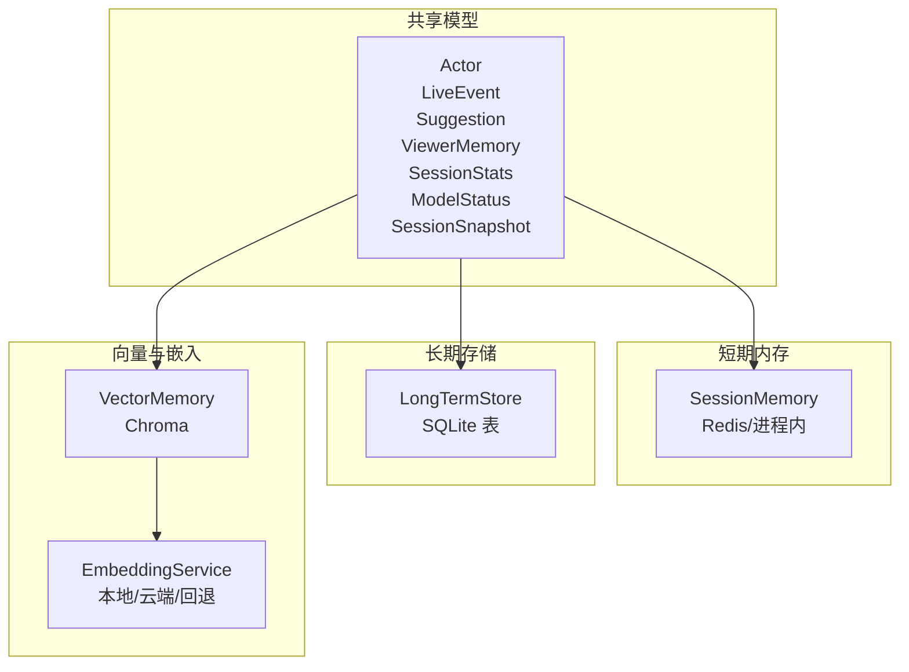
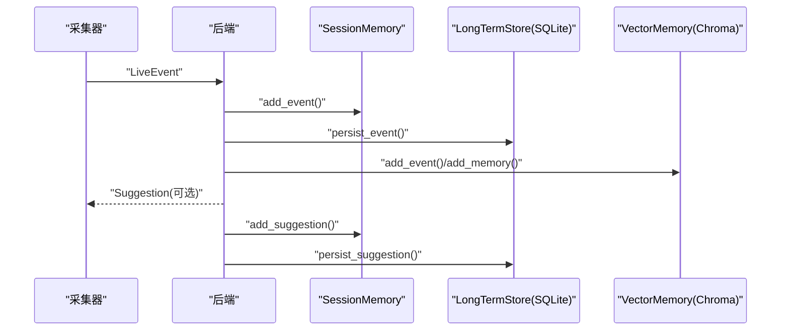
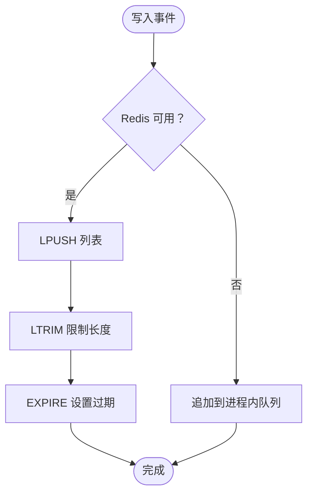
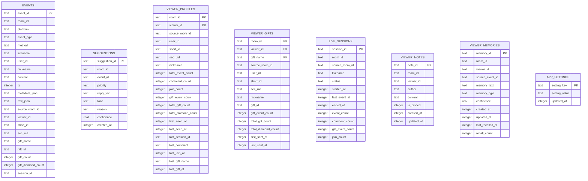
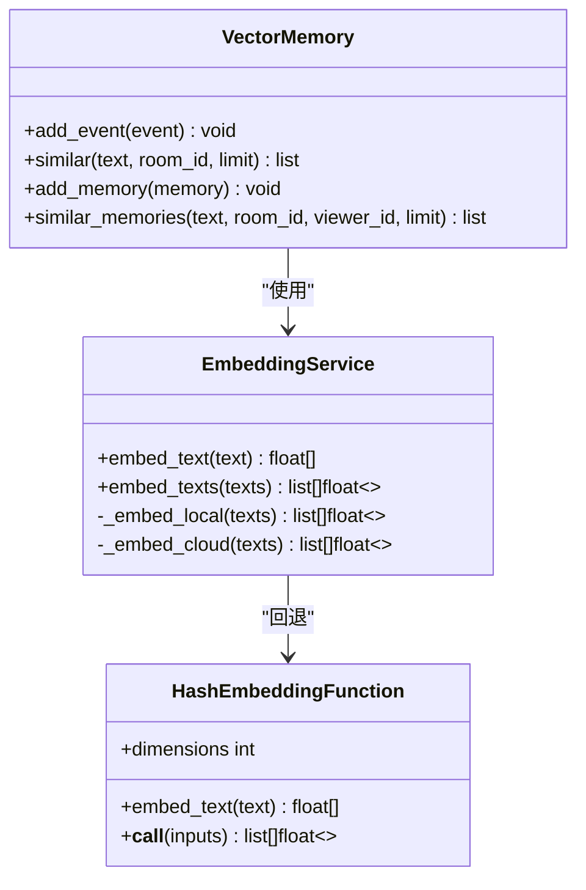
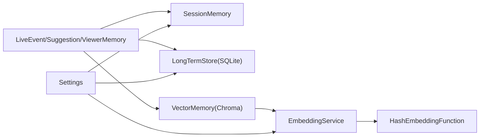

# 数据模型

<cite>
**本文引用的文件**
- [backend/schemas/live.py](file://backend/schemas/live.py)
- [data/DATABASE.md](file://data/DATABASE.md)
- [backend/memory/session_memory.py](file://backend/memory/session_memory.py)
- [backend/memory/long_term.py](file://backend/memory/long_term.py)
- [backend/memory/vector_store.py](file://backend/memory/vector_store.py)
- [backend/memory/rebuild_embeddings.py](file://backend/memory/rebuild_embeddings.py)
- [backend/memory/embedding_service.py](file://backend/memory/embedding_service.py)
- [backend/config.py](file://backend/config.py)
- [README.md](file://README.md)
- [tests/test_vector_store.py](file://tests/test_vector_store.py)
</cite>

## 目录
1. [简介](#简介)
2. [项目结构](#项目结构)
3. [核心数据模型](#核心数据模型)
4. [架构总览](#架构总览)
5. [详细组件分析](#详细组件分析)
6. [依赖关系分析](#依赖关系分析)
7. [性能考量](#性能考量)
8. [故障排查指南](#故障排查指南)
9. [结论](#结论)
10. [附录](#附录)

## 简介
本文件聚焦于 DouYin_llm 项目的“数据模型”维度，系统性梳理后端共享数据模型、SQLite 长期存储表结构、短期会话内存与向量索引的组织方式，以及它们之间的关系与交互。重点覆盖以下核心实体：LiveEvent、Suggestion、ViewerMemory、SessionSnapshot，并结合数据库模式图、索引与约束、数据访问模式、缓存策略、性能与迁移策略进行说明，帮助读者快速理解数据如何在系统中流转与沉淀。

## 项目结构
围绕数据模型的关键位置如下：
- 共享数据模型定义：backend/schemas/live.py
- 长期存储（SQLite）：backend/memory/long_term.py
- 短期会话内存（Redis/进程内）：backend/memory/session_memory.py
- 向量检索与嵌入：backend/memory/vector_store.py、backend/memory/embedding_service.py
- 嵌入重建工具：backend/memory/rebuild_embeddings.py
- 数据库说明文档：data/DATABASE.md
- 配置项（影响数据行为）：backend/config.py
- 顶层说明与数据位置：README.md

图表来源
- [backend/schemas/live.py:8-111](file://backend/schemas/live.py#L8-L111)
- [backend/memory/session_memory.py:17-113](file://backend/memory/session_memory.py#L17-L113)
- [backend/memory/long_term.py:44-187](file://backend/memory/long_term.py#L44-L187)
- [backend/memory/vector_store.py:59-317](file://backend/memory/vector_store.py#L59-L317)
- [backend/memory/embedding_service.py:18-102](file://backend/memory/embedding_service.py#L18-L102)

章节来源
- [backend/schemas/live.py:1-111](file://backend/schemas/live.py#L1-L111)
- [backend/memory/session_memory.py:1-113](file://backend/memory/session_memory.py#L1-L113)
- [backend/memory/long_term.py:1-967](file://backend/memory/long_term.py#L1-L967)
- [backend/memory/vector_store.py:1-317](file://backend/memory/vector_store.py#L1-L317)
- [backend/memory/embedding_service.py:1-102](file://backend/memory/embedding_service.py#L1-L102)
- [backend/memory/rebuild_embeddings.py:1-300](file://backend/memory/rebuild_embeddings.py#L1-L300)
- [data/DATABASE.md:1-151](file://data/DATABASE.md#L1-L151)
- [backend/config.py:1-113](file://backend/config.py#L1-L113)
- [README.md:1-223](file://README.md#L1-L223)

## 核心数据模型
本节对共享数据模型进行逐项说明，包括字段、类型、默认值、业务含义与约束。

- Actor
  - 字段：id、short_id、sec_uid、nickname
  - 用途：每个直播事件携带的最小用户身份信息
  - 计算 viewer_id：优先使用 id，其次 sec_uid，再短号，最后昵称；均不可得则为空字符串
  - 参考路径：[Actor 定义:8-27](file://backend/schemas/live.py#L8-L27)

- LiveEvent
  - 字段：event_id、room_id、source_room_id、session_id、platform、event_type、method、livename、ts、user(Actor)、content、metadata(dict)、raw(dict)
  - 用途：跨采集、存储、API 的标准化直播事件
  - 约束与默认：event_type 不能为空；ts 为整数时间戳；user 默认工厂实例
  - 参考路径：[LiveEvent 定义:29-45](file://backend/schemas/live.py#L29-L45)

- Suggestion
  - 字段：suggestion_id、room_id、event_id、source、priority、reply_text、tone、reason、confidence、source_events(list)、references(list)、created_at
  - 用途：从直播事件生成的回复建议
  - 约束与默认：source 默认 heuristic；priority/tone/reason 用于指导回复风格；confidence 为置信度
  - 参考路径：[Suggestion 定义:47-62](file://backend/schemas/live.py#L47-L62)

- ViewerMemory
  - 字段：memory_id、room_id、viewer_id、source_event_id、memory_text、memory_type、confidence、created_at、updated_at、last_recalled_at、recall_count
  - 用途：与特定观众绑定的语义记忆
  - 约束与默认：memory_type 默认 fact；confidence 默认 0.0；recall_count 默认 0
  - 参考路径：[ViewerMemory 定义:64-78](file://backend/schemas/live.py#L64-L78)

- SessionStats
  - 字段：room_id、total_events、comments、gifts、likes、members、follows
  - 用途：前端展示的轻量房间统计
  - 参考路径：[SessionStats 定义:80-90](file://backend/schemas/live.py#L80-L90)

- ModelStatus
  - 字段：mode、model、backend、last_result、last_error、updated_at
  - 用途：模型后端状态
  - 参考路径：[ModelStatus 定义:92-101](file://backend/schemas/live.py#L92-L101)

- SessionSnapshot
  - 字段：room_id、recent_events(list[LiveEvent])、recent_suggestions(list[Suggestion])、stats(SessionStats)、model_status(ModelStatus)
  - 用途：前端初始化快照
  - 参考路径：[SessionSnapshot 定义:103-111](file://backend/schemas/live.py#L103-L111)

章节来源
- [backend/schemas/live.py:8-111](file://backend/schemas/live.py#L8-L111)

## 架构总览
数据在系统中的流向概览：
- 采集器将原始消息转换为 LiveEvent，随后进入短期会话内存（Redis/进程内）与长期存储（SQLite）。
- 同时，LiveEvent 与 ViewerMemory 也写入向量索引（Chroma），用于语义检索。
- Agent 基于事件与记忆生成 Suggestion，并写入短期与长期存储。
- 前端通过 /api/bootstrap 获取 SessionSnapshot，实时流通过 SSE/WebSocket 推送。

图表来源
- [backend/memory/session_memory.py:42-84](file://backend/memory/session_memory.py#L42-L84)
- [backend/memory/long_term.py:454-488](file://backend/memory/long_term.py#L454-L488)
- [backend/memory/vector_store.py:149-171](file://backend/memory/vector_store.py#L149-L171)
- [backend/memory/vector_store.py:232-256](file://backend/memory/vector_store.py#L232-L256)

章节来源
- [README.md:143-149](file://README.md#L143-L149)
- [backend/memory/session_memory.py:1-113](file://backend/memory/session_memory.py#L1-L113)
- [backend/memory/long_term.py:1-967](file://backend/memory/long_term.py#L1-L967)
- [backend/memory/vector_store.py:1-317](file://backend/memory/vector_store.py#L1-L317)

## 详细组件分析

### LiveEvent：标准化直播事件
- 字段与类型：见“核心数据模型”
- 业务规则：
  - event_type 不能为空，用于统计与筛选
  - ts 为单调递增时间戳，用于排序
  - user.viewer_id 作为观众唯一标识，优先级为 id > sec_uid > short_id > nickname
- 数据验证：
  - 非空校验：event_type、ts、content（部分场景）
  - 类型校验：ts 为整数；metadata/raw 为字典
- 使用场景：
  - 采集器统一转换后的标准输入
  - 长期存储 events 表的落盘字段
  - 向量检索时的文档内容拼接（昵称+内容）

章节来源
- [backend/schemas/live.py:29-45](file://backend/schemas/live.py#L29-L45)
- [backend/memory/long_term.py:250-277](file://backend/memory/long_term.py#L250-L277)
- [backend/memory/vector_store.py:149-162](file://backend/memory/vector_store.py#L149-L162)

### Suggestion：回复建议
- 字段与类型：见“核心数据模型”
- 业务规则：
  - source 可为 heuristic 或其它来源
  - confidence 用于排序与阈值过滤
  - reply_text 为建议文本
- 存储与检索：
  - 长期存储 suggestions 表
  - 短期会话内存中保存最近建议，便于前端实时展示

章节来源
- [backend/schemas/live.py:47-62](file://backend/schemas/live.py#L47-L62)
- [backend/memory/long_term.py:490-500](file://backend/memory/long_term.py#L490-L500)
- [backend/memory/session_memory.py:54-84](file://backend/memory/session_memory.py#L54-L84)

### ViewerMemory：语义记忆
- 字段与类型：见“核心数据模型”
- 业务规则：
  - memory_type 支持 fact 等类型
  - confidence 与 recall_count 用于检索重排
  - last_recalled_at 与 updated_at 用于热度与时效排序
- 存储与检索：
  - 长期存储 viewer_memories 表
  - 向量检索 similar_memories，支持按 room_id 与 viewer_id 过滤

章节来源
- [backend/schemas/live.py:64-78](file://backend/schemas/live.py#L64-L78)
- [backend/memory/long_term.py:676-785](file://backend/memory/long_term.py#L676-L785)
- [backend/memory/vector_store.py:257-316](file://backend/memory/vector_store.py#L257-L316)

### SessionSnapshot：前端初始化快照
- 字段与类型：见“核心数据模型”
- 用途：/api/bootstrap 返回，包含最近事件、建议、统计与模型状态
- 生成逻辑：基于短期会话内存与统计计算

章节来源
- [backend/schemas/live.py:103-111](file://backend/schemas/live.py#L103-L111)
- [backend/memory/session_memory.py:104-113](file://backend/memory/session_memory.py#L104-L113)

### SessionMemory：短期会话内存
- 缓存策略：
  - Redis 模式：使用列表结构，上限分别限制事件与建议数量，支持 TTL
  - 进程内模式：使用双端队列，分别限制事件与建议数量
- 生命周期：
  - 事件窗口：默认最近 120 条
  - 建议窗口：默认最近 40 条
  - TTL：默认 4 小时（可配置）
- 读写接口：add_event、add_suggestion、recent_events、recent_suggestions、stats、snapshot

图表来源
- [backend/memory/session_memory.py:42-64](file://backend/memory/session_memory.py#L42-L64)
- [backend/config.py:55-56](file://backend/config.py#L55-L56)

章节来源
- [backend/memory/session_memory.py:1-113](file://backend/memory/session_memory.py#L1-L113)
- [backend/config.py:55-56](file://backend/config.py#L55-L56)

### LongTermStore：SQLite 长期存储
- 表与主键/索引：
  - events(event_id 主键)
  - suggestions(suggestion_id 主键)
  - viewer_profiles(room_id, viewer_id 复合主键)
  - viewer_gifts(room_id, viewer_id, gift_name 复合主键)
  - live_sessions(session_id 主键)
  - viewer_notes(note_id 主键)
  - viewer_memories(memory_id 主键)
  - app_settings(setting_key 主键)
- 索引：
  - events：room_id/ts、room_id/viewer_id/ts、room_id/event_type/ts、session_id
  - viewer_profiles：room_id/nickname
  - viewer_gifts：room_id, viewer_id, last_sent_at DESC
  - live_sessions：room_id, status, last_event_at DESC
  - viewer_notes：room_id, viewer_id, updated_at DESC
  - viewer_memories：room_id, viewer_id, updated_at DESC
- 业务逻辑：
  - 自动创建/激活直播会话，更新会话统计
  - upsert 观众画像与礼物聚合
  - 支持按房间、观众、事件类型等维度查询
  - 支持回填历史字段（如 viewer_id、礼物字段等）

图表来源
- [backend/memory/long_term.py:67-181](file://backend/memory/long_term.py#L67-L181)
- [data/DATABASE.md:16-151](file://data/DATABASE.md#L16-L151)

章节来源
- [backend/memory/long_term.py:63-187](file://backend/memory/long_term.py#L63-L187)
- [data/DATABASE.md:1-151](file://data/DATABASE.md#L1-L151)

### VectorMemory：向量检索与嵌入
- 嵌入服务：
  - 支持本地（SentenceTransformer）、云端（OpenAI 兼容）、回退（HashEmbeddingFunction）
  - 通过 EmbeddingService 统一接口
- 索引与集合：
  - live_history_{signature}：事件历史
  - viewer_memories_{signature}：观众记忆
  - signature 由 embedding_mode 与 embedding_model 组合生成
- 检索策略：
  - 相似事件：按距离与元数据（event_type、ts）重排
  - 相似记忆：按距离、置信度、召回次数、更新时间重排
  - 支持按 room_id 过滤
- 回退机制：当 Chroma 不可用时，使用内存中的近似索引

图表来源
- [backend/memory/embedding_service.py:18-102](file://backend/memory/embedding_service.py#L18-L102)
- [backend/memory/vector_store.py:34-57](file://backend/memory/vector_store.py#L34-L57)
- [backend/memory/vector_store.py:59-317](file://backend/memory/vector_store.py#L59-L317)

章节来源
- [backend/memory/embedding_service.py:1-102](file://backend/memory/embedding_service.py#L1-L102)
- [backend/memory/vector_store.py:1-317](file://backend/memory/vector_store.py#L1-L317)
- [tests/test_vector_store.py:1-103](file://tests/test_vector_store.py#L1-L103)

### 嵌入重建工具：rebuild_embeddings
- 功能：从 SQLite 中抽取事件与记忆，批量生成嵌入并写入对应集合
- 支持目标：memories、events、all
- 特性：支持按房间过滤、限制条数、干跑、丢弃已有集合
- 清单：写入 index_manifest.json 记录当前签名与集合信息

章节来源
- [backend/memory/rebuild_embeddings.py:1-300](file://backend/memory/rebuild_embeddings.py#L1-L300)

## 依赖关系分析
- 模型依赖：LiveEvent/Suggestion/ViewerMemory 等由共享模型定义，被短期内存、长期存储与向量模块共同使用
- 存储依赖：短期内存（Redis/进程内）与长期存储（SQLite）并行存在，向量索引（Chroma）依赖嵌入服务
- 配置依赖：Redis/TTL、嵌入模式/模型、语义阈值与召回数量等通过配置项控制

图表来源
- [backend/schemas/live.py:8-111](file://backend/schemas/live.py#L8-L111)
- [backend/memory/session_memory.py:17-113](file://backend/memory/session_memory.py#L17-L113)
- [backend/memory/long_term.py:44-187](file://backend/memory/long_term.py#L44-L187)
- [backend/memory/vector_store.py:59-317](file://backend/memory/vector_store.py#L59-L317)
- [backend/memory/embedding_service.py:18-102](file://backend/memory/embedding_service.py#L18-L102)
- [backend/config.py:40-113](file://backend/config.py#L40-L113)

章节来源
- [backend/config.py:40-113](file://backend/config.py#L40-L113)

## 性能考量
- 短期内存
  - Redis 模式：列表 + 截断 + TTL，避免无限增长；TTL 默认 4 小时
  - 进程内模式：双端队列限制窗口大小，避免内存膨胀
- 长期存储
  - 事件表建立多维索引，支持按房间、时间、事件类型、会话 ID 查询
  - upsert 与增量更新减少全量扫描
- 向量检索
  - 通过 signature 区分不同嵌入配置，避免冲突
  - 查询时设置最小分数与最终 K，控制召回质量与数量
  - 重排函数综合距离、包含度、事件类型、时间、置信度、召回次数等

章节来源
- [backend/memory/session_memory.py:17-113](file://backend/memory/session_memory.py#L17-L113)
- [backend/memory/long_term.py:216-229](file://backend/memory/long_term.py#L216-L229)
- [backend/memory/vector_store.py:86-134](file://backend/memory/vector_store.py#L86-L134)
- [backend/config.py:64-76](file://backend/config.py#L64-L76)

## 故障排查指南
- 向量索引不可用
  - 现象：VectorMemory 初始化警告，使用内存近似索引
  - 处理：安装 Chroma 或调整嵌入模式
  - 参考：[VectorMemory 初始化日志:70-84](file://backend/memory/vector_store.py#L70-L84)
- 嵌入服务异常
  - 现象：云端/本地嵌入失败，回退到哈希嵌入
  - 处理：检查网络、密钥、模型名；或切换到本地模式
  - 参考：[EmbeddingService 回退逻辑:33-48](file://backend/memory/embedding_service.py#L33-L48)
- 嵌入重建失败
  - 现象：重建脚本报错或集合未更新
  - 处理：确认 SQLite 数据存在、Chroma 可写、签名一致；必要时丢弃已有集合
  - 参考：[rebuild_embeddings:155-275](file://backend/memory/rebuild_embeddings.py#L155-L275)
- 配置问题
  - 现象：Redis 未生效、TTL 不生效
  - 处理：检查 REDIS_URL、SESSION_TTL_SECONDS 环境变量
  - 参考：[配置项:55-56](file://backend/config.py#L55-L56)

章节来源
- [backend/memory/vector_store.py:70-84](file://backend/memory/vector_store.py#L70-L84)
- [backend/memory/embedding_service.py:33-48](file://backend/memory/embedding_service.py#L33-L48)
- [backend/memory/rebuild_embeddings.py:155-275](file://backend/memory/rebuild_embeddings.py#L155-L275)
- [backend/config.py:55-56](file://backend/config.py#L55-L56)

## 结论
本数据模型文档系统梳理了 LiveEvent、Suggestion、ViewerMemory、SessionSnapshot 等核心实体，明确了它们在短期内存、长期存储与向量索引中的职责与交互。通过 SQLite 的规范化表结构、Redis/进程内的短期缓存、Chroma 的语义检索与嵌入服务，系统实现了低延迟的实时展示与高召回的语义检索。建议在生产环境中：
- 明确 Redis/TTL、嵌入模式与阈值配置
- 定期重建向量索引，确保检索效果
- 监控 SQLite 索引与查询性能，按需优化

## 附录

### 数据访问模式与示例
- 最近事件与建议
  - 读取：recent_events、recent_suggestions
  - 示例：[SessionMemory 读取:66-84](file://backend/memory/session_memory.py#L66-L84)
- 事件历史与统计
  - 读取：recent_events、stats
  - 示例：[LongTermStore 读取:501-557](file://backend/memory/long_term.py#L501-L557)
- 观众画像与礼物聚合
  - 读取：viewer_event_history、viewer_gift_history、viewer_session_history
  - 示例：[LongTermStore 查询:600-652](file://backend/memory/long_term.py#L600-L652)
- 语义检索
  - 事件：similar
  - 记忆：similar_memories
  - 示例：[VectorMemory 检索:172-231](file://backend/memory/vector_store.py#L172-L231)

章节来源
- [backend/memory/session_memory.py:66-113](file://backend/memory/session_memory.py#L66-L113)
- [backend/memory/long_term.py:501-652](file://backend/memory/long_term.py#L501-L652)
- [backend/memory/vector_store.py:172-316](file://backend/memory/vector_store.py#L172-L316)

### 数据生命周期、保留策略与归档规则
- 短期内存
  - 事件窗口：默认最近 120 条
  - 建议窗口：默认最近 40 条
  - TTL：默认 4 小时（可配置）
  - 参考：[SessionMemory:17-113](file://backend/memory/session_memory.py#L17-L113)、[配置:55-56](file://backend/config.py#L55-L56)
- 长期存储
  - 事件与建议：按房间与时间索引，支持按需清理
  - 观众画像与礼物：持续 upsert，保留聚合统计
  - 会话：活动会话与结束会话区分
  - 参考：[SQLite 表与索引:67-181](file://backend/memory/long_term.py#L67-L181)
- 向量索引
  - 可清空重建，配合重建脚本
  - 参考：[rebuild_embeddings:1-300](file://backend/memory/rebuild_embeddings.py#L1-L300)

章节来源
- [backend/memory/session_memory.py:17-113](file://backend/memory/session_memory.py#L17-L113)
- [backend/memory/long_term.py:67-181](file://backend/memory/long_term.py#L67-L181)
- [backend/memory/rebuild_embeddings.py:1-300](file://backend/memory/rebuild_embeddings.py#L1-L300)
- [backend/config.py:55-56](file://backend/config.py#L55-L56)

### 数据迁移路径与版本管理
- 表结构演进
  - 自动检测并添加缺失列（如 source_room_id、viewer_id、session_id、礼物字段等）
  - 回填历史数据，确保 viewer_id 一致性
  - 参考：[列演进与回填:188-309](file://backend/memory/long_term.py#L188-L309)
- 嵌入签名与集合命名
  - 通过 embedding_signature 生成集合名，避免冲突
  - 重建时可选择丢弃已有集合
  - 参考：[集合命名与清单:100-152](file://backend/memory/rebuild_embeddings.py#L100-L152)
- 配置驱动的行为变更
  - 通过 Settings 控制嵌入模式、阈值、召回数量等
  - 参考：[Settings:40-113](file://backend/config.py#L40-L113)

章节来源
- [backend/memory/long_term.py:188-309](file://backend/memory/long_term.py#L188-L309)
- [backend/memory/rebuild_embeddings.py:100-152](file://backend/memory/rebuild_embeddings.py#L100-L152)
- [backend/config.py:40-113](file://backend/config.py#L40-L113)

### 数据安全、隐私与访问控制
- 当前实现
  - FastAPI 与前端完全公开，未实现登录、权限与多租户隔离
  - 适合单人本地排练，不建议直接暴露到公网
- 建议
  - 引入鉴权与授权中间件
  - 对敏感字段（如用户 ID、昵称）进行脱敏处理
  - 限制数据导出与备份范围

章节来源
- [README.md:209-211](file://README.md#L209-L211)