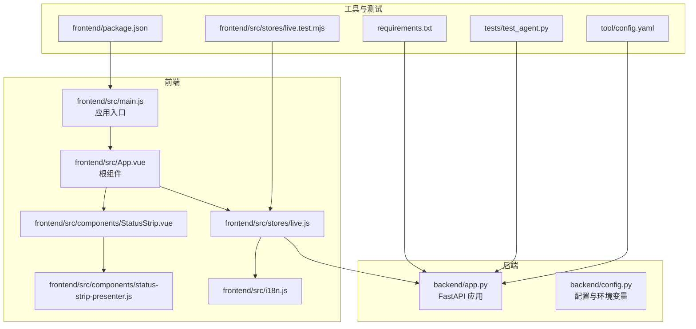
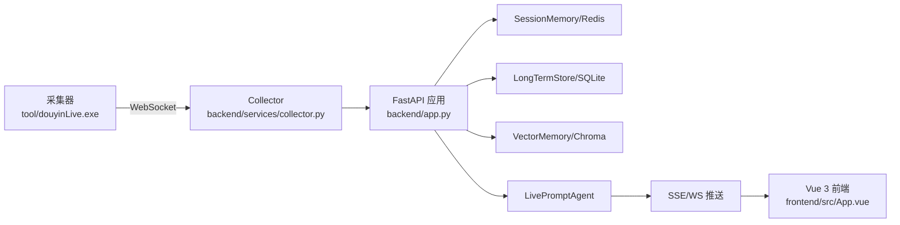
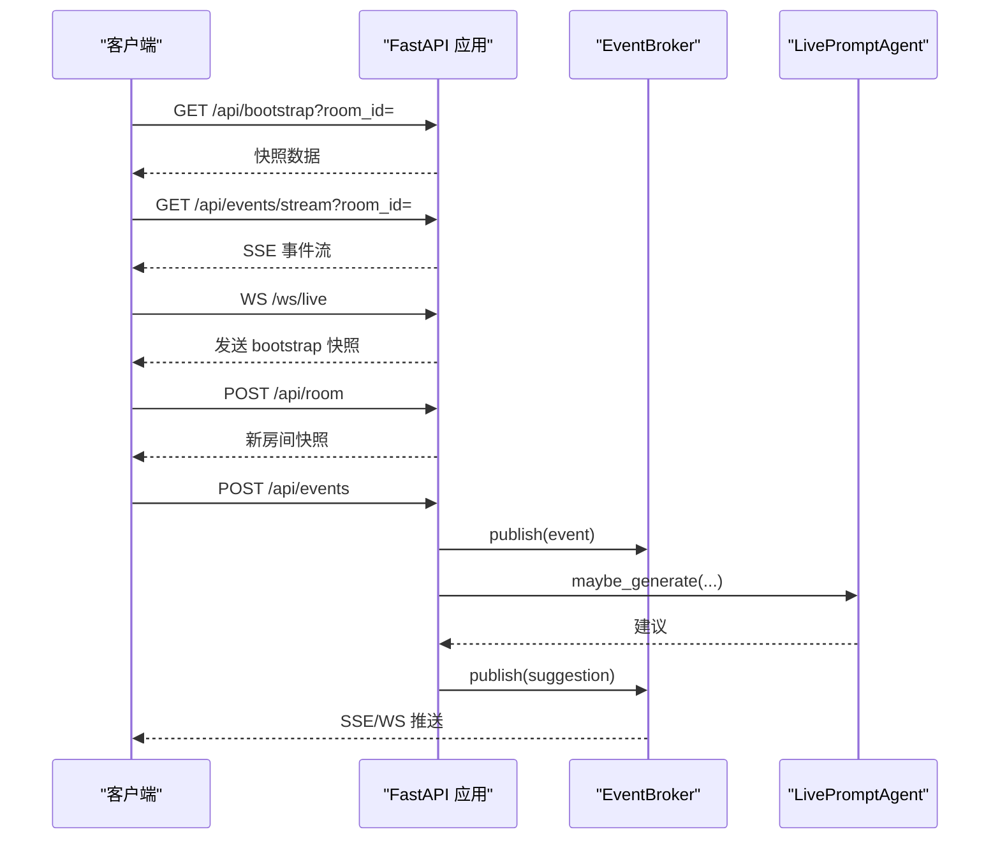
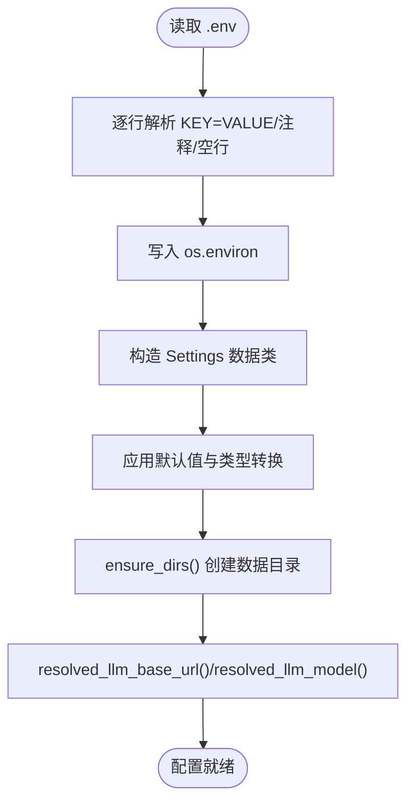
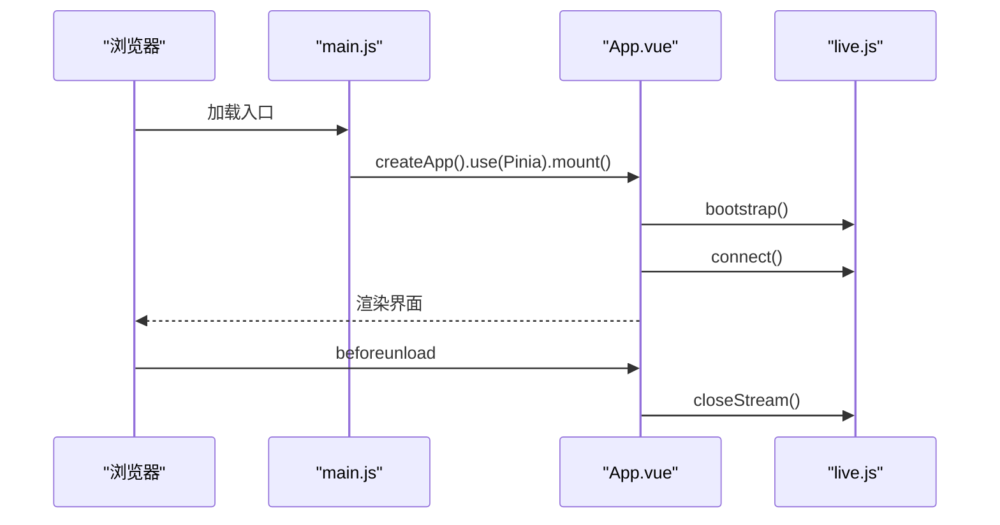
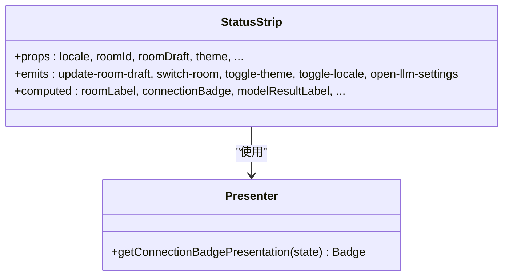
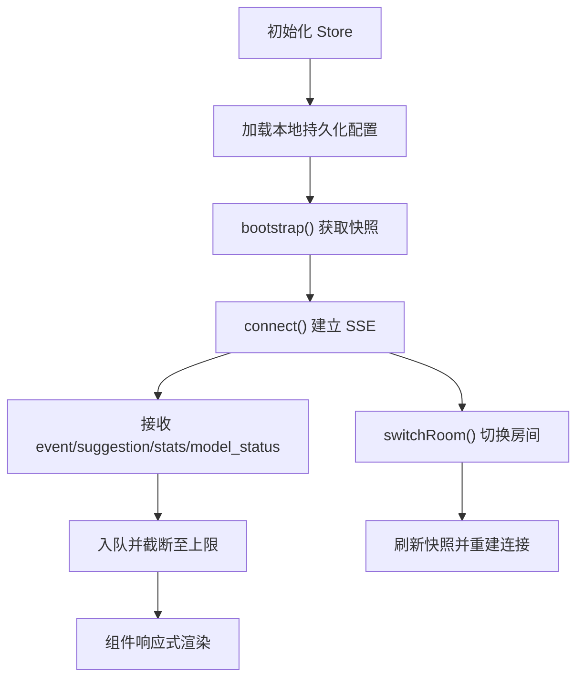
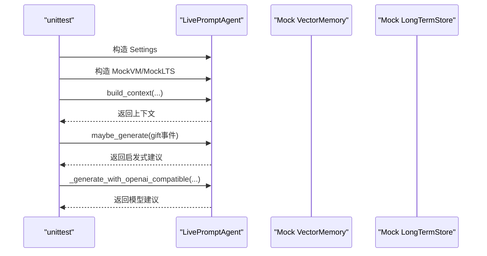
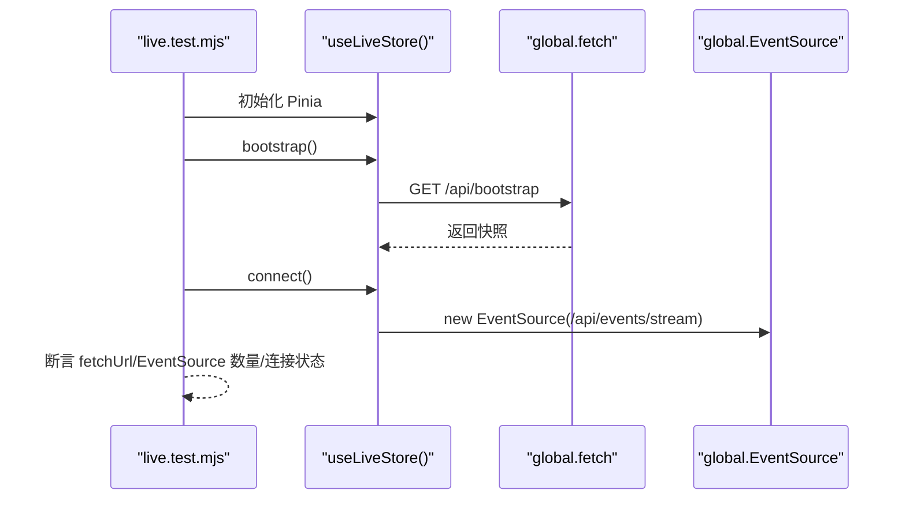
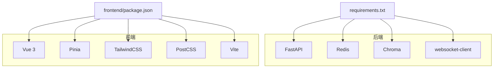

# 代码质量保证

<cite>
**本文引用的文件**
- [README.md](file://README.md)
- [requirements.txt](file://requirements.txt)
- [package.json](file://frontend/package.json)
- [backend/app.py](file://backend/app.py)
- [backend/config.py](file://backend/config.py)
- [tests/test_agent.py](file://tests/test_agent.py)
- [frontend/src/main.js](file://frontend/src/main.js)
- [frontend/src/App.vue](file://frontend/src/App.vue)
- [frontend/src/components/StatusStrip.vue](file://frontend/src/components/StatusStrip.vue)
- [frontend/src/components/status-strip-presenter.js](file://frontend/src/components/status-strip-presenter.js)
- [frontend/src/stores/live.js](file://frontend/src/stores/live.js)
- [frontend/src/stores/live.test.mjs](file://frontend/src/stores/live.test.mjs)
- [frontend/src/i18n.js](file://frontend/src/i18n.js)
- [tool/config.yaml](file://tool/config.yaml)
</cite>

## 目录
1. [简介](#简介)
2. [项目结构](#项目结构)
3. [核心组件](#核心组件)
4. [架构总览](#架构总览)
5. [详细组件分析](#详细组件分析)
6. [依赖分析](#依赖分析)
7. [性能考量](#性能考量)
8. [故障排查指南](#故障排查指南)
9. [结论](#结论)
10. [附录](#附录)

## 简介
本指南面向 DouYin_llm 项目的代码质量保证，围绕以下目标展开：
- 代码规范：Python PEP8、JavaScript ES6+、Vue 组件开发规范
- 测试策略：单元测试、集成测试、端到端测试
- 静态代码分析：lint 工具配置、复杂度分析、安全扫描
- 持续集成：自动化测试、代码审查、部署流水线
- 文档标准：API 文档、架构文档、技术文档
- 重构与遗留代码处理：最佳实践与迁移策略

## 项目结构
项目采用前后端分离架构，后端基于 FastAPI，前端基于 Vue 3 + Pinia，工具链使用 Vite。测试覆盖后端 Python 单元测试与前端 Node 测试。

**图表来源**
- [backend/app.py:1-285](file://backend/app.py#L1-L285)
- [backend/config.py:1-113](file://backend/config.py#L1-L113)
- [frontend/src/main.js:1-17](file://frontend/src/main.js#L1-L17)
- [frontend/src/App.vue:1-139](file://frontend/src/App.vue#L1-L139)
- [frontend/src/components/StatusStrip.vue:1-316](file://frontend/src/components/StatusStrip.vue#L1-L316)
- [frontend/src/components/status-strip-presenter.js:1-35](file://frontend/src/components/status-strip-presenter.js#L1-L35)
- [frontend/src/stores/live.js:1-846](file://frontend/src/stores/live.js#L1-L846)
- [frontend/src/i18n.js:1-316](file://frontend/src/i18n.js#L1-L316)
- [frontend/package.json:1-23](file://frontend/package.json#L1-L23)
- [requirements.txt:1-6](file://requirements.txt#L1-L6)
- [tests/test_agent.py:1-176](file://tests/test_agent.py#L1-L176)
- [frontend/src/stores/live.test.mjs:1-68](file://frontend/src/stores/live.test.mjs#L1-L68)
- [tool/config.yaml](file://tool/config.yaml)

**章节来源**
- [README.md:1-223](file://README.md#L1-L223)
- [backend/app.py:1-285](file://backend/app.py#L1-L285)
- [backend/config.py:1-113](file://backend/config.py#L1-L113)
- [frontend/src/main.js:1-17](file://frontend/src/main.js#L1-L17)
- [frontend/src/App.vue:1-139](file://frontend/src/App.vue#L1-L139)
- [frontend/src/components/StatusStrip.vue:1-316](file://frontend/src/components/StatusStrip.vue#L1-L316)
- [frontend/src/components/status-strip-presenter.js:1-35](file://frontend/src/components/status-strip-presenter.js#L1-L35)
- [frontend/src/stores/live.js:1-846](file://frontend/src/stores/live.js#L1-L846)
- [frontend/src/i18n.js:1-316](file://frontend/src/i18n.js#L1-L316)
- [frontend/package.json:1-23](file://frontend/package.json#L1-L23)
- [requirements.txt:1-6](file://requirements.txt#L1-L6)
- [tests/test_agent.py:1-176](file://tests/test_agent.py#L1-L176)
- [frontend/src/stores/live.test.mjs:1-68](file://frontend/src/stores/live.test.mjs#L1-L68)
- [tool/config.yaml](file://tool/config.yaml)

## 核心组件
- 后端应用与路由：提供健康检查、事件流、WebSocket、LLM 设置、观众数据等接口。
- 配置模块：集中管理环境变量与默认值，确保本地可运行。
- 前端应用入口与根组件：注册 Pinia，挂载全局样式，组织各功能面板。
- 状态管理 Store：统一管理房间、事件、建议、模型状态、主题与本地化。
- 组件与 Presenter：状态条组件及其呈现逻辑，负责连接状态与模型状态的可视化。
- 国际化模块：提供中英文文案与错误信息翻译。
- 测试：后端使用 unittest，前端使用 Node 测试框架对 Store 行为进行验证。

**章节来源**
- [backend/app.py:129-285](file://backend/app.py#L129-L285)
- [backend/config.py:40-113](file://backend/config.py#L40-L113)
- [frontend/src/main.js:1-17](file://frontend/src/main.js#L1-L17)
- [frontend/src/App.vue:1-139](file://frontend/src/App.vue#L1-L139)
- [frontend/src/stores/live.js:75-846](file://frontend/src/stores/live.js#L75-L846)
- [frontend/src/components/StatusStrip.vue:1-316](file://frontend/src/components/StatusStrip.vue#L1-L316)
- [frontend/src/components/status-strip-presenter.js:1-35](file://frontend/src/components/status-strip-presenter.js#L1-L35)
- [frontend/src/i18n.js:1-316](file://frontend/src/i18n.js#L1-L316)
- [tests/test_agent.py:1-176](file://tests/test_agent.py#L1-L176)
- [frontend/src/stores/live.test.mjs:1-68](file://frontend/src/stores/live.test.mjs#L1-L68)

## 架构总览
后端通过 FastAPI 提供 REST/SSE/WebSocket 接口，前端通过 Pinia 管理状态并通过 SSE 订阅事件流。采集器与后端协同，形成“采集 → 事件归一化 → 记忆持久化 → 提词生成 → 实时推送 → 前端展示”的闭环。

**图表来源**
- [README.md:7-17](file://README.md#L7-L17)
- [backend/app.py:1-285](file://backend/app.py#L1-L285)

## 详细组件分析

### 后端应用与路由（FastAPI）
- 职责：生命周期管理、中间件、路由定义、事件处理与发布。
- 关键点：CORS 允许所有来源；健康检查、Bootstrap、房间切换、事件注入、观众数据、LLM 设置、SSE/WS 实时流。
- 错误处理：HTTP 异常与 4xx/5xx 返回；SSE/WS 连接断开处理。

**图表来源**
- [backend/app.py:129-285](file://backend/app.py#L129-L285)

**章节来源**
- [backend/app.py:108-285](file://backend/app.py#L108-L285)

### 配置模块（Settings）
- 职责：从环境变量与 .env 加载配置，提供默认值与路径确保本地可运行。
- 关键点：环境变量优先级、默认值、目录创建、LLM 服务地址与模型解析、嵌入签名。

**图表来源**
- [backend/config.py:12-113](file://backend/config.py#L12-L113)

**章节来源**
- [backend/config.py:12-113](file://backend/config.py#L12-L113)

### 前端应用入口与根组件
- 应用入口：创建 Vue 应用、注册 Pinia、挂载根组件。
- 根组件：组织状态条、提词器、事件流、观众工作台、LLM 设置面板，处理卸载时清理资源。

**图表来源**
- [frontend/src/main.js:1-17](file://frontend/src/main.js#L1-L17)
- [frontend/src/App.vue:47-64](file://frontend/src/App.vue#L47-L64)
- [frontend/src/stores/live.js:440-523](file://frontend/src/stores/live.js#L440-L523)

**章节来源**
- [frontend/src/main.js:1-17](file://frontend/src/main.js#L1-L17)
- [frontend/src/App.vue:1-139](file://frontend/src/App.vue#L1-L139)
- [frontend/src/stores/live.js:440-523](file://frontend/src/stores/live.js#L440-L523)

### 状态条组件与 Presenter
- 状态条组件：展示房间号、连接状态、统计、模型状态、主题与语言切换。
- Presenter：根据连接状态映射视觉徽章与标签。

**图表来源**
- [frontend/src/components/StatusStrip.vue:1-316](file://frontend/src/components/StatusStrip.vue#L1-L316)
- [frontend/src/components/status-strip-presenter.js:1-35](file://frontend/src/components/status-strip-presenter.js#L1-L35)

**章节来源**
- [frontend/src/components/StatusStrip.vue:1-316](file://frontend/src/components/StatusStrip.vue#L1-L316)
- [frontend/src/components/status-strip-presenter.js:1-35](file://frontend/src/components/status-strip-presenter.js#L1-L35)

### 国际化模块
- 职责：提供中英文文案与错误信息，支持参数化替换。
- 使用：组件与 Store 通过 translate/translateError 获取本地化文本。

**章节来源**
- [frontend/src/i18n.js:1-316](file://frontend/src/i18n.js#L1-L316)

### 前端 Store（Pinia）
- 职责：管理房间、事件、建议、模型状态、主题与本地化；处理 SSE 连接、房间切换、观众工作台、LLM 设置。
- 关键点：本地存储持久化、请求去重、错误处理、最大缓存长度控制。

**图表来源**
- [frontend/src/stores/live.js:75-846](file://frontend/src/stores/live.js#L75-L846)

**章节来源**
- [frontend/src/stores/live.js:1-846](file://frontend/src/stores/live.js#L1-L846)

### 测试策略

#### 后端单元测试（Python）
- 覆盖范围：Agent 上下文构建、LLM 生成参数、启发式规则触发等。
- 测试方法：mock 外部依赖，断言行为与参数传递。

**图表来源**
- [tests/test_agent.py:41-176](file://tests/test_agent.py#L41-L176)

**章节来源**
- [tests/test_agent.py:1-176](file://tests/test_agent.py#L1-L176)

#### 前端单元测试（Node）
- 覆盖范围：Store 初始化、bootstrap/connect 行为、fetch/EventSource 替换验证。
- 测试方法：通过全局替换模拟网络与事件源。

**图表来源**
- [frontend/src/stores/live.test.mjs:1-68](file://frontend/src/stores/live.test.mjs#L1-L68)

**章节来源**
- [frontend/src/stores/live.test.mjs:1-68](file://frontend/src/stores/live.test.mjs#L1-L68)

## 依赖分析
- 后端依赖：FastAPI、Uvicorn、Redis、Chroma、websocket-client。
- 前端依赖：Vue 3、Pinia、TailwindCSS、PostCSS、Vite。
- 工具：采集器可执行文件与配置。

**图表来源**
- [requirements.txt:1-6](file://requirements.txt#L1-L6)
- [frontend/package.json:1-23](file://frontend/package.json#L1-L23)

**章节来源**
- [requirements.txt:1-6](file://requirements.txt#L1-L6)
- [frontend/package.json:1-23](file://frontend/package.json#L1-L23)

## 性能考量
- 后端
  - SSE/WS 连接：避免阻塞主线程，及时断开订阅与清理资源。
  - 事件与建议缓存：限制最大长度，减少前端渲染压力。
  - LLM 调用：设置合理超时与 token 上限，必要时降级为启发式规则。
- 前端
  - 响应式计算：使用 computed 缓存派生状态，避免重复计算。
  - 本地存储：主题与过滤器持久化，减少每次初始化成本。
  - 请求去重：观众工作台请求携带 requestId，防止竞态。

[本节为通用指导，无需具体文件来源]

## 故障排查指南
- 后端
  - 健康检查：访问 /health 确认房间与会话状态。
  - CORS：确认允许来源与方法，避免跨域问题。
  - 事件流：检查 EventBroker 订阅与发布是否正常。
- 前端
  - 连接状态：StatusStrip 徽章与 Presenter 映射是否正确。
  - Store 行为：通过测试用例验证 bootstrap/connect/switchRoom。
  - 国际化：错误信息是否正确翻译与回退。

**章节来源**
- [backend/app.py:129-136](file://backend/app.py#L129-L136)
- [frontend/src/components/StatusStrip.vue:68-88](file://frontend/src/components/StatusStrip.vue#L68-L88)
- [frontend/src/components/status-strip-presenter.js:29-34](file://frontend/src/components/status-strip-presenter.js#L29-L34)
- [frontend/src/stores/live.js:474-523](file://frontend/src/stores/live.js#L474-L523)

## 结论
本指南提供了针对 DouYin_llm 项目的代码质量保证方案，涵盖规范、测试、静态分析、CI/CD、文档与重构实践。建议在团队内推广统一的编码风格与测试覆盖率目标，逐步引入自动化 lint 与安全扫描，并完善 CI 流水线以提升交付质量与效率。

[本节为总结性内容，无需具体文件来源]

## 附录

### 代码规范与最佳实践

- Python（PEP8）
  - 命名：模块与函数使用 snake_case，类使用 PascalCase，常量使用 UPPER_CASE。
  - 导入：标准库、第三方库、项目内模块分组，每组一行。
  - 缩进：4 空格，行宽不超过 100。
  - 注释：函数与复杂逻辑添加 docstring，解释意图而非实现细节。
  - 异常：明确抛出 HTTPException，提供清晰 detail。
  - 示例参考：后端路由与配置模块的命名与结构。

- JavaScript（ES6+）
  - 模块：使用 ES 模块语法，导出明确的函数与对象。
  - 命名：函数与变量使用 camelCase，常量使用 UPPER_CASE。
  - 异步：统一使用 async/await，错误通过 try/catch 或 Promise.catch 处理。
  - 严格模式：在模块顶部启用严格模式。
  - 示例参考：Store 中的异步方法与事件处理。

- Vue 组件开发规范
  - 组合式 API：使用 script setup，明确 props 与 emits。
  - 响应式：优先使用 ref/computed，避免直接修改响应式对象。
  - 事件：通过 emits 向父组件传递事件，避免直接修改父组件状态。
  - 样式：使用 TailwindCSS 类，保持主题一致性。
  - 示例参考：StatusStrip 组件的 props、emits 与模板结构。

**章节来源**
- [backend/app.py:1-285](file://backend/app.py#L1-L285)
- [backend/config.py:1-113](file://backend/config.py#L1-L113)
- [frontend/src/stores/live.js:1-846](file://frontend/src/stores/live.js#L1-L846)
- [frontend/src/components/StatusStrip.vue:1-316](file://frontend/src/components/StatusStrip.vue#L1-L316)
- [frontend/src/i18n.js:1-316](file://frontend/src/i18n.js#L1-L316)

### 测试策略与维护
- 单元测试
  - 后端：使用 unittest，mock 外部依赖，断言关键行为与参数。
  - 前端：使用 Node 测试框架，替换 fetch/EventSource，验证 Store 行为。
- 集成测试
  - 后端：通过 /api/bootstrap、/api/events/stream、/ws/live 验证端到端数据流。
  - 前端：通过真实浏览器环境验证组件交互与状态同步。
- 端到端测试
  - 自动化脚本：启动采集器、后端与前端，执行关键用户路径（切换房间、查看事件、保存备注）。

**章节来源**
- [tests/test_agent.py:1-176](file://tests/test_agent.py#L1-L176)
- [frontend/src/stores/live.test.mjs:1-68](file://frontend/src/stores/live.test.mjs#L1-L68)
- [backend/app.py:129-285](file://backend/app.py#L129-L285)
- [frontend/src/stores/live.js:440-523](file://frontend/src/stores/live.js#L440-L523)

### 静态代码分析与安全扫描
- Python
  - Lint：使用 flake8 或 ruff，配置忽略项与规则集。
  - 复杂度：限制函数与类的圈复杂度，定期重构高复杂度模块。
  - 安全：依赖扫描（pip-audit），敏感信息不硬编码于代码。
- JavaScript/Vue
  - Lint：ESLint + Prettier，规则与 Vue 插件配置。
  - 复杂度：限制函数长度与嵌套层级，拆分大型组件。
  - 安全：依赖扫描（npm audit），避免注入与 XSS。

[本节为通用指导，无需具体文件来源]

### 持续集成流程
- 触发：push/pr 触发流水线。
- 步骤：
  - 安装依赖：后端 pip 安装，前端 npm 安装。
  - Lint：Python 与 JS 分别执行静态检查。
  - 测试：后端 unittest，前端 Node 测试。
  - 构建：前端生产构建，后端打包（如需）。
  - 安全扫描：依赖与代码扫描报告。
  - 部署：部署到预生产或生产环境，保留回滚策略。
- 产物：测试报告、构建包、安全扫描报告。

[本节为通用指导，无需具体文件来源]

### 文档标准
- API 文档
  - 使用 OpenAPI/Swagger：在 FastAPI 中自动生成接口文档。
  - 接口说明：请求/响应字段、错误码、示例。
- 架构文档
  - 组件图与数据流图：展示后端路由、前端组件与外部依赖。
  - 部署图：采集器、后端、数据库与前端的部署关系。
- 技术文档
  - 配置说明：环境变量与默认值，路径与权限。
  - 开发指南：本地启动、调试技巧、常见问题。

**章节来源**
- [backend/app.py:129-285](file://backend/app.py#L129-L285)
- [README.md:143-204](file://README.md#L143-L204)

### 代码重构与遗留代码处理
- 重构原则
  - 小步快跑：每次改动聚焦单一问题，保持可回滚。
  - 测试先行：新增或修改逻辑前先补充测试。
  - 抽象重复：提取公共逻辑，减少重复代码。
- 遗留代码
  - 识别：高复杂度、长函数、紧耦合模块。
  - 策略：分层剥离、引入适配器、逐步替换。
  - 工具：静态分析与测试覆盖率辅助定位风险区域。

[本节为通用指导，无需具体文件来源]