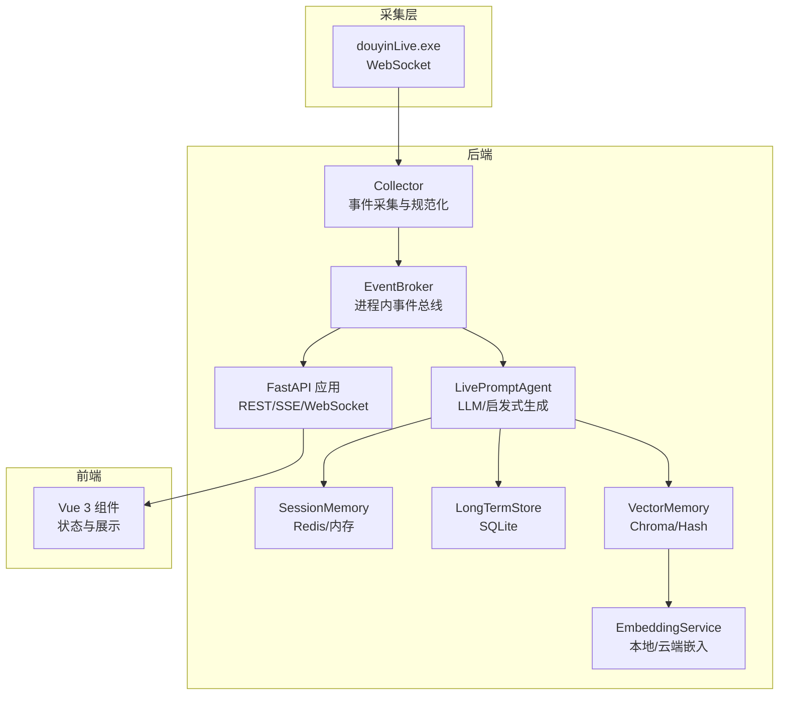
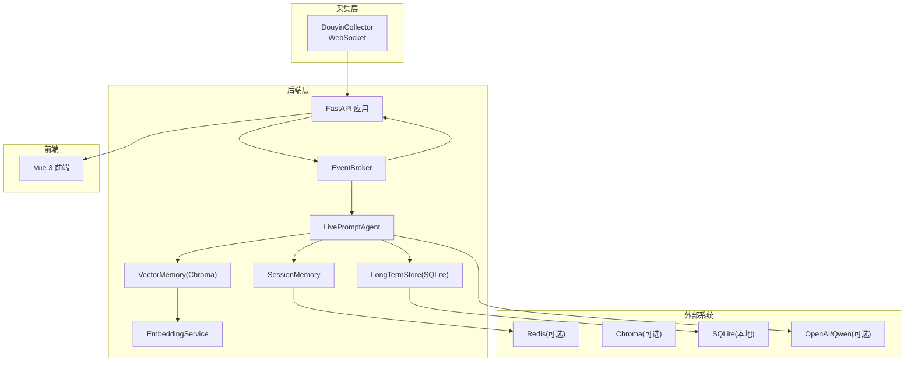
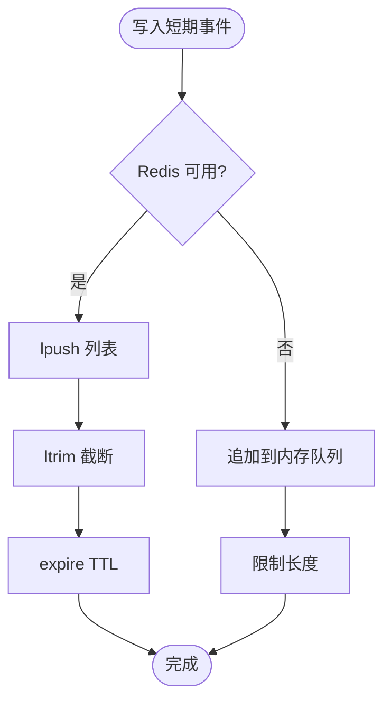
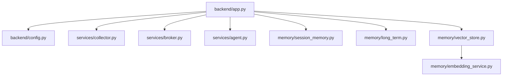

# 可扩展性设计

<cite>
**本文引用的文件**
- [README.md](file://README.md)
- [backend/app.py](file://backend/app.py)
- [backend/config.py](file://backend/config.py)
- [backend/services/collector.py](file://backend/services/collector.py)
- [backend/services/agent.py](file://backend/services/agent.py)
- [backend/services/broker.py](file://backend/services/broker.py)
- [backend/memory/session_memory.py](file://backend/memory/session_memory.py)
- [backend/memory/long_term.py](file://backend/memory/long_term.py)
- [backend/memory/vector_store.py](file://backend/memory/vector_store.py)
- [backend/memory/embedding_service.py](file://backend/memory/embedding_service.py)
- [backend/schemas/live.py](file://backend/schemas/live.py)
- [data/DATABASE.md](file://data/DATABASE.md)
- [requirements.txt](file://requirements.txt)
- [start_all.ps1](file://start_all.ps1)
- [start_backend_qwen.ps1](file://start_backend_qwen.ps1)
</cite>

## 目录
1. [简介](#简介)
2. [项目结构](#项目结构)
3. [核心组件](#核心组件)
4. [架构总览](#架构总览)
5. [详细组件分析](#详细组件分析)
6. [依赖关系分析](#依赖关系分析)
7. [性能考量](#性能考量)
8. [故障排查指南](#故障排查指南)
9. [结论](#结论)
10. [附录](#附录)

## 简介
本指南围绕 DouYin_llm 项目的可扩展性设计展开，结合现有代码结构与运行机制，提供横向扩展（多实例、负载均衡、会话状态同步）、纵向扩展（资源分配、并发与内存管理）、微服务拆分（服务边界、API 网关、分布式追踪）、数据库扩展（读写分离、分库分表、缓存层）、消息队列集成（异步事件、背压与故障恢复）、以及容器化与编排（Docker、Kubernetes、服务发现）的实践建议。目标是在不破坏现有实时性与一致性前提下，支撑更高吞吐与可用性。

## 项目结构
项目采用三层架构：采集层（tool/douyinLive.exe）、后端（FastAPI）、前端（Vue 3）。后端内部进一步划分为服务层（采集、代理、内存提取）、内存层（短期会话、长期存储、向量记忆）、以及共享数据模型。整体数据流从采集器进入事件规范化，经由内存层与向量检索，触发提示生成并通过 SSE/WebSocket 推送至前端。



图表来源
- [backend/app.py:108-126](file://backend/app.py#L108-L126)
- [backend/services/collector.py:38-60](file://backend/services/collector.py#L38-L60)
- [backend/services/broker.py:10-21](file://backend/services/broker.py#L10-L21)
- [backend/services/agent.py:23-46](file://backend/services/agent.py#L23-L46)
- [backend/memory/session_memory.py:17-31](file://backend/memory/session_memory.py#L17-L31)
- [backend/memory/long_term.py:44-47](file://backend/memory/long_term.py#L44-L47)
- [backend/memory/vector_store.py:59-84](file://backend/memory/vector_store.py#L59-L84)
- [backend/memory/embedding_service.py:18-27](file://backend/memory/embedding_service.py#L18-L27)

章节来源
- [README.md:32-44](file://README.md#L32-L44)
- [backend/app.py:108-126](file://backend/app.py#L108-L126)

## 核心组件
- 采集器（DouyinCollector）：负责与本地采集器建立 WebSocket 连接，标准化消息为 LiveEvent，并通过事件循环回调交由后端处理。
- 事件总线（EventBroker）：在进程内广播事件与建议，SSE/WebSocket 订阅者通过队列消费。
- 代理（LivePromptAgent）：根据事件类型与上下文选择 LLM 或启发式规则生成建议，同时上报模型状态。
- 内存层：
  - SessionMemory：短期会话事件与建议，支持 Redis 或内存退化。
  - LongTermStore：SQLite 长期存储，维护事件、建议、观众画像、礼物、会话、备注、记忆与应用设置。
  - VectorMemory：Chroma 向量索引与 Hash 回退，支持事件与观众记忆的相似检索。
  - EmbeddingService：本地 SentenceTransformer 或云端 OpenAI 兼容嵌入。
- FastAPI 应用：提供健康检查、房间切换、事件注入、观众详情与笔记、LLM 设置、SSE 与 WebSocket 实时流等接口。

章节来源
- [backend/services/collector.py:38-60](file://backend/services/collector.py#L38-L60)
- [backend/services/broker.py:10-21](file://backend/services/broker.py#L10-L21)
- [backend/services/agent.py:23-46](file://backend/services/agent.py#L23-L46)
- [backend/memory/session_memory.py:17-31](file://backend/memory/session_memory.py#L17-L31)
- [backend/memory/long_term.py:44-47](file://backend/memory/long_term.py#L44-L47)
- [backend/memory/vector_store.py:59-84](file://backend/memory/vector_store.py#L59-L84)
- [backend/memory/embedding_service.py:18-27](file://backend/memory/embedding_service.py#L18-L27)
- [backend/app.py:129-285](file://backend/app.py#L129-L285)

## 架构总览
下图展示了从采集到前端的完整链路，以及可扩展点（多实例、外部状态、消息中间件、数据库扩展）：



图表来源
- [backend/app.py:108-126](file://backend/app.py#L108-L126)
- [backend/services/collector.py:38-60](file://backend/services/collector.py#L38-L60)
- [backend/services/broker.py:10-21](file://backend/services/broker.py#L10-L21)
- [backend/services/agent.py:23-46](file://backend/services/agent.py#L23-L46)
- [backend/memory/session_memory.py:17-31](file://backend/memory/session_memory.py#L17-L31)
- [backend/memory/long_term.py:44-47](file://backend/memory/long_term.py#L44-L47)
- [backend/memory/vector_store.py:59-84](file://backend/memory/vector_store.py#L59-L84)
- [backend/memory/embedding_service.py:18-27](file://backend/memory/embedding_service.py#L18-L27)

## 详细组件分析

### 采集与事件总线
- 采集器在独立线程中维护 WebSocket 连接，断线重连与心跳控制由配置项驱动；消息解析失败或非 JSON 将被忽略并记录日志。
- 事件总线采用 asyncio.Queue 管理订阅者集合，发布时对阻塞队列进行清理，避免陈旧订阅影响吞吐。

```mermaid
sequenceDiagram
participant Tool as "采集器(douyinLive)"
participant Col as "DouyinCollector"
participant Loop as "事件循环"
participant Proc as "process_event"
participant Br as "EventBroker"
Tool->>Col : "WebSocket 消息"
Col->>Col : "解析/校验"
Col->>Loop : "run_coroutine_threadsafe(process_event)"
Loop->>Proc : "处理事件"
Proc->>Br : "publish(event/suggestion/stats)"
```

图表来源
- [backend/services/collector.py:118-140](file://backend/services/collector.py#L118-L140)
- [backend/services/collector.py:182-196](file://backend/services/collector.py#L182-L196)
- [backend/app.py:73-102](file://backend/app.py#L73-L102)
- [backend/services/broker.py:28-39](file://backend/services/broker.py#L28-L39)

章节来源
- [backend/services/collector.py:38-60](file://backend/services/collector.py#L38-L60)
- [backend/services/broker.py:10-21](file://backend/services/broker.py#L10-L21)
- [backend/app.py:73-102](file://backend/app.py#L73-L102)

### 会话内存与状态同步
- SessionMemory 支持 Redis 与内存两种模式，Redis 模式下使用列表与过期控制热数据生命周期；内存模式使用双端队列限制容量。
- 多实例部署时，应将 Redis 作为共享会话存储，确保跨进程事件与建议的一致性；否则各实例的短期会话相互隔离。



图表来源
- [backend/memory/session_memory.py:42-64](file://backend/memory/session_memory.py#L42-L64)
- [backend/config.py:55-56](file://backend/config.py#L55-L56)

章节来源
- [backend/memory/session_memory.py:17-31](file://backend/memory/session_memory.py#L17-L31)
- [backend/config.py:55-56](file://backend/config.py#L55-L56)

### 长期存储与数据库扩展
- LongTermStore 使用 SQLite，包含事件、建议、观众画像、礼物、会话、备注、记忆与应用设置等表；已创建多处索引以优化查询。
- 数据库扩展建议：
  - 读写分离：将高频只读查询（如观众画像、礼物聚合、会话统计）路由到只读副本；写入集中在主库。
  - 分库分表：按房间维度（room_id）分片，或按时间（会话起始时间）分表；事件与建议表可按会话主键分片。
  - 缓存层：对热点表（如 viewer_profiles、live_sessions）增加 Redis 缓存，结合失效策略与写穿透防护。
  - 归档与冷数据：对历史事件与建议进行周期性归档至对象存储，降低在线库压力。

章节来源
- [backend/memory/long_term.py:63-187](file://backend/memory/long_term.py#L63-L187)
- [data/DATABASE.md:16-151](file://data/DATABASE.md#L16-L151)

### 向量检索与嵌入服务
- VectorMemory 支持 Chroma 与 Hash 回退；EmbeddingService 支持本地 SentenceTransformer 与云端 OpenAI 兼容接口。
- 扩展建议：
  - 向量化服务化：将嵌入服务拆分为独立服务，支持弹性扩缩容与多模型并行。
  - 多模态与领域自定义：引入领域语料训练本地嵌入模型，提升直播场景召回质量。
  - 检索增强：结合相似度阈值、重排因子（置信度、召回次数、更新时间）与关键词包含度，提高相关性。

章节来源
- [backend/memory/vector_store.py:59-84](file://backend/memory/vector_store.py#L59-L84)
- [backend/memory/embedding_service.py:18-27](file://backend/memory/embedding_service.py#L18-L27)

### 提示生成与并发处理
- LivePromptAgent 在线程池外处理 LLM 请求，失败时回退启发式规则；模型状态通过状态对象上报。
- 并发与资源优化：
  - 限流与熔断：对 LLM 与嵌入接口设置超时与最大并发，避免雪崩。
  - 异步化：将 IO 密集环节（网络请求、磁盘写入）异步化，减少阻塞。
  - 内存管理：控制批大小与向量缓存上限，避免峰值内存过高。

章节来源
- [backend/services/agent.py:200-217](file://backend/services/agent.py#L200-L217)
- [backend/services/agent.py:302-437](file://backend/services/agent.py#L302-L437)

### 实时推送与前端交互
- SSE 与 WebSocket 通过统一事件总线推送事件、建议、统计与模型状态；前端通过 Pinia Store 管理状态。
- 扩展建议：
  - 多房间订阅：在订阅端按房间过滤，避免跨房间数据泄露。
  - 心跳与断线重连：WebSocket 侧增加心跳与指数退避重连策略。

章节来源
- [backend/app.py:252-285](file://backend/app.py#L252-L285)

## 依赖关系分析
后端依赖关系主要体现在组件耦合与外部系统集成上。当前实现以进程内组件为主，Redis、Chroma、SQLite 为可选外部依赖。



图表来源
- [backend/app.py:13-22](file://backend/app.py#L13-L22)
- [backend/config.py:40-113](file://backend/config.py#L40-L113)
- [backend/services/collector.py:16-17](file://backend/services/collector.py#L16-L17)
- [backend/services/broker.py:10-14](file://backend/services/broker.py#L10-L14)
- [backend/services/agent.py:23-27](file://backend/services/agent.py#L23-L27)
- [backend/memory/session_memory.py:17-27](file://backend/memory/session_memory.py#L17-L27)
- [backend/memory/long_term.py:44-47](file://backend/memory/long_term.py#L44-L47)
- [backend/memory/vector_store.py:59-67](file://backend/memory/vector_store.py#L59-L67)
- [backend/memory/embedding_service.py:18-21](file://backend/memory/embedding_service.py#L18-L21)

章节来源
- [requirements.txt:1-6](file://requirements.txt#L1-L6)

## 性能考量
- I/O 与 CPU 分配：采集与事件处理为 IO 密集，建议将 CPU 核数与网络带宽适度匹配；LLM 与嵌入为 CPU 密集，需预留足够计算资源。
- 内存与缓存：短期事件与建议使用固定容量队列；向量索引与嵌入缓存需设定上限，避免 OOM。
- 并发模型：利用 FastAPI 的异步特性与事件循环，避免阻塞；对外部服务调用使用超时与重试。
- 存储性能：SQLite 在高并发写入时存在竞争，建议采用 WAL/FTS 等优化；索引覆盖常见查询条件。

## 故障排查指南
- 采集器异常：检查 ROOM_ID、采集器地址与鉴权；查看 WebSocket 错误日志与重连延迟配置。
- 事件丢失：确认事件循环回调是否成功提交；检查 EventBroker 队列是否满导致丢弃。
- LLM 失败：检查模型地址、API Key、超时与网络；观察模型状态上报与错误码。
- 向量检索异常：确认 Chroma 客户端可用性与集合创建；回退到 Hash 嵌入验证检索逻辑。
- 数据库锁与慢查询：检查索引使用情况与事务时长；必要时拆分只读查询到副本。

章节来源
- [backend/services/collector.py:161-180](file://backend/services/collector.py#L161-L180)
- [backend/services/agent.py:334-393](file://backend/services/agent.py#L334-L393)
- [backend/memory/vector_store.py:70-84](file://backend/memory/vector_store.py#L70-L84)
- [backend/memory/long_term.py:216-229](file://backend/memory/long_term.py#L216-L229)

## 结论
DouYin_llm 当前以单进程 FastAPI 为核心，通过 Redis/Chroma/SQLite 实现会话、记忆与向量检索。要实现可扩展性，应在多实例部署、外部状态共享、数据库读写分离与分库分表、消息中间件异步化、容器化与编排等方面逐步演进，同时强化可观测性与弹性设计，确保在高并发与复杂业务场景下的稳定与高效。

## 附录

### 水平扩展策略
- 多实例部署：每个实例共享 Redis 与 Chroma/数据库，通过负载均衡器分发流量；实例间通过事件总线与 SSE/WebSocket 推送保持一致。
- 负载均衡：Nginx/HAProxy 健康检查与会话亲和；WebSocket 连接建议使用粘性会话或共享状态。
- 会话状态同步：强制使用 Redis 作为 SessionMemory 后端，避免进程内状态碎片化。

章节来源
- [backend/config.py:55-56](file://backend/config.py#L55-L56)
- [backend/memory/session_memory.py:17-31](file://backend/memory/session_memory.py#L17-L31)

### 垂直扩展方案
- 资源分配：CPU 密集型（LLM/嵌入）与 IO 密集型（采集/网络）分离；为不同组件设置资源限制与预留。
- 并发处理：FastAPI 异步化、事件循环回调、队列背压；对外部服务设置超时与最大并发。
- 内存管理：控制短期事件与建议队列长度、向量缓存大小；定期清理过期数据。

章节来源
- [backend/services/agent.py:302-437](file://backend/services/agent.py#L302-L437)
- [backend/memory/session_memory.py:42-64](file://backend/memory/session_memory.py#L42-L64)

### 微服务架构扩展
- 服务拆分：采集服务、事件处理服务、提示生成服务、向量检索服务、前端网关服务。
- API 网关：统一鉴权、限流、路由与监控；WebSocket 连接由网关转发至事件处理服务。
- 分布式追踪：引入 OpenTelemetry 或 Jaeger，标记关键链路（采集→规范化→持久化→检索→生成→推送）。

### 数据库扩展策略
- 读写分离：只读查询路由到只读副本；写入集中于主库。
- 分库分表：按房间维度或时间维度分片；事件与建议表按会话主键分片。
- 缓存层：热点表（viewer_profiles、live_sessions）加入 Redis 缓存，设置失效策略与写穿透防护。

章节来源
- [backend/memory/long_term.py:216-229](file://backend/memory/long_term.py#L216-L229)
- [data/DATABASE.md:101-151](file://data/DATABASE.md#L101-L151)

### 消息队列集成
- 异步事件：将事件处理放入消息队列（如 Kafka/RabbitMQ/Redis Streams），削峰填谷。
- 背压控制：队列长度与消费者并发动态调节；设置死信队列与重试上限。
- 故障恢复：幂等处理与去重；失败事件落库并人工干预。

### 容器化与编排
- Docker：后端、采集器、Redis、Chroma、SQLite 数据卷分别容器化；采集器二进制需单独打包。
- Kubernetes：Deployment/Service/ConfigMap/Secret；Pod 副本数与资源请求/限制；Ingress 暴露 SSE/WebSocket。
- 服务发现：Kubernetes Service DNS 或外部服务网格；WebSocket 连接建议使用粘性会话或共享状态。

章节来源
- [start_all.ps1:11-15](file://start_all.ps1#L11-L15)
- [start_backend_qwen.ps1:11-12](file://start_backend_qwen.ps1#L11-L12)