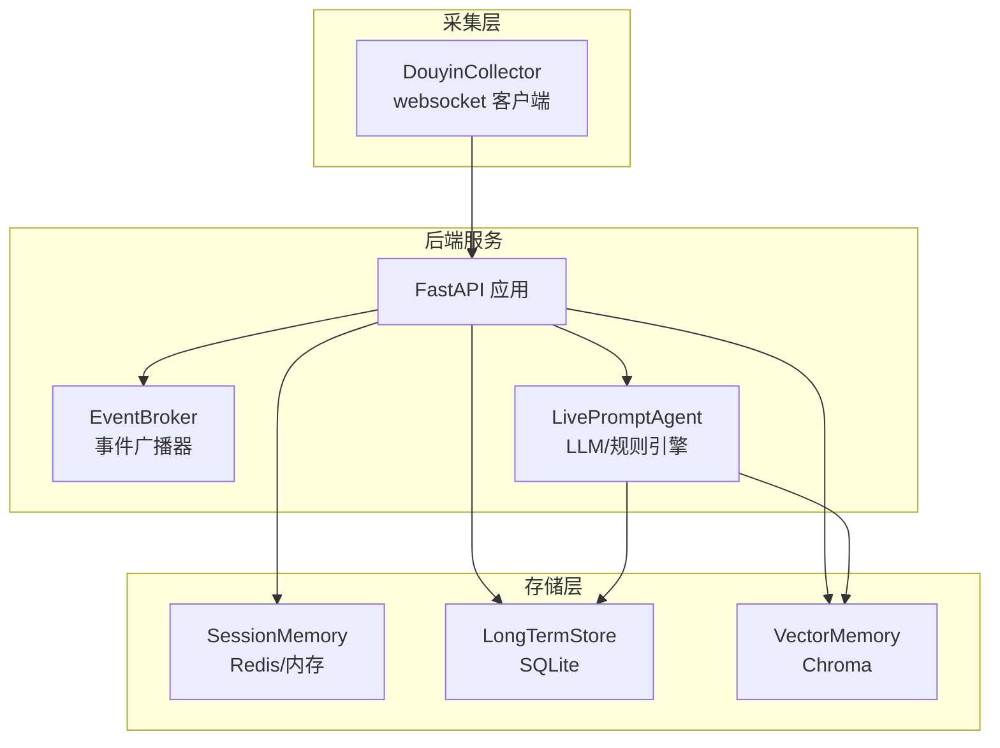
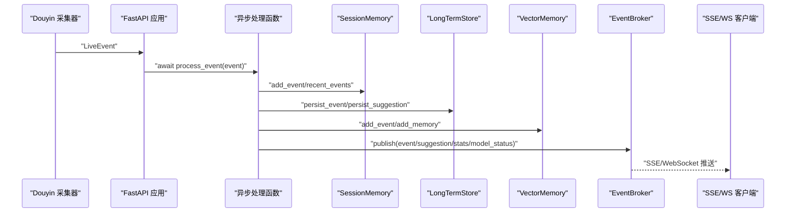
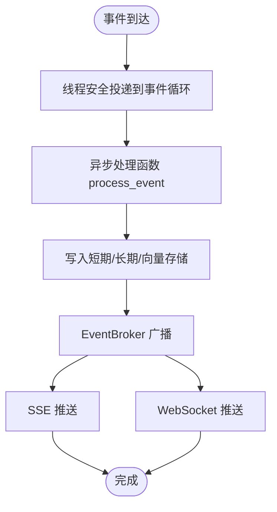
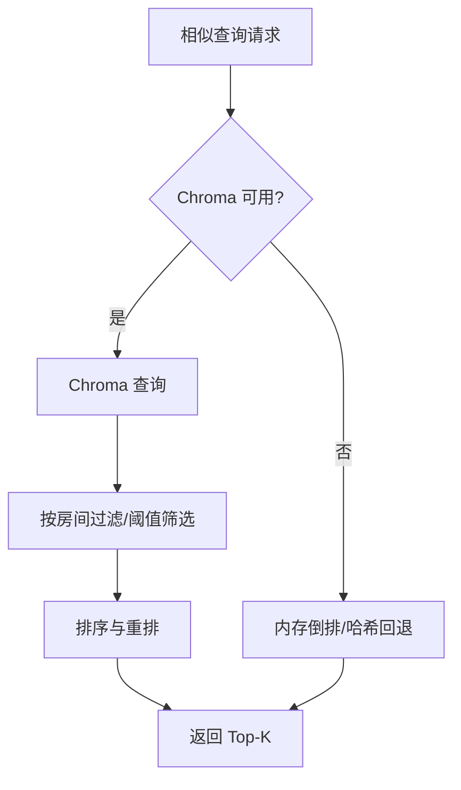
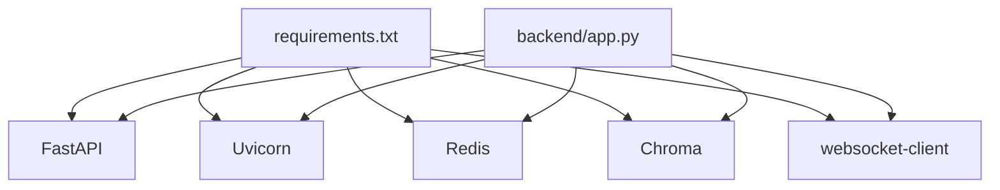

# 垂直扩展方案

<cite>
**本文引用的文件**
- [backend/app.py](file://backend/app.py)
- [backend/config.py](file://backend/config.py)
- [backend/memory/embedding_service.py](file://backend/memory/embedding_service.py)
- [backend/memory/vector_store.py](file://backend/memory/vector_store.py)
- [backend/memory/session_memory.py](file://backend/memory/session_memory.py)
- [backend/memory/long_term.py](file://backend/memory/long_term.py)
- [backend/services/agent.py](file://backend/services/agent.py)
- [backend/services/broker.py](file://backend/services/broker.py)
- [backend/services/collector.py](file://backend/services/collector.py)
- [backend/memory/rebuild_embeddings.py](file://backend/memory/rebuild_embeddings.py)
- [requirements.txt](file://requirements.txt)
- [README.md](file://README.md)
- [start_backend_qwen.ps1](file://start_backend_qwen.ps1)
</cite>

## 目录
1. [简介](#简介)
2. [项目结构](#项目结构)
3. [核心组件](#核心组件)
4. [架构概览](#架构概览)
5. [详细组件分析](#详细组件分析)
6. [依赖分析](#依赖分析)
7. [性能考量](#性能考量)
8. [故障排查指南](#故障排查指南)
9. [结论](#结论)
10. [附录](#附录)

## 简介
本方案围绕 DouYin_llm 项目的后端进行垂直扩展设计，聚焦单机性能优化与资源利用效率，覆盖 CPU 与内存资源分配、并发处理能力提升、I/O 性能优化，以及 FastAPI 异步处理、数据库连接池与向量数据库性能调优。同时提供不同负载场景下的资源配置建议、进程数与线程池设置、内存管理策略（会话内存限制、垃圾回收优化、缓存策略），并给出性能监控指标与瓶颈识别方法。

## 项目结构
后端采用 FastAPI 应用入口，结合采集器、事件处理流水线、短期/长期记忆与向量检索、LLM 提示生成与实时推送组件，形成完整的直播提词工作栈。

图表来源
- [backend/app.py:108-127](file://backend/app.py#L108-L127)
- [backend/services/collector.py:38-53](file://backend/services/collector.py#L38-L53)
- [backend/services/broker.py:10-21](file://backend/services/broker.py#L10-L21)
- [backend/services/agent.py:23-35](file://backend/services/agent.py#L23-L35)
- [backend/memory/session_memory.py:17-31](file://backend/memory/session_memory.py#L17-L31)
- [backend/memory/long_term.py:44-54](file://backend/memory/long_term.py#L44-L54)
- [backend/memory/vector_store.py:59-84](file://backend/memory/vector_store.py#L59-L84)

章节来源
- [README.md:5-17](file://README.md#L5-L17)
- [backend/app.py:108-127](file://backend/app.py#L108-L127)
- [backend/services/collector.py:38-53](file://backend/services/collector.py#L38-L53)
- [backend/services/broker.py:10-21](file://backend/services/broker.py#L10-L21)
- [backend/services/agent.py:23-35](file://backend/services/agent.py#L23-L35)
- [backend/memory/session_memory.py:17-31](file://backend/memory/session_memory.py#L17-L31)
- [backend/memory/long_term.py:44-54](file://backend/memory/long_term.py#L44-L54)
- [backend/memory/vector_store.py:59-84](file://backend/memory/vector_store.py#L59-L84)

## 核心组件
- FastAPI 应用与生命周期管理：负责路由注册、CORS 中间件、SSE/WebSocket 实时推送、健康检查与业务接口。
- 事件处理流水线：采集器将原始消息标准化为 LiveEvent，交由异步处理函数统一处理，写入短期/长期记忆与向量库，触发实时广播。
- 存储与检索：
  - SessionMemory：短期会话事件与建议，支持 Redis 或进程内内存退化。
  - LongTermStore：SQLite 持久化，含索引与聚合计算。
  - VectorMemory：Chroma 向量索引，支持本地/云端嵌入回退。
- LLM 提示生成：LivePromptAgent 在线兼容模型与启发式规则双通道，具备状态上报与错误降级。
- 事件广播：EventBroker 维护订阅队列，向 SSE/WebSocket 推送增量事件。

章节来源
- [backend/app.py:108-127](file://backend/app.py#L108-L127)
- [backend/services/collector.py:118-196](file://backend/services/collector.py#L118-L196)
- [backend/memory/session_memory.py:17-113](file://backend/memory/session_memory.py#L17-L113)
- [backend/memory/long_term.py:44-230](file://backend/memory/long_term.py#L44-L230)
- [backend/memory/vector_store.py:59-317](file://backend/memory/vector_store.py#L59-L317)
- [backend/services/agent.py:23-496](file://backend/services/agent.py#L23-L496)
- [backend/services/broker.py:10-40](file://backend/services/broker.py#L10-L40)

## 架构概览
后端整体采用事件驱动与异步处理模式，采集器在独立线程中接收 WebSocket 消息，通过线程安全的方式投递到 FastAPI 事件循环，随后进入统一的异步处理流程，最终通过 SSE/WebSocket 实时分发。

图表来源
- [backend/services/collector.py:182-196](file://backend/services/collector.py#L182-L196)
- [backend/app.py:73-102](file://backend/app.py#L73-L102)
- [backend/memory/session_memory.py:42-84](file://backend/memory/session_memory.py#L42-L84)
- [backend/memory/long_term.py:454-488](file://backend/memory/long_term.py#L454-L488)
- [backend/memory/vector_store.py:149-171](file://backend/memory/vector_store.py#L149-L171)
- [backend/services/broker.py:28-39](file://backend/services/broker.py#L28-L39)

## 详细组件分析

### FastAPI 异步处理与并发优化
- 生命周期与资源初始化：应用启动时创建采集器、短期/长期记忆、向量库、LLM 提示代理与内存提取器，并在 lifespan 中管理采集器启停。
- SSE/WebSocket 实时推送：使用 asyncio 队列作为广播通道，避免阻塞主线程；SSE 使用流式响应，WebSocket 直接推送 JSON。
- 并发模型：采集器在独立线程中运行，通过线程安全的协程调度器将事件投递到事件循环；事件处理函数为异步，内部调用多个同步/异步子系统，注意避免长时间阻塞。

图表来源
- [backend/services/collector.py:182-196](file://backend/services/collector.py#L182-L196)
- [backend/app.py:73-102](file://backend/app.py#L73-L102)
- [backend/services/broker.py:28-39](file://backend/services/broker.py#L28-L39)

章节来源
- [backend/app.py:108-127](file://backend/app.py#L108-L127)
- [backend/app.py:252-285](file://backend/app.py#L252-L285)
- [backend/services/collector.py:118-196](file://backend/services/collector.py#L118-L196)

### 数据库与连接池配置
- SQLite 长期存储：LongTermStore 使用自定义连接工厂与事务上下文，设置 journal_mode=TRUNCATE 以适配部分挂载盘写入特性；建立多处索引以优化查询。
- 连接池建议：SQLite 本身不适用传统意义上的连接池；建议通过连接复用与批量写入减少锁竞争；对高频查询添加合适索引，避免全表扫描。
- 写入优化：批量插入与 ON CONFLICT UPSERT 减少往返；事件写入时根据会话状态更新聚合表，避免重复重建。

章节来源
- [backend/memory/long_term.py:36-54](file://backend/memory/long_term.py#L36-L54)
- [backend/memory/long_term.py:216-229](file://backend/memory/long_term.py#L216-L229)
- [backend/memory/long_term.py:454-488](file://backend/memory/long_term.py#L454-L488)

### 向量数据库性能调优
- 向量检索参数：相似度阈值、查询上限、最终返回 K 值均可通过配置项调节；支持按房间维度过滤。
- 回退机制：当 Chroma 不可用或异常时，使用内存中的倒排索引与哈希嵌入回退，保证基本检索能力。
- 索引重建：提供脚本从 SQLite 数据源批量重建向量索引，支持干运行与丢弃现有集合。

图表来源
- [backend/memory/vector_store.py:172-231](file://backend/memory/vector_store.py#L172-L231)
- [backend/memory/vector_store.py:257-317](file://backend/memory/vector_store.py#L257-L317)
- [backend/memory/vector_store.py:34-57](file://backend/memory/vector_store.py#L34-L57)

章节来源
- [backend/memory/vector_store.py:59-317](file://backend/memory/vector_store.py#L59-L317)
- [backend/memory/rebuild_embeddings.py:155-230](file://backend/memory/rebuild_embeddings.py#L155-L230)

### 嵌入服务与本地/云端模式
- 模式选择：支持本地 SentenceTransformer 与云端 OpenAI 兼容接口；异常时自动回退至哈希嵌入。
- 本地模式优化：设备选择（CPU/GPU）、批大小、归一化与超时控制。
- 云端模式优化：鉴权头、超时、错误码处理与降级策略。

章节来源
- [backend/memory/embedding_service.py:18-102](file://backend/memory/embedding_service.py#L18-L102)
- [backend/config.py:64-75](file://backend/config.py#L64-L75)

### 内存管理策略
- 会话内存限制：短期事件与建议使用固定长度队列或 Redis 列表裁剪，结合 TTL 控制热数据生命周期。
- 进程内内存退化：当 Redis 不可用时，自动切换到默认字典+双端队列，维持基本功能。
- 缓存策略：向量库与嵌入服务均具备回退路径；建议在高负载场景启用 Redis 以减轻主进程内存压力。

章节来源
- [backend/memory/session_memory.py:17-113](file://backend/memory/session_memory.py#L17-L113)
- [backend/memory/vector_store.py:34-57](file://backend/memory/vector_store.py#L34-L57)
- [backend/memory/embedding_service.py:33-48](file://backend/memory/embedding_service.py#L33-L48)

## 依赖分析
- 外部依赖：FastAPI、Uvicorn、Redis、Chroma、websocket-client。
- 组件耦合：FastAPI 应用与各服务模块松耦合，通过配置对象与接口交互；事件广播器作为解耦点，避免直接耦合到 SSE/WS 实现。

图表来源
- [requirements.txt:1-6](file://requirements.txt#L1-L6)
- [backend/app.py:13-22](file://backend/app.py#L13-L22)

章节来源
- [requirements.txt:1-6](file://requirements.txt#L1-L6)
- [backend/app.py:13-22](file://backend/app.py#L13-L22)

## 性能考量

### CPU 与内存资源分配
- CPU：LLM 推理与嵌入编码是主要 CPU 消耗点；建议在高并发场景下启用本地嵌入批处理与云端嵌入限流。
- 内存：短期会话与向量索引占用显著；建议启用 Redis 共享短期会话，降低主进程峰值内存；合理设置会话 TTL 与队列长度。

### 并发处理能力提升
- 事件循环：确保事件处理函数为异步，避免阻塞；将 I/O 密集型操作（网络请求、磁盘写入）与 CPU 密集型操作（嵌入编码）分离。
- 采集器线程：保持采集器线程独立，通过线程安全的协程调度器投递事件，防止阻塞 WebSocket 接收。

### I/O 性能优化
- SSE/WebSocket：使用异步队列与流式响应，避免一次性缓冲大量事件；客户端侧应正确处理连接中断与重连。
- SQLite：批量写入与索引优化；避免频繁重建聚合表；必要时使用 WAL 模式（如适用）。
- Chroma：批量 upsert、合理设置集合命名与签名，避免频繁重建索引。

### 资源配置建议（不同负载场景）
- 低负载（单房间、低并发）
  - 进程数：1
  - 线程池：默认事件循环，无需额外线程
  - Redis：可选，启用可提升短期会话共享
  - 本地嵌入：CPU 设备，批大小 32
- 中负载（多房间、中等并发）
  - 进程数：1
  - Redis：启用，TTL 适当缩短
  - 本地嵌入：批大小 64，GPU 设备（如可用）
  - 云端嵌入：开启，设置合理超时与重试
- 高负载（多房间、高并发）
  - 进程数：2-4（按 CPU 核心数与 I/O 能力评估）
  - Redis：启用，集群部署
  - 本地嵌入：批大小 128，GPU 设备
  - 云端嵌入：限流与熔断，超时下调
  - SQLite：批量写入，索引优化，避免热点写入

### 监控指标与瓶颈识别
- 指标建议
  - 后端：请求延迟（p50/p95/p99）、错误率、并发连接数、SSE/WS 订阅数
  - 存储：SQLite 写入延迟、Chroma 查询延迟、向量集合大小
  - LLM：推理延迟、超时次数、HTTP 错误码分布、回退次数
  - 内存：短期会话队列长度、Redis 内存使用、进程 RSS
- 瓶颈识别
  - LLM 推理延迟：优先检查超时与回退策略
  - 向量检索慢：检查阈值、查询上限与集合重建
  - 写入阻塞：检查 SQLite 批量写入与索引扫描
  - 广播堆积：检查订阅队列满与客户端消费速度

## 故障排查指南
- LLM 推理失败
  - 现象：状态标记为错误，回落至启发式规则
  - 排查：检查鉴权头、URL 解析、超时设置、网络连通性
- 向量检索异常
  - 现象：Chroma 查询异常回退至内存索引
  - 排查：确认集合存在与签名匹配、批处理大小、嵌入维度一致性
- SSE/WS 推送堆积
  - 现象：客户端延迟增大
  - 排查：检查订阅队列容量、客户端消费速率、广播器队列满清理
- SQLite 写入卡顿
  - 现象：事件处理延迟上升
  - 排查：批量写入、索引扫描、journal_mode 设置、磁盘 I/O

章节来源
- [backend/services/agent.py:302-437](file://backend/services/agent.py#L302-L437)
- [backend/memory/vector_store.py:180-210](file://backend/memory/vector_store.py#L180-L210)
- [backend/services/broker.py:28-39](file://backend/services/broker.py#L28-L39)
- [backend/memory/long_term.py:454-488](file://backend/memory/long_term.py#L454-L488)

## 结论
通过异步事件驱动、Redis 共享短期会话、Chroma 向量索引与嵌入回退、SQLite 批量写入与索引优化，以及合理的 LLM 超时与降级策略，DouYin_llm 后端可在单机环境下实现稳定且可扩展的直播提词能力。建议在不同负载场景下动态调整进程数、线程池与嵌入参数，并建立完善的监控体系以持续优化性能。

## 附录

### 部署与启动参考
- 后端启动脚本：包含 Qwen 在线模式与内置采集器的启动命令。
- 健康检查与接口：/health、/api/bootstrap、/api/room、/api/events、/api/events/stream、/ws/live。

章节来源
- [start_backend_qwen.ps1:11-12](file://start_backend_qwen.ps1#L11-L12)
- [backend/app.py:129-135](file://backend/app.py#L129-L135)
- [backend/app.py:144-166](file://backend/app.py#L144-L166)
- [backend/app.py:252-285](file://backend/app.py#L252-L285)