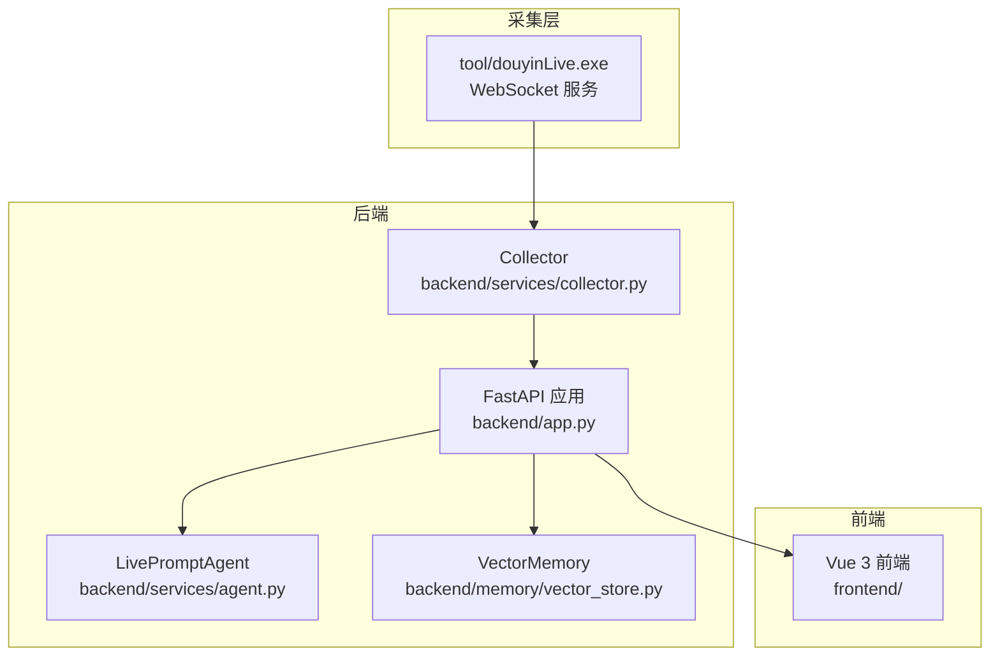
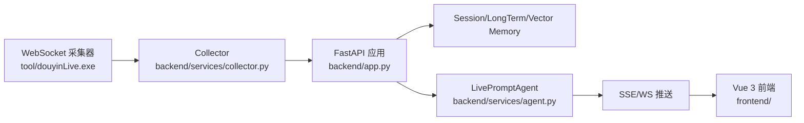
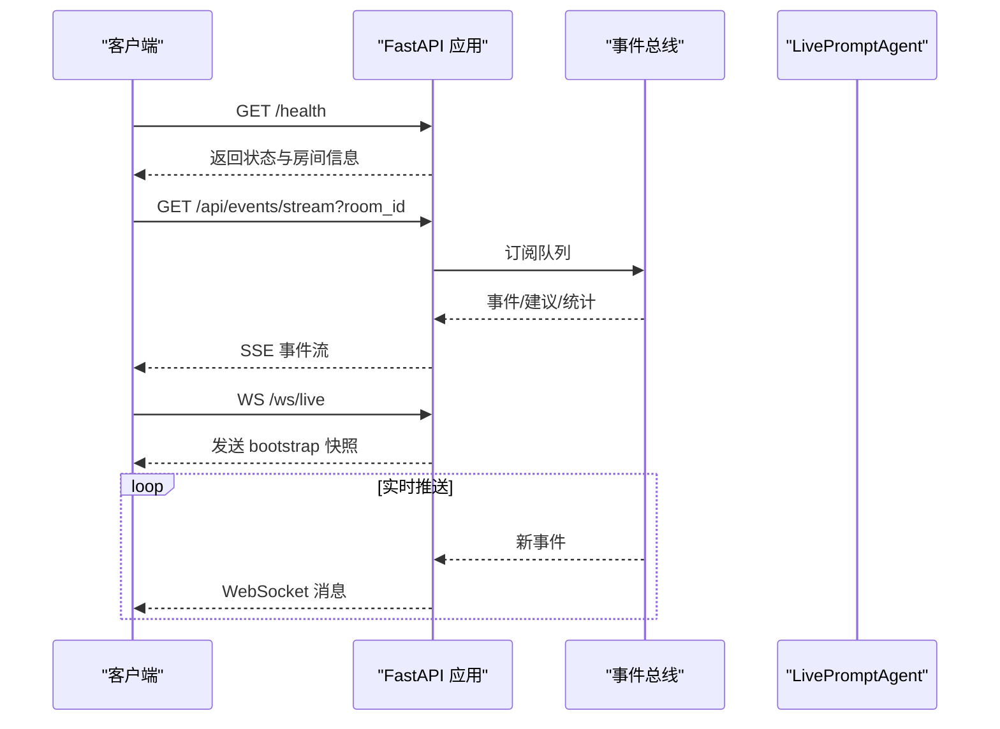
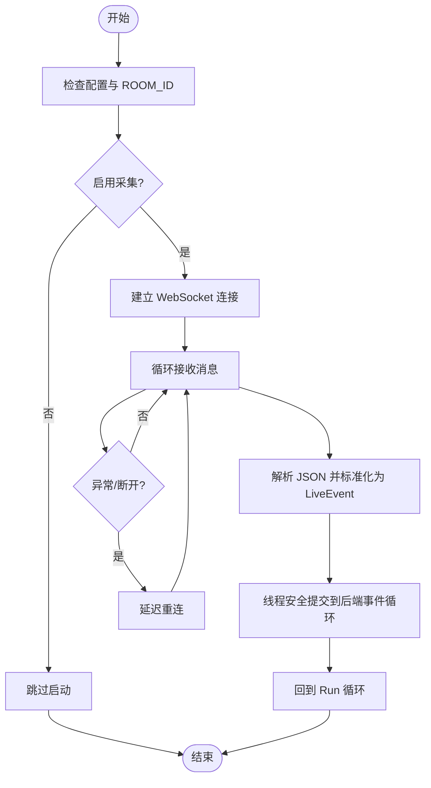
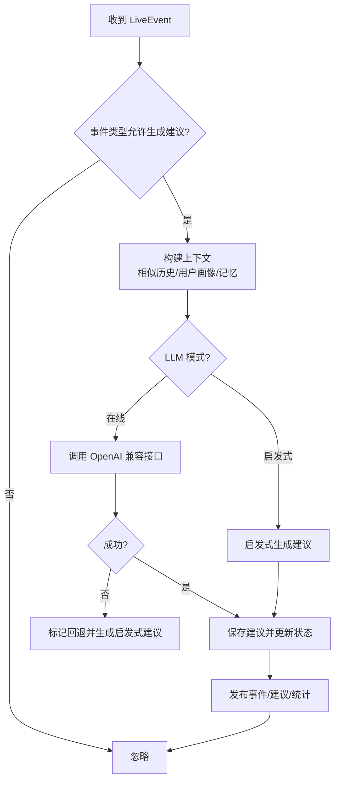
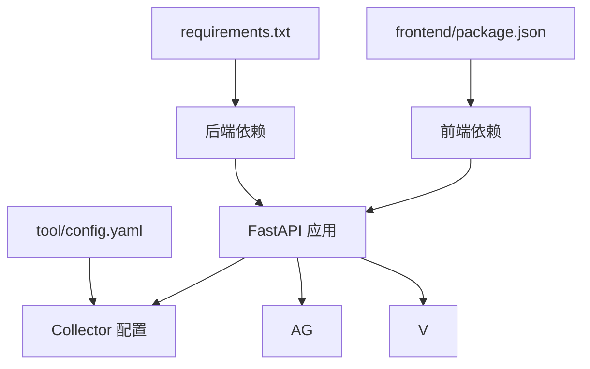

# 容器化和编排

<cite>
**本文引用的文件**
- [README.md](file://README.md)
- [USAGE.md](file://USAGE.md)
- [requirements.txt](file://requirements.txt)
- [backend/app.py](file://backend/app.py)
- [backend/config.py](file://backend/config.py)
- [backend/services/collector.py](file://backend/services/collector.py)
- [backend/services/agent.py](file://backend/services/agent.py)
- [backend/memory/vector_store.py](file://backend/memory/vector_store.py)
- [frontend/package.json](file://frontend/package.json)
- [tool/config.yaml](file://tool/config.yaml)
- [start_all.ps1](file://start_all.ps1)
- [start_backend_qwen.ps1](file://start_backend_qwen.ps1)
</cite>

## 目录
1. [简介](#简介)
2. [项目结构](#项目结构)
3. [核心组件](#核心组件)
4. [架构总览](#架构总览)
5. [详细组件分析](#详细组件分析)
6. [依赖关系分析](#依赖关系分析)
7. [性能考量](#性能考量)
8. [故障排查指南](#故障排查指南)
9. [结论](#结论)
10. [附录](#附录)

## 简介
本文件为 DouYin_llm 项目的容器化与编排指南，围绕以下目标展开：
- Docker 容器化方案：多阶段构建、镜像优化与安全加固
- Docker Compose 编排：服务编排、网络与卷挂载
- Kubernetes 部署：Deployment、Service、Ingress 配置与 Headless Service
- 服务发现与负载均衡：Headless Service 与 Ingress 控制器
- 滚动更新策略、健康检查与资源限制
- 监控与日志：Prometheus 与 ELK Stack 集成思路

DouYin_llm 是一个面向抖音直播间的实时提词工作栈，包含本地采集工具、FastAPI 后端与 Vue 3 前端。系统通过 WebSocket 接收直播事件，经后端处理后通过 SSE/WS 推送至前端。

章节来源
- [README.md:1-223](file://README.md#L1-L223)

## 项目结构
项目采用“工具/后端/前端”三层结构：
- tool：Windows 可执行采集器与配置
- backend：FastAPI 应用、事件采集与处理、LLM 提词引擎、内存与向量存储
- frontend：Vue 3 前端应用
- 数据与日志：SQLite/Chroma 存储与 logs 目录

图表来源
- [backend/app.py:108-126](file://backend/app.py#L108-L126)
- [backend/services/collector.py:38-100](file://backend/services/collector.py#L38-L100)
- [backend/services/agent.py:23-40](file://backend/services/agent.py#L23-L40)
- [backend/memory/vector_store.py:59-68](file://backend/memory/vector_store.py#L59-L68)

章节来源
- [README.md:32-44](file://README.md#L32-L44)
- [USAGE.md:15-256](file://USAGE.md#L15-L256)

## 核心组件
- FastAPI 应用：提供健康检查、事件流、WebSocket、LLM 设置等接口
- Collector：连接本地 WebSocket，标准化事件并提交到后端事件循环
- LivePromptAgent：基于 LLM 或启发式规则生成提词建议
- VectorMemory：Chroma 向量存储，支持相似检索与语义记忆
- 前端：Vue 3 组件展示状态、事件流与建议

章节来源
- [backend/app.py:129-285](file://backend/app.py#L129-L285)
- [backend/services/collector.py:38-266](file://backend/services/collector.py#L38-L266)
- [backend/services/agent.py:23-496](file://backend/services/agent.py#L23-L496)
- [backend/memory/vector_store.py:59-68](file://backend/memory/vector_store.py#L59-L68)
- [frontend/package.json:1-23](file://frontend/package.json#L1-L23)

## 架构总览
系统通过 WebSocket 接收直播事件，后端进行事件归一化、持久化、记忆抽取与提词生成，随后通过 SSE/WS 推送至前端。

图表来源
- [README.md:7-17](file://README.md#L7-L17)
- [backend/services/collector.py:141-196](file://backend/services/collector.py#L141-L196)
- [backend/app.py:252-285](file://backend/app.py#L252-L285)

章节来源
- [README.md:5-31](file://README.md#L5-L31)

## 详细组件分析

### FastAPI 应用与健康检查
- 提供 /health、/api/* 等接口
- 生命周期管理：启动时启动 Collector，关闭时清理会话
- CORS 允许跨域访问
- SSE 与 WebSocket 接口用于实时推送

图表来源
- [backend/app.py:129-135](file://backend/app.py#L129-L135)
- [backend/app.py:252-271](file://backend/app.py#L252-L271)
- [backend/app.py:274-285](file://backend/app.py#L274-L285)

章节来源
- [backend/app.py:108-126](file://backend/app.py#L108-L126)
- [backend/app.py:129-285](file://backend/app.py#L129-L285)

### Collector 与事件处理
- 连接到本地 WebSocket，解析消息为 LiveEvent
- 通过 asyncio 线程安全提交事件到后端事件循环
- 支持重连、心跳与错误处理

图表来源
- [backend/services/collector.py:61-98](file://backend/services/collector.py#L61-L98)
- [backend/services/collector.py:118-140](file://backend/services/collector.py#L118-L140)
- [backend/services/collector.py:145-196](file://backend/services/collector.py#L145-L196)

章节来源
- [backend/services/collector.py:38-266](file://backend/services/collector.py#L38-L266)

### LivePromptAgent 与 LLM 集成
- 支持启发式与在线模型两种模式
- 自动回退：在线模型失败时回退到启发式规则
- 输出结构化建议，包含优先级、语气、置信度等

图表来源
- [backend/services/agent.py:105-142](file://backend/services/agent.py#L105-L142)
- [backend/services/agent.py:200-216](file://backend/services/agent.py#L200-L216)
- [backend/services/agent.py:302-437](file://backend/services/agent.py#L302-L437)

章节来源
- [backend/services/agent.py:23-496](file://backend/services/agent.py#L23-L496)

### VectorMemory 与嵌入
- 基于 Chroma 的向量存储，支持相似检索
- 支持云/本地嵌入模式，可配置设备与批大小

章节来源
- [backend/memory/vector_store.py:59-68](file://backend/memory/vector_store.py#L59-L68)
- [backend/config.py:64-75](file://backend/config.py#L64-L75)

### 前端与实时展示
- Vue 3 + Pinia 管理状态与事件流
- 通过 SSE/WS 接收后端推送，展示建议、状态与统计

章节来源
- [frontend/package.json:1-23](file://frontend/package.json#L1-L23)
- [backend/app.py:252-285](file://backend/app.py#L252-L285)

## 依赖关系分析
- 后端依赖：FastAPI、Uvicorn、Redis、Chroma、websocket-client
- 前端依赖：Vue 3、Pinia、TailwindCSS、Vite
- 采集器：Windows 可执行文件，提供本地 WebSocket 服务

图表来源
- [requirements.txt:1-6](file://requirements.txt#L1-L6)
- [frontend/package.json:11-21](file://frontend/package.json#L11-L21)
- [tool/config.yaml:4-15](file://tool/config.yaml#L4-L15)

章节来源
- [requirements.txt:1-6](file://requirements.txt#L1-L6)
- [frontend/package.json:1-23](file://frontend/package.json#L1-L23)
- [tool/config.yaml:1-16](file://tool/config.yaml#L1-L16)

## 性能考量
- SSE/WS 实时推送：减少轮询开销，提升前端交互体验
- 事件循环与线程安全：Collector 使用线程安全提交，避免阻塞
- 向量检索：合理设置相似度阈值与召回数量，平衡准确率与延迟
- LLM 超时与回退：通过超时与回退机制保障稳定性

章节来源
- [backend/app.py:252-285](file://backend/app.py#L252-L285)
- [backend/services/collector.py:182-196](file://backend/services/collector.py#L182-L196)
- [backend/services/agent.py:302-437](file://backend/services/agent.py#L302-L437)
- [backend/config.py:71-75](file://backend/config.py#L71-L75)

## 故障排查指南
- 健康检查：访问 /health 查看房间与会话状态
- 常见问题：
  - 页面无建议：检查采集器是否启动、ROOM_ID 是否正确、直播间是否开播
  - 显示 fallback：检查 LLM 密钥、网络与超时设置
  - 前端无法打开：检查前端端口占用与启动脚本
  - 后端未写入数据：确认采集器连接与房间是否有消息

章节来源
- [backend/app.py:129-135](file://backend/app.py#L129-L135)
- [USAGE.md:198-256](file://USAGE.md#L198-L256)

## 结论
本指南提供了从容器化到编排的完整方案思路，结合项目现有结构与接口，可平滑落地到 Docker 与 Kubernetes 环境。后续可按需引入监控与日志体系，进一步完善可观测性。

## 附录

### Docker 容器化方案
- 多阶段构建
  - 阶段一：安装 Python 依赖与构建前端产物
  - 阶段二：复制运行时依赖与产物，精简镜像体积
- 镜像优化
  - 使用最小基础镜像，合并 RUN 指令，清理缓存
  - 区分开发与生产环境，避免将开发依赖打包进生产镜像
- 安全配置
  - 非 root 用户运行，限制文件权限
  - 通过环境变量注入敏感配置，避免硬编码
  - 仅暴露必要端口（后端 8010、前端 5173）

章节来源
- [requirements.txt:1-6](file://requirements.txt#L1-L6)
- [frontend/package.json:1-23](file://frontend/package.json#L1-L23)
- [backend/app.py:119-126](file://backend/app.py#L119-L126)

### Docker Compose 编排
- 服务编排
  - 后端服务：绑定端口 8010，挂载数据目录（SQLite/Chroma）
  - 前端服务：绑定端口 5173，代理后端 API
  - 可选：Redis、Chroma 作为独立服务
- 网络配置
  - 自定义桥接网络，服务间通过服务名通信
- 卷挂载
  - 数据卷：映射 data/ 与 logs/
  - 配置卷：挂载 .env 与 tool/config.yaml

章节来源
- [backend/config.py:52-82](file://backend/config.py#L52-L82)
- [tool/config.yaml:1-16](file://tool/config.yaml#L1-L16)
- [USAGE.md:24-48](file://USAGE.md#L24-L48)

### Kubernetes 部署方案
- Deployment
  - 后端：副本数、探针、资源限制与请求
  - 前端：静态资源镜像或 Nginx 代理
- Service
  - ClusterIP：后端服务
  - NodePort/LoadBalancer：前端对外暴露
- Ingress
  - 配置域名与路径转发，启用 TLS
- Headless Service
  - 用于 StatefulSet 或需要稳定网络标识的场景（如 Redis/Chroma）

章节来源
- [backend/app.py:129-135](file://backend/app.py#L129-L135)
- [USAGE.md:116-122](file://USAGE.md#L116-L122)

### 服务发现与负载均衡
- 服务发现：Kubernetes DNS 服务名解析
- 负载均衡：Service ClusterIP + Ingress 控制器（如 Nginx/Contour）
- Headless Service：StatefulSet 场景下提供稳定 Pod 主机名

章节来源
- [backend/app.py:119-126](file://backend/app.py#L119-L126)

### 滚动更新策略、健康检查与资源限制
- 滚动更新：设置 maxUnavailable 与 maxSurge，确保零停机
- 健康检查：HTTP GET /health，初始延迟与超时合理配置
- 资源限制：CPU/内存 requests/limits，避免资源争抢

章节来源
- [backend/app.py:129-135](file://backend/app.py#L129-L135)

### 监控与日志收集（Prometheus 与 ELK）
- Prometheus
  - 暴露指标端点（如自定义 metrics），配置 ServiceMonitor/Probe
- ELK
  - 前端与后端统一输出结构化日志，集中采集与索引
  - 建议使用 Sidecar 或 Filebeat 收集日志

章节来源
- [README.md:205-213](file://README.md#L205-L213)