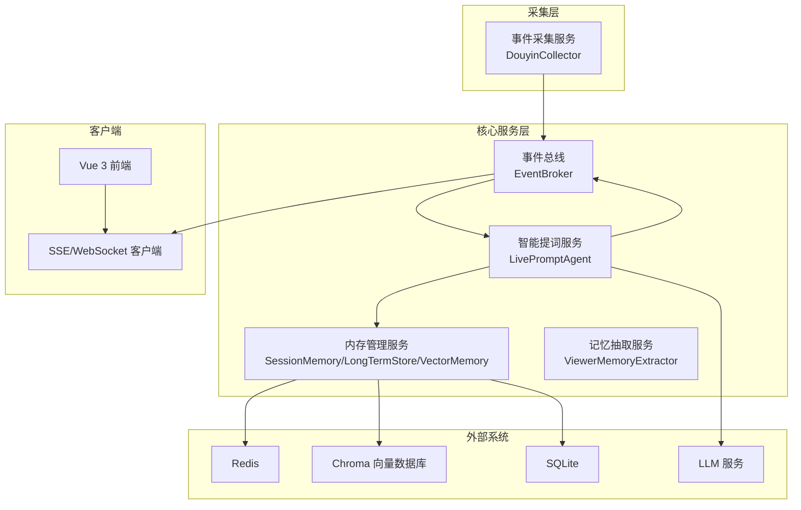
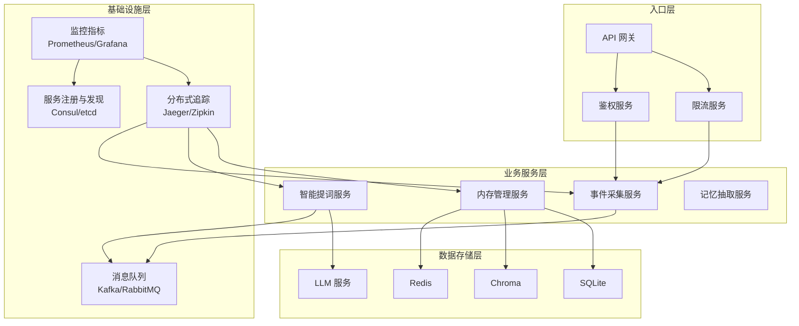
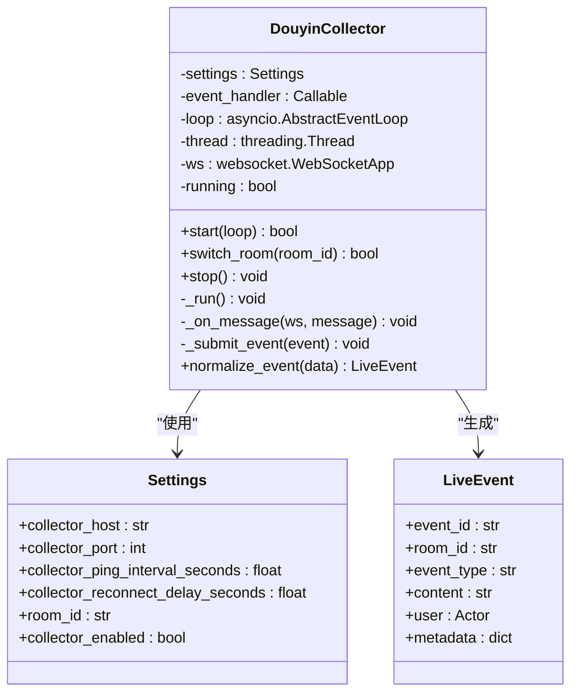
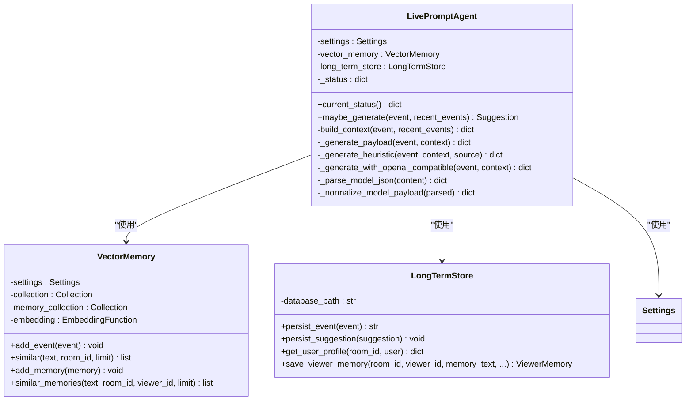
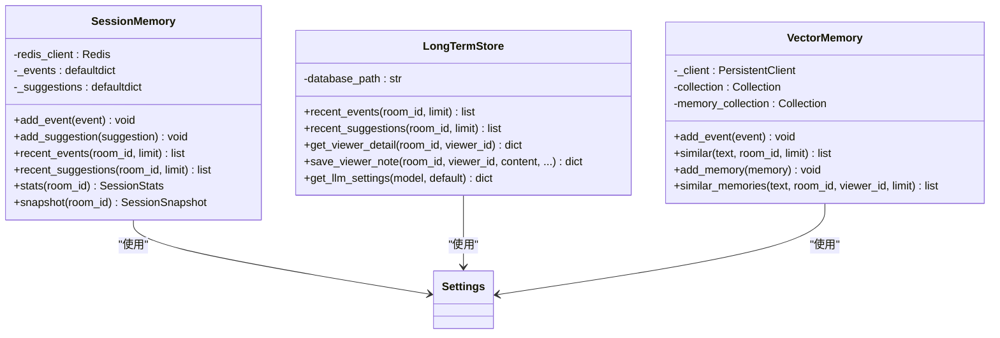
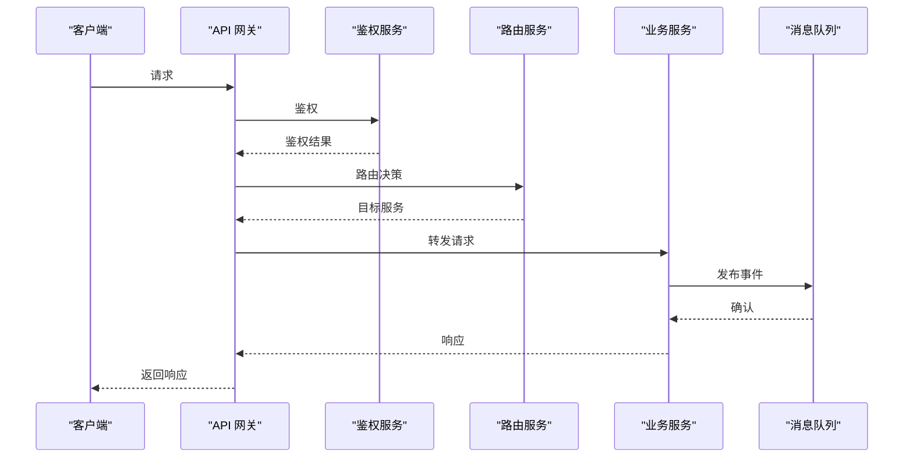
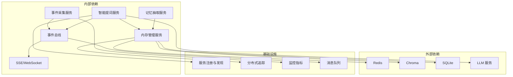

# 微服务架构扩展

<cite>
**本文档引用的文件**
- [README.md](file://README.md)
- [backend/app.py](file://backend/app.py)
- [backend/config.py](file://backend/config.py)
- [backend/services/collector.py](file://backend/services/collector.py)
- [backend/services/broker.py](file://backend/services/broker.py)
- [backend/services/agent.py](file://backend/services/agent.py)
- [backend/services/memory_extractor.py](file://backend/services/memory_extractor.py)
- [backend/memory/session_memory.py](file://backend/memory/session_memory.py)
- [backend/memory/long_term.py](file://backend/memory/long_term.py)
- [backend/memory/vector_store.py](file://backend/memory/vector_store.py)
- [backend/memory/embedding_service.py](file://backend/memory/embedding_service.py)
- [backend/schemas/live.py](file://backend/schemas/live.py)
- [requirements.txt](file://requirements.txt)
</cite>

## 目录
1. [简介](#简介)
2. [项目结构](#项目结构)
3. [核心组件](#核心组件)
4. [架构概览](#架构概览)
5. [详细组件分析](#详细组件分析)
6. [依赖关系分析](#依赖关系分析)
7. [性能考量](#性能考量)
8. [故障排除指南](#故障排除指南)
9. [结论](#结论)
10. [附录](#附录)

## 简介
本项目是一个面向抖音直播间的实时提词工作栈，包含本地采集工具、FastAPI 后端与 Vue 3 前端。系统将抖音直播 WebSocket 流中的评论、礼物与关注事件转换为结构化的 LiveEvent，沉淀到 SQLite/Chroma 中形成观众记忆，并通过 LLM 或启发式规则生成提词建议，最终以前端仪表板形式呈现。

扩展示架构的目标是在现有单体应用基础上，拆分为多个独立的微服务，分别负责事件采集、智能提词、内存管理与 API 网关，提升系统的可扩展性、可维护性与可观测性。

## 项目结构
扩展示架构将现有代码按职责划分为以下微服务：
- 事件采集服务：负责与抖音采集器对接，标准化事件并投递到事件总线
- 智能提词服务：负责事件处理、记忆抽取、LLM/启发式提词生成与结果持久化
- 内存管理服务：负责短期会话内存、长期存储与向量索引的统一管理
- API 网关：负责路由转发、鉴权、限流与监控指标收集

**图表来源**
- [backend/app.py:105-106](file://backend/app.py#L105-L106)
- [backend/services/collector.py:38-53](file://backend/services/collector.py#L38-L53)
- [backend/services/broker.py:10-21](file://backend/services/broker.py#L10-L21)
- [backend/services/agent.py:23-35](file://backend/services/agent.py#L23-L35)
- [backend/memory/session_memory.py:17-31](file://backend/memory/session_memory.py#L17-L31)
- [backend/memory/long_term.py:44-47](file://backend/memory/long_term.py#L44-L47)
- [backend/memory/vector_store.py:59-68](file://backend/memory/vector_store.py#L59-L68)

**章节来源**
- [README.md:1-53](file://README.md#L1-L53)
- [backend/app.py:1-120](file://backend/app.py#L1-L120)

## 核心组件
扩展示架构的核心组件包括：

### 事件采集服务
- 职责：与抖音采集器建立 WebSocket 连接，标准化消息为 LiveEvent，提交到事件循环
- 关键特性：支持动态房间切换、断线重连、心跳检测、异常处理
- 通信机制：WebSocket 与 FastAPI 事件循环的线程安全传递

### 智能提词服务
- 职责：事件处理、上下文构建、LLM/启发式提词生成、结果持久化
- 关键特性：双通道提词（LLM 兼容接口与启发式规则）、错误降级、状态上报
- 通信机制：HTTP REST API、SSE/WebSocket 推送

### 内存管理服务
- 职责：短期会话内存（Redis/进程内）、长期存储（SQLite）、向量索引（Chroma）
- 关键特性：Redis 退化模式、批量写入优化、查询重排序、语义相似度检索
- 通信机制：内部进程内调用、事件总线广播

### API 网关
- 职责：统一入口、路由转发、鉴权、限流、监控指标收集
- 关键特性：支持 gRPC/RESTful API、消息队列集成、服务发现与注册
- 通信机制：gRPC、RESTful API、消息队列（Kafka/RabbitMQ）

**章节来源**
- [backend/services/collector.py:38-100](file://backend/services/collector.py#L38-L100)
- [backend/services/agent.py:23-60](file://backend/services/agent.py#L23-L60)
- [backend/memory/session_memory.py:17-31](file://backend/memory/session_memory.py#L17-L31)
- [backend/memory/long_term.py:44-63](file://backend/memory/long_term.py#L44-L63)

## 架构概览
扩展示架构采用事件驱动的微服务模式，通过事件总线实现服务解耦。系统支持多种通信协议与集成点，满足生产环境的可靠性与可扩展性需求。

**图表来源**
- [backend/app.py:119-136](file://backend/app.py#L119-L136)
- [backend/services/broker.py:10-21](file://backend/services/broker.py#L10-L21)
- [backend/services/collector.py:38-53](file://backend/services/collector.py#L38-L53)

## 详细组件分析

### 事件采集服务分析
事件采集服务负责与抖音采集器的 WebSocket 对接，将原始消息标准化为 LiveEvent 并提交到 FastAPI 事件循环。

**图表来源**
- [backend/services/collector.py:38-100](file://backend/services/collector.py#L38-L100)
- [backend/config.py:40-76](file://backend/config.py#L40-L76)
- [backend/schemas/live.py:29-44](file://backend/schemas/live.py#L29-L44)

**章节来源**
- [backend/services/collector.py:38-100](file://backend/services/collector.py#L38-L100)
- [backend/config.py:40-76](file://backend/config.py#L40-L76)

### 智能提词服务分析
智能提词服务是系统的核心决策引擎，负责事件处理、上下文构建与提词生成。

**图表来源**
- [backend/services/agent.py:23-60](file://backend/services/agent.py#L23-L60)
- [backend/memory/vector_store.py:59-68](file://backend/memory/vector_store.py#L59-L68)
- [backend/memory/long_term.py:44-47](file://backend/memory/long_term.py#L44-L47)

**章节来源**
- [backend/services/agent.py:23-60](file://backend/services/agent.py#L23-L60)
- [backend/memory/vector_store.py:59-68](file://backend/memory/vector_store.py#L59-L68)
- [backend/memory/long_term.py:44-63](file://backend/memory/long_term.py#L44-L63)

### 内存管理服务分析
内存管理服务提供多层数据存储能力，支持短期会话、长期存储与向量索引。

**图表来源**
- [backend/memory/session_memory.py:17-31](file://backend/memory/session_memory.py#L17-L31)
- [backend/memory/long_term.py:44-47](file://backend/memory/long_term.py#L44-L47)
- [backend/memory/vector_store.py:59-68](file://backend/memory/vector_store.py#L59-L68)

**章节来源**
- [backend/memory/session_memory.py:17-31](file://backend/memory/session_memory.py#L17-L31)
- [backend/memory/long_term.py:44-63](file://backend/memory/long_term.py#L44-L63)
- [backend/memory/vector_store.py:59-68](file://backend/memory/vector_store.py#L59-L68)

### API 网关分析
API 网关作为统一入口，负责路由、鉴权、限流与监控。

**图表来源**
- [backend/app.py:119-136](file://backend/app.py#L119-L136)
- [backend/services/broker.py:10-21](file://backend/services/broker.py#L10-L21)

**章节来源**
- [backend/app.py:119-136](file://backend/app.py#L119-L136)
- [backend/services/broker.py:10-21](file://backend/services/broker.py#L10-L21)

## 依赖关系分析
扩展示架构的依赖关系主要体现在服务间的耦合度与数据流向。

**图表来源**
- [backend/app.py:27-35](file://backend/app.py#L27-L35)
- [requirements.txt:1-6](file://requirements.txt#L1-L6)

**章节来源**
- [backend/app.py:27-35](file://backend/app.py#L27-L35)
- [requirements.txt:1-6](file://requirements.txt#L1-L6)

## 性能考量
扩展示架构在性能方面需要重点关注以下方面：
- 事件吞吐：通过事件总线实现异步处理，避免阻塞主流程
- 存储优化：Redis 缓存热点数据，SQLite 批量写入，Chroma 向量化查询
- LLM 调用：超时控制、错误降级、结果缓存
- 网络延迟：gRPC 与 RESTful API 的选择，消息队列的异步处理

## 故障排除指南
扩展示架构的故障排除需要从以下几个维度入手：
- 服务可用性：检查服务注册与发现、健康检查端点
- 事件流：验证事件总线的订阅与发布、队列积压情况
- 存储状态：监控 Redis/Chroma/SQLite 的连接与性能指标
- LLM 集成：检查 API 密钥、超时设置、错误日志
- 网关路由：确认路由规则、鉴权配置、限流策略

**章节来源**
- [backend/app.py:129-136](file://backend/app.py#L129-L136)
- [backend/services/collector.py:161-180](file://backend/services/collector.py#L161-L180)

## 结论
扩展示架构通过微服务拆分实现了系统的模块化与可扩展性。事件采集、智能提词、内存管理与 API 网关各司其职，通过事件总线实现松耦合集成。结合服务注册与发现、分布式追踪与监控指标，系统具备了生产环境所需的可靠性与可观测性。

## 附录
- 服务拆分策略：按职责划分微服务，避免交叉依赖
- 通信机制：gRPC 用于服务间通信，RESTful API 用于客户端交互，消息队列用于异步事件处理
- 服务发现与注册：使用 Consul 或 etcd 实现服务注册与发现
- 分布式追踪：集成 Jaeger 或 Zipkin 进行全链路追踪
- 熔断、降级与限流：在 API 网关层实现，结合 Redis 缓存与降级策略
- 容器化部署：使用 Docker 容器化各微服务，结合 Kubernetes 进行编排与管理