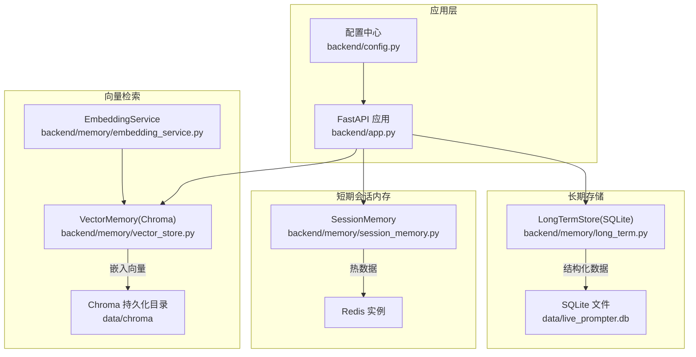
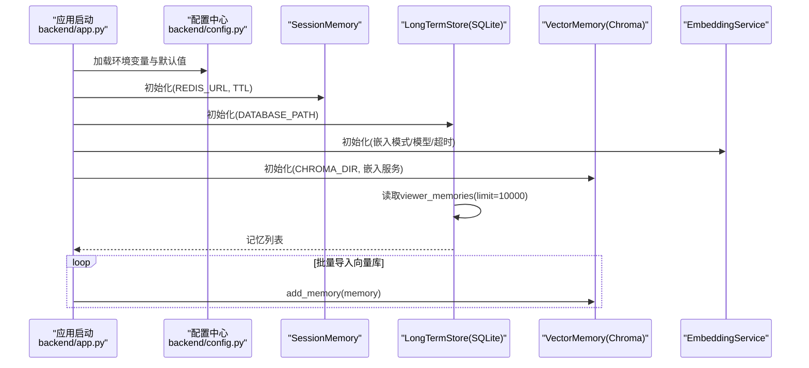
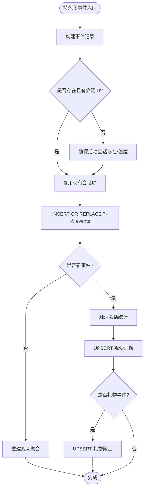
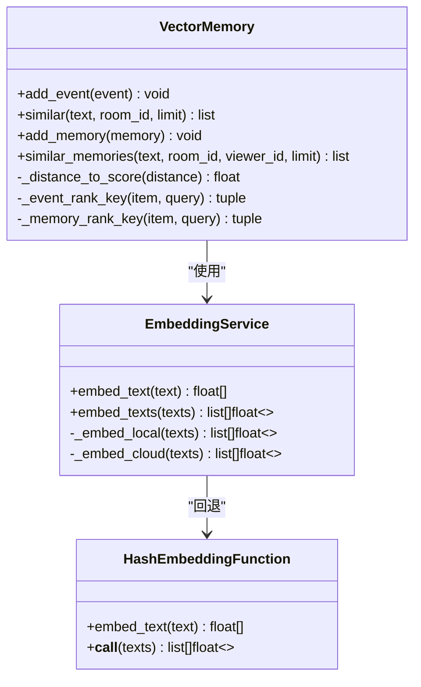
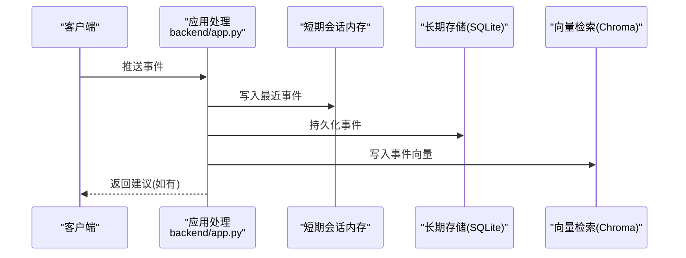
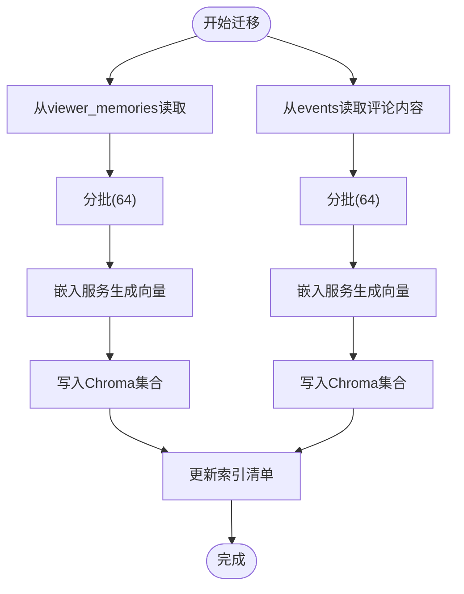
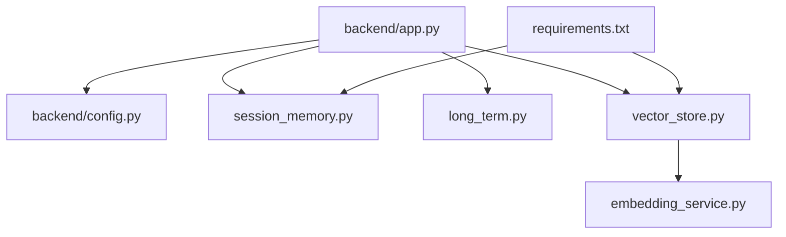

# 数据库扩展策略

<cite>
**本文引用的文件**
- [backend/config.py](file://backend/config.py)
- [backend/app.py](file://backend/app.py)
- [backend/memory/long_term.py](file://backend/memory/long_term.py)
- [backend/memory/vector_store.py](file://backend/memory/vector_store.py)
- [backend/memory/session_memory.py](file://backend/memory/session_memory.py)
- [backend/memory/embedding_service.py](file://backend/memory/embedding_service.py)
- [backend/memory/rebuild_embeddings.py](file://backend/memory/rebuild_embeddings.py)
- [data/DATABASE.md](file://data/DATABASE.md)
- [requirements.txt](file://requirements.txt)
- [tests/test_long_term.py](file://tests/test_long_term.py)
- [tests/test_vector_store.py](file://tests/test_vector_store.py)
- [tests/test_embedding_service.py](file://tests/test_embedding_service.py)
- [tests/test_rebuild_embeddings.py](file://tests/test_rebuild_embeddings.py)
</cite>

## 目录
1. [简介](#简介)
2. [项目结构](#项目结构)
3. [核心组件](#核心组件)
4. [架构总览](#架构总览)
5. [详细组件分析](#详细组件分析)
6. [依赖分析](#依赖分析)
7. [性能考虑](#性能考虑)
8. [故障排查指南](#故障排查指南)
9. [结论](#结论)
10. [附录](#附录)

## 简介
本文件为 DouYin_llm 项目的数据库扩展策略文档，聚焦以下目标：
- SQLite 性能优化：索引设计、查询优化与连接管理
- ChromaDB 向量数据库扩展：分片策略、副本配置与查询性能优化
- Redis 集群配置：主从复制、哨兵模式与集群模式选择
- 读写分离实现：数据库路由与数据同步策略
- 数据迁移、备份与灾难恢复方案
- 性能监控与容量规划方法

## 项目结构
项目采用“短期会话内存（Redis）+ 长期存储（SQLite）+ 向量检索（Chroma）”三层数据架构：
- 应用入口负责初始化各存储组件，并在启动时将长期存储中的记忆导入向量库
- 短期会话内存用于高频热数据（事件流与建议），支持 Redis 与进程内回退
- 长期存储负责结构化数据持久化与统计聚合
- 向量检索用于语义相似度召回，支持云端与本地嵌入模型

图表来源
- [backend/app.py:24-35](file://backend/app.py#L24-L35)
- [backend/config.py:53-55](file://backend/config.py#L53-L55)
- [backend/memory/session_memory.py:17-31](file://backend/memory/session_memory.py#L17-L31)
- [backend/memory/long_term.py:44-54](file://backend/memory/long_term.py#L44-L54)
- [backend/memory/vector_store.py:59-84](file://backend/memory/vector_store.py#L59-L84)
- [backend/memory/embedding_service.py:18-48](file://backend/memory/embedding_service.py#L18-L48)

章节来源
- [backend/app.py:24-35](file://backend/app.py#L24-L35)
- [backend/config.py:53-55](file://backend/config.py#L53-L55)

## 核心组件
- 配置中心：集中管理数据库路径、Chroma 目录、Redis 地址、嵌入模型参数与阈值
- 短期会话内存：基于 Redis 的事件与建议队列，支持 TTL 控制与回退至进程内容器
- 长期存储（SQLite）：事件、观众画像、礼物聚合、直播场次、备注与记忆等结构化数据
- 向量检索（Chroma）：事件历史与观众记忆的向量索引，支持语义相似度查询
- 嵌入服务：支持云端与本地嵌入模型，失败时回退到哈希嵌入函数

章节来源
- [backend/config.py:40-113](file://backend/config.py#L40-L113)
- [backend/memory/session_memory.py:17-113](file://backend/memory/session_memory.py#L17-L113)
- [backend/memory/long_term.py:44-187](file://backend/memory/long_term.py#L44-L187)
- [backend/memory/vector_store.py:59-317](file://backend/memory/vector_store.py#L59-L317)
- [backend/memory/embedding_service.py:18-102](file://backend/memory/embedding_service.py#L18-L102)

## 架构总览
应用启动流程中，会初始化 Redis、SQLite、Chroma 与嵌入服务，并将长期存储中的记忆批量导入向量库，确保首次查询可用。

图表来源
- [backend/app.py:24-35](file://backend/app.py#L24-L35)
- [backend/config.py:53-55](file://backend/config.py#L53-L55)
- [backend/memory/long_term.py:693-704](file://backend/memory/long_term.py#L693-L704)
- [backend/memory/vector_store.py:232-256](file://backend/memory/vector_store.py#L232-L256)

## 详细组件分析

### SQLite 长期存储（性能优化）
- 连接管理
  - 使用自定义连接工厂，确保连接退出时自动关闭，避免句柄泄漏
  - 将 SQLite 日志模式切换为 TRUNCATE，提升部分挂载盘场景下的写入稳定性
- 表结构与索引
  - 核心表：events、viewer_profiles、viewer_gifts、live_sessions、viewer_notes、suggestions
  - 已创建复合索引覆盖常见查询路径：房间+时间、房间+观众+时间、房间+事件类型+时间、会话ID、观众笔记与记忆的时间倒序等
- 查询优化
  - 写入路径采用 UPSERT/ON CONFLICT 更新，减少重复写入成本
  - 聚合计算通过单次扫描重建，降低多次查询的开销
- 复杂逻辑（示例：事件持久化）
  - 判断是否已有会话，若无则创建活动会话
  - 写入事件后根据事件类型更新观众画像与礼物聚合
  - 若为新事件则触活会话统计，否则触发全量聚合重算

图表来源
- [backend/memory/long_term.py:454-488](file://backend/memory/long_term.py#L454-L488)
- [backend/memory/long_term.py:310-358](file://backend/memory/long_term.py#L310-L358)
- [backend/memory/long_term.py:360-404](file://backend/memory/long_term.py#L360-L404)
- [backend/memory/long_term.py:406-436](file://backend/memory/long_term.py#L406-L436)

章节来源
- [backend/memory/long_term.py:36-54](file://backend/memory/long_term.py#L36-L54)
- [backend/memory/long_term.py:216-229](file://backend/memory/long_term.py#L216-L229)
- [backend/memory/long_term.py:454-488](file://backend/memory/long_term.py#L454-L488)
- [data/DATABASE.md:16-151](file://data/DATABASE.md#L16-L151)

### ChromaDB 向量数据库（扩展与优化）
- 分片策略
  - 基于嵌入签名动态命名集合，不同模型/模式组合隔离在独立集合中，避免跨版本冲突
  - 集合名称包含嵌入签名，便于后续重建与版本管理
- 副本配置
  - 当前实现为单机持久化客户端；如需高可用，可在部署层引入多实例与一致性策略（建议在容器编排层面实现）
- 查询性能优化
  - 使用嵌入服务统一生成向量，结合元数据过滤（如房间ID、观众ID、事件类型）
  - 查询返回距离后转换为相似度分数，并进行阈值过滤与二次排序（事件按时间与类型加权，记忆按置信度与召回次数加权）

图表来源
- [backend/memory/embedding_service.py:18-102](file://backend/memory/embedding_service.py#L18-L102)
- [backend/memory/vector_store.py:34-57](file://backend/memory/vector_store.py#L34-L57)
- [backend/memory/vector_store.py:59-317](file://backend/memory/vector_store.py#L59-L317)

章节来源
- [backend/memory/vector_store.py:59-84](file://backend/memory/vector_store.py#L59-L84)
- [backend/memory/vector_store.py:172-230](file://backend/memory/vector_store.py#L172-L230)
- [backend/memory/vector_store.py:257-316](file://backend/memory/vector_store.py#L257-L316)
- [backend/memory/embedding_service.py:18-102](file://backend/memory/embedding_service.py#L18-L102)

### Redis 集群配置（主从、哨兵、集群模式）
- 主从复制
  - 适合读多写少场景；通过只读从节点分流近期事件与建议查询，写入主节点
- 哨兵模式
  - 提供高可用与自动故障转移；适用于需要强一致性的读写混合场景
- 集群模式
  - 通过分片提升吞吐与容量；适合大规模房间并发与海量热数据
- 部署建议
  - 在容器编排中定义多个 Redis 实例与哨兵/集群拓扑
  - 通过环境变量配置 REDIS_URL，确保应用层无需改动

章节来源
- [backend/config.py:55](file://backend/config.py#L55)
- [backend/memory/session_memory.py:17-31](file://backend/memory/session_memory.py#L17-L31)

### 读写分离实现（路由与同步）
- 路由策略
  - 写入：事件与建议统一写入短期会话内存（Redis）与长期存储（SQLite）
  - 读取：短期会话内存优先，若为空则回退到长期存储
- 同步策略
  - 事件写入后立即写入短期会话内存与长期存储，确保一致性
  - 建议生成后同样写入短期与长期存储，并通过事件总线广播
- 一致性保障
  - 通过事务性写入与回退机制，避免部分失败导致的数据不一致

图表来源
- [backend/app.py:73-102](file://backend/app.py#L73-L102)
- [backend/memory/session_memory.py:42-64](file://backend/memory/session_memory.py#L42-L64)
- [backend/memory/long_term.py:454-488](file://backend/memory/long_term.py#L454-L488)
- [backend/memory/vector_store.py:149-171](file://backend/memory/vector_store.py#L149-L171)

章节来源
- [backend/app.py:73-102](file://backend/app.py#L73-L102)

### 数据迁移、备份与灾难恢复
- 迁移方案
  - 使用重建脚本从 SQLite 导出数据，批量生成嵌入并写入 Chroma
  - 支持按房间与限制数量增量迁移，支持干跑与丢弃现有集合
- 备份策略
  - SQLite：定期导出数据库文件；结合 WAL/事务日志进行一致性备份
  - Chroma：备份持久化目录；注意集合命名与嵌入签名一致性
  - Redis：RDB/AOF 备份；或使用 Redis 集群快照
- 灾难恢复
  - 快速回退：关闭向量检索时自动降级为本地令牌匹配
  - 渐进恢复：先恢复 Redis 与 SQLite，再重建 Chroma 索引

图表来源
- [backend/memory/rebuild_embeddings.py:155-230](file://backend/memory/rebuild_embeddings.py#L155-L230)
- [backend/memory/rebuild_embeddings.py:233-275](file://backend/memory/rebuild_embeddings.py#L233-L275)
- [backend/memory/rebuild_embeddings.py:108-152](file://backend/memory/rebuild_embeddings.py#L108-L152)

章节来源
- [backend/memory/rebuild_embeddings.py:155-230](file://backend/memory/rebuild_embeddings.py#L155-L230)
- [backend/memory/rebuild_embeddings.py:233-275](file://backend/memory/rebuild_embeddings.py#L233-L275)
- [backend/memory/rebuild_embeddings.py:108-152](file://backend/memory/rebuild_embeddings.py#L108-L152)

## 依赖分析
- 组件耦合
  - 应用层通过配置中心统一注入各存储组件
  - 向量检索依赖嵌入服务；短期会话内存依赖 Redis 客户端
  - 长期存储承担数据一致性与聚合职责
- 外部依赖
  - Redis、Chroma、FastAPI、Uvicorn 等

图表来源
- [backend/app.py:13-35](file://backend/app.py#L13-L35)
- [requirements.txt:1-6](file://requirements.txt#L1-6)

章节来源
- [backend/app.py:13-35](file://backend/app.py#L13-L35)
- [requirements.txt:1-6](file://requirements.txt#L1-6)

## 性能考虑
- SQLite
  - 使用 TRUNCATE 日志模式与自定义连接工厂，减少写入阻塞与句柄泄漏
  - 通过复合索引覆盖热点查询（房间+时间、房间+观众+时间等）
  - 写入路径采用 UPSERT，避免重复键冲突带来的额外开销
- 向量检索
  - 嵌入签名隔离集合，避免跨版本索引冲突
  - 查询阶段先阈值过滤，再二次排序，减少无效结果
  - 批量写入与分批处理，降低网络与磁盘压力
- Redis
  - 使用列表与过期策略控制热数据生命周期
  - 在高并发场景下建议采用集群模式分片

章节来源
- [backend/memory/long_term.py:36-54](file://backend/memory/long_term.py#L36-L54)
- [backend/memory/long_term.py:216-229](file://backend/memory/long_term.py#L216-L229)
- [backend/memory/vector_store.py:172-230](file://backend/memory/vector_store.py#L172-L230)
- [backend/memory/session_memory.py:17-31](file://backend/memory/session_memory.py#L17-L31)

## 故障排查指南
- SQLite 连接问题
  - 确认日志模式已切换为 TRUNCATE；检查连接工厂是否正确关闭
- 向量检索不可用
  - Chroma 不可用时自动降级为本地令牌匹配；检查嵌入服务可用性与网络
- Redis 不可用
  - 自动回退到进程内容器；确认 REDIS_URL 配置与网络连通性
- 测试验证
  - 单元测试覆盖连接模式切换、集合命名、嵌入调用与重建流程

章节来源
- [tests/test_long_term.py:7-26](file://tests/test_long_term.py#L7-L26)
- [tests/test_vector_store.py:20-103](file://tests/test_vector_store.py#L20-L103)
- [tests/test_embedding_service.py:23-83](file://tests/test_embedding_service.py#L23-L83)
- [tests/test_rebuild_embeddings.py:12-229](file://tests/test_rebuild_embeddings.py#L12-L229)

## 结论
本策略文档基于现有代码实现了三层数据架构的扩展与优化建议：SQLite 的索引与连接优化、Chroma 的集合隔离与查询优化、Redis 的多模式部署与读写分离、以及完整的迁移与灾备方案。建议在生产环境中结合业务规模选择合适的 Redis 拓扑（主从/哨兵/集群），并持续监控向量索引与数据库性能，按需扩容与分片。

## 附录
- 常用查询参考：见数据说明文档中的常用 SQL 示例
- 环境变量与默认值：见配置中心文件

章节来源
- [data/DATABASE.md:101-151](file://data/DATABASE.md#L101-L151)
- [backend/config.py:40-113](file://backend/config.py#L40-L113)