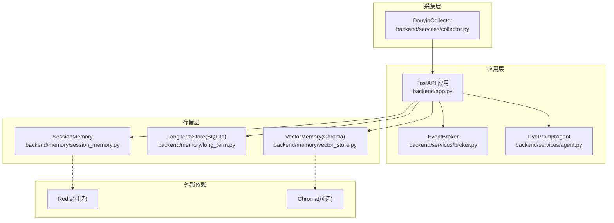
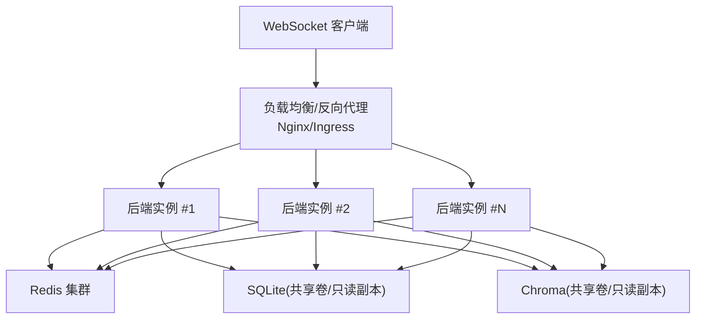
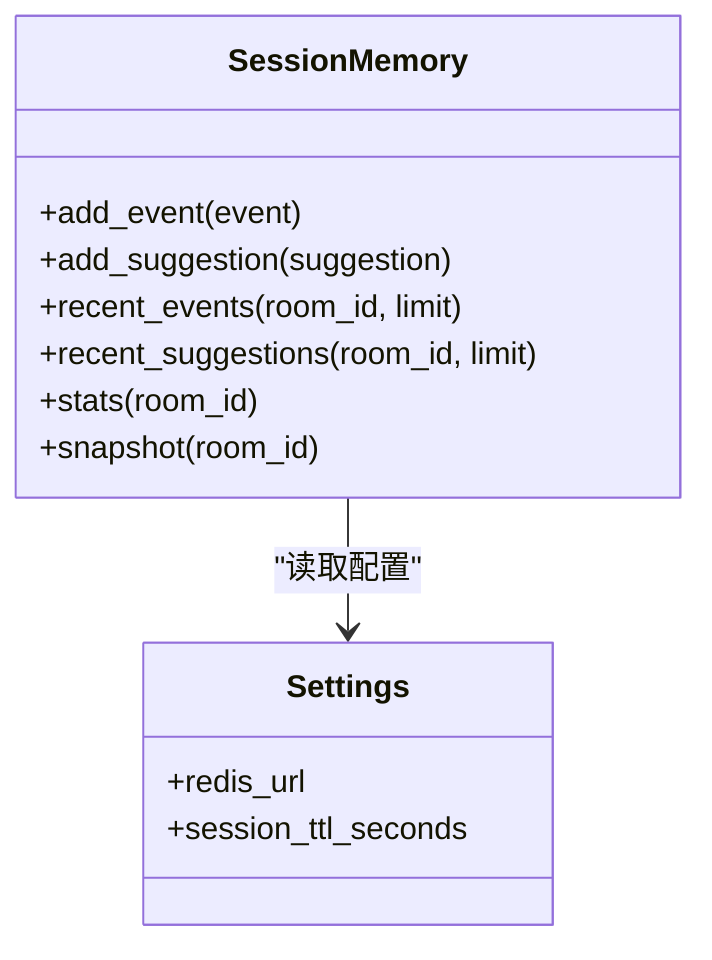
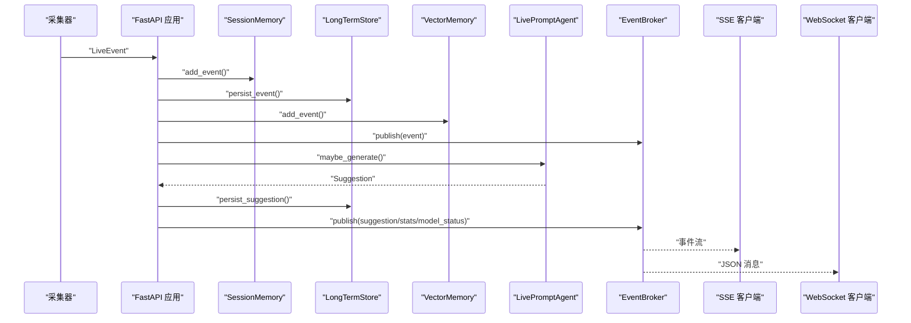
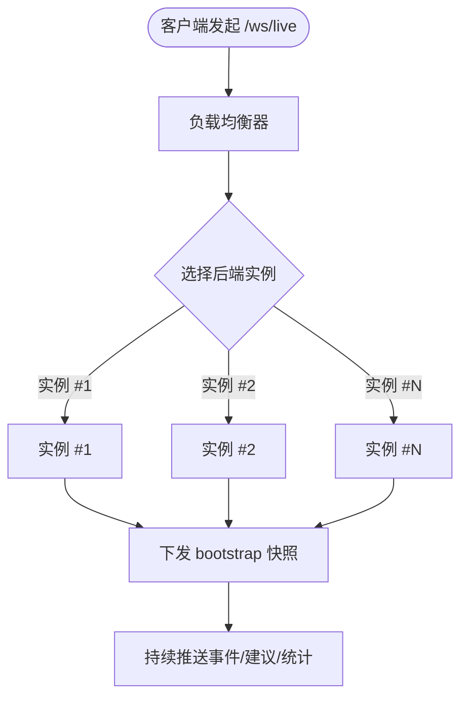
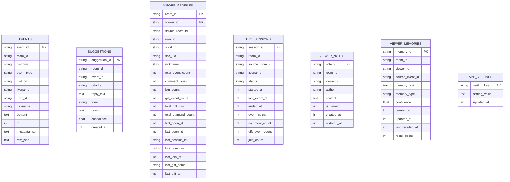

# 水平扩展策略

<cite>
**本文引用的文件**
- [backend/app.py](file://backend/app.py)
- [backend/config.py](file://backend/config.py)
- [backend/services/broker.py](file://backend/services/broker.py)
- [backend/memory/session_memory.py](file://backend/memory/session_memory.py)
- [backend/memory/long_term.py](file://backend/memory/long_term.py)
- [backend/memory/vector_store.py](file://backend/memory/vector_store.py)
- [backend/memory/embedding_service.py](file://backend/memory/embedding_service.py)
- [backend/services/collector.py](file://backend/services/collector.py)
- [backend/services/agent.py](file://backend/services/agent.py)
- [backend/schemas/live.py](file://backend/schemas/live.py)
- [requirements.txt](file://requirements.txt)
- [README.md](file://README.md)
</cite>

## 目录
1. [简介](#简介)
2. [项目结构](#项目结构)
3. [核心组件](#核心组件)
4. [架构总览](#架构总览)
5. [详细组件分析](#详细组件分析)
6. [依赖关系分析](#依赖关系分析)
7. [性能考量](#性能考量)
8. [故障排查指南](#故障排查指南)
9. [结论](#结论)
10. [附录](#附录)

## 简介
本策略文档面向 DouYin_llm 项目的多实例水平扩展，围绕以下目标展开：
- 多实例部署架构与负载均衡配置
- 会话状态共享与数据一致性保证
- Redis 集群用于会话状态同步
- WebSocket 连接的负载分发策略
- 事件总线的分布式处理
- 具体部署示例（Nginx 反向代理、Docker Swarm/Kubernetes）
- 扩缩容策略、健康检查与故障转移
- 性能基准测试方法与监控指标

## 项目结构
后端采用 FastAPI 应用，核心处理链路包括：采集器接收实时事件 → 归一化为 LiveEvent → 写入短期会话内存（可选 Redis）与长期存储（SQLite）→ 向量检索（Chroma）→ 提词生成（LLM/启发式）→ 事件总线广播（SSE/WebSocket）→ 前端消费。

图表来源
- [backend/app.py:108-127](file://backend/app.py#L108-L127)
- [backend/services/broker.py:10-40](file://backend/services/broker.py#L10-L40)
- [backend/memory/session_memory.py:17-113](file://backend/memory/session_memory.py#L17-L113)
- [backend/memory/long_term.py:44-967](file://backend/memory/long_term.py#L44-L967)
- [backend/memory/vector_store.py:59-317](file://backend/memory/vector_store.py#L59-L317)
- [backend/services/collector.py:38-266](file://backend/services/collector.py#L38-L266)
- [backend/services/agent.py:23-496](file://backend/services/agent.py#L23-L496)

章节来源
- [README.md:5-17](file://README.md#L5-L17)
- [backend/app.py:108-127](file://backend/app.py#L108-L127)

## 核心组件
- FastAPI 应用与路由：提供健康检查、房间切换、事件注入、SSE/WebSocket 实时流等接口。
- 事件总线：进程内事件广播器，统一向 SSE 与 WebSocket 订阅者分发。
- 会话内存：短期事件与建议缓存，支持 Redis 分布式共享与 TTL 控制。
- 长期存储：SQLite 表结构完整，包含事件、建议、观众画像、礼物、会话、笔记、记忆与应用设置。
- 向量存储：Chroma 持久化集合，支持事件与观众记忆的语义检索。
- 提词引擎：LLM 与启发式规则双通道，具备降级与状态上报。
- 采集器：与本地采集器 WebSocket 对接，标准化消息并提交到事件循环。

章节来源
- [backend/app.py:129-285](file://backend/app.py#L129-L285)
- [backend/services/broker.py:10-40](file://backend/services/broker.py#L10-L40)
- [backend/memory/session_memory.py:17-113](file://backend/memory/session_memory.py#L17-L113)
- [backend/memory/long_term.py:44-967](file://backend/memory/long_term.py#L44-L967)
- [backend/memory/vector_store.py:59-317](file://backend/memory/vector_store.py#L59-L317)
- [backend/services/agent.py:23-496](file://backend/services/agent.py#L23-L496)
- [backend/services/collector.py:38-266](file://backend/services/collector.py#L38-L266)

## 架构总览
多实例水平扩展的关键在于：
- 会话状态共享：通过 Redis 集群实现短期事件与建议的跨实例共享。
- 数据一致性：长期存储使用 SQLite，需确保多实例不同时写入同一数据库文件；可采用只读副本或集中式数据库。
- 事件总线：每个实例维护独立的 EventBroker，但通过 SSE/WebSocket 向客户端广播，客户端需连接到同一上游。
- WebSocket 负载分发：建议使用 Nginx 或反向代理将连接均匀分配至多个后端实例。
- 扩缩容与健康检查：通过容器编排平台实现自动扩缩容与健康探针。

图表来源
- [backend/memory/session_memory.py:17-113](file://backend/memory/session_memory.py#L17-L113)
- [backend/memory/long_term.py:44-967](file://backend/memory/long_term.py#L44-L967)
- [backend/memory/vector_store.py:59-317](file://backend/memory/vector_store.py#L59-L317)

## 详细组件分析

### 会话状态共享与 Redis 集群
- SessionMemory 在检测到 Redis 可用且配置了 redis_url 时，使用 Redis 列表保存最近事件与建议，并设置 TTL。
- 建议使用 Redis 集群以提升可用性与吞吐，确保多实例共享同一命名空间（房间维度 key 前缀）。
- 会话 TTL 由配置项控制，避免内存无限增长。

图表来源
- [backend/memory/session_memory.py:17-113](file://backend/memory/session_memory.py#L17-L113)
- [backend/config.py:40-113](file://backend/config.py#L40-L113)

章节来源
- [backend/memory/session_memory.py:17-113](file://backend/memory/session_memory.py#L17-L113)
- [backend/config.py:40-113](file://backend/config.py#L40-L113)

### 事件总线与实时推送
- EventBroker 维护订阅队列集合，发布时广播给所有订阅者；当队列满时自动剔除“陈旧”队列。
- FastAPI 提供 SSE 与 WebSocket 接口，前者通过流式传输事件，后者先下发 bootstrap 快照。
- WebSocket 连接数与消息吞吐受实例资源限制，需通过负载均衡分发。

图表来源
- [backend/app.py:73-102](file://backend/app.py#L73-L102)
- [backend/services/broker.py:10-40](file://backend/services/broker.py#L10-L40)
- [backend/services/collector.py:182-196](file://backend/services/collector.py#L182-L196)

章节来源
- [backend/app.py:252-285](file://backend/app.py#L252-L285)
- [backend/services/broker.py:10-40](file://backend/services/broker.py#L10-L40)

### WebSocket 连接的负载分发策略
- 使用 Nginx 或 Ingress 将 WebSocket 连接分发到多个后端实例。
- 建议启用粘性会话或在上游做连接池管理，避免跨实例状态不一致。
- 若前端需要强一致的 bootstrap 快照，可在上游缓存或在实例内预热。

图表来源
- [backend/app.py:274-285](file://backend/app.py#L274-L285)

章节来源
- [backend/app.py:274-285](file://backend/app.py#L274-L285)

### 数据一致性与长期存储
- LongTermStore 使用 SQLite，包含事件、建议、观众画像、礼物、会话、笔记、记忆与应用设置等表。
- 多实例共享同一 SQLite 文件会导致并发写冲突，应采用只读副本或集中式数据库。
- 建议通过只读副本提供查询，写入集中在单一主实例或通过数据库中间件路由。

图表来源
- [backend/memory/long_term.py:63-187](file://backend/memory/long_term.py#L63-L187)

章节来源
- [backend/memory/long_term.py:44-967](file://backend/memory/long_term.py#L44-L967)

### 向量存储与语义检索
- VectorMemory 支持 Chroma 持久化集合与本地哈希嵌入回退。
- 事件与观众记忆分别维护集合，支持按房间与观众维度检索。
- 多实例共享 Chroma 存储时，建议使用只读副本或集中式存储。

章节来源
- [backend/memory/vector_store.py:59-317](file://backend/memory/vector_store.py#L59-L317)
- [backend/memory/embedding_service.py:18-102](file://backend/memory/embedding_service.py#L18-L102)

### 提词引擎与降级策略
- LivePromptAgent 优先使用 LLM，失败时回退启发式规则，具备状态上报与错误码。
- 多实例部署时，LLM 侧可按需启用/禁用，或统一接入外部模型网关。

章节来源
- [backend/services/agent.py:23-496](file://backend/services/agent.py#L23-L496)

## 依赖关系分析
- 后端依赖 Redis（可选）、Chroma（可选）、OpenAI 兼容/云厂商模型接口。
- FastAPI 应用依赖配置模块、事件模型、服务组件与存储组件。

```mermaid
graph TB
REQ["requirements.txt"] --> REDIS["redis>=5.0.0"]
REQ --> CHROMA["chromadb>=0.5.0"]
REQ --> FASTAPI["fastapi>=0.115.0"]
REQ --> UVICORN["uvicorn>=0.30.0"]
REQ --> WSCLIENT["websocket-client>=1.6.0"]
APP["backend/app.py"] --> CFG["backend/config.py"]
APP --> BROKER["backend/services/broker.py"]
APP --> SMEM["backend/memory/session_memory.py"]
APP --> LTS["backend/memory/long_term.py"]
APP --> VEC["backend/memory/vector_store.py"]
APP --> AGNT["backend/services/agent.py"]
APP --> COL["backend/services/collector.py"]
APP --> SCHEMA["backend/schemas/live.py"]
```

图表来源
- [requirements.txt:1-6](file://requirements.txt#L1-L6)
- [backend/app.py:13-22](file://backend/app.py#L13-L22)

章节来源
- [requirements.txt:1-6](file://requirements.txt#L1-L6)
- [backend/app.py:13-22](file://backend/app.py#L13-L22)

## 性能考量
- 会话窗口与 TTL：通过 SESSION_TTL_SECONDS 控制短期事件与建议的保留时间，平衡内存占用与实时性。
- 向量检索参数：通过 SEMANTIC_* 系列参数控制相似度阈值、召回数量与最终 K，避免过度扫描。
- LLM 超时与降级：合理设置 LLM 超时与温度，确保在失败时快速回退启发式规则。
- 存储 I/O：SQLite 与 Chroma 建议使用高性能磁盘与只读副本，减少写放大。
- 并发与队列：EventBroker 发布时可能因队列满剔除陈旧订阅，需监控队列长度与延迟。

章节来源
- [backend/config.py:40-113](file://backend/config.py#L40-L113)
- [backend/memory/vector_store.py:86-134](file://backend/memory/vector_store.py#L86-L134)
- [backend/services/agent.py:302-437](file://backend/services/agent.py#L302-L437)

## 故障排查指南
- 健康检查：/health 返回运行状态、当前房间与活动会话，便于探活与定位。
- 采集器异常：检查 ROOM_ID、COLLECTOR_HOST/PORT、PING_INTERVAL 与 RECONNECT_DELAY，确认采集器 WebSocket 可达。
- Redis 连接：确认 REDIS_URL 可用，键空间命名与 TTL 正常。
- SQLite 写冲突：避免多实例同时写入同一 SQLite 文件，采用只读副本或集中式数据库。
- SSE/WebSocket：确认订阅队列未满，必要时增大队列容量或降低消息频率。

章节来源
- [backend/app.py:129-136](file://backend/app.py#L129-L136)
- [backend/services/collector.py:61-99](file://backend/services/collector.py#L61-L99)
- [backend/memory/session_memory.py:29-64](file://backend/memory/session_memory.py#L29-L64)

## 结论
通过 Redis 集群实现会话状态共享、将 SQLite 与 Chroma 以只读副本或集中式存储方式提供、结合 Nginx/Ingress 的 WebSocket 负载均衡，DouYin_llm 可实现稳定的多实例水平扩展。建议在生产环境中配套完善的监控与告警体系，以保障扩缩容与故障转移过程中的用户体验与数据一致性。

## 附录

### 部署示例与配置要点

- Nginx 反向代理（WebSocket 负载均衡）
  - upstream 指向多个后端实例
  - 为 /ws/live 与 /api/events/stream 配置升级与长连接
  - 可选启用粘性会话或连接池管理

- Docker Swarm 部署
  - 使用 overlay 网络连接后端与 Redis/Chroma
  - 将 SQLite/Chroma 数据卷挂载到共享存储
  - 使用 swarm 服务进行滚动更新与扩缩容

- Kubernetes 部署
  - 使用 Deployment 管理后端实例，Service 暴露端口
  - 使用 Headless Service 与 Pod 拓扑感知
  - 使用 ConfigMap/Secret 管理环境变量
  - 使用 PVC 挂载 SQLite/Chroma 数据卷
  - Ingress 配置 WebSocket 升级与长连接

- 扩缩容策略
  - CPU/内存利用率触发 HPA
  - 自定义指标（如队列长度、请求延迟）触发扩缩容
  - 蓝绿/金丝雀发布降低变更风险

- 健康检查与故障转移
  - /health 作为存活探针
  - 就绪探针等待 Redis/Chroma 就绪
  - 多实例间通过外部依赖（Redis/数据库）实现无状态后端

- 监控指标建议
  - 请求速率、P95/P99 延迟、错误率
  - 队列长度、发布延迟
  - Redis 连接数、内存使用、慢查询
  - SQLite/Chroma 查询耗时、连接数
  - LLM 调用成功率、延迟、错误码分布