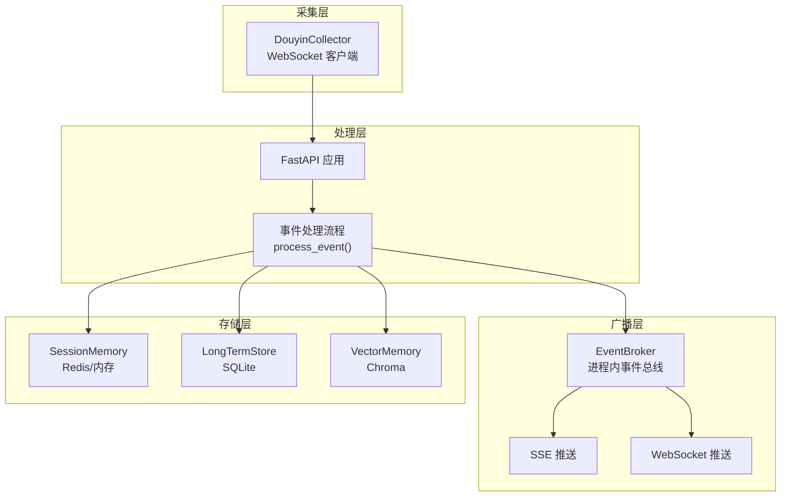
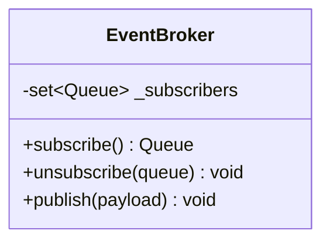
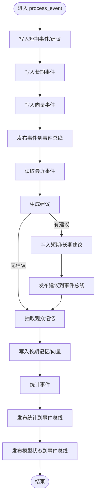
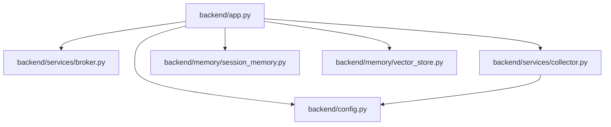
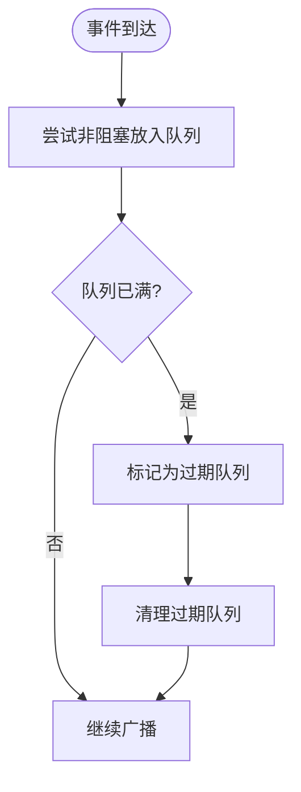
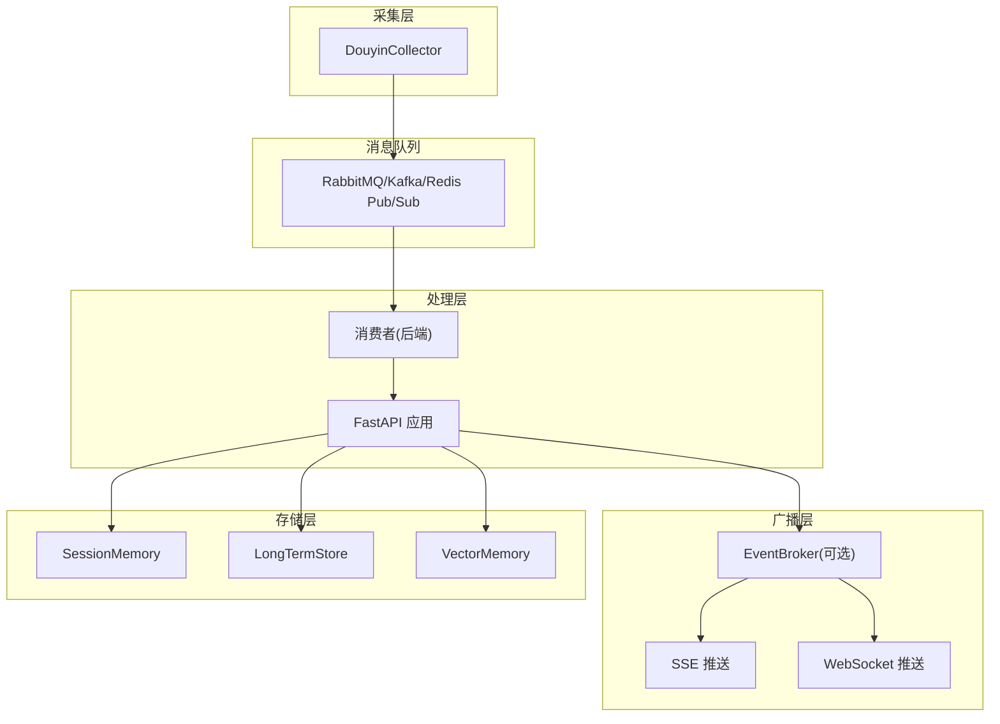

# 消息队列集成

<cite>
**本文引用的文件**
- [backend/app.py](file://backend/app.py)
- [backend/services/broker.py](file://backend/services/broker.py)
- [backend/services/collector.py](file://backend/services/collector.py)
- [backend/schemas/live.py](file://backend/schemas/live.py)
- [backend/config.py](file://backend/config.py)
- [backend/memory/session_memory.py](file://backend/memory/session_memory.py)
- [backend/memory/vector_store.py](file://backend/memory/vector_store.py)
- [requirements.txt](file://requirements.txt)
- [README.md](file://README.md)
</cite>

## 目录
1. [简介](#简介)
2. [项目结构](#项目结构)
3. [核心组件](#核心组件)
4. [架构总览](#架构总览)
5. [详细组件分析](#详细组件分析)
6. [依赖关系分析](#依赖关系分析)
7. [性能考量](#性能考量)
8. [故障恢复与背压控制](#故障恢复与背压控制)
9. [消息序列化与版本管理](#消息序列化与版本管理)
10. [监控与告警](#监控与告警)
11. [迁移至分布式消息队列的建议](#迁移至分布式消息队列的建议)
12. [结论](#结论)

## 简介
本文件面向 DouYin_llm 项目的消息队列与事件异步处理架构，聚焦于事件总线的设计与实现、消息序列化与版本管理、背压控制、故障恢复与幂等性处理、以及监控告警配置。当前项目采用进程内事件广播器与 SSE/WebSocket 实时推送，未集成 RabbitMQ、Apache Kafka 或 Redis Pub/Sub。本文在不改变现有实现的前提下，提供可扩展的架构建议与最佳实践，便于未来演进到分布式消息队列。

## 项目结构
后端采用 FastAPI 应用作为统一入口，事件采集、处理、存储与推送均围绕应用生命周期组织：
- 采集层：DouyinCollector 通过 WebSocket 接收原始事件，标准化为 LiveEvent，并提交到 asyncio 事件循环。
- 处理层：FastAPI 路由触发事件处理流程，写入短期/长期存储，生成建议与统计，发布到事件总线。
- 广播层：EventBroker 维护订阅队列，通过 SSE 与 WebSocket 推送到前端。
- 存储层：SessionMemory（Redis/内存）、LongTermStore（SQLite）、VectorMemory（Chroma）。



图表来源
- [backend/app.py:73-102](file://backend/app.py#L73-L102)
- [backend/services/collector.py:118-196](file://backend/services/collector.py#L118-L196)
- [backend/services/broker.py:10-39](file://backend/services/broker.py#L10-L39)
- [backend/memory/session_memory.py:17-113](file://backend/memory/session_memory.py#L17-L113)
- [backend/memory/vector_store.py:59-317](file://backend/memory/vector_store.py#L59-L317)

章节来源
- [backend/app.py:1-285](file://backend/app.py#L1-L285)
- [backend/services/collector.py:1-266](file://backend/services/collector.py#L1-L266)
- [backend/services/broker.py:1-40](file://backend/services/broker.py#L1-L40)
- [backend/memory/session_memory.py:1-113](file://backend/memory/session_memory.py#L1-L113)
- [backend/memory/vector_store.py:1-317](file://backend/memory/vector_store.py#L1-L317)
- [README.md:1-223](file://README.md#L1-L223)

## 核心组件
- 事件总线 EventBroker：维护订阅队列集合，提供订阅/取消订阅与广播方法，用于将事件分发给 SSE/WebSocket 订阅者。
- 事件处理流程 process_event：接收 LiveEvent，写入短期/长期存储，生成建议与统计，发布到事件总线。
- 采集器 DouyinCollector：连接本地 WebSocket，标准化消息为 LiveEvent，通过 asyncio.run_coroutine_threadsafe 提交到后端事件循环。
- 数据模型 LiveEvent：统一的直播事件结构，包含事件标识、来源房间、用户信息、内容与元数据。
- 配置 Settings：集中管理运行参数，包括采集器地址、Redis URL、会话 TTL、LLM 参数等。

章节来源
- [backend/services/broker.py:10-39](file://backend/services/broker.py#L10-L39)
- [backend/app.py:73-102](file://backend/app.py#L73-L102)
- [backend/services/collector.py:38-196](file://backend/services/collector.py#L38-L196)
- [backend/schemas/live.py:29-44](file://backend/schemas/live.py#L29-L44)
- [backend/config.py:40-113](file://backend/config.py#L40-L113)

## 架构总览
当前架构采用“采集 -> 处理 -> 广播 -> 前端”的同步链路，事件在后端内部完成持久化与计算后，通过 SSE/WebSocket 实时推送。该模式具备低延迟与简单部署的优势，但在高并发场景下可能面临背压与资源竞争问题。

```mermaid
sequenceDiagram
participant Tool as "采集器(douyinLive)"
participant Collector as "DouyinCollector"
participant Loop as "Asyncio 事件循环"
participant App as "FastAPI 应用"
participant Broker as "EventBroker"
participant Frontend as "前端(SSE/WebSocket)"
Tool->>Collector : "WebSocket 消息"
Collector->>Collector : "标准化为 LiveEvent"
Collector->>Loop : "run_coroutine_threadsafe(process_event)"
Loop->>App : "调度 process_event()"
App->>App : "写入短期/长期存储"
App->>Broker : "publish(event_envelope)"
Broker-->>Frontend : "SSE/WebSocket 推送"
```

图表来源
- [backend/services/collector.py:118-196](file://backend/services/collector.py#L118-L196)
- [backend/app.py:73-102](file://backend/app.py#L73-L102)
- [backend/services/broker.py:28-39](file://backend/services/broker.py#L28-L39)
- [backend/app.py:252-285](file://backend/app.py#L252-L285)

## 详细组件分析

### 事件总线 EventBroker
- 订阅管理：每个订阅者获得一个 asyncio.Queue，EventBroker 维护集合以便广播。
- 广播策略：遍历订阅队列，尝试非阻塞放入；若队列满则标记为“过期”，随后清理。
- 取消订阅：支持主动取消，避免僵尸队列占用资源。



图表来源
- [backend/services/broker.py:10-39](file://backend/services/broker.py#L10-L39)

章节来源
- [backend/services/broker.py:10-39](file://backend/services/broker.py#L10-L39)

### 事件处理流程 process_event
- 输入：LiveEvent
- 处理步骤：
  - 写入短期事件与建议（SessionMemory）
  - 写入长期事件（LongTermStore）
  - 写入向量事件（VectorMemory）
  - 发布事件到事件总线
  - 生成建议并写入存储
  - 发布建议到事件总线
  - 抽取观众记忆并写入存储
  - 发布统计与模型状态到事件总线



图表来源
- [backend/app.py:73-102](file://backend/app.py#L73-L102)

章节来源
- [backend/app.py:73-102](file://backend/app.py#L73-L102)

### 采集器 DouyinCollector
- 连接与心跳：建立 WebSocket 连接，按配置周期发送 ping。
- 消息解析：JSON 解析失败则忽略；标准化为 LiveEvent。
- 事件提交：通过 asyncio.run_coroutine_threadsafe 将事件处理协程提交到后端事件循环。
- 错误与重连：捕获异常并按配置延迟重连；停止时清理资源。

```mermaid
sequenceDiagram
participant Thread as "采集线程"
participant WS as "WebSocket"
participant Handler as "event_handler"
participant Loop as "Asyncio 事件循环"
Thread->>WS : "run_forever(ping_interval)"
WS-->>Thread : "on_message"
Thread->>Thread : "normalize_event"
Thread->>Loop : "run_coroutine_threadsafe(Handler)"
Loop-->>Thread : "回调日志"
WS-->>Thread : "on_error/on_close"
Thread->>Thread : "sleep(重连延迟)"
```

图表来源
- [backend/services/collector.py:118-196](file://backend/services/collector.py#L118-L196)

章节来源
- [backend/services/collector.py:38-266](file://backend/services/collector.py#L38-L266)

### 数据模型 LiveEvent
- 字段：事件标识、房间标识、来源房间、会话标识、平台、事件类型、方法、标题、时间戳、用户信息、内容、元数据、原始数据。
- 用途：作为采集、处理、存储与推送的统一载体。

章节来源
- [backend/schemas/live.py:29-44](file://backend/schemas/live.py#L29-L44)

## 依赖关系分析
- FastAPI 应用依赖 EventBroker、SessionMemory、LongTermStore、VectorMemory、LivePromptAgent、DouyinCollector。
- EventBroker 仅依赖 asyncio，无外部耦合。
- SessionMemory 可选依赖 Redis；VectorMemory 可选依赖 Chroma。
- Collector 依赖 websocket-client 与 asyncio。



图表来源
- [backend/app.py:13-35](file://backend/app.py#L13-L35)
- [backend/services/collector.py:16-17](file://backend/services/collector.py#L16-L17)
- [backend/config.py:40-113](file://backend/config.py#L40-L113)
- [backend/memory/session_memory.py:17-31](file://backend/memory/session_memory.py#L17-L31)
- [backend/memory/vector_store.py:59-74](file://backend/memory/vector_store.py#L59-L74)

章节来源
- [requirements.txt:1-6](file://requirements.txt#L1-L6)
- [backend/app.py:13-35](file://backend/app.py#L13-L35)

## 性能考量
- 事件总线广播：EventBroker 使用非阻塞 put_nowait，队列满时标记并清理，避免阻塞主线程。
- SSE/WebSocket 订阅：前端通过 EventSource 与 WebSocket 订阅，连接状态与重连逻辑在前端实现。
- 存储层优化：
  - SessionMemory 使用 Redis 列表与 ltrim 控制长度，结合 TTL 清理过期数据。
  - VectorMemory 在可用时使用 Chroma，否则回退到内存索引，降低外部依赖风险。
- 采集器线程：采集器在独立线程中运行，通过 asyncio.run_coroutine_threadsafe 与事件循环解耦。

章节来源
- [backend/services/broker.py:28-39](file://backend/services/broker.py#L28-L39)
- [backend/memory/session_memory.py:42-84](file://backend/memory/session_memory.py#L42-L84)
- [backend/memory/vector_store.py:59-84](file://backend/memory/vector_store.py#L59-L84)
- [backend/services/collector.py:118-196](file://backend/services/collector.py#L118-L196)

## 故障恢复与背压控制

### 背压控制
- 队列长度控制：EventBroker 广播时检测队列满，标记过期队列并清理，防止堆积。
- 订阅者限速：前端通过 EventSource 的 retry 与连接状态切换，实现客户端侧的退避与重连。
- 采集端退避：采集器在断线后按配置延迟重连，避免频繁重试。



图表来源
- [backend/services/broker.py:28-39](file://backend/services/broker.py#L28-L39)

章节来源
- [backend/services/broker.py:28-39](file://backend/services/broker.py#L28-L39)
- [backend/app.py:252-285](file://backend/app.py#L252-L285)
- [backend/services/collector.py:137-139](file://backend/services/collector.py#L137-L139)

### 故障恢复
- 采集器错误处理：捕获异常并记录日志，按配置延迟重连；停止时安全关闭连接与线程。
- 事件处理异常：采集器对事件处理结果进行回调日志，便于定位失败原因。
- 健康检查：/health 接口返回运行状态与当前房间信息，辅助运维监控。

章节来源
- [backend/services/collector.py:118-196](file://backend/services/collector.py#L118-L196)
- [backend/app.py:129-135](file://backend/app.py#L129-L135)

### 幂等性处理
- 当前实现未显式引入消息去重或幂等键。建议在引入分布式消息队列时：
  - 为每条事件生成唯一 ID（event_id），并在消费端基于 ID 去重。
  - 在存储层增加事件 ID 的唯一约束或查询缓存，避免重复写入。

章节来源
- [backend/schemas/live.py:32-33](file://backend/schemas/live.py#L32-L33)
- [backend/memory/long_term.py:456-475](file://backend/memory/long_term.py#L456-L475)

## 消息序列化与版本管理
- 序列化格式：事件在传输与存储中使用 JSON；SessionMemory 与 VectorMemory 使用 Pydantic 的 model_dump_json/model_validate_json。
- 版本管理：当前未定义事件版本字段。建议在 LiveEvent 中增加 version 字段，配合前端与后端的兼容策略，实现平滑升级。

章节来源
- [backend/memory/session_memory.py:46-59](file://backend/memory/session_memory.py#L46-L59)
- [backend/memory/vector_store.py:164-170](file://backend/memory/vector_store.py#L164-L170)
- [backend/schemas/live.py:29-44](file://backend/schemas/live.py#L29-L44)

## 监控与告警
- 日志：采集器与事件处理流程广泛使用 logging，便于问题排查。
- 健康检查：/health 接口返回状态与活动会话信息。
- 观测建议：
  - 引入指标：事件吞吐、处理耗时、队列长度、订阅者数量、采集器连接状态。
  - 告警策略：队列积压阈值、采集器断线、事件处理异常率、模型推理失败率。
  - 链路追踪：为事件处理流程添加 trace_id，便于跨服务定位问题。

章节来源
- [backend/services/collector.py:118-196](file://backend/services/collector.py#L118-L196)
- [backend/app.py:129-135](file://backend/app.py#L129-L135)

## 迁移至分布式消息队列的建议

### 选择与配置
- RabbitMQ：适合需要可靠投递、死信队列、优先级队列与复杂路由的场景。
- Apache Kafka：适合高吞吐、持久化与流式处理，支持分区与副本。
- Redis Pub/Sub：适合轻量级、低延迟的发布/订阅场景，但可靠性与持久化较弱。

章节来源
- [requirements.txt:1-6](file://requirements.txt#L1-L6)

### 集成方案
- 事件总线替换：将 EventBroker 的订阅/广播替换为消息队列的发布/订阅，保留前端 SSE/WebSocket 接口不变。
- 采集器改造：采集器不再直接提交到 asyncio，而是发布到消息队列；后端消费者从队列拉取事件并处理。
- 存储与推送：事件处理完成后，仍可将事件、建议、统计与模型状态发布到消息队列，前端通过 SSE/WebSocket 订阅。



图表来源
- [backend/services/collector.py:182-188](file://backend/services/collector.py#L182-L188)
- [backend/app.py:73-102](file://backend/app.py#L73-L102)
- [backend/services/broker.py:10-39](file://backend/services/broker.py#L10-L39)

### 背压与扩展
- 消息速率限制：在生产端设置发送速率上限，消费端按能力处理。
- 队列长度控制：为不同事件类型设置最大队列长度，避免单类事件压垮系统。
- 消费者扩展：根据事件类型与处理耗时，水平扩展消费者实例，实现分区消费。

### 故障恢复
- 重试策略：对可恢复错误进行指数退避重试，超过阈值进入死信队列。
- 死信队列：将无法处理的事件转移到死信队列，人工介入处理。
- 幂等性：基于事件 ID 去重，确保重复消费不产生副作用。

### 监控与告警
- 指标：队列长度、消息积压、消费者 lag、处理失败率、重试次数。
- 告警：队列积压超过阈值、消费者 lag 持续增长、处理失败率上升。

## 结论
当前 DouYin_llm 采用进程内事件总线与 SSE/WebSocket 实时推送，满足低延迟与简单部署的需求。随着业务规模扩大，建议逐步引入分布式消息队列，以提升可靠性、扩展性与可观测性。在迁移过程中，保持前端接口不变，优先完善背压控制、故障恢复与监控告警体系，确保平滑过渡与稳定运行。