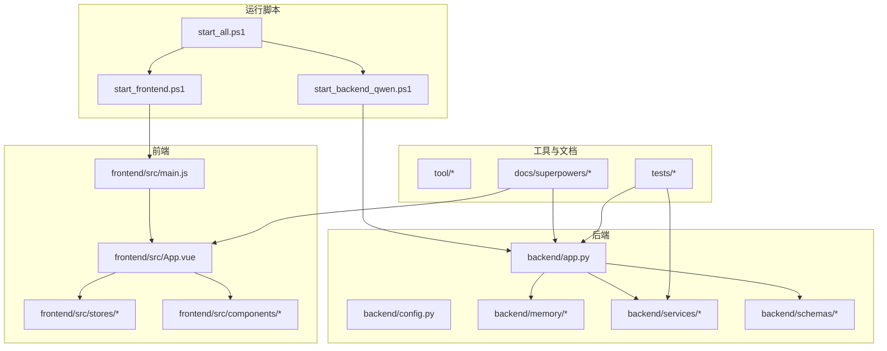
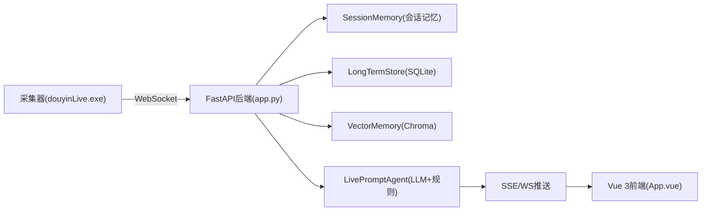
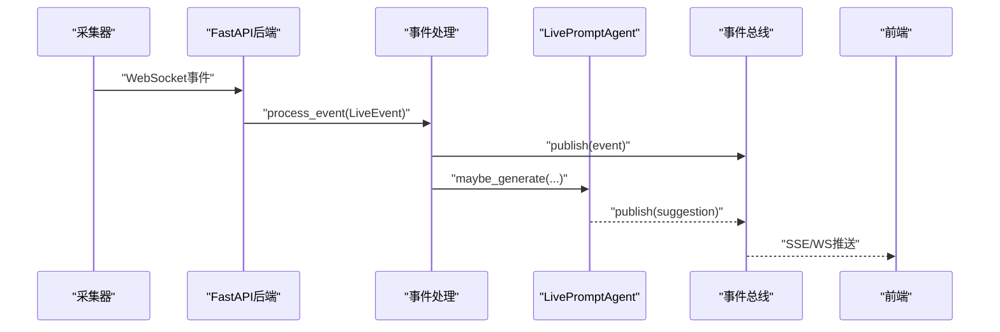
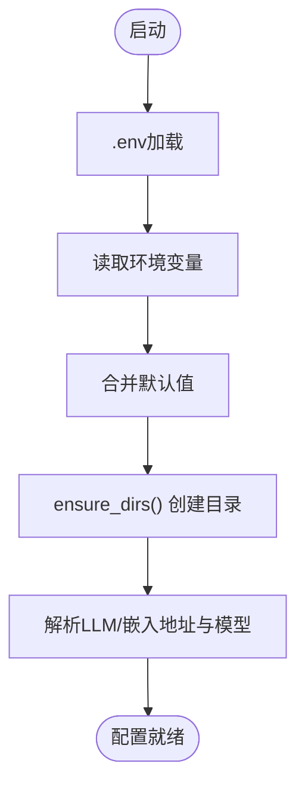
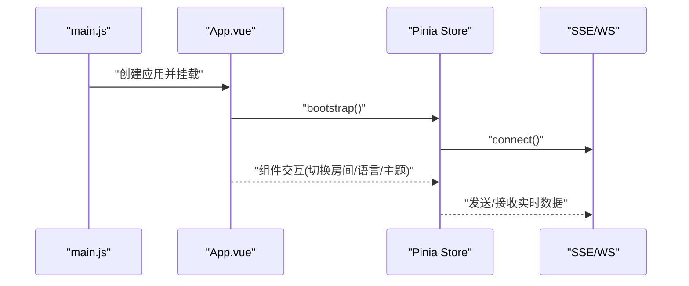
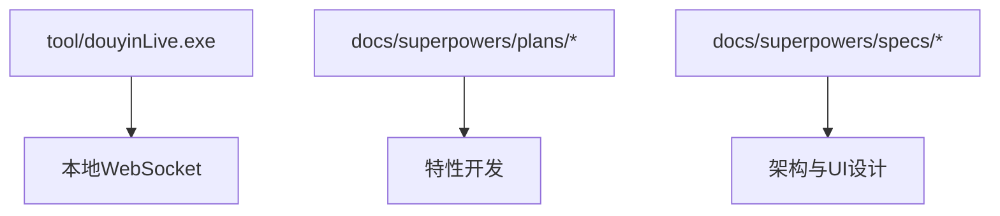
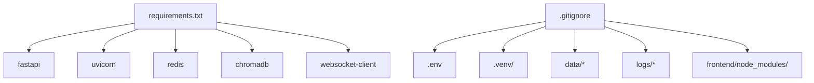

# 团队协作

<cite>
**本文引用的文件**
- [README.md](file://README.md)
- [USAGE.md](file://USAGE.md)
- [requirements.txt](file://requirements.txt)
- [start_all.ps1](file://start_all.ps1)
- [start_frontend.ps1](file://start_frontend.ps1)
- [start_backend_qwen.ps1](file://start_backend_qwen.ps1)
- [backend/app.py](file://backend/app.py)
- [backend/config.py](file://backend/config.py)
- [frontend/src/App.vue](file://frontend/src/App.vue)
- [frontend/src/main.js](file://frontend/src/main.js)
- [.gitignore](file://.gitignore)
- [docs/superpowers/plans/2026-04-12-viewer-workbench.md](file://docs/superpowers/plans/2026-04-12-viewer-workbench.md)
- [docs/superpowers/specs/2026-04-13-frontend-locale-toggle-design.md](file://docs/superpowers/specs/2026-04-13-frontend-locale-toggle-design.md)
- [tests/test_agent.py](file://tests/test_agent.py)
</cite>

## 目录
1. [简介](#简介)
2. [项目结构](#项目结构)
3. [核心组件](#核心组件)
4. [架构总览](#架构总览)
5. [详细组件分析](#详细组件分析)
6. [依赖关系分析](#依赖关系分析)
7. [性能考量](#性能考量)
8. [故障排查指南](#故障排查指南)
9. [结论](#结论)
10. [附录](#附录)

## 简介
本指南面向DouYin_llm项目的团队协作与日常运营，围绕以下目标展开：建立规范的代码审查流程（Pull Request模板、审查清单与反馈机制）、制定版本控制规范（分支策略、提交信息规范与标签管理）、设计知识分享机制（技术分享会、文档维护与经验总结）、完善项目管理流程（需求管理、任务分配与进度跟踪）、明确沟通协作工具（即时通讯、文档协作与会议管理），以及提供新成员入职指导（环境搭建、角色职责与学习路径）。  
本项目是一个面向抖音直播间的实时提词工作栈，包含本地采集工具、FastAPI后端与Vue 3前端，支持事件采集、语义记忆、LLM/规则双通道提词与多面板前端展示。

## 项目结构
项目采用前后端分离与功能模块化组织，后端以FastAPI为核心，前端以Vue 3 + Pinia为主，工具与文档分别位于独立目录，便于版本控制与协作。

图表来源
- [backend/app.py:1-285](file://backend/app.py#L1-L285)
- [backend/config.py:1-113](file://backend/config.py#L1-L113)
- [frontend/src/App.vue:1-139](file://frontend/src/App.vue#L1-L139)
- [frontend/src/main.js:1-17](file://frontend/src/main.js#L1-L17)
- [start_all.ps1:1-18](file://start_all.ps1#L1-L18)
- [start_backend_qwen.ps1:1-13](file://start_backend_qwen.ps1#L1-L13)
- [start_frontend.ps1:1-22](file://start_frontend.ps1#L1-L22)
- [docs/superpowers/plans/2026-04-12-viewer-workbench.md:1-550](file://docs/superpowers/plans/2026-04-12-viewer-workbench.md#L1-L550)
- [docs/superpowers/specs/2026-04-13-frontend-locale-toggle-design.md:1-121](file://docs/superpowers/specs/2026-04-13-frontend-locale-toggle-design.md#L1-L121)

章节来源
- [README.md:32-44](file://README.md#L32-L44)
- [USAGE.md:15-256](file://USAGE.md#L15-L256)
- [requirements.txt:1-6](file://requirements.txt#L1-L6)
- [start_all.ps1:1-18](file://start_all.ps1#L1-L18)
- [start_frontend.ps1:1-22](file://start_frontend.ps1#L1-L22)
- [start_backend_qwen.ps1:1-13](file://start_backend_qwen.ps1#L1-L13)

## 核心组件
- 后端应用入口与路由：提供健康检查、事件流、WebSocket、房间切换、观众详情与笔记、LLM设置等接口，贯穿事件采集、记忆写入、提词生成与实时推送。
- 配置模块：集中管理运行时配置，支持环境变量与.env文件，提供目录确保、LLM与嵌入解析等能力。
- 前端应用与状态：通过Pinia统一管理事件流、过滤器、主题/语言、ViewerWorkbench与LLM设置状态，组件化展示状态条、提词卡、事件流与工作台。
- 工具与文档：采集器可执行文件与配置示例，设计稿与实施计划文档，支撑需求到实现的闭环。
- 测试体系：Python单元测试与前端Node测试，覆盖Agent逻辑、嵌入服务、向量存储、长程记忆与空房间引导等。

章节来源
- [backend/app.py:129-285](file://backend/app.py#L129-L285)
- [backend/config.py:40-113](file://backend/config.py#L40-L113)
- [frontend/src/App.vue:1-139](file://frontend/src/App.vue#L1-L139)
- [frontend/src/main.js:1-17](file://frontend/src/main.js#L1-L17)
- [docs/superpowers/plans/2026-04-12-viewer-workbench.md:1-550](file://docs/superpowers/plans/2026-04-12-viewer-workbench.md#L1-L550)
- [tests/test_agent.py:1-176](file://tests/test_agent.py#L1-L176)

## 架构总览
系统采用“采集-事件-记忆-提词-推送-前端展示”的端到端流水线，后端负责事件归一化、持久化、记忆抽取、提词生成与SSE/WebSocket推送，前端通过Pinia Store与组件展示实时状态与建议。

图表来源
- [README.md:7-17](file://README.md#L7-L17)
- [backend/app.py:73-102](file://backend/app.py#L73-L102)
- [frontend/src/App.vue:67-104](file://frontend/src/App.vue#L67-L104)

章节来源
- [README.md:5-31](file://README.md#L5-L31)

## 详细组件分析

### 后端应用与路由（FastAPI）
- 职责：提供健康检查、房间切换、事件注入、观众详情/笔记、LLM设置、SSE与WebSocket等接口，串联事件处理、记忆写入与提词生成。
- 关键流程：事件进入后写入会话/长程记忆与向量库，触发Agent生成建议并通过事件总线广播；前端通过SSE/WS订阅实时状态。
- 错误处理：对缺失参数与资源不存在进行HTTP异常返回，便于前端与工具层识别。

图表来源
- [backend/app.py:73-102](file://backend/app.py#L73-L102)
- [backend/app.py:252-285](file://backend/app.py#L252-L285)

章节来源
- [backend/app.py:129-285](file://backend/app.py#L129-L285)

### 配置模块（Settings）
- 职责：集中加载环境变量与.env，提供默认值与目录确保，解析LLM与嵌入服务地址与模型名，支持嵌入签名生成。
- 优先级：.env > 环境变量 > 代码默认值，确保本地开箱即用。

图表来源
- [backend/config.py:12-37](file://backend/config.py#L12-L37)
- [backend/config.py:77-113](file://backend/config.py#L77-L113)

章节来源
- [backend/config.py:1-113](file://backend/config.py#L1-L113)

### 前端应用与状态（Pinia + 组件）
- 职责：统一管理房间号、过滤器、主题/语言、ViewerWorkbench与LLM设置状态；组件化渲染状态条、提词卡、事件流与工作台。
- 生命周期：应用挂载时bootstrap并建立SSE连接，卸载时关闭连接，避免资源泄露。

图表来源
- [frontend/src/main.js:1-17](file://frontend/src/main.js#L1-L17)
- [frontend/src/App.vue:47-64](file://frontend/src/App.vue#L47-L64)

章节来源
- [frontend/src/App.vue:1-139](file://frontend/src/App.vue#L1-L139)
- [frontend/src/main.js:1-17](file://frontend/src/main.js#L1-L17)

### 工具与文档（采集器与设计计划）
- 采集器：提供Windows可执行文件与配置示例，作为本地WebSocket事件源。
- 设计与计划：docs/superpowers下包含前端设计稿与实施计划，用于特性驱动开发与任务拆解。

图表来源
- [docs/superpowers/plans/2026-04-12-viewer-workbench.md:1-550](file://docs/superpowers/plans/2026-04-12-viewer-workbench.md#L1-L550)
- [docs/superpowers/specs/2026-04-13-frontend-locale-toggle-design.md:1-121](file://docs/superpowers/specs/2026-04-13-frontend-locale-toggle-design.md#L1-L121)

章节来源
- [docs/superpowers/plans/2026-04-12-viewer-workbench.md:1-550](file://docs/superpowers/plans/2026-04-12-viewer-workbench.md#L1-L550)
- [docs/superpowers/specs/2026-04-13-frontend-locale-toggle-design.md:1-121](file://docs/superpowers/specs/2026-04-13-frontend-locale-toggle-design.md#L1-L121)

### 测试体系（Python与前端）
- Python测试：覆盖Agent逻辑、嵌入服务、向量存储、长程记忆与空房间引导，确保核心流程稳定。
- 前端测试：基于Node的smoke测试，验证Store状态与API交互。

章节来源
- [tests/test_agent.py:1-176](file://tests/test_agent.py#L1-L176)

## 依赖关系分析
- 运行时依赖：FastAPI、Uvicorn、Redis、Chroma、WebSocket客户端等，通过requirements.txt统一管理。
- 版本控制忽略：.env、虚拟环境、数据目录与日志文件均纳入.gitignore，避免污染仓库。

图表来源
- [requirements.txt:1-6](file://requirements.txt#L1-L6)
- [.gitignore:1-19](file://.gitignore#L1-L19)

章节来源
- [requirements.txt:1-6](file://requirements.txt#L1-L6)
- [.gitignore:1-19](file://.gitignore#L1-L19)

## 性能考量
- 事件吞吐：后端通过异步事件循环与事件总线实现高并发事件处理与实时推送。
- 记忆与检索：会话记忆短时缓存、长程记忆持久化、向量记忆支持相似度检索，合理配置阈值与召回数量以平衡准确与延迟。
- LLM调用：在超时或失败时自动回退至启发式规则，保障稳定性；可通过调整温度、最大token与超时参数优化体验。
- 前端渲染：组件化与Pinia状态管理降低重复渲染，SSE/WS按房间过滤减少无效推送。

## 故障排查指南
- 页面无建议：检查采集器是否启动、房间ID是否正确、后端是否连接到WebSocket、网络是否可达。
- 顶部显示回退：检查模型密钥、网络访问与限流情况。
- 前端无法打开：检查前端脚本是否正常、端口占用情况。
- 后端未写入数据：确认采集器运行、后端日志连接状态与直播开播状态。
- 日志与数据：后端日志与采集器日志位于logs目录，数据库与向量索引位于data目录。

章节来源
- [USAGE.md:179-256](file://USAGE.md#L179-L256)
- [README.md:193-213](file://README.md#L193-L213)

## 结论
本指南基于现有代码与文档，提出了团队协作与项目管理的实践框架。建议结合项目实际逐步落地：以设计与计划文档驱动开发，以测试保障质量，以规范的版本控制与审查流程提升交付效率与可维护性。

## 附录

### 团队协作与流程规范（建议）

- 代码审查流程
  - Pull Request模板：包含变更摘要、影响范围、测试覆盖、风险评估与迁移说明。
  - 审查清单：是否满足需求、是否引入破坏性变更、是否通过测试、是否更新文档、是否考虑性能与安全。
  - 反馈机制：审查意见需明确、可追踪，采用“待修改”状态推进直至解决。

- 版本控制规范
  - 分支策略：主干保护、特性分支、修复分支；发布前通过主干合并。
  - 提交信息规范：类型+模块+简述，必要时补充动机与影响；示例格式参考业界最佳实践。
  - 标签管理：按版本打标签，记录变更摘要与升级要点。

- 知识分享机制
  - 技术分享会：定期组织设计评审、实现分享与问题复盘。
  - 文档维护：设计稿、实施计划与使用说明同步更新，确保可追溯。
  - 经验总结：形成问题清单与解决方案库，沉淀最佳实践。

- 项目管理流程
  - 需求管理：以设计与计划文档为依据，明确验收标准与里程碑。
  - 任务分配：采用看板或任务系统，明确负责人、截止日期与依赖关系。
  - 进度跟踪：每日站会、迭代回顾与燃尽图，持续改进交付节奏。

- 沟通协作工具
  - 即时通讯：统一沟通渠道，明确响应时效与公开透明。
  - 文档协作：共享文档与知识库，版本化管理，权限清晰。
  - 会议管理：会议纪要与行动项跟踪，确保决议落地。

- 新成员入职指导
  - 环境搭建：提供一键启动脚本与依赖安装指引，确保本地可运行。
  - 角色职责：明确岗位职责与协作边界，建立导师制度。
  - 学习路径：从README到USAGE，再到核心模块与测试，循序渐进掌握系统。

章节来源
- [README.md:1-223](file://README.md#L1-L223)
- [USAGE.md:1-256](file://USAGE.md#L1-L256)
- [docs/superpowers/plans/2026-04-12-viewer-workbench.md:1-550](file://docs/superpowers/plans/2026-04-12-viewer-workbench.md#L1-L550)
- [docs/superpowers/specs/2026-04-13-frontend-locale-toggle-design.md:1-121](file://docs/superpowers/specs/2026-04-13-frontend-locale-toggle-design.md#L1-L121)